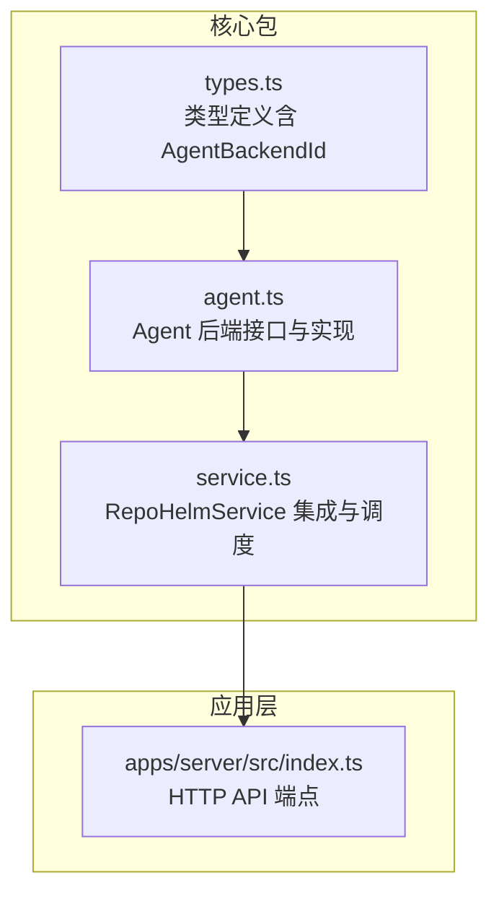
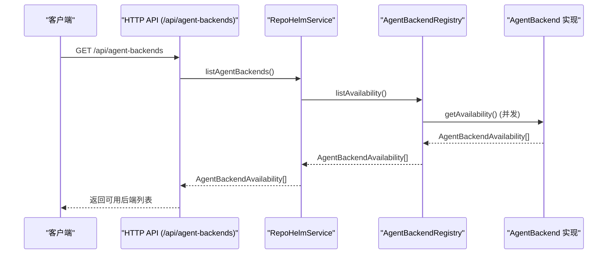
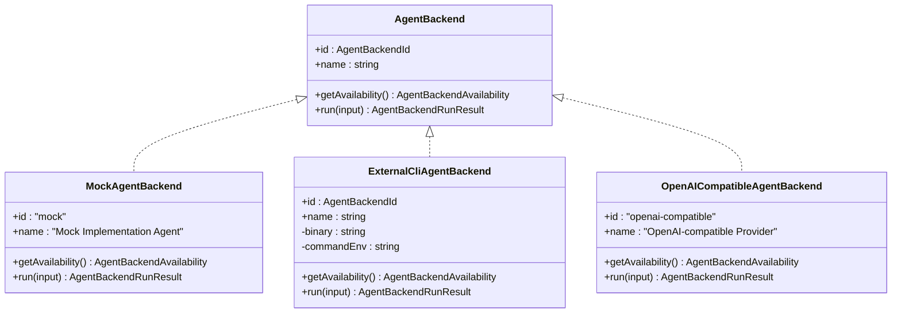
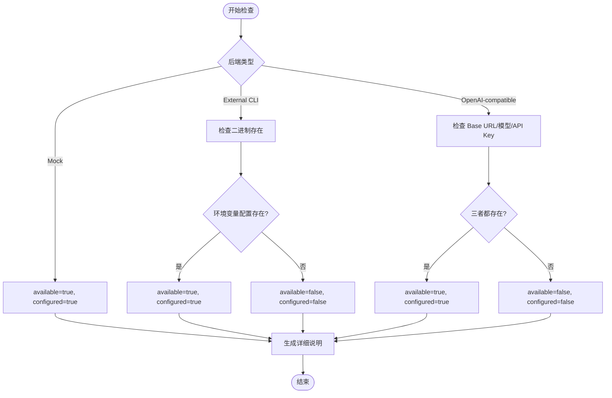
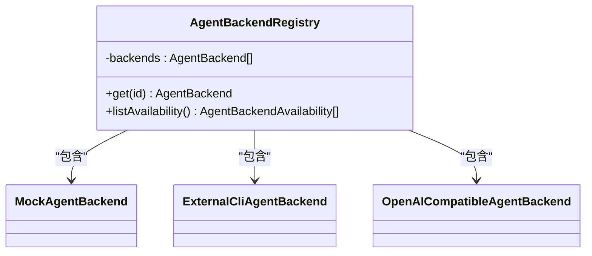
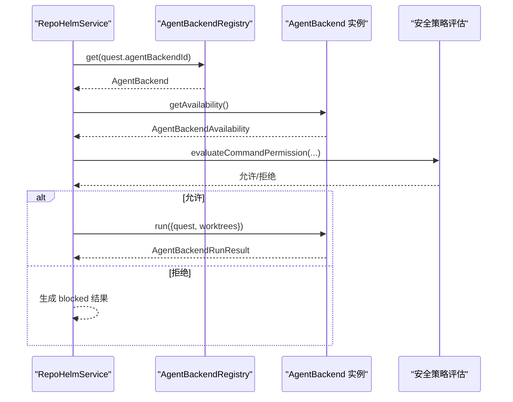
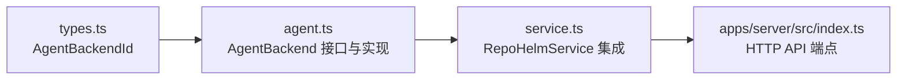

# Agent 后端抽象设计

<cite>
**本文档引用的文件**
- [agent.ts](file://packages/core/src/agent.ts)
- [types.ts](file://packages/core/src/types.ts)
- [service.ts](file://packages/core/src/service.ts)
- [index.ts](file://apps/server/src/index.ts)
</cite>

## 目录
1. [简介](#简介)
2. [项目结构](#项目结构)
3. [核心组件](#核心组件)
4. [架构概览](#架构概览)
5. [详细组件分析](#详细组件分析)
6. [依赖关系分析](#依赖关系分析)
7. [性能考虑](#性能考虑)
8. [故障排除指南](#故障排除指南)
9. [结论](#结论)
10. [附录](#附录)

## 简介
本文件详细阐述 RepoHelm Agent 后端抽象设计，重点解析 AgentBackend 接口的设计理念与核心方法定义，包括 getAvailability() 和 run() 方法的作用与返回值；解释 AgentBackendId 类型系统与各种后端标识符的含义；说明 AgentBackendAvailability 接口中的可用性检查机制；提供 AgentBackendRegistry 注册表的工作原理与扩展机制；并给出具体的接口实现示例与最佳实践指南。

## 项目结构
RepoHelm 的 Agent 后端抽象位于 packages/core/src 目录下，主要涉及以下文件：
- agent.ts：定义 AgentBackend 接口、可用性接口、运行输入/输出接口以及具体实现类（MockAgentBackend、ExternalCliAgentBackend、OpenAICompatibleAgentBackend）和注册表（AgentBackendRegistry）
- types.ts：定义 AgentBackendId 类型及相关的数据结构
- service.ts：RepoHelmService 中集成 AgentBackendRegistry 并在执行 Quest 时调用后端
- index.ts（服务端）：提供 /api/agent-backends 端点以列出可用的 Agent 后端

**图表来源**
- [agent.ts:1-436](file://packages/core/src/agent.ts#L1-L436)
- [types.ts:14-15](file://packages/core/src/types.ts#L14-L15)
- [service.ts:56-141](file://packages/core/src/service.ts#L56-L141)
- [index.ts:130-133](file://apps/server/src/index.ts#L130-L133)

**章节来源**
- [agent.ts:1-436](file://packages/core/src/agent.ts#L1-L436)
- [types.ts:14-15](file://packages/core/src/types.ts#L14-L15)
- [service.ts:56-141](file://packages/core/src/service.ts#L56-L141)
- [index.ts:130-133](file://apps/server/src/index.ts#L130-L133)

## 核心组件
本节聚焦于 AgentBackend 抽象设计的核心要素：接口定义、类型系统、可用性检查与运行流程。

- AgentBackend 接口
  - id: AgentBackendId，唯一标识后端
  - name: string，人类可读名称
  - getAvailability(): Promise<AgentBackendAvailability>，检查后端可用性与配置状态
  - run(input: AgentBackendRunInput): Promise<AgentBackendRunResult>，执行实际的实现任务

- AgentBackendAvailability
  - id: AgentBackendId
  - name: string
  - available: boolean，后端是否可用
  - configured: boolean，后端是否已正确配置
  - command?: string，用于执行的命令或基础 URL
  - detail: string，详细的可用性说明

- AgentBackendRunInput
  - quest: Quest，当前 Quest 对象
  - worktrees: WorktreeState[]，已创建的 Git worktree 列表

- AgentBackendRunResult
  - status: "completed" | "blocked" | "failed"
  - summary: string，简要摘要
  - events: 数组，包含事件类型、标题、详情与来源 Agent

- AgentBackendId 类型系统
  - "mock" | "codex-cli" | "claude-code" | "opencode" | "openai-compatible"
  - 用于区分内置 Mock 后端、外部 CLI 后端与 OpenAI 兼容 Provider 后端

**章节来源**
- [agent.ts:16-46](file://packages/core/src/agent.ts#L16-L46)
- [types.ts:14-15](file://packages/core/src/types.ts#L14-L15)

## 架构概览
Agent 后端抽象采用接口驱动与注册表模式，RepoHelmService 在执行 Quest 时根据配置选择合适的 AgentBackend 实现，并通过统一的可用性检查与运行接口完成工作流。

**图表来源**
- [index.ts:130-133](file://apps/server/src/index.ts#L130-L133)
- [service.ts:139-141](file://packages/core/src/service.ts#L139-L141)
- [agent.ts:395-411](file://packages/core/src/agent.ts#L395-L411)

## 详细组件分析

### AgentBackend 接口与实现
- 接口职责
  - getAvailability：用于在执行前进行可用性检查，决定是否允许执行
  - run：执行实际的实现任务，生成事件与结果

- 具体实现
  - MockAgentBackend：内置实现，总是可用，用于验证工作流闭环
  - ExternalCliAgentBackend：外部 CLI 后端，通过环境变量配置命令模板
  - OpenAICompatibleAgentBackend：OpenAI 兼容 Provider，通过 HTTP 调用生成实现产物

**图表来源**
- [agent.ts:41-46](file://packages/core/src/agent.ts#L41-L46)
- [agent.ts:48-115](file://packages/core/src/agent.ts#L48-L115)
- [agent.ts:117-259](file://packages/core/src/agent.ts#L117-L259)
- [agent.ts:261-393](file://packages/core/src/agent.ts#L261-L393)

**章节来源**
- [agent.ts:41-46](file://packages/core/src/agent.ts#L41-L46)
- [agent.ts:48-115](file://packages/core/src/agent.ts#L48-L115)
- [agent.ts:117-259](file://packages/core/src/agent.ts#L117-L259)
- [agent.ts:261-393](file://packages/core/src/agent.ts#L261-L393)

### AgentBackendId 类型系统
- 类型定义
  - "mock" | "codex-cli" | "claude-code" | "opencode" | "openai-compatible"
- 含义
  - mock：内置 Mock 后端，用于验证工作流
  - codex-cli/claude-code/opencode：外部 CLI 后端，分别对应不同命令
  - openai-compatible：OpenAI 兼容 Provider 后端

**章节来源**
- [types.ts:14-15](file://packages/core/src/types.ts#L14-L15)

### AgentBackendAvailability 可用性检查机制
- 字段含义
  - available：后端是否可用（通常由配置完整性决定）
  - configured：后端是否已正确配置（与 available 语义相近）
  - command：用于执行的命令或基础 URL（如 CLI 命令或 Provider Base URL）
  - detail：详细的可用性说明
- 检查逻辑
  - MockAgentBackend：始终可用且已配置
  - ExternalCliAgentBackend：检查二进制是否存在与环境变量配置
  - OpenAICompatibleAgentBackend：检查 Base URL、模型与 API Key 是否齐全

**图表来源**
- [agent.ts:52-60](file://packages/core/src/agent.ts#L52-L60)
- [agent.ts:125-142](file://packages/core/src/agent.ts#L125-L142)
- [agent.ts:265-280](file://packages/core/src/agent.ts#L265-L280)

**章节来源**
- [agent.ts:16-23](file://packages/core/src/agent.ts#L16-L23)
- [agent.ts:52-60](file://packages/core/src/agent.ts#L52-L60)
- [agent.ts:125-142](file://packages/core/src/agent.ts#L125-L142)
- [agent.ts:265-280](file://packages/core/src/agent.ts#L265-L280)

### AgentBackendRegistry 注册表与扩展机制
- 工作原理
  - 内置后端集合：Mock、多个 External CLI 后端、OpenAI 兼容后端
  - get(id)：根据 AgentBackendId 获取后端实例，不存在时回退到第一个（Mock）
  - listAvailability()：并发调用所有后端的 getAvailability()

- 扩展机制
  - 新增后端：在构造函数中添加新的 AgentBackend 实例
  - 自定义后端：实现 AgentBackend 接口并注入到注册表
  - 运行时选择：RepoHelmService 在执行 Quest 时通过配置选择后端

**图表来源**
- [agent.ts:395-411](file://packages/core/src/agent.ts#L395-L411)

**章节来源**
- [agent.ts:395-411](file://packages/core/src/agent.ts#L395-L411)

### RepoHelmService 中的集成与最佳实践
- 集成点
  - listAgentBackends()：通过 AgentBackendRegistry.listAvailability() 提供可用后端列表
  - runQuest()：根据 Quest.agentBackendId 获取后端，结合安全策略评估后执行

- 最佳实践
  - 在执行前调用 getAvailability() 进行预检
  - 将后端执行结果标准化为事件数组，便于审计与 UI 展示
  - 严格遵循安全策略，避免不受控的命令执行
  - 对外部 CLI 后端，确保命令模板与工作树路径正确传递

**图表来源**
- [service.ts:589-615](file://packages/core/src/service.ts#L589-L615)
- [service.ts:139-141](file://packages/core/src/service.ts#L139-L141)

**章节来源**
- [service.ts:589-615](file://packages/core/src/service.ts#L589-L615)
- [service.ts:139-141](file://packages/core/src/service.ts#L139-L141)

## 依赖关系分析
- 类型依赖
  - types.ts 定义 AgentBackendId，被 agent.ts 与 service.ts 引用
- 组件耦合
  - agent.ts 与 types.ts：强耦合（类型定义）
  - service.ts 与 agent.ts：中等耦合（通过接口与注册表交互）
  - apps/server/src/index.ts 与 service.ts：弱耦合（通过 HTTP API）

**图表来源**
- [types.ts:14-15](file://packages/core/src/types.ts#L14-L15)
- [agent.ts:41-46](file://packages/core/src/agent.ts#L41-L46)
- [service.ts:56-71](file://packages/core/src/service.ts#L56-L71)
- [index.ts:130-133](file://apps/server/src/index.ts#L130-L133)

**章节来源**
- [types.ts:14-15](file://packages/core/src/types.ts#L14-L15)
- [agent.ts:41-46](file://packages/core/src/agent.ts#L41-L46)
- [service.ts:56-71](file://packages/core/src/service.ts#L56-L71)
- [index.ts:130-133](file://apps/server/src/index.ts#L130-L133)

## 性能考虑
- 并发检查：AgentBackendRegistry.listAvailability() 并发调用各后端的 getAvailability()，提升响应速度
- 外部 CLI 调用：ExternalCliAgentBackend.run() 对每个工作树并行执行命令，充分利用多核资源
- 环境变量探测：ExternalCliAgentBackend 通过 process.env 读取配置，避免额外 IO
- Provider 调用：OpenAICompatibleAgentBackend 直接发起 HTTP 请求，注意超时与错误处理

[本节为通用性能讨论，无需特定文件来源]

## 故障排除指南
- 后端不可用
  - 检查环境变量配置（如 REPOHELM_CODEX_COMMAND、REPOHELM_OPENAI_BASE_URL 等）
  - 确认外部 CLI 二进制是否存在于 PATH
  - 查看 AgentBackendAvailability.detail 获取详细原因
- 执行被阻塞
  - 检查安全策略是否允许该命令
  - 确认是否有可执行的工作树（created 状态）
- 结果不一致
  - 核对 AgentBackendRunResult.events，定位失败事件
  - 检查工作树路径与权限

**章节来源**
- [agent.ts:144-182](file://packages/core/src/agent.ts#L144-L182)
- [agent.ts:282-313](file://packages/core/src/agent.ts#L282-L313)
- [service.ts:591-615](file://packages/core/src/service.ts#L591-L615)

## 结论
RepoHelm 的 Agent 后端抽象通过清晰的接口设计与注册表机制，实现了对多种实现后端的统一管理与调度。Mock、External CLI 与 OpenAI 兼容后端覆盖了从本地验证到云端模型的不同场景。配合安全策略与标准化事件输出，系统在保证可审计性的同时提供了良好的扩展性与可维护性。

[本节为总结性内容，无需特定文件来源]

## 附录

### 接口实现示例与最佳实践
- 实现自定义 AgentBackend
  - 实现 AgentBackend 接口，定义 id 与 name
  - 在 getAvailability() 中进行必要的环境检查
  - 在 run() 中处理输入、执行任务并生成标准化事件
- 扩展 AgentBackendRegistry
  - 在构造函数中添加新后端实例
  - 确保 id 唯一且符合 AgentBackendId 类型约束
- 最佳实践
  - 始终在执行前调用 getAvailability() 进行预检
  - 将错误信息与输出截断，避免过长日志
  - 对外部 CLI 命令模板进行参数化与沙箱化处理
  - 对 Provider 调用设置合理的超时与重试策略

**章节来源**
- [agent.ts:41-46](file://packages/core/src/agent.ts#L41-L46)
- [agent.ts:395-411](file://packages/core/src/agent.ts#L395-L411)
- [service.ts:589-615](file://packages/core/src/service.ts#L589-L615)