# Agent 后端系统

<cite>
**本文档引用的文件**
- [packages/core/src/agent.ts](file://packages/core/src/agent.ts)
- [packages/core/src/cli.ts](file://packages/core/src/cli.ts)
- [packages/core/src/providers.ts](file://packages/core/src/providers.ts)
- [packages/core/src/service.ts](file://packages/core/src/service.ts)
- [packages/core/src/git.ts](file://packages/core/src/git.ts)
- [packages/core/src/types.ts](file://packages/core/src/types.ts)
- [packages/core/src/store.ts](file://packages/core/src/store.ts)
- [packages/core/src/knowledge.ts](file://packages/core/src/knowledge.ts)
- [packages/core/src/planning.ts](file://packages/core/src/planning.ts)
- [packages/core/src/quest-workspace.ts](file://packages/core/src/quest-workspace.ts)
- [packages/core/src/orchestrator.ts](file://packages/core/src/orchestrator.ts)
- [packages/core/src/seed-agents.ts](file://packages/core/src/seed-agents.ts)
- [packages/core/src/tools/knowledge.ts](file://packages/core/src/tools/knowledge.ts)
- [packages/core/src/tools/habits.ts](file://packages/core/src/tools/habits.ts)
- [packages/core/src/tools/failure.ts](file://packages/core/src/tools/failure.ts)
- [apps/server/src/index.ts](file://apps/server/src/index.ts)
- [apps/server/src/index.test.ts](file://apps/server/src/index.test.ts)
- [apps/web/src/api.ts](file://apps/web/src/api.ts)
- [packages/core/src/service.test.ts](file://packages/core/src/service.test.ts)
- [README.md](file://README.md)
- [AGENTS.md](file://AGENTS.md)
- [e2e/system-agents.spec.ts](file://e2e/system-agents.spec.ts)
</cite>

## 更新摘要
**变更内容**
- 新增系统代理基础设施，包括知识库代理(kb-agent)、用户习惯代理(habits-agent)、失败经验代理(failure-experience-agent)
- 新增对应的工具实现：知识库工具(knowledge-tool)、用户习惯工具(habits-tool)、失败经验工具(failure-tool)
- 新增系统代理的API端点：/api/preferences、/api/failures、/api/failures/search
- 新增系统代理的前端UI支持和设置面板集成
- 新增系统代理的自动钩子机制，在Quest完成后自动触发KB总结和失败记录

## 目录
1. [简介](#简介)
2. [项目结构](#项目结构)
3. [核心组件](#核心组件)
4. [架构总览](#架构总览)
5. [详细组件分析](#详细组件分析)
6. [系统代理基础设施](#系统代理基础设施)
7. [工具实现与API](#工具实现与API)
8. [多代理编排系统](#多代理编排系统)
9. [计划审批功能](#计划审批功能)
10. [子代理管理能力](#子代理管理能力)
11. [依赖关系分析](#依赖关系分析)
12. [性能考量](#性能考量)
13. [故障排除指南](#故障排除指南)
14. [结论](#结论)
15. [附录](#附录)

## 简介
本文件面向 RepoHelm Agent 后端系统，系统性阐述后端抽象设计与实现，涵盖以下主题：
- AgentBackend 接口定义与多种实现（Mock、外部 CLI、OpenAI 兼容 Provider）
- 多代理编排系统：SubAgentOrchestrator、计划生成与执行、代理权限控制
- 系统代理基础设施：知识库代理、用户习惯代理、失败经验代理及其工具实现
- 计划审批功能：结构化编排计划、审批状态管理、自动批准机制
- 子代理管理：内置种子代理、代理池管理、使用统计
- ModelKit 管理功能：CLI 和 BYOK 类型的模型配置与验证
- 命令权限控制与审计机制（命令审批模式、文件/网络作用域、秘密策略）
- 与 Git 工作树（worktree）的集成与执行流程
- 配置示例与使用模式
- 故障排除与最佳实践

## 项目结构
RepoHelm 后端位于 packages/core，提供领域核心能力：Agent 后端、多代理编排、CLI 探测、Provider 注册、Git 工作树管理、状态存储与知识库等；应用层通过 apps/server 提供 REST API。

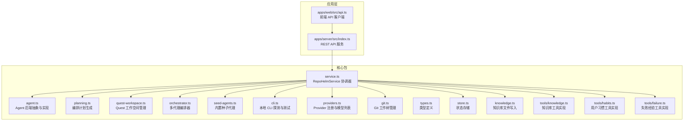

**图表来源**
- [packages/core/src/agent.ts:1-436](file://packages/core/src/agent.ts#L1-L436)
- [packages/core/src/planning.ts:1-154](file://packages/core/src/planning.ts#L1-L154)
- [packages/core/src/quest-workspace.ts:1-121](file://packages/core/src/quest-workspace.ts#L1-L121)
- [packages/core/src/orchestrator.ts:1-461](file://packages/core/src/orchestrator.ts#L1-L461)
- [packages/core/src/seed-agents.ts:1-242](file://packages/core/src/seed-agents.ts#L1-L242)
- [packages/core/src/cli.ts:1-368](file://packages/core/src/cli.ts#L1-L368)
- [packages/core/src/providers.ts:1-304](file://packages/core/src/providers.ts#L1-L304)
- [packages/core/src/service.ts:1-2651](file://packages/core/src/service.ts#L1-L2651)
- [packages/core/src/git.ts:1-343](file://packages/core/src/git.ts#L1-L343)
- [packages/core/src/types.ts:1-559](file://packages/core/src/types.ts#L1-L559)
- [packages/core/src/store.ts:1-166](file://packages/core/src/store.ts#L1-L166)
- [packages/core/src/knowledge.ts:1-68](file://packages/core/src/knowledge.ts#L1-L68)
- [packages/core/src/tools/knowledge.ts:1-263](file://packages/core/src/tools/knowledge.ts#L1-L263)
- [packages/core/src/tools/habits.ts:1-185](file://packages/core/src/tools/habits.ts#L1-L185)
- [packages/core/src/tools/failure.ts:1-264](file://packages/core/src/tools/failure.ts#L1-L264)
- [apps/server/src/index.ts:1-782](file://apps/server/src/index.ts#L1-L782)
- [apps/web/src/api.ts:1-619](file://apps/web/src/api.ts#L1-L619)

**章节来源**
- [packages/core/src/index.ts:1-9](file://packages/core/src/index.ts#L1-L9)
- [README.md:1-100](file://README.md#L1-L100)

## 核心组件
- AgentBackend 抽象与实现
  - 接口定义：AgentBackend，包含 id、name、getAvailability、run
  - 实现：
    - MockAgentBackend：内置 Mock，向每个已创建 worktree 写入产物文件
    - ExternalCliAgentBackend：外部 CLI 后端，通过环境变量命令模板在 worktree 执行
    - OpenAICompatibleAgentBackend：OpenAI 兼容 Provider，调用 chat/completions 获取实现内容
    - AgentBackendRegistry：注册表，统一列举与获取后端
- 多代理编排系统
  - SubAgentOrchestrator：多代理编排器，实现 Plan-then-Execute 架构
  - Planning：编排计划生成器，基于入口代理和代理池生成结构化计划
  - QuestWorkspaceManager：Quest 工作空间管理器，持久化计划和工件
  - SubAgentBackend：内部代理后端接口，支持工具调用和文件系统操作
- 系统代理基础设施
  - kb-agent：知识库代理，管理项目知识库、索引仓库、回答知识查询、总结Quest学习
  - habits-agent：用户习惯代理，观察并建模用户偏好、记录用户配置文件、建议编码约定
  - failure-experience-agent：失败经验代理，捕获Quest失败模式、分析根因、提供缓解方案
  - 系统代理工具：知识库工具(knowledge-tool)、用户习惯工具(habits-tool)、失败经验工具(failure-tool)
- 子代理管理
  - SubAgent：子代理定义，包含权限配置、能力列表、模型绑定
  - SeedAgents：内置种子代理（Supervisor、Spec Writer、Coder、Reviewer、kb-agent、habits-agent、failure-experience-agent）
  - SubAgentOrchestrator：代理池管理和权限控制
- 计划审批功能
  - OrchestrationPlan：结构化编排计划，包含步骤、依赖关系、代理分配
  - 计划审批状态：pending、approved、rejected
  - 自动批准机制：autoApprovePlan 配置
- ModelKit 管理功能
  - testAndSaveModelKit：测试并保存模型配置为 ModelKit
  - CLI 类型：需要 backendId，不需要 apiKey/baseUrl
  - BYOK 类型：需要 providerId，支持 apiKey/baseUrl 配置
  - ModelKitMetadata：成本等级和性能配置
- CLI 探测与测试：LocalCliRegistry，支持 Claude Code、Codex CLI、Gemini CLI、OpenCode
- Provider 注册与模型列表：ProviderRegistry，支持 OpenAI、Anthropic、Gemini、DeepSeek、OpenRouter、OpenAI 兼容
- Git 工作树管理：GitWorktreeManager，负责创建/删除 worktree、变更文件读取、验证、提交、PR
- 服务协调：RepoHelmService，编排后端、Git、Provider、CLI、状态与审计
- 状态存储：JsonStateStore/SqliteStateStore，默认 SQLite，含安全策略与引擎配置
- 知识库：KnowledgeFileStore，将知识项写入 Markdown 文件

**章节来源**
- [packages/core/src/agent.ts:41-436](file://packages/core/src/agent.ts#L41-L436)
- [packages/core/src/planning.ts:29-154](file://packages/core/src/planning.ts#L29-L154)
- [packages/core/src/quest-workspace.ts:5-121](file://packages/core/src/quest-workspace.ts#L5-L121)
- [packages/core/src/orchestrator.ts:26-461](file://packages/core/src/orchestrator.ts#L26-L461)
- [packages/core/src/seed-agents.ts:4-242](file://packages/core/src/seed-agents.ts#L4-L242)
- [packages/core/src/types.ts:77-518](file://packages/core/src/types.ts#L77-L518)
- [packages/core/src/service.ts:1110-1559](file://packages/core/src/service.ts#L1110-L1559)
- [packages/core/src/cli.ts:112-368](file://packages/core/src/cli.ts#L112-L368)
- [packages/core/src/providers.ts:163-304](file://packages/core/src/providers.ts#L163-L304)
- [packages/core/src/git.ts:33-343](file://packages/core/src/git.ts#L33-L343)
- [packages/core/src/service.ts:56-2651](file://packages/core/src/service.ts#L56-L2651)
- [packages/core/src/store.ts:86-166](file://packages/core/src/store.ts#L86-L166)
- [packages/core/src/knowledge.ts:12-68](file://packages/core/src/knowledge.ts#L12-L68)

## 架构总览
Agent 后端系统以 RepoHelmService 为中心，围绕"工作区-项目-Quest-Worktree"的生命周期组织。新增的多代理编排系统通过 SubAgentOrchestrator 实现 Plan-then-Execute 架构，结合结构化编排计划和代理权限控制，形成可审查、可追溯的 Quest 执行闭环。系统支持入口代理协调、工作代理执行、计划审批和自动批准等功能。新增的系统代理基础设施提供了专门的知识管理、用户习惯建模和失败经验学习能力。

```mermaid
sequenceDiagram
participant Client as "客户端"
participant API as "Server API"
participant Svc as "RepoHelmService"
participant Orchestrator as "SubAgentOrchestrator"
participant Planner as "Planning"
participant Workspace as "QuestWorkspaceManager"
participant Agent as "SubAgent"
participant SystemAgent as "系统代理(kb/habits/failure)"
Client->>API : POST /api/quests/ : id/approve-plan
API->>Svc : approvePlan(questId)
Svc->>Orchestrator : executeApprovedPlan(questId, plan)
Orchestrator->>Planner : generateOrchestrationPlan(input)
Planner-->>Orchestrator : OrchestrationPlan
Orchestrator->>Workspace : writePlan(questId, plan)
Workspace-->>Orchestrator : planPath
Loop 步骤执行
Orchestrator->>Agent : invokeWorkerAgent(worker, task)
Agent-->>Orchestrator : result(content, files)
Orchestrator->>Workspace : writeWorkerArtifact(questId, stepId, agentName, content)
Workspace-->>Orchestrator : artifactPath
Opt 系统代理钩子
Orchestrator->>SystemAgent : invokeSystemAgent(kb/habits/failure)
SystemAgent-->>Orchestrator : result(summary/risk/profile)
End Opt
End Loop
Orchestrator-->>Svc : OrchestratorQuestResult
Svc->>Workspace : readPlan(questId)
Workspace-->>Svc : OrchestrationPlan
Svc-->>API : 更新后的 Quest(含计划、工件、状态)
API-->>Client : 返回 Quest 状态
```

**图表来源**
- [apps/server/src/index.ts:473-500](file://apps/server/src/index.ts#L473-L500)
- [packages/core/src/service.ts:1296-1320](file://packages/core/src/service.ts#L1296-L1320)
- [packages/core/src/orchestrator.ts:90-183](file://packages/core/src/orchestrator.ts#L90-L183)
- [packages/core/src/planning.ts:36-67](file://packages/core/src/planning.ts#L36-L67)
- [packages/core/src/quest-workspace.ts:18-34](file://packages/core/src/quest-workspace.ts#L18-L34)

## 详细组件分析

### AgentBackend 抽象与实现
- 接口职责
  - getAvailability：返回后端可用性与配置详情
  - run：在每个已创建 worktree 上执行，返回状态与事件
- Mock 后端
  - 行为：在每个 created worktree 下写入标准化产物文件 repohelm-quest-output/*.md
  - 适用：验证 Quest、worktree 与 diff review 闭环
- 外部 CLI 后端
  - 配置：REPOHELM_CODEX_COMMAND、REPOHELM_CLAUDE_COMMAND、REPOHELM_OPENCODE_COMMAND
  - 执行：在 worktree 中以 sh -lc 执行命令模板，注入 REPOHELM_* 环境变量
  - 输入：.repohelm/agent-input.json（包含 quest、worktree 等）
  - 输出：采集 stdout/stderr/退出码与 worktree diff，事件标准化
- OpenAI 兼容 Provider
  - 配置：REPOHELM_OPENAI_BASE_URL、REPOHELM_OPENAI_MODEL、REPOHELM_OPENAI_API_KEY
  - 调用：POST /chat/completions，解析响应生成产物文件 repohelm-quest-output/*-provider.md
- 注册表
  - 统一列举与获取后端，内置 mock、codex-cli、claude-code、opencode、openai-compatible

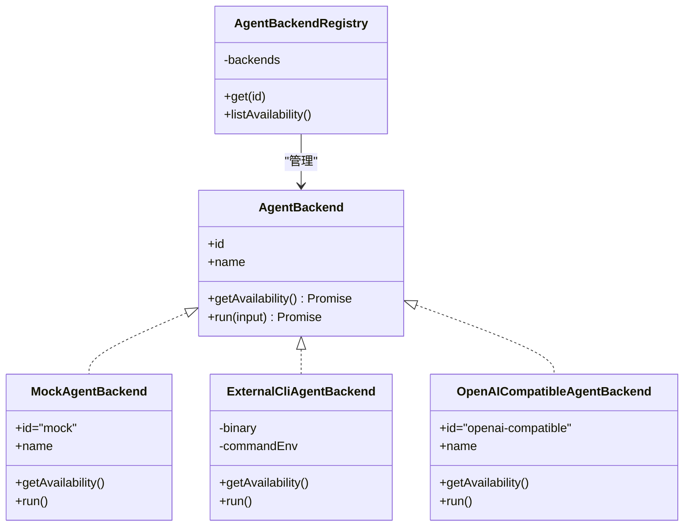

**图表来源**
- [packages/core/src/agent.ts:41-436](file://packages/core/src/agent.ts#L41-L436)

**章节来源**
- [packages/core/src/agent.ts:41-436](file://packages/core/src/agent.ts#L41-L436)

### 外部 CLI 后端：Codex/Claude/OpenCode 集成
- CLI 定义
  - 支持 claude-code、codex-cli、gemini-cli、opencode
  - 包含二进制名、版本参数、列出模型命令、ping 测试、提供商映射、别名模型
- 探测与测试
  - detect：检测二进制、版本、实时模型列表（支持 CLI 自带 listModels 或通过 Provider 拉取）
  - test：执行非交互 ping，评估真实连通性与鉴权
- 执行流程
  - 写入 agent-input.json 至 worktree/.repohelm
  - 以 sh -lc 在 worktree 执行命令模板（REPOHELM_CODEX_COMMAND 等）
  - 采集 stdout/stderr/错误，标准化事件

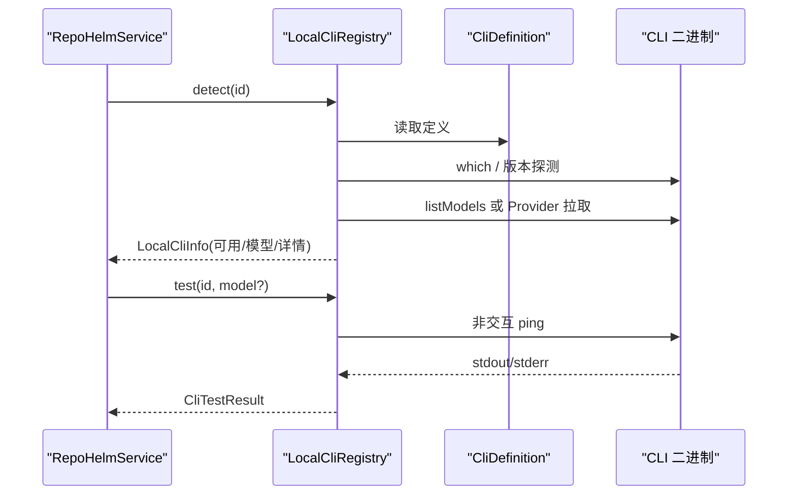

**图表来源**
- [packages/core/src/cli.ts:112-368](file://packages/core/src/cli.ts#L112-L368)

**章节来源**
- [packages/core/src/cli.ts:22-110](file://packages/core/src/cli.ts#L22-L110)
- [packages/core/src/cli.ts:112-368](file://packages/core/src/cli.ts#L112-L368)

### OpenAI 兼容 Provider 实现
- Provider 注册
  - 支持 openai、anthropic、gemini、deepseek、openrouter、openai-compatible
  - 解析不同提供商的模型列表格式，统一 CliModelOption
- 模型列表拉取
  - 支持 bearer/x-api-key/query-key 认证头或查询参数
  - 支持 key 可选（如 openrouter），带缓存（TTL 6h）
- Agent 调用
  - POST /chat/completions，消息体包含 system/user 内容
  - 将 Provider 输出写入 repohelm-quest-output/*-provider.md


**图表来源**
- [packages/core/src/providers.ts:163-304](file://packages/core/src/providers.ts#L163-L304)

**章节来源**
- [packages/core/src/providers.ts:15-161](file://packages/core/src/providers.ts#L15-L161)
- [packages/core/src/providers.ts:221-304](file://packages/core/src/providers.ts#L221-L304)

### 命令权限控制与审计机制
- 安全策略字段
  - commandApprovalMode：allowlist/manual
  - allowedCommands：允许的命令白名单
  - fileScopes：文件作用域（workspace/worktree/knowledge 等）
  - networkScopes：网络作用域（如 localhost）
  - secretsPolicy：redact-env/deny
  - sandboxRuntime：local/external
- 评估与审计
  - runQuest：对 Agent Backend 执行前进行命令权限评估，记录 audit log
  - deliverQuest：对项目验证命令进行权限评估，记录 audit log
  - 更新策略：/api/security-policy，写入状态并记录审计

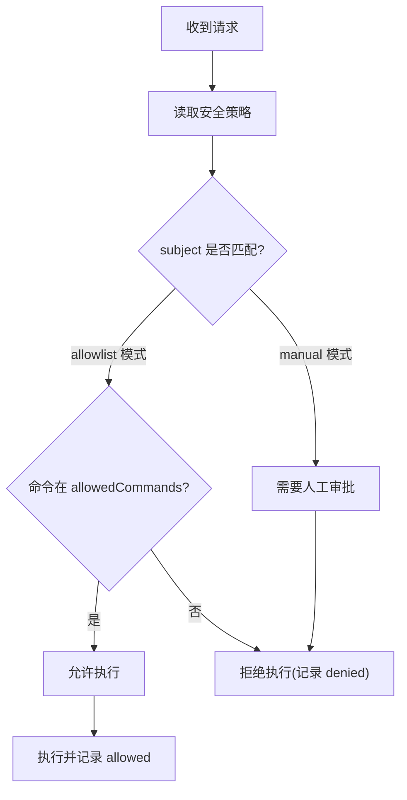

**图表来源**
- [packages/core/src/service.ts:590-615](file://packages/core/src/service.ts#L590-L615)
- [packages/core/src/service.ts:783-801](file://packages/core/src/service.ts#L783-L801)
- [packages/core/src/store.ts:13-24](file://packages/core/src/store.ts#L13-L24)

**章节来源**
- [packages/core/src/types.ts:160-168](file://packages/core/src/types.ts#L160-L168)
- [packages/core/src/service.ts:898-914](file://packages/core/src/service.ts#L898-L914)
- [packages/core/src/service.ts:590-615](file://packages/core/src/service.ts#L590-L615)
- [packages/core/src/service.ts:783-801](file://packages/core/src/service.ts#L783-L801)

### 与 Git 工作树的集成与执行流程
- 创建 worktree
  - 为每个受影响项目创建隔离分支与工作树目录
  - 支持复用已存在的工作树或失败场景
- 执行后端
  - Mock：在 worktree 写入产物文件
  - CLI/Provider：在 worktree 写入 agent-input.json，执行命令/调用 Provider，采集 diff
- 交付阶段
  - 逐项目执行验证命令、提交、PR handoff（可选 gh 创建 PR）

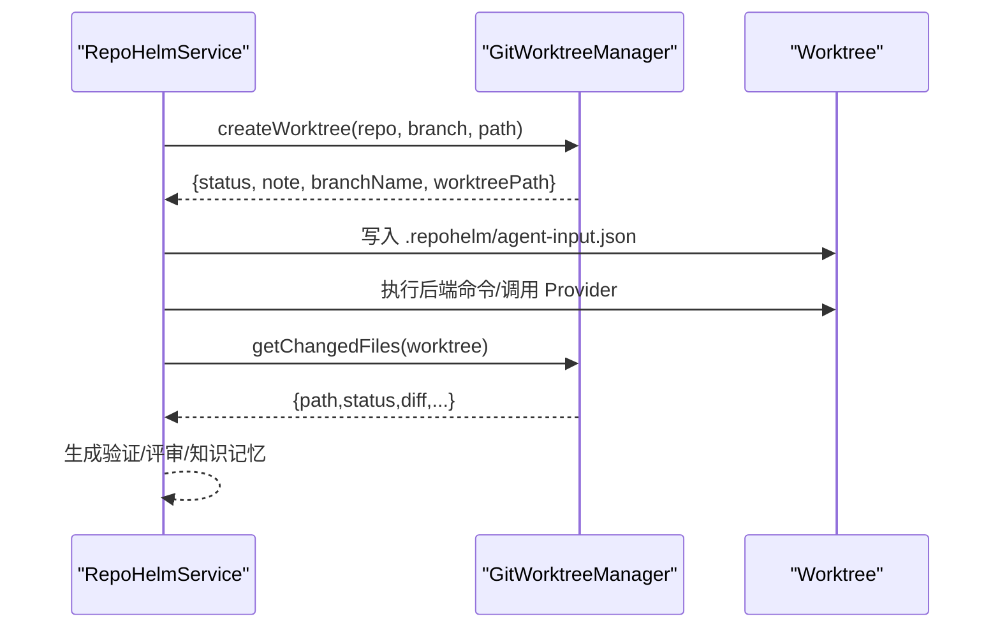

**图表来源**
- [packages/core/src/git.ts:79-140](file://packages/core/src/git.ts#L79-L140)
- [packages/core/src/agent.ts:413-431](file://packages/core/src/agent.ts#L413-L431)
- [packages/core/src/service.ts:616-622](file://packages/core/src/service.ts#L616-L622)

**章节来源**
- [packages/core/src/git.ts:79-140](file://packages/core/src/git.ts#L79-L140)
- [packages/core/src/agent.ts:413-431](file://packages/core/src/agent.ts#L413-L431)
- [packages/core/src/service.ts:616-622](file://packages/core/src/service.ts#L616-L622)

## 系统代理基础设施

### 系统代理概述
RepoHelm 新增了三类系统代理，专门负责知识库管理、用户习惯建模和失败经验学习：

- **kb-agent（知识库助手）**：管理项目知识库，包括仓库索引、知识查询、文档更新和学习总结
- **habits-agent（用户习惯助手）**：观察并建模用户偏好，记录用户配置文件，提供编码约定建议
- **failure-experience-agent（失败经验助手）**：捕获Quest失败模式，分析根因，提供缓解方案，防止重复踩坑

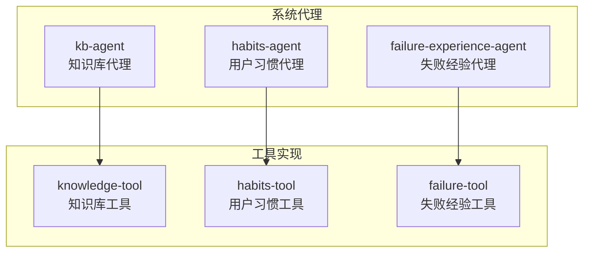

**图表来源**
- [packages/core/src/seed-agents.ts:55-156](file://packages/core/src/seed-agents.ts#L55-L156)
- [packages/core/src/tools/knowledge.ts:1-263](file://packages/core/src/tools/knowledge.ts#L1-L263)
- [packages/core/src/tools/habits.ts:1-185](file://packages/core/src/tools/habits.ts#L1-L185)
- [packages/core/src/tools/failure.ts:1-264](file://packages/core/src/tools/failure.ts#L1-L264)

**章节来源**
- [packages/core/src/seed-agents.ts:55-156](file://packages/core/src/seed-agents.ts#L55-L156)
- [packages/core/src/tools/knowledge.ts:1-263](file://packages/core/src/tools/knowledge.ts#L1-L263)
- [packages/core/src/tools/habits.ts:1-185](file://packages/core/src/tools/habits.ts#L1-L185)
- [packages/core/src/tools/failure.ts:1-264](file://packages/core/src/tools/failure.ts#L1-L264)

### 系统代理权限控制
系统代理具有特殊的权限配置：

- **模式区分**：mode: "system"，区别于普通 worker 代理
- **工具权限**：
  - kb-agent：允许知识库相关工具，禁止文件操作工具
  - habits-agent：允许用户偏好相关工具，禁止文件操作工具
  - failure-experience-agent：允许失败模式相关工具，禁止文件操作工具
- **系统角色**：systemRole 字段标识代理的专业领域

**章节来源**
- [packages/core/src/seed-agents.ts:55-156](file://packages/core/src/seed-agents.ts#L55-L156)
- [packages/core/src/types.ts:382-410](file://packages/core/src/types.ts#L382-L410)

### 系统代理自动钩子机制
系统代理通过自动钩子机制在Quest生命周期中发挥作用：

- **成功后总结**：kb-agent 自动总结Quest学习成果，更新相关wiki页面
- **失败后记录**：failure-experience-agent 自动记录失败模式，提供缓解方案
- **风险预警**：habits-agent 和 failure-experience-agent 在任务前提供风险预警

**章节来源**
- [packages/core/src/service.ts:1954-1991](file://packages/core/src/service.ts#L1954-L1991)

## 工具实现与API

### 知识库工具实现
知识库工具提供完整的知识管理能力：

- **搜索知识**：使用语义搜索查找相关wiki页面
- **读取知识**：获取特定wiki页面的完整内容
- **写入知识**：创建或更新项目wiki页面
- **索引知识**：触发项目知识库索引
- **获取上下文**：为任务生成结构化的知识上下文

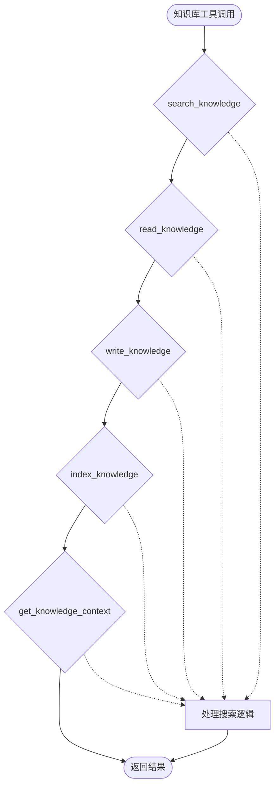

**图表来源**
- [packages/core/src/tools/knowledge.ts:151-262](file://packages/core/src/tools/knowledge.ts#L151-L262)

**章节来源**
- [packages/core/src/tools/knowledge.ts:1-263](file://packages/core/src/tools/knowledge.ts#L1-L263)

### 用户习惯工具实现
用户习惯工具专注于用户偏好建模：

- **记录偏好**：记录或更新用户偏好，支持多种来源和置信度
- **获取用户档案**：检索用户的累积偏好，支持分类过滤和置信度阈值
- **建议约定**：基于用户偏好生成任务相关的编码约定指导

**章节来源**
- [packages/core/src/tools/habits.ts:1-185](file://packages/core/src/tools/habits.ts#L1-L185)

### 失败经验工具实现
失败经验工具负责学习和预防失败：

- **记录失败**：记录失败模式，包含根因分析和缓解方案
- **搜索失败**：查找相似的历史失败模式
- **检查风险**：基于历史失败模式检查任务风险

**章节来源**
- [packages/core/src/tools/failure.ts:1-264](file://packages/core/src/tools/failure.ts#L1-L264)

### 系统代理API端点
新增的系统代理API端点：

- **用户偏好API**：
  - GET /api/preferences：获取所有用户偏好
  - POST /api/preferences：创建用户偏好
  - DELETE /api/preferences/:id：删除用户偏好
- **失败模式API**：
  - GET /api/failures：获取所有失败模式
  - POST /api/failures：创建失败模式
  - POST /api/failures/search：搜索失败模式
  - PATCH /api/failures/:id：更新失败模式

**章节来源**
- [apps/server/src/index.ts:650-782](file://apps/server/src/index.ts#L650-L782)

### 系统代理前端UI支持
系统代理在前端设置面板中可见：

- **系统代理分区**：显示知识库助手、用户习惯助手、失败经验助手三个卡片
- **标签显示**：显示知识库、用户习惯、失败经验等专业标签
- **ModelKit集成**：每个系统代理都有对应的ModelKit下拉框
- **只读特性**：系统代理为只读，不可删除

**章节来源**
- [apps/web/src/App.tsx:2653-2672](file://apps/web/src/App.tsx#L2653-L2672)
- [e2e/system-agents.spec.ts:1-37](file://e2e/system-agents.spec.ts#L1-L37)

## 多代理编排系统

### SubAgentOrchestrator 架构
多代理编排系统采用 Plan-then-Execute 架构，通过 SubAgentOrchestrator 实现复杂的代理协作：

- **计划生成阶段**：入口代理（Supervisor）根据任务需求和可用代理池生成结构化编排计划
- **执行阶段**：按照依赖关系顺序执行各个步骤，支持工具调用和文件系统操作
- **工作空间管理**：持久化计划和执行工件，支持重新执行和审计
- **系统代理集成**：支持系统代理的特殊工具调用和权限控制

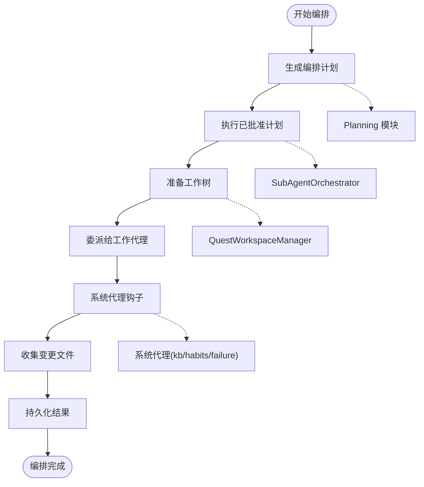

**图表来源**
- [packages/core/src/orchestrator.ts:58-183](file://packages/core/src/orchestrator.ts#L58-L183)
- [packages/core/src/planning.ts:36-67](file://packages/core/src/planning.ts#L36-L67)
- [packages/core/src/quest-workspace.ts:18-34](file://packages/core/src/quest-workspace.ts#L18-L34)

**章节来源**
- [packages/core/src/orchestrator.ts:58-183](file://packages/core/src/orchestrator.ts#L58-L183)
- [packages/core/src/planning.ts:36-67](file://packages/core/src/planning.ts#L36-L67)
- [packages/core/src/quest-workspace.ts:18-34](file://packages/core/src/quest-workspace.ts#L18-L34)

### 编排计划生成
编排计划生成器基于入口代理的提示模板和可用代理池生成结构化执行计划：

- **输入参数**：入口代理、Quest 要求、代理池、后端
- **输出格式**：OrchestrationPlan，包含步骤、依赖关系、代理分配
- **解析机制**：支持 JSON 代码块、任意代码块、原始 JSON 等多种格式
- **回退策略**：当无法解析结构化 JSON 时，使用 LLM 响应作为摘要

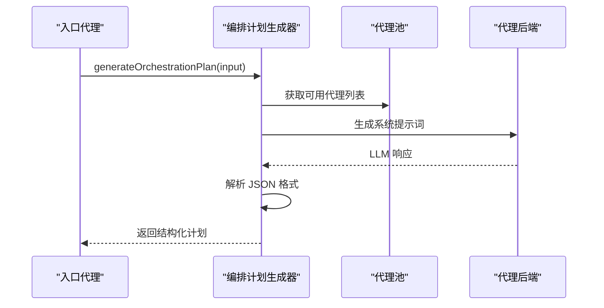

**图表来源**
- [packages/core/src/planning.ts:36-154](file://packages/core/src/planning.ts#L36-L154)

**章节来源**
- [packages/core/src/planning.ts:36-154](file://packages/core/src/planning.ts#L36-L154)

### Quest 工作空间管理
QuestWorkspaceManager 负责编排执行期间的数据持久化：

- **计划存储**：将结构化编排计划渲染为 Markdown 文档
- **工件存储**：为每个步骤和代理组合存储执行工件
- **目录结构**：.repohelm/quests/{questId}/{plan.md, artifacts/}
- **文件命名**：使用步骤ID和代理名称的 slug 化形式

**章节来源**
- [packages/core/src/quest-workspace.ts:5-121](file://packages/core/src/quest-workspace.ts#L5-L121)

### 代理后端实现
内部代理后端接口支持不同的执行模式：

- **BYOK 模式**：直接调用模型，支持工具调用循环
- **CLI 模式**：在工作树环境中执行 CLI 命令
- **系统代理模式**：根据 systemRole 选择相应的工具规格和处理器
- **事件记录**：标准化事件格式，便于审计和监控

**章节来源**
- [packages/core/src/orchestrator.ts:26-442](file://packages/core/src/orchestrator.ts#L26-L442)
- [packages/core/src/service.ts:984-997](file://packages/core/src/service.ts#L984-L997)

## 计划审批功能

### 计划审批状态管理
系统支持结构化的计划审批流程：

- **审批状态**：pending（待审批）、approved（已批准）、rejected（已拒绝）
- **自动批准**：autoApprovePlan 配置，支持自动执行已生成的计划
- **手动审批**：用户可以批准或拒绝编排计划
- **拒绝原因**：支持记录拒绝原因，便于审计

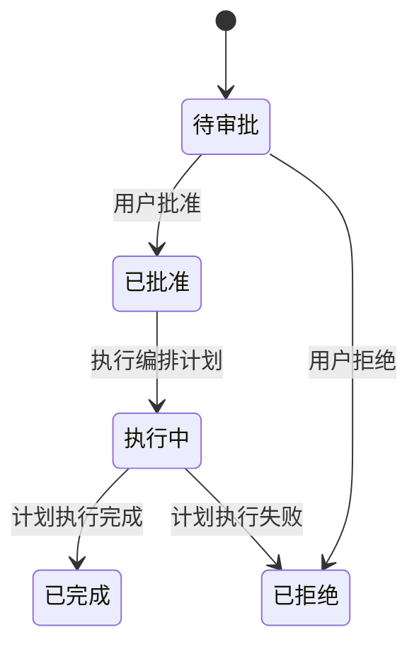

**图表来源**
- [packages/core/src/types.ts:70-78](file://packages/core/src/types.ts#L70-L78)
- [packages/core/src/service.ts:1296-1451](file://packages/core/src/service.ts#L1296-L1451)

**章节来源**
- [packages/core/src/types.ts:70-78](file://packages/core/src/types.ts#L70-L78)
- [packages/core/src/service.ts:1296-1451](file://packages/core/src/service.ts#L1296-L1451)

### 计划 API 端点
新增完整的计划管理 API 端点：

- **POST /api/quests/:id/approve-plan**：批准并执行编排计划
- **POST /api/quests/:id/reject-plan**：拒绝编排计划
- **GET /api/quests/:id/plan**：获取编排计划

**章节来源**
- [apps/server/src/index.ts:473-500](file://apps/server/src/index.ts#L473-L500)
- [apps/web/src/api.ts:510-520](file://apps/web/src/api.ts#L510-L520)

### 计划读取与持久化
服务层提供计划的读取和持久化功能：

- **getQuestPlan**：从 QuestWorkspaceManager 读取编排计划
- **persistOrchestratorResult**：将编排结果持久化到 Quest 状态
- **事件记录**：记录计划审批、执行过程和结果

**章节来源**
- [packages/core/src/service.ts:1453-1545](file://packages/core/src/service.ts#L1453-L1545)

## 子代理管理能力

### 内置种子代理
系统提供预定义的内置种子代理，支持一键初始化：

- **Supervisor（入口代理）**：负责分解请求、委派任务和汇总结果
- **Spec Writer（规范编写器）**：生成轻量级规范和需求分解
- **Coder（编码器）**：实现代码和具体的文件级变更
- **Reviewer（审查员）**：审查计划和代码的质量、正确性和安全性
- **kb-agent（知识库助手）**：系统知识库代理，管理项目知识库
- **habits-agent（用户习惯助手）**：系统用户习惯代理，建模用户偏好
- **failure-experience-agent（失败经验助手）**：系统失败经验代理，学习失败模式

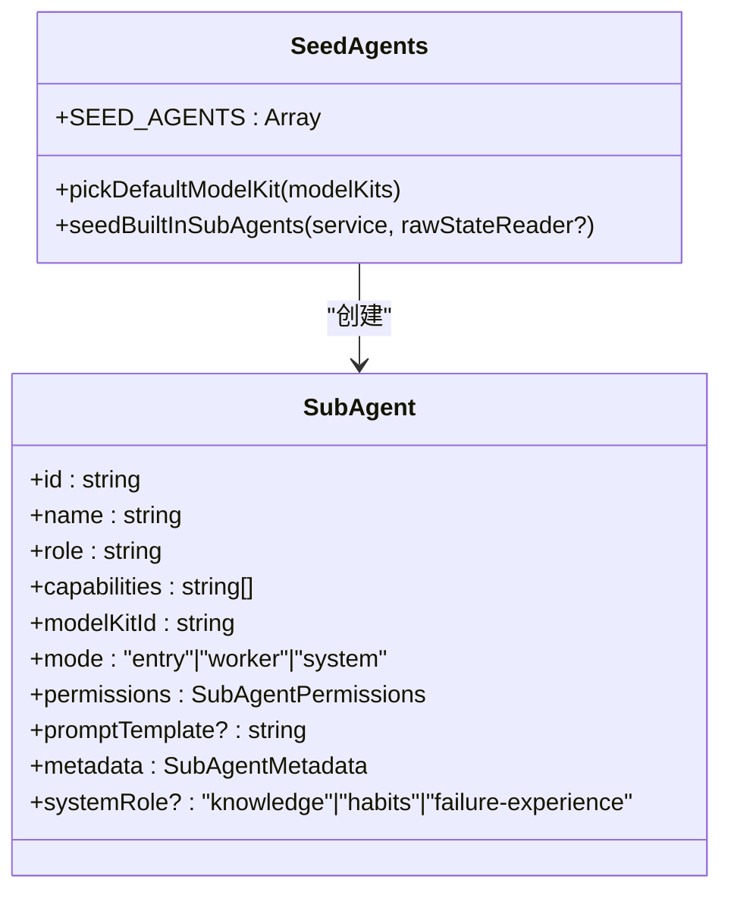

**图表来源**
- [packages/core/src/seed-agents.ts:8-242](file://packages/core/src/seed-agents.ts#L8-L242)
- [packages/core/src/types.ts:397-410](file://packages/core/src/types.ts#L397-L410)

**章节来源**
- [packages/core/src/seed-agents.ts:8-242](file://packages/core/src/seed-agents.ts#L8-L242)
- [packages/core/src/types.ts:397-410](file://packages/core/src/types.ts#L397-L410)

### 代理权限控制
子代理具备精细的权限控制机制：

- **工具权限**：allowedTools（允许使用）、deniedTools（禁止使用）
- **执行限制**：maxSteps（最大执行步数）
- **模式区分**：entry（入口代理）、worker（工作代理）、system（系统代理）
- **使用统计**：usageCount（使用次数）、lastUsedAt（最后使用时间）
- **系统角色**：systemRole（知识库/用户习惯/失败经验）

**章节来源**
- [packages/core/src/types.ts:382-410](file://packages/core/src/types.ts#L382-L410)
- [packages/core/src/seed-agents.ts:14-54](file://packages/core/src/seed-agents.ts#L14-L54)

### 子代理 API 管理
完整的子代理管理 API：

- **POST /api/sub-agents**：创建子代理
- **PATCH /api/sub-agents/:id**：更新子代理
- **DELETE /api/sub-agents/:id**：删除子代理
- **GET /api/sub-agents**：列出所有子代理
- **POST /api/sub-agents/set-entry**：设置入口子代理
- **GET /api/sub-agents/entry**：获取入口子代理

**章节来源**
- [apps/server/src/index.ts:551-608](file://apps/server/src/index.ts#L551-L608)
- [apps/web/src/api.ts:596-618](file://apps/web/src/api.ts#L596-L618)

### 代理使用统计
系统跟踪子代理的使用情况：

- **使用计数**：usageCount 字段记录使用次数
- **更新机制**：每次代理执行后更新使用统计
- **最佳努力原则**：使用统计失败不影响主要功能

**章节来源**
- [packages/core/src/orchestrator.ts:327-333](file://packages/core/src/orchestrator.ts#L327-L333)
- [packages/core/src/seed-agents.ts:67-71](file://packages/core/src/seed-agents.ts#L67-L71)

## 依赖关系分析
- 组件耦合
  - RepoHelmService 依赖 AgentBackendRegistry、LocalCliRegistry、ProviderRegistry、GitWorktreeManager、StateStore、KnowledgeFileStore、ModelKitManager、SubAgentManager
  - SubAgentOrchestrator 依赖 Planning、QuestWorkspaceManager、SubAgentBackend、系统代理工具
  - Planning 依赖 SubAgentBackend 和类型定义
  - QuestWorkspaceManager 依赖类型定义和文件系统操作
  - SeedAgents 依赖 RepoHelmService 和类型定义，包含系统代理定义
  - AgentBackendRegistry 内部聚合多种后端实现
  - ProviderRegistry 与 CLI 定义相互配合，支持通过 CLI 或 BYOK 方式拉取模型
  - ModelKitManager 管理模型配置的生命周期
  - SubAgentManager 管理子代理的配置和权限
  - 系统代理工具依赖 RepoHelmService 提供的具体功能实现
- 外部依赖
  - Git、Shell 执行（sh -lc）、HTTP 请求（fetch）、SQLite/JSON 文件存储

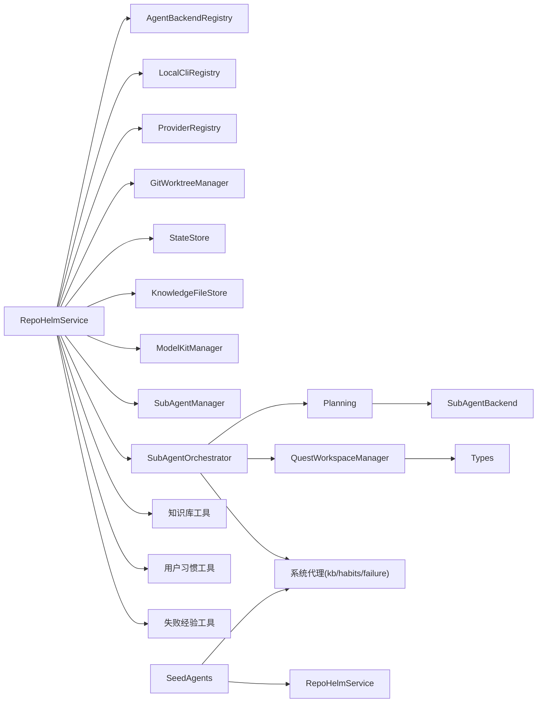

**图表来源**
- [packages/core/src/service.ts:56-62](file://packages/core/src/service.ts#L56-L62)
- [packages/core/src/orchestrator.ts:10-20](file://packages/core/src/orchestrator.ts#L10-L20)
- [packages/core/src/planning.ts:1-3](file://packages/core/src/planning.ts#L1-L3)
- [packages/core/src/quest-workspace.ts:1-4](file://packages/core/src/quest-workspace.ts#L1-L4)
- [packages/core/src/seed-agents.ts:1-2](file://packages/core/src/seed-agents.ts#L1-L2)

**章节来源**
- [packages/core/src/service.ts:56-62](file://packages/core/src/service.ts#L56-L62)
- [packages/core/src/orchestrator.ts:10-20](file://packages/core/src/orchestrator.ts#L10-L20)
- [packages/core/src/planning.ts:1-3](file://packages/core/src/planning.ts#L1-L3)
- [packages/core/src/quest-workspace.ts:1-4](file://packages/core/src/quest-workspace.ts#L1-L4)
- [packages/core/src/seed-agents.ts:1-2](file://packages/core/src/seed-agents.ts#L1-L2)

## 性能考量
- 模型列表缓存：Provider 模型列表 TTL 6h，减少频繁拉取
- 并发执行：后端在多个 worktree 上并发执行，提升吞吐
- IO 优化：工作树变更读取采用 git status/diff，避免全量扫描
- 超时控制：后端执行与交付验证均设置超时（毫秒级），防止阻塞
- ModelKit 缓存：ModelKit 配置在内存中缓存，减少重复加载
- Sub-Agent 状态：Sub-Agent 状态在内存中维护，支持快速切换
- 计划缓存：编排计划在 QuestWorkspaceManager 中持久化，支持重新执行
- 工具循环限制：BYOK 模式的工具调用循环最多 8 次，防止无限循环
- 代理池过滤：执行前过滤掉入口代理，避免自我委派
- 系统代理钩子：系统代理钩子为异步执行，不阻塞主流程

## 故障排除指南
- 后端不可用
  - 检查 REPOHELM_CODEX_COMMAND/REPOHELM_CLAUDE_COMMAND/REPOHELM_OPENCODE_COMMAND 是否配置
  - 检查 REPOHELM_OPENAI_BASE_URL/REPOHELM_OPENAI_MODEL/REPOHELM_OPENAI_API_KEY 是否齐全
  - 使用 /api/agent-backends 查看可用性详情
- CLI 无法测试
  - 使用 /api/clis/:id/test 检查真实调用与鉴权
  - 若提示未登录/鉴权失败，按提示先登录相应 CLI
- 工作树创建失败
  - 检查路径是否存在、是否为 Git 仓库、默认分支配置
  - 查看 worktree note 与错误信息
- 交付失败
  - 检查项目 validationCommand 执行结果与输出
  - 若启用 gh PR，确保 REPOHELM_ENABLE_GH_PR=1 且本机 gh 已认证
- ModelKit 测试失败
  - CLI 类型：检查 backendId 是否正确，CLI 是否可执行
  - BYOK 类型：检查 providerId、apiKey、baseUrl 配置是否正确
  - 查看详细的错误信息以确定具体问题
- Sub-Agent 配置错误
  - 检查 modelKitId 是否存在
  - 验证权限配置的工具列表是否有效
  - 确认模式配置（entry/worker/system）是否符合预期
- 系统代理问题
  - 检查系统代理是否正确初始化（kb-agent、habits-agent、failure-experience-agent）
  - 验证系统代理的工具权限配置
  - 查看系统代理钩子的执行日志
- 计划审批问题
  - 检查 Quest 是否处于正确的状态（pending）
  - 验证计划文件是否存在（/api/quests/:id/plan）
  - 查看审批日志和错误信息
- 编排执行失败
  - 检查代理池中是否有可用代理
  - 验证代理的 ModelKit 配置是否正确
  - 查看代理执行日志和工件文件
- 工作空间问题
  - 检查 QuestWorkspaceManager 的根目录权限
  - 验证计划和工件文件的读写权限
  - 查看磁盘空间和文件系统状态
- 知识库工具问题
  - 检查知识库索引状态和错误信息
  - 验证 wiki 页面的 slug 和标题配置
  - 查看知识库工具的 API 调用结果
- 用户偏好工具问题
  - 检查用户偏好的分类和键值配置
  - 验证置信度和来源字段的有效性
  - 查看用户偏好工具的 API 错误信息
- 失败经验工具问题
  - 检查失败模式的分类和缓解方案
  - 验证根因分析和信号关键词
  - 查看失败经验工具的 API 调用结果

**章节来源**
- [apps/server/src/index.ts:130-148](file://apps/server/src/index.ts#L130-L148)
- [packages/core/src/git.ts:159-187](file://packages/core/src/git.ts#L159-L187)
- [packages/core/src/service.ts:1418-1451](file://packages/core/src/service.ts#L1418-L1451)
- [packages/core/src/service.ts:680-760](file://packages/core/src/service.ts#L680-L760)

## 结论
RepoHelm Agent 后端系统通过清晰的抽象与注册表机制，实现了对多种实现后端的统一编排；新增的多代理编排系统进一步增强了系统的智能化水平，通过结构化编排计划和代理权限控制，形成可审查、可追溯的 Quest 执行闭环。新增的系统代理基础设施提供了专门的知识管理、用户习惯建模和失败经验学习能力，通过知识库工具、用户习惯工具和失败经验工具的实现，以及相应的API端点和前端UI支持，形成了完整的智能体生态系统。内置的种子代理和计划审批功能使得系统具备了更强的实用性和可控性。结合 Git 工作树隔离与严格的权限控制与审计，系统能够安全高效地处理复杂的软件开发任务。

## 附录

### 配置示例与使用模式
- 启用外部 CLI 后端
  - 设置 REPOHELM_CODEX_COMMAND、REPOHELM_CLAUDE_COMMAND、REPOHELM_OPENCODE_COMMAND
  - 在 worktree 中通过 REPOHELM_AGENT_INPUT 读取标准化输入
- 启用 OpenAI 兼容 Provider
  - 设置 REPOHELM_OPENAI_BASE_URL、REPOHELM_OPENAI_MODEL、REPOHELM_OPENAI_API_KEY
- 启用 PR 自动创建
  - 设置 REPOHELM_ENABLE_GH_PR=1，确保本机 gh 已认证
- 安全策略
  - 通过 /api/security-policy 更新命令审批模式、允许命令、文件/网络作用域、秘密策略与沙箱运行时
- ModelKit 配置
  - CLI 类型：提供 backendId，不需要 apiKey/baseUrl
  - BYOK 类型：提供 providerId、apiKey、baseUrl
  - 通过 /api/model-kits/test-and-save 进行测试和保存
- Sub-Agent 配置
  - 通过 /api/sub-agents 创建和管理子代理
  - 设置入口 Agent 和工作 Agent 的权限和模式
  - 使用 /api/sub-agents/entry 获取当前入口代理
  - 系统代理（kb-agent、habits-agent、failure-experience-agent）自动初始化
- 计划审批配置
  - 通过 Quest 的 autoApprovePlan 字段启用自动批准
  - 使用 /api/quests/:id/approve-plan 手动批准计划
  - 使用 /api/quests/:id/reject-plan 拒绝计划
  - 通过 /api/quests/:id/plan 获取编排计划
- 系统代理配置
  - 知识库代理：通过 kb-agent 管理项目知识库，支持知识搜索、文档更新、索引管理
  - 用户习惯代理：通过 habits-agent 记录和建模用户偏好，提供编码约定建议
  - 失败经验代理：通过 failure-experience-agent 学习失败模式，提供风险预警和缓解方案
- 系统代理API使用
  - 用户偏好API：/api/preferences 用于管理用户偏好
  - 失败模式API：/api/failures 用于管理失败模式
  - 知识库API：/api/projects/:id/knowledge 用于知识库管理

**章节来源**
- [README.md:62-77](file://README.md#L62-L77)
- [apps/server/src/index.ts:194-203](file://apps/server/src/index.ts#L194-L203)
- [apps/server/src/index.ts:473-782](file://apps/server/src/index.ts#L473-L782)
- [packages/core/src/seed-agents.ts:82-242](file://packages/core/src/seed-agents.ts#L82-L242)
- [packages/core/src/tools/knowledge.ts:151-263](file://packages/core/src/tools/knowledge.ts#L151-L263)
- [packages/core/src/tools/habits.ts:109-185](file://packages/core/src/tools/habits.ts#L109-L185)
- [packages/core/src/tools/failure.ts:128-264](file://packages/core/src/tools/failure.ts#L128-L264)