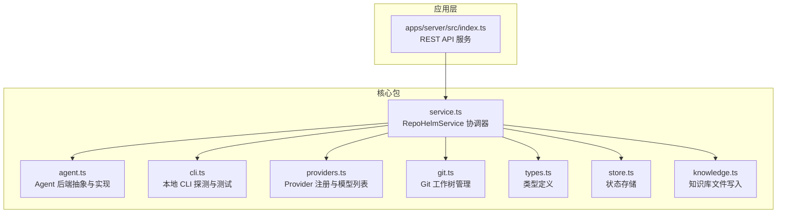
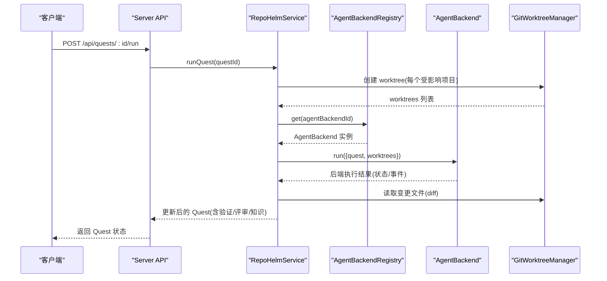
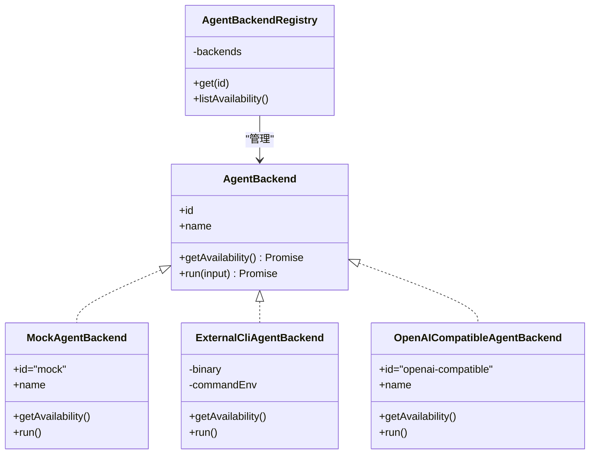
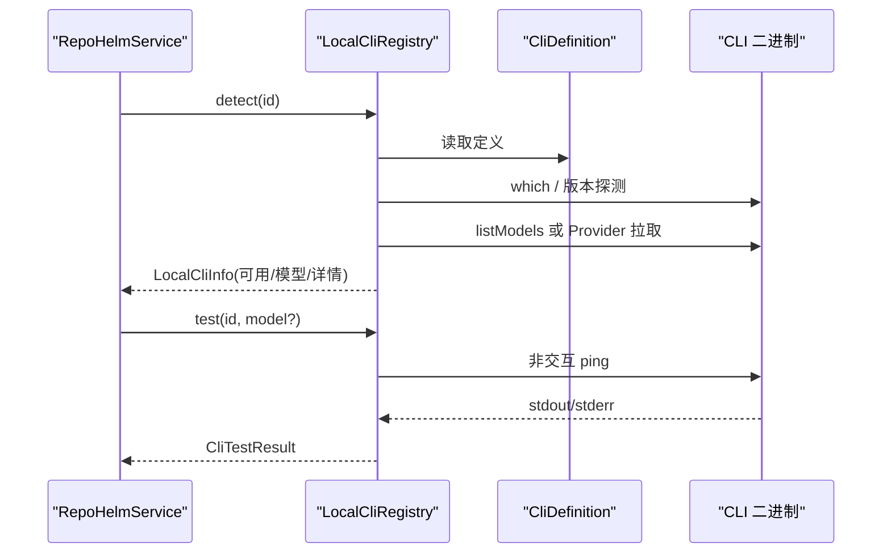
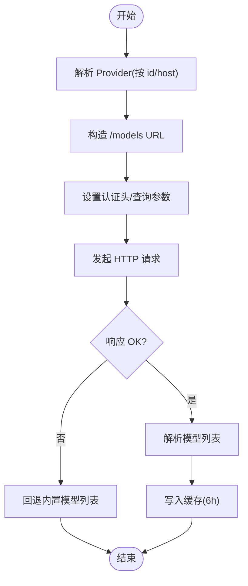
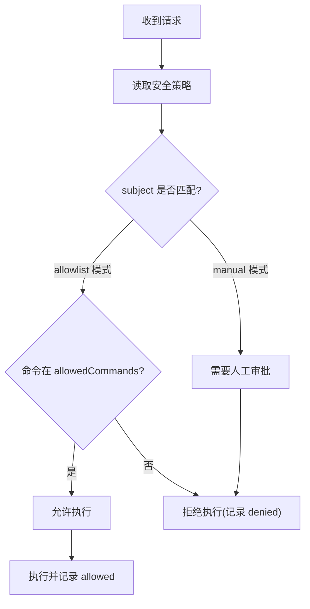
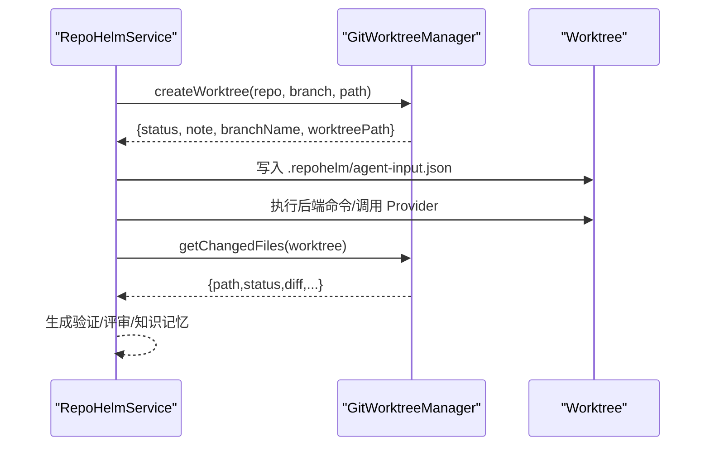
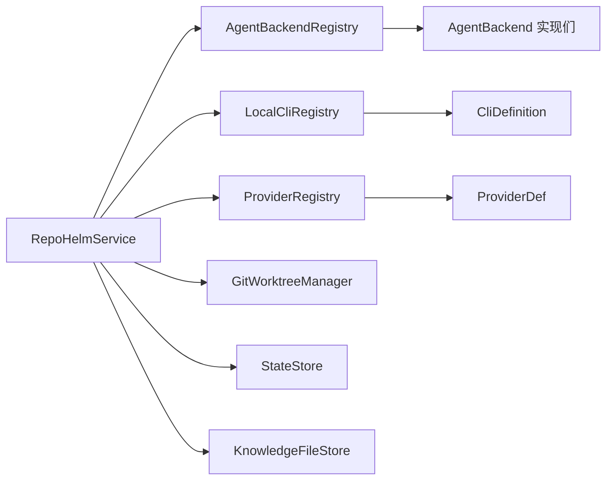

# Agent 后端系统

<cite>
**本文档引用的文件**
- [packages/core/src/agent.ts](file://packages/core/src/agent.ts)
- [packages/core/src/cli.ts](file://packages/core/src/cli.ts)
- [packages/core/src/providers.ts](file://packages/core/src/providers.ts)
- [packages/core/src/service.ts](file://packages/core/src/service.ts)
- [packages/core/src/git.ts](file://packages/core/src/git.ts)
- [packages/core/src/types.ts](file://packages/core/src/types.ts)
- [packages/core/src/store.ts](file://packages/core/src/store.ts)
- [packages/core/src/knowledge.ts](file://packages/core/src/knowledge.ts)
- [apps/server/src/index.ts](file://apps/server/src/index.ts)
- [README.md](file://README.md)
</cite>

## 目录
1. [简介](#简介)
2. [项目结构](#项目结构)
3. [核心组件](#核心组件)
4. [架构总览](#架构总览)
5. [详细组件分析](#详细组件分析)
6. [依赖关系分析](#依赖关系分析)
7. [性能考量](#性能考量)
8. [故障排除指南](#故障排除指南)
9. [结论](#结论)
10. [附录](#附录)

## 简介
本文件面向 RepoHelm Agent 后端系统，系统性阐述后端抽象设计与实现，涵盖以下主题：
- AgentBackend 接口定义与多种实现（Mock、外部 CLI、OpenAI 兼容 Provider）
- 命令权限控制与审计机制（命令审批模式、文件/网络作用域、秘密策略）
- 与 Git 工作树（worktree）的集成与执行流程
- 配置示例与使用模式
- 故障排除与最佳实践

## 项目结构
RepoHelm 后端位于 packages/core，提供领域核心能力：Agent 后端、CLI 探测、Provider 注册、Git 工作树管理、状态存储与知识库等；应用层通过 apps/server 提供 REST API。

**图表来源**
- [packages/core/src/agent.ts:1-436](file://packages/core/src/agent.ts#L1-L436)
- [packages/core/src/cli.ts:1-368](file://packages/core/src/cli.ts#L1-L368)
- [packages/core/src/providers.ts:1-304](file://packages/core/src/providers.ts#L1-L304)
- [packages/core/src/service.ts:1-1331](file://packages/core/src/service.ts#L1-L1331)
- [packages/core/src/git.ts:1-343](file://packages/core/src/git.ts#L1-L343)
- [packages/core/src/types.ts:1-334](file://packages/core/src/types.ts#L1-L334)
- [packages/core/src/store.ts:1-166](file://packages/core/src/store.ts#L1-L166)
- [packages/core/src/knowledge.ts:1-68](file://packages/core/src/knowledge.ts#L1-L68)
- [apps/server/src/index.ts:1-366](file://apps/server/src/index.ts#L1-L366)

**章节来源**
- [packages/core/src/index.ts:1-9](file://packages/core/src/index.ts#L1-L9)
- [README.md:1-100](file://README.md#L1-L100)

## 核心组件
- AgentBackend 抽象与实现
  - 接口定义：AgentBackend，包含 id、name、getAvailability、run
  - 实现：
    - MockAgentBackend：内置 Mock，向每个已创建 worktree 写入产物文件
    - ExternalCliAgentBackend：外部 CLI 后端，通过环境变量命令模板在 worktree 执行
    - OpenAICompatibleAgentBackend：OpenAI 兼容 Provider，调用 chat/completions 获取实现内容
    - AgentBackendRegistry：注册表，统一列举与获取后端
- CLI 探测与测试：LocalCliRegistry，支持 Claude Code、Codex CLI、Gemini CLI、OpenCode
- Provider 注册与模型列表：ProviderRegistry，支持 OpenAI、Anthropic、Gemini、DeepSeek、OpenRouter、OpenAI 兼容
- Git 工作树管理：GitWorktreeManager，负责创建/删除 worktree、变更文件读取、验证、提交、PR
- 服务协调：RepoHelmService，编排后端、Git、Provider、CLI、状态与审计
- 状态存储：JsonStateStore/SqliteStateStore，默认 SQLite，含安全策略与引擎配置
- 知识库：KnowledgeFileStore，将知识项写入 Markdown 文件

**章节来源**
- [packages/core/src/agent.ts:41-436](file://packages/core/src/agent.ts#L41-L436)
- [packages/core/src/cli.ts:112-368](file://packages/core/src/cli.ts#L112-L368)
- [packages/core/src/providers.ts:163-304](file://packages/core/src/providers.ts#L163-L304)
- [packages/core/src/git.ts:33-343](file://packages/core/src/git.ts#L33-L343)
- [packages/core/src/service.ts:56-1331](file://packages/core/src/service.ts#L56-L1331)
- [packages/core/src/store.ts:86-166](file://packages/core/src/store.ts#L86-L166)
- [packages/core/src/knowledge.ts:12-68](file://packages/core/src/knowledge.ts#L12-L68)

## 架构总览
Agent 后端系统以 RepoHelmService 为中心，围绕“工作区-项目-Quest-Worktree”的生命周期组织。后端通过 Registry 统一调度，结合 Git 工作树隔离真实执行，最终产出可审查的变更与审计日志。

**图表来源**
- [apps/server/src/index.ts:317-341](file://apps/server/src/index.ts#L317-L341)
- [packages/core/src/service.ts:544-698](file://packages/core/src/service.ts#L544-L698)
- [packages/core/src/agent.ts:41-436](file://packages/core/src/agent.ts#L41-L436)
- [packages/core/src/git.ts:79-140](file://packages/core/src/git.ts#L79-L140)

## 详细组件分析

### AgentBackend 抽象与实现
- 接口职责
  - getAvailability：返回后端可用性与配置详情
  - run：在每个已创建 worktree 上执行，返回状态与事件
- Mock 后端
  - 行为：在每个 created worktree 下写入标准化产物文件 repohelm-quest-output/*.md
  - 适用：验证 Quest、worktree 与 diff review 闭环
- 外部 CLI 后端
  - 配置：REPOHELM_CODEX_COMMAND、REPOHELM_CLAUDE_COMMAND、REPOHELM_OPENCODE_COMMAND
  - 执行：在 worktree 中以 sh -lc 执行命令模板，注入 REPOHELM_* 环境变量
  - 输入：.repohelm/agent-input.json（包含 quest、worktree 等）
  - 输出：采集 stdout/stderr/退出码与 worktree diff，事件标准化
- OpenAI 兼容 Provider
  - 配置：REPOHELM_OPENAI_BASE_URL、REPOHELM_OPENAI_MODEL、REPOHELM_OPENAI_API_KEY
  - 调用：POST /chat/completions，解析响应生成产物文件 repohelm-quest-output/*-provider.md
- 注册表
  - 统一列举与获取后端，内置 mock、codex-cli、claude-code、opencode、openai-compatible

**图表来源**
- [packages/core/src/agent.ts:41-436](file://packages/core/src/agent.ts#L41-L436)

**章节来源**
- [packages/core/src/agent.ts:41-436](file://packages/core/src/agent.ts#L41-L436)

### 外部 CLI 后端：Codex/Claude/OpenCode 集成
- CLI 定义
  - 支持 claude-code、codex-cli、gemini-cli、opencode
  - 包含二进制名、版本参数、列出模型命令、ping 测试、提供商映射、别名模型
- 探测与测试
  - detect：检测二进制、版本、实时模型列表（支持 CLI 自带 listModels 或通过 Provider 拉取）
  - test：执行非交互 ping，评估真实连通性与鉴权
- 执行流程
  - 写入 agent-input.json 至 worktree/.repohelm
  - 以 sh -lc 在 worktree 执行命令模板（REPOHELM_CODEX_COMMAND 等）
  - 采集 stdout/stderr/错误，标准化事件

**图表来源**
- [packages/core/src/cli.ts:112-368](file://packages/core/src/cli.ts#L112-L368)

**章节来源**
- [packages/core/src/cli.ts:22-110](file://packages/core/src/cli.ts#L22-L110)
- [packages/core/src/cli.ts:112-368](file://packages/core/src/cli.ts#L112-L368)

### OpenAI 兼容 Provider 实现
- Provider 注册
  - 支持 openai、anthropic、gemini、deepseek、openrouter、openai-compatible
  - 解析不同提供商的模型列表格式，统一 CliModelOption
- 模型列表拉取
  - 支持 bearer/x-api-key/query-key 认证头或查询参数
  - 支持 key 可选（如 openrouter），带缓存（TTL 6h）
- Agent 调用
  - POST /chat/completions，消息体包含 system/user 内容
  - 将 Provider 输出写入 repohelm-quest-output/*-provider.md

**图表来源**
- [packages/core/src/providers.ts:163-304](file://packages/core/src/providers.ts#L163-L304)

**章节来源**
- [packages/core/src/providers.ts:15-161](file://packages/core/src/providers.ts#L15-L161)
- [packages/core/src/providers.ts:221-304](file://packages/core/src/providers.ts#L221-L304)

### 命令权限控制与审计机制
- 安全策略字段
  - commandApprovalMode：allowlist/manual
  - allowedCommands：允许的命令白名单
  - fileScopes：文件作用域（workspace/worktree/knowledge 等）
  - networkScopes：网络作用域（如 localhost）
  - secretsPolicy：redact-env/deny
  - sandboxRuntime：local/external
- 评估与审计
  - runQuest：对 Agent Backend 执行前进行命令权限评估，记录 audit log
  - deliverQuest：对项目验证命令进行权限评估，记录 audit log
  - 更新策略：/api/security-policy，写入状态并记录审计

**图表来源**
- [packages/core/src/service.ts:590-615](file://packages/core/src/service.ts#L590-L615)
- [packages/core/src/service.ts:783-801](file://packages/core/src/service.ts#L783-L801)
- [packages/core/src/store.ts:13-24](file://packages/core/src/store.ts#L13-L24)

**章节来源**
- [packages/core/src/types.ts:135-152](file://packages/core/src/types.ts#L135-L152)
- [packages/core/src/service.ts:898-914](file://packages/core/src/service.ts#L898-L914)
- [packages/core/src/service.ts:590-615](file://packages/core/src/service.ts#L590-L615)
- [packages/core/src/service.ts:783-801](file://packages/core/src/service.ts#L783-L801)

### 与 Git 工作树的集成与执行流程
- 创建 worktree
  - 为每个受影响项目创建隔离分支与工作树目录
  - 支持复用已存在的工作树或失败场景
- 执行后端
  - Mock：在 worktree 写入产物文件
  - CLI/Provider：在 worktree 写入 agent-input.json，执行命令/调用 Provider，采集 diff
- 交付阶段
  - 逐项目执行验证命令、提交、PR handoff（可选 gh 创建 PR）

**图表来源**
- [packages/core/src/git.ts:79-140](file://packages/core/src/git.ts#L79-L140)
- [packages/core/src/agent.ts:413-431](file://packages/core/src/agent.ts#L413-L431)
- [packages/core/src/service.ts:616-622](file://packages/core/src/service.ts#L616-L622)

**章节来源**
- [packages/core/src/git.ts:79-140](file://packages/core/src/git.ts#L79-L140)
- [packages/core/src/agent.ts:413-431](file://packages/core/src/agent.ts#L413-L431)
- [packages/core/src/service.ts:616-622](file://packages/core/src/service.ts#L616-L622)

## 依赖关系分析
- 组件耦合
  - RepoHelmService 依赖 AgentBackendRegistry、LocalCliRegistry、ProviderRegistry、GitWorktreeManager、StateStore、KnowledgeFileStore
  - AgentBackendRegistry 内部聚合多种后端实现
  - ProviderRegistry 与 CLI 定义相互配合，支持通过 CLI 或 BYOK 方式拉取模型
- 外部依赖
  - Git、Shell 执行（sh -lc）、HTTP 请求（fetch）、SQLite/JSON 文件存储

**图表来源**
- [packages/core/src/service.ts:56-62](file://packages/core/src/service.ts#L56-L62)
- [packages/core/src/agent.ts:395-411](file://packages/core/src/agent.ts#L395-L411)
- [packages/core/src/providers.ts:163-164](file://packages/core/src/providers.ts#L163-L164)
- [packages/core/src/cli.ts:112-116](file://packages/core/src/cli.ts#L112-L116)

**章节来源**
- [packages/core/src/service.ts:56-62](file://packages/core/src/service.ts#L56-L62)
- [packages/core/src/agent.ts:395-411](file://packages/core/src/agent.ts#L395-L411)
- [packages/core/src/providers.ts:163-164](file://packages/core/src/providers.ts#L163-L164)
- [packages/core/src/cli.ts:112-116](file://packages/core/src/cli.ts#L112-L116)

## 性能考量
- 模型列表缓存：Provider 模型列表 TTL 6h，减少频繁拉取
- 并发执行：后端在多个 worktree 上并发执行，提升吞吐
- IO 优化：工作树变更读取采用 git status/diff，避免全量扫描
- 超时控制：后端执行与交付验证均设置超时（毫秒级），防止阻塞

[本节为通用指导，无需特定文件分析]

## 故障排除指南
- 后端不可用
  - 检查 REPOHELM_CODEX_COMMAND/REPOHELM_CLAUDE_COMMAND/REPOHELM_OPENCODE_COMMAND 是否配置
  - 检查 REPOHELM_OPENAI_BASE_URL/REPOHELM_OPENAI_MODEL/REPOHELM_OPENAI_API_KEY 是否齐全
  - 使用 /api/agent-backends 查看可用性详情
- CLI 无法测试
  - 使用 /api/clis/:id/test 检查真实调用与鉴权
  - 若提示未登录/鉴权失败，按提示先登录相应 CLI
- 工作树创建失败
  - 检查路径是否存在、是否为 Git 仓库、默认分支配置
  - 查看 worktree note 与错误信息
- 交付失败
  - 检查项目 validationCommand 执行结果与输出
  - 若启用 gh PR，确保 REPOHELM_ENABLE_GH_PR=1 且本机 gh 已认证

**章节来源**
- [apps/server/src/index.ts:130-148](file://apps/server/src/index.ts#L130-L148)
- [packages/core/src/git.ts:159-187](file://packages/core/src/git.ts#L159-L187)
- [packages/core/src/service.ts:783-801](file://packages/core/src/service.ts#L783-L801)

## 结论
RepoHelm Agent 后端系统通过清晰的抽象与注册表机制，实现了对多种实现后端的统一编排；结合 Git 工作树隔离与严格的权限控制与审计，形成可审查、可追溯的 Quest 执行闭环。内置 Mock 便于快速验证，外部 CLI 与 OpenAI 兼容 Provider 则满足真实落地场景。

[本节为总结，无需特定文件分析]

## 附录

### 配置示例与使用模式
- 启用外部 CLI 后端
  - 设置 REPOHELM_CODEX_COMMAND、REPOHELM_CLAUDE_COMMAND、REPOHELM_OPENCODE_COMMAND
  - 在 worktree 中通过 REPOHELM_AGENT_INPUT 读取标准化输入
- 启用 OpenAI 兼容 Provider
  - 设置 REPOHELM_OPENAI_BASE_URL、REPOHELM_OPENAI_MODEL、REPOHELM_OPENAI_API_KEY
- 启用 PR 自动创建
  - 设置 REPOHELM_ENABLE_GH_PR=1，确保本机 gh 已认证
- 安全策略
  - 通过 /api/security-policy 更新命令审批模式、允许命令、文件/网络作用域、秘密策略与沙箱运行时

**章节来源**
- [README.md:62-77](file://README.md#L62-L77)
- [apps/server/src/index.ts:194-203](file://apps/server/src/index.ts#L194-L203)