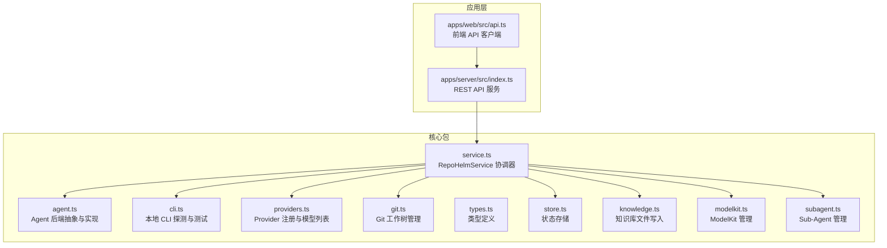
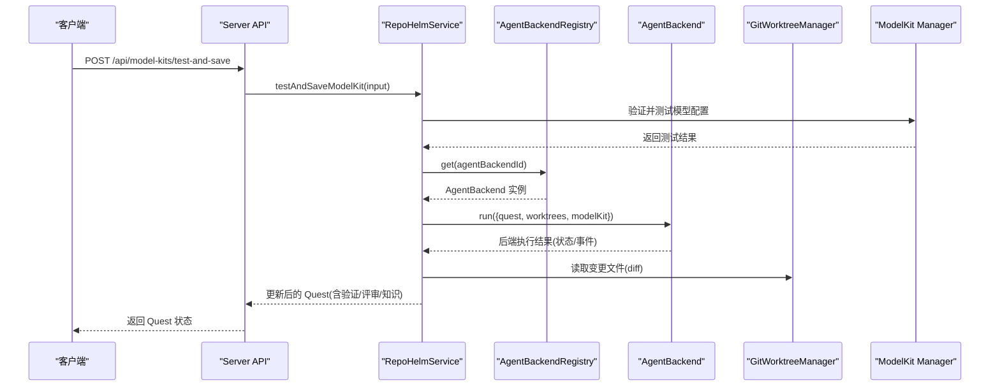
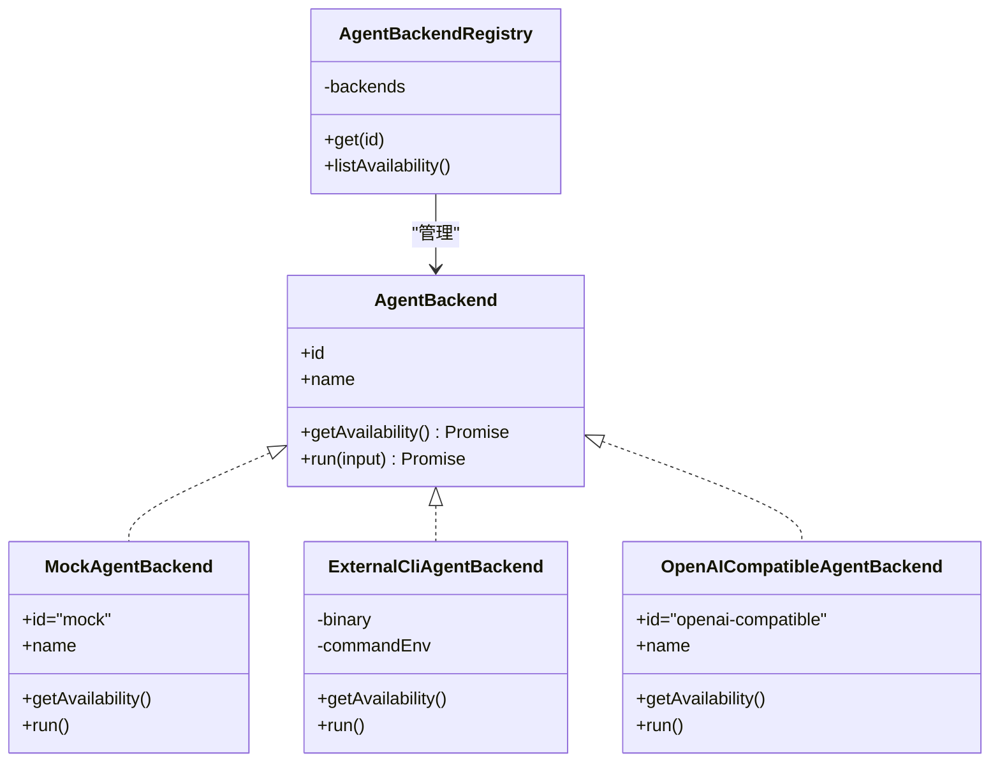
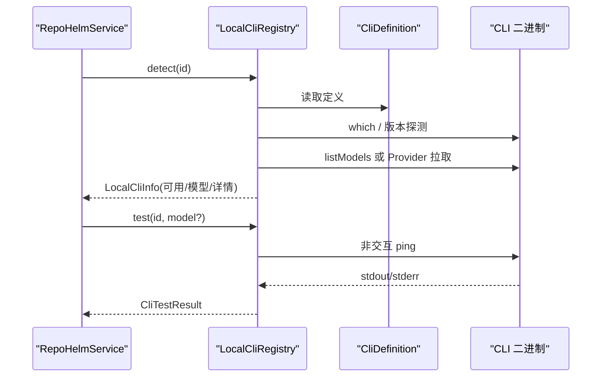
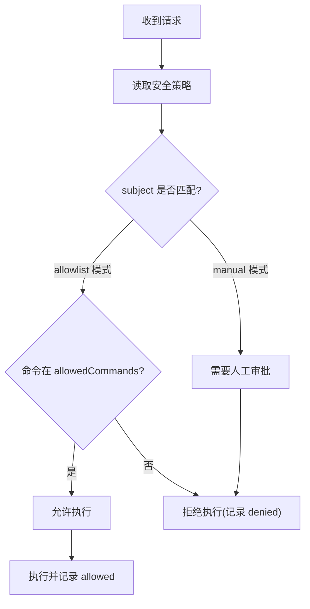
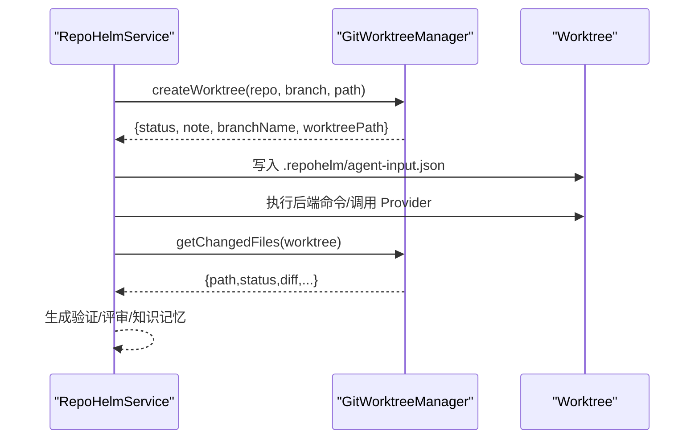
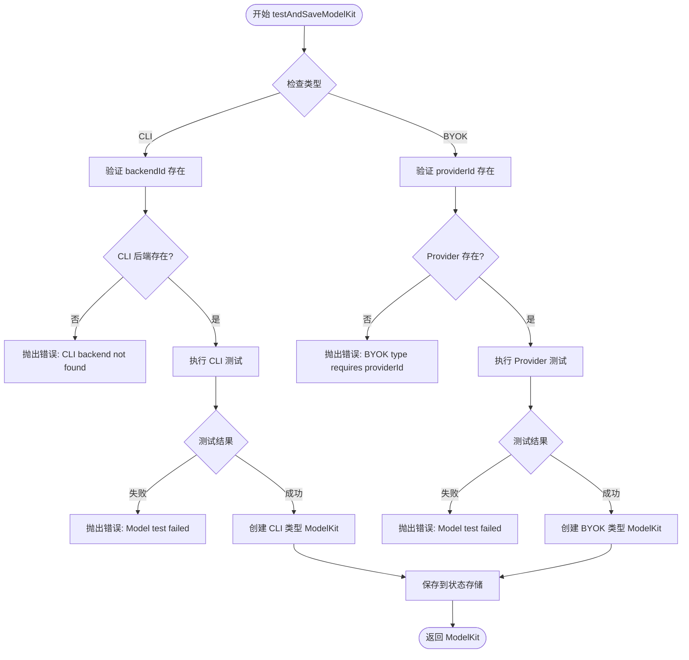
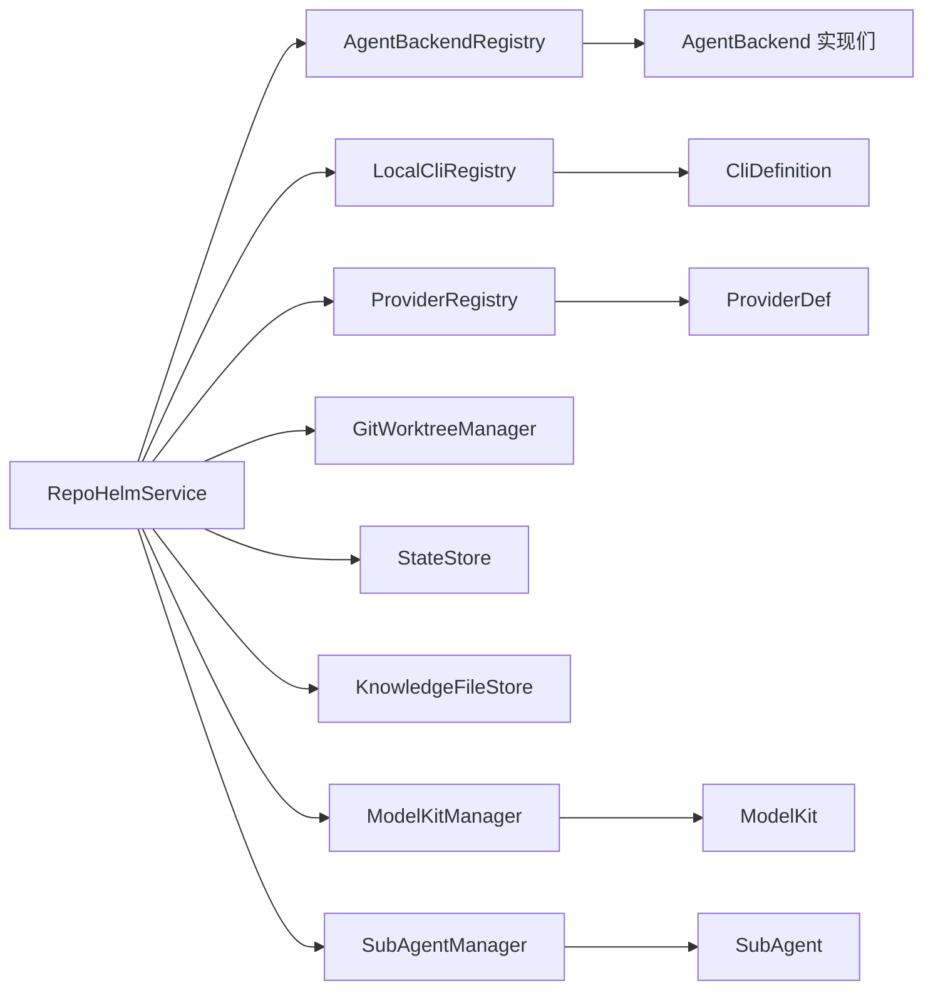

# Agent 后端系统

<cite>
**本文档引用的文件**
- [packages/core/src/agent.ts](file://packages/core/src/agent.ts)
- [packages/core/src/cli.ts](file://packages/core/src/cli.ts)
- [packages/core/src/providers.ts](file://packages/core/src/providers.ts)
- [packages/core/src/service.ts](file://packages/core/src/service.ts)
- [packages/core/src/git.ts](file://packages/core/src/git.ts)
- [packages/core/src/types.ts](file://packages/core/src/types.ts)
- [packages/core/src/store.ts](file://packages/core/src/store.ts)
- [packages/core/src/knowledge.ts](file://packages/core/src/knowledge.ts)
- [apps/server/src/index.ts](file://apps/server/src/index.ts)
- [apps/server/src/index.test.ts](file://apps/server/src/index.test.ts)
- [apps/web/src/api.ts](file://apps/web/src/api.ts)
- [packages/core/src/service.test.ts](file://packages/core/src/service.test.ts)
- [README.md](file://README.md)
</cite>

## 更新摘要
**变更内容**
- 新增 ModelKit 管理功能模块，包括 testAndSaveModelKit 方法
- 添加 CLI 和 BYOK 类型的不同验证规则和配置要求
- 新增完整的 API 端点支持：/api/model-kits、/api/model-kits/test-and-save
- 增强前端界面支持，包括 ModelKit 创建和测试功能
- 新增 Sub-Agent 管理功能，支持入口 Agent 和工作 Agent 的配置

## 目录
1. [简介](#简介)
2. [项目结构](#项目结构)
3. [核心组件](#核心组件)
4. [架构总览](#架构总览)
5. [详细组件分析](#详细组件分析)
6. [ModelKit 管理功能](#modelkit-管理功能)
7. [Sub-Agent 管理功能](#sub-agent-管理功能)
8. [依赖关系分析](#依赖关系分析)
9. [性能考量](#性能考量)
10. [故障排除指南](#故障排除指南)
11. [结论](#结论)
12. [附录](#附录)

## 简介
本文件面向 RepoHelm Agent 后端系统，系统性阐述后端抽象设计与实现，涵盖以下主题：
- AgentBackend 接口定义与多种实现（Mock、外部 CLI、OpenAI 兼容 Provider）
- ModelKit 管理功能：CLI 和 BYOK 类型的模型配置与验证
- Sub-Agent 管理：入口 Agent 和工作 Agent 的配置与权限控制
- 命令权限控制与审计机制（命令审批模式、文件/网络作用域、秘密策略）
- 与 Git 工作树（worktree）的集成与执行流程
- 配置示例与使用模式
- 故障排除与最佳实践

## 项目结构
RepoHelm 后端位于 packages/core，提供领域核心能力：Agent 后端、CLI 探测、Provider 注册、Git 工作树管理、状态存储与知识库等；应用层通过 apps/server 提供 REST API。

**图表来源**
- [packages/core/src/agent.ts:1-436](file://packages/core/src/agent.ts#L1-L436)
- [packages/core/src/cli.ts:1-368](file://packages/core/src/cli.ts#L1-L368)
- [packages/core/src/providers.ts:1-304](file://packages/core/src/providers.ts#L1-L304)
- [packages/core/src/service.ts:1-1702](file://packages/core/src/service.ts#L1-L1702)
- [packages/core/src/git.ts:1-343](file://packages/core/src/git.ts#L1-L343)
- [packages/core/src/types.ts:1-463](file://packages/core/src/types.ts#L1-L463)
- [packages/core/src/store.ts:1-166](file://packages/core/src/store.ts#L1-L166)
- [packages/core/src/knowledge.ts:1-68](file://packages/core/src/knowledge.ts#L1-L68)
- [apps/server/src/index.ts:1-536](file://apps/server/src/index.ts#L1-L536)
- [apps/web/src/api.ts:1-564](file://apps/web/src/api.ts#L1-L564)

**章节来源**
- [packages/core/src/index.ts:1-9](file://packages/core/src/index.ts#L1-L9)
- [README.md:1-100](file://README.md#L1-L100)

## 核心组件
- AgentBackend 抽象与实现
  - 接口定义：AgentBackend，包含 id、name、getAvailability、run
  - 实现：
    - MockAgentBackend：内置 Mock，向每个已创建 worktree 写入产物文件
    - ExternalCliAgentBackend：外部 CLI 后端，通过环境变量命令模板在 worktree 执行
    - OpenAICompatibleAgentBackend：OpenAI 兼容 Provider，调用 chat/completions 获取实现内容
    - AgentBackendRegistry：注册表，统一列举与获取后端
- ModelKit 管理功能
  - testAndSaveModelKit：测试并保存模型配置为 ModelKit
  - CLI 类型：需要 backendId，不需要 apiKey/baseUrl
  - BYOK 类型：需要 providerId，支持 apiKey/baseUrl 配置
  - ModelKitMetadata：成本等级和性能配置
- Sub-Agent 管理功能
  - 入口 Agent 和工作 Agent 的模式切换
  - 权限控制：allowedTools、deniedTools、maxSteps
  - 模型绑定：一对一绑定到 ModelKit
- CLI 探测与测试：LocalCliRegistry，支持 Claude Code、Codex CLI、Gemini CLI、OpenCode
- Provider 注册与模型列表：ProviderRegistry，支持 OpenAI、Anthropic、Gemini、DeepSeek、OpenRouter、OpenAI 兼容
- Git 工作树管理：GitWorktreeManager，负责创建/删除 worktree、变更文件读取、验证、提交、PR
- 服务协调：RepoHelmService，编排后端、Git、Provider、CLI、状态与审计
- 状态存储：JsonStateStore/SqliteStateStore，默认 SQLite，含安全策略与引擎配置
- 知识库：KnowledgeFileStore，将知识项写入 Markdown 文件

**章节来源**
- [packages/core/src/agent.ts:41-436](file://packages/core/src/agent.ts#L41-L436)
- [packages/core/src/service.ts:680-760](file://packages/core/src/service.ts#L680-L760)
- [packages/core/src/types.ts:265-318](file://packages/core/src/types.ts#L265-L318)
- [packages/core/src/cli.ts:112-368](file://packages/core/src/cli.ts#L112-L368)
- [packages/core/src/providers.ts:163-304](file://packages/core/src/providers.ts#L163-L304)
- [packages/core/src/git.ts:33-343](file://packages/core/src/git.ts#L33-L343)
- [packages/core/src/service.ts:56-1702](file://packages/core/src/service.ts#L56-L1702)
- [packages/core/src/store.ts:86-166](file://packages/core/src/store.ts#L86-L166)
- [packages/core/src/knowledge.ts:12-68](file://packages/core/src/knowledge.ts#L12-L68)

## 架构总览
Agent 后端系统以 RepoHelmService 为中心，围绕"工作区-项目-Quest-Worktree"的生命周期组织。后端通过 Registry 统一调度，结合 Git 工作树隔离真实执行，最终产出可审查的变更与审计日志。新增的 ModelKit 和 Sub-Agent 功能进一步增强了系统的灵活性和可配置性。

**图表来源**
- [apps/server/src/index.ts:457-466](file://apps/server/src/index.ts#L457-L466)
- [packages/core/src/service.ts:680-760](file://packages/core/src/service.ts#L680-L760)
- [packages/core/src/agent.ts:41-436](file://packages/core/src/agent.ts#L41-L436)
- [packages/core/src/git.ts:79-140](file://packages/core/src/git.ts#L79-L140)

## 详细组件分析

### AgentBackend 抽象与实现
- 接口职责
  - getAvailability：返回后端可用性与配置详情
  - run：在每个已创建 worktree 上执行，返回状态与事件
- Mock 后端
  - 行为：在每个 created worktree 下写入标准化产物文件 repohelm-quest-output/*.md
  - 适用：验证 Quest、worktree 与 diff review 闭环
- 外部 CLI 后端
  - 配置：REPOHELM_CODEX_COMMAND、REPOHELM_CLAUDE_COMMAND、REPOHELM_OPENCODE_COMMAND
  - 执行：在 worktree 中以 sh -lc 执行命令模板，注入 REPOHELM_* 环境变量
  - 输入：.repohelm/agent-input.json（包含 quest、worktree 等）
  - 输出：采集 stdout/stderr/退出码与 worktree diff，事件标准化
- OpenAI 兼容 Provider
  - 配置：REPOHELM_OPENAI_BASE_URL、REPOHELM_OPENAI_MODEL、REPOHELM_OPENAI_API_KEY
  - 调用：POST /chat/completions，解析响应生成产物文件 repohelm-quest-output/*-provider.md
- 注册表
  - 统一列举与获取后端，内置 mock、codex-cli、claude-code、opencode、openai-compatible

**图表来源**
- [packages/core/src/agent.ts:41-436](file://packages/core/src/agent.ts#L41-L436)

**章节来源**
- [packages/core/src/agent.ts:41-436](file://packages/core/src/agent.ts#L41-L436)

### 外部 CLI 后端：Codex/Claude/OpenCode 集成
- CLI 定义
  - 支持 claude-code、codex-cli、gemini-cli、opencode
  - 包含二进制名、版本参数、列出模型命令、ping 测试、提供商映射、别名模型
- 探测与测试
  - detect：检测二进制、版本、实时模型列表（支持 CLI 自带 listModels 或通过 Provider 拉取）
  - test：执行非交互 ping，评估真实连通性与鉴权
- 执行流程
  - 写入 agent-input.json 至 worktree/.repohelm
  - 以 sh -lc 在 worktree 执行命令模板（REPOHELM_CODEX_COMMAND 等）
  - 采集 stdout/stderr/错误，标准化事件

**图表来源**
- [packages/core/src/cli.ts:112-368](file://packages/core/src/cli.ts#L112-L368)

**章节来源**
- [packages/core/src/cli.ts:22-110](file://packages/core/src/cli.ts#L22-L110)
- [packages/core/src/cli.ts:112-368](file://packages/core/src/cli.ts#L112-L368)

### OpenAI 兼容 Provider 实现
- Provider 注册
  - 支持 openai、anthropic、gemini、deepseek、openrouter、openai-compatible
  - 解析不同提供商的模型列表格式，统一 CliModelOption
- 模型列表拉取
  - 支持 bearer/x-api-key/query-key 认证头或查询参数
  - 支持 key 可选（如 openrouter），带缓存（TTL 6h）
- Agent 调用
  - POST /chat/completions，消息体包含 system/user 内容
  - 将 Provider 输出写入 repohelm-quest-output/*-provider.md

**图表来源**
- [packages/core/src/providers.ts:163-304](file://packages/core/src/providers.ts#L163-L304)

**章节来源**
- [packages/core/src/providers.ts:15-161](file://packages/core/src/providers.ts#L15-L161)
- [packages/core/src/providers.ts:221-304](file://packages/core/src/providers.ts#L221-L304)

### 命令权限控制与审计机制
- 安全策略字段
  - commandApprovalMode：allowlist/manual
  - allowedCommands：允许的命令白名单
  - fileScopes：文件作用域（workspace/worktree/knowledge 等）
  - networkScopes：网络作用域（如 localhost）
  - secretsPolicy：redact-env/deny
  - sandboxRuntime：local/external
- 评估与审计
  - runQuest：对 Agent Backend 执行前进行命令权限评估，记录 audit log
  - deliverQuest：对项目验证命令进行权限评估，记录 audit log
  - 更新策略：/api/security-policy，写入状态并记录审计

**图表来源**
- [packages/core/src/service.ts:590-615](file://packages/core/src/service.ts#L590-L615)
- [packages/core/src/service.ts:783-801](file://packages/core/src/service.ts#L783-L801)
- [packages/core/src/store.ts:13-24](file://packages/core/src/store.ts#L13-L24)

**章节来源**
- [packages/core/src/types.ts:135-152](file://packages/core/src/types.ts#L135-L152)
- [packages/core/src/service.ts:898-914](file://packages/core/src/service.ts#L898-L914)
- [packages/core/src/service.ts:590-615](file://packages/core/src/service.ts#L590-L615)
- [packages/core/src/service.ts:783-801](file://packages/core/src/service.ts#L783-L801)

### 与 Git 工作树的集成与执行流程
- 创建 worktree
  - 为每个受影响项目创建隔离分支与工作树目录
  - 支持复用已存在的工作树或失败场景
- 执行后端
  - Mock：在 worktree 写入产物文件
  - CLI/Provider：在 worktree 写入 agent-input.json，执行命令/调用 Provider，采集 diff
- 交付阶段
  - 逐项目执行验证命令、提交、PR handoff（可选 gh 创建 PR）

**图表来源**
- [packages/core/src/git.ts:79-140](file://packages/core/src/git.ts#L79-L140)
- [packages/core/src/agent.ts:413-431](file://packages/core/src/agent.ts#L413-L431)
- [packages/core/src/service.ts:616-622](file://packages/core/src/service.ts#L616-L622)

**章节来源**
- [packages/core/src/git.ts:79-140](file://packages/core/src/git.ts#L79-L140)
- [packages/core/src/agent.ts:413-431](file://packages/core/src/agent.ts#L413-L431)
- [packages/core/src/service.ts:616-622](file://packages/core/src/service.ts#L616-L622)

## ModelKit 管理功能

### testAndSaveModelKit 方法
ModelKit 管理功能的核心是 testAndSaveModelKit 方法，它提供了智能的模型配置测试和保存机制：

- **CLI 类型验证规则**
  - 必须提供 backendId 参数
  - 不需要 apiKey 或 baseUrl
  - 复用现有的 CLI 测试逻辑
  - 支持通过 LocalCliRegistry.test 进行连通性测试

- **BYOK 类型验证规则**
  - 必须提供 providerId 参数
  - 支持 apiKey 和 baseUrl 配置
  - 复用 Provider 测试逻辑
  - 通过 testProvider 方法进行真实连通性测试

- **测试流程**
  - 根据类型选择相应的测试逻辑
  - 执行连通性测试和鉴权验证
  - 如果测试失败，抛出详细的错误信息
  - 测试成功后自动创建并保存 ModelKit

**图表来源**
- [packages/core/src/service.ts:680-760](file://packages/core/src/service.ts#L680-L760)

**章节来源**
- [packages/core/src/service.ts:680-760](file://packages/core/src/service.ts#L680-L760)
- [packages/core/src/types.ts:425-435](file://packages/core/src/types.ts#L425-L435)

### ModelKit 数据结构
ModelKit 是封装模型配置的核心数据结构，支持两种类型：

- **CLI 类型**
  - backendId：指定使用的 CLI 后端
  - config：{ backendId: string }
  - 适用于本地 CLI 工具（Claude Code、Codex CLI、OpenCode 等）

- **BYOK 类型**
  - providerId：指定提供商 ID
  - config：{ providerId: string, apiKey: string, baseUrl: string }
  - 适用于外部 API 服务

- **元数据信息**
  - createdAt：创建时间
  - testedAt：最后测试时间
  - lastUsedAt：最后使用时间（可选）
  - costTier：成本等级（free/low/medium/high）
  - performanceProfile：性能配置（fast/balanced/accurate）

**章节来源**
- [packages/core/src/types.ts:276-285](file://packages/core/src/types.ts#L276-L285)
- [packages/core/src/types.ts:265-271](file://packages/core/src/types.ts#L265-L271)

### API 端点支持
新增了完整的 ModelKit 管理 API 端点：

- **POST /api/model-kits/test-and-save**：测试并保存 ModelKit
- **GET /api/model-kits**：列出所有 ModelKits
- **POST /api/model-kits**：创建 ModelKit（绕过测试）
- **PATCH /api/model-kits/:id**：更新 ModelKit
- **DELETE /api/model-kits/:id**：删除 ModelKit

**章节来源**
- [apps/server/src/index.ts:419-466](file://apps/server/src/index.ts#L419-L466)
- [apps/server/src/index.test.ts:22-60](file://apps/server/src/index.test.ts#L22-L60)

### 前端界面支持
前端提供了完整的 ModelKit 管理界面：

- **ModelKit 创建和测试**：支持 CLI 和 BYOK 类型的配置
- **实时验证**：前端会验证输入的有效性
- **错误处理**：显示详细的错误信息和修复建议
- **状态管理**：实时更新 ModelKit 列表和状态

**章节来源**
- [apps/web/src/api.ts:536-540](file://apps/web/src/api.ts#L536-L540)

## Sub-Agent 管理功能

### Sub-Agent 概述
Sub-Agent 是 RepoHelm 系统中的子代理管理功能，支持入口 Agent 和工作 Agent 的配置和权限控制。

### 数据结构
- **SubAgent**：子代理定义，包含唯一标识符、名称、角色、能力列表、绑定的 ModelKit ID、模式（entry/worker）、权限配置和元数据信息
- **SubAgentPermissions**：权限配置，定义允许使用的工具列表、禁止使用的工具列表和最大执行步数
- **SubAgentMetadata**：元数据信息，记录创建和使用情况

### 模式配置
- **入口 Agent (entry)**：作为系统的主要入口点，负责协调其他 Agent
- **工作 Agent (worker)**：专门处理特定任务的子代理

### 权限控制
- **allowedTools**：允许使用的工具列表
- **deniedTools**：禁止使用的工具列表  
- **maxSteps**：最大执行步数（可选）

### API 端点
- **POST /api/sub-agents**：创建 Sub-Agent
- **PATCH /api/sub-agents/:id**：更新 Sub-Agent
- **DELETE /api/sub-agents/:id**：删除 Sub-Agent
- **GET /api/sub-agents**：列出所有 Sub-Agents
- **POST /api/sub-agents/set-entry**：设置入口 Sub-Agent
- **GET /api/sub-agents/entry**：获取入口 Sub-Agent

**章节来源**
- [packages/core/src/types.ts:308-318](file://packages/core/src/types.ts#L308-L318)
- [packages/core/src/types.ts:289-294](file://packages/core/src/types.ts#L289-L294)
- [packages/core/src/types.ts:299-303](file://packages/core/src/types.ts#L299-L303)
- [apps/server/src/index.ts:468-521](file://apps/server/src/index.ts#L468-L521)

## 依赖关系分析
- 组件耦合
  - RepoHelmService 依赖 AgentBackendRegistry、LocalCliRegistry、ProviderRegistry、GitWorktreeManager、StateStore、KnowledgeFileStore、ModelKitManager、SubAgentManager
  - AgentBackendRegistry 内部聚合多种后端实现
  - ProviderRegistry 与 CLI 定义相互配合，支持通过 CLI 或 BYOK 方式拉取模型
  - ModelKitManager 管理模型配置的生命周期
  - SubAgentManager 管理子代理的配置和权限
- 外部依赖
  - Git、Shell 执行（sh -lc）、HTTP 请求（fetch）、SQLite/JSON 文件存储

**图表来源**
- [packages/core/src/service.ts:56-62](file://packages/core/src/service.ts#L56-L62)
- [packages/core/src/agent.ts:395-411](file://packages/core/src/agent.ts#L395-L411)
- [packages/core/src/providers.ts:163-164](file://packages/core/src/providers.ts#L163-L164)
- [packages/core/src/cli.ts:112-116](file://packages/core/src/cli.ts#L112-L116)

**章节来源**
- [packages/core/src/service.ts:56-62](file://packages/core/src/service.ts#L56-L62)
- [packages/core/src/agent.ts:395-411](file://packages/core/src/agent.ts#L395-L411)
- [packages/core/src/providers.ts:163-164](file://packages/core/src/providers.ts#L163-L164)
- [packages/core/src/cli.ts:112-116](file://packages/core/src/cli.ts#L112-L116)

## 性能考量
- 模型列表缓存：Provider 模型列表 TTL 6h，减少频繁拉取
- 并发执行：后端在多个 worktree 上并发执行，提升吞吐
- IO 优化：工作树变更读取采用 git status/diff，避免全量扫描
- 超时控制：后端执行与交付验证均设置超时（毫秒级），防止阻塞
- ModelKit 缓存：ModelKit 配置在内存中缓存，减少重复加载
- Sub-Agent 状态：Sub-Agent 状态在内存中维护，支持快速切换

## 故障排除指南
- 后端不可用
  - 检查 REPOHELM_CODEX_COMMAND/REPOHELM_CLAUDE_COMMAND/REPOHELM_OPENCODE_COMMAND 是否配置
  - 检查 REPOHELM_OPENAI_BASE_URL/REPOHELM_OPENAI_MODEL/REPOHELM_OPENAI_API_KEY 是否齐全
  - 使用 /api/agent-backends 查看可用性详情
- CLI 无法测试
  - 使用 /api/clis/:id/test 检查真实调用与鉴权
  - 若提示未登录/鉴权失败，按提示先登录相应 CLI
- 工作树创建失败
  - 检查路径是否存在、是否为 Git 仓库、默认分支配置
  - 查看 worktree note 与错误信息
- 交付失败
  - 检查项目 validationCommand 执行结果与输出
  - 若启用 gh PR，确保 REPOHELM_ENABLE_GH_PR=1 且本机 gh 已认证
- ModelKit 测试失败
  - CLI 类型：检查 backendId 是否正确，CLI 是否可执行
  - BYOK 类型：检查 providerId、apiKey、baseUrl 配置是否正确
  - 查看详细的错误信息以确定具体问题
- Sub-Agent 配置错误
  - 检查 modelKitId 是否存在
  - 验证权限配置的工具列表是否有效
  - 确认模式配置（entry/worker）是否符合预期

**章节来源**
- [apps/server/src/index.ts:130-148](file://apps/server/src/index.ts#L130-L148)
- [packages/core/src/git.ts:159-187](file://packages/core/src/git.ts#L159-L187)
- [packages/core/src/service.ts:783-801](file://packages/core/src/service.ts#L783-L801)
- [packages/core/src/service.ts:680-760](file://packages/core/src/service.ts#L680-L760)

## 结论
RepoHelm Agent 后端系统通过清晰的抽象与注册表机制，实现了对多种实现后端的统一编排；结合 Git 工作树隔离与严格的权限控制与审计，形成可审查、可追溯的 Quest 执行闭环。新增的 ModelKit 管理功能进一步增强了系统的灵活性，支持 CLI 和 BYOK 两种类型的模型配置管理。Sub-Agent 功能则提供了更细粒度的代理管理和权限控制。内置 Mock 便于快速验证，外部 CLI 与 OpenAI 兼容 Provider 则满足真实落地场景。

## 附录

### 配置示例与使用模式
- 启用外部 CLI 后端
  - 设置 REPOHELM_CODEX_COMMAND、REPOHELM_CLAUDE_COMMAND、REPOHELM_OPENCODE_COMMAND
  - 在 worktree 中通过 REPOHELM_AGENT_INPUT 读取标准化输入
- 启用 OpenAI 兼容 Provider
  - 设置 REPOHELM_OPENAI_BASE_URL、REPOHELM_OPENAI_MODEL、REPOHELM_OPENAI_API_KEY
- 启用 PR 自动创建
  - 设置 REPOHELM_ENABLE_GH_PR=1，确保本机 gh 已认证
- 安全策略
  - 通过 /api/security-policy 更新命令审批模式、允许命令、文件/网络作用域、秘密策略与沙箱运行时
- ModelKit 配置
  - CLI 类型：提供 backendId，不需要 apiKey/baseUrl
  - BYOK 类型：提供 providerId、apiKey、baseUrl
  - 通过 /api/model-kits/test-and-save 进行测试和保存
- Sub-Agent 配置
  - 通过 /api/sub-agents 创建和管理子代理
  - 设置入口 Agent 和工作 Agent 的权限和模式

**章节来源**
- [README.md:62-77](file://README.md#L62-L77)
- [apps/server/src/index.ts:194-203](file://apps/server/src/index.ts#L194-L203)
- [apps/server/src/index.ts:419-521](file://apps/server/src/index.ts#L419-L521)