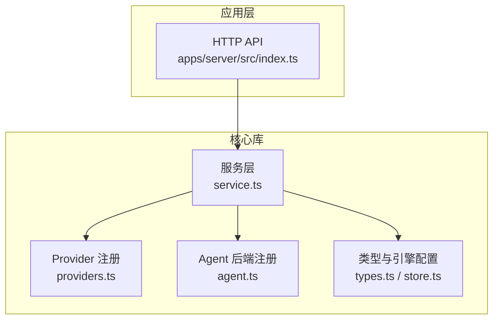
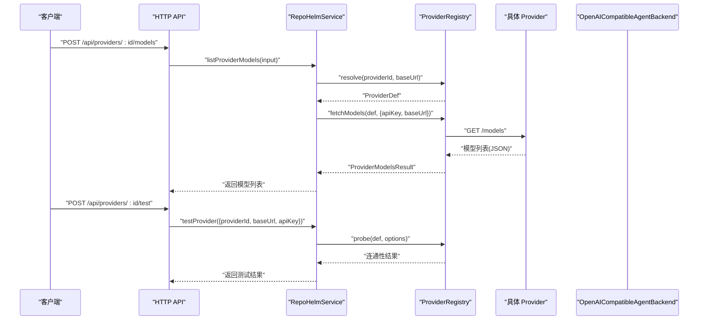
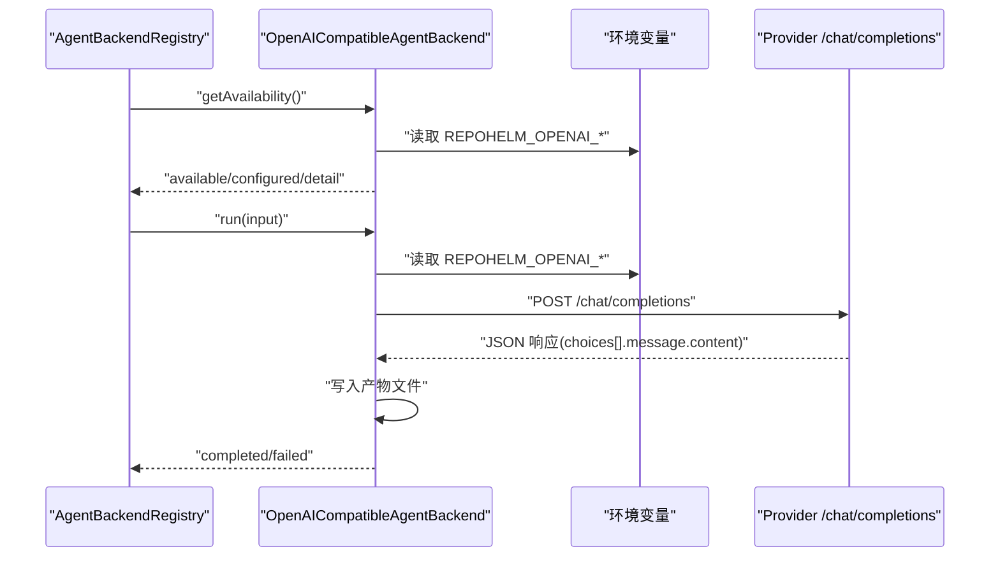
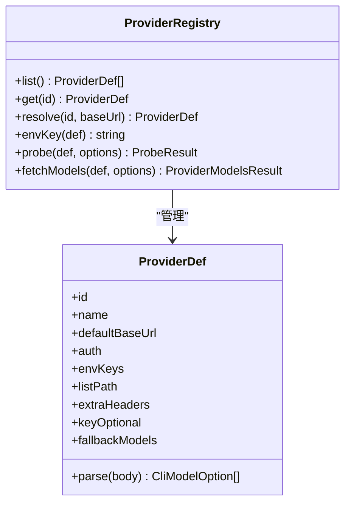
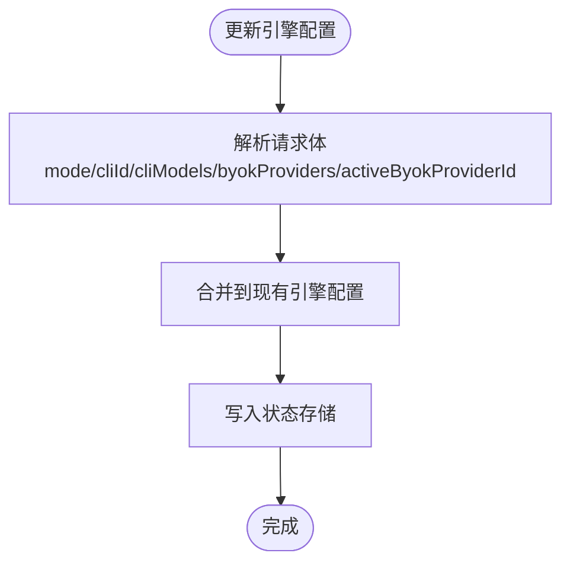
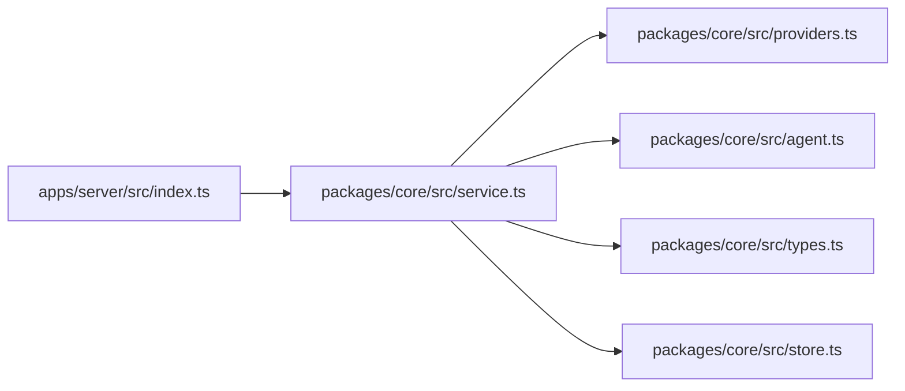

# Provider 集成

<cite>
**本文档引用的文件**
- [packages/core/src/providers.ts](file://packages/core/src/providers.ts)
- [packages/core/src/agent.ts](file://packages/core/src/agent.ts)
- [packages/core/src/types.ts](file://packages/core/src/types.ts)
- [packages/core/src/service.ts](file://packages/core/src/service.ts)
- [packages/core/src/store.ts](file://packages/core/src/store.ts)
- [apps/server/src/index.ts](file://apps/server/src/index.ts)
- [README.md](file://README.md)
</cite>

## 目录
1. [简介](#简介)
2. [项目结构](#项目结构)
3. [核心组件](#核心组件)
4. [架构总览](#架构总览)
5. [详细组件分析](#详细组件分析)
6. [依赖关系分析](#依赖关系分析)
7. [性能考量](#性能考量)
8. [故障排查指南](#故障排查指南)
9. [结论](#结论)
10. [附录](#附录)

## 简介
本文件面向 RepoHelm 的 Provider 集成，重点围绕 OpenAI 兼容 Agent Backend 的实现与配置进行系统化说明。内容涵盖：
- OpenAICompatibleAgentBackend 的工作原理与调用流程
- 环境变量 REPOHELM_OPENAI_BASE_URL、REPOHELM_OPENAI_MODEL、REPOHELM_OPENAI_API_KEY 的配置要求
- OpenAI 兼容 API 的请求参数与响应处理
- 对 Qwen、DeepSeek 等第三方 Provider 的支持说明
- Provider 列表与模型发现机制
- 错误处理与重试机制的最佳实践

## 项目结构
RepoHelm 的 Provider 集成主要分布在以下模块：
- Provider 注册与模型发现：packages/core/src/providers.ts
- Agent Backend 抽象与 OpenAI 兼容实现：packages/core/src/agent.ts
- 类型定义与引擎配置：packages/core/src/types.ts、packages/core/src/store.ts
- 服务层与 API：packages/core/src/service.ts、apps/server/src/index.ts
- 顶层说明与示例：README.md

图表来源
- [packages/core/src/providers.ts:1-304](file://packages/core/src/providers.ts#L1-L304)
- [packages/core/src/agent.ts:1-436](file://packages/core/src/agent.ts#L1-L436)
- [packages/core/src/types.ts:1-334](file://packages/core/src/types.ts#L1-L334)
- [packages/core/src/store.ts:1-166](file://packages/core/src/store.ts#L1-L166)
- [apps/server/src/index.ts:1-200](file://apps/server/src/index.ts#L1-L200)

章节来源
- [packages/core/src/providers.ts:1-304](file://packages/core/src/providers.ts#L1-L304)
- [packages/core/src/agent.ts:1-436](file://packages/core/src/agent.ts#L1-L436)
- [packages/core/src/types.ts:1-334](file://packages/core/src/types.ts#L1-L334)
- [packages/core/src/store.ts:1-166](file://packages/core/src/store.ts#L1-L166)
- [apps/server/src/index.ts:1-200](file://apps/server/src/index.ts#L1-L200)

## 核心组件
- Provider 注册与模型发现：统一管理各 Provider 的元信息（默认 Base URL、鉴权方式、模型列表解析器等），并提供探测与缓存机制。
- Agent Backend 注册与 OpenAI 兼容实现：抽象 Agent Backend 接口，内置 mock、外部 CLI、以及 OpenAI 兼容 Provider 实现。
- 引擎配置与 BYOK：支持 CLI 模式与 BYOK 模式，BYOK 支持按 Provider 保存独立的 apiKey/baseUrl/model。
- 服务层与 API：对外暴露 Provider 列表、模型查询、连通性探测、引擎配置更新等接口。

章节来源
- [packages/core/src/providers.ts:15-161](file://packages/core/src/providers.ts#L15-L161)
- [packages/core/src/agent.ts:41-411](file://packages/core/src/agent.ts#L41-L411)
- [packages/core/src/types.ts:212-269](file://packages/core/src/types.ts#L212-L269)
- [packages/core/src/store.ts:27-84](file://packages/core/src/store.ts#L27-L84)
- [apps/server/src/index.ts:150-187](file://apps/server/src/index.ts#L150-L187)

## 架构总览
RepoHelm 的 Provider 集成采用“Provider 注册 + Agent Backend + 服务层 + API”的分层设计：
- Provider 注册负责解析不同 Provider 的模型列表与鉴权方式
- Agent Backend 将 Provider 调用封装为统一的执行接口
- 服务层协调状态、缓存与配置，提供 API 能力
- API 层以 HTTP 形式暴露 Provider 查询、连通性测试与引擎配置

图表来源
- [apps/server/src/index.ts:155-176](file://apps/server/src/index.ts#L155-L176)
- [packages/core/src/service.ts:422-455](file://packages/core/src/service.ts#L422-L455)
- [packages/core/src/providers.ts:221-302](file://packages/core/src/providers.ts#L221-L302)

## 详细组件分析

### OpenAICompatibleAgentBackend 实现原理与配置
- 可用性检测：通过读取环境变量 REPOHELM_OPENAI_BASE_URL、REPOHELM_OPENAI_MODEL、REPOHELM_OPENAI_API_KEY 判断是否满足调用条件。
- 调用流程：向 {baseUrl}/chat/completions 发送 POST 请求，消息体包含 system 与 user 角色的消息；成功后将返回内容写入 worktree 的产物文件。
- 产物写入：在 worktree 下创建 repohelm-quest-output 目录，写入以 Quest 标题命名的 Markdown 文件。
- 与 AgentBackendRegistry 的集成：作为内置 backend 之一，可通过 agentBackendId 选择使用。

图表来源
- [packages/core/src/agent.ts:261-393](file://packages/core/src/agent.ts#L261-L393)

章节来源
- [packages/core/src/agent.ts:261-393](file://packages/core/src/agent.ts#L261-L393)

### Provider 定义与模型发现
- ProviderDef 字段：id、name、defaultBaseUrl、auth（bearer/x-api-key/query-key/none）、envKeys、listPath、extraHeaders、keyOptional、parse、fallbackModels。
- 解析器：针对不同 Provider 的 /models 响应结构提供 parse 函数（如 OpenAI 风格、Anthropic、Gemini）。
- 模型发现：根据 ProviderDef 组装 URL，附加鉴权头或查询参数，发起 GET /models，解析并去重，支持 keyOptional 的 Provider 回退到内置模型列表。
- 缓存与探测：服务层对模型结果进行 TTL 缓存，支持强制刷新；同时提供 probe 接口进行零成本连通性探测。

图表来源
- [packages/core/src/providers.ts:15-161](file://packages/core/src/providers.ts#L15-L161)
- [packages/core/src/providers.ts:163-302](file://packages/core/src/providers.ts#L163-L302)

章节来源
- [packages/core/src/providers.ts:15-161](file://packages/core/src/providers.ts#L15-L161)
- [packages/core/src/providers.ts:163-302](file://packages/core/src/providers.ts#L163-L302)

### 引擎配置与 BYOK Provider
- 引擎模式：cli 或 byok。byok 支持为每个 Provider 保存独立的 baseUrl、apiKey、model。
- 迁移逻辑：支持从旧的 byok 字段迁移到新的 byokProviders 结构，并根据 baseUrl 推断 Provider ID。
- 服务层更新：通过 PATCH /api/engine 更新引擎配置，包括 mode、cliId、cliModels、byokProviders、activeByokProviderId。

图表来源
- [packages/core/src/store.ts:27-84](file://packages/core/src/store.ts#L27-L84)
- [apps/server/src/index.ts:183-187](file://apps/server/src/index.ts#L183-L187)

章节来源
- [packages/core/src/store.ts:27-84](file://packages/core/src/store.ts#L27-L84)
- [apps/server/src/index.ts:183-187](file://apps/server/src/index.ts#L183-L187)

### API 定义与调用示例
- 列出 Provider 模型
  - 方法：POST /api/providers/:id/models
  - 请求体：{ baseUrl?, apiKey?, refresh? }
  - 响应：ProviderModelsResult（包含 providerId、models、live、detail、fetchedAt）
- Provider 连通性测试
  - 方法：POST /api/providers/:id/test
  - 请求体：{ baseUrl?, apiKey? }
  - 响应：CliTestResult（包含 id、ok、latencyMs、message）

章节来源
- [apps/server/src/index.ts:155-176](file://apps/server/src/index.ts#L155-L176)
- [packages/core/src/types.ts:221-227](file://packages/core/src/types.ts#L221-L227)
- [packages/core/src/types.ts:248-253](file://packages/core/src/types.ts#L248-L253)

## 依赖关系分析
- ProviderRegistry 依赖 ProviderDef 定义与解析器，负责模型发现与探测
- RepoHelmService 依赖 ProviderRegistry、AgentBackendRegistry、StateStore，提供 API 与业务编排
- OpenAICompatibleAgentBackend 依赖环境变量与 Provider 注册的默认 Base URL
- API 层通过 Zod Schema 校验请求体，确保数据一致性

图表来源
- [apps/server/src/index.ts:1-200](file://apps/server/src/index.ts#L1-L200)
- [packages/core/src/service.ts:56-71](file://packages/core/src/service.ts#L56-L71)

章节来源
- [apps/server/src/index.ts:1-200](file://apps/server/src/index.ts#L1-L200)
- [packages/core/src/service.ts:56-71](file://packages/core/src/service.ts#L56-L71)

## 性能考量
- 模型缓存：Provider 模型列表采用 TTL 缓存（约 6 小时），减少频繁请求；支持 refresh 强制刷新
- 超时控制：Provider 模型请求默认超时时间 10 秒，避免阻塞
- 并发执行：Agent Backend 在多个 worktree 上并发执行，提升吞吐
- 最佳实践
  - 优先使用 BYOK 模式并配置正确的 baseUrl 与 apiKey，减少回退
  - 对第三方 Provider（如 Qwen、DeepSeek）使用其官方 Base URL 与模型名
  - 在高延迟网络下适当增大超时或启用缓存

章节来源
- [packages/core/src/providers.ts:31](file://packages/core/src/providers.ts#L31)
- [packages/core/src/service.ts:422-455](file://packages/core/src/service.ts#L422-L455)

## 故障排查指南
- 环境变量未配置
  - 现象：OpenAI 兼容 Agent Backend 不可用
  - 处理：设置 REPOHELM_OPENAI_BASE_URL、REPOHELM_OPENAI_MODEL、REPOHELM_OPENAI_API_KEY
- Provider 连通性失败
  - 现象：/models 返回非 2xx 或空列表
  - 处理：检查 baseUrl 与 apiKey；使用 /api/providers/:id/test 进行探测；必要时启用 refresh
- 模型列表为空
  - 现象：返回内置默认模型或报错
  - 处理：确认 Provider 的 /models 响应结构与 parse 函数匹配；检查 keyOptional 配置
- Agent Backend 执行失败
  - 现象：Provider 调用失败或产物为空
  - 处理：检查 /chat/completions 响应；确认 system 与 user 消息格式；查看工作树路径与权限

章节来源
- [packages/core/src/agent.ts:265-280](file://packages/core/src/agent.ts#L265-L280)
- [packages/core/src/providers.ts:221-302](file://packages/core/src/providers.ts#L221-L302)
- [apps/server/src/index.ts:167-176](file://apps/server/src/index.ts#L167-L176)

## 结论
RepoHelm 的 Provider 集成通过统一的 Provider 注册与 Agent Backend 抽象，实现了对 OpenAI 兼容接口的灵活适配。结合 BYOK 配置与模型缓存机制，可在不修改核心代码的前提下支持 Qwen、DeepSeek 等第三方 Provider。建议在生产环境中：
- 明确配置 REPOHELM_OPENAI_BASE_URL、REPOHELM_OPENAI_MODEL、REPOHELM_OPENAI_API_KEY
- 使用 /api/providers/:id/test 与 /api/providers/:id/models 进行联调与监控
- 合理利用缓存与超时策略，平衡性能与准确性

## 附录

### 环境变量与配置要点
- REPOHELM_OPENAI_BASE_URL：Provider 的 Base URL（例如 Qwen/DeepSeek 的官方 v1 接口）
- REPOHELM_OPENAI_MODEL：模型名称（例如 qwen-plus、deepseek-chat 等）
- REPOHELM_OPENAI_API_KEY：Provider 的 API Key
- REPOHELM_CODEX_COMMAND / REPOHELM_CLAUDE_COMMAND / REPOHELM_OPENCODE_COMMAND：外部 CLI 后端命令模板（非 Provider，仅作参考）

章节来源
- [packages/core/src/agent.ts:265-279](file://packages/core/src/agent.ts#L265-L279)
- [README.md:62-77](file://README.md#L62-L77)

### 第三方 Provider 支持说明
- OpenAI 兼容：通过 openai-compatible Provider 与 Agent Backend 支持 Qwen、DeepSeek 等
- 其他 Provider：openai、anthropic、gemini、deepseek、openrouter 均有对应 ProviderDef 与解析器
- 选择策略：若未指定 providerId，将根据 baseUrl 推断；否则回退到 openai-compatible

章节来源
- [packages/core/src/providers.ts:79-161](file://packages/core/src/providers.ts#L79-L161)
- [packages/core/src/providers.ts:174-190](file://packages/core/src/providers.ts#L174-L190)

### 聊天补全 API 请求参数与响应处理
- 请求参数
  - Endpoint：{baseUrl}/chat/completions
  - Headers：Authorization: Bearer {apiKey}, Content-Type: application/json
  - Body：model、messages（包含 system 与 user 角色）
- 响应处理
  - 成功：提取 choices[0].message.content，写入 worktree 产物文件
  - 失败：记录错误信息并标记为 failed

章节来源
- [packages/core/src/agent.ts:342-392](file://packages/core/src/agent.ts#L342-L392)