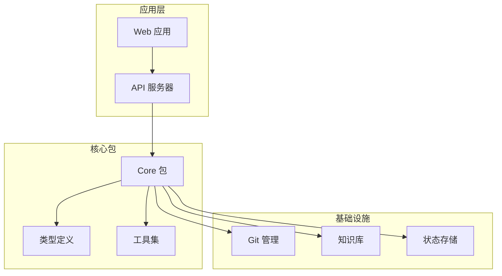
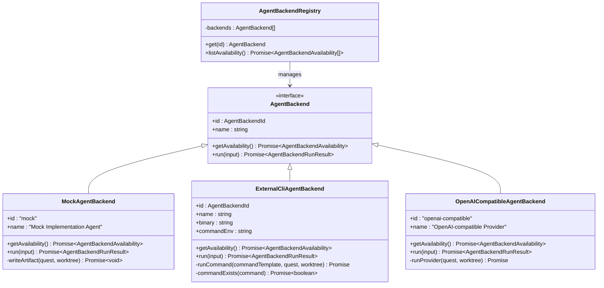
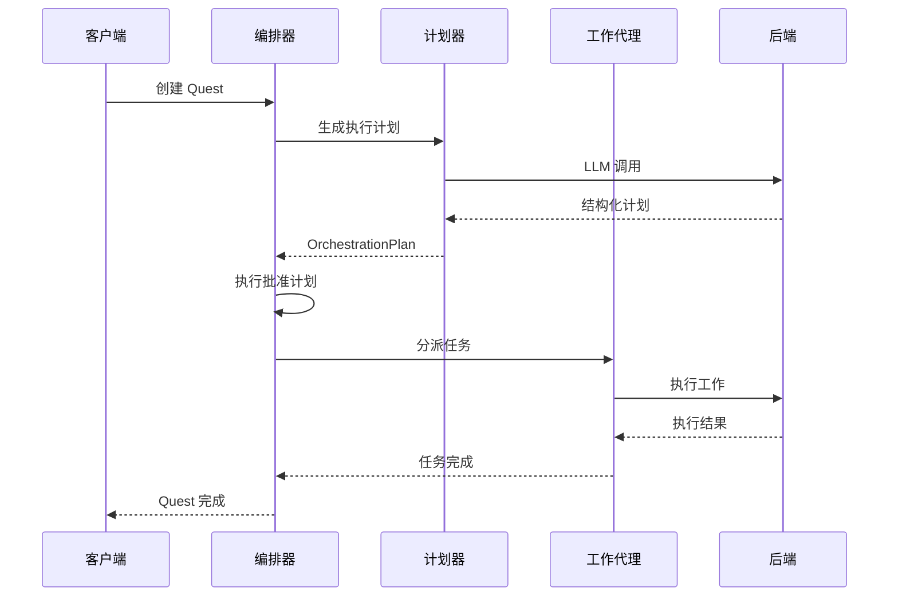
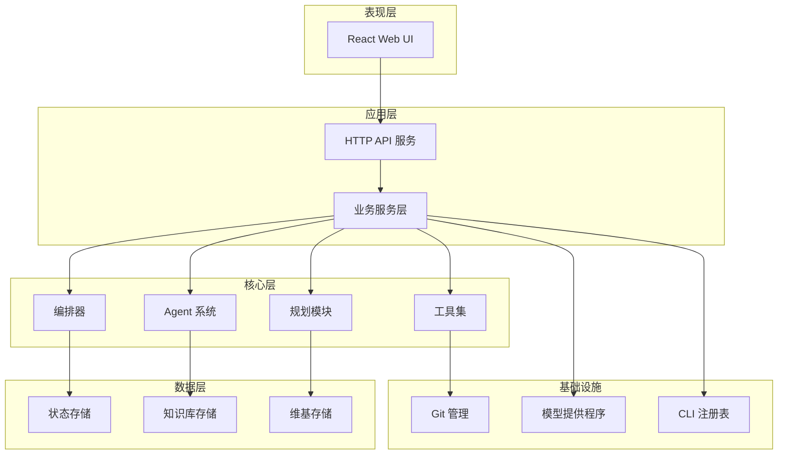
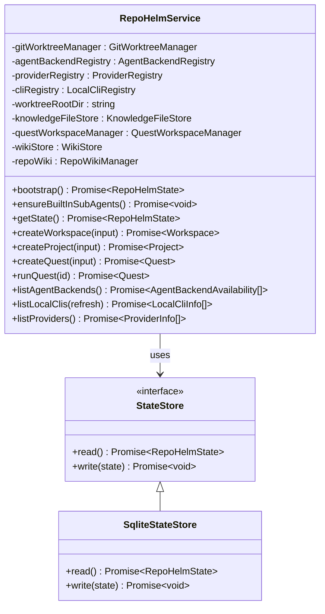
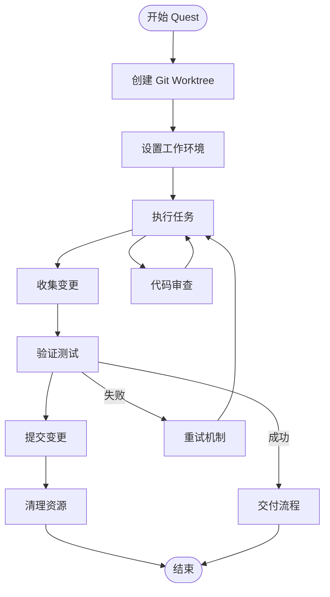
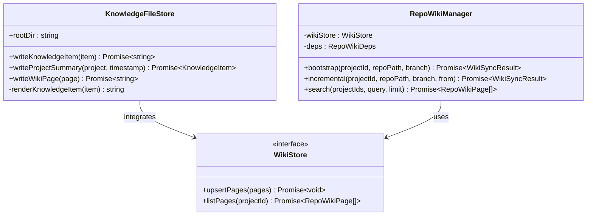
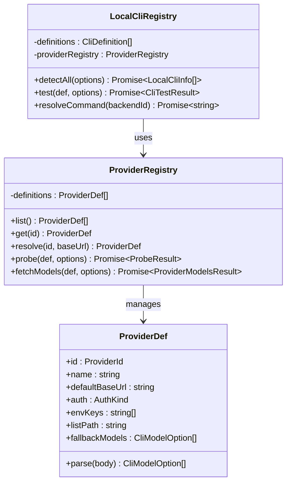

# 代码审查代理

<cite>
**本文档引用的文件**
- [README.md](file://README.md)
- [package.json](file://package.json)
- [packages/core/src/index.ts](file://packages/core/src/index.ts)
- [packages/core/src/agent.ts](file://packages/core/src/agent.ts)
- [packages/core/src/orchestrator.ts](file://packages/core/src/orchestrator.ts)
- [packages/core/src/service.ts](file://packages/core/src/service.ts)
- [packages/core/src/types.ts](file://packages/core/src/types.ts)
- [packages/core/src/git.ts](file://packages/core/src/git.ts)
- [packages/core/src/knowledge.ts](file://packages/core/src/knowledge.ts)
- [packages/core/src/planning.ts](file://packages/core/src/planning.ts)
- [packages/core/src/tools/delegate.ts](file://packages/core/src/tools/delegate.ts)
- [packages/core/src/tools/fs.ts](file://packages/core/src/tools/fs.ts)
- [packages/core/src/llm.ts](file://packages/core/src/llm.ts)
- [packages/core/src/providers.ts](file://packages/core/src/providers.ts)
- [packages/core/src/cli.ts](file://packages/core/src/cli.ts)
- [apps/server/src/index.ts](file://apps/server/src/index.ts)
- [apps/web/src/main.tsx](file://apps/web/src/main.tsx)
</cite>

## 目录
1. [项目概述](#项目概述)
2. [项目结构](#项目结构)
3. [核心组件](#核心组件)
4. [架构概览](#架构概览)
5. [详细组件分析](#详细组件分析)
6. [依赖关系分析](#依赖关系分析)
7. [性能考虑](#性能考虑)
8. [故障排除指南](#故障排除指南)
9. [结论](#结论)

## 项目概述

RepoHelm 是一个开源的 Quest 工作区原型，用于验证"虚拟 workspace + 多项目 Quest + Spec 驱动 + worktree 隔离 + Agent 编排 + 知识库"的产品方向。这是一个 MVP 骨架版本，提供了完整的代码审查代理功能。

### 主要特性

- **智能代理编排**: 支持多种 Agent Backend，包括 Mock、Codex CLI、Claude Code、OpenCode 和 OpenAI 兼容提供程序
- **多项目工作区管理**: 支持虚拟 workspace 和多个项目协作
- **代码审查流程**: 完整的 Quest 生命周期管理，从创建到交付
- **知识库集成**: 基于 Markdown 的知识库系统
- **安全策略**: 本地安全策略控制命令、文件范围、网络范围和秘密策略
- **多模型支持**: 支持多种 LLM 提供程序和 CLI 工具

## 项目结构



**图表来源**
- [package.json:1-22](file://package.json#L1-L22)
- [packages/core/src/index.ts:1-15](file://packages/core/src/index.ts#L1-L15)

**章节来源**
- [README.md:1-100](file://README.md#L1-L100)
- [package.json:1-22](file://package.json#L1-L22)

## 核心组件

### Agent 后端系统

RepoHelm 实现了一个灵活的 Agent 后端系统，支持多种执行模式：



**图表来源**
- [packages/core/src/agent.ts:41-411](file://packages/core/src/agent.ts#L41-L411)

### 任务编排器

SubAgentOrchestrator 实现了计划-执行的编排模式：



**图表来源**
- [packages/core/src/orchestrator.ts:58-236](file://packages/core/src/orchestrator.ts#L58-L236)

**章节来源**
- [packages/core/src/agent.ts:1-436](file://packages/core/src/agent.ts#L1-L436)
- [packages/core/src/orchestrator.ts:1-525](file://packages/core/src/orchestrator.ts#L1-L525)

## 架构概览

RepoHelm 采用了分层架构设计，将业务逻辑、数据访问和基础设施分离：



**图表来源**
- [apps/server/src/index.ts:1-782](file://apps/server/src/index.ts#L1-L782)
- [packages/core/src/service.ts:79-105](file://packages/core/src/service.ts#L79-L105)

## 详细组件分析

### 服务层架构

RepoHelm 的服务层是整个系统的中枢，负责协调各个组件：



**图表来源**
- [packages/core/src/service.ts:79-800](file://packages/core/src/service.ts#L79-L800)

### Git 工作树管理系统

RepoHelm 使用 Git worktree 来隔离每个 Quest 的工作环境：



**图表来源**
- [packages/core/src/git.ts:95-265](file://packages/core/src/git.ts#L95-L265)

**章节来源**
- [packages/core/src/service.ts:1-800](file://packages/core/src/service.ts#L1-L800)
- [packages/core/src/git.ts:1-402](file://packages/core/src/git.ts#L1-L402)

### 知识库系统

RepoHelm 实现了基于 Markdown 的知识库系统，支持项目知识的索引和检索：



**图表来源**
- [packages/core/src/knowledge.ts:12-81](file://packages/core/src/knowledge.ts#L12-L81)
- [packages/core/src/service.ts:102-120](file://packages/core/src/service.ts#L102-L120)

**章节来源**
- [packages/core/src/knowledge.ts:1-81](file://packages/core/src/knowledge.ts#L1-L81)

### 模型提供程序注册表

RepoHelm 支持多种 LLM 提供程序，包括 OpenAI、Anthropic、Gemini 等：



**图表来源**
- [packages/core/src/providers.ts:163-303](file://packages/core/src/providers.ts#L163-L303)
- [packages/core/src/cli.ts:124-385](file://packages/core/src/cli.ts#L124-L385)

**章节来源**
- [packages/core/src/providers.ts:1-304](file://packages/core/src/providers.ts#L1-L304)
- [packages/core/src/cli.ts:1-386](file://packages/core/src/cli.ts#L1-L386)

## 依赖关系分析

```mermaid
graph LR
subgraph "外部依赖"
React[React 18]
Hono[Hono]
Zod[Zod]
NodeFS[Node FS]
NodeChild[Node Child Process]
end
subgraph "内部包"
Core[@repohelm/core]
Server[@repohelm/server]
Web[@repohelm/web]
end
subgraph "核心功能"
Agent[Agent 系统]
Orchestrator[编排器]
Git[Git 管理]
Knowledge[知识库]
Tools[工具集]
end
React --> Web
Hono --> Server
Zod --> Server
NodeFS --> Core
NodeChild --> Core
Web --> Server
Server --> Core
Core --> Agent
Core --> Orchestrator
Core --> Git
Core --> Knowledge
Core --> Tools
```

**图表来源**
- [package.json:16-21](file://package.json#L16-L21)
- [apps/server/src/index.ts:1-12](file://apps/server/src/index.ts#L1-L12)

**章节来源**
- [package.json:1-22](file://package.json#L1-L22)

## 性能考虑

RepoHelm 在设计时考虑了多个性能优化点：

### 并发处理
- 使用 Promise.all 并行执行多个 Agent 后端
- 工作树创建和清理操作的并发优化
- 知识库索引的异步处理

### 缓存策略
- 模型提供程序列表的缓存机制
- Git 变更的增量同步
- 状态存储的原子性写入

### 资源管理
- 工作树的自动清理机制
- 超时控制和错误恢复
- 内存使用优化

## 故障排除指南

### 常见问题诊断

**Agent 后端不可用**
- 检查环境变量配置
- 验证外部 CLI 是否正确安装
- 确认 API 密钥和基础 URL 设置

**Git 操作失败**
- 检查 Git 版本和配置
- 验证工作树路径权限
- 确认 Git 配置文件完整性

**知识库同步错误**
- 检查文件系统权限
- 验证 Markdown 文件格式
- 确认数据库连接状态

**章节来源**
- [packages/core/src/agent.ts:125-142](file://packages/core/src/agent.ts#L125-L142)
- [packages/core/src/git.ts:394-400](file://packages/core/src/git.ts#L394-L400)

## 结论

RepoHelm 代码审查代理项目展现了现代 AI 代理系统的完整架构。通过模块化设计和清晰的职责分离，该项目实现了：

1. **高度可扩展性**: 支持多种 Agent Backend 和模型提供程序
2. **生产就绪特性**: 完整的状态管理、安全策略和审计日志
3. **开发者友好**: 清晰的 API 设计和丰富的配置选项
4. **未来可扩展**: 为后续功能增强预留了充足的空间

该项目为代码审查和自动化开发工作流提供了坚实的技术基础，特别适合需要智能代码审查和协作开发的企业级应用场景。