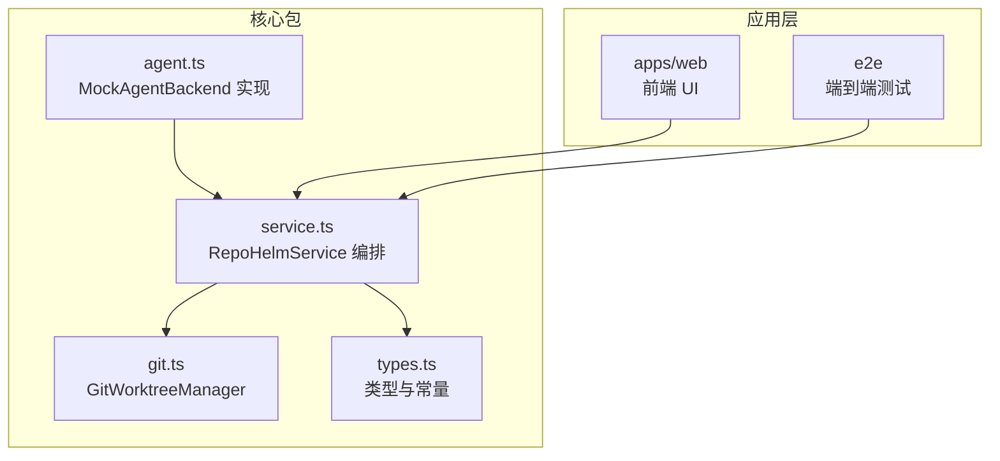
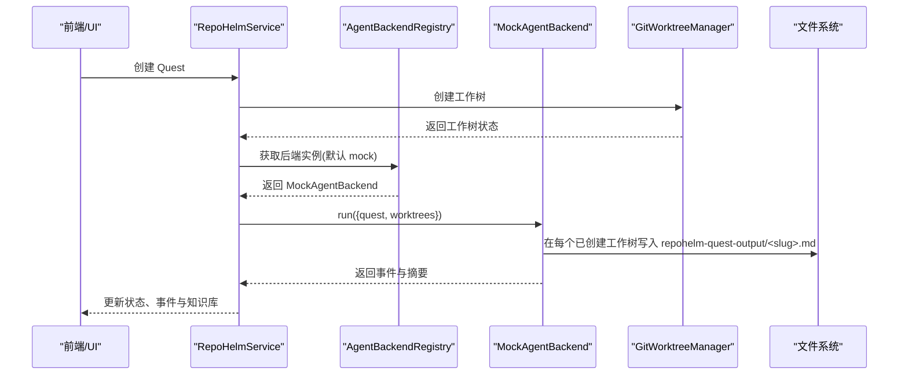
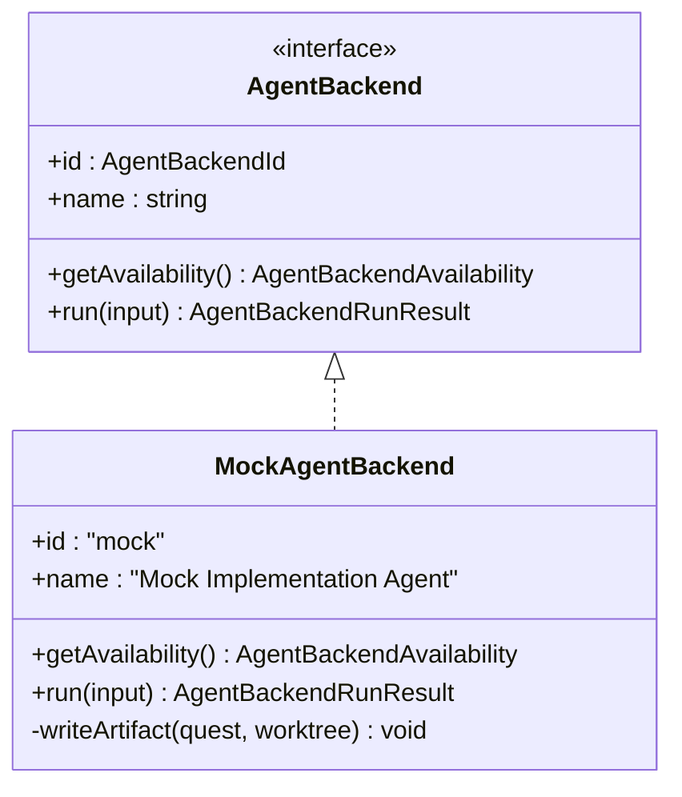
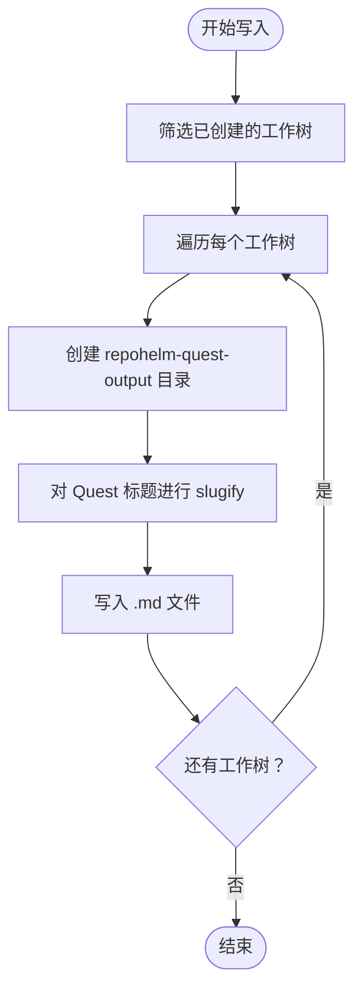
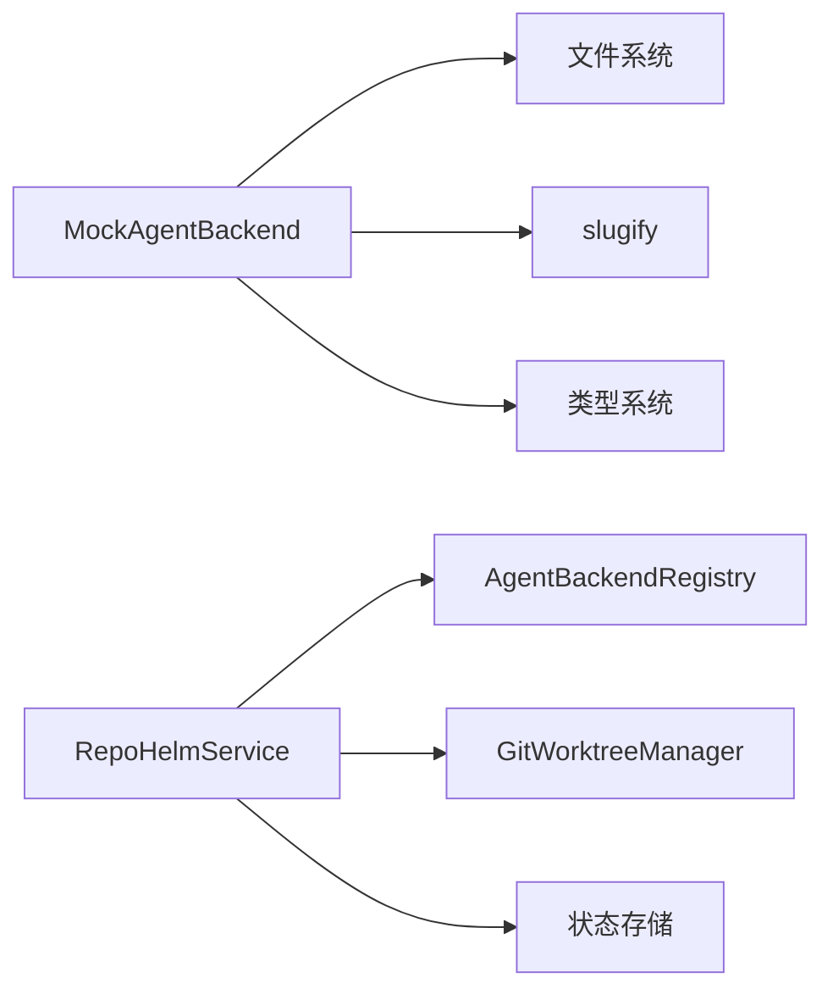

# 内置后端实现

<cite>
**本文引用的文件**
- [packages/core/src/agent.ts](file://packages/core/src/agent.ts)
- [packages/core/src/service.ts](file://packages/core/src/service.ts)
- [packages/core/src/types.ts](file://packages/core/src/types.ts)
- [packages/core/src/git.ts](file://packages/core/src/git.ts)
- [README.md](file://README.md)
- [playwright.config.ts](file://playwright.config.ts)
- [e2e/fixtures/codex-backend-fixture.cjs](file://e2e/fixtures/codex-backend-fixture.cjs)
- [e2e/quest-workspace.spec.ts](file://e2e/quest-workspace.spec.ts)
</cite>

## 目录
1. [简介](#简介)
2. [项目结构](#项目结构)
3. [核心组件](#核心组件)
4. [架构总览](#架构总览)
5. [详细组件分析](#详细组件分析)
6. [依赖关系分析](#依赖关系分析)
7. [性能考量](#性能考量)
8. [故障排查指南](#故障排查指南)
9. [结论](#结论)
10. [附录](#附录)

## 简介
本文件聚焦于 RepoHelm 内置后端（MockAgentBackend）的实现与使用，解释其如何在 Quest 生命周期中模拟文件写入与事件生成，以及输出文件的组织方式（repohelm-quest-output 目录）。文档还涵盖 slugify 命名规则、MockAgentBackend 的配置与调试技巧，并提供在开发环境中的使用方法与输出示例。

## 项目结构
RepoHelm 的核心逻辑集中在 packages/core 包中，MockAgentBackend 位于 agent.ts，服务编排与工作树管理位于 service.ts 与 git.ts，类型定义位于 types.ts。UI 与 e2e 测试位于 apps/web 与 e2e 目录，README 提供总体说明与启动方式。

图表来源
- [packages/core/src/agent.ts:48-115](file://packages/core/src/agent.ts#L48-L115)
- [packages/core/src/service.ts:56-133](file://packages/core/src/service.ts#L56-L133)
- [packages/core/src/git.ts:33-120](file://packages/core/src/git.ts#L33-L120)
- [packages/core/src/types.ts:15-16](file://packages/core/src/types.ts#L15-L16)

章节来源
- [packages/core/src/agent.ts:1-436](file://packages/core/src/agent.ts#L1-L436)
- [packages/core/src/service.ts:1-800](file://packages/core/src/service.ts#L1-L800)
- [packages/core/src/git.ts:1-343](file://packages/core/src/git.ts#L1-L343)
- [packages/core/src/types.ts:1-334](file://packages/core/src/types.ts#L1-L334)

## 核心组件
- MockAgentBackend：内置实现后端，负责在每个已创建的工作树中写入标准化的产物文件，并生成相应事件。
- RepoHelmService：协调 Quest 生命周期，创建/清理工作树，选择并执行 Agent Backend，汇总事件与知识库记录。
- GitWorktreeManager：封装 Git worktree 的创建、删除、变更检测等操作。
- 类型系统：统一定义 AgentBackendId、事件、工作树状态、能力推荐、安全策略等数据结构。

章节来源
- [packages/core/src/agent.ts:48-115](file://packages/core/src/agent.ts#L48-L115)
- [packages/core/src/service.ts:56-133](file://packages/core/src/service.ts#L56-L133)
- [packages/core/src/git.ts:33-120](file://packages/core/src/git.ts#L33-L120)
- [packages/core/src/types.ts:15-16](file://packages/core/src/types.ts#L15-L16)

## 架构总览
下图展示了 MockAgentBackend 在 RepoHelmService 中的调用链路与文件写入流程。

图表来源
- [packages/core/src/service.ts:589-615](file://packages/core/src/service.ts#L589-L615)
- [packages/core/src/agent.ts:62-86](file://packages/core/src/agent.ts#L62-L86)
- [packages/core/src/git.ts:79-120](file://packages/core/src/git.ts#L79-L120)

章节来源
- [packages/core/src/service.ts:544-698](file://packages/core/src/service.ts#L544-L698)
- [packages/core/src/agent.ts:48-115](file://packages/core/src/agent.ts#L48-L115)
- [packages/core/src/git.ts:79-120](file://packages/core/src/git.ts#L79-L120)

## 详细组件分析

### MockAgentBackend 组件分析
MockAgentBackend 实现了 AgentBackend 接口，提供可用性检查与执行逻辑。其核心行为包括：
- 可用性：始终报告可用且已配置，便于在开发与演示环境中快速验证。
- 执行：遍历所有已创建的工作树，写入标准化的产物文件至 repohelm-quest-output 目录，并生成事件。

图表来源
- [packages/core/src/agent.ts:41-46](file://packages/core/src/agent.ts#L41-L46)
- [packages/core/src/agent.ts:48-115](file://packages/core/src/agent.ts#L48-L115)

章节来源
- [packages/core/src/agent.ts:48-115](file://packages/core/src/agent.ts#L48-L115)

### 输出文件与 repohelm-quest-output 目录结构
MockAgentBackend 在每个已创建的工作树中写入以下文件：
- repohelm-quest-output/<slug>.md：产物文件，其中 <slug> 由 Quest 标题经 slugify 规则生成，内容包含 Quest 标题、需求、实现说明与验收标准快照等。

图表来源
- [packages/core/src/agent.ts:88-114](file://packages/core/src/agent.ts#L88-L114)

章节来源
- [packages/core/src/agent.ts:88-114](file://packages/core/src/agent.ts#L88-L114)

### slugify 函数与命名规则
slugify 用于将任意字符串转换为 URL/文件系统友好的短名称，规则如下：
- 转小写
- 将非字母数字字符替换为连字符
- 去除首尾连字符
- 截断至最多 48 个字符，若为空则返回默认值

该函数在 RepoHelmService 与 MockAgentBackend 中均有使用，确保工作树路径、分支名与输出文件名的一致性与可预测性。

章节来源
- [packages/core/src/service.ts:49-54](file://packages/core/src/service.ts#L49-L54)
- [packages/core/src/agent.ts:9-14](file://packages/core/src/agent.ts#L9-L14)

### MockAgentBackend 的配置与调试
- 默认行为：RepoHelm 在创建 Quest 时默认选择 mock 后端，无需额外配置即可运行。
- 调试技巧：
  - 在开发环境中，直接查看工作树中的 repohelm-quest-output 目录，确认产物文件是否生成。
  - 通过 RepoHelmService 的事件与知识库记录，核验后端执行摘要与事件类型。
  - 使用 e2e 测试脚本与 fixture，验证外部 CLI 后端在相同目录结构下的行为一致性。

章节来源
- [packages/core/src/service.ts:501-501](file://packages/core/src/service.ts#L501-L501)
- [README.md:62-77](file://README.md#L62-L77)
- [playwright.config.ts:20-21](file://playwright.config.ts#L20-L21)
- [e2e/fixtures/codex-backend-fixture.cjs:4-17](file://e2e/fixtures/codex-backend-fixture.cjs#L4-L17)

### 实际输出示例
- 文件路径：工作树根目录/repohelm-quest-output/<slug>.md
- 示例内容要点：
  - 标题：Quest 标题
  - Requirement：原始需求文本
  - Implementation Notes：说明由 MockAgentBackend 生成，提示已创建隔离工作树并写入产物
  - Acceptance Criteria Snapshot：复制 Quest 的验收标准列表

章节来源
- [packages/core/src/agent.ts:92-113](file://packages/core/src/agent.ts#L92-L113)

### 开发环境中的使用方法
- 启动：执行安装与开发服务器命令，访问本地 UI 与 API。
- 创建 Quest：在 UI 中创建 Quest，默认使用 mock 后端。
- 验证输出：在工作树中打开 repohelm-quest-output 目录，确认 <slug>.md 文件存在。
- e2e 测试：通过 Playwright 启动测试，测试脚本会导出独立的状态目录，避免污染本地状态。

章节来源
- [README.md:33-50](file://README.md#L33-L50)
- [README.md:79-85](file://README.md#L79-L85)
- [playwright.config.ts:19-25](file://playwright.config.ts#L19-L25)

## 依赖关系分析
- MockAgentBackend 依赖：
  - 文件系统：写入 repohelm-quest-output 目录与文件
  - slugify：生成文件名
  - 类型系统：使用 Quest、WorktreeState 等类型
- RepoHelmService 依赖：
  - AgentBackendRegistry：选择并获取后端实例
  - GitWorktreeManager：创建/清理工作树
  - 状态存储：持久化状态、事件、知识库与审计日志

图表来源
- [packages/core/src/agent.ts:48-115](file://packages/core/src/agent.ts#L48-L115)
- [packages/core/src/service.ts:58-71](file://packages/core/src/service.ts#L58-L71)

章节来源
- [packages/core/src/agent.ts:48-115](file://packages/core/src/agent.ts#L48-L115)
- [packages/core/src/service.ts:56-71](file://packages/core/src/service.ts#L56-L71)

## 性能考量
- MockAgentBackend 的写入操作为同步文件写入，通常开销较小，适合开发与演示场景。
- 在大规模并发工作树场景下，建议关注磁盘 I/O 与文件系统性能，必要时可考虑批量写入或异步优化。
- 事件生成与状态写入集中在 RepoHelmService 中，应避免在高频事件中重复写入大型对象，保持事件粒度适中。

## 故障排查指南
- 未生成产物文件：
  - 检查工作树是否成功创建（status 为 created）
  - 确认 repohelm-quest-output 目录是否可写
  - 核对 Quest 标题是否为空，slugify 是否返回有效值
- 事件不完整：
  - 查看 RepoHelmService 的事件数组，确认 MockAgentBackend 的事件类型与摘要
  - 检查知识库记录是否成功写入
- e2e 测试异常：
  - 确认测试环境变量（如 REPOHELM_CODEX_COMMAND）正确设置
  - 清理测试生成的临时工作树与分支

章节来源
- [packages/core/src/agent.ts:62-86](file://packages/core/src/agent.ts#L62-L86)
- [packages/core/src/service.ts:673-688](file://packages/core/src/service.ts#L673-L688)
- [playwright.config.ts:20-21](file://playwright.config.ts#L20-L21)
- [e2e/quest-workspace.spec.ts:16-33](file://e2e/quest-workspace.spec.ts#L16-L33)

## 结论
MockAgentBackend 为 RepoHelm 提供了零配置、可预测的实现后端，能够在工作树中生成标准化产物文件并触发事件，从而完整验证 Quest、工作树与 diff review 的闭环。通过 slugify 统一命名规则与 repohelm-quest-output 目录结构，开发者可在本地快速定位与审阅产物。结合服务编排与 GitWorktreeManager，MockAgentBackend 成为探索与演示 RepoHelm 工作流的理想起点。

## 附录
- 相关类型与常量定义可参考 types.ts 中的 AgentBackendId、AgentEvent、WorktreeState 等。
- e2e 测试脚本与 fixture 展示了外部 CLI 后端在相同目录结构下的行为，有助于对比与调试。

章节来源
- [packages/core/src/types.ts:15-16](file://packages/core/src/types.ts#L15-L16)
- [e2e/fixtures/codex-backend-fixture.cjs:4-17](file://e2e/fixtures/codex-backend-fixture.cjs#L4-L17)