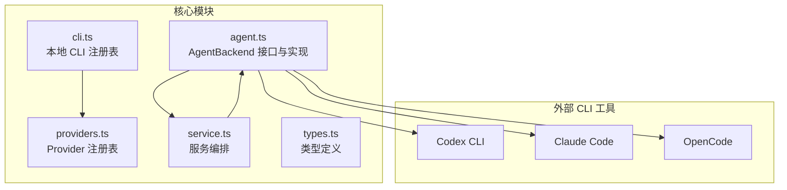
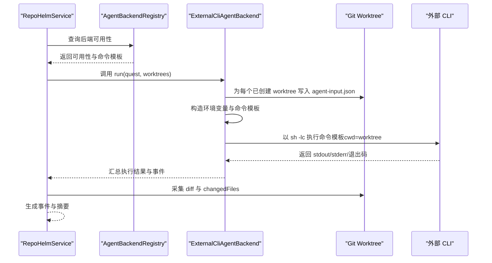
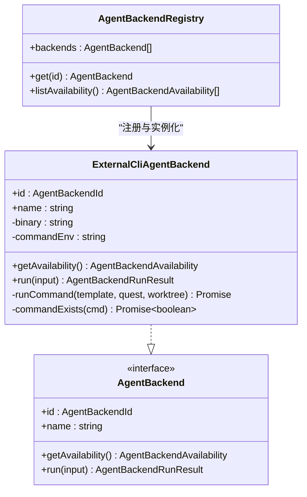
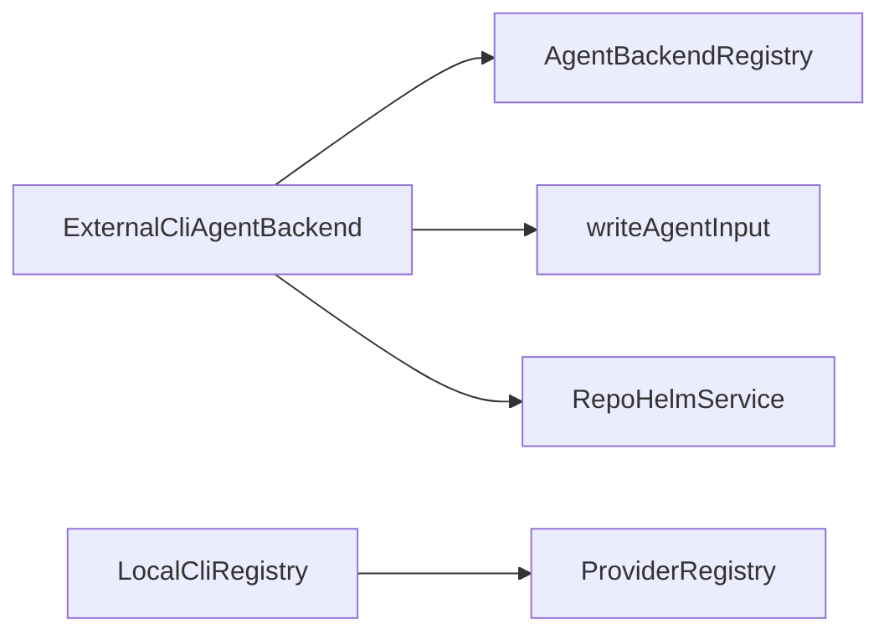

# 外部 CLI 后端

<cite>
**本文档引用的文件**
- [packages/core/src/agent.ts](file://packages/core/src/agent.ts)
- [packages/core/src/cli.ts](file://packages/core/src/cli.ts)
- [packages/core/src/providers.ts](file://packages/core/src/providers.ts)
- [packages/core/src/service.ts](file://packages/core/src/service.ts)
- [packages/core/src/types.ts](file://packages/core/src/types.ts)
- [README.md](file://README.md)
- [MILESTONES.md](file://MILESTONES.md)
- [packages/core/src/service.test.ts](file://packages/core/src/service.test.ts)
- [e2e/fixtures/codex-backend-fixture.cjs](file://e2e/fixtures/codex-backend-fixture.cjs)
</cite>

## 目录
1. [简介](#简介)
2. [项目结构](#项目结构)
3. [核心组件](#核心组件)
4. [架构总览](#架构总览)
5. [详细组件分析](#详细组件分析)
6. [依赖关系分析](#依赖关系分析)
7. [性能与可靠性](#性能与可靠性)
8. [故障排除指南](#故障排除指南)
9. [结论](#结论)
10. [附录](#附录)

## 简介
本文件面向 RepoHelm 的外部 CLI 后端（ExternalCliAgentBackend），系统性阐述其设计与实现，重点包括：
- ExternalCliAgentBackend 的职责、可用性检测与命令模板机制
- 支持的 CLI 工具：Codex CLI、Claude Code、OpenCode 的集成方式
- 命令模板配置：REPOHELM_CODEX_COMMAND、REPOHELM_CLAUDE_COMMAND、REPOHELM_OPENCODE_COMMAND 的使用
- 命令检测与可用性检查的实现细节
- 工作树环境变量传递与 agent-input.json 文件生成流程
- 配置示例与常见问题排查

## 项目结构
RepoHelm 的核心逻辑集中在 packages/core，其中与外部 CLI 后端相关的模块包括：
- agent.ts：定义 AgentBackend 接口及其实现，含 ExternalCliAgentBackend、AgentBackendRegistry、以及 agent-input.json 生成逻辑
- cli.ts：本地 CLI 注册表与探测逻辑（用于 Provider 与 CLI 的统一模型枚举）
- providers.ts：Provider 注册表与模型列表拉取（与 CLI 的 Provider 模式互补）
- service.ts：服务编排，负责创建 Quest、创建工作树、调用 Agent Backend、采集 diff 与事件
- types.ts：类型定义，包含 AgentBackendId 等关键枚举
- README.md 与 MILESTONES.md：提供高层说明与里程碑记录
- service.test.ts：包含外部 CLI 后端的真实执行与安全策略阻断测试
- e2e/fixtures/codex-backend-fixture.cjs：e2e 测试夹具，演示如何在工作树中生成产物

图表来源
- [packages/core/src/agent.ts:117-259](file://packages/core/src/agent.ts#L117-L259)
- [packages/core/src/service.ts:56-71](file://packages/core/src/service.ts#L56-L71)
- [packages/core/src/cli.ts:112-198](file://packages/core/src/cli.ts#L112-L198)
- [packages/core/src/providers.ts:163-303](file://packages/core/src/providers.ts#L163-L303)

章节来源
- [packages/core/src/agent.ts:117-259](file://packages/core/src/agent.ts#L117-L259)
- [packages/core/src/service.ts:56-71](file://packages/core/src/service.ts#L56-L71)
- [README.md:62-77](file://README.md#L62-L77)

## 核心组件
- ExternalCliAgentBackend：封装外部 CLI 后端的可用性检测与执行流程，支持命令模板注入、工作树隔离执行、环境变量传递与产物采集
- AgentBackendRegistry：注册内置 mock、Codex CLI、Claude Code、OpenCode、OpenAI-compatible 等后端，统一查询可用性
- LocalCliRegistry：本地 CLI 探测与模型枚举（与 Provider 模式互补，用于 CLI 的模型列表与可用性）
- ProviderRegistry：Provider 模型列表拉取（用于 OpenAI-compatible 等 Provider 模式）

章节来源
- [packages/core/src/agent.ts:117-259](file://packages/core/src/agent.ts#L117-L259)
- [packages/core/src/agent.ts:395-411](file://packages/core/src/agent.ts#L395-L411)
- [packages/core/src/cli.ts:112-198](file://packages/core/src/cli.ts#L112-L198)
- [packages/core/src/providers.ts:163-303](file://packages/core/src/providers.ts#L163-L303)

## 架构总览
ExternalCliAgentBackend 的执行链路如下：
- 服务层（RepoHelmService）创建 Quest 并创建工作树
- AgentBackendRegistry 获取所选后端的可用性
- ExternalCliAgentBackend 在每个已创建的工作树中执行命令模板
- 命令模板通过 sh -lc 执行，注入 REPOHELM_* 系列环境变量与 agent-input.json 路径
- 外部 CLI 读取 agent-input.json，执行实现并生成产物
- 服务层采集 stdout/stderr、退出码、diff 与事件，形成可审查产物

图表来源
- [packages/core/src/agent.ts:144-221](file://packages/core/src/agent.ts#L144-L221)
- [packages/core/src/agent.ts:223-249](file://packages/core/src/agent.ts#L223-L249)
- [packages/core/src/agent.ts:413-431](file://packages/core/src/agent.ts#L413-L431)
- [packages/core/src/service.ts:589-620](file://packages/core/src/service.ts#L589-L620)

章节来源
- [packages/core/src/agent.ts:144-221](file://packages/core/src/agent.ts#L144-L221)
- [packages/core/src/agent.ts:223-249](file://packages/core/src/agent.ts#L223-L249)
- [packages/core/src/agent.ts:413-431](file://packages/core/src/agent.ts#L413-L431)
- [packages/core/src/service.ts:589-620](file://packages/core/src/service.ts#L589-L620)

## 详细组件分析

### ExternalCliAgentBackend 类
- 职责
  - 检测命令可用性（binary 是否存在）与配置状态（REPOHELM_*_COMMAND 是否设置）
  - 在每个已创建的工作树中执行命令模板
  - 传递 REPOHELM_QUEST_ID、REPOHELM_QUEST_TITLE、REPOHELM_QUEST_REQUIREMENT、REPOHELM_WORKTREE_PATH、REPOHELM_AGENT_INPUT 等环境变量
  - 采集 stdout/stderr、错误信息与事件，汇总为可审查产物
- 关键点
  - 命令模板来自环境变量（REPOHELM_CODEX_COMMAND、REPOHELM_CLAUDE_COMMAND、REPOHELM_OPENCODE_COMMAND）
  - 执行使用 sh -lc，确保命令在工作树目录下运行
  - 超时时间受 REPOHELM_AGENT_TIMEOUT_MS 控制，默认约 120 秒
  - agent-input.json 写入工作树根下的 .repohelm 目录

图表来源
- [packages/core/src/agent.ts:117-259](file://packages/core/src/agent.ts#L117-L259)
- [packages/core/src/agent.ts:395-411](file://packages/core/src/agent.ts#L395-L411)

章节来源
- [packages/core/src/agent.ts:117-259](file://packages/core/src/agent.ts#L117-L259)

### 命令模板与环境变量
- 命令模板
  - Codex CLI：REPOHELM_CODEX_COMMAND
  - Claude Code：REPOHELM_CLAUDE_COMMAND
  - OpenCode：REPOHELM_OPENCODE_COMMAND
- 执行时注入的环境变量
  - REPOHELM_QUEST_ID、REPOHELM_QUEST_TITLE、REPOHELM_QUEST_REQUIREMENT
  - REPOHELM_WORKTREE_PATH
  - REPOHELM_AGENT_INPUT：指向 agent-input.json 的绝对路径
  - REPOHELM_AGENT_TIMEOUT_MS：超时毫秒数（默认约 120 秒）
- 执行方式
  - 使用 sh -lc 执行命令模板，cwd 指向工作树目录
  - 通过 process.env 透传当前环境

章节来源
- [packages/core/src/agent.ts:223-249](file://packages/core/src/agent.ts#L223-L249)
- [packages/core/src/agent.ts:226-236](file://packages/core/src/agent.ts#L226-L236)
- [packages/core/src/agent.ts:228-228](file://packages/core/src/agent.ts#L228-L228)

### 命令可用性检测机制
- 可用性判断
  - 若命令模板已设置，则认为“已配置”
  - 若系统中存在对应二进制，则认为“已检测到”
  - 综合两者生成 detail 说明
- 未满足条件时的行为
  - run() 返回 blocked 状态，并记录事件
  - 未创建工作树或缺少命令模板时均会阻断

章节来源
- [packages/core/src/agent.ts:125-142](file://packages/core/src/agent.ts#L125-L142)
- [packages/core/src/agent.ts:144-182](file://packages/core/src/agent.ts#L144-L182)

### agent-input.json 文件生成
- 生成位置
  - 每个工作树根目录下的 .repohelm/agent-input.json
- 内容字段
  - questId、title、requirement、spec、worktree
- 生成时机
  - 在 runCommand 前调用 writeAgentInput，确保外部 CLI 可读取

章节来源
- [packages/core/src/agent.ts:413-431](file://packages/core/src/agent.ts#L413-L431)

### 支持的 CLI 工具与集成方式
- Codex CLI
  - 后端 ID：codex-cli
  - 命令模板：REPOHELM_CODEX_COMMAND
  - 二进制名称：codex
- Claude Code
  - 后端 ID：claude-code
  - 命令模板：REPOHELM_CLAUDE_COMMAND
  - 二进制名称：claude
- OpenCode
  - 后端 ID：opencode
  - 命令模板：REPOHELM_OPENCODE_COMMAND
  - 二进制名称：opencode

章节来源
- [packages/core/src/agent.ts:398-400](file://packages/core/src/agent.ts#L398-L400)
- [packages/core/src/types.ts:14-15](file://packages/core/src/types.ts#L14-L15)

### 与 Provider 的差异与互补
- ExternalCliAgentBackend
  - 通过命令模板在工作树中执行外部 CLI
  - 通过 agent-input.json 传递标准化输入
  - 通过 REPOHELM_* 环境变量与工作树隔离
- Provider（OpenAI-compatible）
  - 通过 REST API 调用 Provider 的 chat/completions
  - 通过环境变量 REPOHELM_OPENAI_BASE_URL、REPOHELM_OPENAI_MODEL、REPOHELM_OPENAI_API_KEY 配置
  - 生成文本产物到工作树中的 repohelm-quest-output

章节来源
- [packages/core/src/agent.ts:261-393](file://packages/core/src/agent.ts#L261-L393)
- [packages/core/src/providers.ts:163-303](file://packages/core/src/providers.ts#L163-L303)

## 依赖关系分析
- ExternalCliAgentBackend 依赖
  - AgentBackend 接口：统一可用性与执行规范
  - AgentBackendRegistry：注册内置与外部 CLI 后端
  - RepoHelmService：创建工作树、采集 diff 与事件
  - writeAgentInput：生成 agent-input.json
- 与 CLI/Provider 的关系
  - LocalCliRegistry：用于 CLI 的模型枚举与可用性探测（与 Provider 模式互补）
  - ProviderRegistry：用于 Provider 的模型列表拉取（与 CLI 模式互补）

图表来源
- [packages/core/src/agent.ts:395-411](file://packages/core/src/agent.ts#L395-L411)
- [packages/core/src/agent.ts:413-431](file://packages/core/src/agent.ts#L413-L431)
- [packages/core/src/cli.ts:112-198](file://packages/core/src/cli.ts#L112-L198)
- [packages/core/src/providers.ts:163-303](file://packages/core/src/providers.ts#L163-L303)

章节来源
- [packages/core/src/agent.ts:395-411](file://packages/core/src/agent.ts#L395-L411)
- [packages/core/src/cli.ts:112-198](file://packages/core/src/cli.ts#L112-L198)
- [packages/core/src/providers.ts:163-303](file://packages/core/src/providers.ts#L163-L303)

## 性能与可靠性
- 超时控制
  - REPOHELM_AGENT_TIMEOUT_MS 控制外部 CLI 执行超时，默认约 120 秒
- 并发执行
  - 对多个工作树并发执行命令模板，提升整体吞吐
- 输出截断
  - 对 stdout/stderr 错误信息进行截断，避免过长日志影响 UI 展示
- 模型枚举与 Provider 模式
  - LocalCliRegistry 支持 CLI 自带的模型枚举（如 opencode models）
  - ProviderRegistry 支持通过 REST 拉取 Provider 模型列表，减少硬编码

章节来源
- [packages/core/src/agent.ts:228-228](file://packages/core/src/agent.ts#L228-L228)
- [packages/core/src/agent.ts:433-435](file://packages/core/src/agent.ts#L433-L435)
- [packages/core/src/cli.ts:146-156](file://packages/core/src/cli.ts#L146-L156)
- [packages/core/src/providers.ts:221-302](file://packages/core/src/providers.ts#L221-L302)

## 故障排除指南
- 后端不可用
  - 症状：后端状态为 blocked，summary 包含“未检测到/未配置”
  - 排查：确认 REPOHELM_*_COMMAND 是否设置；确认对应二进制是否存在于 PATH
- 无可用工作树
  - 症状：后端状态为 blocked，提示“没有可执行的 worktree”
  - 排查：确认 Quest 已成功创建工作树；检查工作树状态
- 命令执行失败
  - 症状：事件中包含 stderr、error 字段
  - 排查：检查命令模板语法；确认外部 CLI 已正确登录/鉴权；查看超时设置
- agent-input.json 未生成
  - 症状：外部 CLI 无法读取输入
  - 排查：确认 writeAgentInput 是否在 runCommand 前调用；确认工作树目录权限
- 安全策略阻断
  - 症状：后端被阻断，审计日志记录 denied
  - 排查：检查命令审批策略与 allowlist；调整命令模板或申请白名单

章节来源
- [packages/core/src/agent.ts:125-142](file://packages/core/src/agent.ts#L125-L142)
- [packages/core/src/agent.ts:144-182](file://packages/core/src/agent.ts#L144-L182)
- [packages/core/src/agent.ts:223-249](file://packages/core/src/agent.ts#L223-L249)
- [packages/core/src/agent.ts:413-431](file://packages/core/src/agent.ts#L413-L431)
- [packages/core/src/service.test.ts:442-475](file://packages/core/src/service.test.ts#L442-L475)

## 结论
ExternalCliAgentBackend 提供了 RepoHelm 与外部 CLI 工具（Codex CLI、Claude Code、OpenCode）的标准化集成通道。通过命令模板与工作树隔离执行，配合 agent-input.json 输入与 REPOHELM_* 环境变量，实现了可审计、可追踪的外部 Agent 执行闭环。结合 LocalCliRegistry 与 ProviderRegistry，RepoHelm 能够在 CLI 与 Provider 两种模式之间灵活切换，满足不同场景下的模型与执行需求。

## 附录

### 配置示例
- 设置命令模板
  - Codex CLI：REPOHELM_CODEX_COMMAND="your-codex-command"
  - Claude Code：REPOHELM_CLAUDE_COMMAND="claude ..."
  - OpenCode：REPOHELM_OPENCODE_COMMAND="opencode ..."
- 可选：设置超时
  - REPOHELM_AGENT_TIMEOUT_MS="180000"
- 可选：启用 GitHub PR
  - REPOHELM_ENABLE_GH_PR="1"

章节来源
- [README.md:62-77](file://README.md#L62-L77)

### 运行流程与产物
- 外部 CLI 在工作树中执行命令模板
- 读取 agent-input.json 获取标准化输入
- 生成产物到 repohelm-quest-output 目录
- 服务层采集 stdout/stderr、退出码、diff 与事件，形成可审查产物

章节来源
- [packages/core/src/agent.ts:223-249](file://packages/core/src/agent.ts#L223-L249)
- [packages/core/src/agent.ts:413-431](file://packages/core/src/agent.ts#L413-L431)
- [e2e/fixtures/codex-backend-fixture.cjs:1-20](file://e2e/fixtures/codex-backend-fixture.cjs#L1-L20)