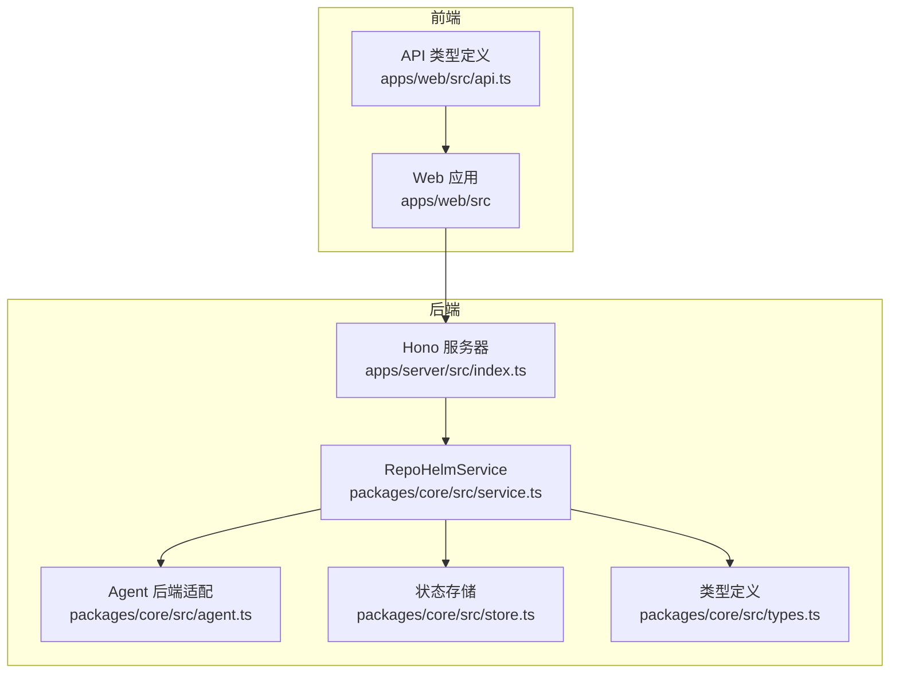
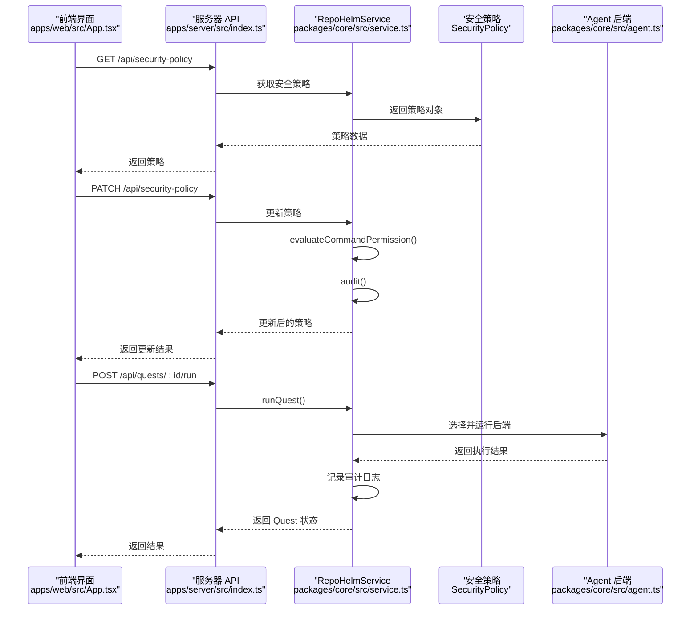
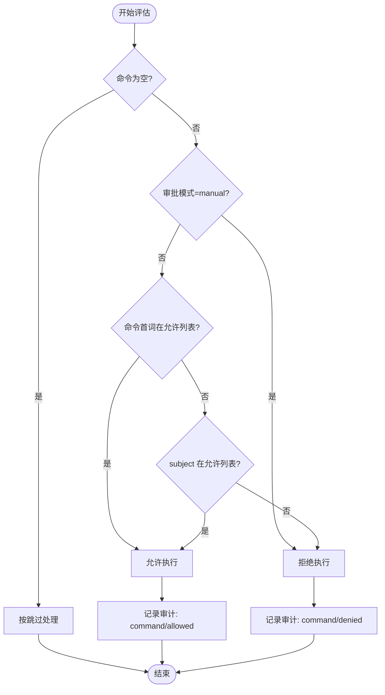
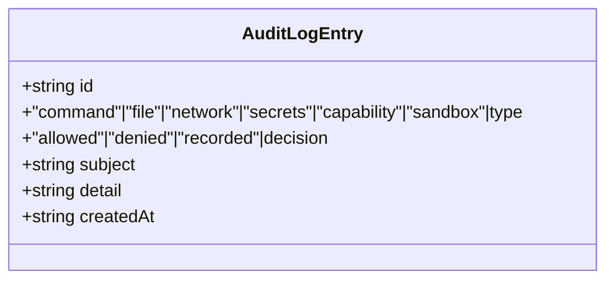
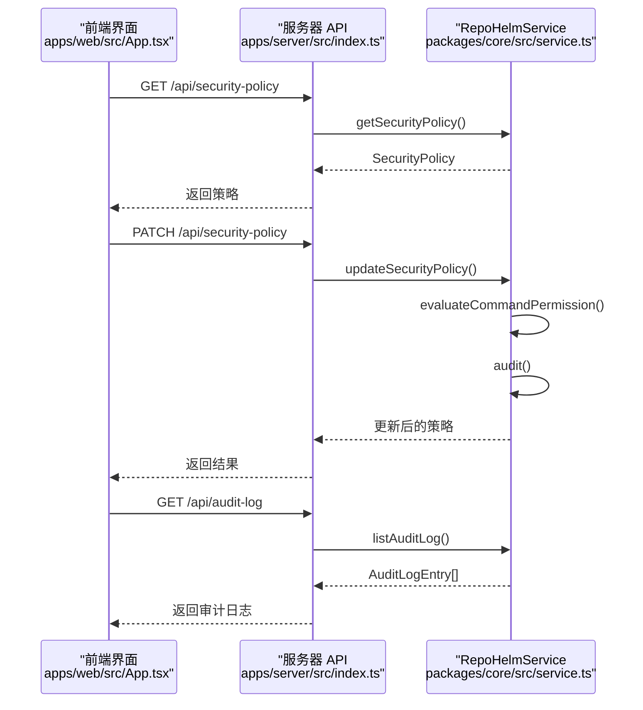
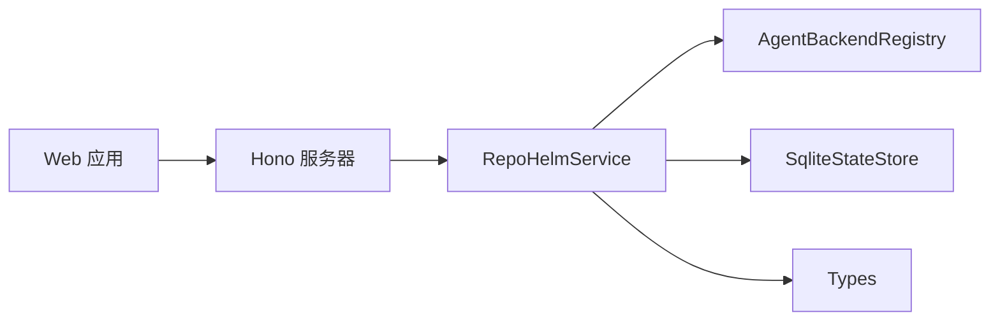

# 安全策略和权限控制

<cite>
**本文档引用的文件**
- [README.md](file://README.md)
- [packages/core/src/agent.ts](file://packages/core/src/agent.ts)
- [packages/core/src/service.ts](file://packages/core/src/service.ts)
- [packages/core/src/store.ts](file://packages/core/src/store.ts)
- [packages/core/src/types.ts](file://packages/core/src/types.ts)
- [apps/server/src/index.ts](file://apps/server/src/index.ts)
- [apps/web/src/api.ts](file://apps/web/src/api.ts)
- [apps/web/src/App.tsx](file://apps/web/src/App.tsx)
</cite>

## 目录
1. [简介](#简介)
2. [项目结构](#项目结构)
3. [核心组件](#核心组件)
4. [架构总览](#架构总览)
5. [详细组件分析](#详细组件分析)
6. [依赖关系分析](#依赖关系分析)
7. [性能考量](#性能考量)
8. [故障排查指南](#故障排查指南)
9. [结论](#结论)
10. [附录](#附录)

## 简介
本文件面向 RepoHelm Agent 后端的安全策略与权限控制，系统性阐述命令审批模式、文件/网络作用域控制、密钥策略、沙箱运行时隔离以及审计日志等关键机制。文档基于仓库现有实现进行代码级解析，并提供配置示例、合规检查清单与安全防护建议。

## 项目结构
RepoHelm 后端以 Hono 服务器提供 REST API，核心业务逻辑位于 @repohelm/core 包，前端通过 apps/web 提供可视化界面与安全策略配置入口。安全策略数据持久化于 SQLite 状态存储，策略变更通过 API 更新并记录审计日志。

图表来源
- [apps/server/src/index.ts:1-366](file://apps/server/src/index.ts#L1-L366)
- [packages/core/src/service.ts:1-1331](file://packages/core/src/service.ts#L1-L1331)
- [packages/core/src/agent.ts:1-436](file://packages/core/src/agent.ts#L1-L436)
- [packages/core/src/store.ts:1-166](file://packages/core/src/store.ts#L1-L166)
- [packages/core/src/types.ts:1-334](file://packages/core/src/types.ts#L1-L334)

章节来源
- [README.md:1-100](file://README.md#L1-L100)
- [apps/server/src/index.ts:1-366](file://apps/server/src/index.ts#L1-L366)
- [packages/core/src/service.ts:1-1331](file://packages/core/src/service.ts#L1-L1331)

## 核心组件
- 安全策略模型（SecurityPolicy）：定义命令审批模式、允许命令列表、文件/网络作用域、密钥策略、沙箱运行时与更新时间戳。
- RepoHelmService：负责策略评估、命令许可判定、审计日志记录与策略更新。
- Agent 后端：外部 CLI、OpenAI 兼容 Provider 与 Mock 实现，均受安全策略约束。
- 状态存储：默认 SQLite，持久化安全策略与审计日志。
- 服务器 API：提供获取/更新安全策略、列出审计日志等接口。

章节来源
- [packages/core/src/types.ts:135-143](file://packages/core/src/types.ts#L135-L143)
- [packages/core/src/service.ts:893-914](file://packages/core/src/service.ts#L893-L914)
- [packages/core/src/agent.ts:117-259](file://packages/core/src/agent.ts#L117-L259)
- [packages/core/src/store.ts:13-25](file://packages/core/src/store.ts#L13-L25)
- [apps/server/src/index.ts:194-208](file://apps/server/src/index.ts#L194-L208)

## 架构总览
下图展示安全策略在系统中的关键交互路径：前端通过 API 获取/更新策略，后端在执行命令前后进行许可评估并记录审计日志。

图表来源
- [apps/web/src/App.tsx:1212-1249](file://apps/web/src/App.tsx#L1212-L1249)
- [apps/server/src/index.ts:194-208](file://apps/server/src/index.ts#L194-L208)
- [packages/core/src/service.ts:544-698](file://packages/core/src/service.ts#L544-L698)
- [packages/core/src/service.ts:1257-1278](file://packages/core/src/service.ts#L1257-L1278)
- [packages/core/src/agent.ts:144-221](file://packages/core/src/agent.ts#L144-L221)

## 详细组件分析

### 命令审批模式与许可评估
- 审批模式
  - allowlist：仅允许白名单内的命令或后端标识命中。
  - manual：需要人工审批，当前策略不允许自动执行。
- 许可评估规则
  - 若命令为空，视为跳过处理。
  - 当模式为 manual，一律拒绝。
  - 当模式为 allowlist：若命令首词命中 allowedCommands，或 subject（如后端 id）命中，则允许。
- 审计记录
  - 对命令执行进行决策记录，类型为 command，包含 subject、detail 等字段。

图表来源
- [packages/core/src/service.ts:1257-1278](file://packages/core/src/service.ts#L1257-L1278)

章节来源
- [packages/core/src/service.ts:591-615](file://packages/core/src/service.ts#L591-L615)
- [packages/core/src/service.ts:784-801](file://packages/core/src/service.ts#L784-L801)
- [packages/core/src/service.ts:1257-1278](file://packages/core/src/service.ts#L1257-L1278)

### 文件作用域控制
- 作用域定义
  - fileScopes：["workspace", "worktree", "knowledge"]，限制 Agent 后端在工作区、worktree 与知识目录内的文件操作。
- 生效范围
  - 在 runQuest 与 deliverQuest 等流程中，策略对命令执行进行许可评估，间接约束文件操作范围。
- 限制说明
  - 作用域为策略层面的限制方向，具体文件系统访问仍取决于后端实现与工作树隔离。当前实现默认 worktree 隔离，配合策略可降低跨作用域访问风险。

章节来源
- [packages/core/src/store.ts:13-25](file://packages/core/src/store.ts#L13-L25)
- [packages/core/src/types.ts:138](file://packages/core/src/types.ts#L138)
- [packages/core/src/service.ts:589-601](file://packages/core/src/service.ts#L589-L601)

### 网络作用域控制
- 作用域定义
  - networkScopes：["localhost"]，限制对外部网络的访问范围。
- 生效范围
  - 在 runQuest 与 deliverQuest 中，策略对命令执行进行许可评估，间接约束网络访问行为。
- 限制说明
  - 该策略为方向性限制，实际网络访问控制取决于后端实现与运行环境。建议结合系统防火墙与容器/沙箱进一步加固。

章节来源
- [packages/core/src/store.ts:13-25](file://packages/core/src/store.ts#L13-L25)
- [packages/core/src/types.ts:139](file://packages/core/src/types.ts#L139)
- [packages/core/src/service.ts:784-791](file://packages/core/src/service.ts#L784-L791)

### 密钥策略
- 策略选项
  - redact-env：对环境变量中的敏感信息进行脱敏处理。
  - deny：禁止访问敏感密钥。
- 生效范围
  - 在 runQuest 与 deliverQuest 中，策略对命令执行进行许可评估，间接影响密钥可见性与传递。
- 最佳实践
  - 优先使用 redact-env；如需严格限制，可启用 deny。
  - 建议通过环境注入最小化暴露面，避免在命令行参数中携带敏感信息。

章节来源
- [packages/core/src/store.ts:13-25](file://packages/core/src/store.ts#L13-L25)
- [packages/core/src/types.ts:140](file://packages/core/src/types.ts#L140)
- [packages/core/src/service.ts:591-601](file://packages/core/src/service.ts#L591-L601)

### 沙箱运行时
- 运行时类型
  - local：默认本地执行。
  - external：预留外部沙箱运行时（当前为本地实现）。
- 生效范围
  - 在 runQuest 与 deliverQuest 中，策略对命令执行进行许可评估，同时记录 sandbox 类型审计。
- 最佳实践
  - 在生产环境中建议启用外部沙箱运行时，结合容器/命名空间隔离提升安全性。

章节来源
- [packages/core/src/store.ts:13-25](file://packages/core/src/store.ts#L13-L25)
- [packages/core/src/types.ts:141](file://packages/core/src/types.ts#L141)
- [packages/core/src/service.ts:898-914](file://packages/core/src/service.ts#L898-L914)

### 审计日志
- 日志结构
  - 类型：command、file、network、secrets、capability、sandbox。
  - 决策：allowed、denied、recorded。
  - 字段：subject、detail、createdAt。
- 记录场景
  - 命令执行许可：command/allowed 或 command/denied。
  - 安全策略更新：sandbox/recorded。
  - 能力确认：capability/recorded。
- 查询接口
  - GET /api/audit-log 返回最近 100 条审计记录。

图表来源
- [packages/core/src/types.ts:145-152](file://packages/core/src/types.ts#L145-L152)

章节来源
- [packages/core/src/service.ts:1280-1289](file://packages/core/src/service.ts#L1280-L1289)
- [apps/server/src/index.ts:205-208](file://apps/server/src/index.ts#L205-L208)
- [apps/web/src/App.tsx:1234-1246](file://apps/web/src/App.tsx#L1234-L1246)

### API 与前端集成
- 获取/更新安全策略
  - GET /api/security-policy：返回当前策略。
  - PATCH /api/security-policy：更新策略（支持 commandApprovalMode、allowedCommands、fileScopes、networkScopes、secretsPolicy、sandboxRuntime）。
- 列出审计日志
  - GET /api/audit-log：返回最近 100 条审计记录。
- 前端展示
  - 安全面板展示策略与审计日志，便于运维与安全人员审查。

图表来源
- [apps/server/src/index.ts:194-208](file://apps/server/src/index.ts#L194-L208)
- [apps/web/src/api.ts:318-324](file://apps/web/src/api.ts#L318-L324)
- [apps/web/src/App.tsx:1212-1249](file://apps/web/src/App.tsx#L1212-L1249)

章节来源
- [apps/server/src/index.ts:194-208](file://apps/server/src/index.ts#L194-L208)
- [apps/web/src/api.ts:128-145](file://apps/web/src/api.ts#L128-L145)
- [apps/web/src/App.tsx:1212-1249](file://apps/web/src/App.tsx#L1212-L1249)

## 依赖关系分析
- 组件耦合
  - RepoHelmService 依赖 Agent 后端注册表与状态存储，负责策略评估与审计。
  - 服务器 API 仅暴露策略查询与更新接口，不直接执行命令，降低攻击面。
- 外部依赖
  - 外部 CLI 与 Provider 通过环境变量注入命令模板与凭据，策略评估确保其在白名单范围内。
- 循环依赖
  - 未发现循环依赖；模块职责清晰，接口边界明确。

图表来源
- [packages/core/src/service.ts:56-71](file://packages/core/src/service.ts#L56-L71)
- [apps/server/src/index.ts:37](file://apps/server/src/index.ts#L37)
- [apps/web/src/api.ts:276-289](file://apps/web/src/api.ts#L276-L289)

章节来源
- [packages/core/src/service.ts:56-71](file://packages/core/src/service.ts#L56-L71)
- [apps/server/src/index.ts:37](file://apps/server/src/index.ts#L37)

## 性能考量
- 策略评估开销
  - 许可评估为常数时间复杂度 O(1)，对整体性能影响可忽略。
- 审计日志写入
  - 每次策略更新与命令执行均产生一次审计记录，建议在高并发场景下定期归档与压缩历史日志。
- 状态存储
  - SQLite 写入为顺序 IO，建议在策略更新频率较低的场景下无需额外优化。

## 故障排查指南
- 命令被拒绝
  - 检查命令审批模式与 allowedCommands 是否包含目标命令或后端标识。
  - 确认命令是否为空（空命令按跳过处理）。
- 策略更新无效
  - 确认 PATCH /api/security-policy 请求体字段正确（commandApprovalMode、allowedCommands、fileScopes、networkScopes、secretsPolicy、sandboxRuntime）。
  - 查看审计日志中是否存在 sandbox/recorded 记录。
- 审计日志为空
  - 确认 GET /api/audit-log 是否返回最新记录。
  - 检查服务重启或状态迁移是否导致日志丢失。

章节来源
- [packages/core/src/service.ts:1257-1278](file://packages/core/src/service.ts#L1257-L1278)
- [apps/server/src/index.ts:194-208](file://apps/server/src/index.ts#L194-L208)
- [packages/core/src/store.ts:117-166](file://packages/core/src/store.ts#L117-L166)

## 结论
RepoHelm 当前实现了基于策略的命令审批、文件/网络作用域、密钥策略与沙箱运行时声明，配合审计日志形成完整的安全闭环。建议在生产环境中启用外部沙箱运行时、严格白名单与密钥脱敏策略，并建立定期审计与告警机制。

## 附录

### 安全配置示例
- 基础策略（来自默认状态）
  - commandApprovalMode: allowlist
  - allowedCommands: ["mock","node","git","pnpm"]
  - fileScopes: ["workspace","worktree","knowledge"]
  - networkScopes: ["localhost"]
  - secretsPolicy: redact-env
  - sandboxRuntime: local
- 更新策略（示例字段）
  - commandApprovalMode: manual
  - allowedCommands: ["git","pnpm"]
  - fileScopes: ["worktree"]
  - networkScopes: ["localhost","10.0.0.0/8"]
  - secretsPolicy: deny
  - sandboxRuntime: external

章节来源
- [packages/core/src/store.ts:13-25](file://packages/core/src/store.ts#L13-L25)
- [apps/server/src/index.ts:97-104](file://apps/server/src/index.ts#L97-L104)

### 合规性检查清单
- [ ] 已启用命令审批模式（allowlist 或 manual）
- [ ] allowedCommands 仅包含必要命令
- [ ] fileScopes 限定在 worktree/knowledge 等最小范围
- [ ] networkScopes 严格限制至 localhost 或受控网段
- [ ] secretsPolicy 设置为 redact-env 或 deny
- [ ] sandboxRuntime 设为 external（生产环境）
- [ ] 审计日志开启并定期审查
- [ ] 外部 CLI/Provider 凭据通过环境变量注入，不硬编码在命令行

### 安全漏洞防护与监控告警实施指南
- 命令审批
  - 强制使用 allowlist，定期审查白名单。
  - 对 manual 模式建立审批工单与双人复核。
- 文件/网络作用域
  - 结合系统防火墙与容器隔离，限制对外部网络访问。
  - 定期扫描 worktree 与知识目录的异常变更。
- 密钥策略
  - 优先 redact-env；对必须使用的密钥，采用最小权限与轮换策略。
  - 禁止在命令行参数中直接传递敏感信息。
- 沙箱运行时
  - 生产环境启用 external 沙箱，使用受限用户与只读根文件系统。
- 审计与告警
  - 对 denied 决策与策略变更触发告警。
  - 建立日志聚合与 SIEM 集成，定期生成安全报告。