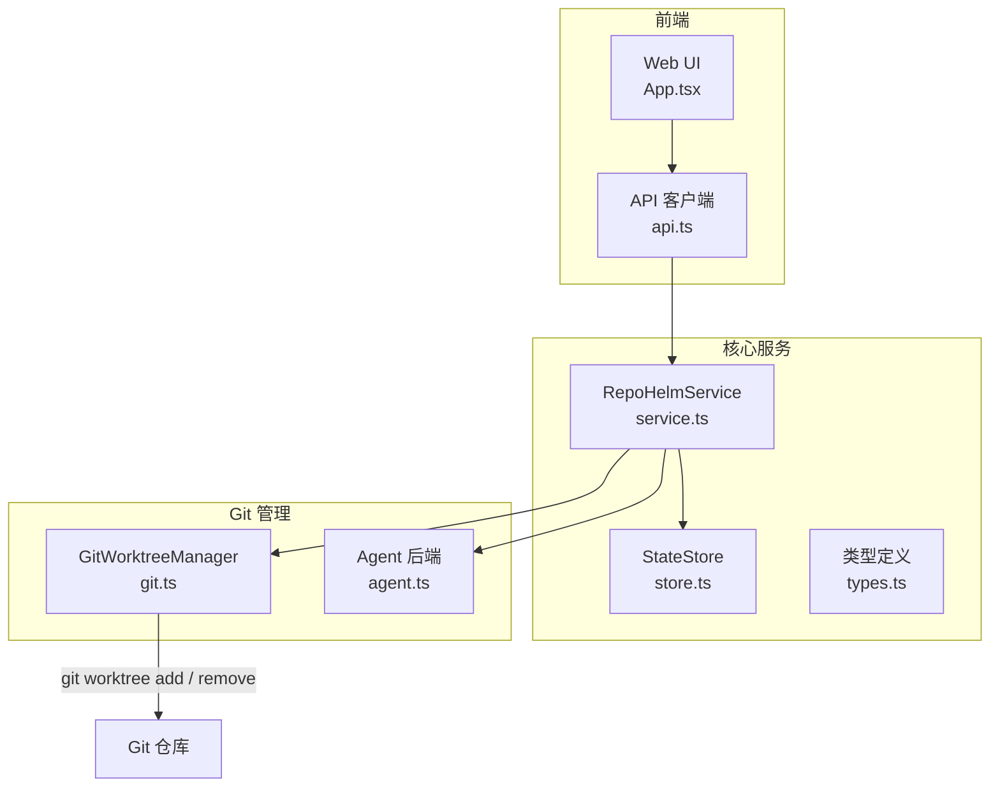
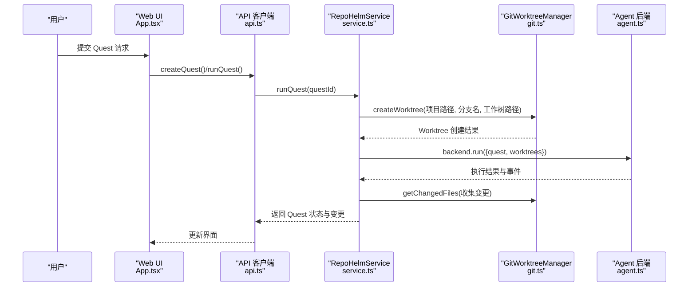
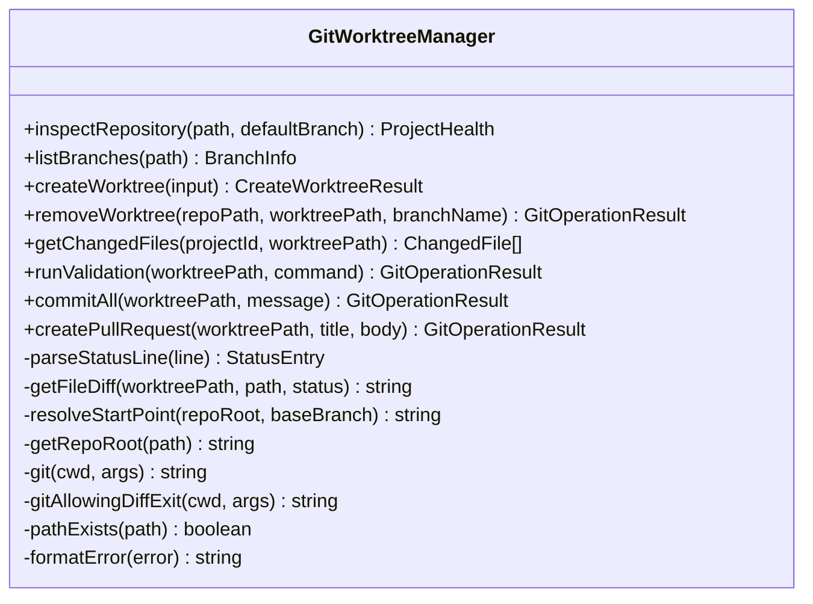
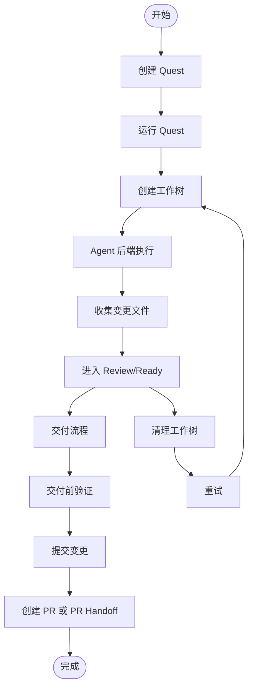
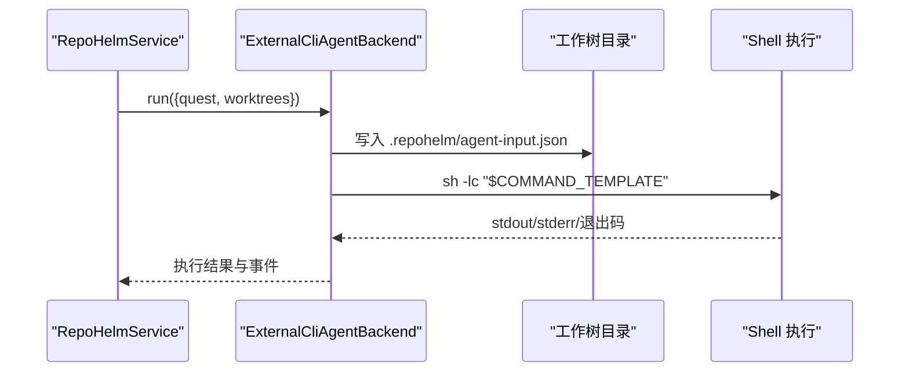
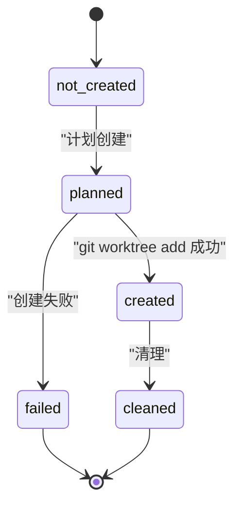
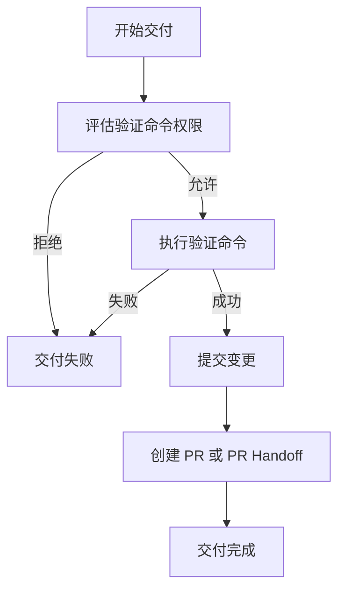
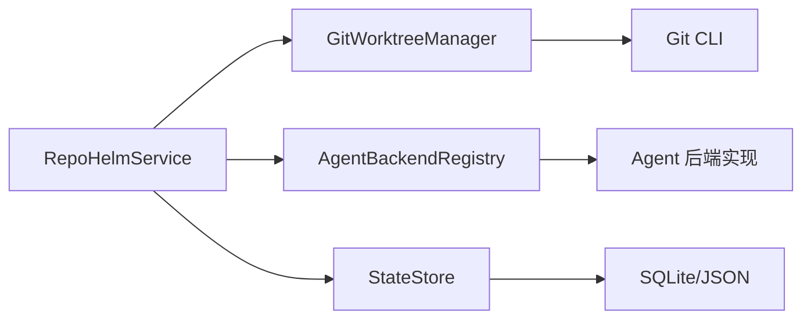

# Git 工作树管理

<cite>
**本文档引用的文件**
- [packages/core/src/git.ts](file://packages/core/src/git.ts)
- [packages/core/src/service.ts](file://packages/core/src/service.ts)
- [packages/core/src/agent.ts](file://packages/core/src/agent.ts)
- [packages/core/src/types.ts](file://packages/core/src/types.ts)
- [packages/core/src/store.ts](file://packages/core/src/store.ts)
- [README.md](file://README.md)
- [apps/web/src/App.tsx](file://apps/web/src/App.tsx)
- [apps/web/src/api.ts](file://apps/web/src/api.ts)
- [e2e/quest-workspace.spec.ts](file://e2e/quest-workspace.spec.ts)
</cite>

## 目录
1. [简介](#简介)
2. [项目结构](#项目结构)
3. [核心组件](#核心组件)
4. [架构总览](#架构总览)
5. [详细组件分析](#详细组件分析)
6. [依赖关系分析](#依赖关系分析)
7. [性能考虑](#性能考虑)
8. [故障排除指南](#故障排除指南)
9. [结论](#结论)
10. [附录](#附录)

## 简介
本文件面向 RepoHelm 的 Git 工作树管理系统，系统性阐述工作树（Git Worktree）的概念、隔离原理及其在 RepoHelm 中的应用。文档涵盖工作树的创建、清理、重试与交付流程，项目健康检查机制（路径验证、Git 仓库检测等），工作树状态管理与分支管理的实现细节，以及与 Agent 执行的集成方式和文件变更处理。同时提供使用示例、配置选项、故障排除指南与性能优化建议。

RepoHelm 通过真实调用 `git worktree add` 实现隔离的工作副本，结合安全策略与状态持久化，确保在多项目、多 Quest 场景下的可审计、可重复与可交付。

## 项目结构
RepoHelm 的工作树管理位于核心包 packages/core 下，主要文件如下：
- packages/core/src/git.ts：Git 工作树管理器，封装工作树生命周期与 Git 操作
- packages/core/src/service.ts：业务服务层，编排工作树创建、清理、重试、交付与状态持久化
- packages/core/src/agent.ts：Agent 后端注册与执行，支持内置 mock 与外部 CLI/Provider
- packages/core/src/types.ts：类型定义，包括工作树状态、变更文件、交付状态等
- packages/core/src/store.ts：状态存储（SQLite/JSON），持久化工作空间、项目、Quest、知识库等
- apps/web/src/App.tsx 与 apps/web/src/api.ts：前端交互，触发 Quest 创建、运行、交付与清理
- e2e/quest-workspace.spec.ts：端到端测试，清理测试产生的工作树与分支

**图表来源**
- [packages/core/src/service.ts](file://packages/core/src/service.ts)
- [packages/core/src/git.ts](file://packages/core/src/git.ts)
- [packages/core/src/agent.ts](file://packages/core/src/agent.ts)
- [packages/core/src/store.ts](file://packages/core/src/store.ts)
- [apps/web/src/App.tsx](file://apps/web/src/App.tsx)
- [apps/web/src/api.ts](file://apps/web/src/api.ts)

**章节来源**
- [packages/core/src/service.ts](file://packages/core/src/service.ts)
- [packages/core/src/git.ts](file://packages/core/src/git.ts)
- [packages/core/src/agent.ts](file://packages/core/src/agent.ts)
- [packages/core/src/types.ts](file://packages/core/src/types.ts)
- [packages/core/src/store.ts](file://packages/core/src/store.ts)
- [apps/web/src/App.tsx](file://apps/web/src/App.tsx)
- [apps/web/src/api.ts](file://apps/web/src/api.ts)

## 核心组件
- GitWorktreeManager：负责工作树的创建、删除、状态检查、变更文件收集、验证命令执行、提交与 PR 创建等
- RepoHelmService：协调工作树生命周期，与 Agent 后端协作，维护状态并持久化
- Agent 后端：支持 mock、外部 CLI 与 OpenAI 兼容 Provider，按工作树执行实现
- 类型系统：统一描述工作树状态、变更文件、交付状态、项目健康度等
- 状态存储：SQLite/JSON 存储，支持迁移与持久化

**章节来源**
- [packages/core/src/git.ts](file://packages/core/src/git.ts)
- [packages/core/src/service.ts](file://packages/core/src/service.ts)
- [packages/core/src/agent.ts](file://packages/core/src/agent.ts)
- [packages/core/src/types.ts](file://packages/core/src/types.ts)
- [packages/core/src/store.ts](file://packages/core/src/store.ts)

## 架构总览
下图展示了从 UI 触发到工作树创建、Agent 执行、变更收集与交付的整体流程：

**图表来源**
- [apps/web/src/App.tsx](file://apps/web/src/App.tsx)
- [apps/web/src/api.ts](file://apps/web/src/api.ts)
- [packages/core/src/service.ts](file://packages/core/src/service.ts)
- [packages/core/src/git.ts](file://packages/core/src/git.ts)
- [packages/core/src/agent.ts](file://packages/core/src/agent.ts)

## 详细组件分析

### GitWorktreeManager 组件
职责与能力：
- 仓库健康检查：验证路径是否存在、是否为 Git 仓库、当前分支与默认分支信息
- 分支列表与默认分支推断：列出分支并根据约定推断默认分支
- 工作树创建：解析起点（默认 HEAD 或指定 baseBranch）、创建工作树目录、调用 git worktree add
- 工作树清理：移除工作树目录与对应分支
- 变更文件收集：解析 git status 输出，区分新增、修改、删除、重命名、未跟踪等
- 交付前验证：执行配置的验证命令（带超时）
- 提交变更：批量添加与提交，返回 commit SHA
- PR 创建：基于 gh CLI 生成 PR handoff 或直接创建 PR（受环境变量控制）

**图表来源**
- [packages/core/src/git.ts](file://packages/core/src/git.ts)

**章节来源**
- [packages/core/src/git.ts](file://packages/core/src/git.ts)

### RepoHelmService 组件
职责与能力：
- 初始化与引导：创建演示工作空间、项目与知识库，写入初始状态
- 工作空间与项目管理：增删改查、健康检查、默认分支与验证命令配置
- 工作树生命周期编排：创建工作树、清理、重试、交付
- Quest 生命周期：创建、运行（含 Agent 后端执行与变更收集）、交付（验证、提交、PR）
- 安全策略评估：命令执行权限、审计日志
- 状态持久化：SQLite/JSON 存储，支持迁移

**图表来源**
- [packages/core/src/service.ts](file://packages/core/src/service.ts)
- [packages/core/src/git.ts](file://packages/core/src/git.ts)
- [packages/core/src/agent.ts](file://packages/core/src/agent.ts)

**章节来源**
- [packages/core/src/service.ts](file://packages/core/src/service.ts)

### Agent 后端与工作树集成
- Mock 后端：在每个工作树中写入示例产物文件，便于 UI 展示与验证
- 外部 CLI 后端：通过环境变量注入命令模板，在每个工作树中执行，采集 stdout/stderr、退出码与 diff
- OpenAI 兼容 Provider：向聊天接口发送任务描述，将生成内容写入工作树
- 输入标准化：在工作树根目录写入 agent-input.json，供后端读取 Quest 与工作树上下文

**图表来源**
- [packages/core/src/agent.ts](file://packages/core/src/agent.ts)
- [packages/core/src/service.ts](file://packages/core/src/service.ts)

**章节来源**
- [packages/core/src/agent.ts](file://packages/core/src/agent.ts)
- [packages/core/src/service.ts](file://packages/core/src/service.ts)

### 工作树状态管理与分支管理
- 工作树状态：not_created → planned → created → failed → cleaned
- 分支命名：基于 workspace、project 或 quest 标题派生，避免冲突
- 分支起点：优先使用项目默认分支，否则回退到 HEAD
- 清理策略：强制移除工作树目录与对应分支，确保资源回收

**图表来源**
- [packages/core/src/types.ts](file://packages/core/src/types.ts)
- [packages/core/src/service.ts](file://packages/core/src/service.ts)
- [packages/core/src/git.ts](file://packages/core/src/git.ts)

**章节来源**
- [packages/core/src/types.ts](file://packages/core/src/types.ts)
- [packages/core/src/service.ts](file://packages/core/src/service.ts)
- [packages/core/src/git.ts](file://packages/core/src/git.ts)

### 项目健康检查机制
- 路径存在性检查：若路径不存在，返回 missing
- Git 仓库检测：通过 rev-parse 判断是否为 Git 仓库，返回 ok 或 not_git
- 当前分支与默认分支：显示当前分支与配置的默认分支差异
- 健康状态写入：更新项目 health 字段并持久化

**章节来源**
- [packages/core/src/git.ts](file://packages/core/src/git.ts)
- [packages/core/src/service.ts](file://packages/core/src/service.ts)

### 交付流程详解
- 安全策略评估：对验证命令进行权限校验，决定允许/拒绝
- 交付前验证：执行项目配置的验证命令（带超时），失败则终止该工作树交付
- 提交变更：批量 add 与提交，记录 commit SHA
- PR 创建：若启用 gh CLI 且已认证，则创建 PR；否则仅生成 PR handoff 文本
- 状态更新：汇总各工作树交付结果，更新 Quest 状态与事件

**图表来源**
- [packages/core/src/service.ts](file://packages/core/src/service.ts)
- [packages/core/src/git.ts](file://packages/core/src/git.ts)

**章节来源**
- [packages/core/src/service.ts](file://packages/core/src/service.ts)
- [packages/core/src/git.ts](file://packages/core/src/git.ts)

## 依赖关系分析
- RepoHelmService 依赖 GitWorktreeManager、Agent 后端注册表、状态存储
- GitWorktreeManager 依赖 Node child_process 与 Git CLI
- Agent 后端依赖外部命令或网络 Provider
- 类型系统贯穿所有模块，保证状态一致性

**图表来源**
- [packages/core/src/service.ts](file://packages/core/src/service.ts)
- [packages/core/src/git.ts](file://packages/core/src/git.ts)
- [packages/core/src/agent.ts](file://packages/core/src/agent.ts)
- [packages/core/src/store.ts](file://packages/core/src/store.ts)

**章节来源**
- [packages/core/src/service.ts](file://packages/core/src/service.ts)
- [packages/core/src/git.ts](file://packages/core/src/git.ts)
- [packages/core/src/agent.ts](file://packages/core/src/agent.ts)
- [packages/core/src/store.ts](file://packages/core/src/store.ts)

## 性能考虑
- 并行工作树操作：创建、清理、验证与提交均采用 Promise.all 并行执行，提升吞吐
- 超时控制：验证与 Agent 执行均设置超时，避免阻塞
- 状态持久化：SQLite 存储减少频繁 IO，支持迁移旧 JSON 状态
- 变更收集：仅在创建后或交付阶段扫描变更，避免不必要的遍历

[本节为通用指导，无需特定文件引用]

## 故障排除指南
常见问题与解决思路：
- 工作树创建失败
  - 检查目标路径是否已存在且非 Git 工作树
  - 确认仓库根路径与 baseBranch 是否有效
  - 查看错误信息中的 stderr/stdout
- 仓库健康检查异常
  - 路径不存在：确认项目 path 配置正确
  - 非 Git 仓库：初始化或修正仓库路径
- 交付前验证失败
  - 检查项目 validationCommand 配置
  - 确认命令在工作树环境中可执行且有足够权限
- PR 创建失败
  - 设置 REPOHELM_ENABLE_GH_PR=1 并确保本地 gh 已认证
  - 检查网络与 GitHub 凭证
- Agent 执行失败
  - 检查对应环境变量（如 REPOHELM_CODEX_COMMAND）是否配置
  - 确认命令模板可执行且工作树路径正确
- 端到端测试残留
  - e2e 测试结束后会清理工作树与分支，若手动中断需手动清理

**章节来源**
- [packages/core/src/git.ts](file://packages/core/src/git.ts)
- [packages/core/src/service.ts](file://packages/core/src/service.ts)
- [README.md](file://README.md)
- [e2e/quest-workspace.spec.ts](file://e2e/quest-workspace.spec.ts)

## 结论
RepoHelm 的 Git 工作树管理以真实 Git 操作为核心，结合安全策略、状态持久化与多 Agent 后端，实现了可审计、可扩展的隔离式开发与交付闭环。通过清晰的状态模型、严格的权限控制与完善的清理/重试/交付流程，系统能够在复杂多项目场景下稳定运行。

[本节为总结性内容，无需特定文件引用]

## 附录

### 使用示例与配置选项
- 启动与访问
  - 安装依赖后启动开发服务器，访问 Web UI 与 API
- Agent 后端配置
  - 支持 REPOHELM_CODEX_COMMAND、REPOHELM_CLAUDE_COMMAND、REPOHELM_OPENCODE_COMMAND 等
  - OpenAI 兼容 Provider 需配置 REPOHELM_OPENAI_BASE_URL、REPOHELM_OPENAI_MODEL、REPOHELM_OPENAI_API_KEY
  - PR 创建开关：REPOHELM_ENABLE_GH_PR=1
- 超时配置
  - REPOHELM_DELIVERY_TIMEOUT_MS：交付前验证超时
  - REPOHELM_AGENT_TIMEOUT_MS：Agent 执行超时
- 端到端测试
  - e2e 测试会清理测试产生的工作树与分支，避免污染本地环境

**章节来源**
- [README.md](file://README.md)
- [packages/core/src/agent.ts](file://packages/core/src/agent.ts)
- [packages/core/src/git.ts](file://packages/core/src/git.ts)
- [e2e/quest-workspace.spec.ts](file://e2e/quest-workspace.spec.ts)