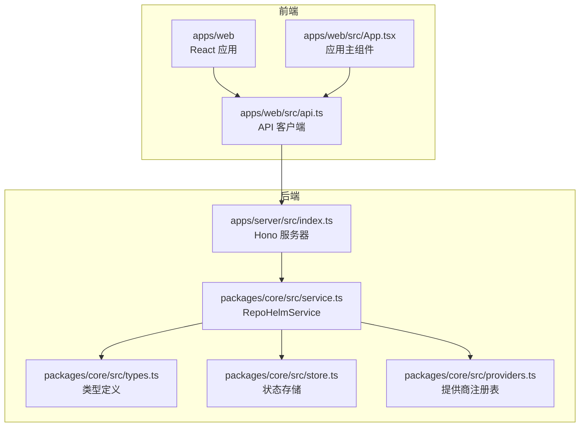
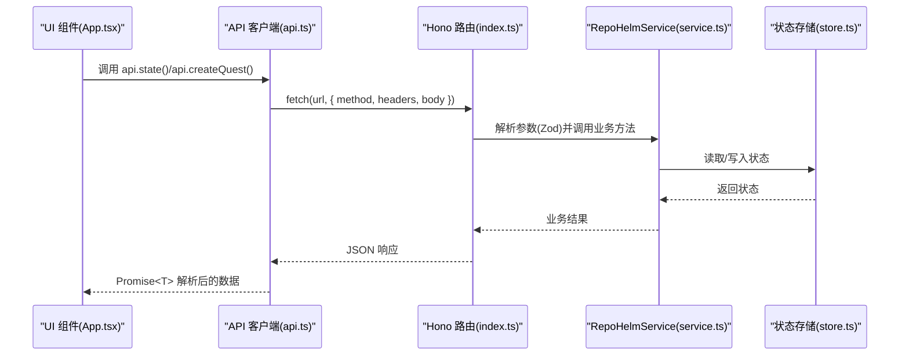
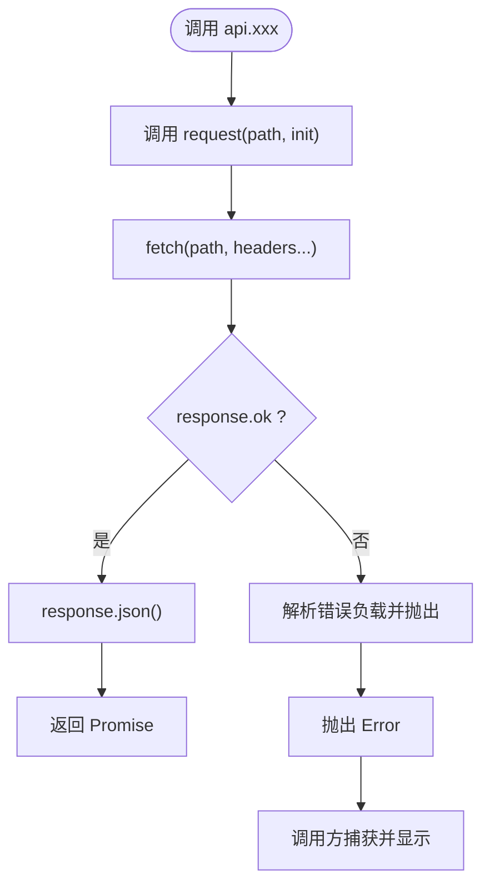
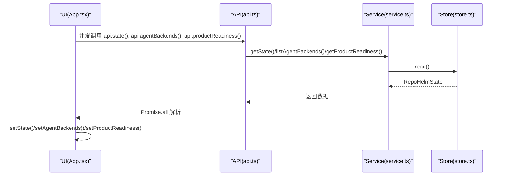
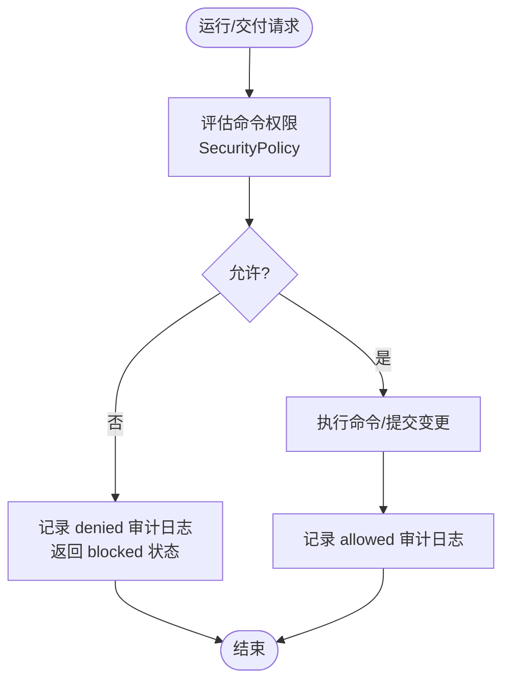
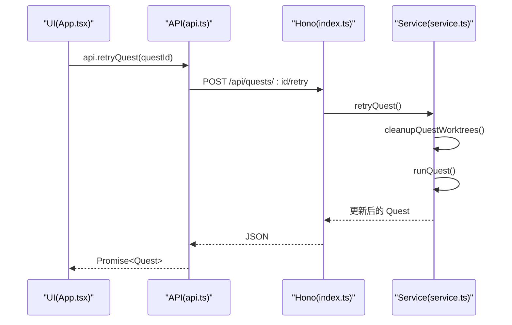
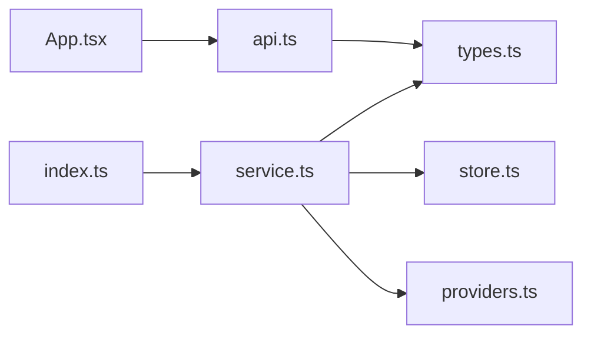

# API 集成层

<cite>
**本文档引用的文件**
- [apps/web/src/api.ts](file://apps/web/src/api.ts)
- [apps/web/src/App.tsx](file://apps/web/src/App.tsx)
- [apps/server/src/index.ts](file://apps/server/src/index.ts)
- [packages/core/src/service.ts](file://packages/core/src/service.ts)
- [packages/core/src/types.ts](file://packages/core/src/types.ts)
- [packages/core/src/store.ts](file://packages/core/src/store.ts)
- [packages/core/src/providers.ts](file://packages/core/src/providers.ts)
</cite>

## 目录
1. [简介](#简介)
2. [项目结构](#项目结构)
3. [核心组件](#核心组件)
4. [架构总览](#架构总览)
5. [详细组件分析](#详细组件分析)
6. [依赖关系分析](#依赖关系分析)
7. [性能考虑](#性能考虑)
8. [故障排查指南](#故障排查指南)
9. [结论](#结论)
10. [附录](#附录)

## 简介
本文件面向 RepoHelm 的 API 集成层，系统性阐述前端与后端 API 的通信机制、数据交互模式与客户端设计。内容涵盖：
- API 客户端架构（请求封装、响应处理、错误管理）
- 数据获取策略（懒加载、缓存、实时更新）
- 认证与权限控制（安全策略、审计日志）
- API 版本管理、错误处理与重试机制
- 使用示例与集成指南

## 项目结构
RepoHelm 采用前后端分离的单体工作区结构，核心模块如下：
- 前端应用（React）位于 apps/web，负责 UI 与 API 客户端调用
- 后端服务（Hono）位于 apps/server，提供 REST API
- 核心业务逻辑与状态存储位于 packages/core

图表来源
- [apps/web/src/api.ts:276-423](file://apps/web/src/api.ts#L276-L423)
- [apps/web/src/App.tsx:136-148](file://apps/web/src/App.tsx#L136-L148)
- [apps/server/src/index.ts:39-366](file://apps/server/src/index.ts#L39-L366)
- [packages/core/src/service.ts:56-71](file://packages/core/src/service.ts#L56-L71)
- [packages/core/src/types.ts:279-290](file://packages/core/src/types.ts#L279-L290)
- [packages/core/src/store.ts:86-166](file://packages/core/src/store.ts#L86-L166)
- [packages/core/src/providers.ts:163-200](file://packages/core/src/providers.ts#L163-L200)

章节来源
- [apps/web/src/api.ts:276-423](file://apps/web/src/api.ts#L276-L423)
- [apps/web/src/App.tsx:136-148](file://apps/web/src/App.tsx#L136-L148)
- [apps/server/src/index.ts:39-366](file://apps/server/src/index.ts#L39-L366)
- [packages/core/src/service.ts:56-71](file://packages/core/src/service.ts#L56-L71)
- [packages/core/src/types.ts:279-290](file://packages/core/src/types.ts#L279-L290)
- [packages/core/src/store.ts:86-166](file://packages/core/src/store.ts#L86-L166)
- [packages/core/src/providers.ts:163-200](file://packages/core/src/providers.ts#L163-L200)

## 核心组件
- API 客户端（apps/web/src/api.ts）
  - 统一的 request 封装，负责 Content-Type 设置、响应校验与错误抛出
  - 导出 api 对象，覆盖状态、工作区、项目、Quest、引擎、安全策略、提供商等接口
- 服务端路由（apps/server/src/index.ts）
  - Hono 路由定义，暴露 /api/* 接口，含 CORS、日志中间件
  - 参数校验使用 Zod Schema，确保输入安全
- 业务服务（packages/core/src/service.ts）
  - RepoHelmService 提供核心业务方法：创建/更新实体、运行 Quest、交付、查询知识、能力与安全策略等
  - 引擎配置、提供商模型缓存、Git 工作树管理、审计日志
- 类型与状态（packages/core/src/types.ts、store.ts）
  - 统一的数据模型与状态结构，包含 RepoHelmState、EngineConfig、SecurityPolicy 等
  - 支持 JSON 与 SQLite 两种状态存储后端

章节来源
- [apps/web/src/api.ts:276-423](file://apps/web/src/api.ts#L276-L423)
- [apps/server/src/index.ts:114-366](file://apps/server/src/index.ts#L114-L366)
- [packages/core/src/service.ts:56-137](file://packages/core/src/service.ts#L56-L137)
- [packages/core/src/types.ts:279-290](file://packages/core/src/types.ts#L279-L290)
- [packages/core/src/store.ts:86-166](file://packages/core/src/store.ts#L86-L166)

## 架构总览
前端通过统一的 api 对象发起 HTTP 请求，后端 Hono 路由接收请求，Zod 校验参数，RepoHelmService 执行业务逻辑，最终写入状态存储并返回 JSON。

图表来源
- [apps/web/src/App.tsx:136-148](file://apps/web/src/App.tsx#L136-L148)
- [apps/web/src/api.ts:276-423](file://apps/web/src/api.ts#L276-L423)
- [apps/server/src/index.ts:125-366](file://apps/server/src/index.ts#L125-L366)
- [packages/core/src/service.ts:135-137](file://packages/core/src/service.ts#L135-L137)
- [packages/core/src/store.ts:86-166](file://packages/core/src/store.ts#L86-L166)

## 详细组件分析

### API 客户端设计
- 请求封装
  - request 函数统一设置 Content-Type，并在 response.ok 为假时解析错误消息并抛出
  - api 对象导出所有 /api/* 方法，自动拼接路径并序列化请求体
- 响应处理
  - 所有 api.* 方法返回 Promise<T>，调用方无需关心底层 fetch 细节
- 错误管理
  - 前端捕获异常并显示错误横幅；后端统一错误处理器返回 { error } JSON

图表来源
- [apps/web/src/api.ts:276-289](file://apps/web/src/api.ts#L276-L289)
- [apps/web/src/api.ts:291-423](file://apps/web/src/api.ts#L291-L423)

章节来源
- [apps/web/src/api.ts:276-289](file://apps/web/src/api.ts#L276-L289)
- [apps/web/src/api.ts:291-423](file://apps/web/src/api.ts#L291-L423)

### 数据获取策略
- 懒加载
  - 首屏并发加载状态、代理后端列表与产品就绪度，随后按需加载 Quest、知识库等
- 缓存机制
  - 提供商模型列表带缓存（SQLite），TTL 6 小时；刷新时强制拉取
- 实时更新
  - 大多数操作完成后调用 load() 重新拉取状态，保证 UI 与后端一致

图表来源
- [apps/web/src/App.tsx:136-148](file://apps/web/src/App.tsx#L136-L148)
- [packages/core/src/service.ts:135-137](file://packages/core/src/service.ts#L135-L137)
- [packages/core/src/store.ts:86-166](file://packages/core/src/store.ts#L86-L166)

章节来源
- [apps/web/src/App.tsx:136-148](file://apps/web/src/App.tsx#L136-L148)
- [packages/core/src/service.ts:422-455](file://packages/core/src/service.ts#L422-L455)

### 认证机制、权限控制与安全策略
- 认证与授权
  - 提供商模型列表与测试接口使用 POST，避免密钥出现在 URL 查询串
  - 引擎配置支持 BYOK（自定义提供商）模式，按提供商隔离密钥
- 安全策略
  - SecurityPolicy 包含命令审批模式、允许命令清单、文件/网络作用域、密钥策略与沙箱运行时
  - 运行 Quest 与交付流程会评估命令权限，记录审计日志
- 审计日志
  - 每次策略变更与命令执行都会写入审计条目，便于追踪

图表来源
- [packages/core/src/service.ts:591-615](file://packages/core/src/service.ts#L591-L615)
- [packages/core/src/service.ts:898-914](file://packages/core/src/service.ts#L898-L914)
- [packages/core/src/types.ts:135-143](file://packages/core/src/types.ts#L135-L143)

章节来源
- [apps/server/src/index.ts:155-176](file://apps/server/src/index.ts#L155-L176)
- [packages/core/src/service.ts:591-615](file://packages/core/src/service.ts#L591-L615)
- [packages/core/src/service.ts:898-914](file://packages/core/src/service.ts#L898-L914)
- [packages/core/src/types.ts:135-143](file://packages/core/src/types.ts#L135-L143)

### API 版本管理、错误处理与重试机制
- 版本管理
  - 当前未见显式 API 版本号；路由以 /api/* 命名空间组织，便于未来扩展
- 错误处理
  - 前端：request 在非 OK 时抛错，调用方捕获并显示
  - 后端：全局 onError 统一返回 { error } JSON
- 重试机制
  - 未实现自动重试；可通过清理工作树后重试 Quest（cleanup -> retry）

图表来源
- [apps/web/src/App.tsx:256-263](file://apps/web/src/App.tsx#L256-L263)
- [apps/web/src/api.ts:351-358](file://apps/web/src/api.ts#L351-L358)
- [apps/server/src/index.ts:328-331](file://apps/server/src/index.ts#L328-L331)
- [packages/core/src/service.ts:757-760](file://packages/core/src/service.ts#L757-L760)

章节来源
- [apps/web/src/api.ts:351-358](file://apps/web/src/api.ts#L351-L358)
- [apps/server/src/index.ts:328-331](file://apps/server/src/index.ts#L328-L331)
- [packages/core/src/service.ts:757-760](file://packages/core/src/service.ts#L757-L760)

### API 使用示例与集成指南
- 初始化与加载
  - 首屏并发加载状态、代理后端与产品就绪度，设置选中项与展开状态
- 创建并运行 Quest
  - 组装输入（工作区、标题、需求、代理后端、影响项目），创建后立即运行，最后刷新状态
- 交付与能力确认
  - 交付后刷新；对能力推荐进行接受/忽略，触发状态与审计日志更新
- 引擎与提供商
  - 列出提供商与模型，测试 BYOK 连通性与鉴权；更新引擎配置

章节来源
- [apps/web/src/App.tsx:136-148](file://apps/web/src/App.tsx#L136-L148)
- [apps/web/src/App.tsx:217-247](file://apps/web/src/App.tsx#L217-L247)
- [apps/web/src/App.tsx:249-264](file://apps/web/src/App.tsx#L249-L264)
- [apps/web/src/App.tsx:266-298](file://apps/web/src/App.tsx#L266-L298)
- [apps/web/src/App.tsx:1626-1640](file://apps/web/src/App.tsx#L1626-L1640)

## 依赖关系分析
- 前端依赖
  - api.ts 依赖 fetch 与类型定义；App.tsx 依赖 api.ts 与组件
- 后端依赖
  - index.ts 依赖 Hono、Zod、RepoHelmService；service.ts 依赖 store、providers、git 等
- 类型与存储
  - types.ts 定义 RepoHelmState、EngineConfig、SecurityPolicy 等；store.ts 提供 JSON/SQLite 存储

图表来源
- [apps/web/src/api.ts:276-423](file://apps/web/src/api.ts#L276-L423)
- [apps/web/src/App.tsx:136-148](file://apps/web/src/App.tsx#L136-L148)
- [apps/server/src/index.ts:39-366](file://apps/server/src/index.ts#L39-L366)
- [packages/core/src/service.ts:56-71](file://packages/core/src/service.ts#L56-L71)
- [packages/core/src/types.ts:279-290](file://packages/core/src/types.ts#L279-L290)
- [packages/core/src/store.ts:86-166](file://packages/core/src/store.ts#L86-L166)
- [packages/core/src/providers.ts:163-200](file://packages/core/src/providers.ts#L163-L200)

章节来源
- [apps/web/src/api.ts:276-423](file://apps/web/src/api.ts#L276-L423)
- [apps/web/src/App.tsx:136-148](file://apps/web/src/App.tsx#L136-L148)
- [apps/server/src/index.ts:39-366](file://apps/server/src/index.ts#L39-L366)
- [packages/core/src/service.ts:56-71](file://packages/core/src/service.ts#L56-L71)
- [packages/core/src/types.ts:279-290](file://packages/core/src/types.ts#L279-L290)
- [packages/core/src/store.ts:86-166](file://packages/core/src/store.ts#L86-L166)
- [packages/core/src/providers.ts:163-200](file://packages/core/src/providers.ts#L163-L200)

## 性能考虑
- 模型列表缓存
  - 提供商模型列表缓存 TTL 6 小时，减少对外部服务请求频率
- 并发加载
  - 首屏并发获取多路数据，缩短首屏等待时间
- 状态持久化
  - SQLite 存储具备事务与索引能力，适合频繁读写的场景

章节来源
- [packages/core/src/service.ts:422-455](file://packages/core/src/service.ts#L422-L455)
- [apps/web/src/App.tsx:136-148](file://apps/web/src/App.tsx#L136-L148)
- [packages/core/src/store.ts:117-166](file://packages/core/src/store.ts#L117-L166)

## 故障排查指南
- 常见错误
  - 404/422：参数缺失或实体不存在（Zod 校验失败或服务端找不到资源）
  - 500：后端异常，统一返回 { error } JSON
- 前端处理
  - 捕获异常并显示错误横幅；必要时回退到本地状态或提示重试
- 后端处理
  - 全局错误处理器记录堆栈并返回标准化错误

章节来源
- [apps/server/src/index.ts:353-361](file://apps/server/src/index.ts#L353-L361)
- [apps/web/src/App.tsx:242-246](file://apps/web/src/App.tsx#L242-L246)

## 结论
RepoHelm 的 API 集成层以简洁的客户端封装与严格的后端校验为核心，结合安全策略与审计日志，提供了可控且可观测的交互体验。通过并发加载、模型缓存与状态持久化，系统在可用性与性能之间取得平衡。后续可在路由层面引入版本号、补充自动重试与幂等保障，进一步提升稳定性与可维护性。

## 附录
- 关键接口一览（路径与方法）
  - GET /api/health
  - GET /api/state
  - GET /api/agent-backends
  - GET /api/clis
  - POST /api/clis/rescan
  - POST /api/clis/:id/test
  - GET /api/providers
  - POST /api/providers/:id/models
  - POST /api/providers/:id/test
  - GET /api/engine
  - PATCH /api/engine
  - GET /api/capabilities
  - GET /api/security-policy
  - PATCH /api/security-policy
  - GET /api/audit-log
  - GET /api/product-readiness
  - GET /api/workspaces/:id/knowledge?q=...
  - GET /api/worktrees?workspaceId=...
  - POST /api/workspaces
  - PATCH /api/workspaces/:id
  - POST /api/projects
  - POST /api/workspaces/:id/links
  - DELETE /api/workspaces/:id/links/:projectId
  - PATCH /api/projects/:id
  - DELETE /api/projects/:id
  - POST /api/projects/:id/check
  - POST /api/pick-directory
  - GET /api/branches?path=...
  - POST /api/projects/:id/open-directory
  - POST /api/quests
  - POST /api/quests/:id/run
  - POST /api/quests/:id/retry
  - POST /api/quests/:id/cleanup
  - POST /api/quests/:id/deliver
  - POST /api/quests/:id/capabilities/:capabilityId/accept
  - POST /api/quests/:id/capabilities/:capabilityId/dismiss

章节来源
- [apps/server/src/index.ts:114-366](file://apps/server/src/index.ts#L114-L366)