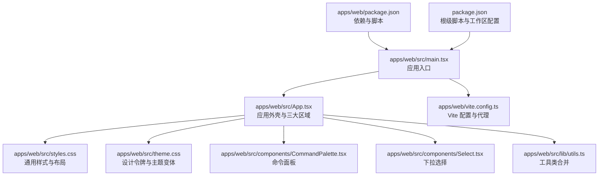
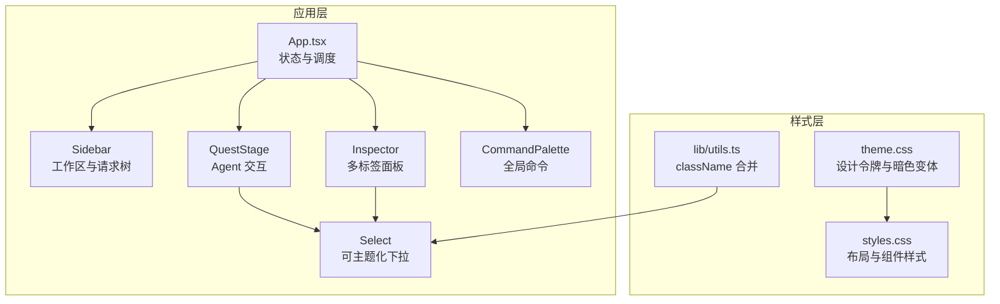
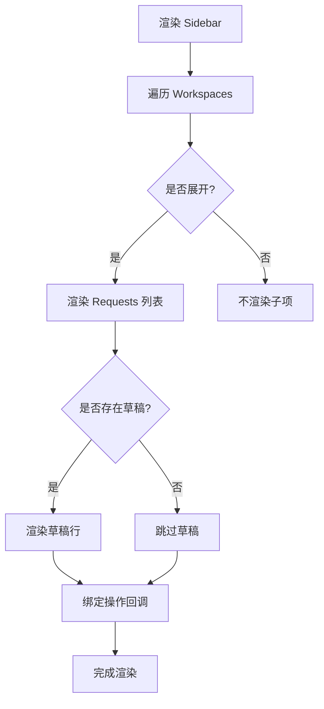
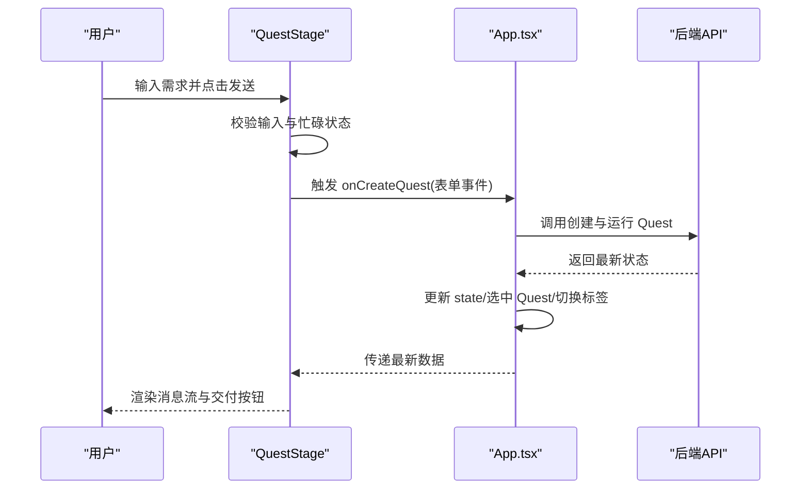
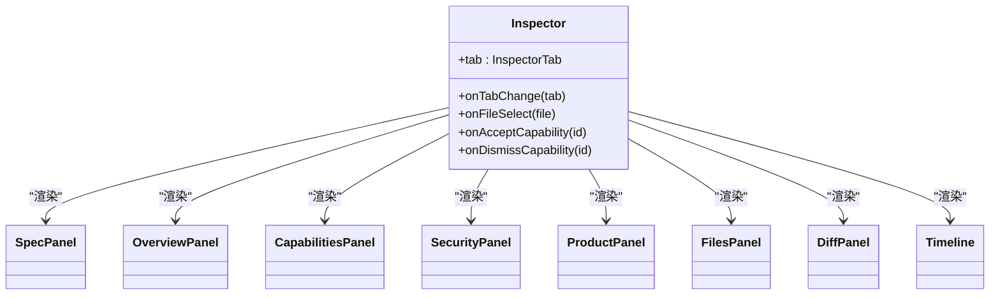
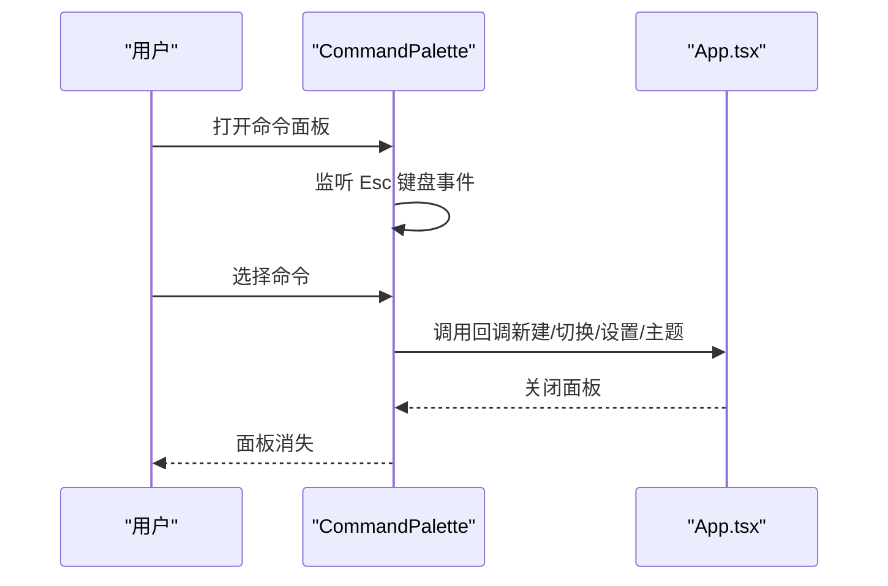
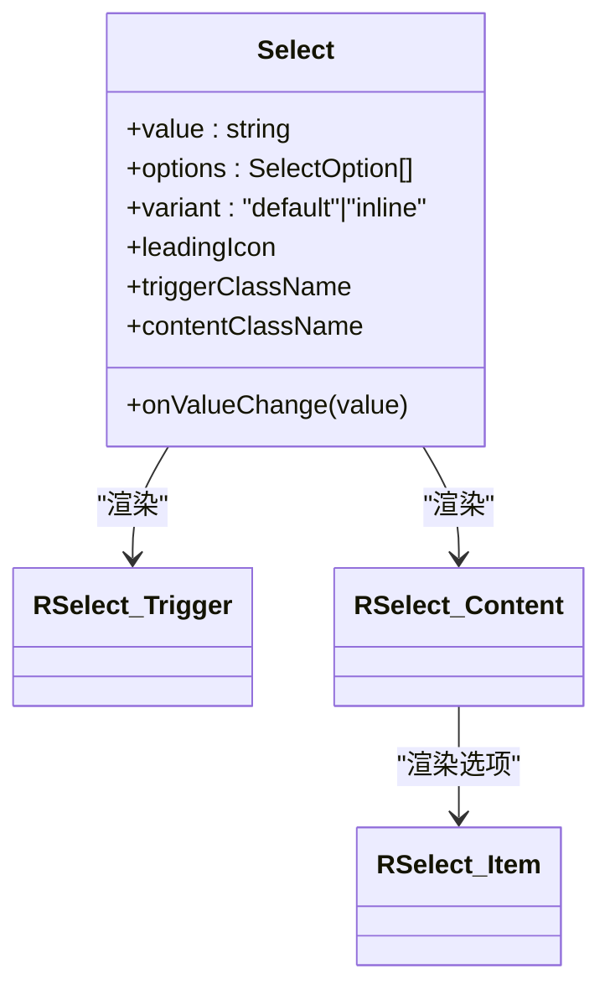
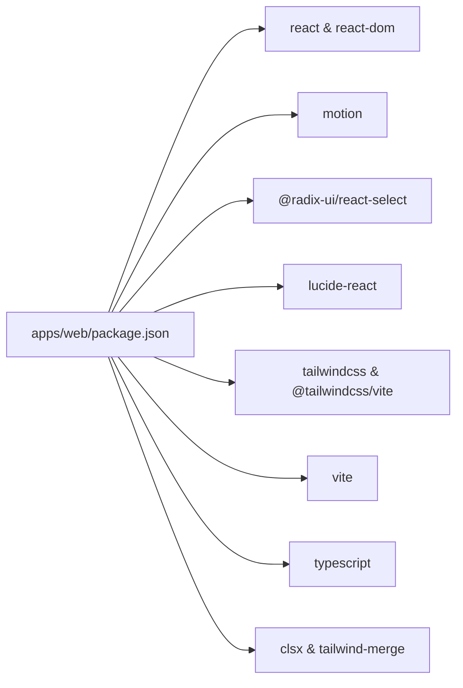

# UI 组件库

<cite>
**本文引用的文件**
- [apps/web/src/App.tsx](file://apps/web/src/App.tsx)
- [apps/web/src/main.tsx](file://apps/web/src/main.tsx)
- [apps/web/src/styles.css](file://apps/web/src/styles.css)
- [apps/web/src/theme.css](file://apps/web/src/theme.css)
- [apps/web/src/components/CommandPalette.tsx](file://apps/web/src/components/CommandPalette.tsx)
- [apps/web/src/components/Select.tsx](file://apps/web/src/components/Select.tsx)
- [apps/web/src/lib/utils.ts](file://apps/web/src/lib/utils.ts)
- [apps/web/package.json](file://apps/web/package.json)
- [apps/web/vite.config.ts](file://apps/web/vite.config.ts)
- [package.json](file://package.json)
- [README.md](file://README.md)
</cite>

## 目录
1. [简介](#简介)
2. [项目结构](#项目结构)
3. [核心组件](#核心组件)
4. [架构总览](#架构总览)
5. [组件详解](#组件详解)
6. [依赖关系分析](#依赖关系分析)
7. [性能考量](#性能考量)
8. [故障排查指南](#故障排查指南)
9. [结论](#结论)
10. [附录](#附录)

## 简介
本文件为 RepoHelm Web UI 组件库的权威文档，面向开发者与产品设计人员，系统阐述组件库的设计系统、样式架构与交互模式。重点覆盖三大工作区核心界面：侧边栏（Sidebar）、工作台（QuestStage）、检查器（Inspector），并说明主题系统、样式定制、响应式布局、无障碍与国际化适配、跨浏览器兼容性，以及组件使用与样式定制实践。

RepoHelm 采用 React + Vite 构建，以 CSS 变量驱动主题，结合 Tailwind Utilities 提供一致的视觉与交互语义，辅以 Motion 做动画与过渡，整体风格克制、专业、具备深度与光泽感。

## 项目结构
Web 应用位于 apps/web，核心入口为 main.tsx，应用主体 App.tsx 负责组织三大区域：侧边栏、工作台、检查器，并通过可拖拽分隔条实现列宽自适应。样式体系由 theme.css（设计令牌）与 styles.css（组件样式）构成，组件层包含 CommandPalette 与 Select 等基础控件。

图表来源
- [apps/web/src/main.tsx:1-13](file://apps/web/src/main.tsx#L1-L13)
- [apps/web/src/App.tsx:1-200](file://apps/web/src/App.tsx#L1-L200)
- [apps/web/src/styles.css:1-120](file://apps/web/src/styles.css#L1-L120)
- [apps/web/src/theme.css:1-176](file://apps/web/src/theme.css#L1-L176)
- [apps/web/src/components/CommandPalette.tsx:1-101](file://apps/web/src/components/CommandPalette.tsx#L1-L101)
- [apps/web/src/components/Select.tsx:1-69](file://apps/web/src/components/Select.tsx#L1-L69)
- [apps/web/src/lib/utils.ts:1-8](file://apps/web/src/lib/utils.ts#L1-L8)
- [apps/web/vite.config.ts:1-16](file://apps/web/vite.config.ts#L1-L16)
- [apps/web/package.json:1-34](file://apps/web/package.json#L1-L34)
- [package.json:1-21](file://package.json#L1-L21)

章节来源
- [apps/web/src/main.tsx:1-13](file://apps/web/src/main.tsx#L1-L13)
- [apps/web/src/App.tsx:1-200](file://apps/web/src/App.tsx#L1-L200)
- [apps/web/src/styles.css:1-120](file://apps/web/src/styles.css#L1-L120)
- [apps/web/src/theme.css:1-176](file://apps/web/src/theme.css#L1-L176)
- [apps/web/package.json:1-34](file://apps/web/package.json#L1-L34)
- [apps/web/vite.config.ts:1-16](file://apps/web/vite.config.ts#L1-L16)
- [package.json:1-21](file://package.json#L1-L21)

## 核心组件
- 应用外壳与布局：App.tsx 提供应用状态、主题切换、列宽持久化、拖拽分隔、对话框与命令面板集成。
- 侧边栏（Sidebar）：展示 Workspaces 与 Requests，支持展开/折叠、草稿态、状态徽章与操作按钮。
- 工作台（QuestStage）：聊天式 Agent 交互区，支持 Backend 切换、执行模式、消息流与发送。
- 检查器（Inspector）：多标签面板，涵盖 Spec、概要、能力、安全、产品、文件、Diff、日志等视图。
- 命令面板（CommandPalette）：全局快捷命令入口，支持主题切换、Workspace 切换、新建请求等。
- 下拉选择（Select）：基于 Radix 的可主题化选择器，支持内联紧凑样式，用于工具栏与表单。

章节来源
- [apps/web/src/App.tsx:661-788](file://apps/web/src/App.tsx#L661-L788)
- [apps/web/src/App.tsx:790-962](file://apps/web/src/App.tsx#L790-L962)
- [apps/web/src/App.tsx:964-1045](file://apps/web/src/App.tsx#L964-L1045)
- [apps/web/src/components/CommandPalette.tsx:1-101](file://apps/web/src/components/CommandPalette.tsx#L1-L101)
- [apps/web/src/components/Select.tsx:1-69](file://apps/web/src/components/Select.tsx#L1-L69)

## 架构总览
RepoHelm UI 采用“状态集中 + 组件解耦”的架构：App.tsx 作为状态中枢，负责数据加载、主题与列宽持久化、键盘快捷键、对话框与命令面板调度；三大区域组件通过 props 与回调进行松耦合通信；样式系统以 CSS 变量为核心，配合 Tailwind Utilities 实现一致的视觉语言与主题切换。

图表来源
- [apps/web/src/App.tsx:85-165](file://apps/web/src/App.tsx#L85-L165)
- [apps/web/src/App.tsx:493-578](file://apps/web/src/App.tsx#L493-L578)
- [apps/web/src/App.tsx:661-788](file://apps/web/src/App.tsx#L661-L788)
- [apps/web/src/App.tsx:790-962](file://apps/web/src/App.tsx#L790-L962)
- [apps/web/src/App.tsx:964-1045](file://apps/web/src/App.tsx#L964-L1045)
- [apps/web/src/components/CommandPalette.tsx:1-101](file://apps/web/src/components/CommandPalette.tsx#L1-L101)
- [apps/web/src/components/Select.tsx:1-69](file://apps/web/src/components/Select.tsx#L1-L69)
- [apps/web/src/theme.css:14-176](file://apps/web/src/theme.css#L14-L176)
- [apps/web/src/styles.css:106-314](file://apps/web/src/styles.css#L106-L314)
- [apps/web/src/lib/utils.ts:1-8](file://apps/web/src/lib/utils.ts#L1-L8)

## 组件详解

### 设计系统与样式架构
- 设计令牌：theme.css 定义了颜色、阴影、圆角、字体、动画曲线等设计令牌，并通过 data-theme 切换明/暗主题。
- 主题变体：使用自定义变体 dark (&:where([data-theme="dark"], [data-theme="dark"] *))，确保 Tailwind utilities 在暗色下正确生效。
- CSS 变量驱动：styles.css 通过 var(--*) 使用主题令牌，统一背景、表面、文本、强调色、边框、阴影等。
- 动画与过渡：使用 Motion 与关键帧（spin、rh-fade-up、rh-pop）实现流畅的交互反馈。
- 响应式网格：.quest-workbench 使用 CSS Grid 与 CSS 变量控制列宽，支持拖拽调整并持久化。

章节来源
- [apps/web/src/theme.css:14-176](file://apps/web/src/theme.css#L14-L176)
- [apps/web/src/styles.css:1-120](file://apps/web/src/styles.css#L1-L120)
- [apps/web/src/styles.css:308-360](file://apps/web/src/styles.css#L308-L360)
- [apps/web/src/App.tsx:103-165](file://apps/web/src/App.tsx#L103-L165)

### 主题系统与样式定制
- 主题切换：通过设置 html 的 data-theme 属性实现全局主题切换，并持久化到 localStorage。
- 令牌映射：theme.css 将设计令牌暴露给 Tailwind，支持 bg-surface、text-accent 等实用类。
- 自定义变体：dark 变体确保在暗色模式下边框、环形光晕、强调色等视觉元素保持一致观感。
- 定制建议：新增颜色或尺寸时，优先在 theme.css 中扩展设计令牌，再在 styles.css 中通过 var(--*) 使用，避免硬编码。

章节来源
- [apps/web/src/App.tsx:103-165](file://apps/web/src/App.tsx#L103-L165)
- [apps/web/src/theme.css:14-176](file://apps/web/src/theme.css#L14-L176)

### 侧边栏（Sidebar）
- 结构：顶部“创建 Workspace”按钮，中部“Workspaces”树，底部“知识中心”入口。
- 行为：支持展开/折叠、选中高亮、草稿态请求、状态徽章、配置与新建请求操作。
- 交互：通过 props 回调与 App.tsx 同步选中 Workspace/Request，维护 expandedWorkspaceIds。

图表来源
- [apps/web/src/App.tsx:661-788](file://apps/web/src/App.tsx#L661-L788)

章节来源
- [apps/web/src/App.tsx:661-788](file://apps/web/src/App.tsx#L661-L788)

### 工作台（QuestStage）
- 结构：Header（标题、运行上下文、交付按钮）、ChatThread（消息流）、Composer（输入与工具）。
- 行为：自动滚动到底部、动态高度文本域、Backend 与执行模式选择、发送禁用条件。
- 交互：提交表单创建 Quest，触发 API 调用与状态刷新；交付按钮触发交付流程。

图表来源
- [apps/web/src/App.tsx:790-962](file://apps/web/src/App.tsx#L790-L962)
- [apps/web/src/App.tsx:217-247](file://apps/web/src/App.tsx#L217-L247)

章节来源
- [apps/web/src/App.tsx:790-962](file://apps/web/src/App.tsx#L790-L962)
- [apps/web/src/App.tsx:217-247](file://apps/web/src/App.tsx#L217-L247)

### 检查器（Inspector）
- 结构：顶部标签页（Spec、概要、能力、安全、产品、文件、Diff、日志），主体根据当前标签渲染对应面板。
- 行为：文件列表支持逐项动画入场；Diff 面板展示选中文件的差异；日志面板按时间线展示事件。
- 交互：标签切换、文件选择、能力确认/忽略、交付按钮联动。

图表来源
- [apps/web/src/App.tsx:964-1045](file://apps/web/src/App.tsx#L964-L1045)
- [apps/web/src/App.tsx:1047-1334](file://apps/web/src/App.tsx#L1047-L1334)
- [apps/web/src/App.tsx:1336-1349](file://apps/web/src/App.tsx#L1336-L1349)
- [apps/web/src/App.tsx:2259-2281](file://apps/web/src/App.tsx#L2259-L2281)

章节来源
- [apps/web/src/App.tsx:964-1045](file://apps/web/src/App.tsx#L964-L1045)
- [apps/web/src/App.tsx:1047-1334](file://apps/web/src/App.tsx#L1047-L1334)
- [apps/web/src/App.tsx:1336-1349](file://apps/web/src/App.tsx#L1336-L1349)
- [apps/web/src/App.tsx:2259-2281](file://apps/web/src/App.tsx#L2259-L2281)

### 命令面板（CommandPalette）
- 功能：全局命令入口，支持新建请求、创建 Workspace、打开设置、打开知识中心、切换主题、切换 Workspace。
- 行为：Esc 关闭、点击遮罩关闭、阻止事件冒泡、自动聚焦输入框。

图表来源
- [apps/web/src/components/CommandPalette.tsx:1-101](file://apps/web/src/components/CommandPalette.tsx#L1-L101)
- [apps/web/src/App.tsx:631-656](file://apps/web/src/App.tsx#L631-L656)

章节来源
- [apps/web/src/components/CommandPalette.tsx:1-101](file://apps/web/src/components/CommandPalette.tsx#L1-L101)
- [apps/web/src/App.tsx:631-656](file://apps/web/src/App.tsx#L631-L656)

### 下拉选择（Select）
- 特性：基于 Radix Select，支持内联紧凑样式（inline），带前置图标与自定义触发器/内容类名。
- 集成：广泛用于工具栏与对话框中的 Backend 与模式选择。

图表来源
- [apps/web/src/components/Select.tsx:1-69](file://apps/web/src/components/Select.tsx#L1-L69)

章节来源
- [apps/web/src/components/Select.tsx:1-69](file://apps/web/src/components/Select.tsx#L1-L69)

### 对话框与状态同步
- 对话框：WorkspaceCreateDialog、AppSettingsDialog、WorkspaceConfigDialog、KnowledgeDialog。
- 状态同步：通过 App.tsx 的状态与回调，实现对话框与主界面的数据双向同步与持久化（如列宽、主题）。

章节来源
- [apps/web/src/App.tsx:1371-1445](file://apps/web/src/App.tsx#L1371-L1445)
- [apps/web/src/App.tsx:1447-1920](file://apps/web/src/App.tsx#L1447-L1920)
- [apps/web/src/App.tsx:1922-2086](file://apps/web/src/App.tsx#L1922-L2086)
- [apps/web/src/App.tsx:2192-2248](file://apps/web/src/App.tsx#L2192-L2248)

### 可访问性（无障碍）
- 键盘可达：焦点可见轮廓、Tab 顺序合理、键盘快捷键（Cmd/Ctrl+K 打开命令面板）。
- ARIA：按钮与对话框使用 aria-label/role，命令面板使用 role="dialog"。
- 语义化：使用语义化标签（header、section、main、button），减少纯装饰性元素。

章节来源
- [apps/web/src/App.tsx:168-176](file://apps/web/src/App.tsx#L168-L176)
- [apps/web/src/App.tsx:468-479](file://apps/web/src/App.tsx#L468-L479)
- [apps/web/src/components/CommandPalette.tsx:52-98](file://apps/web/src/components/CommandPalette.tsx#L52-L98)

### 国际化与跨浏览器兼容
- 国际化：组件文案包含中文（如“创建 Workspace”、“知识中心”、“交付”等），便于直接使用。
- 跨浏览器：依赖现代 CSS（CSS Grid、CSS 变量、自定义属性）与 React 生态，构建时通过 Vite/Tailwind 适配主流浏览器。

章节来源
- [apps/web/src/App.tsx:53-65](file://apps/web/src/App.tsx#L53-L65)
- [apps/web/src/App.tsx:468-479](file://apps/web/src/App.tsx#L468-L479)
- [apps/web/vite.config.ts:1-16](file://apps/web/vite.config.ts#L1-L16)

## 依赖关系分析
- React 与生态：React、React DOM、Motion 用于组件与动画。
- UI 基础：Radix UI（Select）、Lucide React（图标）、Tailwind v4（原子化样式）。
- 构建：Vite、@tailwindcss/vite 插件、TypeScript。
- 工具：clsx、tailwind-merge、class-variance-authority（className 合并与变体）。

图表来源
- [apps/web/package.json:11-26](file://apps/web/package.json#L11-L26)

章节来源
- [apps/web/package.json:11-26](file://apps/web/package.json#L11-L26)

## 性能考量
- 渲染优化：使用 useMemo 缓存派生数据（如 selectedWorkspace、quests、changedFiles），减少不必要的重渲染。
- 动画与滚动：聊天区自动滚动与文本域自适应高度在 useEffect/useLayoutEffect 中处理，避免阻塞主线程。
- 拖拽性能：拖拽过程中添加 is-resizing-columns 类，禁用文本选择，降低无关交互开销。
- 样式合并：使用 utils.cn 合并 className，避免重复与冲突，提升样式计算效率。

章节来源
- [apps/web/src/App.tsx:178-215](file://apps/web/src/App.tsx#L178-L215)
- [apps/web/src/App.tsx:823-840](file://apps/web/src/App.tsx#L823-L840)
- [apps/web/src/styles.css:352-360](file://apps/web/src/styles.css#L352-L360)
- [apps/web/src/lib/utils.ts:1-8](file://apps/web/src/lib/utils.ts#L1-L8)

## 故障排查指南
- 主题不生效：检查 html[data-theme] 是否正确设置，localStorage 是否被禁用。
- 列宽异常：检查 localStorage 中 repohelm:column-widths 是否存在非法值，必要时清除缓存。
- 命令面板无法关闭：确认 Esc 监听与遮罩点击事件是否被其他元素拦截。
- 下拉选择样式错乱：确认 Tailwind Utilities 与自定义类名是否冲突，使用 utils.cn 合并。
- 代理与 API：确认 Vite 代理指向的后端端口与环境变量 REPOHELM_PORT 设置一致。

章节来源
- [apps/web/src/App.tsx:103-165](file://apps/web/src/App.tsx#L103-L165)
- [apps/web/src/App.tsx:155-156](file://apps/web/src/App.tsx#L155-L156)
- [apps/web/src/components/CommandPalette.tsx:29-40](file://apps/web/src/components/CommandPalette.tsx#L29-L40)
- [apps/web/src/lib/utils.ts:1-8](file://apps/web/src/lib/utils.ts#L1-L8)
- [apps/web/vite.config.ts:5-14](file://apps/web/vite.config.ts#L5-L14)

## 结论
RepoHelm UI 组件库以清晰的三层结构（状态中枢、区域组件、样式令牌）实现了专业而克制的视觉语言。通过 CSS 变量与 Tailwind Utilities 的组合，主题系统与响应式布局得以高效实现；通过命令面板、下拉选择等基础组件，交互体验得到统一与强化。建议在扩展新组件时遵循现有命名与类名约定，优先使用 utils.cn 合并 className，确保主题一致性与可维护性。

## 附录
- 快速启动与常用命令参考 README。
- 开发与构建脚本位于根与 apps/web 的 package.json。

章节来源
- [README.md:33-100](file://README.md#L33-L100)
- [package.json:7-13](file://package.json#L7-L13)
- [apps/web/package.json:6-10](file://apps/web/package.json#L6-L10)