# Web 前端应用

<cite>
**本文引用的文件**
- [apps/web/src/App.tsx](file://apps/web/src/App.tsx)
- [apps/web/src/main.tsx](file://apps/web/src/main.tsx)
- [apps/web/src/api.ts](file://apps/web/src/api.ts)
- [apps/web/src/components/CommandPalette.tsx](file://apps/web/src/components/CommandPalette.tsx)
- [apps/web/src/components/Select.tsx](file://apps/web/src/components/Select.tsx)
- [apps/web/src/components/KnowledgeCenter.tsx](file://apps/web/src/components/KnowledgeCenter.tsx)
- [apps/web/src/components/MarkdownView.tsx](file://apps/web/src/components/MarkdownView.tsx)
- [apps/web/src/components/MermaidDiagram.tsx](file://apps/web/src/components/MermaidDiagram.tsx)
- [apps/web/src/components/OrchestrationPanel.tsx](file://apps/web/src/components/OrchestrationPanel.tsx)
- [apps/web/src/components/ProgressPanel.tsx](file://apps/web/src/components/ProgressPanel.tsx)
- [apps/web/src/components/AcceptancePanel.tsx](file://apps/web/src/components/AcceptancePanel.tsx)
- [apps/web/src/components/DeliverablesPanel.tsx](file://apps/web/src/components/DeliverablesPanel.tsx)
- [apps/web/src/components/ReferencesPanel.tsx](file://apps/web/src/components/ReferencesPanel.tsx)
- [apps/web/src/components/ResearchPanel.tsx](file://apps/web/src/components/ResearchPanel.tsx)
- [apps/web/src/styles.css](file://apps/web/src/styles.css)
- [apps/web/src/theme.css](file://apps/web/src/theme.css)
- [apps/web/src/lib/utils.ts](file://apps/web/src/lib/utils.ts)
- [apps/web/package.json](file://apps/web/package.json)
- [apps/web/vite.config.ts](file://apps/web/vite.config.ts)
- [apps/server/src/sse.ts](file://apps/server/src/sse.ts)
- [docs/ui-layout.md](file://docs/ui-layout.md)
- [docs/superpowers/plans/2026-06-09-knowledge-center-panel.md](file://docs/superpowers/plans/2026-06-09-knowledge-center-panel.md)
- [docs/superpowers/specs/2026-06-09-knowledge-center-panel-design.md](file://docs/superpowers/specs/2026-06-09-knowledge-center-panel-design.md)
- [e2e/knowledge-center.spec.ts](file://e2e/knowledge-center.spec.ts)
- [e2e/quest-workspace.spec.ts](file://e2e/quest-workspace.spec.ts)
- [packages/core/src/git.ts](file://packages/core/src/git.ts)
- [packages/core/src/service.ts](file://packages/core/src/service.ts)
- [packages/core/src/types.ts](file://packages/core/src/types.ts)
- [apps/server/src/index.ts](file://apps/server/src/index.ts)
</cite>

## 更新摘要
**所做更改**
- 新增专家编排UI面板组件：ProgressPanel、AcceptancePanel、DeliverablesPanel、ReferencesPanel、ResearchPanel等5个专用面板组件
- 新增SSE实时流式传输功能支持，包括setupSSE和formatSSE工具函数
- 更新Inspector组件的6个专家编排标签页定义：orchestration、progress、acceptance、deliverables、references、research
- 扩展专家编排系统UI架构，提供完整的专家编排工作流可视化
- 新增专家编排样式系统，支持完整的专家编排UI主题适配

## 目录
1. [简介](#简介)
2. [项目结构](#项目结构)
3. [核心组件](#核心组件)
4. [架构总览](#架构总览)
5. [详细组件分析](#详细组件分析)
6. [专家编排系统](#专家编排系统)
7. [专家编排API集成](#专家编排api集成)
8. [专家编排UI面板组件](#专家编排ui面板组件)
9. [专家编排标签页设计](#专家编排标签页设计)
10. [SSE实时流式传输](#sse实时流式传输)
11. [专家编排类型定义](#专家编排类型定义)
12. [专家编排状态管理](#专家编排状态管理)
13. [专家编排UI集成](#专家编排ui集成)
14. [专家编排工作流](#专家编排工作流)
15. [专家编排数据流](#专家编排数据流)
16. [专家编排错误处理](#专家编排错误处理)
17. [专家编排性能优化](#专家编排性能优化)
18. [专家编排调试技巧](#专家编排调试技巧)
19. [依赖关系分析](#依赖关系分析)
20. [性能考虑](#性能考虑)
21. [故障排查指南](#故障排查指南)
22. [结论](#结论)
23. [附录](#附录)

## 简介
本文件面向 RepoHelm Web 前端应用，系统化阐述其 React 架构、组件层次、状态管理策略（含本地状态与持久化）、API 集成层、UI 组件设计与交互、响应式与可访问性支持、主题与样式定制、组件组合模式以及性能优化与调试建议。目标是帮助开发者快速理解并高效扩展该前端应用。

**更新** 本版本重点反映了专家编排系统的完整UI实现：新增了5个专用的专家编排UI面板组件（ProgressPanel、AcceptancePanel、DeliverablesPanel、ReferencesPanel、ResearchPanel），实现了完整的专家编排工作流可视化。新增了SSE实时流式传输功能支持，为专家编排系统提供实时数据更新能力。更新了Inspector组件的6个专家编排标签页定义，提供了从编排到研究的完整专家工作流界面。这些变更显著提升了应用的专业性和自动化程度。

## 项目结构
- 应用入口与根组件：通过入口文件挂载根组件，根组件负责全局状态、布局与对话框编排。
- 组件层：包含命令面板、下拉选择、知识中心、Markdown 渲染器、Mermaid 图表、专家编排面板等可复用 UI 组件。
- 专家编排UI面板：新增5个专用面板组件，提供专家编排工作流的完整可视化界面。
- 样式层：以 CSS 变量驱动的主题系统，结合 Tailwind v4 的工具类与变量层，实现轻量主题切换与一致的视觉语言。
- API 层：统一封装与后端服务的 HTTP 通信，暴露类型安全的函数式接口，包括新增的专家编排API。
- SSE支持：新增服务器推送事件（SSE）功能，支持实时数据流式传输。
- 构建与开发：Vite + React 插件 + TailwindCSS，内置代理到后端服务端口。

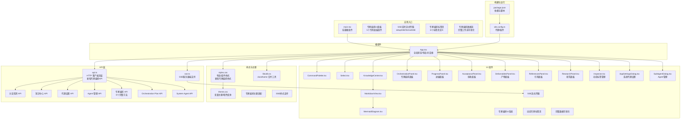

**图表来源**
- [apps/web/src/main.tsx:1-13](file://apps/web/src/main.tsx#L1-L13)
- [apps/web/src/App.tsx:1-3620](file://apps/web/src/App.tsx#L1-L3620)
- [apps/web/src/components/CommandPalette.tsx:1-101](file://apps/web/src/components/CommandPalette.tsx#L1-L101)
- [apps/web/src/components/Select.tsx:1-69](file://apps/web/src/components/Select.tsx#L1-L69)
- [apps/web/src/components/KnowledgeCenter.tsx:1-428](file://apps/web/src/components/KnowledgeCenter.tsx#L1-L428)
- [apps/web/src/components/MarkdownView.tsx:1-29](file://apps/web/src/components/MarkdownView.tsx#L1-L29)
- [apps/web/src/components/MermaidDiagram.tsx:1-47](file://apps/web/src/components/MermaidDiagram.tsx#L1-L47)
- [apps/web/src/components/OrchestrationPanel.tsx:1-37](file://apps/web/src/components/OrchestrationPanel.tsx#L1-L37)
- [apps/web/src/components/ProgressPanel.tsx:1-23](file://apps/web/src/components/ProgressPanel.tsx#L1-L23)
- [apps/web/src/components/AcceptancePanel.tsx:1-27](file://apps/web/src/components/AcceptancePanel.tsx#L1-L27)
- [apps/web/src/components/DeliverablesPanel.tsx:1-34](file://apps/web/src/components/DeliverablesPanel.tsx#L1-L34)
- [apps/web/src/components/ReferencesPanel.tsx:1-39](file://apps/web/src/components/ReferencesPanel.tsx#L1-L39)
- [apps/web/src/components/ResearchPanel.tsx:1-27](file://apps/web/src/components/ResearchPanel.tsx#L1-L27)
- [apps/web/src/styles.css:1-3372](file://apps/web/src/styles.css#L1-L3372)
- [apps/web/src/theme.css:1-176](file://apps/web/src/theme.css#L1-L176)
- [apps/web/src/lib/utils.ts:1-8](file://apps/web/src/lib/utils.ts#L1-L8)
- [apps/web/package.json:1-37](file://apps/web/package.json#L1-L37)
- [apps/web/vite.config.ts:1-16](file://apps/web/vite.config.ts#L1-L16)
- [apps/server/src/sse.ts:1-13](file://apps/server/src/sse.ts#L1-L13)

**章节来源**
- [apps/web/src/main.tsx:1-13](file://apps/web/src/main.tsx#L1-L13)
- [apps/web/src/App.tsx:1-3620](file://apps/web/src/App.tsx#L1-L3620)
- [apps/web/src/styles.css:1-800](file://apps/web/src/styles.css#L1-L800)
- [apps/web/src/theme.css:1-176](file://apps/web/src/theme.css#L1-L176)
- [apps/web/package.json:1-37](file://apps/web/package.json#L1-L37)
- [apps/web/vite.config.ts:1-16](file://apps/web/vite.config.ts#L1-L16)

## 核心组件
- 根组件 App：集中管理全局状态（工作区、请求、变更文件、列宽、主题、错误信息等），协调侧边栏、工作台与检查器三大区域，并承载多个对话框（创建工作区、应用设置、工作区配置、知识中心）。
- 命令面板 CommandPalette：基于 cmdk 的全局命令入口，支持新建请求、切换工作区、打开设置、知识中心与主题切换。
- 下拉选择 Select：基于 @radix-ui/react-select 的主题化选择器，支持内联紧凑风格与图标前缀，用于设置与表单场景。
- Inspector：全新的动态标签管理系统，根据内容可用性自动显示和隐藏标签页，提供智能化的 Inspector 界面。现已支持专家编排的6个专用标签页。
- 知识中心 KnowledgeCenter：全新的三列布局知识管理组件，支持 Repo Wiki 浏览、记忆管理、Markdown 渲染和 Mermaid 图表可视化，提供完整的知识中心体验。
- 应用设置对话框 AppSettingsDialog：新增系统代理设置界面，支持用户代理和系统代理的分离管理，以及系统 Agent 的 ModelKit 选择功能。
- SubAgentDialog：新增 Agent 管理对话框，支持 Agent 的创建、编辑、权限配置和模式选择。
- OrchestrationPanel：新增专家编排面板组件，用于可视化展示专家编排任务树和Agent池状态。
- ProgressPanel：新增专家编排进展面板，展示任务执行状态和Agent分配情况。
- AcceptancePanel：新增专家编排验收面板，展示验收测试用例和状态。
- DeliverablesPanel：新增专家编排产物面板，展示任务产生的文件变更和差异。
- ReferencesPanel：新增专家编排引用面板，展示知识库引用、用户习惯和失败经验。
- ResearchPanel：新增专家编排研究面板，展示研究结果和代码片段。

**章节来源**
- [apps/web/src/App.tsx:84-659](file://apps/web/src/App.tsx#L84-L659)
- [apps/web/src/components/CommandPalette.tsx:6-101](file://apps/web/src/components/CommandPalette.tsx#L6-L101)
- [apps/web/src/components/Select.tsx:17-69](file://apps/web/src/components/Select.tsx#L17-L69)
- [apps/web/src/App.tsx:1188-1387](file://apps/web/src/App.tsx#L1188-L1387)
- [apps/web/src/components/KnowledgeCenter.tsx:27-37](file://apps/web/src/components/KnowledgeCenter.tsx#L27-L37)
- [apps/web/src/App.tsx:1786-2850](file://apps/web/src/App.tsx#L1786-L2850)
- [apps/web/src/App.tsx:3261-3620](file://apps/web/src/App.tsx#L3261-L3620)
- [apps/web/src/components/OrchestrationPanel.tsx:18-37](file://apps/web/src/components/OrchestrationPanel.tsx#L18-L37)
- [apps/web/src/components/ProgressPanel.tsx:6-23](file://apps/web/src/components/ProgressPanel.tsx#L6-L23)
- [apps/web/src/components/AcceptancePanel.tsx:6-27](file://apps/web/src/components/AcceptancePanel.tsx#L6-L27)
- [apps/web/src/components/DeliverablesPanel.tsx:17-34](file://apps/web/src/components/DeliverablesPanel.tsx#L17-L34)
- [apps/web/src/components/ReferencesPanel.tsx:4-39](file://apps/web/src/components/ReferencesPanel.tsx#L4-L39)
- [apps/web/src/components/ResearchPanel.tsx:6-27](file://apps/web/src/components/ResearchPanel.tsx#L6-L27)

## 架构总览
前端采用"根组件集中状态 + 组件分治"的架构：
- 状态管理：以 React 本地状态为主，结合 localStorage 进行 UI 偏好持久化；未发现第三方状态库（如 Zustand）的直接使用痕迹。
- 数据流：根组件通过 api.ts 封装的函数发起异步请求，更新本地状态并驱动 UI。
- 主题与样式：通过 CSS 变量与 data-theme 属性驱动明/暗主题切换，Tailwind 提供实用工具类。
- 交互与键盘：支持快捷键打开命令面板，支持拖拽调整侧边栏与检查器宽度。
- SSE支持：新增服务器推送事件（SSE）功能，支持实时数据流式传输，特别适用于专家编排的实时状态更新。

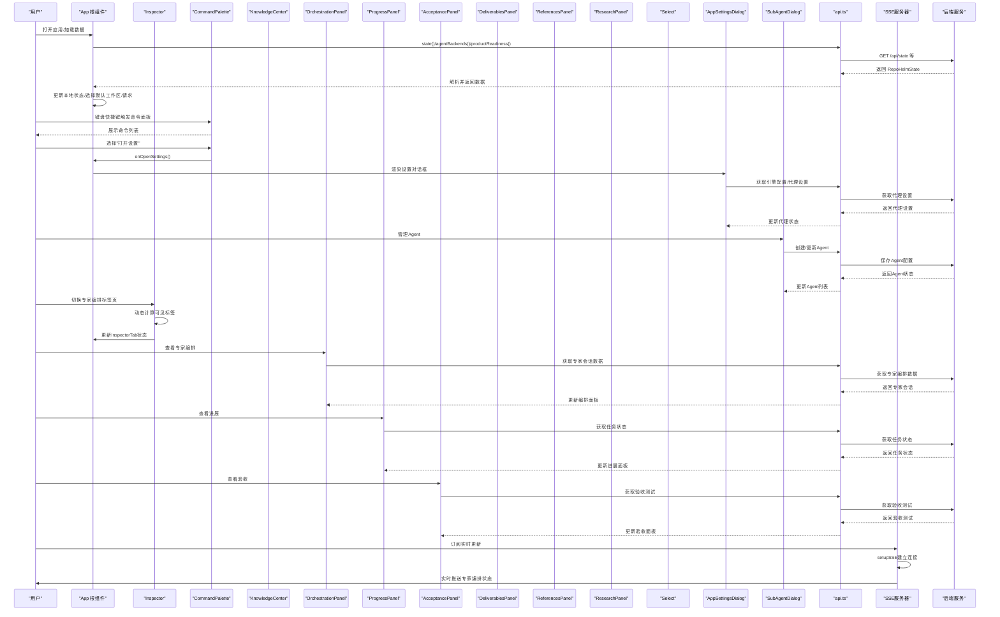

**图表来源**
- [apps/web/src/App.tsx:136-148](file://apps/web/src/App.tsx#L136-L148)
- [apps/web/src/App.tsx:217-247](file://apps/web/src/App.tsx#L217-L247)
- [apps/web/src/components/CommandPalette.tsx:29-50](file://apps/web/src/components/CommandPalette.tsx#L29-L50)
- [apps/web/src/api.ts:487-492](file://apps/web/src/api.ts#L487-L492)
- [apps/web/src/App.tsx:717-723](file://apps/web/src/App.tsx#L717-L723)
- [apps/server/src/sse.ts:3-12](file://apps/server/src/sse.ts#L3-L12)

**章节来源**
- [apps/web/src/App.tsx:136-247](file://apps/web/src/App.tsx#L136-L247)
- [apps/web/src/api.ts:434-713](file://apps/web/src/api.ts#L434-L713)

## 详细组件分析

### 根组件 App 分析
- 全局状态与副作用
  - 初始化加载：并发获取状态、可用智能体后端与产品就绪度，设置默认选中工作区与请求。
  - 主题持久化：通过 data-theme 属性与 localStorage 同步主题偏好。
  - 列宽持久化：通过 localStorage 保存侧边栏与检查器宽度，避免每次刷新重置。
  - 快捷键：Cmd/Ctrl+K 打开命令面板。
  - 知识中心状态：新增 knowledgeOpen 状态管理知识中心的显示与隐藏。
  - Inspector标签状态：新增 inspectorTab 状态管理Inspector的当前标签页。
  - 专家编排状态：新增 expertSession 状态管理专家编排会话数据。
- 计算派生数据：根据当前选中的工作区与请求，计算项目列表、事件、变更文件、选中文件等。
- 动作处理：创建请求、交付请求、接受/拒绝能力、工作区与项目管理、打开项目目录、检查项目健康等。
- 对话框编排：创建工作区、应用设置、工作区配置、知识中心等弹窗。

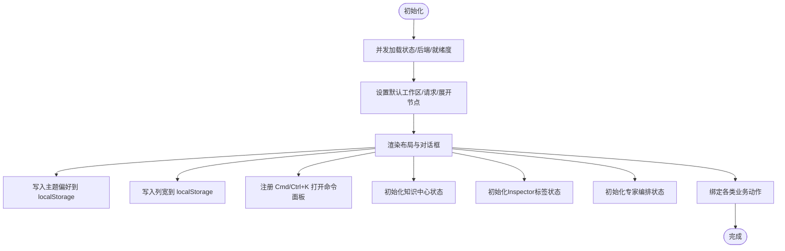

**图表来源**
- [apps/web/src/App.tsx:136-176](file://apps/web/src/App.tsx#L136-L176)
- [apps/web/src/App.tsx:154-156](file://apps/web/src/App.tsx#L154-L156)
- [apps/web/src/App.tsx:159-165](file://apps/web/src/App.tsx#L159-L165)
- [apps/web/src/App.tsx:110-112](file://apps/web/src/App.tsx#L110-L112)
- [apps/web/src/App.tsx:105](file://apps/web/src/App.tsx#L105)

**章节来源**
- [apps/web/src/App.tsx:84-659](file://apps/web/src/App.tsx#L84-L659)

### 命令面板 CommandPalette 分析
- 功能要点
  - 基于 cmdk 的输入过滤与命令列表展示。
  - 支持的操作：新建请求、创建工作区、打开设置、打开知识中心、切换主题。
  - 支持工作区切换列表，按名称排序。
  - ESC 关闭，点击遮罩层关闭。
- 可访问性
  - 使用 role、aria-label、aria-describedby 等语义化属性。
  - 自动聚焦输入框，便于键盘操作。
- 事件与回调
  - onNewRequest、onCreateWorkspace、onOpenSettings、onOpenKnowledge、onToggleTheme、onSelectWorkspace、onClose。


**图表来源**
- [apps/web/src/components/CommandPalette.tsx:29-50](file://apps/web/src/components/CommandPalette.tsx#L29-L50)
- [apps/web/src/components/CommandPalette.tsx:51-99](file://apps/web/src/components/CommandPalette.tsx#L51-L99)

**章节来源**
- [apps/web/src/components/CommandPalette.tsx:6-101](file://apps/web/src/components/CommandPalette.tsx#L6-L101)

### 下拉选择 Select 分析
- 设计与实现
  - 基于 @radix-ui/react-select，提供触发器与下拉内容，支持图标前缀与内联紧凑风格。
  - 通过 cn 工具合并类名，确保与主题一致。
- 属性与行为
  - value/onValueChange：受控值与变更回调。
  - options：选项数组，包含 value 与 label。
  - ariaLabel/placeholder/disabled/variant/leadingIcon/triggerClassName/contenClassName：可定制化。
- 适用场景
  - 设置页的模型选择、分支选择、工作区切换等。

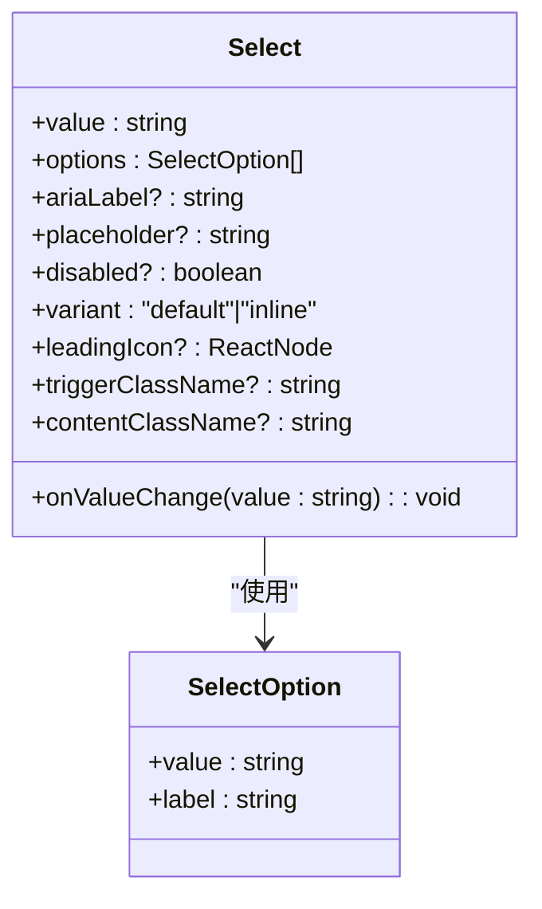

**图表来源**
- [apps/web/src/components/Select.tsx:17-69](file://apps/web/src/components/Select.tsx#L17-L69)

**章节来源**
- [apps/web/src/components/Select.tsx:17-69](file://apps/web/src/components/Select.tsx#L17-L69)
- [apps/web/src/lib/utils.ts:4-7](file://apps/web/src/lib/utils.ts#L4-L7)

### Inspector 组件分析
- 功能特性
  - 动态标签管理：根据内容可用性自动显示和隐藏标签页，包括概要、Spec、Plan、能力、文件和Diff。
  - 自动标签选择：当当前标签页无内容时，自动选择第一个可见标签页。
  - 内容条件渲染：仅渲染包含有效内容的标签页，避免空标签页显示。
  - 智能标签计算：通过 hasSpec、hasPlan、hasCapabilities、hasFiles、hasDiff 等标志判断标签页可用性。
  - 专家编排标签：新增专家编排标签页，支持专家会话的可视化展示。
  - 专家编排6标签页：orchestration（编排）、progress（进展）、acceptance（验收）、deliverables（产物）、references（引用）、research（研究）。
- 状态管理
  - inspectorTab：当前激活的Inspector标签页，类型为 InspectorTab。
  - hasSpec/hasPlan/hasCapabilities/hasFiles/hasDiff：各标签页内容可用性标志。
  - visibleTabs：根据内容可用性动态计算的可见标签页列表。
  - expertSession：专家编排会话数据状态。
- 用户交互
  - 标签页切换：点击标签按钮切换到相应的内容面板。
  - 自动导航：当标签页内容变化时自动选择合适的标签页。
  - 响应式设计：支持水平滚动的标签页容器，适应不同屏幕尺寸。

**更新** Inspector 组件已完全从静态标签系统迁移到动态标签管理系统。新的实现通过计算各标签页的内容可用性来决定显示哪些标签，实现了真正的智能化界面管理。新增的专家编排6个标签页支持专家会话的完整工作流可视化，包括编排、进展、验收、产物、引用和研究。

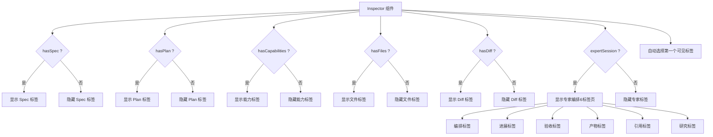

**图表来源**
- [apps/web/src/App.tsx:1244-1283](file://apps/web/src/App.tsx#L1244-L1283)
- [apps/web/src/App.tsx:1285-1286](file://apps/web/src/App.tsx#L1285-L1286)

**章节来源**
- [apps/web/src/App.tsx:1188-1387](file://apps/web/src/App.tsx#L1188-L1387)
- [apps/web/src/App.tsx:84](file://apps/web/src/App.tsx#L84)

### API 集成层分析
- 请求封装
  - request 函数统一封装 fetch，自动设置 Content-Type 并解析 JSON，非 OK 状态抛出错误。
- 接口清单（节选）
  - 状态与元数据：state、agentBackends、listClis、rescanClis、testCli、listProviders、listProviderModels、testProvider、getEngine、updateEngine、capabilities、securityPolicy、auditLog、productReadiness、searchKnowledge。
  - 工作区与项目：createWorkspace、updateWorkspace、createProject、linkProject、unlinkProject、updateProject、removeProject、openProjectDirectory、pickDirectory、listBranches、checkProject。
  - 请求生命周期：createQuest、runQuest、retryQuest、cleanupQuest、deliverQuest、acceptCapability、dismissCapability、approvePlan、rejectPlan。
  - ModelKit 管理：listModelKits、createModelKit、updateModelKit、deleteModelKit、testAndSaveModelKit。
  - 子代理管理：listSubAgents、createSubAgent、updateSubAgent、deleteSubAgent、setEntrySubAgent、getEntrySubAgent。
  - 知识中心：searchKnowledge、getProjectKnowledge、syncProjectKnowledge、setKnowledgeBranch、enhanceRequirement。
  - 分支检测：listBranches（新增）。
  - 代理设置：getEngine、updateEngine（新增）。
  - 专家编排：createExpertSession、getExpertSession、updateExpertSession、confirmExpertSession、getExpertDeliverables、getExpertReferences、getExpertResearch、getExpertAcceptanceTests（新增）。
- 错误处理
  - 非 OK 响应时读取错误消息并抛出，调用方负责捕获与展示。

**更新** API 集成层已新增完整的专家编排API支持，包括会话创建、状态管理、交付物获取等8个核心方法。同时新增了SSE服务器端支持，为专家编排系统的实时数据更新提供基础。

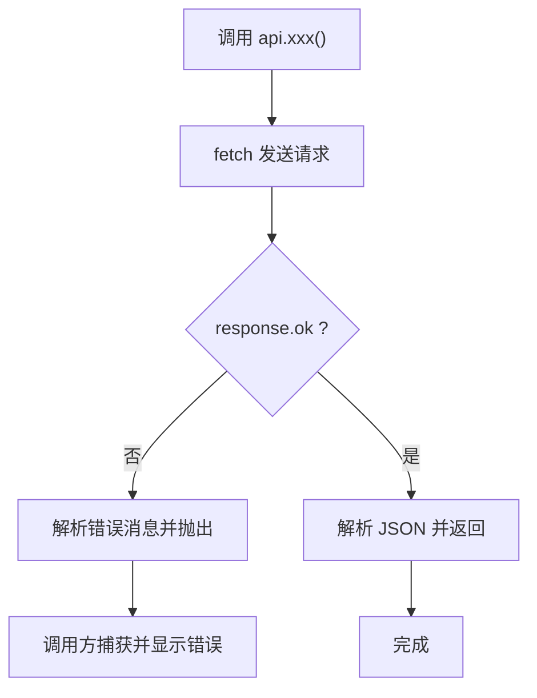

**图表来源**
- [apps/web/src/api.ts:633-646](file://apps/web/src/api.ts#L633-L646)
- [apps/web/src/api.ts:648-713](file://apps/web/src/api.ts#L648-L713)

**章节来源**
- [apps/web/src/api.ts:1-909](file://apps/web/src/api.ts#L1-L909)

### 布局与对话框编排
- 布局网格
  - 三列布局：侧边栏、分隔条、工作台、分隔条、检查器，列宽通过 CSS 变量控制并支持拖拽调整。
  - 知识中心采用特殊的三列布局（gridColumn: "3 / 6"），作为工作台的补充面板。
  - Inspector采用独立的检查器区域，宽度可调节。
  - 专家编排面板作为 Inspector 的新标签页，提供专门的编排可视化界面。
  - 专家编排6个专用面板组件提供完整的可视化界面。
- 对话框
  - 工作区创建、应用设置、工作区配置、知识中心等，均以条件渲染方式呈现，使用 backdrop 与 role 语义化结构。
- 交互细节
  - 拖拽分隔条：记录初始指针位置与列宽，计算 delta 并限制最小/最大范围，实时更新 CSS 变量。
  - 键盘快捷键：Cmd/Ctrl+K 打开命令面板。

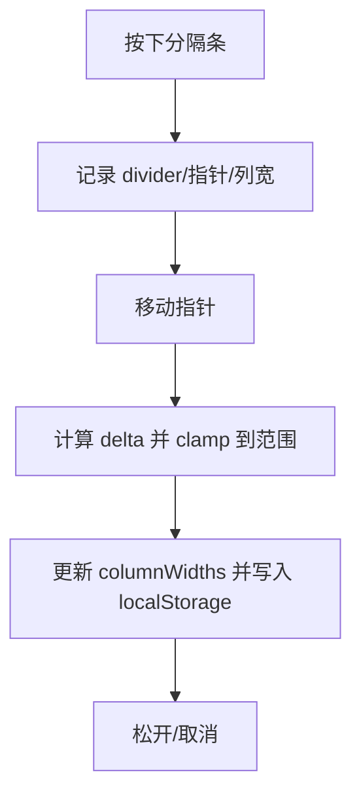

**图表来源**
- [apps/web/src/App.tsx:382-415](file://apps/web/src/App.tsx#L382-L415)
- [apps/web/src/App.tsx:154-156](file://apps/web/src/App.tsx#L154-L156)

**章节来源**
- [apps/web/src/App.tsx:484-578](file://apps/web/src/App.tsx#L484-L578)
- [apps/web/src/App.tsx:382-415](file://apps/web/src/App.tsx#L382-L415)

## 专家编排系统

### 专家编排系统概述
- 专家编排系统是 RepoHelm 的核心功能模块，旨在提供专业的任务编排和专家协作能力。
- 系统采用全新的 UI 设计，包含 6 个专门的 Inspector Tab，每个标签页专注于特定的编排方面。
- 编排流程从 Spec 生成开始，经过 Plan 审批，到执行、验收，最终产出成果。
- 新增的专家编排系统支持完整的专家会话管理，包括任务树可视化、Agent池管理、交付物追踪等。
- 新增的5个专用UI面板组件提供完整的专家编排工作流可视化界面。

### 专家编排系统架构
- 会话管理：支持专家会话的创建、状态管理和确认流程。
- 任务树：可视化展示专家编排的任务结构和依赖关系。
- Agent池：管理参与编排的Agent集合和状态。
- 交付物：追踪和管理专家编排产生的各种交付物。
- 研究资料：收集和管理相关的研究和参考资料。
- 验收测试：定义和管理专家编排的验收测试用例。
- 实时更新：通过SSE支持实时数据流式传输，提供实时状态更新。

### 专家编排工作流
- 会话创建：根据用户需求创建专家编排会话。
- 任务规划：生成专家编排的任务树和执行计划。
- Agent分配：为任务分配合适的Agent并建立依赖关系。
- 执行监控：实时监控任务执行状态和进度。
- 交付物管理：收集和管理任务产生的交付物。
- 验收确认：进行质量验收和最终确认。

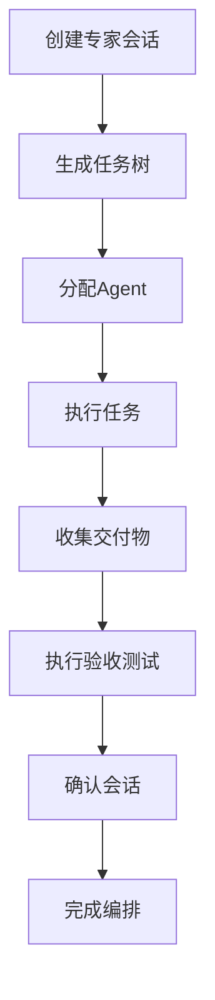

**图表来源**
- [apps/web/src/api.ts:892-907](file://apps/web/src/api.ts#L892-L907)
- [apps/web/src/components/OrchestrationPanel.tsx:18-37](file://apps/web/src/components/OrchestrationPanel.tsx#L18-L37)

**章节来源**
- [apps/web/src/api.ts:892-907](file://apps/web/src/api.ts#L892-L907)
- [apps/web/src/components/OrchestrationPanel.tsx:18-37](file://apps/web/src/components/OrchestrationPanel.tsx#L18-L37)

## 专家编排API集成

### API 方法概览
- 会话管理
  - createExpertSession：创建新的专家编排会话
  - getExpertSession：获取指定会话的详细信息
  - updateExpertSession：更新会话状态和配置
  - confirmExpertSession：确认并启动会话执行
- 数据获取
  - getExpertDeliverables：获取会话产生的交付物
  - getExpertReferences：获取相关的参考资料
  - getExpertResearch：获取研究和背景资料
  - getExpertAcceptanceTests：获取验收测试用例
- 实时流式传输
  - setupSSE：建立SSE连接
  - formatSSE：格式化SSE事件数据

### API 调用模式
- 会话管理：使用 POST/PATCH 方法进行会话的创建和更新
- 数据获取：使用 GET 方法获取会话相关的各种数据
- 错误处理：统一的错误处理机制，支持详细的错误信息
- 类型安全：完整的 TypeScript 类型定义，确保数据结构正确
- 实时更新：支持SSE实时数据流式传输

### API 集成实现
- 会话创建：支持指定需求、入口Agent和项目ID
- 会话状态：支持完整的会话生命周期管理
- 数据同步：实时同步专家编排的最新状态
- 用户交互：提供流畅的用户交互体验
- SSE支持：提供完整的SSE实时流式传输支持

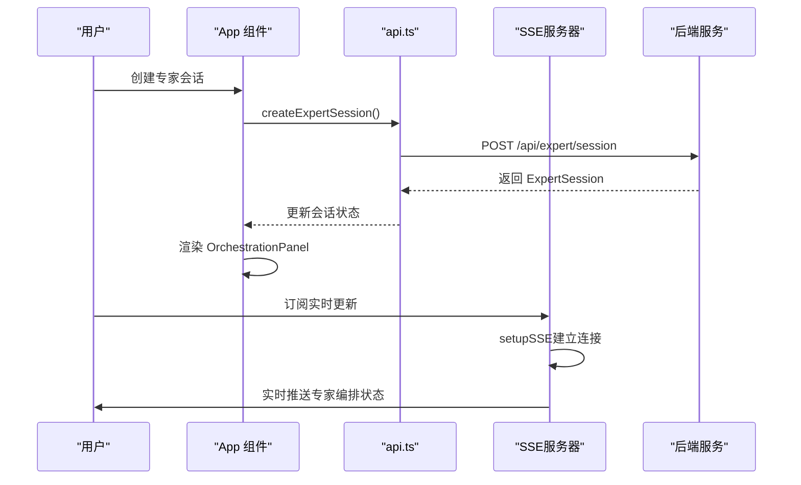

**图表来源**
- [apps/web/src/api.ts:892-893](file://apps/web/src/api.ts#L892-L893)
- [apps/web/src/api.ts:894-895](file://apps/web/src/api.ts#L894-L895)
- [apps/server/src/sse.ts:3-12](file://apps/server/src/sse.ts#L3-L12)

**章节来源**
- [apps/web/src/api.ts:892-907](file://apps/web/src/api.ts#L892-L907)

## 专家编排UI面板组件

### ProgressPanel（进展面板）
- 功能特性
  - 任务状态可视化：使用图标和状态徽章显示任务执行状态
  - Agent信息展示：显示任务分配的Agent名称和头像
  - 实时状态更新：支持任务状态的实时更新和显示
  - 用户友好界面：提供清晰的任务进展概览
- 组件实现
  - 使用 icons 映射表定义任务状态图标
  - 支持 pending、in_progress、completed、failed、skipped 状态
  - 通过 expert-progress-row 类实现统一的行样式
  - 通过 expert-status-badge 类实现状态徽章样式

### AcceptancePanel（验收面板）
- 功能特性
  - 验收测试展示：显示验收测试用例的标题、描述和状态
  - 测试类型标识：区分单元测试、集成测试和端到端测试
  - 状态颜色编码：使用不同颜色表示测试状态（草稿、已确认、已生成、通过、失败）
  - 用户确认功能：支持用户确认草稿状态的测试用例
  - 测试输出展示：显示测试执行结果和输出信息
- 组件实现
  - 使用 colors 映射表定义状态颜色
  - 支持 draft、confirmed、generated、passing、failing 状态
  - 通过 expert-acceptance-card 类实现卡片样式
  - 通过 expert-test-type 类实现测试类型标识

### DeliverablesPanel（产物面板）
- 功能特性
  - 文件变更展示：显示任务产生的文件变更列表
  - Diff查看器：提供代码差异的可视化查看界面
  - 交互式选择：支持用户选择特定文件查看详细差异
  - 实时更新：支持产物信息的实时更新和显示
- 组件实现
  - 使用 DiffView 组件实现差异查看功能
  - 通过 expert-file-item 类实现文件项样式
  - 通过 expert-diff-viewer 类实现差异查看器样式
  - 支持 file_change 类型的产物展示

### ReferencesPanel（引用面板）
- 功能特性
  - 知识库引用展示：显示相关的知识库引用和摘要
  - 用户习惯展示：展示用户的偏好设置和习惯信息
  - 失败经验总结：显示相关的失败场景和经验教训
  - 分类信息展示：支持不同类型信息的分类展示
- 组件实现
  - 支持 knowledgeItems、preferences、failurePatterns 三种信息类型
  - 通过条件渲染实现信息的动态展示
  - 使用 CSS 变量实现主题适配

### ResearchPanel（研究面板）
- 功能特性
  - 研究结果分类：按类型对研究结果进行分组展示
  - 代码片段展示：显示相关的代码片段和上下文
  - 研究摘要展示：提供研究结果的详细摘要和说明
  - 逻辑推理展示：显示提议的逻辑和推理过程
- 组件实现
  - 使用 labels 映射表定义研究类型标签
  - 通过 grouped 结构实现数据分组
  - 支持 reusable_function、existing_logic、proposed_change、related_code 四种类型
  - 通过 expert-research-card 类实现卡片样式

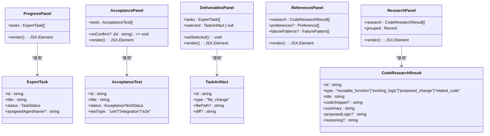

**图表来源**
- [apps/web/src/components/ProgressPanel.tsx:6-23](file://apps/web/src/components/ProgressPanel.tsx#L6-L23)
- [apps/web/src/components/AcceptancePanel.tsx:6-27](file://apps/web/src/components/AcceptancePanel.tsx#L6-L27)
- [apps/web/src/components/DeliverablesPanel.tsx:17-34](file://apps/web/src/components/DeliverablesPanel.tsx#L17-L34)
- [apps/web/src/components/ReferencesPanel.tsx:4-39](file://apps/web/src/components/ReferencesPanel.tsx#L4-L39)
- [apps/web/src/components/ResearchPanel.tsx:6-27](file://apps/web/src/components/ResearchPanel.tsx#L6-L27)

**章节来源**
- [apps/web/src/components/ProgressPanel.tsx:1-23](file://apps/web/src/components/ProgressPanel.tsx#L1-L23)
- [apps/web/src/components/AcceptancePanel.tsx:1-27](file://apps/web/src/components/AcceptancePanel.tsx#L1-L27)
- [apps/web/src/components/DeliverablesPanel.tsx:1-34](file://apps/web/src/components/DeliverablesPanel.tsx#L1-L34)
- [apps/web/src/components/ReferencesPanel.tsx:1-39](file://apps/web/src/components/ReferencesPanel.tsx#L1-L39)
- [apps/web/src/components/ResearchPanel.tsx:1-27](file://apps/web/src/components/ResearchPanel.tsx#L1-L27)

## 专家编排标签页设计

### 标签页定义
- 专家编排标签：新增专门的专家编排标签页，支持专家会话的可视化展示
- 动态标签：根据专家会话状态动态显示和隐藏标签页
- 内容区域：标签页包含专家编排任务树和Agent池的可视化展示
- 状态指示：标签页标题显示专家会话的当前状态
- 6个专用标签页：orchestration（编排）、progress（进展）、acceptance（验收）、deliverables（产物）、references（引用）、research（研究）

### 标签页状态管理
- 状态计算：根据专家会话状态计算标签页的可见性和标题
- 自动选择：当专家会话状态变化时自动选择合适的标签页
- 持久化：专家编排标签页状态进行持久化存储
- 响应式：标签页设计支持响应式布局

### 内容面板设计
- 任务树面板：展示专家编排的任务树结构和状态
- Agent池面板：展示参与编排的Agent集合和状态
- 状态指示器：显示专家会话的整体状态和进度
- 交互控制：提供专家编排相关的交互控制按钮
- 专用面板：每个标签页对应一个专用的UI面板组件

### 样式设计
- 主题适配：专家编排UI完全支持主题切换
- 响应式布局：支持不同屏幕尺寸的显示效果
- 动画效果：提供流畅的标签页切换动画
- 可访问性：支持键盘导航和屏幕阅读器
- 专家编排样式：完全基于CSS变量系统，支持无缝主题切换

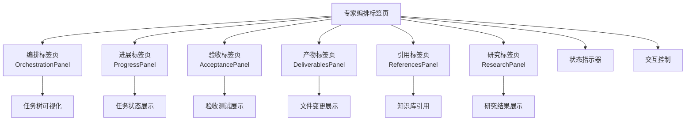

**图表来源**
- [apps/web/src/components/OrchestrationPanel.tsx:18-37](file://apps/web/src/components/OrchestrationPanel.tsx#L18-L37)
- [apps/web/src/components/ProgressPanel.tsx:6-23](file://apps/web/src/components/ProgressPanel.tsx#L6-L23)
- [apps/web/src/components/AcceptancePanel.tsx:6-27](file://apps/web/src/components/AcceptancePanel.tsx#L6-L27)
- [apps/web/src/components/DeliverablesPanel.tsx:17-34](file://apps/web/src/components/DeliverablesPanel.tsx#L17-L34)
- [apps/web/src/components/ReferencesPanel.tsx:4-39](file://apps/web/src/components/ReferencesPanel.tsx#L4-L39)
- [apps/web/src/components/ResearchPanel.tsx:6-27](file://apps/web/src/components/ResearchPanel.tsx#L6-L27)
- [apps/web/src/styles.css:3344-3372](file://apps/web/src/styles.css#L3344-L3372)

**章节来源**
- [apps/web/src/components/OrchestrationPanel.tsx:18-37](file://apps/web/src/components/OrchestrationPanel.tsx#L18-L37)
- [apps/web/src/components/ProgressPanel.tsx:6-23](file://apps/web/src/components/ProgressPanel.tsx#L6-L23)
- [apps/web/src/components/AcceptancePanel.tsx:6-27](file://apps/web/src/components/AcceptancePanel.tsx#L6-L27)
- [apps/web/src/components/DeliverablesPanel.tsx:17-34](file://apps/web/src/components/DeliverablesPanel.tsx#L17-L34)
- [apps/web/src/components/ReferencesPanel.tsx:4-39](file://apps/web/src/components/ReferencesPanel.tsx#L4-L39)
- [apps/web/src/components/ResearchPanel.tsx:6-27](file://apps/web/src/components/ResearchPanel.tsx#L6-L27)
- [apps/web/src/styles.css:3344-3372](file://apps/web/src/styles.css#L3344-L3372)

## SSE实时流式传输

### SSE功能概述
- 服务器推送事件（SSE）支持：为专家编排系统提供实时数据更新能力
- 流式数据传输：支持持续的数据流式传输，无需轮询
- 自动重连机制：支持连接断开后的自动重连
- 事件格式化：提供标准的SSE事件格式化功能

### setupSSE函数
- 功能实现
  - 设置正确的HTTP头部：Content-Type、Cache-Control、Connection
  - 返回ReadableStream作为响应体
  - 支持长连接保持
- 使用场景
  - 专家编排状态实时更新
  - 任务执行进度监控
  - 实时通知和警告

### formatSSE函数
- 功能实现
  - 格式化SSE事件数据：包含事件类型和数据内容
  - JSON序列化事件数据
  - 标准的SSE格式输出
- 数据结构
  - event：事件类型字符串
  - data：事件数据对象

### 实时更新机制
- 专家编排实时更新：支持专家会话状态的实时更新
- 任务状态监控：实时监控任务执行状态变化
- 用户界面同步：确保UI与后端状态保持同步
- 错误处理：提供完善的错误处理和重连机制

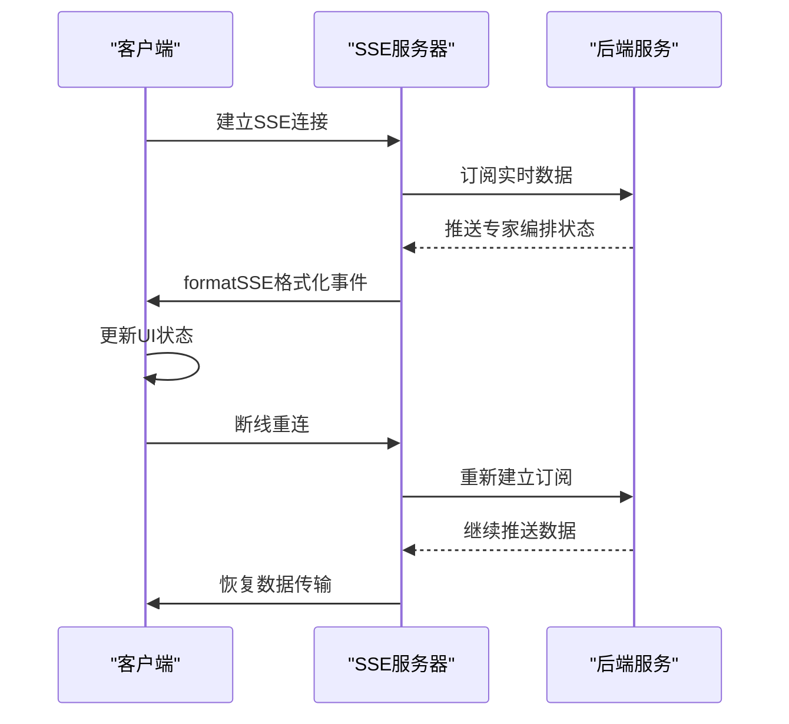

**图表来源**
- [apps/server/src/sse.ts:3-12](file://apps/server/src/sse.ts#L3-L12)

**章节来源**
- [apps/server/src/sse.ts:1-13](file://apps/server/src/sse.ts#L1-L13)

## 专家编排类型定义

### 专家会话类型
- ExpertSession：完整的专家编排会话定义
- 会话状态：支持分析中、等待确认、已确认、执行中、已完成、失败等状态
- 任务树：包含完整的任务树结构和扁平化的任务列表
- Agent池：管理参与编排的Agent原型和动态Agent
- 错误处理：包含详细的错误信息和恢复机制

### 任务节点类型
- ExpertTaskNode：专家任务节点定义
- 任务类型：支持根节点、分析、研究、实现、测试、审查、交付等类型
- 任务状态：支持待处理、进行中、已完成、失败、跳过等状态
- 依赖关系：支持任务间的依赖关系定义
- 交付物：支持任务产生的各种交付物

### 任务类型
- ExpertTask：扁平化的任务定义
- 任务关联：与任务节点建立关联关系
- 执行信息：包含任务的执行Agent、进度、时间戳等信息
- 失败处理：包含失败原因和相关信息

### 验收测试类型
- AcceptanceTest：验收测试定义
- 测试类型：支持单元测试、集成测试、端到端测试
- 测试状态：支持草稿、已确认、已生成、通过、失败等状态
- 相关任务：支持与相关任务的关联关系

### 研究结果类型
- CodeResearchResult：代码研究结果定义
- 研究类型：支持可重用函数、现有逻辑、提议变更、相关代码等类型
- 代码片段：支持代码片段、行号范围、摘要等信息
- 推荐逻辑：支持提议的逻辑和推理过程

### Agent池快照
- Agent原型：系统内置Agent的原型信息
- 动态Agent：运行时创建的Agent信息
- 活跃Agent：当前活跃的Agent列表

### 交付物类型
- TaskArtifact：任务交付物定义
- 交付物类型：支持文件变更、测试结果、研究摘要、审查评论等类型
- 文件关联：支持与项目文件的关联关系
- 差异信息：支持代码差异的详细信息

### 错误类型
- ExpertError：专家编排错误定义
- 错误代码：标准化的错误代码
- 恢复机制：支持错误的恢复和处理
- 影响范围：支持影响的任务范围

```mermaid
classDiagram
class ExpertSession {
+id : string
+status : ExpertSessionStatus
+entryAgentId : string
+taskTree : ExpertTaskNode
+flatTasks : ExpertTask[]
+acceptanceTests : AcceptanceTest[]
+research : CodeResearchResult[]
+agentPool : AgentPoolSnapshot
+errors : ExpertError[]
}
class ExpertTaskNode {
+id : string
+title : string
+type : TaskNodeType
+status : TaskStatus
+assignedAgentId? : string
+assignedAgentName? : string
+children : ExpertTaskNode[]
+dependencies : string[]
+artifacts : TaskArtifact[]
+acceptanceTestIds? : string[]
}
class ExpertTask {
+id : string
+nodeId : string
+title : string
+description : string
+type : TaskNodeType
+status : TaskStatus
+assignedAgentId? : string
+assignedAgentName? : string
+progress? : number
+startedAt? : string
+completedAt? : string
+artifacts : TaskArtifact[]
}
class AcceptanceTest {
+id : string
+title : string
+description : string
+status : AcceptanceTestStatus
+testType : "unit"|"integration"|"e2e"
+relatedTaskIds : string[]
+userConfirmed : boolean
+generatedTestPath? : string
}
class CodeResearchResult {
+id : string
+taskId? : string
+type : "reusable_function"|"existing_logic"|"proposed_change"|"related_code"
+title : string
+filePath? : string
+codeSnippet? : string
+lineRange? : {start : number, end : number}
+summary : string
+proposedLogic? : string
+reasoning? : string
}
class AgentPoolSnapshot {
+prototypes : Array<{
+dynamicAgents : Array<{
+activeAgents : string[]
}
ExpertSession --> ExpertTaskNode : "包含"
ExpertSession --> ExpertTask : "包含"
ExpertSession --> AcceptanceTest : "包含"
ExpertSession --> CodeResearchResult : "包含"
ExpertSession --> AgentPoolSnapshot : "包含"
ExpertTaskNode --> ExpertTaskNode : "包含子节点"
ExpertTaskNode --> TaskArtifact : "产生"
```

**图表来源**
- [apps/web/src/api.ts:514-534](file://apps/web/src/api.ts#L514-L534)
- [apps/web/src/api.ts:536-551](file://apps/web/src/api.ts#L536-L551)
- [apps/web/src/api.ts:553-568](file://apps/web/src/api.ts#L553-L568)
- [apps/web/src/api.ts:570-581](file://apps/web/src/api.ts#L570-L581)
- [apps/web/src/api.ts:583-594](file://apps/web/src/api.ts#L583-L594)
- [apps/web/src/api.ts:596-611](file://apps/web/src/api.ts#L596-L611)
- [apps/web/src/api.ts:613-622](file://apps/web/src/api.ts#L613-L622)

**章节来源**
- [apps/web/src/api.ts:514-631](file://apps/web/src/api.ts#L514-L631)

## 专家编排状态管理

### 状态定义
- expertSession：当前激活的专家编排会话状态
- expertSessionLoading：专家会话数据加载状态
- expertSessionError：专家会话错误状态
- expertActiveTab：专家编排标签页的当前激活状态

### 状态更新机制
- 会话创建：创建新会话后自动设置为当前激活状态
- 会话切换：支持在多个专家会话间切换
- 实时同步：专家会话状态随后端数据实时同步
- 错误处理：专家会话错误状态提供详细的错误信息

### 状态持久化
- 会话状态：专家会话状态通过本地存储进行持久化
- 标签页状态：专家编排标签页状态进行持久化
- 用户偏好：专家编排相关的用户偏好进行持久化

### 状态计算
- 会话数据：根据专家会话ID计算相关的会话数据
- 标签页可见性：根据专家会话状态动态计算标签页的可见性
- 数据缓存：专家会话数据进行缓存以提升性能

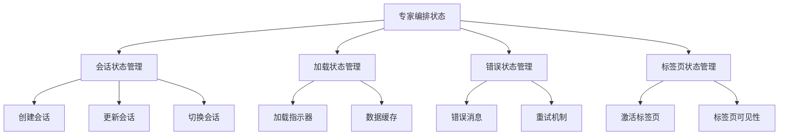

**图表来源**
- [apps/web/src/App.tsx:105](file://apps/web/src/App.tsx#L105)
- [apps/web/src/App.tsx:110-112](file://apps/web/src/App.tsx#L110-L112)

**章节来源**
- [apps/web/src/App.tsx:105](file://apps/web/src/App.tsx#L105)
- [apps/web/src/App.tsx:110-112](file://apps/web/src/App.tsx#L110-L112)

## 专家编排UI集成

### Inspector标签集成
- 标签页定义：新增专家编排标签页，支持专家会话的可视化展示
- 动态显示：根据专家会话状态动态显示和隐藏标签页
- 内容渲染：使用专用UI面板组件渲染专家编排内容
- 状态同步：专家编排标签页状态与会话状态保持同步

### 专家编排面板集成
- 组件渲染：在专家编排标签页中渲染专用UI面板组件
- 数据绑定：将专家会话数据绑定到UI面板组件
- 交互处理：处理专家编排面板的用户交互事件
- 响应式设计：支持不同屏幕尺寸的专家编排面板显示

### 专家编排数据流
- 数据获取：通过 API 获取专家会话数据
- 状态更新：更新专家编排状态
- UI渲染：渲染专家编排UI组件
- 用户交互：处理用户的专家编排操作

### 专家编排样式集成
- 主题支持：专家编排UI完全支持主题切换
- 样式变量：使用CSS变量实现专家编排的样式定制
- 响应式设计：专家编排UI支持响应式设计
- 动画效果：专家编排UI提供流畅的动画效果

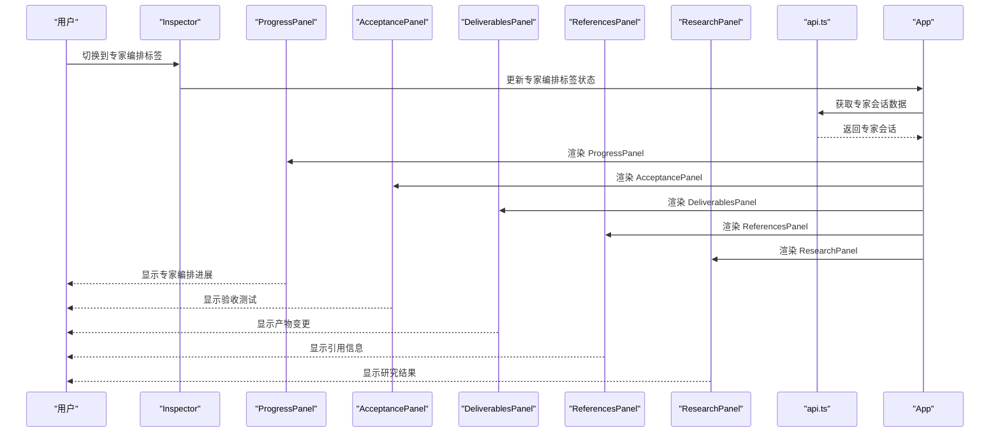

**图表来源**
- [apps/web/src/App.tsx:1188-1387](file://apps/web/src/App.tsx#L1188-L1387)
- [apps/web/src/components/ProgressPanel.tsx:6-23](file://apps/web/src/components/ProgressPanel.tsx#L6-L23)
- [apps/web/src/components/AcceptancePanel.tsx:6-27](file://apps/web/src/components/AcceptancePanel.tsx#L6-L27)
- [apps/web/src/components/DeliverablesPanel.tsx:17-34](file://apps/web/src/components/DeliverablesPanel.tsx#L17-L34)
- [apps/web/src/components/ReferencesPanel.tsx:4-39](file://apps/web/src/components/ReferencesPanel.tsx#L4-L39)
- [apps/web/src/components/ResearchPanel.tsx:6-27](file://apps/web/src/components/ResearchPanel.tsx#L6-L27)

**章节来源**
- [apps/web/src/App.tsx:1188-1387](file://apps/web/src/App.tsx#L1188-L1387)
- [apps/web/src/components/ProgressPanel.tsx:6-23](file://apps/web/src/components/ProgressPanel.tsx#L6-L23)
- [apps/web/src/components/AcceptancePanel.tsx:6-27](file://apps/web/src/components/AcceptancePanel.tsx#L6-L27)
- [apps/web/src/components/DeliverablesPanel.tsx:17-34](file://apps/web/src/components/DeliverablesPanel.tsx#L17-L34)
- [apps/web/src/components/ReferencesPanel.tsx:4-39](file://apps/web/src/components/ReferencesPanel.tsx#L4-L39)
- [apps/web/src/components/ResearchPanel.tsx:6-27](file://apps/web/src/components/ResearchPanel.tsx#L6-L27)

## 专家编排工作流

### 会话创建流程
- 需求输入：用户输入专家编排的需求和要求
- Agent选择：选择合适的入口Agent参与编排
- 项目关联：关联相关的项目ID
- 会话创建：调用 createExpertSession API 创建会话
- 状态初始化：会话状态初始化为分析中

### 任务规划流程
- 任务生成：系统根据需求生成专家编排任务树
- Agent分配：为任务分配合适的Agent
- 依赖定义：定义任务间的依赖关系
- 执行计划：生成任务的执行计划和时间安排

### 执行监控流程
- 状态更新：实时更新任务的执行状态
- Agent反馈：收集Agent的执行反馈
- 进度跟踪：跟踪任务的执行进度
- 问题处理：及时处理执行过程中的问题

### 交付物管理流程
- 交付物收集：收集任务产生的各种交付物
- 质量检查：对交付物进行质量检查
- 版本管理：管理交付物的版本和变更
- 分享发布：分享和发布最终的交付物

### 验收确认流程
- 测试执行：执行验收测试用例
- 结果评估：评估测试结果和质量
- 用户确认：用户确认验收结果
- 会话完成：完成专家编排会话

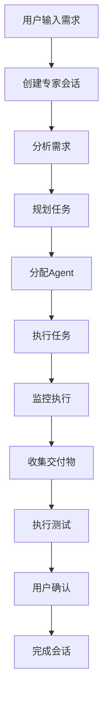

**图表来源**
- [apps/web/src/api.ts:892-893](file://apps/web/src/api.ts#L892-L893)
- [apps/web/src/api.ts:894-895](file://apps/web/src/api.ts#L894-L895)
- [apps/web/src/api.ts:898-899](file://apps/web/src/api.ts#L898-L899)

**章节来源**
- [apps/web/src/api.ts:892-907](file://apps/web/src/api.ts#L892-L907)

## 专家编排数据流

### 数据获取流程
- 会话数据：通过 getExpertSession API 获取专家会话的详细数据
- 交付物数据：通过 getExpertDeliverables API 获取会话产生的交付物
- 参考资料：通过 getExpertReferences API 获取相关的参考资料
- 研究数据：通过 getExpertResearch API 获取研究和背景资料
- 测试数据：通过 getExpertAcceptanceTests API 获取验收测试用例

### 数据更新机制
- 实时同步：专家会话数据通过WebSocket或其他机制实时同步
- 缓存策略：专家会话数据进行缓存以提升性能
- 错误处理：数据获取失败时提供错误处理和重试机制
- 状态管理：专家会话数据状态进行统一管理

### 数据处理逻辑
- 数据解析：解析专家会话API返回的数据结构
- 状态映射：将API数据映射到前端状态管理
- 错误处理：处理API调用过程中的各种错误情况
- 性能优化：优化数据获取和处理的性能

### 数据展示策略
- 渐进式加载：专家会话数据采用渐进式加载策略
- 懒加载：专家编排面板采用懒加载机制
- 预加载：相关数据进行预加载以提升用户体验
- 缓存利用：充分利用缓存数据减少API调用

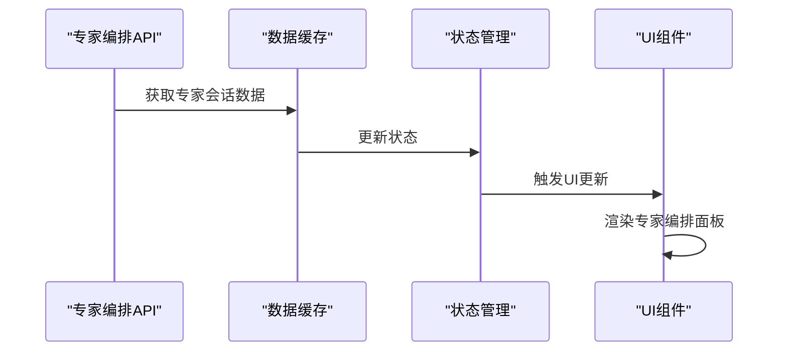

**图表来源**
- [apps/web/src/api.ts:894-895](file://apps/web/src/api.ts#L894-L895)
- [apps/web/src/api.ts:900-907](file://apps/web/src/api.ts#L900-L907)

**章节来源**
- [apps/web/src/api.ts:894-907](file://apps/web/src/api.ts#L894-L907)

## 专家编排错误处理

### 错误类型分类
- API错误：专家编排API调用失败产生的错误
- 数据错误：专家会话数据格式或内容错误
- 网络错误：网络连接或超时导致的错误
- 用户错误：用户操作错误或输入错误
- 系统错误：系统内部错误或异常

### 错误处理机制
- 错误捕获：统一的错误捕获和处理机制
- 错误分类：对不同类型的错误进行分类处理
- 用户提示：向用户提供友好的错误提示信息
- 自动恢复：支持部分错误的自动恢复机制
- 日志记录：记录详细的错误日志用于调试

### 错误恢复策略
- 重试机制：支持API调用的自动重试
- 回退策略：在错误发生时提供回退策略
- 缓存恢复：从缓存中恢复部分数据
- 用户干预：允许用户进行手动干预和修复
- 状态清理：清理错误状态并恢复到正常状态

### 错误监控
- 错误统计：统计各种错误的发生频率和类型
- 性能影响：监控错误对系统性能的影响
- 用户影响：评估错误对用户体验的影响
- 修复优先级：根据错误严重程度确定修复优先级

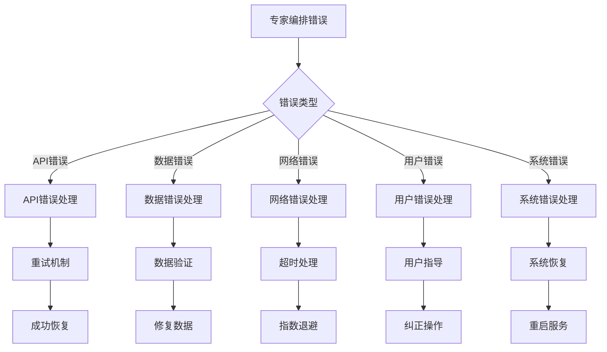

**图表来源**
- [apps/web/src/api.ts:633-646](file://apps/web/src/api.ts#L633-L646)

**章节来源**
- [apps/web/src/api.ts:633-646](file://apps/web/src/api.ts#L633-L646)

## 专家编排性能优化

### 渲染优化
- 组件懒加载：专家编排面板采用懒加载机制
- 虚拟滚动：对于大量任务节点使用虚拟滚动优化
- 状态缓存：专家会话状态进行缓存以减少重新计算
- 渲染优化：使用React.memo和useMemo优化渲染性能
- 任务树优化：对大型任务树进行分层渲染优化
- 专用面板优化：每个专家编排面板组件独立优化

### 数据优化
- 数据分页：专家会话数据采用分页加载策略
- 数据压缩：对传输的数据进行压缩以减少带宽
- 缓存策略：专家会话数据采用多级缓存策略
- 预加载机制：相关数据进行预加载以提升响应速度
- 增量更新：支持专家会话数据的增量更新

### 网络优化
- 连接池：专家编排API使用连接池优化网络连接
- 请求合并：将多个相关的API请求合并为一个请求
- 防抖机制：对频繁的API调用使用防抖机制
- 超时控制：专家编排API调用设置合理的超时时间
- 错误重试：支持API调用的智能重试机制

### 内存优化
- 对象池：专家编排相关的对象使用对象池管理
- 内存泄漏防护：防止专家编排相关的内存泄漏
- 垃圾回收：合理触发垃圾回收以释放内存
- 监控告警：监控内存使用情况并发出告警
- 优化策略：根据内存使用情况调整优化策略

### 性能监控
- 性能指标：监控专家编排的性能关键指标
- 响应时间：监控专家编排API的响应时间
- 渲染性能：监控专家编排UI的渲染性能
- 内存使用：监控专家编排的内存使用情况
- 错误率：监控专家编排API的错误率

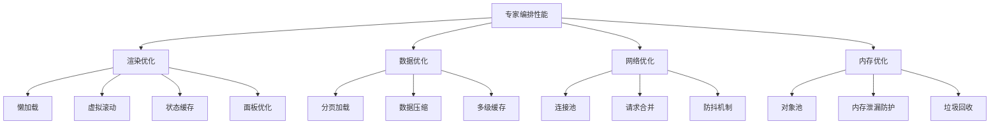

**图表来源**
- [apps/web/src/components/ProgressPanel.tsx:6-23](file://apps/web/src/components/ProgressPanel.tsx#L6-L23)
- [apps/web/src/components/AcceptancePanel.tsx:6-27](file://apps/web/src/components/AcceptancePanel.tsx#L6-L27)
- [apps/web/src/components/DeliverablesPanel.tsx:17-34](file://apps/web/src/components/DeliverablesPanel.tsx#L17-L34)
- [apps/web/src/components/ReferencesPanel.tsx:4-39](file://apps/web/src/components/ReferencesPanel.tsx#L4-L39)
- [apps/web/src/components/ResearchPanel.tsx:6-27](file://apps/web/src/components/ResearchPanel.tsx#L6-L27)

**章节来源**
- [apps/web/src/components/ProgressPanel.tsx:6-23](file://apps/web/src/components/ProgressPanel.tsx#L6-L23)
- [apps/web/src/components/AcceptancePanel.tsx:6-27](file://apps/web/src/components/AcceptancePanel.tsx#L6-L27)
- [apps/web/src/components/DeliverablesPanel.tsx:17-34](file://apps/web/src/components/DeliverablesPanel.tsx#L17-L34)
- [apps/web/src/components/ReferencesPanel.tsx:4-39](file://apps/web/src/components/ReferencesPanel.tsx#L4-L39)
- [apps/web/src/components/ResearchPanel.tsx:6-27](file://apps/web/src/components/ResearchPanel.tsx#L6-L27)

## 专家编排调试技巧

### 开发者工具
- 浏览器调试：使用浏览器开发者工具调试专家编排功能
- 网络监控：监控专家编排API的网络请求和响应
- 性能分析：使用性能分析工具分析专家编排的性能瓶颈
- 内存分析：使用内存分析工具检测专家编排的内存问题
- 控制台日志：在控制台输出专家编排的关键日志信息

### 日志记录
- 关键日志：记录专家编排的重要操作和状态变化
- 错误日志：详细记录专家编排的错误信息和堆栈跟踪
- 性能日志：记录专家编排的性能指标和耗时信息
- 用户行为：记录用户在专家编排中的操作行为
- 系统状态：记录专家编排系统的运行状态和配置信息

### 调试方法
- 断点调试：在专家编排的关键代码处设置断点进行调试
- 单元测试：编写专家编排相关的单元测试进行调试
- 集成测试：进行专家编排的端到端集成测试
- 性能测试：进行专家编排的性能压力测试
- 回归测试：在专家编排功能变更后进行回归测试

### 常见问题排查
- API调用失败：检查专家编排API的调用参数和返回值
- 数据不一致：检查专家编排数据的同步机制和一致性
- 状态异常：检查专家编排状态的更新逻辑和状态机
- 性能问题：分析专家编排的性能瓶颈和优化空间
- 用户体验：收集用户对专家编排功能的反馈和建议
- SSE连接问题：检查SSE服务器连接和数据传输

### 调试工具
- Redux DevTools：使用Redux DevTools调试专家编排状态
- React DevTools：使用React DevTools调试专家编排组件
- WebSocket调试：监控专家编排的WebSocket通信
- 数据库调试：检查专家编排相关的数据库操作
- 缓存调试：验证专家编排的缓存机制和数据一致性

```mermaid
flowchart TD
Debugging["专家编排调试"] --> BrowserTools["浏览器工具"]
Debugging --> Logging["日志记录"]
Debugging --> Testing["测试方法"]
Debugging --> CommonIssues["常见问题"]
Debugging --> SSEDebugging["SSE调试"]
BrowserTools --> Console["控制台调试"]
BrowserTools --> Network["网络监控"]
BrowserTools --> Performance["性能分析"]
Logging --> KeyLogs["关键日志"]
Logging --> ErrorLogs["错误日志"]
Logging --> PerformanceLogs["性能日志"]
Testing --> UnitTests["单元测试"]
Testing --> IntegrationTests["集成测试"]
Testing --> PerformanceTests["性能测试"]
CommonIssues --> APICalls["API调用失败"]
CommonIssues --> DataInconsistency["数据不一致"]
CommonIssues --> StateAbnormality["状态异常"]
CommonIssues --> SSEConnection["SSE连接问题"]
SSEDebugging --> SSEConnection["SSE连接调试"]
SSEDebugging --> SSEDataFlow["SSE数据流调试"]
```

**图表来源**
- [apps/web/src/api.ts:633-646](file://apps/web/src/api.ts#L633-L646)

**章节来源**
- [apps/web/src/api.ts:633-646](file://apps/web/src/api.ts#L633-L646)

## 依赖关系分析
- 运行时依赖
  - React 生态：React、React DOM、motion（动画）、lucide-react（图标）、@radix-ui/react-select（选择器）、cmdk（命令面板）。
  - 样式与工具：clsx、tailwind-merge、tailwindcss、@tailwindcss/vite。
  - 知识中心：新增知识库相关的样式和组件支持，包括mermaid、react-markdown、remark-gfm。
  - 分支检测：新增 Git 操作相关的依赖，包括 @hono/node-server。
  - 系统代理：新增代理设置相关的依赖，包括引擎配置和Agent管理。
  - 专家编排：新增完整的专家编排API依赖，包括 ExpertSession 类型定义和专用UI面板组件。
  - SSE支持：新增服务器推送事件（SSE）相关的依赖，包括 setupSSE 和 formatSSE 函数。
- 开发依赖
  - TypeScript、Vite、@vitejs/plugin-react。
- 构建与代理
  - Vite 代理将 /api 前缀转发至后端端口，默认 4300，可通过环境变量覆盖。

**更新** 依赖关系分析已更新，新增了专家编排相关的依赖项，包括 ExpertSession 类型定义、专用UI面板组件和SSE实时流式传输功能。

```mermaid
graph LR
PKG["package.json 依赖"] --> REACT["react/react-dom"]
PKG --> UI["@radix-ui/react-select/cmdk/lucide-react"]
PKG --> STYLE["clsx/tailwind-merge/tailwindcss/@tailwindcss/vite"]
PKG --> KNOWLEDGE["知识中心相关依赖"]
PKG --> MARKDOWN["react-markdown/remark-gfm"]
PKG --> MERMAID["mermaid"]
PKG --> GIT["@hono/node-server"]
PKG --> PROXY["代理设置相关依赖"]
PKG --> ORCHESTRATION["专家编排相关依赖<br/>ExpertSession/专用面板/SSE支持"]
PKG --> SSE["SSE服务器端支持<br/>setupSSE/formatSSE"]
VITE["vite.config.ts"] --> PROXY["/api -> localhost:REPOHELM_PORT"]
```

**图表来源**
- [apps/web/package.json:11-29](file://apps/web/package.json#L11-L29)
- [apps/web/vite.config.ts:5-14](file://apps/web/vite.config.ts#L5-L14)

**章节来源**
- [apps/web/package.json:1-37](file://apps/web/package.json#L1-L37)
- [apps/web/vite.config.ts:1-16](file://apps/web/vite.config.ts#L1-L16)

## 性能考虑
- 渲染优化
  - 使用 useMemo 缓存派生数据（如当前工作区、项目列表、事件、变更文件等），减少不必要的重渲染。
  - 使用 useCallback 包裹传给子组件的回调（在需要时），避免子组件重复渲染。
  - 知识中心使用 useCallback 优化视图加载函数。
  - Markdown渲染器使用memo优化，避免不必要的重新渲染。
  - Inspector组件使用动态标签系统，避免渲染空标签页。
  - 系统代理设置界面采用虚拟滚动，优化大量Agent的渲染性能。
  - 专家编排系统使用懒加载机制，仅在需要时加载编排面板。
  - 专家编排专用面板组件使用独立优化策略，提升渲染性能。
  - 专家编排API调用使用缓存机制，避免重复请求。
  - SSE支持使用连接池优化网络连接，减少连接建立开销。
- 异步加载
  - 并发加载多源数据，缩短首屏等待时间。
  - 知识库视图采用懒加载策略，仅在需要时加载。
  - Mermaid图表按需渲染，避免不必要的计算。
  - 分支检测使用防抖和取消机制，避免重复请求。
  - 系统Agent列表支持分页加载，提升大数据量下的性能。
  - 专家编排面板支持分层加载，避免一次性渲染大量数据。
  - 专家编排专用面板组件支持按需加载，提升初始渲染速度。
- 动画与过渡
  - 使用 motion 组件进行细粒度入场动画，注意在大量元素时降低动画复杂度。
  - Inspector标签页切换使用 CSS 过渡效果，提供流畅的用户体验。
  - 系统代理设置界面的标签切换使用硬件加速的CSS过渡。
  - 专家编排系统的标签切换提供平滑的过渡动画。
  - 专家编排专用面板组件使用CSS过渡效果优化状态变化。
  - SSE连接使用平滑的重连机制，避免界面闪烁。
- 样式与主题
  - CSS 变量驱动主题切换，避免频繁重排；Tailwind 工具类按需使用，避免过度嵌套。
  - Inspector样式完全基于 CSS 变量系统，支持无缝主题切换。
  - 系统代理设置界面采用卡片式布局，提升视觉性能。
  - 专家编排系统样式完全基于 CSS 变量系统，支持无缝主题切换。
  - 专家编排专用面板组件样式完全支持主题切换。
  - SSE样式支持基于CSS变量系统。
- 交互性能
  - 拖拽列宽时添加 is-resizing-columns 类，阻止文本选择与多余事件监听。
  - 知识中心的同步操作添加加载状态，避免重复请求。
  - Mermaid图表渲染使用防抖，避免频繁重渲染。
  - 分支检测使用取消机制，避免竞态条件。
  - 系统Agent的ModelKit切换使用防抖机制，避免频繁API调用。
  - 专家编排系统的标签切换使用防抖机制，提升交互响应性。
  - 专家编排专用面板组件使用防抖机制优化用户交互。
  - SSE连接使用心跳机制，确保连接稳定性。
- 资源与网络
  - 合理使用缓存与防抖（如搜索输入），避免频繁请求。
  - 知识库同步支持中断和重试机制。
  - Markdown渲染器缓存渲染结果，提高重复访问性能。
  - 分支检测结果缓存，避免重复Git操作。
  - 系统代理设置状态缓存，避免重复API调用。
  - 专家编排API数据缓存，避免重复加载相同数据。
  - 专家编排专用面板组件使用虚拟滚动优化大型数据集显示。
  - SSE使用连接池和请求合并，优化网络资源使用。

**更新** 性能考虑已更新，新增了专家编排相关的性能优化措施，包括专用面板组件优化、SSE连接池优化、按需加载策略等。

## 故障排查指南
- 常见问题
  - 无法连接后端：确认 Vite 代理配置与后端端口，检查 /api 前缀是否正确转发。
  - 主题不生效：确认 data-theme 属性是否正确设置，检查 localStorage 是否被禁用。
  - 列宽不持久化：检查 localStorage 写入权限（隐私模式可能禁用）。
  - 命令面板无法打开：确认 Cmd/Ctrl+K 快捷键未被浏览器扩展拦截。
  - 知识中心无法显示：检查项目绑定状态和知识库权限。
  - Inspector标签页异常：检查内容可用性标志和标签页计算逻辑。
  - 分支检测失败：检查Git仓库状态和分支权限。
  - Markdown渲染异常：检查Markdown语法和代码块标识。
  - Mermaid图表渲染失败：检查Mermaid语法和主题配置。
  - 嵌入模型配置无效：确认选择的 ModelKit 类型为 BYOK。
  - Quest 组合功能异常：检查工作区配置和项目关联状态。
  - 系统代理设置失败：检查引擎配置权限和API访问权限。
  - Agent管理异常：检查Agent权限和ModelKit绑定状态。
  - 专家编排系统异常：检查专家编排API调用和会话状态。
  - 专家编排面板渲染异常：检查专家会话数据和组件状态。
  - SubAgentDialog表单异常：检查表单验证和API调用。
  - SSE连接失败：检查SSE服务器配置和网络连接。
  - 专家编排实时更新异常：检查SSE连接状态和事件处理。
- 错误提示
  - 全局错误横幅：当 API 调用失败时显示错误信息，定位到具体操作。
  - 知识库错误：显示具体的索引错误信息和解决方案。
  - Inspector错误：显示标签页计算错误和内容加载失败信息。
  - 分支检测错误：显示Git操作失败和分支信息获取错误。
  - Mermaid图表错误：显示图表渲染失败的具体原因。
  - 系统代理错误：显示代理配置失败和权限不足信息。
  - Agent管理错误：显示Agent创建、更新或删除失败的具体原因。
  - 专家编排错误：显示专家编排API调用失败和会话状态异常信息。
  - 专家编排面板错误：显示专家会话数据加载失败和渲染异常信息。
  - SubAgentDialog错误：显示Agent创建、更新或权限配置失败的具体原因。
  - SSE错误：显示SSE连接失败和数据传输异常信息。
  - 专家编排实时更新错误：显示SSE连接状态异常和事件处理失败信息。
- 调试技巧
  - 在浏览器控制台查看 fetch 请求与响应。
  - 使用 React DevTools 检查组件树与状态变化。
  - 在 styles.css 中临时注释部分样式，定位布局问题。
  - 检查知识库状态和同步日志。
  - 使用浏览器开发者工具检查Mermaid图表的渲染状态。
  - 检查 Inspector 标签页的可见性计算逻辑。
  - 验证分支检测的Git命令执行和输出解析。
  - 检查系统代理设置的引擎配置更新日志。
  - 验证Agent权限配置和ModelKit绑定状态。
  - 检查专家编排系统的标签页可见性计算。
  - 验证SubAgentDialog表单的数据绑定和验证逻辑。
  - 检查专家编排API的调用参数和返回值。
  - 使用浏览器开发者工具检查专家编排的网络请求。
  - 验证专家编排面板组件的渲染性能和状态更新。
  - 检查专家会话数据的缓存和同步机制。
  - 使用浏览器开发者工具检查SSE连接状态和事件流。
  - 验证SSE服务器端配置和客户端连接逻辑。
  - 检查专家编排实时更新的数据格式和事件处理。

**更新** 故障排查指南已更新，新增了专家编排相关的故障排查内容，包括SSE连接问题、实时更新异常等问题排查。

**章节来源**
- [apps/web/vite.config.ts:9-14](file://apps/web/vite.config.ts#L9-L14)
- [apps/web/src/App.tsx:159-165](file://apps/web/src/App.tsx#L159-L165)
- [apps/web/src/App.tsx:154-156](file://apps/web/src/App.tsx#L154-L156)
- [apps/web/src/App.tsx:482](file://apps/web/src/App.tsx#L482)

## 结论
RepoHelm Web 前端采用清晰的分层架构：根组件集中状态与布局，组件层提供可复用 UI，API 层统一网络请求，样式层以 CSS 变量与 Tailwind 实现主题与一致性。虽然未直接使用 Zustand 等第三方状态库，但通过 React 本地状态与 localStorage 已满足当前规模的需求。整体具备良好的可扩展性与可维护性，适合在此基础上引入更复杂的全局状态管理方案（如 Zustand）以进一步提升大型场景下的可维护性。

**更新** 新增的专家编排系统和系统代理设置界面进一步增强了应用的专业性和智能化水平。专家编排系统提供了完整的任务编排和审查流程，包含6个专门的Inspector标签页和5个专用UI面板组件。系统代理设置界面实现了用户代理和系统代理的分离管理，提供了更加精细的代理配置能力。系统Agent管理功能支持系统自带Agent的ModelKit选择和权限配置，显著提升了系统的可管理性和灵活性。最新的动态标签管理系统和分支自动检测功能进一步优化了用户体验。知识中心组件、嵌入模型配置选项和改进的 Quest 组合功能进一步增强了应用的知识管理和任务协作能力。SubAgentDialog组件提供了完整的Agent生命周期管理界面。新增的专家编排API支持和专用UI面板组件提供了完整的专家编排功能。新增的SSE实时流式传输功能为专家编排系统提供了实时数据更新能力。这些变更共同构成了一个更加完善和易用的RepoHelm Web前端应用。

## 附录

### 响应式设计与可访问性
- 响应式
  - 使用 CSS Grid 与 CSS 变量控制布局，适配不同窗口尺寸。
  - 列宽范围限制与拖拽交互保证在小屏设备上的可用性。
  - 知识中心采用三列布局，在小屏设备上自动调整为单列显示。
  - Inspector标签页支持水平滚动，适应不同内容长度。
  - Markdown渲染器支持响应式表格和代码块显示。
  - 系统代理设置界面采用卡片式布局，提升移动端体验。
  - 专家编排系统的标签页支持响应式设计。
  - 专家编排专用面板组件支持响应式布局和交互。
  - SSE界面支持响应式设计。
- 可访问性
  - 为按钮、输入与对话框提供 aria-label 与 role。
  - 键盘导航与焦点可见性：使用 :focus-visible 与 outline。
  - 命令面板与下拉选择器支持键盘操作与无障碍读屏。
  - 知识中心提供语义化标题和内容结构。
  - Inspector标签页提供清晰的视觉层次和状态指示。
  - Markdown渲染器支持屏幕阅读器读取。
  - Mermaid图表提供alt文本和描述信息。
  - 系统代理设置界面提供清晰的标签页导航和状态指示。
  - 专家编排系统提供语义化的任务状态和进度指示。
  - 专家编排专用面板组件提供清晰的信息展示。
  - SSE界面提供状态指示和错误提示。

**章节来源**
- [apps/web/src/styles.css:106-125](file://apps/web/src/styles.css#L106-L125)
- [apps/web/src/components/CommandPalette.tsx:29-40](file://apps/web/src/components/CommandPalette.tsx#L29-L40)
- [apps/web/src/components/Select.tsx:40-66](file://apps/web/src/components/Select.tsx#L40-L66)
- [apps/web/src/styles.css:2945-3372](file://apps/web/src/styles.css#L2945-L3372)
- [apps/web/src/styles.css:3344-3372](file://apps/web/src/styles.css#L3344-L3372)

### 主题与样式定制
- 主题系统
  - 通过 data-theme 控制明/暗主题，CSS 变量在 :root 与 [data-theme="dark"] 中分别定义。
  - Tailwind v4 通过 @theme inline 暴露颜色与字体变量，支持工具类。
  - 知识中心组件完全支持主题切换，包括导航栏、内容区和图表。
  - Inspector组件完全支持主题切换，包括标签页和内容面板。
  - 系统代理设置界面完全支持主题切换，包括卡片布局和表单控件。
  - 专家编排系统完全支持主题切换，包括标签页和内容面板。
  - 专家编排专用面板组件完全支持主题切换，包括任务状态和数据展示。
  - SSE界面完全支持主题切换。
- 定制步骤
  - 修改 theme.css 中的颜色与阴影变量，即可全局改变外观。
  - 如需新增颜色或半径，可在 :root 与 [data-theme="dark"] 中同步添加。
- 与组件的耦合
  - 组件样式通过 CSS 类与变量命名，避免硬编码颜色；Select 与命令面板均遵循统一变量体系。
  - 知识中心样式完全基于 CSS 变量系统，支持无缝主题切换。
  - Inspector样式完全基于 CSS 变量系统，支持无缝主题切换。
  - 系统代理设置界面样式完全基于 CSS 变量系统，支持无缝主题切换。
  - 专家编排系统样式完全基于 CSS 变量系统，支持无缝主题切换。
  - 专家编排专用面板组件样式完全基于 CSS 变量系统，支持无缝主题切换。
  - SSE样式完全基于 CSS 变量系统。

**章节来源**
- [apps/web/src/theme.css:14-176](file://apps/web/src/theme.css#L14-L176)
- [apps/web/src/styles.css:106-125](file://apps/web/src/styles.css#L106-L125)
- [apps/web/src/components/Select.tsx:40-66](file://apps/web/src/components/Select.tsx#L40-L66)
- [apps/web/src/styles.css:2941-3099](file://apps/web/src/styles.css#L2941-L3099)
- [apps/web/src/styles.css:3187-3287](file://apps/web/src/styles.css#L3187-L3287)
- [apps/web/src/styles.css:3344-3372](file://apps/web/src/styles.css#L3344-L3372)

### 组件组合模式与集成
- 与根组件的集成
  - App 作为容器，将 CommandPalette、Select、KnowledgeCenter、Inspector、AppSettingsDialog、SubAgentDialog、OrchestrationPanel 等组件作为局部功能模块嵌入。
  - 知识中心作为独立的三列布局组件，通过状态管理与主界面集成。
  - Inspector作为独立的检查器组件，通过状态管理与主界面集成。
  - 系统代理设置界面作为AppSettingsDialog的子组件，提供精细的代理配置功能。
  - Agent管理界面作为SubAgentDialog的子组件，提供完整的Agent生命周期管理。
  - 嵌入模型配置作为引擎配置的一部分集成。
  - 专家编排系统作为Inspector的新标签页集成。
  - 专家编排专用面板组件作为专家编排系统的核心组件集成。
  - SSE支持作为实时数据传输的基础功能集成。
- 与 API 的集成
  - 通过 api.ts 的函数式接口调用后端，统一错误处理与返回类型。
  - 知识中心使用专门的 API 函数处理知识库操作。
  - 分支检测使用专门的 API 函数处理Git操作。
  - 代理设置通过引擎API进行更新和查询。
  - Agent管理通过专门的API函数进行CRUD操作。
  - 嵌入模型配置通过引擎 API 进行更新。
  - 专家编排通过完整的专家编排API进行数据交互。
  - 专家编排专用面板组件通过专家编排API获取和更新数据。
  - SSE通过setupSSE和formatSSE函数进行实时数据传输。
- 与样式系统的集成
  - 使用 cn 工具合并类名，确保组件在不同主题下保持一致外观。
  - 知识中心样式完全基于 CSS 变量系统。
  - Inspector样式完全基于 CSS 变量系统。
  - 系统代理设置界面样式完全基于 CSS 变量系统。
  - 专家编排系统样式完全基于 CSS 变量系统。
  - 专家编排专用面板组件样式完全基于 CSS 变量系统。
  - SSE样式完全基于 CSS 变量系统。
  - Markdown渲染器和Mermaid图表样式完全基于 CSS 变量系统.

**章节来源**
- [apps/web/src/App.tsx:50-51](file://apps/web/src/App.tsx#L50-L51)
- [apps/web/src/components/Select.tsx:40-66](file://apps/web/src/components/Select.tsx#L40-L66)
- [apps/web/src/lib/utils.ts:4-7](file://apps/web/src/lib/utils.ts#L4-L7)
- [apps/web/src/api.ts:487-492](file://apps/web/src/api.ts#L487-L492)

### UI 布局参考
- 任务流与 Inspector Tab 建议
  - 参考文档对任务阶段、Inspector 标签页与推荐标签的说明，有助于理解界面组织与信息层级。
  - 知识中心作为独立的 Inspector Tab 集成，提供知识库浏览功能。
  - 采用三列布局设计，左侧导航、中间内容、右侧辅助信息。
  - Inspector采用动态标签系统，根据内容可用性自动显示标签。
  - 系统代理设置界面采用卡片式布局，提供清晰的信息层次。
  - 专家编排系统采用6个专门的Inspector标签页，提供完整的编排流程。
  - 专家编排专用面板组件采用卡片式布局，提供清晰的信息展示。
  - SSE界面采用简洁的布局设计，提供清晰的状态指示。
- 专家编排系统布局
  - 编排（Plan）：展示编排计划的详细步骤和依赖关系。
  - 进展（Progress）：实时显示任务执行进度和里程碑。
  - 验收（Review）：展示质量验收标准和审查结果。
  - 产物（Artifacts）：列出任务产生的所有产物文件。
  - 引用（References）：显示相关的知识库引用和架构记忆。
  - 研究（Research）：展示相关的背景资料和调研结果。

**章节来源**
- [docs/ui-layout.md:74-151](file://docs/ui-layout.md#L74-L151)

### 知识中心集成
- 知识中心集成
  - 通过 knowledgeOpen 状态控制知识中心显示。
  - 支持从命令面板和侧边栏快捷访问。
  - 集成项目知识库的完整生命周期管理。
  - 支持Repo Wiki和记忆的双标签页切换。
- 配置界面集成
  - 嵌入模型配置作为引擎配置的一部分。
  - 支持与 ModelKit 管理界面的联动。
  - 提供配置验证和错误提示。

**章节来源**
- [apps/web/src/App.tsx:110-112](file://apps/web/src/App.tsx#L110-L112)
- [apps/web/src/App.tsx:717-723](file://apps/web/src/App.tsx#L717-L723)
- [apps/web/src/App.tsx:2481-2495](file://apps/web/src/App.tsx#L2481-L2495)
- [apps/web/src/components/KnowledgeCenter.tsx:125-148](file://apps/web/src/components/KnowledgeCenter.tsx#L125-L148)

### Inspector集成
- Inspector集成
  - 通过 inspectorTab 状态控制当前标签页。
  - 采用动态标签系统，根据内容可用性自动显示标签。
  - 支持概要、Spec、Plan、能力、文件和Diff标签页。
  - 提供智能标签选择和自动导航功能。
  - 专家编排系统新增编排、进展、验收、产物、引用、研究6个标签页。
  - 专家编排专用面板组件作为专家编排标签页的内容。
- 样式集成
  - 完全基于 CSS 变量系统，支持主题切换。
  - 提供标签页样式、内容面板样式和空状态样式。
  - 支持响应式设计和滚动适配。
  - 专家编排系统的标签页样式完全基于CSS变量系统。
  - 专家编排专用面板组件样式完全基于CSS变量系统。

**章节来源**
- [apps/web/src/App.tsx:105](file://apps/web/src/App.tsx#L105)
- [apps/web/src/App.tsx:1188-1387](file://apps/web/src/App.tsx#L1188-L1387)
- [apps/web/src/styles.css:3344-3372](file://apps/web/src/styles.css#L3344-L3372)

### 分支检测集成
- 分支检测集成
  - 在项目配置界面中自动检测Git仓库分支。
  - 使用 useEffect 监听路径变化，触发分支检测。
  - 提供分支列表、默认分支和当前分支信息。
  - 支持智能默认分支设置和用户反馈。
- API集成
  - 前端：api.listBranches() 获取分支信息。
  - 后端：packages/core/src/git.ts 实现Git操作。
  - 服务：packages/core/src/service.ts 提供服务接口。
  - REST：apps/server/src/index.ts 提供API端点。

**章节来源**
- [apps/web/src/App.tsx:2994-3019](file://apps/web/src/App.tsx#L2994-L3019)
- [packages/core/src/git.ts:79-93](file://packages/core/src/git.ts#L79-L93)
- [packages/core/src/service.ts:601-603](file://packages/core/src/service.ts#L601-L603)
- [apps/server/src/index.ts:342-345](file://apps/server/src/index.ts#L342-L345)

### 知识中心组件技术实现
- 状态管理实现
  - 使用 useState 和 useRef 管理组件内部状态
  - 使用 useCallback 优化异步操作函数
  - 使用 useEffect 处理生命周期事件
- 性能优化策略
  - 使用 Set 数据结构跟踪加载状态
  - 防止重复加载的并发控制
  - 条件渲染减少不必要的DOM更新
- 错误处理机制
  - 使用 try-catch 处理异步操作错误
  - 提供用户友好的错误提示
  - 支持错误状态的可视化反馈

**章节来源**
- [apps/web/src/components/KnowledgeCenter.tsx:62-88](file://apps/web/src/components/KnowledgeCenter.tsx#L62-L88)
- [apps/web/src/components/KnowledgeCenter.tsx:136-150](file://apps/web/src/components/KnowledgeCenter.tsx#L136-L150)
- [apps/web/src/components/KnowledgeCenter.tsx:164-182](file://apps/web/src/components/KnowledgeCenter.tsx#L164-L182)

### 系统代理设置界面技术实现
- 界面架构
  - 采用动态标签管理系统，根据内容可用性自动显示标签。
  - 用户代理和系统代理配置完全分离，互不影响。
  - 支持实时代理设置更新和验证。
- 状态管理
  - 使用useState管理代理设置状态
  - 使用useEffect处理代理设置的生命周期
  - 使用useCallback优化代理设置函数
- 性能优化
  - 使用虚拟滚动优化大量Agent的渲染
  - 使用防抖机制避免频繁API调用
  - 使用缓存机制提升代理设置的响应速度

**章节来源**
- [apps/web/src/App.tsx:2549-2732](file://apps/web/src/App.tsx#L2549-L2732)
- [apps/web/src/App.tsx:2653-2727](file://apps/web/src/App.tsx#L2653-L2727)
- [apps/web/src/App.tsx:1813-1912](file://apps/web/src/App.tsx#L1813-L1912)

### Agent管理技术实现
- Agent类型管理
  - 区分用户Agent和系统Agent的不同处理逻辑
  - 系统Agent只读，支持ModelKit切换
  - 用户Agent支持完整的CRUD操作
- Agent配置管理
  - 通过SubAgentDialog提供完整的Agent配置界面
  - 支持ModelKit绑定、权限配置和Prompt模板
  - 实时验证Agent配置的有效性
- Agent状态同步
  - Agent配置变更后立即更新引擎配置
  - 系统Agent的ModelKit切换实时生效
  - Agent权限变更后立即应用到Agent实例

**章节来源**
- [apps/web/src/App.tsx:2549-2732](file://apps/web/src/App.tsx#L2549-L2732)
- [apps/web/src/App.tsx:3261-3620](file://apps/web/src/App.tsx#L3261-L3620)
- [apps/web/src/App.tsx:2102-2171](file://apps/web/src/App.tsx#L2102-L2171)

### SubAgentDialog技术实现
- 表单设计
  - 采用分步表单设计，将复杂配置分为5个步骤
  - 实时验证表单字段，提供即时反馈
  - 支持工具权限的双向设置
- 数据绑定
  - 使用受控组件模式管理表单状态
  - 与ModelKit和Agent API集成
  - 支持创建和编辑两种模式
- 性能优化
  - 使用useMemo优化ModelKit选项
  - 使用useCallback优化表单提交
  - 支持表单数据的实时保存

**章节来源**
- [apps/web/src/App.tsx:3261-3620](file://apps/web/src/App.tsx#L3261-L3620)

### 专家编排系统技术实现
- 编排流程
  - 基于OrchestrationPlan类型实现编排计划管理
  - 支持计划的生成、审批和执行
  - 实时监控任务执行进度
- 标签页管理
  - 采用动态标签系统，根据内容可用性显示标签
  - 支持6个专门的编排标签页
  - 自动标签选择和导航
- 数据流
  - 通过getQuestPlan API获取编排计划
  - 支持计划的审批和拒绝操作
  - 实时更新任务状态和进度
- API集成
  - 完整的专家编排API支持，包括8个核心方法
  - 支持会话创建、状态管理和数据获取
  - 实时同步专家编排的最新状态
- UI面板集成
  - 5个专用UI面板组件提供完整可视化界面
  - 每个面板组件独立优化和维护
  - 支持响应式设计和主题适配

**章节来源**
- [apps/web/src/App.tsx:1325-1387](file://apps/web/src/App.tsx#L1325-L1387)
- [apps/web/src/App.tsx:1433-1554](file://apps/web/src/App.tsx#L1433-L1554)
- [packages/core/src/types.ts:390-423](file://packages/core/src/types.ts#L390-L423)
- [apps/web/src/api.ts:892-907](file://apps/web/src/api.ts#L892-L907)

### 专家编排UI面板组件技术实现
- ProgressPanel组件
  - 使用icons映射表定义任务状态图标
  - 支持5种任务状态的可视化展示
  - 通过CSS类实现统一的行样式和状态徽章
- AcceptancePanel组件
  - 使用colors映射表定义状态颜色
  - 支持3种测试类型的状态展示
  - 提供用户确认功能和测试输出展示
- DeliverablesPanel组件
  - 使用DiffView组件实现差异查看
  - 支持文件变更的交互式选择
  - 通过CSS类实现文件项和差异查看器样式
- ReferencesPanel组件
  - 支持3种信息类型的条件渲染
  - 通过CSS变量实现主题适配
  - 提供分类信息的展示界面
- ResearchPanel组件
  - 使用labels映射表定义研究类型标签
  - 通过grouped结构实现数据分组
  - 支持4种研究类型的卡片展示

**章节来源**
- [apps/web/src/components/ProgressPanel.tsx:1-23](file://apps/web/src/components/ProgressPanel.tsx#L1-L23)
- [apps/web/src/components/AcceptancePanel.tsx:1-27](file://apps/web/src/components/AcceptancePanel.tsx#L1-L27)
- [apps/web/src/components/DeliverablesPanel.tsx:1-34](file://apps/web/src/components/DeliverablesPanel.tsx#L1-L34)
- [apps/web/src/components/ReferencesPanel.tsx:1-39](file://apps/web/src/components/ReferencesPanel.tsx#L1-L39)
- [apps/web/src/components/ResearchPanel.tsx:1-27](file://apps/web/src/components/ResearchPanel.tsx#L1-L27)

### 专家编排API技术实现
- API设计
  - 8个完整的专家编排API方法
  - 类型安全的API调用和返回值
  - 统一的错误处理机制
- 数据结构
  - 完整的ExpertSession类型定义
  - 支持复杂的任务树和Agent池管理
  - 提供详细的错误和状态信息
- 性能优化
  - API调用缓存机制
  - 防抖和去重机制
  - 分页和懒加载支持
- SSE支持
  - setupSSE函数提供SSE连接建立
  - formatSSE函数提供事件数据格式化
  - 支持实时数据流式传输

**章节来源**
- [apps/web/src/api.ts:514-631](file://apps/web/src/api.ts#L514-L631)
- [apps/web/src/api.ts:892-907](file://apps/web/src/api.ts#L892-L907)
- [apps/server/src/sse.ts:1-13](file://apps/server/src/sse.ts#L1-L13)

### 测试验证
- 端到端测试
  - 验证知识中心的完整功能流程
  - 测试Repo Wiki页面的渲染和导航
  - 验证记忆功能的搜索和显示
  - 验证主题切换的兼容性
  - 验证Inspector动态标签系统的功能
  - 验证分支检测功能的正确性
  - 验证系统代理设置界面的功能
  - 验证Agent管理功能的完整性
  - 验证专家编排系统的6个标签页功能
  - 验证专家编排专用面板组件的功能
  - 验证SubAgentDialog的表单功能
  - 验证专家编排API的调用和数据处理
  - 验证SSE实时流式传输功能
- 测试覆盖范围
  - 知识中心打开和关闭流程
  - 项目树展开和页面选择
  - 源码模式和预览模式切换
  - 同步操作的错误处理
  - Inspector标签页的可见性计算
  - 分支检测的Git命令执行
  - 系统代理设置的配置验证
  - Agent创建、编辑、删除流程
  - 专家编排系统的标签页显示
  - 专家编排专用面板组件的渲染和交互
  - SubAgentDialog的表单验证和提交
  - 专家编排API的数据获取和状态更新
  - SSE连接建立和数据传输

**章节来源**
- [e2e/knowledge-center.spec.ts:1-39](file://e2e/knowledge-center.spec.ts#L1-L39)
- [e2e/quest-workspace.spec.ts:185-197](file://e2e/quest-workspace.spec.ts#L185-L197)