# Web 前端应用

<cite>
**本文引用的文件**
- [apps/web/src/App.tsx](file://apps/web/src/App.tsx)
- [apps/web/src/main.tsx](file://apps/web/src/main.tsx)
- [apps/web/src/api.ts](file://apps/web/src/api.ts)
- [apps/web/src/components/CommandPalette.tsx](file://apps/web/src/components/CommandPalette.tsx)
- [apps/web/src/components/Select.tsx](file://apps/web/src/components/Select.tsx)
- [apps/web/src/components/KnowledgeCenter.tsx](file://apps/web/src/components/KnowledgeCenter.tsx)
- [apps/web/src/components/MarkdownView.tsx](file://apps/web/src/components/MarkdownView.tsx)
- [apps/web/src/components/MermaidDiagram.tsx](file://apps/web/src/components/MermaidDiagram.tsx)
- [apps/web/src/styles.css](file://apps/web/src/styles.css)
- [apps/web/src/theme.css](file://apps/web/src/theme.css)
- [apps/web/src/lib/utils.ts](file://apps/web/src/lib/utils.ts)
- [apps/web/package.json](file://apps/web/package.json)
- [apps/web/vite.config.ts](file://apps/web/vite.config.ts)
- [docs/ui-layout.md](file://docs/ui-layout.md)
- [docs/superpowers/plans/2026-06-09-knowledge-center-panel.md](file://docs/superpowers/plans/2026-06-09-knowledge-center-panel.md)
- [e2e/knowledge-center.spec.ts](file://e2e/knowledge-center.spec.ts)
- [e2e/quest-workspace.spec.ts](file://e2e/quest-workspace.spec.ts)
- [packages/core/src/git.ts](file://packages/core/src/git.ts)
- [packages/core/src/service.ts](file://packages/core/src/service.ts)
- [apps/server/src/index.ts](file://apps/server/src/index.ts)
</cite>

## 更新摘要
**所做更改**
- 新增系统代理设置界面章节，详细说明用户代理和系统代理的分离显示
- 更新AppSettingsDialog组件，反映系统代理设置界面的实现
- 新增系统代理的ModelKit选择功能说明
- 更新代理设置相关的状态管理和API集成
- 新增系统Agent管理界面的详细说明
- 更新代理设置的动态标签管理系统和自动选择机制

## 目录
1. [简介](#简介)
2. [项目结构](#项目结构)
3. [核心组件](#核心组件)
4. [架构总览](#架构总览)
5. [详细组件分析](#详细组件分析)
6. [Inspector组件](#inspector组件)
7. [分支自动检测功能](#分支自动检测功能)
8. [知识中心组件](#知识中心组件)
9. [Markdown渲染与Mermaid图表](#markdown渲染与mermaid图表)
10. [嵌入模型配置选项](#嵌入模型配置选项)
11. [改进的 Quest 组合功能](#改进的-quest-组合功能)
12. [增强的工作区配置](#增强的工作区配置)
13. [系统代理设置界面](#系统代理设置界面)
14. [代理设置状态管理](#代理设置状态管理)
15. [系统Agent管理](#系统agent管理)
16. [依赖关系分析](#依赖关系分析)
17. [性能考虑](#性能考虑)
18. [故障排查指南](#故障排查指南)
19. [结论](#结论)
20. [附录](#附录)

## 简介
本文件面向 RepoHelm Web 前端应用，系统化阐述其 React 架构、组件层次、状态管理策略（含本地状态与持久化）、API 集成层、UI 组件设计与交互、响应式与可访问性支持、主题与样式定制、组件组合模式以及性能优化与调试建议。目标是帮助开发者快速理解并高效扩展该前端应用。

**更新** 本版本重点反映了系统代理设置界面的重大变更：新增了用户代理和系统代理的分离显示，实现了更加精细的代理管理。同时新增了系统代理的ModelKit选择功能，允许用户为不同的系统Agent绑定特定的模型配置。这些变更显著提升了代理设置的灵活性和可管理性。

**更新** 移除了旧的安全面板、产品面板和时间线组件，简化了Inspector界面结构，提高了用户体验的一致性和简洁性。新的动态标签系统确保只有包含相关内容的标签才会显示，避免了空标签页的出现。

## 项目结构
- 应用入口与根组件：通过入口文件挂载根组件，根组件负责全局状态、布局与对话框编排。
- 组件层：包含命令面板、下拉选择、知识中心、Markdown渲染器、Mermaid图表等可复用 UI 组件。
- 样式层：以 CSS 变量驱动的主题系统，结合 Tailwind v4 的工具类与变量层，实现轻量主题切换与一致的视觉语言。
- API 层：统一封装与后端服务的 HTTP 通信，暴露类型安全的函数式接口。
- 构建与开发：Vite + React 插件 + TailwindCSS，内置代理到后端服务端口。

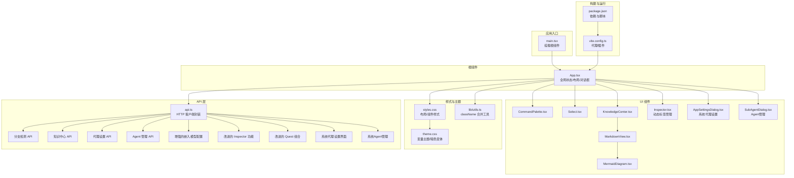

**图表来源**
- [apps/web/src/main.tsx:1-13](file://apps/web/src/main.tsx#L1-L13)
- [apps/web/src/App.tsx:1-3574](file://apps/web/src/App.tsx#L1-L3574)
- [apps/web/src/components/CommandPalette.tsx:1-101](file://apps/web/src/components/CommandPalette.tsx#L1-L101)
- [apps/web/src/components/Select.tsx:1-69](file://apps/web/src/components/Select.tsx#L1-L69)
- [apps/web/src/components/KnowledgeCenter.tsx:1-428](file://apps/web/src/components/KnowledgeCenter.tsx#L1-L428)
- [apps/web/src/components/MarkdownView.tsx:1-29](file://apps/web/src/components/MarkdownView.tsx#L1-L29)
- [apps/web/src/components/MermaidDiagram.tsx:1-47](file://apps/web/src/components/MermaidDiagram.tsx#L1-L47)
- [apps/web/src/styles.css:1-3343](file://apps/web/src/styles.css#L1-L3343)
- [apps/web/src/theme.css:1-176](file://apps/web/src/theme.css#L1-L176)
- [apps/web/src/lib/utils.ts:1-8](file://apps/web/src/lib/utils.ts#L1-L8)
- [apps/web/package.json:1-37](file://apps/web/package.json#L1-L37)
- [apps/web/vite.config.ts:1-16](file://apps/web/vite.config.ts#L1-L16)

**章节来源**
- [apps/web/src/main.tsx:1-13](file://apps/web/src/main.tsx#L1-L13)
- [apps/web/src/App.tsx:1-3574](file://apps/web/src/App.tsx#L1-L3574)
- [apps/web/src/styles.css:1-800](file://apps/web/src/styles.css#L1-L800)
- [apps/web/src/theme.css:1-176](file://apps/web/src/theme.css#L1-L176)
- [apps/web/package.json:1-37](file://apps/web/package.json#L1-L37)
- [apps/web/vite.config.ts:1-16](file://apps/web/vite.config.ts#L1-L16)

## 核心组件
- 根组件 App：集中管理全局状态（工作区、请求、变更文件、列宽、主题、错误信息等），协调侧边栏、工作台与检查器三大区域，并承载多个对话框（创建工作区、应用设置、工作区配置、知识中心）。
- 命令面板 CommandPalette：基于 cmdk 的全局命令入口，支持新建请求、切换工作区、打开设置、知识中心与主题切换。
- 下拉选择 Select：基于 @radix-ui/react-select 的主题化选择器，支持内联紧凑风格与图标前缀，用于设置与表单场景。
- Inspector：全新的动态标签管理系统，根据内容可用性自动显示和隐藏标签页，提供智能化的Inspector界面。
- 知识中心 KnowledgeCenter：全新的三列布局知识管理组件，支持Repo Wiki浏览、记忆管理、Markdown渲染和Mermaid图表可视化，提供完整的知识中心体验。
- 应用设置对话框 AppSettingsDialog：新增系统代理设置界面，支持用户代理和系统代理的分离管理，以及系统Agent的ModelKit选择功能。

**章节来源**
- [apps/web/src/App.tsx:84-659](file://apps/web/src/App.tsx#L84-L659)
- [apps/web/src/components/CommandPalette.tsx:6-101](file://apps/web/src/components/CommandPalette.tsx#L6-L101)
- [apps/web/src/components/Select.tsx:17-69](file://apps/web/src/components/Select.tsx#L17-L69)
- [apps/web/src/App.tsx:1188-1300](file://apps/web/src/App.tsx#L1188-L1300)
- [apps/web/src/components/KnowledgeCenter.tsx:27-37](file://apps/web/src/components/KnowledgeCenter.tsx#L27-L37)
- [apps/web/src/App.tsx:1786-2850](file://apps/web/src/App.tsx#L1786-L2850)

## 架构总览
前端采用"根组件集中状态 + 组件分治"的架构：
- 状态管理：以 React 本地状态为主，结合 localStorage 进行 UI 偏好持久化；未发现第三方状态库（如 Zustand）的直接使用痕迹。
- 数据流：根组件通过 api.ts 封装的函数发起异步请求，更新本地状态并驱动 UI。
- 主题与样式：通过 CSS 变量与 data-theme 属性驱动明/暗主题切换，Tailwind 提供实用工具类。
- 交互与键盘：支持快捷键打开命令面板，支持拖拽调整侧边栏与检查器宽度。

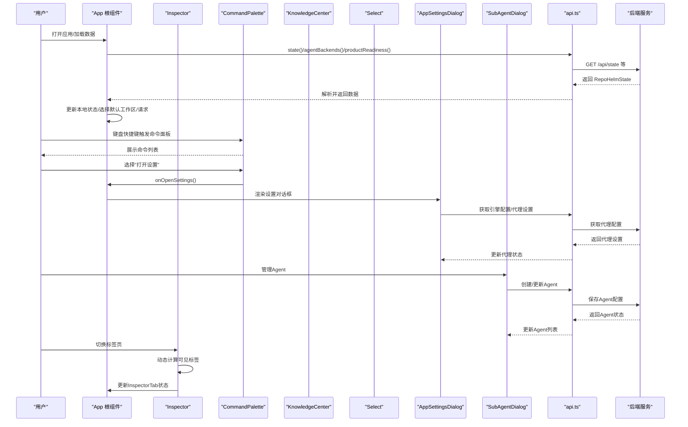

**图表来源**
- [apps/web/src/App.tsx:136-148](file://apps/web/src/App.tsx#L136-L148)
- [apps/web/src/App.tsx:217-247](file://apps/web/src/App.tsx#L217-L247)
- [apps/web/src/components/CommandPalette.tsx:29-50](file://apps/web/src/components/CommandPalette.tsx#L29-L50)
- [apps/web/src/api.ts:487-492](file://apps/web/src/api.ts#L487-L492)
- [apps/web/src/App.tsx:717-723](file://apps/web/src/App.tsx#L717-L723)

**章节来源**
- [apps/web/src/App.tsx:136-247](file://apps/web/src/App.tsx#L136-L247)
- [apps/web/src/api.ts:434-663](file://apps/web/src/api.ts#L434-L663)

## 详细组件分析

### 根组件 App 分析
- 全局状态与副作用
  - 初始化加载：并发获取状态、可用智能体后端与产品就绪度，设置默认选中工作区与请求。
  - 主题持久化：通过 data-theme 属性与 localStorage 同步主题偏好。
  - 列宽持久化：通过 localStorage 保存侧边栏与检查器宽度，避免每次刷新重置。
  - 快捷键：Cmd/Ctrl+K 打开命令面板。
  - 知识中心状态：新增 knowledgeOpen 状态管理知识中心的显示与隐藏。
  - Inspector标签状态：新增 inspectorTab 状态管理Inspector的当前标签页。
- 计算派生数据：根据当前选中的工作区与请求，计算项目列表、事件、变更文件、选中文件等。
- 动作处理：创建请求、交付请求、接受/拒绝能力、工作区与项目管理、打开项目目录、检查项目健康等。
- 对话框编排：创建工作区、应用设置、工作区配置、知识中心等弹窗。

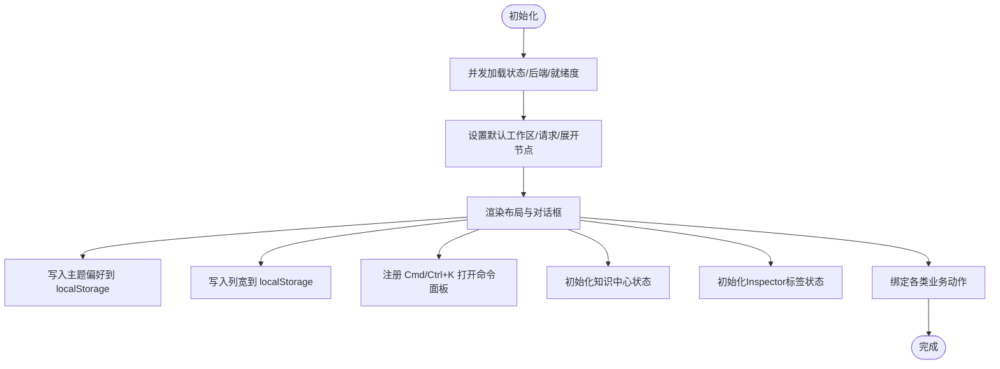

**图表来源**
- [apps/web/src/App.tsx:136-176](file://apps/web/src/App.tsx#L136-L176)
- [apps/web/src/App.tsx:154-156](file://apps/web/src/App.tsx#L154-L156)
- [apps/web/src/App.tsx:159-165](file://apps/web/src/App.tsx#L159-L165)
- [apps/web/src/App.tsx:110-112](file://apps/web/src/App.tsx#L110-L112)
- [apps/web/src/App.tsx:105](file://apps/web/src/App.tsx#L105)

**章节来源**
- [apps/web/src/App.tsx:84-659](file://apps/web/src/App.tsx#L84-L659)

### 命令面板 CommandPalette 分析
- 功能要点
  - 基于 cmdk 的输入过滤与命令列表展示。
  - 支持的操作：新建请求、创建工作区、打开设置、打开知识中心、切换主题。
  - 支持工作区切换列表，按名称排序。
  - ESC 关闭，点击遮罩层关闭。
- 可访问性
  - 使用 role、aria-label、aria-describedby 等语义化属性。
  - 自动聚焦输入框，便于键盘操作。
- 事件与回调
  - onNewRequest、onCreateWorkspace、onOpenSettings、onOpenKnowledge、onToggleTheme、onSelectWorkspace、onClose。

**图表来源**
- [apps/web/src/components/CommandPalette.tsx:29-50](file://apps/web/src/components/CommandPalette.tsx#L29-L50)
- [apps/web/src/components/CommandPalette.tsx:51-99](file://apps/web/src/components/CommandPalette.tsx#L51-L99)

**章节来源**
- [apps/web/src/components/CommandPalette.tsx:6-101](file://apps/web/src/components/CommandPalette.tsx#L6-L101)

### 下拉选择 Select 分析
- 设计与实现
  - 基于 @radix-ui/react-select，提供触发器与下拉内容，支持图标前缀与内联紧凑风格。
  - 通过 cn 工具合并类名，确保与主题一致。
- 属性与行为
  - value/onValueChange：受控值与变更回调。
  - options：选项数组，包含 value 与 label。
  - ariaLabel/placeholder/disabled/variant/leadingIcon/triggerClassName/contenClassName：可定制化。
- 适用场景
  - 设置页的模型选择、分支选择、工作区切换等。

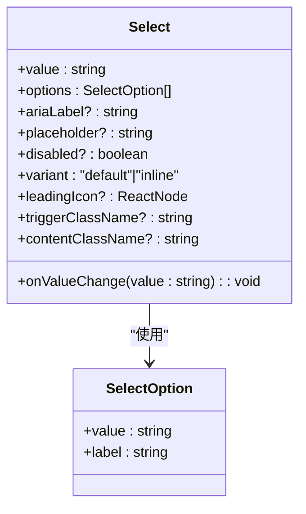

**图表来源**
- [apps/web/src/components/Select.tsx:17-69](file://apps/web/src/components/Select.tsx#L17-L69)

**章节来源**
- [apps/web/src/components/Select.tsx:17-69](file://apps/web/src/components/Select.tsx#L17-L69)
- [apps/web/src/lib/utils.ts:4-7](file://apps/web/src/lib/utils.ts#L4-L7)

### Inspector组件分析
- 功能特性
  - 动态标签管理：根据内容可用性自动显示和隐藏标签页，包括概要、Spec、Plan、能力、文件和Diff。
  - 自动标签选择：当当前标签页无内容时，自动选择第一个可见标签页。
  - 内容条件渲染：仅渲染包含有效内容的标签页，避免空标签页显示。
  - 智能标签计算：通过 hasSpec、hasPlan、hasCapabilities、hasFiles、hasDiff 等标志判断标签页可用性。
- 状态管理
  - inspectorTab：当前激活的Inspector标签页，类型为 InspectorTab。
  - hasSpec/hasPlan/hasCapabilities/hasFiles/hasDiff：各标签页内容可用性标志。
  - visibleTabs：根据内容可用性动态计算的可见标签页列表。
- 用户交互
  - 标签页切换：点击标签按钮切换到相应的内容面板。
  - 自动导航：当标签页内容变化时自动选择合适的标签页。
  - 响应式设计：支持水平滚动的标签页容器，适应不同屏幕尺寸。

**更新** Inspector组件已完全从静态标签系统迁移到动态标签管理系统。新的实现通过计算各标签页的内容可用性来决定显示哪些标签，实现了真正的智能化界面管理。

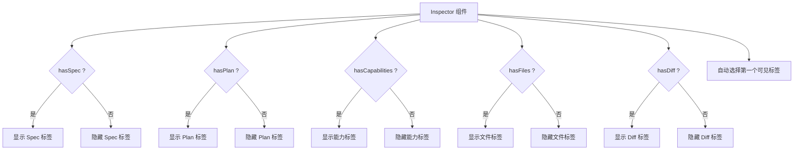

**图表来源**
- [apps/web/src/App.tsx:1221-1258](file://apps/web/src/App.tsx#L1221-L1258)
- [apps/web/src/App.tsx:1229-1255](file://apps/web/src/App.tsx#L1229-L1255)

**章节来源**
- [apps/web/src/App.tsx:1188-1300](file://apps/web/src/App.tsx#L1188-L1300)
- [apps/web/src/App.tsx:84](file://apps/web/src/App.tsx#L84)

### API 集成层分析
- 请求封装
  - request 函数统一封装 fetch，自动设置 Content-Type 并解析 JSON，非 OK 状态抛出错误。
- 接口清单（节选）
  - 状态与元数据：state、agentBackends、listClis、rescanClis、testCli、listProviders、listProviderModels、testProvider、getEngine、updateEngine、capabilities、securityPolicy、auditLog、productReadiness、searchKnowledge。
  - 工作区与项目：createWorkspace、updateWorkspace、createProject、linkProject、unlinkProject、updateProject、removeProject、openProjectDirectory、pickDirectory、listBranches、checkProject。
  - 请求生命周期：createQuest、runQuest、retryQuest、cleanupQuest、deliverQuest、acceptCapability、dismissCapability、approvePlan、rejectPlan。
  - ModelKit 管理：listModelKits、createModelKit、updateModelKit、deleteModelKit、testAndSaveModelKit。
  - 子代理管理：listSubAgents、createSubAgent、updateSubAgent、deleteSubAgent、setEntrySubAgent、getEntrySubAgent。
  - 知识中心：searchKnowledge、getProjectKnowledge、syncProjectKnowledge、setKnowledgeBranch、enhanceRequirement。
  - 分支检测：listBranches（新增）。
  - 代理设置：getEngine、updateEngine（新增）。
- 错误处理
  - 非 OK 响应时读取错误消息并抛出，调用方负责捕获与展示。

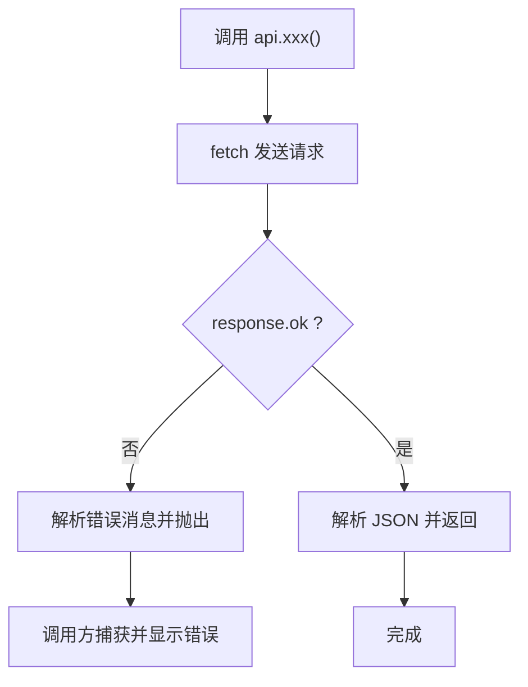

**图表来源**
- [apps/web/src/api.ts:434-447](file://apps/web/src/api.ts#L434-L447)
- [apps/web/src/api.ts:487-663](file://apps/web/src/api.ts#L487-L663)

**章节来源**
- [apps/web/src/api.ts:1-663](file://apps/web/src/api.ts#L1-L663)

### 布局与对话框编排
- 布局网格
  - 三列布局：侧边栏、分隔条、工作台、分隔条、检查器，列宽通过 CSS 变量控制并支持拖拽调整。
  - 知识中心采用特殊的三列布局（gridColumn: "3 / 6"），作为工作台的补充面板。
  - Inspector采用独立的检查器区域，宽度可调节。
- 对话框
  - 工作区创建、应用设置、工作区配置、知识中心等，均以条件渲染方式呈现，使用 backdrop 与 role 语义化结构。
- 交互细节
  - 拖拽分隔条：记录初始指针位置与列宽，计算 delta 并限制最小/最大范围，实时更新 CSS 变量。
  - 键盘快捷键：Cmd/Ctrl+K 打开命令面板。

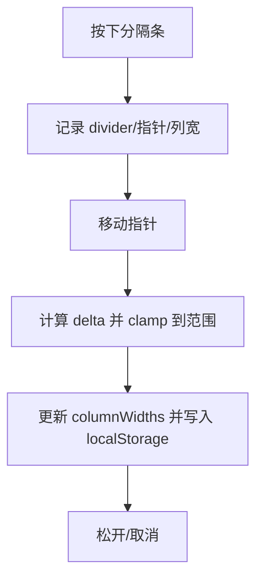

**图表来源**
- [apps/web/src/App.tsx:382-415](file://apps/web/src/App.tsx#L382-L415)
- [apps/web/src/App.tsx:154-156](file://apps/web/src/App.tsx#L154-L156)

**章节来源**
- [apps/web/src/App.tsx:484-578](file://apps/web/src/App.tsx#L484-L578)
- [apps/web/src/App.tsx:382-415](file://apps/web/src/App.tsx#L382-L415)

## Inspector组件

### 动态标签管理系统
- 标签页定义
  - 概要（overview）：始终可见，显示任务进度、后端状态、工作树和验证摘要。
  - Spec（spec）：当存在任务规范时显示，展示用户目标、功能需求、验收标准等。
  - Plan（plan）：当存在计划审批时显示，展示编排计划的摘要和步骤。
  - 能力（capabilities）：当有可用能力时显示，展示Agent能力列表和接受/拒绝操作。
  - 文件（files）：当有变更文件时显示，按项目展示变更文件列表。
  - Diff（diff）：当有选中文件时显示，展示文件差异详情。
- 可见性计算
  - 通过 hasSpec、hasPlan、hasCapabilities、hasFiles、hasDiff 等标志判断标签页是否应该显示。
  - 每个标签页都有对应的条件检查，确保只有包含有效内容时才显示。
- 自动标签选择
  - 当当前标签页内容不存在时，自动选择第一个可见标签页。
  - 确保用户始终能看到有效的内容，避免空标签页的出现。

### 内容面板实现
- 概要面板（OverviewPanel）
  - 显示任务进度状态、后端完成情况、工作树创建状态和验证摘要。
  - 提供进度条和状态徽章，直观展示任务执行情况。
- Spec面板（SpecPanel）
  - 展示用户目标、功能需求、非功能需求、验收标准和不在范围内的内容。
  - 使用规范化的区块布局，清晰分离不同类型的需求。
- Plan面板（PlanPanel）
  - 动态加载编排计划，支持计划审批和拒绝操作。
  - 显示计划摘要和详细步骤，包括Agent名称和依赖关系。
- 能力面板（CapabilitiesPanel）
  - 展示可用的Agent能力列表，支持接受和拒绝操作。
  - 提供能力描述和执行Agent信息。
- 文件面板（FilesPanel）
  - 按项目分组显示变更文件，支持文件选择和查看详情。
  - 提供文件路径、修改类型和项目关联信息。
- Diff面板（DiffPanel）
  - 展示选中文件的详细差异，支持代码高亮和格式化显示。
  - 提供文件元信息和差异审查功能。

### 样式与交互
- 标签页样式
  - 使用 CSS 变量实现主题化设计，支持亮色和暗色主题。
  - 悬停效果和激活状态的视觉反馈。
- 内容区域
  - 采用卡片式布局，统一的边距和圆角设计。
  - 支持滚动和响应式布局，适应不同内容长度。
- 动画效果
  - 使用 CSS 过渡效果，提供平滑的标签页切换体验。

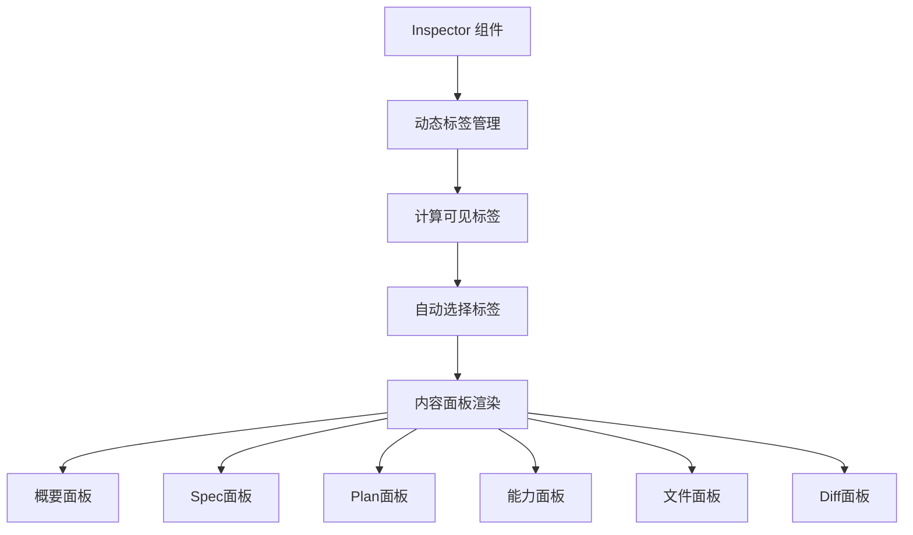

**图表来源**
- [apps/web/src/App.tsx:1188-1300](file://apps/web/src/App.tsx#L1188-L1300)
- [apps/web/src/App.tsx:1229-1255](file://apps/web/src/App.tsx#L1229-L1255)
- [apps/web/src/styles.css:1460-1659](file://apps/web/src/styles.css#L1460-L1659)

**章节来源**
- [apps/web/src/App.tsx:1188-1300](file://apps/web/src/App.tsx#L1188-L1300)
- [apps/web/src/App.tsx:1302-1387](file://apps/web/src/App.tsx#L1302-L1387)
- [apps/web/src/styles.css:1460-1659](file://apps/web/src/styles.css#L1460-L1659)

## 分支自动检测功能

### 功能概述
- 自动分支检测：在项目配置过程中自动检测Git仓库的可用分支，智能设置默认分支。
- 智能默认分支：优先选择 "main"，其次选择 "master"，最后使用当前分支或第一个分支。
- 实时分支列表：提供完整的分支列表和当前分支状态信息。
- 配置更新：自动更新项目配置中的默认分支设置。

### 技术实现
- 前端实现
  - 使用 useEffect 监听项目路径变化，自动触发分支检测。
  - 调用 api.listBranches() 获取分支信息，包括分支列表、默认分支和当前分支。
  - 检测到当前分支与默认分支不一致时，自动更新默认分支设置。
- 后端实现
  - packages/core/src/git.ts 提供 Git 操作功能，包括分支列表获取和当前分支检测。
  - packages/core/src/service.ts 实现分支检测服务，处理分支信息的获取和验证。
  - apps/server/src/index.ts 提供 REST API 接口，支持分支列表查询。

### 分支检测算法
- 优先级规则
  1. 首先检查是否存在 "main" 分支
  2. 如果不存在 "main"，检查是否存在 "master" 分支
  3. 如果都不存在，使用当前分支作为默认分支
  4. 如果仍然不可用，使用第一个分支或回退到 "main"
- 检测流程
  - 获取仓库根目录
  - 执行 git branch 命令获取所有分支
  - 解析当前分支信息
  - 应用优先级规则确定默认分支
  - 返回完整的分支信息对象

### 用户体验
- 无缝集成：分支检测在用户输入项目路径时自动进行，无需额外操作。
- 实时反馈：显示当前分支状态和检测到的默认分支信息。
- 智能建议：当检测到分支不匹配时，自动建议更新默认分支设置。
- 错误处理：分支检测失败时提供友好的错误提示和回退机制。

### API 集成
- 前端 API 调用
  - ProjectFields 组件中实现分支检测逻辑
  - 使用 useState 管理当前分支状态
  - 通过 api.listBranches() 获取分支信息
- 后端 API 接口
  - GET /api/projects/:id/branches - 获取项目分支信息
  - 支持分支列表、默认分支和当前分支的查询
  - 错误状态码：404（项目不存在）、400（Git仓库不可用）

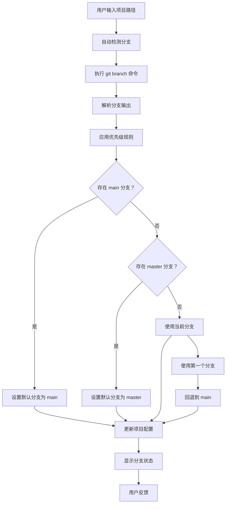

**图表来源**
- [apps/web/src/App.tsx:2994-3019](file://apps/web/src/App.tsx#L2994-L3019)
- [packages/core/src/git.ts:79-93](file://packages/core/src/git.ts#L79-L93)
- [packages/core/src/service.ts:601-603](file://packages/core/src/service.ts#L601-L603)
- [apps/server/src/index.ts:342-345](file://apps/server/src/index.ts#L342-L345)

**章节来源**
- [apps/web/src/App.tsx:2994-3019](file://apps/web/src/App.tsx#L2994-L3019)
- [packages/core/src/git.ts:79-93](file://packages/core/src/git.ts#L79-L93)
- [packages/core/src/service.ts:601-603](file://packages/core/src/service.ts#L601-L603)
- [apps/server/src/index.ts:342-345](file://apps/server/src/index.ts#L342-L345)

## 知识中心组件

### 组件架构与状态管理
- 状态管理
  - activeTab：当前激活的标签页（wiki/memory），初始化为 "wiki"。
  - query：搜索查询字符串，支持Repo Wiki和记忆的实时搜索。
  - expandedIds：展开的项目ID数组，用于控制项目树的展开状态。
  - views：项目知识库视图缓存，存储已加载的项目视图数据。
  - loadingIds：加载中的项目ID数组，防止重复加载。
  - selectedProjectId：当前选中的项目ID，初始化为第一个项目。
  - selectedSlug：当前选中的Repo Wiki页面slug，初始化为null。
  - mode：内容显示模式（preview/code），初始化为 "preview"。
  - syncing：知识库同步状态，用于显示同步过程中的状态。
  - selectedMemoryId：当前选中的记忆条目ID，初始化为第一个记忆条目。
- 生命周期
  - 组件挂载时自动加载选中项目的知识库视图。
  - 当项目ID变化时重新加载对应的视图数据。
  - 支持手动触发知识库同步操作。

### 项目过滤逻辑变更
- 旧版逻辑（已移除）
  - 项目过滤：`state?.projects.filter((project) => workspace?.projectIds.includes(project.id))`
  - 限制：仅显示当前工作区关联的项目
  - 影响：用户无法跨工作区访问其他项目的知识库
- 新版逻辑（已实施）
  - 项目过滤：`state?.projects`
  - 限制：移除工作区过滤，显示所有注册项目的知识库
  - 影响：用户可以跨工作区访问任何已注册项目的知识库
- 传递方式
  - 知识中心接收：`projects={state?.projects ?? []}`
  - 项目选择：`projects.map((p) => (<option key={p.id} value={p.id}>{p.name}</option>))`

### Repo Wiki浏览功能
- 页面结构
  - 标准页面类型：概览（overview）、架构（architecture）、模块（modules）、关键流程（key-flows）、约定（conventions）、决策（decisions）。
  - 页面标题和内容：每个页面包含标题和Markdown内容。
  - 页面排序：按照固定顺序（SLUG_ORDER）排列页面。
- 导航交互
  - 项目树展开：点击项目行展开/收起项目下的页面列表。
  - 页面选择：点击页面行选择对应的Repo Wiki页面。
  - 加载状态：显示加载中的占位符，避免空白界面。
  - 空状态：当项目没有知识库内容时显示友好的提示信息。

### 记忆管理功能
- 记忆条目
  - 标题和摘要：每个记忆条目包含标题和内容摘要。
  - 时间戳：显示记忆条目的更新时间。
  - 标签系统：支持为记忆条目添加标签进行分类。
- 搜索过滤
  - 实时搜索：根据标题和内容关键字过滤记忆条目。
  - 高亮显示：搜索结果按关键字高亮显示。
- 选择交互
  - 记忆条目选择：点击记忆条目进行查看和编辑。
  - 激活状态：当前选中的记忆条目显示激活样式。

### 内容显示模式
- 预览模式（preview）
  - Markdown渲染：使用MarkdownView组件进行富文本渲染。
  - GFM支持：支持GitHub Flavored Markdown语法。
  - Mermaid图表：自动识别并渲染Mermaid代码块。
  - 样式保持：保持Markdown的原始样式和格式。
- 源码模式（code）
  - 代码显示：以等宽字体显示原始Markdown代码。
  - 语法高亮：支持代码语法高亮显示。
  - 滚动适配：支持长代码内容的滚动查看。

### 同步操作与错误处理
- 同步逻辑
  - 根据当前知识库状态显示不同的同步按钮文本。
  - 支持手动触发同步操作，处理同步过程中的各种状态。
  - 同步完成后自动更新视图状态和内容。
- 错误处理
  - 网络请求失败时显示错误信息。
  - 提供重试机制，允许用户重新尝试同步操作。
  - 空状态时提供友好的提示信息。

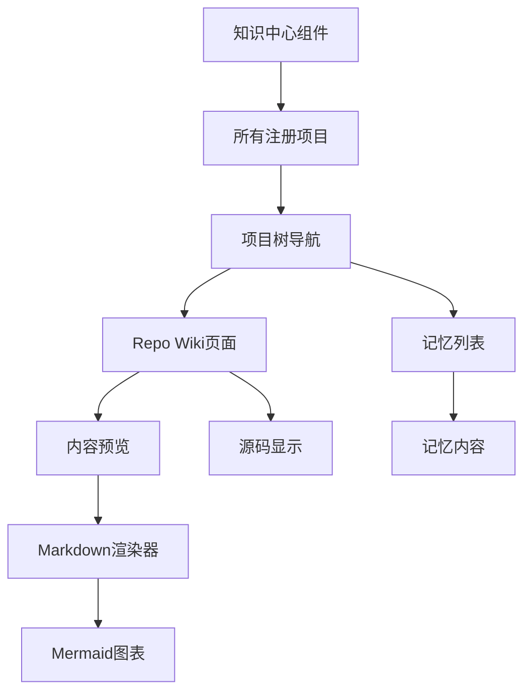

**图表来源**
- [apps/web/src/components/KnowledgeCenter.tsx:161-214](file://apps/web/src/components/KnowledgeCenter.tsx#L161-L214)
- [apps/web/src/components/KnowledgeCenter.tsx:215-231](file://apps/web/src/components/KnowledgeCenter.tsx#L215-L231)
- [apps/web/src/components/KnowledgeCenter.tsx:294-308](file://apps/web/src/components/KnowledgeCenter.tsx#L294-L308)
- [apps/web/src/components/KnowledgeCenter.tsx:309-333](file://apps/web/src/components/KnowledgeCenter.tsx#L309-L333)

**章节来源**
- [apps/web/src/components/KnowledgeCenter.tsx:27-37](file://apps/web/src/components/KnowledgeCenter.tsx#L27-L37)
- [apps/web/src/components/KnowledgeCenter.tsx:49-102](file://apps/web/src/components/KnowledgeCenter.tsx#L49-L102)
- [apps/web/src/components/KnowledgeCenter.tsx:114-123](file://apps/web/src/components/KnowledgeCenter.tsx#L114-L123)

## Markdown渲染与Mermaid图表

### Markdown渲染器设计
- 组件架构
  - MarkdownView组件：基于react-markdown实现的Markdown渲染器。
  - GFM支持：通过remark-gfm插件支持GitHub Flavored Markdown语法。
  - 自定义组件：支持代码块的自定义渲染逻辑。
- 渲染特性
  - 标题层级：支持h1-h3标题，保持适当的间距和样式。
  - 列表格式：支持有序和无序列表，正确的缩进和间距。
  - 代码块：支持行内代码和代码块，保持原始格式。
  - 表格支持：支持Markdown表格语法。
  - 链接样式：支持Markdown链接语法，保持一致的样式。

### Mermaid图表集成
- 图表组件
  - MermaidDiagram组件：基于mermaid库的图表渲染组件。
  - 主题支持：根据当前主题（light/dark）自动切换图表主题。
  - 错误处理：提供图表渲染失败的降级处理。
- 图表类型
  - 流程图：支持基本的流程图语法。
  - 序列图：支持交互序列图。
  - 类图：支持类关系图。
  - 状态图：支持状态转换图。
  - 图表验证：自动检测和报告图表语法错误。

### 代码块处理逻辑
- Mermaid识别
  - 语言标识：通过language-mermaid类名识别Mermaid代码块。
  - 自动渲染：识别到Mermaid代码块时自动渲染为图表。
  - 错误降级：渲染失败时显示错误信息和原始代码。
- 主题适配
  - 暗色主题：Mermaid图表自动适配暗色主题。
  - 亮色主题：Mermaid图表自动适配亮色主题。
  - 样式继承：图表样式继承自Markdown容器的样式。

### 性能优化
- 懒加载：Mermaid图表按需渲染，避免不必要的计算。
- 缓存机制：图表渲染结果缓存，提高重复访问性能。
- 错误隔离：图表渲染错误不影响整个页面的渲染。
- 主题切换：主题切换时自动重新渲染受影响的图表。

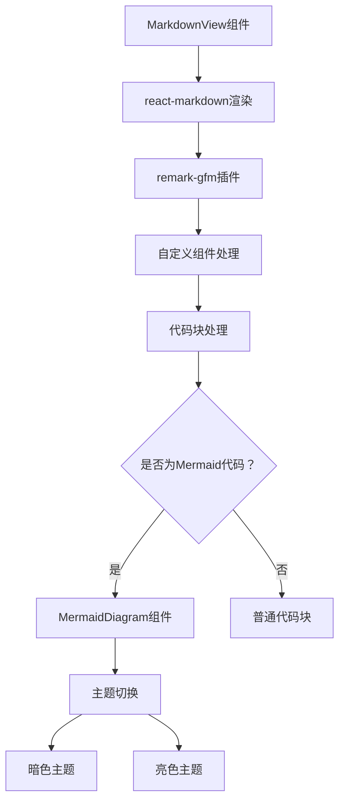

**图表来源**
- [apps/web/src/components/MarkdownView.tsx:5-28](file://apps/web/src/components/MarkdownView.tsx#L5-L28)
- [apps/web/src/components/MermaidDiagram.tsx:6-35](file://apps/web/src/components/MermaidDiagram.tsx#L6-L35)

**章节来源**
- [apps/web/src/components/MarkdownView.tsx:5-28](file://apps/web/src/components/MarkdownView.tsx#L5-L28)
- [apps/web/src/components/MermaidDiagram.tsx:6-35](file://apps/web/src/components/MermaidDiagram.tsx#L6-L35)

## 嵌入模型配置选项

### 配置字段与功能
- 配置字段
  - embeddingModelKitId：嵌入模型的 ModelKit ID，用于向量检索。
  - 支持的模型类型：仅支持 BYOK 类型的嵌入模型。
  - 未配置时的行为：知识库使用关键词检索而非向量检索。
- 选择逻辑
  - 仅显示类型为 BYOK 的 ModelKit 供选择。
  - 默认选项为空，表示禁用嵌入模型。
  - 选择后立即更新引擎配置。

### 配置界面设计
- 布局结构
  - 独立的配置字段区域，位于模型管理界面中。
  - 标签显示"Embedding 模型（向量检索）"。
  - 提供详细的使用说明和提示信息。
- 用户体验
  - 下拉选择器提供清晰的模型列表。
  - 提示信息说明未配置时的检索方式。
  - 实时更新配置，无需额外保存操作。

### 技术实现细节
- 数据绑定
  - 使用受控组件模式，value 和 onChange 事件处理。
  - 与引擎配置的 patchEngine 函数集成。
- 过滤逻辑
  - 仅过滤类型为 "byok" 的 ModelKit。
  - 提供默认选项和模型名称回退机制。
- 错误处理
  - 空列表时显示友好提示。
  - 配置更新失败时提供错误反馈。

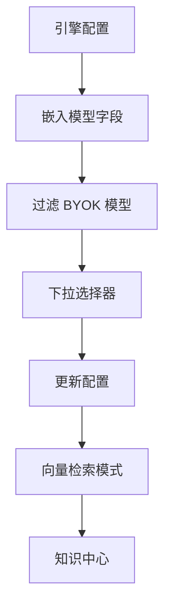

**图表来源**
- [apps/web/src/App.tsx:2481-2495](file://apps/web/src/App.tsx#L2481-L2495)
- [apps/web/src/App.tsx:2484-2492](file://apps/web/src/App.tsx#L2484-L2492)

**章节来源**
- [apps/web/src/App.tsx:2481-2495](file://apps/web/src/App.tsx#L2481-L2495)
- [apps/web/src/api.ts:312-321](file://apps/web/src/api.ts#L312-L321)

## 改进的 Quest 组合功能

### 组合功能增强
- 动态组合
  - 支持在同一工作区内组合多个 Quest，形成复合任务。
  - 每个 Quest 可以独立管理，同时共享工作区资源。
  - 提供组合状态的可视化展示，便于用户理解任务关系。
- 依赖管理
  - 支持 Quest 间的依赖关系定义和管理。
  - 自动检测和解决依赖冲突。
  - 提供依赖图谱的可视化展示。

### 工作区配置改进
- 配置界面优化
  - 提供更直观的项目管理界面。
  - 支持批量操作和快速配置。
  - 增强配置验证和错误提示。
- 资源管理
  - 支持工作区级别的资源分配和监控。
  - 提供资源使用情况的实时统计。
  - 支持资源限制和配额管理。

### 用户体验提升
- 操作简化
  - 提供一键式配置和部署功能。
  - 支持配置模板和快速复制。
  - 增强撤销和重做功能。
- 可视化增强
  - 提供更丰富的图表和仪表板。
  - 支持自定义视图和布局。
  - 增强响应式设计，适配多种设备。

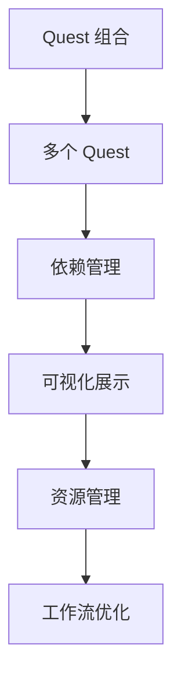

**图表来源**
- [apps/web/src/App.tsx:2538-2635](file://apps/web/src/App.tsx#L2538-L2635)
- [apps/web/src/App.tsx:2556-2631](file://apps/web/src/App.tsx#L2556-L2631)

**章节来源**
- [apps/web/src/App.tsx:2538-2635](file://apps/web/src/App.tsx#L2538-L2635)
- [apps/web/src/App.tsx:2556-2631](file://apps/web/src/App.tsx#L2556-L2631)

## 增强的工作区配置

### 配置界面重构
- 界面布局
  - 采用卡片式布局，提供更好的视觉层次。
  - 支持分组显示和折叠展开功能。
  - 增强响应式设计，适配不同屏幕尺寸。
- 功能增强
  - 提供配置模板和快速设置选项。
  - 增强配置验证和实时反馈。
  - 支持配置导入导出功能。

### 项目管理优化
- 项目关联
  - 支持多项目关联和管理。
  - 提供项目依赖关系的可视化展示。
  - 增强项目健康检查和状态监控。
- 目录管理
  - 支持工作树（worktree）的创建和管理。
  - 提供目录结构的可视化展示。
  - 增强目录权限和访问控制。

### 配置同步与备份
- 同步机制
  - 支持配置的自动同步和版本管理。
  - 提供配置差异对比和合并功能。
  - 增强配置冲突检测和解决。
- 备份恢复
  - 支持配置的定期备份和自动恢复。
  - 提供配置历史版本的查看和比较。
  - 增强配置迁移和升级功能。

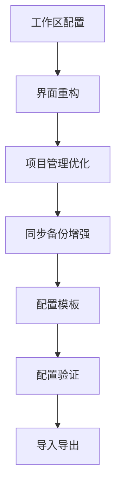

**图表来源**
- [apps/web/src/App.tsx:706-716](file://apps/web/src/App.tsx#L706-L716)
- [apps/web/src/App.tsx:417-431](file://apps/web/src/App.tsx#L417-L431)

**章节来源**
- [apps/web/src/App.tsx:706-716](file://apps/web/src/App.tsx#L706-L716)
- [apps/web/src/App.tsx:417-431](file://apps/web/src/App.tsx#L417-L431)

## 系统代理设置界面

### 系统代理设置概述
- 用户代理与系统代理分离：新增系统代理设置界面，将用户代理和系统代理的配置完全分离，提供更精细的代理管理。
- 系统Agent管理：支持系统自带Agent的ModelKit选择和配置，包括知识库、用户习惯和失败经验管理Agent。
- 动态标签管理：系统代理设置界面采用动态标签管理系统，根据内容可用性自动显示和隐藏相关配置标签。

### 系统Agent配置界面
- 用户Agent列表：显示所有用户创建的Agent，支持创建、编辑、删除和设为入口Agent操作。
- 系统Agent列表：显示系统自带的Agent，包括知识库Agent、用户习惯Agent和失败经验Agent，支持ModelKit切换。
- Agent详情：显示Agent的基本信息、绑定的ModelKit、权限配置和使用统计。

### ModelKit选择功能
- 系统Agent ModelKit绑定：允许为每个系统Agent单独选择ModelKit，实现精细化的模型配置。
- ModelKit类型支持：支持CLI和BYOK类型的ModelKit绑定到系统Agent。
- 实时切换：系统Agent的ModelKit可以在设置界面中实时切换，无需重启服务。

### 系统代理设置状态管理
- 状态分离：用户代理和系统代理的状态完全分离，互不影响。
- 配置持久化：系统代理设置通过引擎配置进行持久化存储。
- 实时更新：系统代理设置变更后立即生效，无需重启应用。

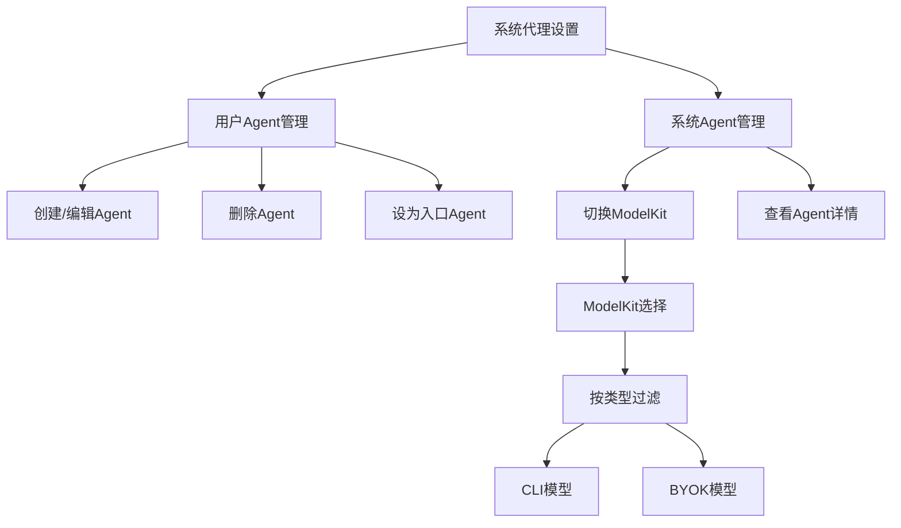

**图表来源**
- [apps/web/src/App.tsx:2549-2732](file://apps/web/src/App.tsx#L2549-L2732)
- [apps/web/src/App.tsx:2653-2727](file://apps/web/src/App.tsx#L2653-L2727)
- [apps/web/src/App.tsx:2677-2694](file://apps/web/src/App.tsx#L2677-L2694)

**章节来源**
- [apps/web/src/App.tsx:2549-2732](file://apps/web/src/App.tsx#L2549-L2732)
- [apps/web/src/App.tsx:2653-2727](file://apps/web/src/App.tsx#L2653-L2727)
- [apps/web/src/App.tsx:2677-2694](file://apps/web/src/App.tsx#L2677-L2694)

## 代理设置状态管理

### 状态分离设计
- 用户代理状态：独立的用户代理配置状态，包括API Key、Base URL、模型选择等。
- 系统代理状态：独立的系统代理配置状态，包括系统Agent的ModelKit绑定和权限配置。
- 引擎配置集成：用户代理和系统代理状态最终都通过引擎配置进行统一管理。

### 状态更新机制
- 实时更新：代理设置变更后立即更新引擎配置，无需手动保存。
- 状态同步：用户界面状态与引擎配置状态保持实时同步。
- 错误处理：代理设置失败时提供详细的错误信息和回滚机制。

### 数据流管理
- 设置对话框状态：AppSettingsDialog管理所有代理设置相关的状态。
- 引擎配置更新：通过patchEngine函数更新引擎配置。
- API调用封装：统一的API调用封装，支持代理设置的增删改查操作。

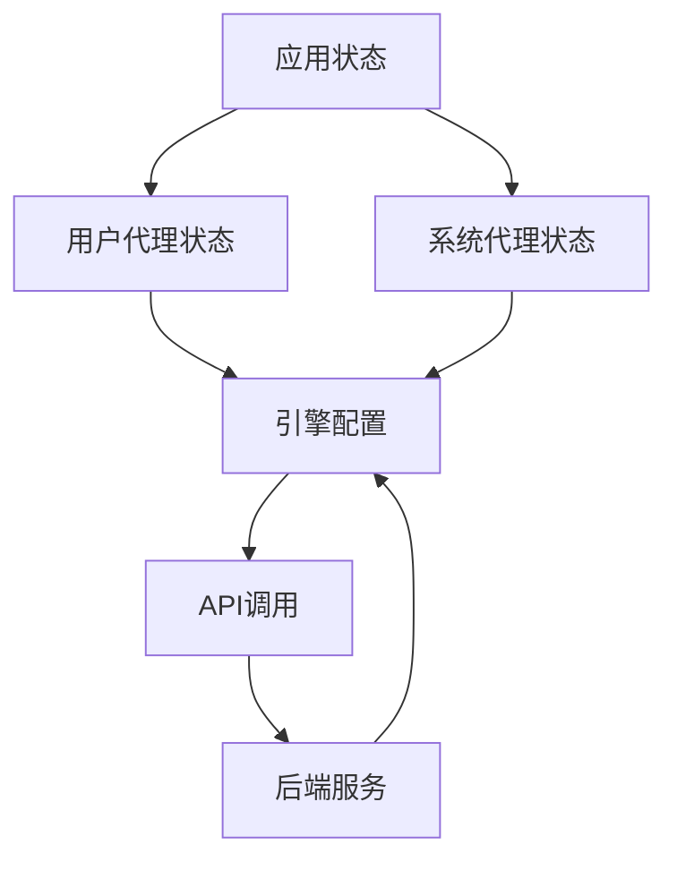

**图表来源**
- [apps/web/src/App.tsx:1813-1912](file://apps/web/src/App.tsx#L1813-L1912)
- [apps/web/src/App.tsx:1914-1922](file://apps/web/src/App.tsx#L1914-L1922)

**章节来源**
- [apps/web/src/App.tsx:1813-1912](file://apps/web/src/App.tsx#L1813-L1912)
- [apps/web/src/App.tsx:1914-1922](file://apps/web/src/App.tsx#L1914-L1922)

## 系统Agent管理

### Agent类型区分
- 用户Agent：用户创建和管理的Agent，支持完整的生命周期管理。
- 系统Agent：系统自带的Agent，包括知识库Agent、用户习惯Agent和失败经验Agent，只读不可删除。
- Agent模式：支持entry（入口）和worker（工作节点）两种模式。

### Agent配置管理
- 基本信息：Agent名称、角色描述、能力标签等基本信息管理。
- ModelKit绑定：为Agent绑定合适的ModelKit，支持CLI和BYOK类型。
- 权限配置：配置Agent的工具权限、最大执行步数等安全限制。
- Prompt模板：可选的系统提示模板，自定义Agent的行为模式。

### Agent生命周期
- 创建Agent：通过SubAgentDialog创建新的Agent，配置基本信息和权限。
- 编辑Agent：修改Agent的配置信息和权限设置。
- 删除Agent：删除不需要的Agent，系统Agent不可删除。
- 设为入口：将Agent设为入口Agent，协调其他Agent的工作。

### 系统Agent特殊处理
- 系统Agent列表：在设置界面中单独显示系统Agent区域。
- ModelKit切换：系统Agent支持通过下拉选择器切换ModelKit。
- 使用统计：显示系统Agent的使用次数等统计信息。

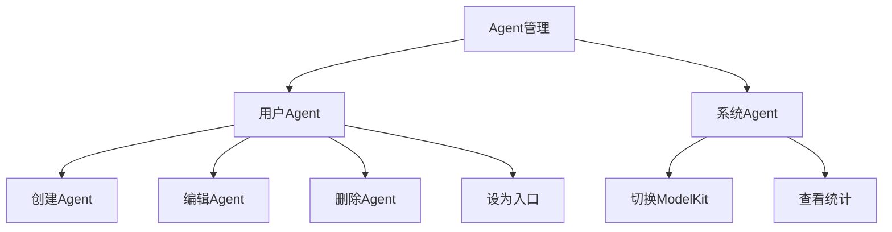

**图表来源**
- [apps/web/src/App.tsx:2549-2732](file://apps/web/src/App.tsx#L2549-L2732)
- [apps/web/src/App.tsx:2653-2727](file://apps/web/src/App.tsx#L2653-L2727)
- [apps/web/src/App.tsx:3261-3573](file://apps/web/src/App.tsx#L3261-L3573)

**章节来源**
- [apps/web/src/App.tsx:2549-2732](file://apps/web/src/App.tsx#L2549-L2732)
- [apps/web/src/App.tsx:2653-2727](file://apps/web/src/App.tsx#L2653-L2727)
- [apps/web/src/App.tsx:3261-3573](file://apps/web/src/App.tsx#L3261-L3573)

## 依赖关系分析
- 运行时依赖
  - React 生态：React、React DOM、motion（动画）、lucide-react（图标）、@radix-ui/react-select（选择器）、cmdk（命令面板）。
  - 样式与工具：clsx、tailwind-merge、tailwindcss、@tailwindcss/vite。
  - 知识中心：新增知识库相关的样式和组件支持，包括mermaid、react-markdown、remark-gfm。
  - 分支检测：新增 Git 操作相关的依赖，包括 @hono/node-server。
  - 系统代理：新增代理设置相关的依赖，包括引擎配置和Agent管理。
- 开发依赖
  - TypeScript、Vite、@vitejs/plugin-react。
- 构建与代理
  - Vite 代理将 /api 前缀转发至后端端口，默认 4300，可通过环境变量覆盖。

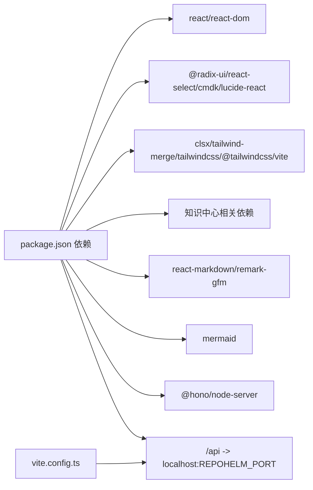

**图表来源**
- [apps/web/package.json:11-29](file://apps/web/package.json#L11-L29)
- [apps/web/vite.config.ts:5-14](file://apps/web/vite.config.ts#L5-L14)

**章节来源**
- [apps/web/package.json:1-37](file://apps/web/package.json#L1-L37)
- [apps/web/vite.config.ts:1-16](file://apps/web/vite.config.ts#L1-L16)

## 性能考虑
- 渲染优化
  - 使用 useMemo 缓存派生数据（如当前工作区、项目列表、事件、变更文件等），减少不必要的重渲染。
  - 使用 useCallback 包裹传给子组件的回调（在需要时），避免子组件重复渲染。
  - 知识中心使用 useCallback 优化视图加载函数。
  - Markdown渲染器使用memo优化，避免不必要的重新渲染。
  - Inspector组件使用动态标签系统，避免渲染空标签页。
  - 系统代理设置界面采用虚拟滚动，优化大量Agent的渲染性能。
- 异步加载
  - 并发加载多源数据，缩短首屏等待时间。
  - 知识库视图采用懒加载策略，仅在需要时加载。
  - Mermaid图表按需渲染，避免不必要的计算。
  - 分支检测使用防抖和取消机制，避免重复请求。
  - 系统Agent列表支持分页加载，提升大数据量下的性能。
- 动画与过渡
  - 使用 motion 组件进行细粒度入场动画，注意在大量元素时降低动画复杂度。
  - Inspector标签页切换使用 CSS 过渡效果，提供流畅的用户体验。
  - 系统代理设置界面的标签切换使用硬件加速的CSS过渡。
- 样式与主题
  - CSS 变量驱动主题切换，避免频繁重排；Tailwind 工具类按需使用，避免过度嵌套。
  - Inspector样式完全基于 CSS 变量系统，支持无缝主题切换。
  - 系统代理设置界面采用卡片式布局，提升视觉性能。
- 交互性能
  - 拖拽列宽时添加 is-resizing-columns 类，阻止文本选择与多余事件监听。
  - 知识中心的同步操作添加加载状态，避免重复请求。
  - Mermaid图表渲染使用防抖，避免频繁重渲染。
  - 分支检测使用取消机制，避免竞态条件。
  - 系统Agent的ModelKit切换使用防抖机制，避免频繁API调用。
- 资源与网络
  - 合理使用缓存与防抖（如搜索输入），避免频繁请求。
  - 知识库同步支持中断和重试机制。
  - Markdown渲染器缓存渲染结果，提高重复访问性能。
  - 分支检测结果缓存，避免重复Git操作。
  - 系统代理设置状态缓存，避免重复API调用。

## 故障排查指南
- 常见问题
  - 无法连接后端：确认 Vite 代理配置与后端端口，检查 /api 前缀是否正确转发。
  - 主题不生效：确认 data-theme 属性是否正确设置，检查 localStorage 是否被禁用。
  - 列宽不持久化：检查 localStorage 写入权限（隐私模式可能禁用）。
  - 命令面板无法打开：确认 Cmd/Ctrl+K 快捷键未被浏览器扩展拦截。
  - 知识中心无法显示：检查项目绑定状态和知识库权限。
  - Inspector标签页异常：检查内容可用性标志和标签页计算逻辑。
  - 分支检测失败：检查Git仓库状态和分支权限。
  - Markdown渲染异常：检查Markdown语法和代码块标识。
  - Mermaid图表渲染失败：检查Mermaid语法和主题配置。
  - 嵌入模型配置无效：确认选择的 ModelKit 类型为 BYOK。
  - Quest 组合功能异常：检查工作区配置和项目关联状态。
  - 系统代理设置失败：检查引擎配置权限和API访问权限。
  - Agent管理异常：检查Agent权限和ModelKit绑定状态。
- 错误提示
  - 全局错误横幅：当 API 调用失败时显示错误信息，定位到具体操作。
  - 知识库错误：显示具体的索引错误信息和解决方案。
  - Inspector错误：显示标签页计算错误和内容加载失败信息。
  - 分支检测错误：显示Git操作失败和分支信息获取错误。
  - Mermaid图表错误：显示图表渲染失败的具体原因。
  - 系统代理错误：显示代理配置失败和权限不足信息。
  - Agent管理错误：显示Agent创建、更新或删除失败的具体原因。
- 调试技巧
  - 在浏览器控制台查看 fetch 请求与响应。
  - 使用 React DevTools 检查组件树与状态变化。
  - 在 styles.css 中临时注释部分样式，定位布局问题。
  - 检查知识库状态和同步日志。
  - 使用浏览器开发者工具检查Mermaid图表的渲染状态。
  - 检查 Inspector 标签页的可见性计算逻辑。
  - 验证分支检测的Git命令执行和输出解析。
  - 检查系统代理设置的引擎配置更新日志。
  - 验证Agent权限配置和ModelKit绑定状态。

**章节来源**
- [apps/web/vite.config.ts:9-14](file://apps/web/vite.config.ts#L9-L14)
- [apps/web/src/App.tsx:159-165](file://apps/web/src/App.tsx#L159-L165)
- [apps/web/src/App.tsx:154-156](file://apps/web/src/App.tsx#L154-L156)
- [apps/web/src/App.tsx:482](file://apps/web/src/App.tsx#L482)

## 结论
RepoHelm Web 前端采用清晰的分层架构：根组件集中状态与布局，组件层提供可复用 UI，API 层统一网络请求，样式层以 CSS 变量与 Tailwind 实现主题与一致性。虽然未直接使用 Zustand 等第三方状态库，但通过 React 本地状态与 localStorage 已满足当前规模的需求。整体具备良好的可扩展性与可维护性，适合在此基础上引入更复杂的全局状态管理方案（如 Zustand）以进一步提升大型场景下的可维护性。

**更新** 新增的系统代理设置界面和Agent管理功能进一步增强了应用的智能化水平。系统代理设置界面实现了用户代理和系统代理的分离管理，提供了更加精细的代理配置能力。系统Agent管理功能支持系统自带Agent的ModelKit选择和权限配置，显著提升了系统的可管理性和灵活性。最新的动态标签管理系统和分支自动检测功能进一步优化了用户体验。知识中心组件、嵌入模型配置选项和改进的 Quest 组合功能进一步增强了应用的知识管理和任务协作能力。这些变更共同构成了一个更加完善和易用的RepoHelm Web前端应用。

## 附录

### 响应式设计与可访问性
- 响应式
  - 使用 CSS Grid 与 CSS 变量控制布局，适配不同窗口尺寸。
  - 列宽范围限制与拖拽交互保证在小屏设备上的可用性。
  - 知识中心采用三列布局，在小屏设备上自动调整为单列显示。
  - Inspector标签页支持水平滚动，适应不同内容长度。
  - Markdown渲染器支持响应式表格和代码块显示。
  - 系统代理设置界面采用卡片式布局，提升移动端体验。
- 可访问性
  - 为按钮、输入与对话框提供 aria-label 与 role。
  - 键盘导航与焦点可见性：使用 :focus-visible 与 outline。
  - 命令面板与下拉选择器支持键盘操作与无障碍读屏。
  - 知识中心提供语义化标题和内容结构。
  - Inspector标签页提供清晰的视觉层次和状态指示。
  - Markdown渲染器支持屏幕阅读器读取。
  - Mermaid图表提供alt文本和描述信息。
  - 系统代理设置界面提供清晰的标签页导航和状态指示。

**章节来源**
- [apps/web/src/styles.css:106-125](file://apps/web/src/styles.css#L106-L125)
- [apps/web/src/components/CommandPalette.tsx:29-40](file://apps/web/src/components/CommandPalette.tsx#L29-L40)
- [apps/web/src/components/Select.tsx:40-66](file://apps/web/src/components/Select.tsx#L40-L66)
- [apps/web/src/styles.css:2945-3343](file://apps/web/src/styles.css#L2945-L3343)
- [apps/web/src/styles.css:1460-1659](file://apps/web/src/styles.css#L1460-L1659)

### 主题与样式定制
- 主题系统
  - 通过 data-theme 控制明/暗主题，CSS 变量在 :root 与 [data-theme="dark"] 中分别定义。
  - Tailwind v4 通过 @theme inline 暴露颜色与字体变量，支持工具类。
  - 知识中心组件完全支持主题切换，包括导航栏、内容区和图表。
  - Inspector组件完全支持主题切换，包括标签页和内容面板。
  - 系统代理设置界面完全支持主题切换，包括卡片布局和表单控件。
- 定制步骤
  - 修改 theme.css 中的颜色与阴影变量，即可全局改变外观。
  - 如需新增颜色或半径，可在 :root 与 [data-theme="dark"] 中同步添加。
- 与组件的耦合
  - 组件样式通过 CSS 类与变量命名，避免硬编码颜色；Select 与命令面板均遵循统一变量体系。
  - 知识中心样式完全基于 CSS 变量系统，支持无缝主题切换。
  - Inspector样式完全基于 CSS 变量系统，支持无缝主题切换。
  - 系统代理设置界面样式完全基于 CSS 变量系统，支持无缝主题切换。
  - Markdown渲染器和Mermaid图表样式完全基于 CSS 变量系统。

**章节来源**
- [apps/web/src/theme.css:14-176](file://apps/web/src/theme.css#L14-L176)
- [apps/web/src/styles.css:106-125](file://apps/web/src/styles.css#L106-L125)
- [apps/web/src/components/Select.tsx:40-66](file://apps/web/src/components/Select.tsx#L40-L66)
- [apps/web/src/styles.css:2941-3099](file://apps/web/src/styles.css#L2941-L3099)
- [apps/web/src/styles.css:3187-3287](file://apps/web/src/styles.css#L3187-L3287)
- [apps/web/src/styles.css:1460-1659](file://apps/web/src/styles.css#L1460-L1659)

### 组件组合模式与集成
- 与根组件的集成
  - App 作为容器，将 CommandPalette、Select、KnowledgeCenter、Inspector、AppSettingsDialog、SubAgentDialog 等组件作为局部功能模块嵌入。
  - 知识中心作为独立的三列布局组件，通过状态管理与主界面集成。
  - Inspector作为独立的检查器组件，通过状态管理与主界面集成。
  - 系统代理设置界面作为AppSettingsDialog的子组件，提供精细的代理配置功能。
  - Agent管理界面作为SubAgentDialog的子组件，提供完整的Agent生命周期管理。
  - 嵌入模型配置作为引擎配置的一部分集成。
- 与 API 的集成
  - 通过 api.ts 的函数式接口调用后端，统一错误处理与返回类型。
  - 知识中心使用专门的 API 函数处理知识库操作。
  - 分支检测使用专门的 API 函数处理Git操作。
  - 代理设置通过引擎API进行更新和查询。
  - Agent管理通过专门的API函数进行CRUD操作。
  - 嵌入模型配置通过引擎 API 进行更新。
- 与样式系统的集成
  - 使用 cn 工具合并类名，确保组件在不同主题下保持一致外观。
  - 知识中心样式完全基于 CSS 变量系统。
  - Inspector样式完全基于 CSS 变量系统。
  - 系统代理设置界面样式完全基于 CSS 变量系统。
  - Markdown渲染器和Mermaid图表样式完全基于 CSS 变量系统。

**章节来源**
- [apps/web/src/App.tsx:50-51](file://apps/web/src/App.tsx#L50-L51)
- [apps/web/src/components/Select.tsx:40-66](file://apps/web/src/components/Select.tsx#L40-L66)
- [apps/web/src/lib/utils.ts:4-7](file://apps/web/src/lib/utils.ts#L4-L7)
- [apps/web/src/api.ts:487-492](file://apps/web/src/api.ts#L487-L492)

### UI 布局参考
- 任务流与 Inspector Tab 建议
  - 参考文档对任务阶段、Inspector 标签页与推荐标签的说明，有助于理解界面组织与信息层级。
  - 知识中心作为独立的 Inspector Tab 集成，提供知识库浏览功能。
  - 采用三列布局设计，左侧导航、中间内容、右侧辅助信息。
  - Inspector采用动态标签系统，根据内容可用性自动显示标签页。
  - 系统代理设置界面采用卡片式布局，提供清晰的信息层次。

**章节来源**
- [docs/ui-layout.md:74-151](file://docs/ui-layout.md#L74-L151)

### 知识中心集成
- 知识中心集成
  - 通过 knowledgeOpen 状态控制知识中心显示。
  - 支持从命令面板和侧边栏快捷访问。
  - 集成项目知识库的完整生命周期管理。
  - 支持Repo Wiki和记忆的双标签页切换。
- 配置界面集成
  - 嵌入模型配置作为引擎配置的一部分。
  - 支持与 ModelKit 管理界面的联动。
  - 提供配置验证和错误提示。

**章节来源**
- [apps/web/src/App.tsx:110-112](file://apps/web/src/App.tsx#L110-L112)
- [apps/web/src/App.tsx:717-723](file://apps/web/src/App.tsx#L717-L723)
- [apps/web/src/App.tsx:2481-2495](file://apps/web/src/App.tsx#L2481-L2495)
- [apps/web/src/components/KnowledgeCenter.tsx:125-148](file://apps/web/src/components/KnowledgeCenter.tsx#L125-L148)

### Inspector集成
- Inspector集成
  - 通过 inspectorTab 状态控制当前标签页。
  - 采用动态标签系统，根据内容可用性自动显示标签。
  - 支持概要、Spec、Plan、能力、文件和Diff标签页。
  - 提供智能标签选择和自动导航功能。
- 样式集成
  - 完全基于 CSS 变量系统，支持主题切换。
  - 提供标签页样式、内容面板样式和空状态样式。
  - 支持响应式设计和滚动适配。

**章节来源**
- [apps/web/src/App.tsx:105](file://apps/web/src/App.tsx#L105)
- [apps/web/src/App.tsx:1188-1300](file://apps/web/src/App.tsx#L1188-L1300)
- [apps/web/src/styles.css:1460-1659](file://apps/web/src/styles.css#L1460-L1659)

### 分支检测集成
- 分支检测集成
  - 在项目配置界面中自动检测Git仓库分支。
  - 使用 useEffect 监听路径变化，触发分支检测。
  - 提供分支列表、默认分支和当前分支信息。
  - 支持智能默认分支设置和用户反馈。
- API集成
  - 前端：api.listBranches() 获取分支信息。
  - 后端：packages/core/src/git.ts 实现Git操作。
  - 服务：packages/core/src/service.ts 提供服务接口。
  - REST：apps/server/src/index.ts 提供API端点。

**章节来源**
- [apps/web/src/App.tsx:2994-3019](file://apps/web/src/App.tsx#L2994-L3019)
- [packages/core/src/git.ts:79-93](file://packages/core/src/git.ts#L79-L93)
- [packages/core/src/service.ts:601-603](file://packages/core/src/service.ts#L601-L603)
- [apps/server/src/index.ts:342-345](file://apps/server/src/index.ts#L342-L345)

### 知识中心组件技术实现
- 状态管理实现
  - 使用 useState 和 useRef 管理组件内部状态
  - 使用 useCallback 优化异步操作函数
  - 使用 useEffect 处理生命周期事件
- 性能优化策略
  - 使用 Set 数据结构跟踪加载状态
  - 防止重复加载的并发控制
  - 条件渲染减少不必要的DOM更新
- 错误处理机制
  - 使用 try-catch 处理异步操作错误
  - 提供用户友好的错误提示
  - 支持错误状态的可视化反馈

**章节来源**
- [apps/web/src/components/KnowledgeCenter.tsx:62-88](file://apps/web/src/components/KnowledgeCenter.tsx#L62-L88)
- [apps/web/src/components/KnowledgeCenter.tsx:136-150](file://apps/web/src/components/KnowledgeCenter.tsx#L136-L150)
- [apps/web/src/components/KnowledgeCenter.tsx:164-182](file://apps/web/src/components/KnowledgeCenter.tsx#L164-L182)

### 系统代理设置界面技术实现
- 界面架构
  - 采用动态标签管理系统，根据内容可用性自动显示标签。
  - 用户代理和系统代理配置完全分离，互不影响。
  - 支持实时代理设置更新和验证。
- 状态管理
  - 使用useState管理代理设置状态
  - 使用useEffect处理代理设置的生命周期
  - 使用useCallback优化代理设置函数
- 性能优化
  - 使用虚拟滚动优化大量Agent的渲染
  - 使用防抖机制避免频繁API调用
  - 使用缓存机制提升代理设置的响应速度

**章节来源**
- [apps/web/src/App.tsx:2549-2732](file://apps/web/src/App.tsx#L2549-L2732)
- [apps/web/src/App.tsx:2653-2727](file://apps/web/src/App.tsx#L2653-L2727)
- [apps/web/src/App.tsx:1813-1912](file://apps/web/src/App.tsx#L1813-L1912)

### Agent管理技术实现
- Agent类型管理
  - 区分用户Agent和系统Agent的不同处理逻辑
  - 系统Agent只读，支持ModelKit切换
  - 用户Agent支持完整的CRUD操作
- Agent配置管理
  - 通过SubAgentDialog提供完整的Agent配置界面
  - 支持ModelKit绑定、权限配置和Prompt模板
  - 实时验证Agent配置的有效性
- Agent状态同步
  - Agent配置变更后立即更新引擎配置
  - 系统Agent的ModelKit切换实时生效
  - Agent权限变更后立即应用到Agent实例

**章节来源**
- [apps/web/src/App.tsx:2549-2732](file://apps/web/src/App.tsx#L2549-L2732)
- [apps/web/src/App.tsx:3261-3573](file://apps/web/src/App.tsx#L3261-L3573)
- [apps/web/src/App.tsx:2102-2171](file://apps/web/src/App.tsx#L2102-L2171)

### 测试验证
- 端到端测试
  - 验证知识中心的完整功能流程
  - 测试Repo Wiki页面的渲染和导航
  - 验证记忆功能的搜索和显示
  - 测试主题切换的兼容性
  - 验证Inspector动态标签系统的功能
  - 验证分支检测功能的正确性
  - 验证系统代理设置界面的功能
  - 验证Agent管理功能的完整性
- 测试覆盖范围
  - 知识中心打开和关闭流程
  - 项目树展开和页面选择
  - 源码模式和预览模式切换
  - 同步操作的错误处理
  - Inspector标签页的可见性计算
  - 分支检测的Git命令执行
  - 系统代理设置的配置验证
  - Agent创建、编辑、删除流程

**章节来源**
- [e2e/knowledge-center.spec.ts:1-39](file://e2e/knowledge-center.spec.ts#L1-L39)
- [e2e/quest-workspace.spec.ts:185-197](file://e2e/quest-workspace.spec.ts#L185-L197)