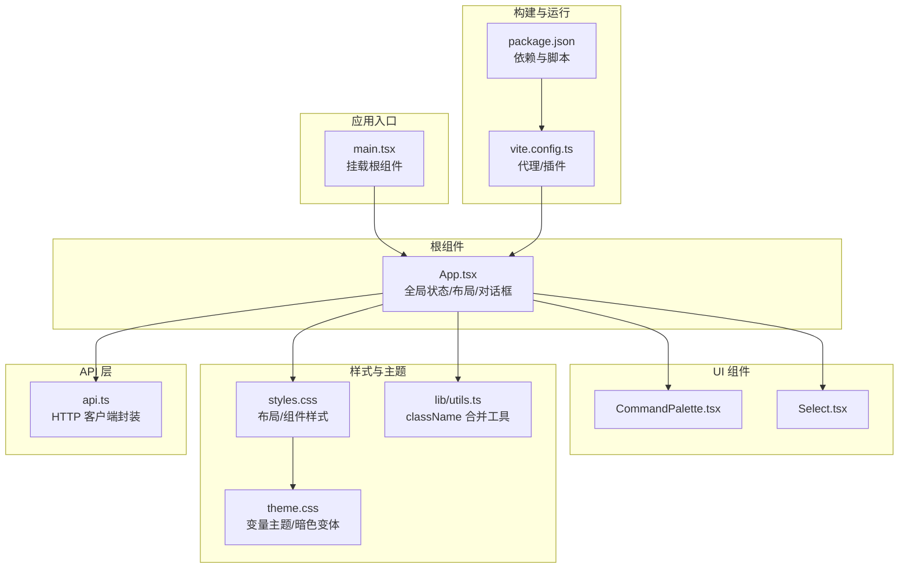
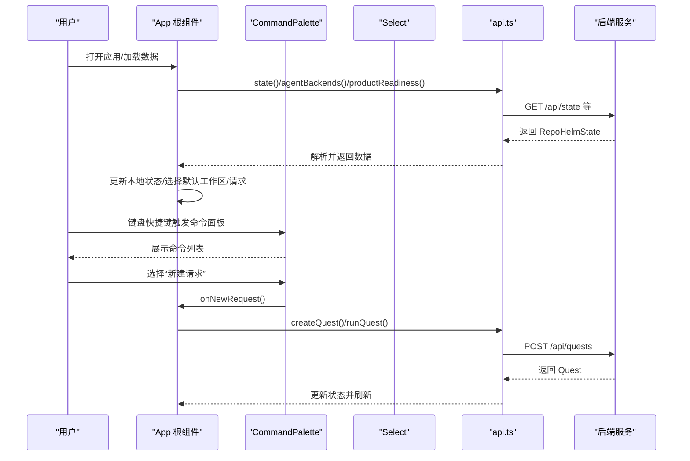
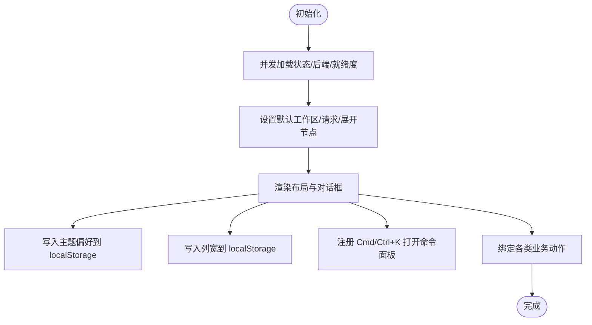
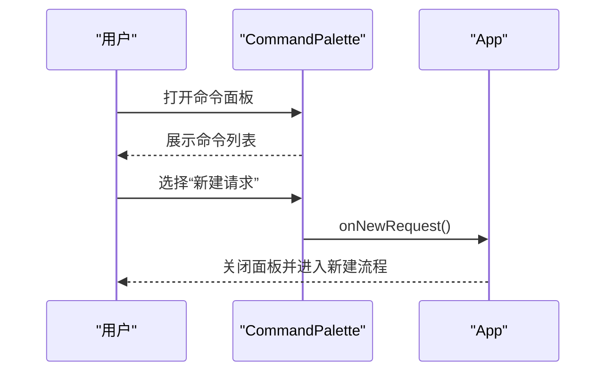
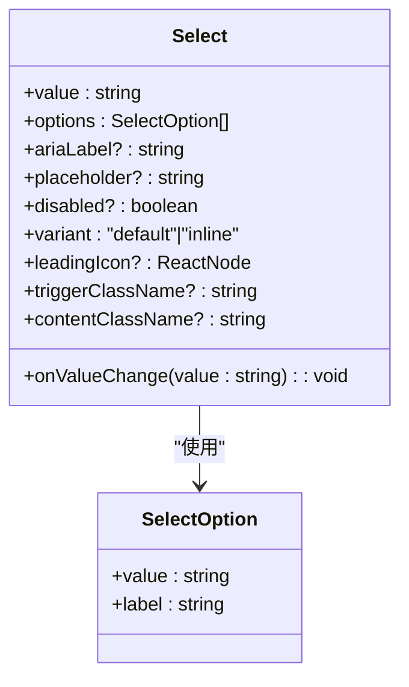
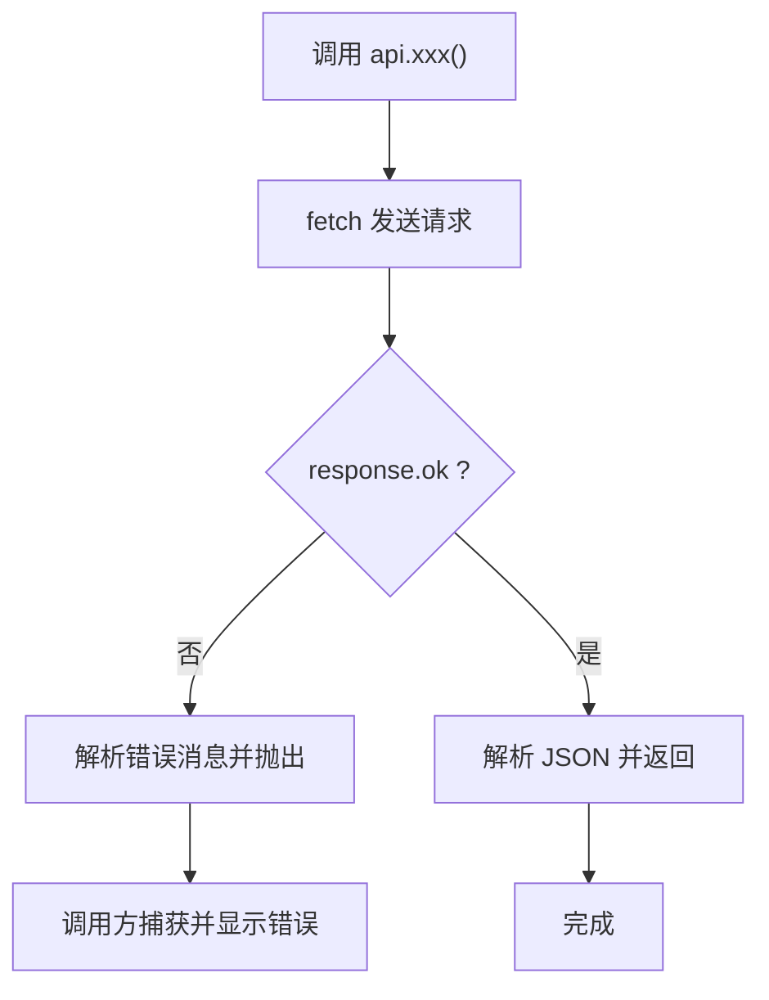
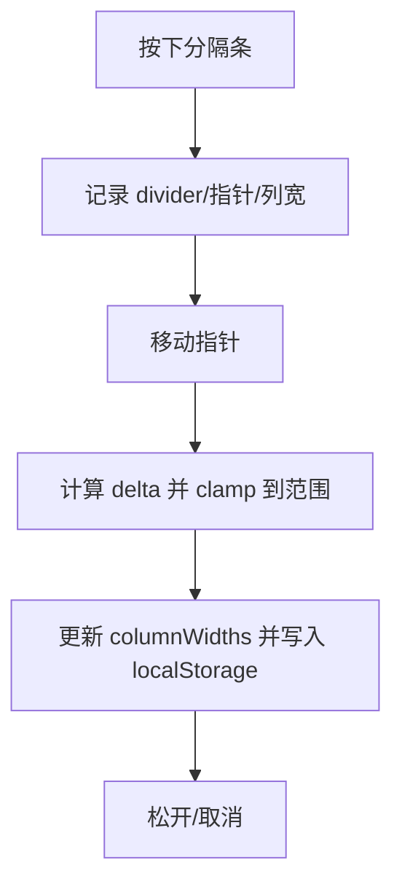
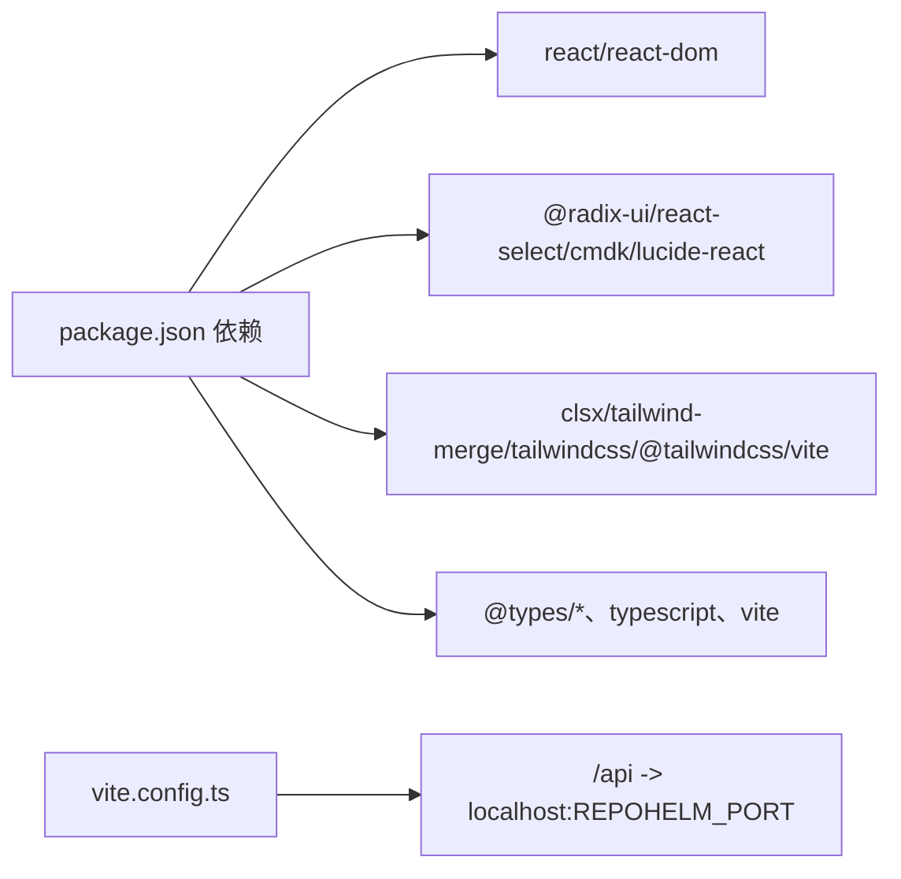

# Web 前端应用

<cite>
**本文引用的文件**
- [apps/web/src/App.tsx](file://apps/web/src/App.tsx)
- [apps/web/src/main.tsx](file://apps/web/src/main.tsx)
- [apps/web/src/api.ts](file://apps/web/src/api.ts)
- [apps/web/src/components/CommandPalette.tsx](file://apps/web/src/components/CommandPalette.tsx)
- [apps/web/src/components/Select.tsx](file://apps/web/src/components/Select.tsx)
- [apps/web/src/styles.css](file://apps/web/src/styles.css)
- [apps/web/src/theme.css](file://apps/web/src/theme.css)
- [apps/web/src/lib/utils.ts](file://apps/web/src/lib/utils.ts)
- [apps/web/package.json](file://apps/web/package.json)
- [apps/web/vite.config.ts](file://apps/web/vite.config.ts)
- [docs/ui-layout.md](file://docs/ui-layout.md)
</cite>

## 目录
1. [简介](#简介)
2. [项目结构](#项目结构)
3. [核心组件](#核心组件)
4. [架构总览](#架构总览)
5. [详细组件分析](#详细组件分析)
6. [依赖关系分析](#依赖关系分析)
7. [性能考虑](#性能考虑)
8. [故障排查指南](#故障排查指南)
9. [结论](#结论)
10. [附录](#附录)

## 简介
本文件面向 RepoHelm Web 前端应用，系统化阐述其 React 架构、组件层次、状态管理策略（含本地状态与持久化）、API 集成层、UI 组件设计与交互、响应式与可访问性支持、主题与样式定制、组件组合模式以及性能优化与调试建议。目标是帮助开发者快速理解并高效扩展该前端应用。

## 项目结构
- 应用入口与根组件：通过入口文件挂载根组件，根组件负责全局状态、布局与对话框编排。
- 组件层：包含命令面板、下拉选择等可复用 UI 组件。
- 样式层：以 CSS 变量驱动的主题系统，结合 Tailwind v4 的工具类与变量层，实现轻量主题切换与一致的视觉语言。
- API 层：统一封装与后端服务的 HTTP 通信，暴露类型安全的函数式接口。
- 构建与开发：Vite + React 插件 + TailwindCSS，内置代理到后端服务端口。

**图表来源**
- [apps/web/src/main.tsx:1-13](file://apps/web/src/main.tsx#L1-L13)
- [apps/web/src/App.tsx:1-2338](file://apps/web/src/App.tsx#L1-L2338)
- [apps/web/src/components/CommandPalette.tsx:1-101](file://apps/web/src/components/CommandPalette.tsx#L1-L101)
- [apps/web/src/components/Select.tsx:1-69](file://apps/web/src/components/Select.tsx#L1-L69)
- [apps/web/src/api.ts:1-423](file://apps/web/src/api.ts#L1-L423)
- [apps/web/src/styles.css:1-2541](file://apps/web/src/styles.css#L1-L2541)
- [apps/web/src/theme.css:1-176](file://apps/web/src/theme.css#L1-L176)
- [apps/web/src/lib/utils.ts:1-8](file://apps/web/src/lib/utils.ts#L1-L8)
- [apps/web/package.json:1-34](file://apps/web/package.json#L1-L34)
- [apps/web/vite.config.ts:1-16](file://apps/web/vite.config.ts#L1-L16)

**章节来源**
- [apps/web/src/main.tsx:1-13](file://apps/web/src/main.tsx#L1-L13)
- [apps/web/src/App.tsx:1-2338](file://apps/web/src/App.tsx#L1-L2338)
- [apps/web/src/styles.css:1-800](file://apps/web/src/styles.css#L1-L800)
- [apps/web/src/theme.css:1-176](file://apps/web/src/theme.css#L1-L176)
- [apps/web/package.json:1-34](file://apps/web/package.json#L1-L34)
- [apps/web/vite.config.ts:1-16](file://apps/web/vite.config.ts#L1-L16)

## 核心组件
- 根组件 App：集中管理全局状态（工作区、请求、变更文件、列宽、主题、错误信息等），协调侧边栏、工作台与检查器三大区域，并承载多个对话框（创建工作区、应用设置、工作区配置、知识中心）。
- 命令面板 CommandPalette：基于 cmdk 的全局命令入口，支持新建请求、切换工作区、打开设置、知识中心与主题切换。
- 下拉选择 Select：基于 @radix-ui/react-select 的主题化选择器，支持内联紧凑风格与图标前缀，用于设置与表单场景。

**章节来源**
- [apps/web/src/App.tsx:85-659](file://apps/web/src/App.tsx#L85-L659)
- [apps/web/src/components/CommandPalette.tsx:6-101](file://apps/web/src/components/CommandPalette.tsx#L6-L101)
- [apps/web/src/components/Select.tsx:17-69](file://apps/web/src/components/Select.tsx#L17-L69)

## 架构总览
前端采用“根组件集中状态 + 组件分治”的架构：
- 状态管理：以 React 本地状态为主，结合 localStorage 进行 UI 偏好持久化；未发现第三方状态库（如 Zustand）的直接使用痕迹。
- 数据流：根组件通过 api.ts 封装的函数发起异步请求，更新本地状态并驱动 UI。
- 主题与样式：通过 CSS 变量与 data-theme 属性驱动明/暗主题切换，Tailwind 提供实用工具类。
- 交互与键盘：支持快捷键打开命令面板，支持拖拽调整侧边栏与检查器宽度。

**图表来源**
- [apps/web/src/App.tsx:136-148](file://apps/web/src/App.tsx#L136-L148)
- [apps/web/src/App.tsx:217-247](file://apps/web/src/App.tsx#L217-L247)
- [apps/web/src/components/CommandPalette.tsx:29-50](file://apps/web/src/components/CommandPalette.tsx#L29-L50)
- [apps/web/src/api.ts:291-362](file://apps/web/src/api.ts#L291-L362)

**章节来源**
- [apps/web/src/App.tsx:136-247](file://apps/web/src/App.tsx#L136-L247)
- [apps/web/src/api.ts:276-422](file://apps/web/src/api.ts#L276-L422)

## 详细组件分析

### 根组件 App 分析
- 全局状态与副作用
  - 初始化加载：并发获取状态、可用智能体后端与产品就绪度，设置默认选中工作区与请求。
  - 主题持久化：通过 data-theme 属性与 localStorage 同步主题偏好。
  - 列宽持久化：通过 localStorage 保存侧边栏与检查器宽度，避免每次刷新重置。
  - 快捷键：Cmd/Ctrl+K 打开命令面板。
- 计算派生数据：根据当前选中的工作区与请求，计算项目列表、事件、变更文件、选中文件等。
- 动作处理：创建请求、交付请求、接受/拒绝能力、工作区与项目管理、打开项目目录、检查项目健康等。
- 对话框编排：创建工作区、应用设置、工作区配置、知识中心等弹窗。

**图表来源**
- [apps/web/src/App.tsx:136-176](file://apps/web/src/App.tsx#L136-L176)
- [apps/web/src/App.tsx:154-156](file://apps/web/src/App.tsx#L154-L156)
- [apps/web/src/App.tsx:159-165](file://apps/web/src/App.tsx#L159-L165)

**章节来源**
- [apps/web/src/App.tsx:85-659](file://apps/web/src/App.tsx#L85-L659)

### 命令面板 CommandPalette 分析
- 功能要点
  - 基于 cmdk 的输入过滤与命令列表展示。
  - 支持的操作：新建请求、创建工作区、打开设置、打开知识中心、切换主题。
  - 支持工作区切换列表，按名称排序。
  - ESC 关闭，点击遮罩层关闭。
- 可访问性
  - 使用 role、aria-label、aria-describedby 等语义化属性。
  - 自动聚焦输入框，便于键盘操作。
- 事件与回调
  - onNewRequest、onCreateWorkspace、onOpenSettings、onOpenKnowledge、onToggleTheme、onSelectWorkspace、onClose。

**图表来源**
- [apps/web/src/components/CommandPalette.tsx:29-50](file://apps/web/src/components/CommandPalette.tsx#L29-L50)
- [apps/web/src/components/CommandPalette.tsx:51-99](file://apps/web/src/components/CommandPalette.tsx#L51-L99)

**章节来源**
- [apps/web/src/components/CommandPalette.tsx:6-101](file://apps/web/src/components/CommandPalette.tsx#L6-L101)

### 下拉选择 Select 分析
- 设计与实现
  - 基于 @radix-ui/react-select，提供触发器与下拉内容，支持图标前缀与内联紧凑风格。
  - 通过 cn 工具合并类名，确保与主题一致。
- 属性与行为
  - value/onValueChange：受控值与变更回调。
  - options：选项数组，包含 value 与 label。
  - ariaLabel/placeholder/disabled/variant/leadingIcon/triggerClassName/contentClassName：可定制化。
- 适用场景
  - 设置页的模型选择、分支选择、工作区切换等。

**图表来源**
- [apps/web/src/components/Select.tsx:17-69](file://apps/web/src/components/Select.tsx#L17-L69)

**章节来源**
- [apps/web/src/components/Select.tsx:17-69](file://apps/web/src/components/Select.tsx#L17-L69)
- [apps/web/src/lib/utils.ts:4-7](file://apps/web/src/lib/utils.ts#L4-L7)

### API 集成层分析
- 请求封装
  - request 函数统一封装 fetch，自动设置 Content-Type 并解析 JSON，非 OK 状态抛出错误。
- 接口清单（节选）
  - 状态与元数据：state、agentBackends、listClis、rescanClis、testCli、listProviders、listProviderModels、testProvider、getEngine、updateEngine、capabilities、securityPolicy、auditLog、productReadiness、searchKnowledge。
  - 工作区与项目：createWorkspace、updateWorkspace、createProject、linkProject、unlinkProject、updateProject、removeProject、openProjectDirectory、pickDirectory、listBranches、checkProject。
  - 请求生命周期：createQuest、runQuest、retryQuest、cleanupQuest、deliverQuest、acceptCapability、dismissCapability。
- 错误处理
  - 非 OK 响应时读取错误消息并抛出，调用方负责捕获与展示。

**图表来源**
- [apps/web/src/api.ts:276-289](file://apps/web/src/api.ts#L276-L289)
- [apps/web/src/api.ts:291-422](file://apps/web/src/api.ts#L291-L422)

**章节来源**
- [apps/web/src/api.ts:1-423](file://apps/web/src/api.ts#L1-L423)

### 布局与对话框编排
- 布局网格
  - 三列布局：侧边栏、分隔条、工作台、分隔条、检查器，列宽通过 CSS 变量控制并支持拖拽调整。
- 对话框
  - 工作区创建、应用设置、工作区配置、知识中心等，均以条件渲染方式呈现，使用 backdrop 与 role 语义化结构。
- 交互细节
  - 拖拽分隔条：记录初始指针位置与列宽，计算 delta 并限制最小/最大范围，实时更新 CSS 变量。
  - 键盘快捷键：Cmd/Ctrl+K 打开命令面板。

**图表来源**
- [apps/web/src/App.tsx:300-333](file://apps/web/src/App.tsx#L300-L333)
- [apps/web/src/App.tsx:154-156](file://apps/web/src/App.tsx#L154-L156)

**章节来源**
- [apps/web/src/App.tsx:484-578](file://apps/web/src/App.tsx#L484-L578)
- [apps/web/src/App.tsx:300-333](file://apps/web/src/App.tsx#L300-L333)

## 依赖关系分析
- 运行时依赖
  - React 生态：React、React DOM、motion（动画）、lucide-react（图标）、@radix-ui/react-select（选择器）、cmdk（命令面板）。
  - 样式与工具：clsx、tailwind-merge、tailwindcss、@tailwindcss/vite。
- 开发依赖
  - TypeScript、Vite、@vitejs/plugin-react。
- 构建与代理
  - Vite 代理将 /api 前缀转发至后端端口，默认 4300，可通过环境变量覆盖。

**图表来源**
- [apps/web/package.json:11-26](file://apps/web/package.json#L11-L26)
- [apps/web/vite.config.ts:5-14](file://apps/web/vite.config.ts#L5-L14)

**章节来源**
- [apps/web/package.json:1-34](file://apps/web/package.json#L1-L34)
- [apps/web/vite.config.ts:1-16](file://apps/web/vite.config.ts#L1-L16)

## 性能考虑
- 渲染优化
  - 使用 useMemo 缓存派生数据（如当前工作区、项目列表、事件、变更文件等），减少不必要的重渲染。
  - 使用 useCallback 包裹传给子组件的回调（在需要时），避免子组件重复渲染。
- 异步加载
  - 并发加载多源数据，缩短首屏等待时间。
- 动画与过渡
  - 使用 motion 组件进行细粒度入场动画，注意在大量元素时降低动画复杂度。
- 样式与主题
  - CSS 变量驱动主题切换，避免频繁重排；Tailwind 工具类按需使用，避免过度嵌套。
- 交互性能
  - 拖拽列宽时添加 is-resizing-columns 类，阻止文本选择与多余事件监听。
- 资源与网络
  - 合理使用缓存与防抖（如搜索输入），避免频繁请求。

[本节为通用指导，无需特定文件引用]

## 故障排查指南
- 常见问题
  - 无法连接后端：确认 Vite 代理配置与后端端口，检查 /api 前缀是否正确转发。
  - 主题不生效：确认 data-theme 属性是否正确设置，检查 localStorage 是否被禁用。
  - 列宽不持久化：检查 localStorage 写入权限（隐私模式可能禁用）。
  - 命令面板无法打开：确认 Cmd/Ctrl+K 快捷键未被浏览器扩展拦截。
- 错误提示
  - 全局错误横幅：当 API 调用失败时显示错误信息，定位到具体操作。
- 调试技巧
  - 在浏览器控制台查看 fetch 请求与响应。
  - 使用 React DevTools 检查组件树与状态变化。
  - 在 styles.css 中临时注释部分样式，定位布局问题。

**章节来源**
- [apps/web/vite.config.ts:9-14](file://apps/web/vite.config.ts#L9-L14)
- [apps/web/src/App.tsx:159-165](file://apps/web/src/App.tsx#L159-L165)
- [apps/web/src/App.tsx:154-156](file://apps/web/src/App.tsx#L154-L156)
- [apps/web/src/App.tsx:482](file://apps/web/src/App.tsx#L482)

## 结论
RepoHelm Web 前端采用清晰的分层架构：根组件集中状态与布局，组件层提供可复用 UI，API 层统一网络请求，样式层以 CSS 变量与 Tailwind 实现主题与一致性。虽然未直接使用 Zustand 等第三方状态库，但通过 React 本地状态与 localStorage 已满足当前规模的需求。整体具备良好的可扩展性与可维护性，适合在此基础上引入更复杂的全局状态管理方案（如 Zustand）以进一步提升大型场景下的可维护性。

[本节为总结，无需特定文件引用]

## 附录

### 响应式设计与可访问性
- 响应式
  - 使用 CSS Grid 与 CSS 变量控制布局，适配不同窗口尺寸。
  - 列宽范围限制与拖拽交互保证在小屏设备上的可用性。
- 可访问性
  - 为按钮、输入与对话框提供 aria-label 与 role。
  - 键盘导航与焦点可见性：使用 :focus-visible 与 outline。
  - 命令面板与下拉选择器支持键盘操作与无障碍读屏。

**章节来源**
- [apps/web/src/styles.css:106-125](file://apps/web/src/styles.css#L106-L125)
- [apps/web/src/components/CommandPalette.tsx:29-40](file://apps/web/src/components/CommandPalette.tsx#L29-L40)
- [apps/web/src/components/Select.tsx:40-66](file://apps/web/src/components/Select.tsx#L40-L66)

### 主题与样式定制
- 主题系统
  - 通过 data-theme 控制明/暗主题，CSS 变量在 :root 与 [data-theme="dark"] 中分别定义。
  - Tailwind v4 通过 @theme inline 暴露颜色与字体变量，支持工具类。
- 定制步骤
  - 修改 theme.css 中的颜色与阴影变量，即可全局改变外观。
  - 如需新增颜色或半径，可在 :root 与 [data-theme="dark"] 中同步添加。
- 与组件的耦合
  - 组件样式通过 CSS 类与变量命名，避免硬编码颜色；Select 与命令面板均遵循统一变量体系。

**章节来源**
- [apps/web/src/theme.css:14-176](file://apps/web/src/theme.css#L14-L176)
- [apps/web/src/styles.css:106-125](file://apps/web/src/styles.css#L106-L125)
- [apps/web/src/components/Select.tsx:40-66](file://apps/web/src/components/Select.tsx#L40-L66)

### 组件组合模式与集成
- 与根组件的集成
  - App 作为容器，将 CommandPalette 与 Select 等组件作为局部功能模块嵌入。
- 与 API 的集成
  - 通过 api.ts 的函数式接口调用后端，统一错误处理与返回类型。
- 与样式系统的集成
  - 使用 cn 工具合并类名，确保组件在不同主题下保持一致外观。

**章节来源**
- [apps/web/src/App.tsx:50-51](file://apps/web/src/App.tsx#L50-L51)
- [apps/web/src/components/Select.tsx:40-66](file://apps/web/src/components/Select.tsx#L40-L66)
- [apps/web/src/lib/utils.ts:4-7](file://apps/web/src/lib/utils.ts#L4-L7)

### UI 布局参考
- 任务流与 Inspector Tab 建议
  - 参考文档对任务阶段、Inspector 标签页与推荐标签的说明，有助于理解界面组织与信息层级。

**章节来源**
- [docs/ui-layout.md:74-151](file://docs/ui-layout.md#L74-L151)