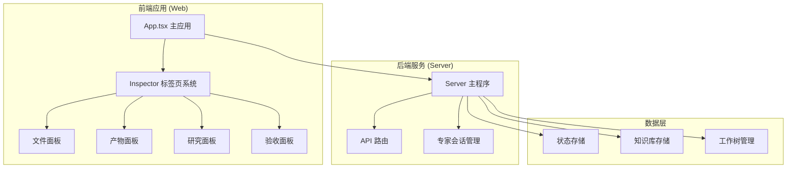
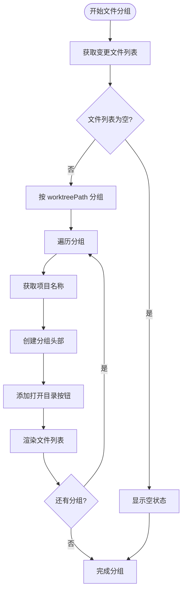
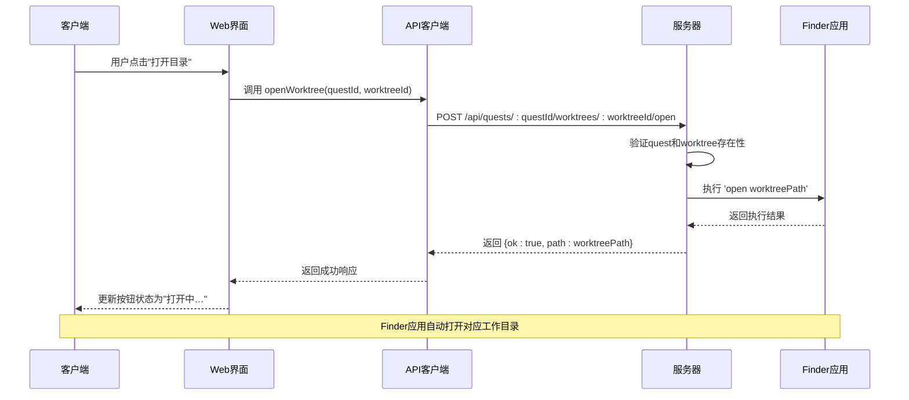
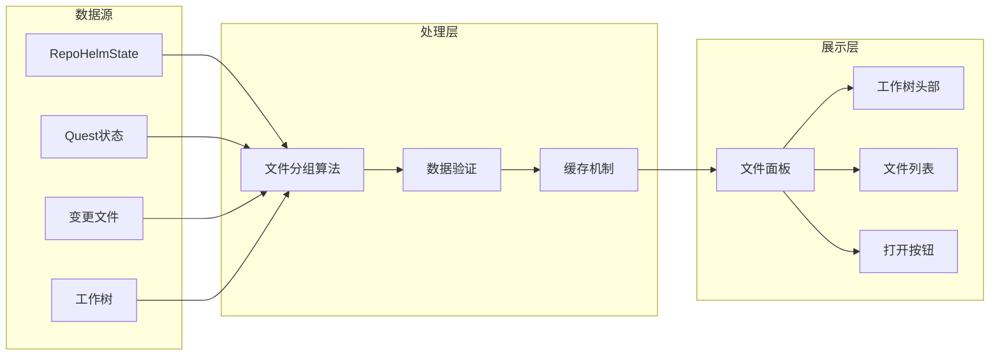
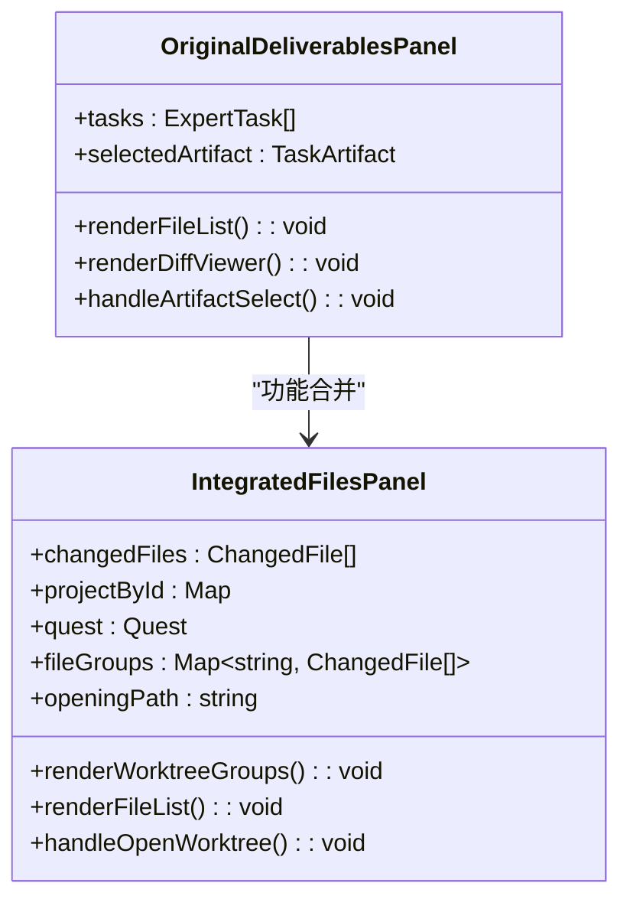
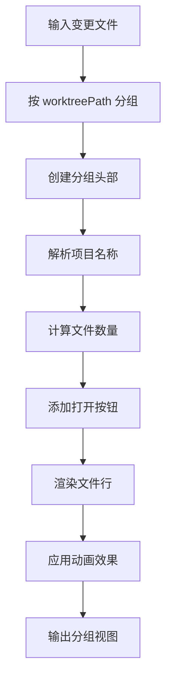
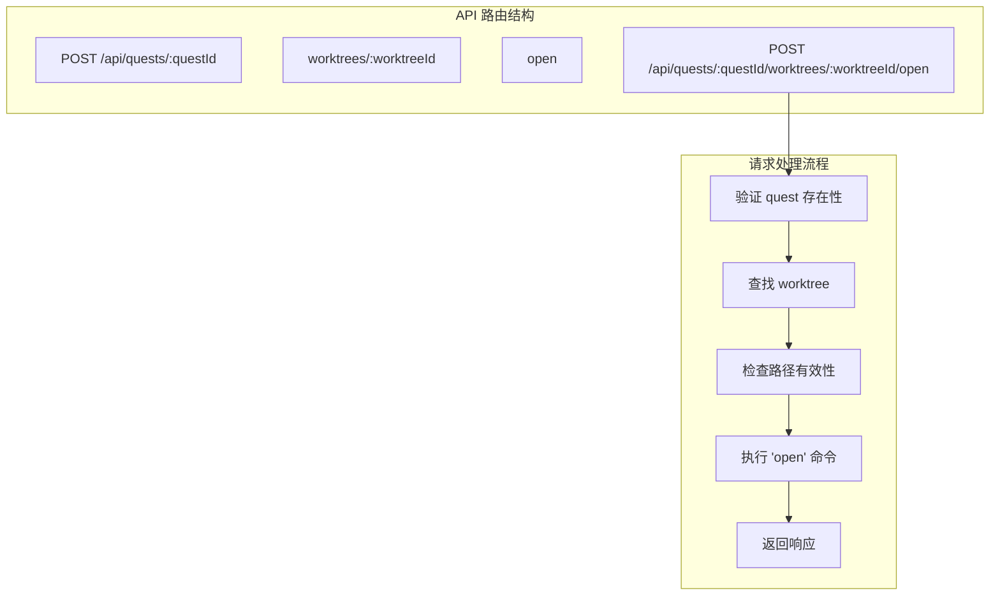
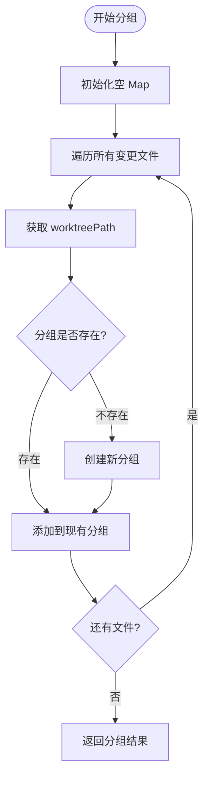

# 合并文件与产物标签页

<cite>
**本文档引用的文件**
- [DeliverablesPanel.tsx](file://apps/web/src/components/DeliverablesPanel.tsx)
- [ResearchPanel.tsx](file://apps/web/src/components/ResearchPanel.tsx)
- [AcceptancePanel.tsx](file://apps/web/src/components/AcceptancePanel.tsx)
- [App.tsx](file://apps/web/src/App.tsx)
- [api.ts](file://apps/web/src/api.ts)
- [index.ts](file://apps/server/src/index.ts)
- [2026-06-11-merge-files-deliverables-tabs.md](file://docs/superpowers/plans/2026-06-11-merge-files-deliverables-tabs.md)
</cite>

## 目录
1. [简介](#简介)
2. [项目结构](#项目结构)
3. [核心组件](#核心组件)
4. [架构概览](#架构概览)
5. [详细组件分析](#详细组件分析)
6. [依赖关系分析](#依赖关系分析)
7. [性能考虑](#性能考虑)
8. [故障排除指南](#故障排除指南)
9. [结论](#结论)

## 简介

本文档详细介绍了 RepoHelm 项目中"合并文件与产物标签页"的功能实现。该功能旨在优化用户体验，将原有的"产物"标签页功能完全整合到"文件"标签页中，实现更直观的文件管理和工作流操作。

主要改进包括：
- 删除独立的"产物"标签页，将其功能合并到"文件"标签页
- 按工作树（worktree）对变更文件进行分组展示
- 为每个工作树分组提供"打开目录"按钮，直接在 Finder 中打开对应的工作目录
- 保持原有的文件差异查看功能和专家团队协作功能

## 项目结构

RepoHelm 采用前后端分离的架构设计，主要包含以下关键组件：



**图表来源**
- [App.tsx:96-1407](file://apps/web/src/App.tsx#L96-L1407)
- [index.ts:1-200](file://apps/server/src/index.ts#L1-L200)

**章节来源**
- [App.tsx:96-1407](file://apps/web/src/App.tsx#L96-L1407)
- [index.ts:1-200](file://apps/server/src/index.ts#L1-L200)

## 核心组件

### 标签页系统架构

RepoHelm 的 Inspector 组件实现了灵活的标签页系统，支持动态显示和隐藏不同类型的标签页：

```mermaid
classDiagram
class InspectorTab {
<<enumeration>>
"spec"
"plan"
"overview"
"capabilities"
"files"
"diff"
"orchestration"
"progress"
"acceptance"
"deliverables"
"references"
"research"
}
class TabVisibility {
hasSpec : boolean
hasPlan : boolean
hasCapabilities : boolean
hasFiles : boolean
hasDiff : boolean
expertSession : ExpertSession
isVisible(tab : InspectorTab) : boolean
}
class TabRenderer {
renderTab(tab : InspectorTab) : ReactElement
renderOverview() : ReactElement
renderSpec() : ReactElement
renderPlan() : ReactElement
renderFiles() : ReactElement
renderDiff() : ReactElement
renderOrchestration() : ReactElement
renderProgress() : ReactElement
renderAcceptance() : ReactElement
renderDeliverables() : ReactElement
renderReferences() : ReactElement
renderResearch() : ReactElement
}
InspectorTab --> TabVisibility : "控制可见性"
TabVisibility --> TabRenderer : "决定渲染"
```

**图表来源**
- [App.tsx:96-1407](file://apps/web/src/App.tsx#L96-L1407)

### 文件分组算法

新的文件面板实现了智能的按工作树分组功能：



**图表来源**
- [App.tsx:189-298](file://apps/web/src/App.tsx#L189-L298)

**章节来源**
- [App.tsx:96-1407](file://apps/web/src/App.tsx#L96-L1407)
- [App.tsx:189-298](file://apps/web/src/App.tsx#L189-L298)

## 架构概览

### 前后端交互流程



**图表来源**
- [api.ts:782-785](file://apps/web/src/api.ts#L782-L785)
- [index.ts:94-115](file://apps/server/src/index.ts#L94-L115)

### 数据流架构



**图表来源**
- [App.tsx:189-298](file://apps/web/src/App.tsx#L189-L298)
- [api.ts:113-119](file://apps/web/src/api.ts#L113-L119)

**章节来源**
- [api.ts:782-785](file://apps/web/src/api.ts#L782-L785)
- [index.ts:94-115](file://apps/server/src/index.ts#L94-L115)

## 详细组件分析

### DeliverablesPanel 组件重构

原有的 DeliverablesPanel 组件提供了完整的文件产物展示功能，但在新架构中被完全重构：

#### 原始功能特性
- 展示所有专家任务的产物文件
- 支持文件差异（diff）查看
- 提供文件选择和导航功能
- 集成专家团队的研究成果

#### 重构后的集成策略
通过将 DeliverablesPanel 的功能完全整合到 FilesPanel 中，实现了更简洁的用户界面：



**图表来源**
- [DeliverablesPanel.tsx:1-34](file://apps/web/src/components/DeliverablesPanel.tsx#L1-L34)
- [App.tsx:189-298](file://apps/web/src/App.tsx#L189-L298)

**章节来源**
- [DeliverablesPanel.tsx:1-34](file://apps/web/src/components/DeliverablesPanel.tsx#L1-L34)
- [App.tsx:189-298](file://apps/web/src/App.tsx#L189-L298)

### 文件面板增强功能

新的 FilesPanel 实现了多项增强功能：

#### 工作树分组功能


**图表来源**
- [App.tsx:242-294](file://apps/web/src/App.tsx#L242-L294)

#### 打开目录功能
- 支持直接在 Finder 中打开工作树目录
- 实时显示打开状态，防止重复操作
- 错误处理和用户反馈机制

**章节来源**
- [App.tsx:218-231](file://apps/web/src/App.tsx#L218-L231)
- [App.tsx:242-294](file://apps/web/src/App.tsx#L242-L294)

### 后端 API 扩展

服务器端新增了专门的目录打开功能：

#### API 路由设计


**图表来源**
- [index.ts:94-115](file://apps/server/src/index.ts#L94-L115)

**章节来源**
- [index.ts:94-115](file://apps/server/src/index.ts#L94-L115)

## 依赖关系分析

### 组件间依赖关系

```mermaid
graph TB
subgraph "UI 组件层"
App[App.tsx]
Inspector[Inspector 组件]
FilesPanel[FilesPanel]
DeliverablesPanel[DeliverablesPanel]
ResearchPanel[ResearchPanel]
AcceptancePanel[AcceptancePanel]
end
subgraph "数据层"
api[api.ts API 客户端]
state[RepoHelmState]
quest[Quest]
changedFiles[ChangedFile[]]
end
subgraph "服务层"
server[index.ts 服务器]
expertSession[ExpertSession]
end
App --> Inspector
Inspector --> FilesPanel
Inspector --> DeliverablesPanel
Inspector --> ResearchPanel
Inspector --> AcceptancePanel
App --> api
api --> server
App --> state
state --> quest
quest --> changedFiles
DeliverablesPanel --> expertSession
ResearchPanel --> expertSession
AcceptancePanel --> expertSession
```

**图表来源**
- [App.tsx:96-1407](file://apps/web/src/App.tsx#L96-L1407)
- [api.ts:693-800](file://apps/web/src/api.ts#L693-L800)

### 外部依赖分析

#### 前端依赖
- React 19 + Framer Motion：用于组件状态管理和动画效果
- TypeScript：提供类型安全和更好的开发体验
- Hono：轻量级的 Web 框架

#### 后端依赖
- Node.js child_process：用于执行系统命令
- Zod：数据验证和类型检查
- SQLite：本地状态存储

**章节来源**
- [App.tsx:96-1407](file://apps/web/src/App.tsx#L96-L1407)
- [api.ts:693-800](file://apps/web/src/api.ts#L693-L800)

## 性能考虑

### 文件分组算法优化

新的分组算法采用了高效的 Map 数据结构：



**图表来源**
- [App.tsx:189-199](file://apps/web/src/App.tsx#L189-L199)

### 动画性能优化

文件列表的动画效果经过精心设计以确保流畅的用户体验：

- 使用 Framer Motion 的硬件加速动画
- 限制动画延迟，避免过度渲染
- 采用分组索引和文件索引计算延迟时间
- 最大延迟时间限制为 0.3 秒

**章节来源**
- [App.tsx:279-286](file://apps/web/src/App.tsx#L279-L286)

## 故障排除指南

### 常见问题及解决方案

#### 1. 工作树目录无法打开

**症状**：点击"打开目录"按钮后无响应

**可能原因**：
- 工作树路径不存在或已被删除
- Finder 应用权限问题
- 系统命令执行失败

**解决步骤**：
1. 验证工作树路径的有效性
2. 检查 Finder 应用的权限设置
3. 查看服务器端日志获取详细错误信息
4. 确认系统环境支持 'open' 命令

#### 2. 文件分组显示异常

**症状**：文件没有按预期分组显示

**可能原因**：
- changedFiles 数据格式不正确
- worktreePath 字段缺失或为空
- 项目映射关系错误

**解决步骤**：
1. 检查 ChangedFile 接口的数据结构
2. 验证 worktreePath 字段的完整性
3. 确认 projectById 映射的正确性
4. 查看分组算法的执行结果

#### 3. 标签页显示问题

**症状**：某些标签页不显示或显示异常

**可能原因**：
- 专家会话状态不正确
- Quest 状态与标签页可见性规则冲突
- 条件渲染逻辑错误

**解决步骤**：
1. 检查 expertSession 的状态和生命周期
2. 验证 Quest 的状态转换逻辑
3. 确认 visibleTabs 过滤条件的正确性
4. 查看标签页渲染的条件判断

**章节来源**
- [App.tsx:1325-1349](file://apps/web/src/App.tsx#L1325-L1349)
- [index.ts:94-115](file://apps/server/src/index.ts#L94-L115)

## 结论

"合并文件与产物标签页"功能的成功实施显著提升了 RepoHelm 的用户体验。通过将原本独立的"产物"功能完全整合到"文件"标签页中，实现了以下改进：

### 主要成就

1. **简化用户界面**：减少了标签页数量，使界面更加简洁直观
2. **提升工作效率**：用户可以在同一个标签页中完成文件浏览和产物查看
3. **增强功能集成**：工作树分组和目录打开功能提供了更好的文件管理体验
4. **保持向后兼容**：专家团队协作功能（研究、验收等）得到完整保留

### 技术亮点

- **智能分组算法**：高效的 Map 数据结构实现 O(n) 时间复杂度的文件分组
- **流畅动画体验**：基于 Framer Motion 的硬件加速动画效果
- **健壮的错误处理**：完善的异常处理和用户反馈机制
- **模块化架构设计**：清晰的组件分离和职责划分

### 未来发展方向

该功能为 RepoHelm 的进一步发展奠定了坚实基础，未来可以考虑：
- 集成更多文件管理功能
- 支持多工作树的协同管理
- 增强文件搜索和过滤能力
- 优化移动端的触摸交互体验

通过这次重构，RepoHelm 在保持强大功能的同时，显著提升了用户的使用体验和工作效率。