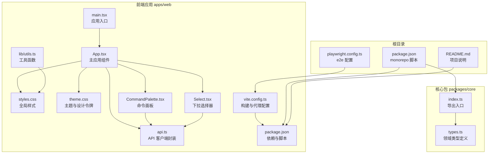
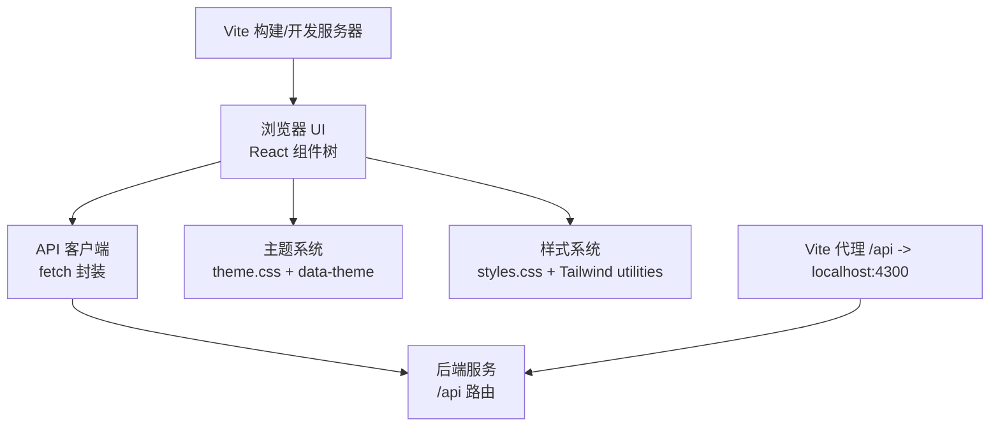
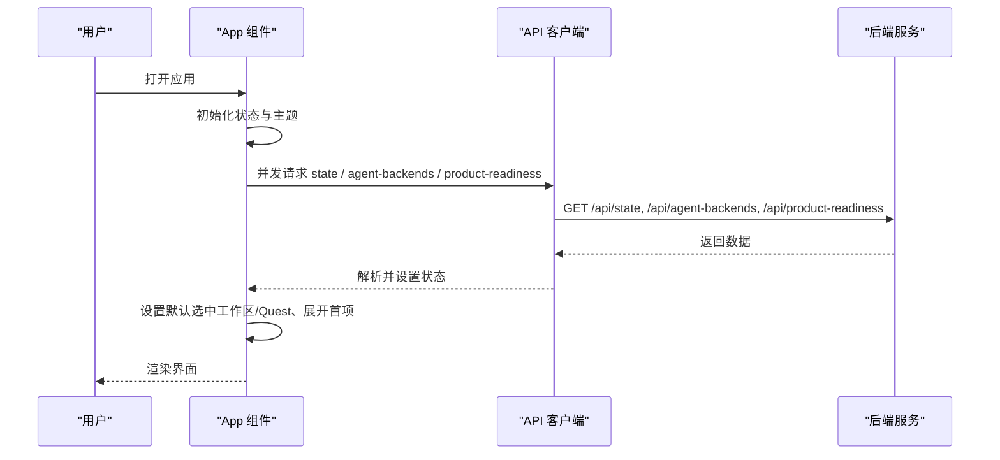
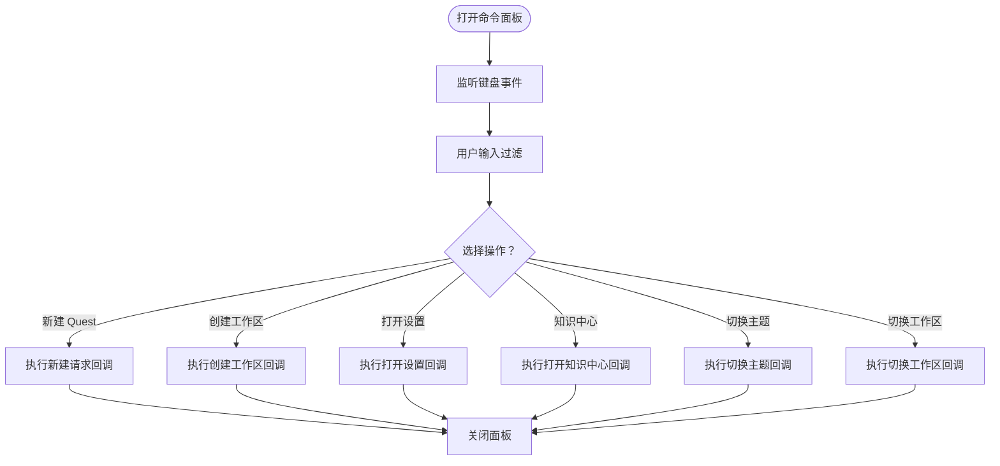
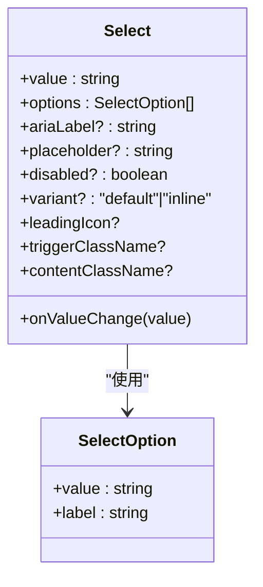
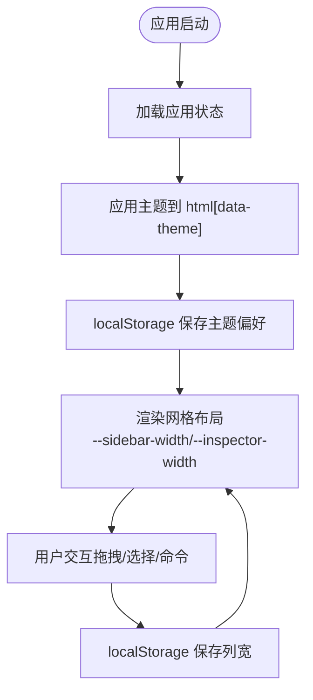
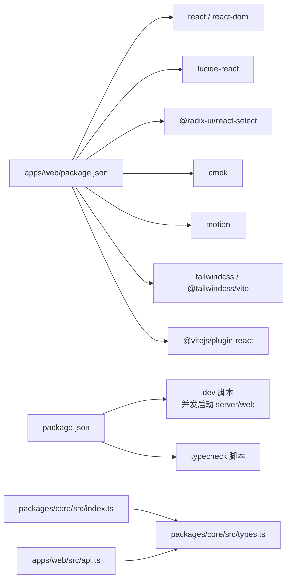

# 应用架构设计

<cite>
**本文引用的文件**
- [apps/web/src/main.tsx](file://apps/web/src/main.tsx)
- [apps/web/src/App.tsx](file://apps/web/src/App.tsx)
- [apps/web/src/api.ts](file://apps/web/src/api.ts)
- [apps/web/src/components/CommandPalette.tsx](file://apps/web/src/components/CommandPalette.tsx)
- [apps/web/src/components/Select.tsx](file://apps/web/src/components/Select.tsx)
- [apps/web/src/lib/utils.ts](file://apps/web/src/lib/utils.ts)
- [apps/web/src/styles.css](file://apps/web/src/styles.css)
- [apps/web/src/theme.css](file://apps/web/src/theme.css)
- [apps/web/vite.config.ts](file://apps/web/vite.config.ts)
- [apps/web/package.json](file://apps/web/package.json)
- [packages/core/src/index.ts](file://packages/core/src/index.ts)
- [packages/core/src/types.ts](file://packages/core/src/types.ts)
- [package.json](file://package.json)
- [README.md](file://README.md)
- [playwright.config.ts](file://playwright.config.ts)
</cite>

## 目录
1. [简介](#简介)
2. [项目结构](#项目结构)
3. [核心组件](#核心组件)
4. [架构总览](#架构总览)
5. [详细组件分析](#详细组件分析)
6. [依赖分析](#依赖分析)
7. [性能考量](#性能考量)
8. [故障排查指南](#故障排查指南)
9. [结论](#结论)
10. [附录](#附录)

## 简介
本文件面向 RepoHelm Web 应用，系统性阐述其 React 架构设计与实现细节，涵盖组件层次、状态管理、数据流、初始化与路由、页面布局、主应用组件职责与生命周期、模块化组织与依赖注入、启动流程、错误处理与性能优化策略，并给出架构决策的技术背景与权衡。

RepoHelm 是一个以“工作区 + 多项目 Quest + 规范驱动 + worktree 隔离 + Agent 编排 + 知识库”为核心的产品方向原型，Web 前端负责工作区与 Quest 的可视化编排、交互与状态展示，后端 API 提供状态聚合、Agent 后端信息、安全策略、产品就绪度等数据。

## 项目结构
RepoHelm 采用多包（monorepo）结构，前端位于 apps/web，核心类型与服务定义位于 packages/core，根目录提供统一脚本与工作空间配置。前端通过 Vite 构建，TailwindCSS/TW4 提供原子化样式，React 19 作为视图层，Radix UI、Lucide、Motion 等库提供基础 UI 与动画能力。

**图表来源**
- [apps/web/src/main.tsx:1-13](file://apps/web/src/main.tsx#L1-L13)
- [apps/web/src/App.tsx:1-120](file://apps/web/src/App.tsx#L1-L120)
- [apps/web/src/api.ts:276-423](file://apps/web/src/api.ts#L276-L423)
- [apps/web/src/styles.css:1-120](file://apps/web/src/styles.css#L1-L120)
- [apps/web/src/theme.css:1-176](file://apps/web/src/theme.css#L1-L176)
- [apps/web/src/components/CommandPalette.tsx:1-101](file://apps/web/src/components/CommandPalette.tsx#L1-L101)
- [apps/web/src/components/Select.tsx:1-69](file://apps/web/src/components/Select.tsx#L1-L69)
- [apps/web/src/lib/utils.ts:1-8](file://apps/web/src/lib/utils.ts#L1-L8)
- [apps/web/vite.config.ts:1-16](file://apps/web/vite.config.ts#L1-L16)
- [apps/web/package.json:1-34](file://apps/web/package.json#L1-L34)
- [packages/core/src/index.ts:1-9](file://packages/core/src/index.ts#L1-L9)
- [packages/core/src/types.ts:1-120](file://packages/core/src/types.ts#L1-L120)
- [package.json:1-21](file://package.json#L1-L21)
- [README.md:1-100](file://README.md#L1-L100)
- [playwright.config.ts:1-32](file://playwright.config.ts#L1-L32)

**章节来源**
- [apps/web/src/main.tsx:1-13](file://apps/web/src/main.tsx#L1-L13)
- [apps/web/src/App.tsx:1-120](file://apps/web/src/App.tsx#L1-L120)
- [apps/web/package.json:1-34](file://apps/web/package.json#L1-L34)
- [apps/web/vite.config.ts:1-16](file://apps/web/vite.config.ts#L1-L16)
- [packages/core/src/index.ts:1-9](file://packages/core/src/index.ts#L1-L9)
- [packages/core/src/types.ts:1-120](file://packages/core/src/types.ts#L1-L120)
- [package.json:1-21](file://package.json#L1-L21)
- [README.md:1-100](file://README.md#L1-L100)

## 核心组件
- 应用入口与挂载
  - 入口文件负责创建根节点并渲染主应用组件，同时引入主题与全局样式。
  - 参考路径：[apps/web/src/main.tsx:1-13](file://apps/web/src/main.tsx#L1-L13)

- 主应用组件 App
  - 负责应用初始化、状态加载、主题持久化、列宽持久化、键盘快捷键绑定、命令面板开关、对话框管理、以及三大区域的布局与交互。
  - 初始化流程：并发加载状态、Agent 后端列表、产品就绪度，随后根据首个工作区/Quest 设置初始选中项与展开状态。
  - 参考路径：[apps/web/src/App.tsx:136-152](file://apps/web/src/App.tsx#L136-L152)

- API 客户端
  - 统一封装所有后端接口调用，统一错误处理与响应解析，提供工作区、项目、Quest、Agent、安全策略、产品就绪度等方法。
  - 参考路径：[apps/web/src/api.ts:276-423](file://apps/web/src/api.ts#L276-L423)

- 命令面板
  - 基于 cmdk 实现的全局命令入口，支持新建 Quest、创建工作区、打开设置、知识中心、切换主题、快速切换工作区等。
  - 参考路径：[apps/web/src/components/CommandPalette.tsx:1-101](file://apps/web/src/components/CommandPalette.tsx#L1-L101)

- 下拉选择器
  - 基于 Radix UI 的可主题化 Select 组件，提供默认与内联两种变体，支持前置图标与自定义类名。
  - 参考路径：[apps/web/src/components/Select.tsx:1-69](file://apps/web/src/components/Select.tsx#L1-L69)

- 工具函数
  - 类名合并工具，基于 clsx 与 tailwind-merge，避免重复与冲突的 Tailwind 类。
  - 参考路径：[apps/web/src/lib/utils.ts:1-8](file://apps/web/src/lib/utils.ts#L1-L8)

**章节来源**
- [apps/web/src/main.tsx:1-13](file://apps/web/src/main.tsx#L1-L13)
- [apps/web/src/App.tsx:136-152](file://apps/web/src/App.tsx#L136-L152)
- [apps/web/src/api.ts:276-423](file://apps/web/src/api.ts#L276-L423)
- [apps/web/src/components/CommandPalette.tsx:1-101](file://apps/web/src/components/CommandPalette.tsx#L1-L101)
- [apps/web/src/components/Select.tsx:1-69](file://apps/web/src/components/Select.tsx#L1-L69)
- [apps/web/src/lib/utils.ts:1-8](file://apps/web/src/lib/utils.ts#L1-L8)

## 架构总览
RepoHelm Web 采用“单页应用 + 前后端分离”的经典架构。前端通过 React 组件树承载 UI 与交互，状态主要由 React Hooks 管理，数据通过 API 客户端与后端交互。构建与开发由 Vite 驱动，样式由 TailwindCSS 与自定义主题驱动。

**图表来源**
- [apps/web/src/App.tsx:136-152](file://apps/web/src/App.tsx#L136-L152)
- [apps/web/src/api.ts:276-423](file://apps/web/src/api.ts#L276-L423)
- [apps/web/src/theme.css:14-176](file://apps/web/src/theme.css#L14-L176)
- [apps/web/src/styles.css:1-120](file://apps/web/src/styles.css#L1-L120)
- [apps/web/vite.config.ts:5-16](file://apps/web/vite.config.ts#L5-L16)

**章节来源**
- [apps/web/src/App.tsx:136-152](file://apps/web/src/App.tsx#L136-L152)
- [apps/web/src/api.ts:276-423](file://apps/web/src/api.ts#L276-L423)
- [apps/web/vite.config.ts:5-16](file://apps/web/vite.config.ts#L5-L16)

## 详细组件分析

### 主应用组件 App 的职责与生命周期
- 初始化与状态加载
  - 组件挂载后并发请求应用状态、Agent 后端列表与产品就绪度，成功后设置初始选中工作区与 Quest，并展开首个工作区。
  - 参考路径：[apps/web/src/App.tsx:136-148](file://apps/web/src/App.tsx#L136-L148)

- 主题与列宽持久化
  - 主题通过 data-theme 属性与 localStorage 同步；列宽通过 localStorage 保存，保证用户偏好跨会话一致。
  - 参考路径：[apps/web/src/App.tsx:103-126](file://apps/web/src/App.tsx#L103-L126)

- 键盘快捷键与命令面板
  - 支持 Cmd/Ctrl+K 打开命令面板；命令面板支持 Esc 关闭。
  - 参考路径：[apps/web/src/App.tsx:167-176](file://apps/web/src/App.tsx#L167-L176), [apps/web/src/components/CommandPalette.tsx:29-40](file://apps/web/src/components/CommandPalette.tsx#L29-L40)

- 错误处理
  - 所有异步操作捕获错误并显示在顶部横幅；busy 状态用于禁用交互与反馈加载。
  - 参考路径：[apps/web/src/App.tsx:127-128](file://apps/web/src/App.tsx#L127-L128), [apps/web/src/App.tsx:226-246](file://apps/web/src/App.tsx#L226-L246)

- 布局与三大区域
  - 顶部工具栏、左侧工作区侧边栏、中间 Quest 工作台、右侧 Inspector 面板；支持拖拽调整列宽。
  - 参考路径：[apps/web/src/App.tsx:451-578](file://apps/web/src/App.tsx#L451-L578)

**图表来源**
- [apps/web/src/App.tsx:136-148](file://apps/web/src/App.tsx#L136-L148)
- [apps/web/src/api.ts:291-328](file://apps/web/src/api.ts#L291-L328)

**章节来源**
- [apps/web/src/App.tsx:103-176](file://apps/web/src/App.tsx#L103-L176)
- [apps/web/src/App.tsx:451-578](file://apps/web/src/App.tsx#L451-L578)
- [apps/web/src/App.tsx:136-148](file://apps/web/src/App.tsx#L136-L148)
- [apps/web/src/api.ts:291-328](file://apps/web/src/api.ts#L291-L328)

### 命令面板组件
- 功能要点
  - 支持新建 Quest、创建工作区、打开设置、知识中心、切换主题、快速切换工作区。
  - 使用 cmdk 的 Command 组件，支持输入过滤与分组展示。
- 交互流程
  - 打开后监听 Escape 关闭；选择项后执行回调并关闭面板。
- 参考路径：[apps/web/src/components/CommandPalette.tsx:1-101](file://apps/web/src/components/CommandPalette.tsx#L1-L101)

**图表来源**
- [apps/web/src/components/CommandPalette.tsx:29-94](file://apps/web/src/components/CommandPalette.tsx#L29-L94)

**章节来源**
- [apps/web/src/components/CommandPalette.tsx:1-101](file://apps/web/src/components/CommandPalette.tsx#L1-L101)

### 下拉选择器组件
- 设计目标
  - 提供可主题化的 Select，支持默认与内联两种触发器风格，支持前置图标与自定义类名。
- 技术实现
  - 基于 @radix-ui/react-select，结合 cn 工具进行类名合并与去重。
- 参考路径：[apps/web/src/components/Select.tsx:1-69](file://apps/web/src/components/Select.tsx#L1-L69), [apps/web/src/lib/utils.ts:1-8](file://apps/web/src/lib/utils.ts#L1-L8)

**图表来源**
- [apps/web/src/components/Select.tsx:17-39](file://apps/web/src/components/Select.tsx#L17-L39)

**章节来源**
- [apps/web/src/components/Select.tsx:1-69](file://apps/web/src/components/Select.tsx#L1-L69)
- [apps/web/src/lib/utils.ts:1-8](file://apps/web/src/lib/utils.ts#L1-L8)

### 页面布局与主题系统
- 布局网格
  - 使用 CSS Grid 将界面划分为顶部工具栏与主体工作台；工作台采用三列布局（侧边栏、拖拽手柄、Quest 区域、拖拽手柄、Inspector），列宽通过 CSS 变量动态设置。
- 主题系统
  - 通过 data-theme 属性驱动 Tailwind dark 伪类，主题令牌集中于 theme.css，支持浅色/深色两套配色与过渡动画。
- 参考路径：[apps/web/src/styles.css:106-314](file://apps/web/src/styles.css#L106-L314), [apps/web/src/theme.css:14-176](file://apps/web/src/theme.css#L14-L176)

**图表来源**
- [apps/web/src/App.tsx:103-126](file://apps/web/src/App.tsx#L103-L126)
- [apps/web/src/styles.css:308-314](file://apps/web/src/styles.css#L308-L314)
- [apps/web/src/theme.css:14-176](file://apps/web/src/theme.css#L14-L176)

**章节来源**
- [apps/web/src/styles.css:106-314](file://apps/web/src/styles.css#L106-L314)
- [apps/web/src/theme.css:14-176](file://apps/web/src/theme.css#L14-L176)

## 依赖分析
- 前端依赖
  - React 19、react-dom、lucide-react、@radix-ui/react-select、cmdk、motion、tailwindcss、@tailwindcss/vite、@vitejs/plugin-react。
- 构建与开发
  - Vite 作为开发服务器与打包工具，配置了 /api 代理至后端端口，默认 4300。
- monorepo 脚本
  - 根脚本统一启动 core/build、server/dev 与 web/dev，支持并发与类型检查。
- 核心类型
  - packages/core 提供领域类型与导出入口，apps/web 的 api.ts 与其保持一致的类型契约。

**图表来源**
- [apps/web/package.json:11-27](file://apps/web/package.json#L11-L27)
- [apps/web/vite.config.ts:5-16](file://apps/web/vite.config.ts#L5-L16)
- [package.json:7-13](file://package.json#L7-L13)
- [packages/core/src/index.ts:1-9](file://packages/core/src/index.ts#L1-L9)
- [packages/core/src/types.ts:279-290](file://packages/core/src/types.ts#L279-L290)
- [apps/web/src/api.ts:265-274](file://apps/web/src/api.ts#L265-L274)

**章节来源**
- [apps/web/package.json:11-27](file://apps/web/package.json#L11-L27)
- [apps/web/vite.config.ts:5-16](file://apps/web/vite.config.ts#L5-L16)
- [package.json:7-13](file://package.json#L7-L13)
- [packages/core/src/index.ts:1-9](file://packages/core/src/index.ts#L1-L9)
- [packages/core/src/types.ts:279-290](file://packages/core/src/types.ts#L279-L290)
- [apps/web/src/api.ts:265-274](file://apps/web/src/api.ts#L265-L274)

## 性能考量
- 并发初始化
  - 初始状态通过 Promise.all 并发加载，减少首屏等待时间。
  - 参考路径：[apps/web/src/App.tsx:136-141](file://apps/web/src/App.tsx#L136-L141)

- 列宽与主题持久化
  - 使用 localStorage 缓存用户偏好，避免每次渲染计算，提升交互流畅度。
  - 参考路径：[apps/web/src/App.tsx:112-126](file://apps/web/src/App.tsx#L112-L126)

- 动画与过渡
  - 使用 CSS 动画与 Tailwind 过渡类，配合主题切换与面板弹出，保证视觉一致性与性能。
  - 参考路径：[apps/web/src/styles.css:74-104](file://apps/web/src/styles.css#L74-L104), [apps/web/src/theme.css:28-30](file://apps/web/src/theme.css#L28-L30)

- 构建与代理
  - Vite 开发服务器与代理配置，减少跨域与网络往返；生产构建开启代码分割与 Tree-shaking。
  - 参考路径：[apps/web/vite.config.ts:5-16](file://apps/web/vite.config.ts#L5-L16)

[本节为通用性能建议，不直接分析具体文件，故无“章节来源”]

## 故障排查指南
- 启动失败或空白页
  - 检查 Vite 代理是否指向正确端口（默认 4300），确认后端服务已启动。
  - 参考路径：[apps/web/vite.config.ts:5-16](file://apps/web/vite.config.ts#L5-L16)

- 命令面板无法打开
  - 确认 Cmd/Ctrl+K 快捷键未被其他应用拦截；检查命令面板键盘事件绑定。
  - 参考路径：[apps/web/src/App.tsx:167-176](file://apps/web/src/App.tsx#L167-L176), [apps/web/src/components/CommandPalette.tsx:29-40](file://apps/web/src/components/CommandPalette.tsx#L29-L40)

- 错误横幅频繁出现
  - 检查网络请求与后端返回的错误信息；确认 API 路径与参数正确。
  - 参考路径：[apps/web/src/App.tsx:127-128](file://apps/web/src/App.tsx#L127-L128), [apps/web/src/api.ts:276-289](file://apps/web/src/api.ts#L276-L289)

- 主题切换无效
  - 确认 data-theme 属性已写入 html；检查 localStorage 是否可用。
  - 参考路径：[apps/web/src/App.tsx:158-165](file://apps/web/src/App.tsx#L158-L165), [apps/web/src/theme.css:14-16](file://apps/web/src/theme.css#L14-L16)

**章节来源**
- [apps/web/vite.config.ts:5-16](file://apps/web/vite.config.ts#L5-L16)
- [apps/web/src/App.tsx:127-176](file://apps/web/src/App.tsx#L127-L176)
- [apps/web/src/components/CommandPalette.tsx:29-40](file://apps/web/src/components/CommandPalette.tsx#L29-L40)
- [apps/web/src/api.ts:276-289](file://apps/web/src/api.ts#L276-L289)
- [apps/web/src/theme.css:14-16](file://apps/web/src/theme.css#L14-L16)

## 结论
RepoHelm Web 前端以 React 19 为基础，采用简洁的单页应用架构，通过 API 客户端与后端解耦，借助 Vite/Tailwind 实现高效开发与一致的视觉体验。App 组件承担初始化、状态管理与布局协调的核心职责；命令面板与可主题化组件提升了交互效率与可定制性。通过并发初始化、持久化偏好与动画过渡，兼顾了性能与用户体验。根级 monorepo 脚本与 e2e 配置确保了开发与测试的一致性。

[本节为总结性内容，不直接分析具体文件，故无“章节来源”]

## 附录
- 启动与开发
  - 一键启动：pnpm dev；访问 http://localhost:5173；后端默认端口 4300。
  - 参考路径：[README.md:33-50](file://README.md#L33-L50), [package.json:7-13](file://package.json#L7-L13)

- e2e 测试
  - 使用 Playwright，自动启动前端与后端，测试 UI 主流程。
  - 参考路径：[playwright.config.ts:19-25](file://playwright.config.ts#L19-L25)

**章节来源**
- [README.md:33-50](file://README.md#L33-L50)
- [package.json:7-13](file://package.json#L7-L13)
- [playwright.config.ts:19-25](file://playwright.config.ts#L19-L25)