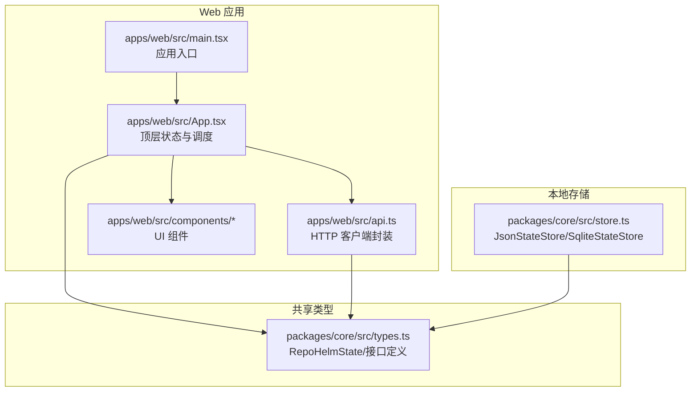
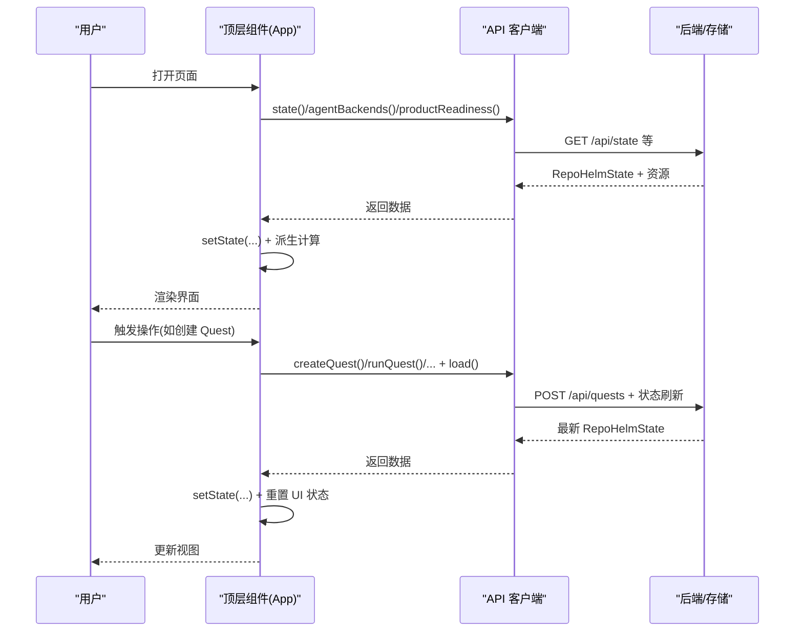
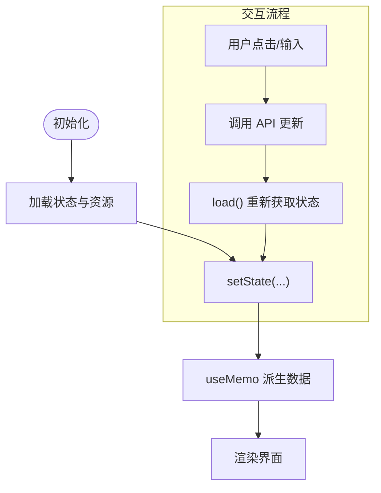
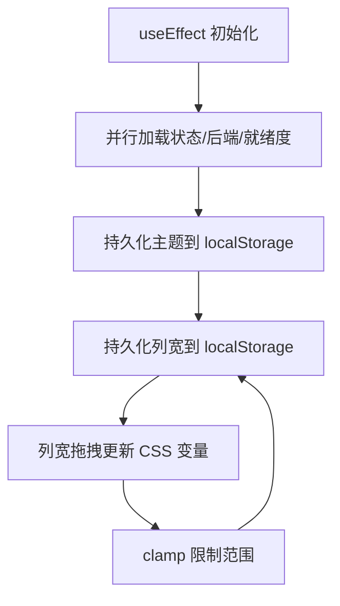
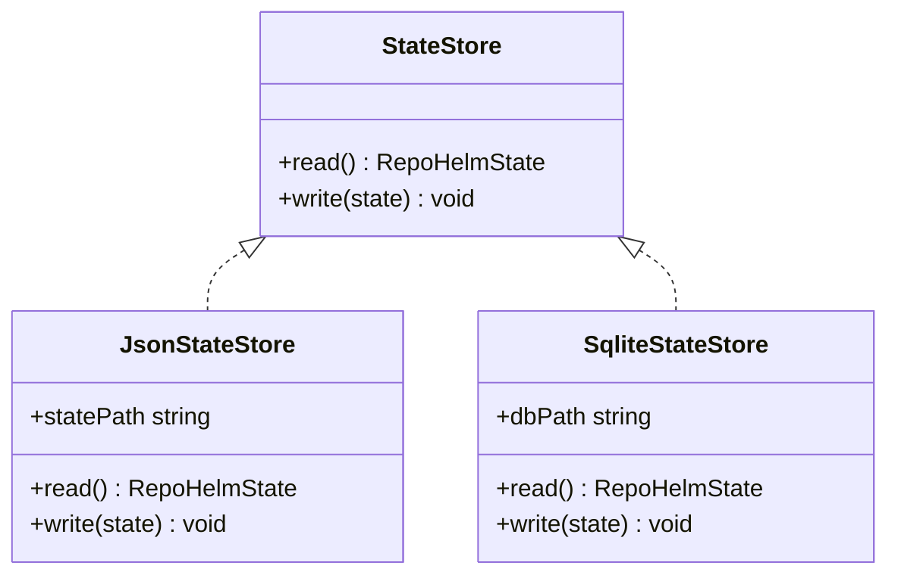
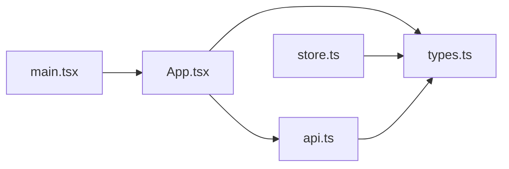

# 状态管理

<cite>
**本文引用的文件**
- [apps/web/src/App.tsx](file://apps/web/src/App.tsx)
- [apps/web/src/api.ts](file://apps/web/src/api.ts)
- [packages/core/src/types.ts](file://packages/core/src/types.ts)
- [packages/core/src/store.ts](file://packages/core/src/store.ts)
- [apps/web/src/main.tsx](file://apps/web/src/main.tsx)
- [apps/web/src/components/CommandPalette.tsx](file://apps/web/src/components/CommandPalette.tsx)
- [apps/web/src/lib/utils.ts](file://apps/web/src/lib/utils.ts)
</cite>

## 目录
1. [简介](#简介)
2. [项目结构](#项目结构)
3. [核心组件](#核心组件)
4. [架构总览](#架构总览)
5. [详细组件分析](#详细组件分析)
6. [依赖关系分析](#依赖关系分析)
7. [性能考量](#性能考量)
8. [故障排查指南](#故障排查指南)
9. [结论](#结论)
10. [附录](#附录)

## 简介
本文件系统性梳理 RepoHelm 的前端状态管理体系，聚焦于 React 状态设计与实现策略，覆盖全局状态组织（工作区、Quest、用户偏好）、响应式更新与副作用处理、以及本地持久化与同步策略。文档同时给出状态流转图与数据流向说明，并总结最佳实践、性能优化与调试技巧，帮助开发者在复杂交互场景下保持状态一致性与可维护性。

## 项目结构
RepoHelm 前端采用单页应用入口，状态主要由顶层组件集中管理并通过 props 下发至子组件；后端通过 REST 接口提供状态与业务操作，核心类型定义位于共享包中，本地持久化由服务端或专用存储模块负责。

图表来源
- [apps/web/src/main.tsx:1-13](file://apps/web/src/main.tsx#L1-L13)
- [apps/web/src/App.tsx:1-200](file://apps/web/src/App.tsx#L1-L200)
- [apps/web/src/api.ts:265-275](file://apps/web/src/api.ts#L265-L275)
- [packages/core/src/types.ts:279-290](file://packages/core/src/types.ts#L279-L290)
- [packages/core/src/store.ts:86-166](file://packages/core/src/store.ts#L86-L166)

章节来源
- [apps/web/src/main.tsx:1-13](file://apps/web/src/main.tsx#L1-L13)
- [apps/web/src/App.tsx:1-200](file://apps/web/src/App.tsx#L1-L200)
- [apps/web/src/api.ts:265-275](file://apps/web/src/api.ts#L265-L275)
- [packages/core/src/types.ts:279-290](file://packages/core/src/types.ts#L279-L290)
- [packages/core/src/store.ts:86-166](file://packages/core/src/store.ts#L86-L166)

## 核心组件
- 顶层状态容器：顶层组件集中声明并管理全局状态，包括工作区、Quest、事件、知识、能力、安全策略、审计日志、引擎配置、模型缓存等；同时维护 UI 偏好（主题、列宽、选中项）与交互态（忙碌、错误）。
- API 客户端：统一封装 HTTP 请求，返回强类型数据，供顶层组件调用以刷新或更新全局状态。
- 类型定义：在共享包中定义 RepoHelmState 及其子结构，确保前后端一致的数据契约。
- 本地存储：提供 JSON 与 SQLite 两种持久化实现，支持迁移与回退逻辑，保障状态持久化与兼容性。

章节来源
- [apps/web/src/App.tsx:85-129](file://apps/web/src/App.tsx#L85-L129)
- [apps/web/src/api.ts:291-422](file://apps/web/src/api.ts#L291-L422)
- [packages/core/src/types.ts:279-290](file://packages/core/src/types.ts#L279-L290)
- [packages/core/src/store.ts:91-166](file://packages/core/src/store.ts#L91-L166)

## 架构总览
RepoHelm 的状态管理遵循“单向数据流”与“集中式状态 + 组件局部状态”的混合模式：
- 集中式状态：顶层组件通过 useState 维护 RepoHelmState 与 UI 偏好；useMemo 派生派生数据，避免重复计算。
- 组件局部状态：对话输入、侧边栏展开、Inspector 标签页等使用 useState 管理，降低全局抖动。
- 副作用：useEffect 处理初始化加载、本地存储同步、键盘快捷键、列宽持久化等。
- 数据来源：首次加载通过 API 获取状态与后端资源；后续通过 API 更新后重新拉取最新状态。

图表来源
- [apps/web/src/App.tsx:136-148](file://apps/web/src/App.tsx#L136-L148)
- [apps/web/src/api.ts:331-362](file://apps/web/src/api.ts#L331-L362)

章节来源
- [apps/web/src/App.tsx:136-148](file://apps/web/src/App.tsx#L136-L148)
- [apps/web/src/api.ts:291-422](file://apps/web/src/api.ts#L291-L422)

## 详细组件分析

### 顶层状态容器与派生数据
- 全局状态字段：工作区列表、项目列表、Quest 列表、事件、知识、能力、安全策略、审计日志、引擎配置、模型缓存等。
- UI 偏好：主题、列宽、选中工作区/Quest、Inspector 标签页、命令面板开关、知识中心开关等。
- 交互态：忙碌标志、错误信息、拖拽状态等。
- 派生数据：基于全局状态与选中项，使用 useMemo 计算当前工作区、项目集合、Quest 列表、选中 Quest、事件列表、变更文件、选中文件等，减少渲染成本。

图表来源
- [apps/web/src/App.tsx:136-148](file://apps/web/src/App.tsx#L136-L148)
- [apps/web/src/App.tsx:178-216](file://apps/web/src/App.tsx#L178-L216)

章节来源
- [apps/web/src/App.tsx:85-129](file://apps/web/src/App.tsx#L85-L129)
- [apps/web/src/App.tsx:178-216](file://apps/web/src/App.tsx#L178-L216)

### 响应式更新与副作用处理
- 初始化加载：首次渲染时并行请求状态、Agent 后端、产品就绪度，完成后设置状态并初始化选中项。
- 本地偏好持久化：列宽与主题变更写入 localStorage，并在挂载时读取。
- 键盘快捷键：监听组合键打开命令面板，避免重复绑定。
- 列宽拖拽：Pointer 事件驱动，clamp 限制范围，实时更新 CSS 变量并持久化。
- 选中项一致性：当 Quest 列表变化或选中文件不存在时，自动修正选中项，保证 UI 一致性。

图表来源
- [apps/web/src/App.tsx:150-176](file://apps/web/src/App.tsx#L150-L176)
- [apps/web/src/App.tsx:300-333](file://apps/web/src/App.tsx#L300-L333)
- [apps/web/src/App.tsx:112-126](file://apps/web/src/App.tsx#L112-L126)

章节来源
- [apps/web/src/App.tsx:150-176](file://apps/web/src/App.tsx#L150-L176)
- [apps/web/src/App.tsx:300-333](file://apps/web/src/App.tsx#L300-L333)
- [apps/web/src/App.tsx:112-126](file://apps/web/src/App.tsx#L112-L126)

### 状态持久化与同步策略
- 前端本地偏好：列宽与主题通过 localStorage 持久化，启动时恢复。
- 后端状态持久化：共享包提供 JsonStateStore 与 SqliteStateStore，支持迁移旧格式、回退与并发写入。
- 同步策略：前端通过 API 拉取最新状态，避免直接读写本地存储；后端存储作为权威来源，前端仅做缓存与回退。

图表来源
- [packages/core/src/store.ts:86-166](file://packages/core/src/store.ts#L86-L166)

章节来源
- [packages/core/src/store.ts:91-166](file://packages/core/src/store.ts#L91-L166)

### 用户偏好与 UI 偏好
- 主题：支持浅色/深色切换，写入 DOM 属性与 localStorage。
- 列宽：左右两栏宽度通过 CSS 变量控制，支持拖拽调整并持久化。
- 命令面板：全局快捷键打开，提供快速操作入口。
- 侧边栏：展开/折叠工作区，支持草稿状态与新建请求。

章节来源
- [apps/web/src/App.tsx:103-126](file://apps/web/src/App.tsx#L103-L126)
- [apps/web/src/App.tsx:167-176](file://apps/web/src/App.tsx#L167-L176)
- [apps/web/src/App.tsx:661-788](file://apps/web/src/App.tsx#L661-L788)
- [apps/web/src/components/CommandPalette.tsx:1-101](file://apps/web/src/components/CommandPalette.tsx#L1-L101)

### 数据模型与类型约束
- RepoHelmState：包含工作区、项目、Quest、事件、知识、能力、安全策略、审计日志、引擎配置与模型缓存。
- 重要枚举与联合类型：Quest 状态、Agent 后端 ID、项目角色、变更类型等，确保状态值域正确。
- API 返回类型：与 RepoHelmState 对齐，便于前端统一处理。

章节来源
- [packages/core/src/types.ts:1-334](file://packages/core/src/types.ts#L1-L334)
- [apps/web/src/api.ts:265-275](file://apps/web/src/api.ts#L265-L275)

## 依赖关系分析
- 应用入口依赖顶层组件；顶层组件依赖 API 客户端与类型定义；本地存储模块独立于前端，但被后端或服务端逻辑使用。
- 组件间通过 props 传递状态，避免跨层级耦合；局部状态仅限组件内部，降低全局抖动。

图表来源
- [apps/web/src/main.tsx:1-13](file://apps/web/src/main.tsx#L1-L13)
- [apps/web/src/App.tsx:1-200](file://apps/web/src/App.tsx#L1-L200)
- [apps/web/src/api.ts:265-275](file://apps/web/src/api.ts#L265-L275)
- [packages/core/src/types.ts:279-290](file://packages/core/src/types.ts#L279-L290)
- [packages/core/src/store.ts:86-166](file://packages/core/src/store.ts#L86-L166)

章节来源
- [apps/web/src/main.tsx:1-13](file://apps/web/src/main.tsx#L1-L13)
- [apps/web/src/App.tsx:1-200](file://apps/web/src/App.tsx#L1-L200)
- [apps/web/src/api.ts:265-275](file://apps/web/src/api.ts#L265-L275)
- [packages/core/src/types.ts:279-290](file://packages/core/src/types.ts#L279-L290)
- [packages/core/src/store.ts:86-166](file://packages/core/src/store.ts#L86-L166)

## 性能考量
- 派生数据缓存：使用 useMemo 缓存当前工作区、项目、Quest、选中文件等，避免每次渲染都进行昂贵计算。
- 并行加载：初始化阶段并行请求多个资源，缩短首屏时间。
- 事件节流：列宽拖拽使用 Pointer 事件并限制更新频率，结合 clamp 控制范围，提升交互流畅度。
- 条件渲染：未选中或空状态时渲染轻量提示，减少 DOM 负担。
- CSS 变量：通过 CSS 变量控制布局尺寸，避免频繁重排。

章节来源
- [apps/web/src/App.tsx:178-216](file://apps/web/src/App.tsx#L178-L216)
- [apps/web/src/App.tsx:136-148](file://apps/web/src/App.tsx#L136-L148)
- [apps/web/src/App.tsx:300-333](file://apps/web/src/App.tsx#L300-L333)

## 故障排查指南
- 加载失败：顶层组件捕获初始化异常并显示错误横幅，检查网络与后端接口可用性。
- 本地存储异常：主题与列宽写入 localStorage 可能因隐私模式或存储不可用而失败，需降级处理。
- 选中项丢失：当 Quest 列表变化或选中文件不存在时，自动修正选中项；若仍异常，检查派生逻辑与 ID 一致性。
- 列宽异常：拖拽边界与最小/最大值限制由 clamp 实现，若出现异常请检查 CSS 变量与持久化值。
- 命令面板：Esc 关闭、快捷键触发，若无效检查事件监听是否被多次绑定。

章节来源
- [apps/web/src/App.tsx:150-176](file://apps/web/src/App.tsx#L150-L176)
- [apps/web/src/App.tsx:112-126](file://apps/web/src/App.tsx#L112-L126)
- [apps/web/src/App.tsx:211-216](file://apps/web/src/App.tsx#L211-L216)
- [apps/web/src/App.tsx:300-333](file://apps/web/src/App.tsx#L300-L333)
- [apps/web/src/components/CommandPalette.tsx:29-40](file://apps/web/src/components/CommandPalette.tsx#L29-L40)

## 结论
RepoHelm 的状态管理以顶层集中式状态为核心，结合组件局部状态与 useMemo 派生，形成清晰、可维护且高性能的状态体系。通过 API 驱动的刷新与 localStorage 的偏好持久化，实现了良好的用户体验与可扩展性。建议在后续迭代中进一步细化状态切分与副作用抽象，以应对更复杂的业务场景。

## 附录
- 类名合并工具：提供简洁的类名合并与去重能力，便于组件样式管理。
  
章节来源
- [apps/web/src/lib/utils.ts:1-8](file://apps/web/src/lib/utils.ts#L1-L8)