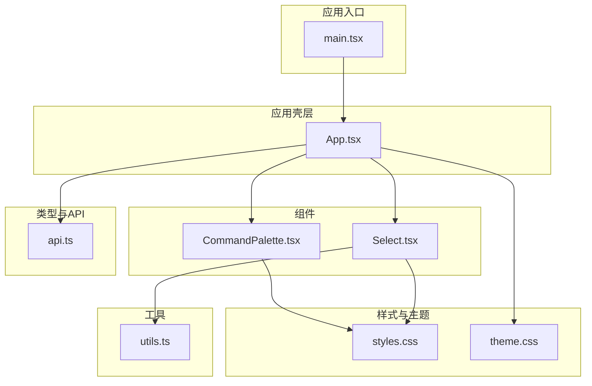
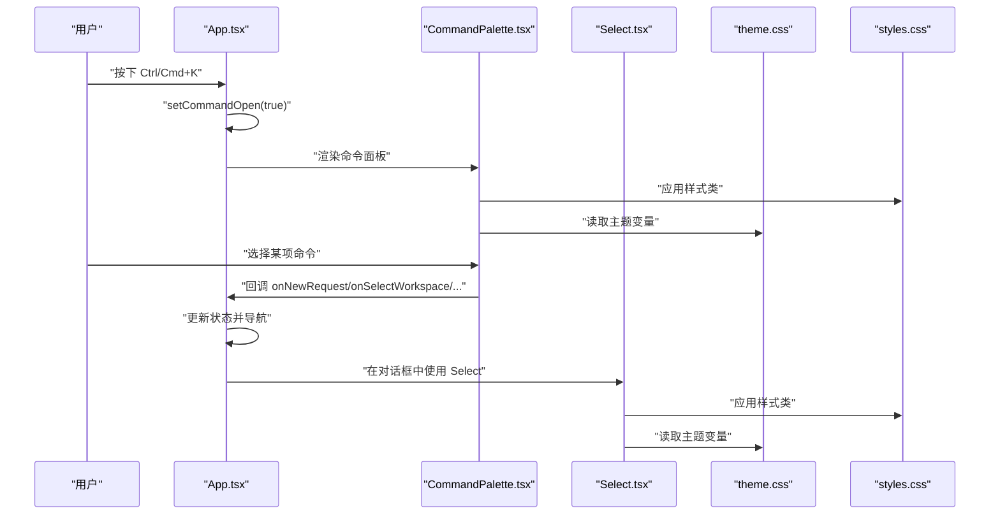
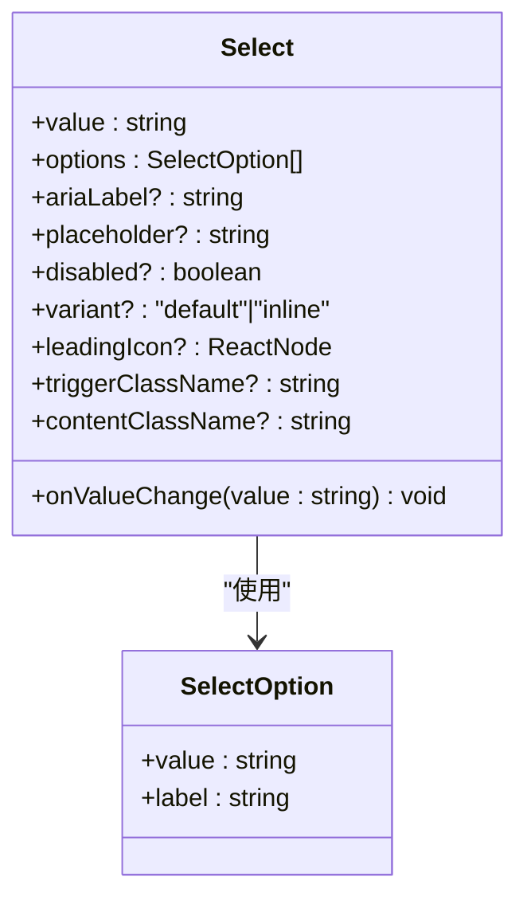
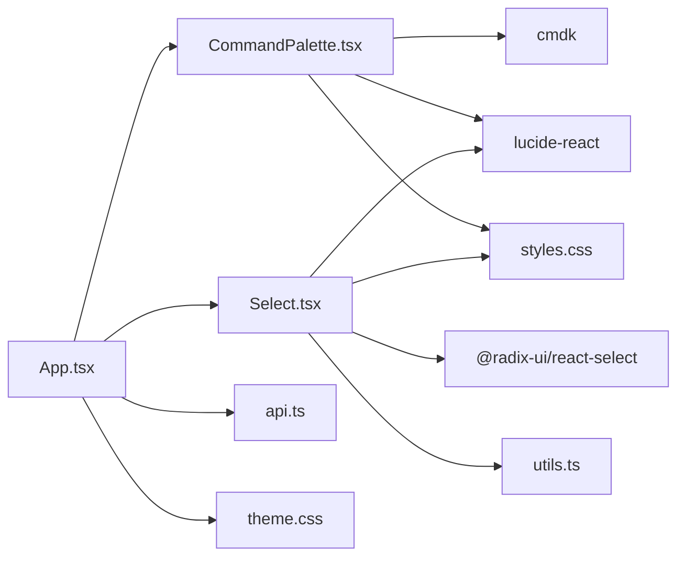

# 组件系统

<cite>
**本文引用的文件**
- [CommandPalette.tsx](file://apps/web/src/components/CommandPalette.tsx)
- [Select.tsx](file://apps/web/src/components/Select.tsx)
- [App.tsx](file://apps/web/src/App.tsx)
- [utils.ts](file://apps/web/src/lib/utils.ts)
- [styles.css](file://apps/web/src/styles.css)
- [theme.css](file://apps/web/src/theme.css)
- [api.ts](file://apps/web/src/api.ts)
- [main.tsx](file://apps/web/src/main.tsx)
</cite>

## 目录
1. [简介](#简介)
2. [项目结构](#项目结构)
3. [核心组件](#核心组件)
4. [架构总览](#架构总览)
5. [组件详解](#组件详解)
6. [依赖关系分析](#依赖关系分析)
7. [性能考量](#性能考量)
8. [故障排查指南](#故障排查指南)
9. [结论](#结论)
10. [附录](#附录)

## 简介
本文件面向 RepoHelm Web 应用中的组件系统，重点解析两个核心 UI 组件：CommandPalette（命令调色板）与 Select（下拉选择）。文档从设计理念、Props 接口设计、事件与状态管理、可复用性、性能优化与可访问性等方面进行深入说明，并提供使用示例与最佳实践建议，帮助开发者在保持一致主题风格的同时，高效扩展与维护组件体系。

## 项目结构
Web 应用位于 apps/web，组件主要集中在 src/components，样式与主题分别由 styles.css 与 theme.css 提供，工具函数通过 utils.ts 导出，入口文件 main.tsx 渲染根组件 App.tsx。组件与应用状态、键盘快捷键、主题切换等逻辑在 App.tsx 中集中管理。

图表来源
- [main.tsx:1-13](file://apps/web/src/main.tsx#L1-L13)
- [App.tsx:1-100](file://apps/web/src/App.tsx#L1-L100)
- [CommandPalette.tsx:1-101](file://apps/web/src/components/CommandPalette.tsx#L1-L101)
- [Select.tsx:1-69](file://apps/web/src/components/Select.tsx#L1-L69)
- [styles.css:1-120](file://apps/web/src/styles.css#L1-L120)
- [theme.css:1-176](file://apps/web/src/theme.css#L1-L176)
- [utils.ts:1-8](file://apps/web/src/lib/utils.ts#L1-L8)
- [api.ts:1-120](file://apps/web/src/api.ts#L1-L120)

章节来源
- [main.tsx:1-13](file://apps/web/src/main.tsx#L1-L13)
- [App.tsx:1-120](file://apps/web/src/App.tsx#L1-L120)

## 核心组件
- CommandPalette：基于 cmdk 的全局命令面板，支持主题切换、工作区切换、新建请求、创建工作区、打开设置与知识中心等动作。
- Select：基于 Radix Select 的主题化下拉选择器，支持默认与内联两种变体，支持前置图标、占位符、禁用态与自定义类名。

章节来源
- [CommandPalette.tsx:1-101](file://apps/web/src/components/CommandPalette.tsx#L1-L101)
- [Select.tsx:1-69](file://apps/web/src/components/Select.tsx#L1-L69)

## 架构总览
组件系统围绕 App.tsx 的状态与事件流组织，CommandPalette 作为顶层控制面板，Select 作为通用输入控件被广泛复用于对话框与工具栏。样式与主题通过 CSS 变量与 Tailwind 层级化方案统一管理，工具函数 cn 负责类名合并与去重。

图表来源
- [App.tsx:167-176](file://apps/web/src/App.tsx#L167-L176)
- [CommandPalette.tsx:1-101](file://apps/web/src/components/CommandPalette.tsx#L1-L101)
- [Select.tsx:1-69](file://apps/web/src/components/Select.tsx#L1-L69)
- [theme.css:1-176](file://apps/web/src/theme.css#L1-L176)
- [styles.css:1057-1139](file://apps/web/src/styles.css#L1057-L1139)

## 组件详解

### CommandPalette 命令调色板
- 设计理念
  - 全局快捷键触发，提供统一的上下文相关操作入口。
  - 基于 cmdk 的搜索与分组展示，支持键盘导航与无障碍标签。
  - 主题切换、工作区切换、新建请求、创建工作区、打开设置与知识中心等常用动作。
- Props 接口设计
  - open: 控制面板显隐
  - theme: 当前主题（light/dark）
  - workspaces: 工作区列表
  - onClose: 关闭回调
  - onNewRequest: 新建请求回调
  - onSelectWorkspace: 切换工作区回调
  - onCreateWorkspace: 创建工作区回调
  - onOpenSettings: 打开设置回调
  - onOpenKnowledge: 打开知识中心回调
  - onToggleTheme: 切换主题回调
- 事件与状态管理
  - 键盘监听：Esc 关闭；Ctrl/Cmd+K 触发。
  - run 包装器确保每次选择后自动关闭面板。
  - 工作区列表动态渲染，空时隐藏“切换 Workspace”分组。
- 可访问性
  - 使用 role="dialog"/"presentation"、aria-label、aria-haspopup 等语义化属性。
  - 自动聚焦输入框，提升键盘可达性。
- 性能优化
  - 条件渲染：仅在 open 为真时渲染。
  - 事件清理：useEffect 注册与卸载键盘监听。
  - 事件冒泡阻止：点击面板内部不关闭。
- 使用示例
  - 在 App.tsx 中通过 state 与 setter 控制 open 与 theme，并传入回调以驱动应用状态变更。
- 最佳实践
  - 将常用动作归类至“操作”分组，工作区动作置于“切换 Workspace”分组。
  - 为每个命令项提供清晰的文本与图标，必要时提供多语言关键词以提升搜索命中率。

```mermaid
flowchart TD
Start(["打开命令面板"]) --> KeyCheck["检测键盘事件"]
KeyCheck --> |Esc| Close["关闭面板"]
KeyCheck --> |Ctrl/Cmd+K| Toggle["切换 open 状态"]
Toggle --> Render["渲染面板内容"]
Render --> GroupOps["显示操作分组"]
Render --> GroupWS{"是否有工作区?"}
GroupWS --> |是| GroupWSList["显示切换工作区分组"]
GroupWS --> |否| SkipWS["跳过工作区分组"]
GroupWSList --> End
SkipWS --> End
Close --> End(["结束"])
```

图表来源
- [CommandPalette.tsx:29-40](file://apps/web/src/components/CommandPalette.tsx#L29-L40)
- [App.tsx:167-176](file://apps/web/src/App.tsx#L167-L176)

章节来源
- [CommandPalette.tsx:1-101](file://apps/web/src/components/CommandPalette.tsx#L1-L101)
- [App.tsx:631-656](file://apps/web/src/App.tsx#L631-L656)

### Select 下拉选择
- 设计理念
  - 基于 Radix UI 的可访问性与可定制性，完全主题化的触发器与下拉内容。
  - 支持默认与内联两种变体，适合不同场景（表单、工具栏、组合器）。
- Props 接口设计
  - value: 当前选中值
  - onValueChange: 值变更回调
  - options: 选项数组（SelectOption）
  - ariaLabel: 可访问性标签
  - placeholder: 占位符
  - disabled: 禁用态
  - variant: "default" | "inline"
  - leadingIcon: 前置图标
  - triggerClassName: 触发器自定义类名
  - contentClassName: 内容自定义类名
- 实现原理
  - 使用 Radix Root/Trigger/Content/Portal/Item 等部件构建弹出层。
  - 通过 cn 合并类名，支持变体与自定义样式。
  - 选项渲染采用映射，带指示器与文本。
- 扩展机制
  - 可通过 contentClassName/triggerClassName 注入自定义样式。
  - 可通过 leadingIcon 注入图标，适配工具栏场景。
  - 可通过 disabled 控制交互状态。
- 可访问性
  - 触发器与内容均具备可访问性属性，支持键盘导航与屏幕阅读器。
- 性能优化
  - 选项列表按需渲染，避免不必要的重排。
  - Portal 将内容挂载到文档根部，减少布局抖动。
- 使用示例
  - 在对话框或设置页中作为通用选择器，结合业务数据生成 options。
- 最佳实践
  - 为每个选项提供唯一 value 与可读 label。
  - 对于内联变体，注意最小高度与间距，保证工具栏紧凑性。

图表来源
- [Select.tsx:6-39](file://apps/web/src/components/Select.tsx#L6-L39)

章节来源
- [Select.tsx:1-69](file://apps/web/src/components/Select.tsx#L1-L69)
- [utils.ts:1-8](file://apps/web/src/lib/utils.ts#L1-L8)
- [styles.css:1057-1139](file://apps/web/src/styles.css#L1057-L1139)

## 依赖关系分析
- 组件依赖
  - CommandPalette 依赖 cmdk 与图标库，渲染时使用 CSS 类名与主题变量。
  - Select 依赖 @radix-ui/react-select，使用 cn 合并类名，样式由 styles.css 与 theme.css 驱动。
- 应用集成
  - App.tsx 通过状态与回调将 CommandPalette 与 Select 集成到主界面流程中，包括键盘快捷键、主题切换、工作区选择等。
- 外部依赖
  - 主题与字体通过 theme.css 注入，Tailwind 层级化引入以避免重置现有组件样式。
  - 图标库 lucide-react 提供视觉符号。

图表来源
- [CommandPalette.tsx:1-101](file://apps/web/src/components/CommandPalette.tsx#L1-L101)
- [Select.tsx:1-69](file://apps/web/src/components/Select.tsx#L1-L69)
- [App.tsx:1-120](file://apps/web/src/App.tsx#L1-L120)
- [utils.ts:1-8](file://apps/web/src/lib/utils.ts#L1-L8)
- [styles.css:1-120](file://apps/web/src/styles.css#L1-L120)
- [theme.css:1-176](file://apps/web/src/theme.css#L1-L176)
- [api.ts:1-120](file://apps/web/src/api.ts#L1-L120)

章节来源
- [App.tsx:1-120](file://apps/web/src/App.tsx#L1-L120)
- [CommandPalette.tsx:1-101](file://apps/web/src/components/CommandPalette.tsx#L1-L101)
- [Select.tsx:1-69](file://apps/web/src/components/Select.tsx#L1-L69)

## 性能考量
- 渲染控制
  - CommandPalette 在 open 为假时不渲染，降低 DOM 开销。
  - 事件监听在组件挂载时注册，在卸载时清理，避免内存泄漏。
- 样式与主题
  - 使用 CSS 变量与 Tailwind 层级化，避免重复样式计算。
  - cn 函数合并类名并去重，减少无效样式冲突。
- 可访问性与交互
  - 通过 aria-* 属性与 role 提升键盘可达性，减少不必要的焦点移动。
- 可扩展性
  - Select 的变体与类名注入接口便于在不同容器中快速复用。

[本节为通用指导，无需特定文件来源]

## 故障排查指南
- 命令面板无法关闭
  - 检查是否正确绑定 onClose 回调，确认 run 包装器是否生效。
  - 确认 Esc 键盘事件是否被其他元素拦截。
- 主题切换无效
  - 检查 data-theme 属性是否正确写入 html 元素。
  - 确认 theme.css 是否加载且未被覆盖。
- 下拉选择不可用
  - 检查 disabled 与 value 是否正确传递。
  - 确认 Portal 渲染目标是否存在，内容是否被遮挡。
- 样式异常
  - 检查 cn 合并后的类名顺序与 Tailwind 层级是否冲突。
  - 确认 CSS 变量是否在当前主题下存在。

章节来源
- [CommandPalette.tsx:29-40](file://apps/web/src/components/CommandPalette.tsx#L29-L40)
- [App.tsx:158-165](file://apps/web/src/App.tsx#L158-L165)
- [Select.tsx:41-67](file://apps/web/src/components/Select.tsx#L41-L67)
- [styles.css:1057-1139](file://apps/web/src/styles.css#L1057-L1139)
- [theme.css:14-176](file://apps/web/src/theme.css#L14-L176)

## 结论
RepoHelm 的组件系统以简洁、可复用、可访问为核心设计原则。CommandPalette 与 Select 分别承担全局命令入口与通用选择输入职责，二者均通过主题变量与样式类名实现一致的视觉与交互体验。通过合理的 Props 设计、事件与状态管理、以及样式与主题的解耦，组件体系既满足当前业务需求，又为后续扩展提供了清晰的路径。

[本节为总结，无需特定文件来源]

## 附录

### 使用示例与最佳实践
- CommandPalette
  - 在 App.tsx 中监听 Ctrl/Cmd+K，切换 open 状态。
  - 为每个动作提供明确的回调，确保状态同步与导航。
  - 为常用命令提供多关键词，提升搜索命中率。
- Select
  - 在对话框中使用 default 变体，工具栏中使用 inline 变体。
  - 通过 leadingIcon 与 placeholder 提升可读性。
  - 使用 contentClassName/triggerClassName 注入自定义样式，保持一致性。

章节来源
- [App.tsx:167-176](file://apps/web/src/App.tsx#L167-L176)
- [CommandPalette.tsx:51-99](file://apps/web/src/components/CommandPalette.tsx#L51-L99)
- [Select.tsx:17-39](file://apps/web/src/components/Select.tsx#L17-L39)
- [styles.css:1057-1139](file://apps/web/src/styles.css#L1057-L1139)