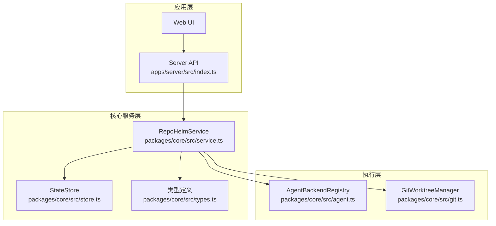
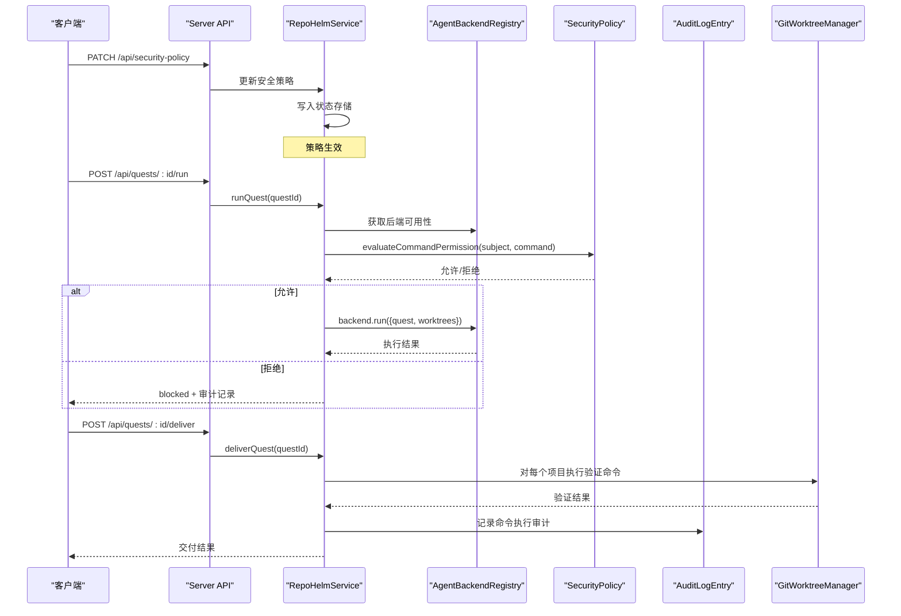
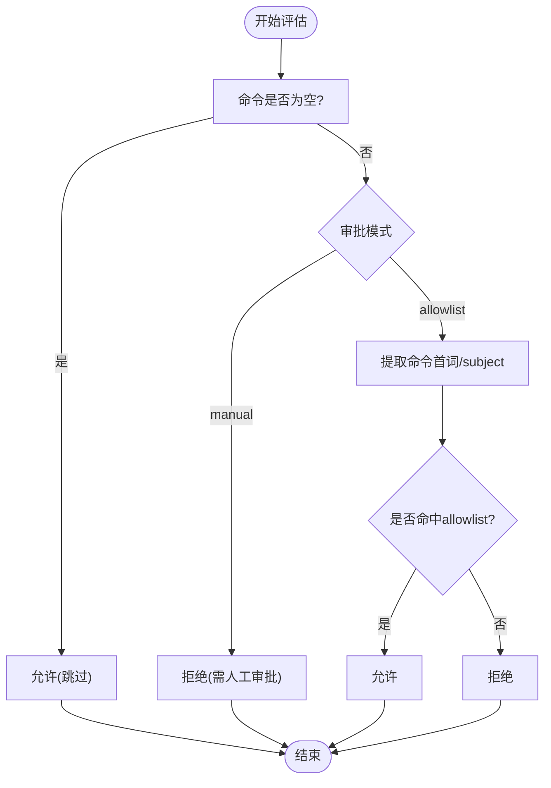
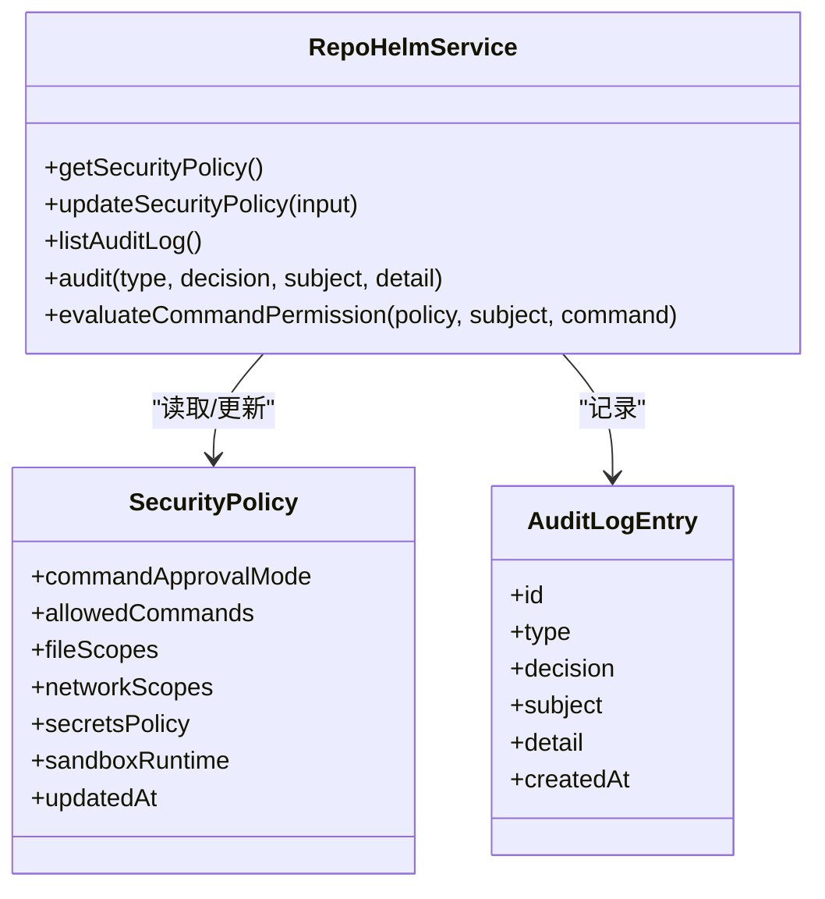
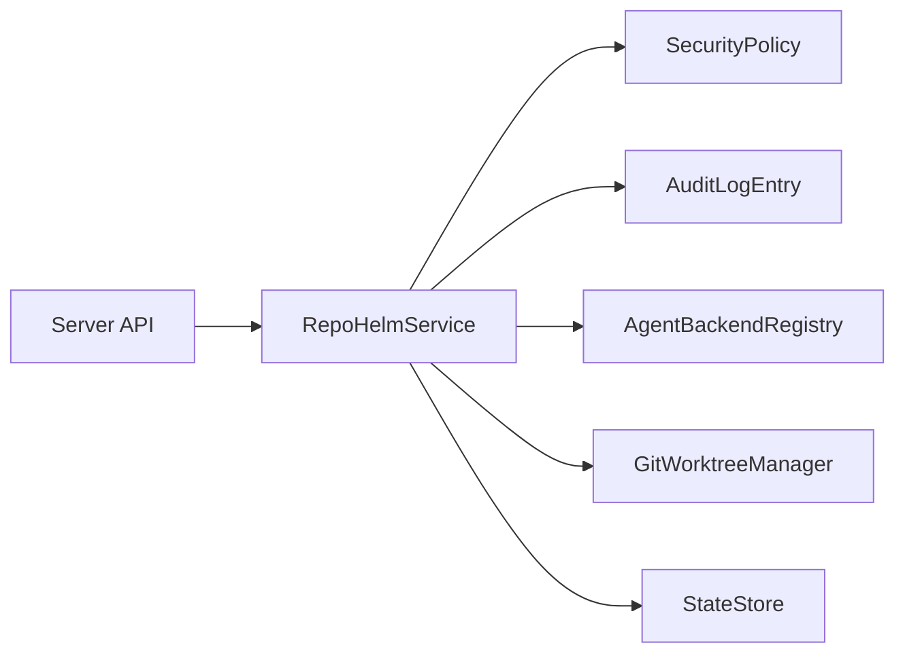

# 安全策略和权限控制

<cite>
**本文档引用的文件**
- [packages/core/src/service.ts](file://packages/core/src/service.ts)
- [packages/core/src/agent.ts](file://packages/core/src/agent.ts)
- [packages/core/src/types.ts](file://packages/core/src/types.ts)
- [packages/core/src/store.ts](file://packages/core/src/store.ts)
- [packages/core/src/git.ts](file://packages/core/src/git.ts)
- [apps/server/src/index.ts](file://apps/server/src/index.ts)
- [README.md](file://README.md)
</cite>

## 目录
1. [简介](#简介)
2. [项目结构](#项目结构)
3. [核心组件](#核心组件)
4. [架构总览](#架构总览)
5. [详细组件分析](#详细组件分析)
6. [依赖关系分析](#依赖关系分析)
7. [性能考量](#性能考量)
8. [故障排查指南](#故障排查指南)
9. [结论](#结论)
10. [附录](#附录)

## 简介
本文件聚焦 RepoHelm 的安全策略与权限控制体系，涵盖命令审批模式、文件作用域与网络作用域控制、密钥策略与沙箱运行时、审计日志记录与管理、与 Agent 后端的安全集成、威胁模型与防护措施、安全事件检测与响应、合规与审计实施以及漏洞预防与处理建议。内容基于代码库中的实际实现进行梳理与可视化说明，帮助读者快速理解并正确配置与使用 RepoHelm 的安全能力。

## 项目结构
RepoHelm 的安全相关能力主要集中在核心服务模块（RepoHelmService）、Agent 后端注册与执行、类型定义与状态存储等模块中，Web 服务器提供安全策略与审计日志的 API 入口。

图表来源
- [apps/server/src/index.ts:1-366](file://apps/server/src/index.ts#L1-L366)
- [packages/core/src/service.ts:56-1331](file://packages/core/src/service.ts#L56-L1331)
- [packages/core/src/store.ts:1-166](file://packages/core/src/store.ts#L1-L166)
- [packages/core/src/agent.ts:395-436](file://packages/core/src/agent.ts#L395-L436)
- [packages/core/src/git.ts:33-343](file://packages/core/src/git.ts#L33-L343)

章节来源
- [apps/server/src/index.ts:1-366](file://apps/server/src/index.ts#L1-L366)
- [packages/core/src/service.ts:56-1331](file://packages/core/src/service.ts#L56-L1331)
- [packages/core/src/store.ts:1-166](file://packages/core/src/store.ts#L1-L166)
- [packages/core/src/agent.ts:395-436](file://packages/core/src/agent.ts#L395-L436)
- [packages/core/src/git.ts:33-343](file://packages/core/src/git.ts#L33-L343)

## 核心组件
- 安全策略模型（SecurityPolicy）：定义命令审批模式、允许命令列表、文件作用域、网络作用域、密钥策略与沙箱运行时。
- 命令权限评估（evaluateCommandPermission）：根据策略与主题（如 backend id 或 subject）判断命令是否允许执行。
- 审计日志（AuditLogEntry）：记录命令、文件、网络、密钥、能力、沙箱等类型的决策与详情。
- Agent 后端注册与执行：提供多种后端（Mock、External CLI、OpenAI-compatible），并在执行前后进行权限评估与审计。
- Git 工作树与交付前验证：在交付阶段对项目配置的验证命令进行沙箱式执行与审计。

章节来源
- [packages/core/src/types.ts:135-152](file://packages/core/src/types.ts#L135-L152)
- [packages/core/src/service.ts:1257-1278](file://packages/core/src/service.ts#L1257-L1278)
- [packages/core/src/service.ts:1280-1289](file://packages/core/src/service.ts#L1280-L1289)
- [packages/core/src/agent.ts:395-436](file://packages/core/src/agent.ts#L395-L436)
- [packages/core/src/git.ts:159-187](file://packages/core/src/git.ts#L159-L187)

## 架构总览
RepoHelm 的安全架构围绕“策略驱动的命令审批 + 作用域限制 + 审计日志 + 沙箱执行”展开。Server API 提供安全策略与审计日志的读写入口，RepoHelmService 在关键执行点（Agent 后端运行、交付前验证）进行权限评估与审计记录。

图表来源
- [apps/server/src/index.ts:199-203](file://apps/server/src/index.ts#L199-L203)
- [apps/server/src/index.ts:323-341](file://apps/server/src/index.ts#L323-L341)
- [packages/core/src/service.ts:590-615](file://packages/core/src/service.ts#L590-L615)
- [packages/core/src/service.ts:783-800](file://packages/core/src/service.ts#L783-L800)
- [packages/core/src/service.ts:1257-1278](file://packages/core/src/service.ts#L1257-L1278)
- [packages/core/src/agent.ts:395-436](file://packages/core/src/agent.ts#L395-L436)
- [packages/core/src/git.ts:159-187](file://packages/core/src/git.ts#L159-L187)

## 详细组件分析

### 命令审批模式与权限评估
- 命令审批模式
  - allowlist：仅允许策略中列出的命令或主题匹配的命令执行。
  - manual：需要人工审批，禁止自动执行。
- 权限评估规则
  - 若命令为空字符串，则视为跳过处理，允许。
  - 若审批模式为 manual，则拒绝自动执行。
  - 否则以命令首词或 subject 与 allowedCommands 列表匹配决定允许与否。
- 审计记录
  - 在 Agent 后端运行与交付前验证阶段记录审计条目，包含类型、决策、主体与详情。

图表来源
- [packages/core/src/service.ts:1257-1278](file://packages/core/src/service.ts#L1257-L1278)

章节来源
- [packages/core/src/service.ts:1257-1278](file://packages/core/src/service.ts#L1257-L1278)
- [packages/core/src/service.ts:590-615](file://packages/core/src/service.ts#L590-L615)
- [packages/core/src/service.ts:783-800](file://packages/core/src/service.ts#L783-L800)

### 文件作用域控制
- 文件作用域定义了命令执行可访问的文件范围，例如 workspace、worktree、knowledge 等。
- 作用域控制通过策略配置实现，结合工作树隔离（Git worktree）进一步限制变更范围。
- 在 Agent 后端执行时，命令在受控的工作树路径内运行，避免越权访问其他路径。

章节来源
- [packages/core/src/types.ts:138-138](file://packages/core/src/types.ts#L138-L138)
- [packages/core/src/agent.ts:223-249](file://packages/core/src/agent.ts#L223-L249)
- [packages/core/src/git.ts:79-120](file://packages/core/src/git.ts#L79-L120)

### 网络作用域控制
- 网络作用域限制命令执行可访问的网络范围，默认仅允许 localhost。
- 通过策略配置网络作用域，可在运行外部 CLI 或调用兼容 Provider 时限制网络访问范围。

章节来源
- [packages/core/src/types.ts:139-139](file://packages/core/src/types.ts#L139-L139)
- [packages/core/src/agent.ts:223-249](file://packages/core/src/agent.ts#L223-L249)

### 密钥策略与沙箱运行时
- 密钥策略
  - redact-env：在执行环境中对敏感信息进行脱敏处理。
  - deny：严格禁止密钥注入或使用。
- 沙箱运行时
  - local：在本地执行，结合工作树隔离与网络/文件作用域限制。
  - external：预留外部沙箱运行时（当前默认仍为 local）。

章节来源
- [packages/core/src/types.ts:140-141](file://packages/core/src/types.ts#L140-L141)
- [packages/core/src/store.ts:13-21](file://packages/core/src/store.ts#L13-L21)

### 审计日志记录与管理
- 审计条目类型包括 command、file、network、secrets、capability、sandbox。
- 记录时机
  - Agent 后端运行：记录命令执行的允许/拒绝决策。
  - 交付前验证：记录项目验证命令的执行结果与审计。
- API 入口
  - GET /api/security-policy：获取当前安全策略。
  - PATCH /api/security-policy：更新安全策略。
  - GET /api/audit-log：获取审计日志列表。

图表来源
- [packages/core/src/types.ts:135-152](file://packages/core/src/types.ts#L135-L152)
- [packages/core/src/service.ts:894-912](file://packages/core/src/service.ts#L894-L912)
- [packages/core/src/service.ts:1280-1289](file://packages/core/src/service.ts#L1280-L1289)
- [packages/core/src/service.ts:1257-1278](file://packages/core/src/service.ts#L1257-L1278)

章节来源
- [apps/server/src/index.ts:194-208](file://apps/server/src/index.ts#L194-L208)
- [packages/core/src/service.ts:894-912](file://packages/core/src/service.ts#L894-L912)
- [packages/core/src/service.ts:1280-1289](file://packages/core/src/service.ts#L1280-L1289)

### 与 Agent 后端的安全集成
- 后端类型
  - Mock：内置后端，用于演示与验证。
  - External CLI：通过环境变量配置外部 CLI 命令模板，在工作树中执行。
  - OpenAI-compatible：通过兼容接口调用 Provider，生成实现产物。
- 安全集成点
  - 后端可用性检查：确保命令模板与工作树存在。
  - 权限评估：在运行前调用 evaluateCommandPermission，若拒绝则阻断执行并记录审计。
  - 输入安全：向工作树写入标准化输入 JSON，避免命令注入。
  - 输出采集：收集 stdout/stderr、退出码与 diff，形成可审查产物。

```mermaid
sequenceDiagram
participant Svc as "RepoHelmService"
participant Reg as "AgentBackendRegistry"
participant Backend as "AgentBackend"
participant Policy as "SecurityPolicy"
participant Audit as "AuditLogEntry"
Svc->>Reg : get(backendId)
Reg-->>Svc : AgentBackend
Svc->>Backend : getAvailability()
Svc->>Policy : evaluateCommandPermission(subject, command)
Policy-->>Svc : allowed/denied
alt allowed
Svc->>Backend : run({quest, worktrees})
Backend-->>Svc : events/results
else denied
Svc->>Audit : audit("command", "denied", ...)
Svc-->>Svc : 返回 blocked 结果
end
```

图表来源
- [packages/core/src/agent.ts:395-436](file://packages/core/src/agent.ts#L395-L436)
- [packages/core/src/service.ts:590-615](file://packages/core/src/service.ts#L590-L615)
- [packages/core/src/service.ts:1257-1278](file://packages/core/src/service.ts#L1257-L1278)
- [packages/core/src/service.ts:1280-1289](file://packages/core/src/service.ts#L1280-L1289)

章节来源
- [packages/core/src/agent.ts:117-259](file://packages/core/src/agent.ts#L117-L259)
- [packages/core/src/agent.ts:261-393](file://packages/core/src/agent.ts#L261-L393)
- [packages/core/src/agent.ts:395-436](file://packages/core/src/agent.ts#L395-L436)

### 交付前验证与沙箱执行
- 交付前验证命令来自项目配置，RepoHelm 在工作树中以受限环境执行该命令，避免对生产环境造成影响。
- 执行过程包含超时控制、环境变量设置与输出捕获，失败时记录审计并阻断交付流程。

章节来源
- [packages/core/src/git.ts:159-187](file://packages/core/src/git.ts#L159-L187)
- [packages/core/src/service.ts:783-800](file://packages/core/src/service.ts#L783-L800)

## 依赖关系分析
- RepoHelmService 依赖 SecurityPolicy、AuditLogEntry、AgentBackendRegistry、GitWorktreeManager 与 StateStore。
- Server API 依赖 RepoHelmService 提供安全策略与审计日志的读写接口。
- Agent 后端通过环境变量与工作树隔离实现安全执行。

图表来源
- [apps/server/src/index.ts:194-208](file://apps/server/src/index.ts#L194-L208)
- [packages/core/src/service.ts:56-1331](file://packages/core/src/service.ts#L56-L1331)
- [packages/core/src/store.ts:86-166](file://packages/core/src/store.ts#L86-L166)

章节来源
- [apps/server/src/index.ts:194-208](file://apps/server/src/index.ts#L194-L208)
- [packages/core/src/service.ts:56-1331](file://packages/core/src/service.ts#L56-L1331)
- [packages/core/src/store.ts:86-166](file://packages/core/src/store.ts#L86-L166)

## 性能考量
- 命令权限评估为 O(n) 的列表查找，n 为 allowedCommands 数量，通常较小，开销可忽略。
- 审计日志写入为内存追加，批量写入由状态存储统一持久化，避免频繁 IO。
- 外部 CLI 与 Provider 调用受网络与外部服务影响，建议合理设置超时与缓存策略。

## 故障排查指南
- 命令被拒绝
  - 检查安全策略的 commandApprovalMode 与 allowedCommands 是否包含目标命令或 subject。
  - 若为 manual 模式，需在 UI 中进行人工审批。
- 审计日志为空
  - 确认服务已记录审计条目，可通过 GET /api/audit-log 查询。
- 外部 CLI 未执行
  - 检查后端可用性与环境变量配置，确认工作树存在且命令模板有效。
- 交付前验证失败
  - 检查项目配置的验证命令是否正确，查看输出与错误信息。

章节来源
- [packages/core/src/service.ts:1257-1278](file://packages/core/src/service.ts#L1257-L1278)
- [packages/core/src/service.ts:1280-1289](file://packages/core/src/service.ts#L1280-L1289)
- [packages/core/src/agent.ts:125-142](file://packages/core/src/agent.ts#L125-L142)
- [packages/core/src/git.ts:159-187](file://packages/core/src/git.ts#L159-L187)

## 结论
RepoHelm 的安全策略以“策略驱动 + 作用域限制 + 审计日志 + 沙箱执行”为核心，通过 allowlist 与 manual 两种审批模式控制命令执行，结合文件与网络作用域、密钥策略与沙箱运行时，形成完整的安全闭环。Server API 提供安全策略与审计日志的统一入口，便于运维与合规管理。建议在生产环境中启用 allowlist 模式、最小化 allowedCommands 与网络作用域、严格管理密钥策略，并定期审计日志以发现潜在风险。

## 附录

### 安全策略配置示例与最佳实践
- 命令审批模式
  - 生产环境建议使用 allowlist，仅允许必要的命令（如 git、pnpm、mock 等）。
  - 开发/演示环境可使用 manual，配合人工审批流程。
- 允许命令列表
  - 最小化原则：仅包含确需的命令。
  - 主题匹配：可将 subject（如 backend id）加入 allowlist 以简化策略。
- 文件作用域
  - 限定在 workspace、worktree、knowledge 等必要范围。
- 网络作用域
  - 默认 localhost，必要时可扩展至可信域名。
- 密钥策略
  - 生产环境优先使用 redact-env，避免泄露敏感信息。
  - 如需严格限制，可使用 deny。
- 沙箱运行时
  - 默认 local，结合工作树隔离与作用域限制。
  - external 沙箱需在满足安全基线后再启用。

章节来源
- [packages/core/src/store.ts:13-21](file://packages/core/src/store.ts#L13-L21)
- [packages/core/src/types.ts:135-143](file://packages/core/src/types.ts#L135-L143)
- [README.md:92-92](file://README.md#L92)

### 与 Agent 后端的安全集成要点
- External CLI
  - 通过环境变量配置命令模板，确保命令模板与工作树路径一致。
  - 限制网络访问范围，避免访问不受信任的外部资源。
- OpenAI-compatible Provider
  - 通过环境变量配置 base_url、model 与 api_key，避免硬编码。
  - 限制网络作用域，仅允许访问可信的 Provider 地址。
- Mock 后端
  - 仅用于演示与验证，不应用于生产。

章节来源
- [packages/core/src/agent.ts:117-259](file://packages/core/src/agent.ts#L117-L259)
- [packages/core/src/agent.ts:261-393](file://packages/core/src/agent.ts#L261-L393)

### 审计日志管理
- 定期导出与归档审计日志，保留至少 90 天以上。
- 关注 denied 类型的审计条目，及时调查与处置。
- 与 SIEM/日志平台对接，实现告警与联动处置。

章节来源
- [apps/server/src/index.ts:204-208](file://apps/server/src/index.ts#L204-L208)
- [packages/core/src/service.ts:1280-1289](file://packages/core/src/service.ts#L1280-L1289)

### 合规与安全审计
- 依据组织安全基线调整 allowlist 与作用域。
- 对密钥策略进行定期评审，确保符合最小权限原则。
- 对审计日志进行周期性合规检查，满足内部与外部审计要求。

章节来源
- [README.md:92-92](file://README.md#L92)

### 安全威胁模型与防护措施
- 威胁
  - 命令注入与越权执行：通过 allowlist 与作用域限制缓解。
  - 密钥泄露：通过 redact-env/deny 策略与最小权限原则缓解。
  - 网络外泄：通过网络作用域限制与沙箱运行时缓解。
- 防护
  - 强制使用 allowlist 模式。
  - 严格限制文件与网络作用域。
  - 对外部 CLI 与 Provider 的访问进行白名单控制。
  - 审计日志全程留痕，支持溯源与取证。

章节来源
- [packages/core/src/service.ts:1257-1278](file://packages/core/src/service.ts#L1257-L1278)
- [packages/core/src/agent.ts:223-249](file://packages/core/src/agent.ts#L223-L249)
- [packages/core/src/git.ts:159-187](file://packages/core/src/git.ts#L159-L187)

### 安全事件检测与响应
- 检测
  - 监控 denied 审计条目与异常命令执行。
  - 关注外部 CLI/Provider 的异常调用与错误。
- 响应
  - 立即暂停相关后端执行，隔离受影响工作树。
  - 回溯审计日志，定位攻击面与影响范围。
  - 修复策略配置，补充白名单或收紧限制。

章节来源
- [packages/core/src/service.ts:1280-1289](file://packages/core/src/service.ts#L1280-L1289)
- [packages/core/src/agent.ts:144-221](file://packages/core/src/agent.ts#L144-L221)

### 漏洞预防与处理建议
- 预防
  - 定期评审与更新 allowlist。
  - 限制网络作用域，避免访问不受信任地址。
  - 对密钥进行集中管理与轮换。
- 处理
  - 发现漏洞后立即禁用相关后端与命令。
  - 通过审计日志定位受影响范围并回滚。
  - 修复后进行回归测试与再次审计。

章节来源
- [packages/core/src/store.ts:13-21](file://packages/core/src/store.ts#L13-L21)
- [packages/core/src/service.ts:1257-1278](file://packages/core/src/service.ts#L1257-L1278)