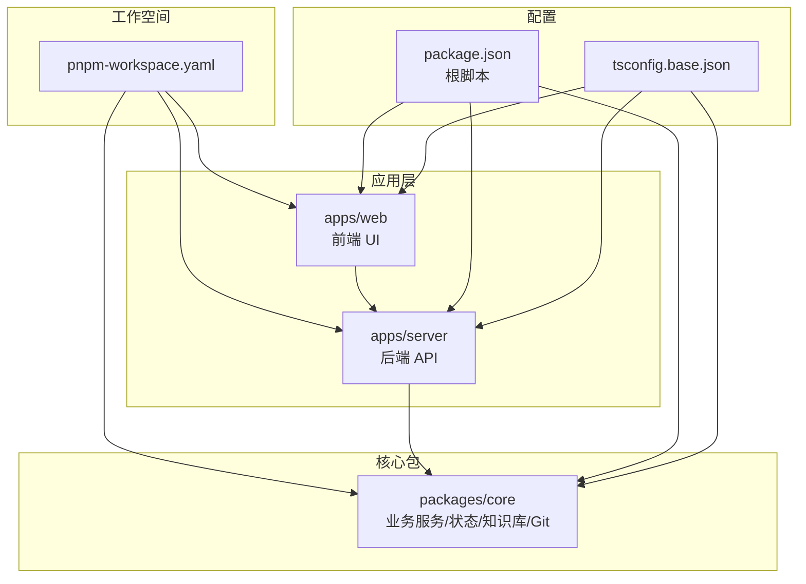
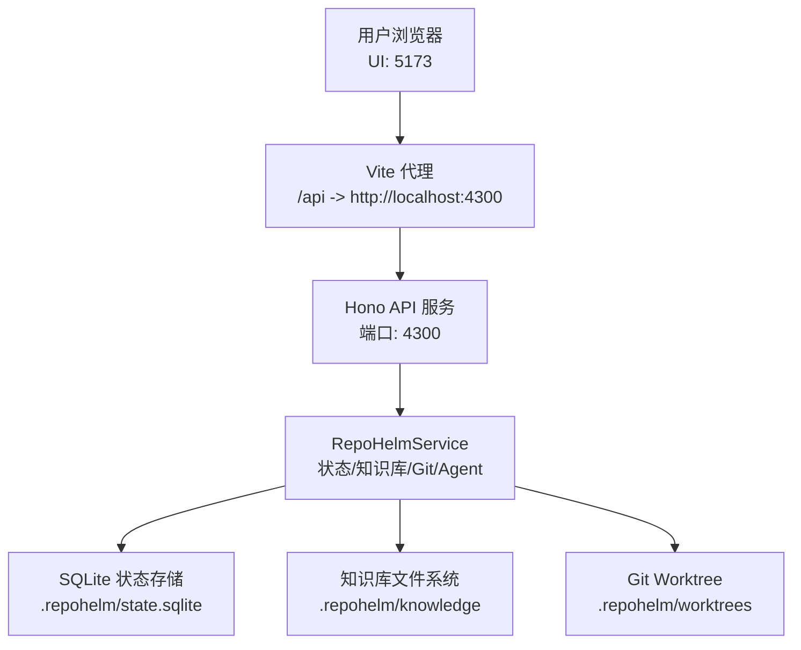
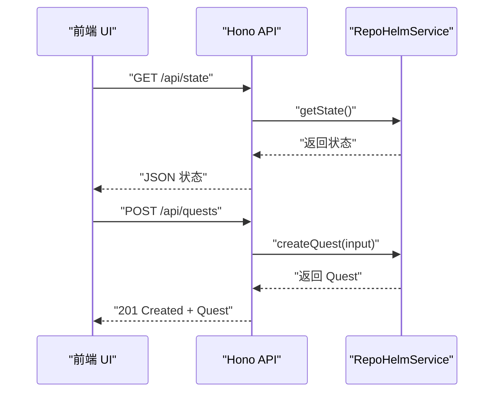
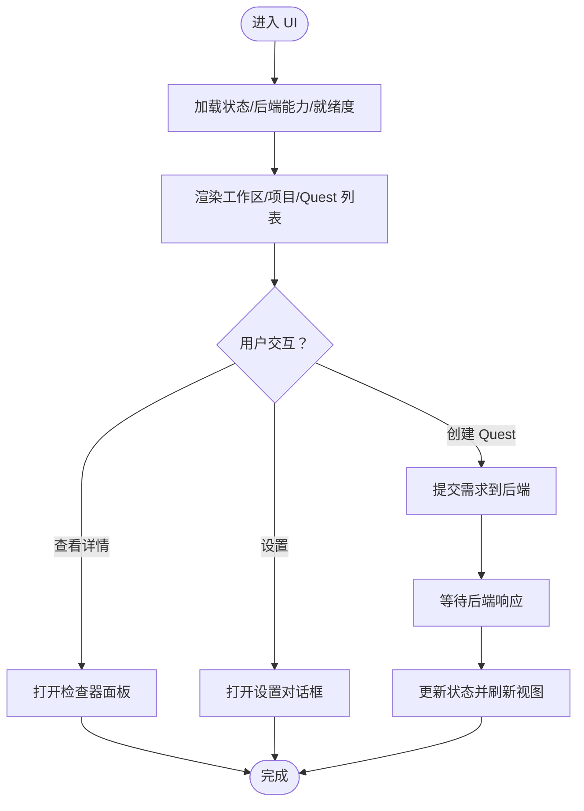
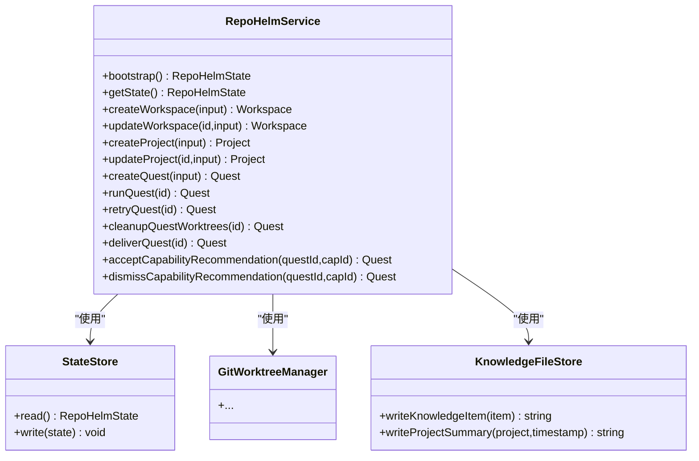
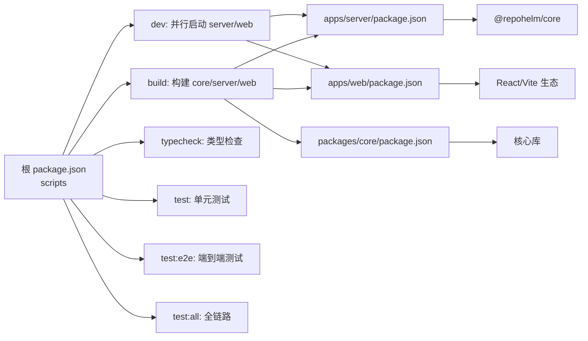

# 快速开始

<cite>
**本文引用的文件**
- [README.md](file://README.md)
- [package.json](file://package.json)
- [pnpm-workspace.yaml](file://pnpm-workspace.yaml)
- [tsconfig.base.json](file://tsconfig.base.json)
- [apps/server/package.json](file://apps/server/package.json)
- [apps/server/src/index.ts](file://apps/server/src/index.ts)
- [apps/web/package.json](file://apps/web/package.json)
- [apps/web/vite.config.ts](file://apps/web/vite.config.ts)
- [apps/web/src/main.tsx](file://apps/web/src/main.tsx)
- [packages/core/package.json](file://packages/core/package.json)
- [packages/core/src/service.ts](file://packages/core/src/service.ts)
- [playwright.config.ts](file://playwright.config.ts)
- [e2e/quest-workspace.spec.ts](file://e2e/quest-workspace.spec.ts)
</cite>

## 目录
1. [简介](#简介)
2. [项目结构](#项目结构)
3. [核心组件](#核心组件)
4. [架构总览](#架构总览)
5. [详细组件分析](#详细组件分析)
6. [依赖分析](#依赖分析)
7. [性能考虑](#性能考虑)
8. [故障排除指南](#故障排除指南)
9. [结论](#结论)
10. [附录](#附录)

## 简介
RepoHelm 是一个用于验证“虚拟 workspace + 多项目 Quest + Spec 驱动 + worktree 隔离 + Agent 编排 + 知识库”的产品方向的开源原型。当前版本为 MVP 骨架，已具备启动本地 Web UI 与 API、自动创建 demo workspace、关联项目、编辑 workspace 配置、项目健康检查、SQLite 状态持久化与迁移、知识库文件写入、创建与运行 Quest、Git worktree 管理、交付与 PR handoff、安全策略与审计日志、产品就绪度展示等能力。

## 项目结构
该项目采用 pnpm workspace 组织，核心模块分为三部分：
- 应用层（apps）
  - server：基于 Hono 的后端 API 服务
  - web：基于 Vite + React 的前端 UI
- 核心包（packages）
  - core：业务服务、状态存储、Git 管理、知识库、Agent 后端注册等
- 其他
  - 文档、端到端测试、工作树样例等

图表来源
- [pnpm-workspace.yaml:1-5](file://pnpm-workspace.yaml#L1-L5)
- [package.json:1-21](file://package.json#L1-L21)
- [apps/server/package.json:1-22](file://apps/server/package.json#L1-L22)
- [apps/web/package.json:1-34](file://apps/web/package.json#L1-L34)
- [packages/core/package.json:1-21](file://packages/core/package.json#L1-L21)
- [tsconfig.base.json:1-14](file://tsconfig.base.json#L1-L14)

章节来源
- [pnpm-workspace.yaml:1-5](file://pnpm-workspace.yaml#L1-L5)
- [package.json:1-21](file://package.json#L1-L21)
- [tsconfig.base.json:1-14](file://tsconfig.base.json#L1-L14)

## 核心组件
- 后端 API（apps/server）
  - 提供健康检查、状态查询、引擎与 Provider 管理、安全策略、审计日志、产品就绪度、工作区与项目 CRUD、Quest 生命周期管理、工作树列表与操作、知识库检索等接口
  - 默认监听端口可通过环境变量配置，默认 4300
- 前端 UI（apps/web）
  - 通过 Vite 开发服务器运行，端口 5173，并代理 /api 到后端
  - 通过统一的 API 模块与后端交互，加载初始状态、渲染工作区与 Quest、展示知识库、文件变更与 diff、安全策略与审计日志、产品就绪度等
- 核心服务（packages/core）
  - RepoHelmService 负责状态引导（首次启动自动生成 demo workspace、关联项目、写入知识库）、工作区与项目管理、Quest 生命周期、Git worktree 管理、知识库文件写入、Agent 后端与 Provider 注册、安全策略与审计日志等

章节来源
- [apps/server/src/index.ts:114-366](file://apps/server/src/index.ts#L114-L366)
- [apps/web/vite.config.ts:1-16](file://apps/web/vite.config.ts#L1-L16)
- [apps/web/src/main.tsx:1-13](file://apps/web/src/main.tsx#L1-L13)
- [packages/core/src/service.ts:73-137](file://packages/core/src/service.ts#L73-L137)

## 架构总览
下图展示了前端 UI、后端 API 与核心服务之间的交互关系，以及开发时的代理与端口映射。

图表来源
- [apps/web/vite.config.ts:9-14](file://apps/web/vite.config.ts#L9-L14)
- [apps/server/src/index.ts:36-49](file://apps/server/src/index.ts#L36-L49)
- [packages/core/src/service.ts:64-71](file://packages/core/src/service.ts#L64-L71)

## 详细组件分析

### 后端 API（Hono）组件
- 关键职责
  - CORS 与日志中间件
  - 健康检查与状态导出
  - 引擎配置、Provider 列表与测试、模型枚举
  - 安全策略与审计日志
  - 工作区与项目管理、工作树列表
  - Quest 生命周期：创建、运行、重试、清理、交付、能力接受/忽略
  - 知识库检索与搜索
  - 本地 CLI 扫描与测试、macOS 目录选择器、分支枚举、打开目录
- 端口与跨域
  - 默认端口 4300，允许来自前端地址的跨域请求
- 环境变量
  - 可通过环境变量指定根目录、状态目录、工作树目录、知识库目录、端口等

图表来源
- [apps/server/src/index.ts:125-128](file://apps/server/src/index.ts#L125-L128)
- [apps/server/src/index.ts:317-321](file://apps/server/src/index.ts#L317-L321)
- [packages/core/src/service.ts:135-137](file://packages/core/src/service.ts#L135-L137)

章节来源
- [apps/server/src/index.ts:114-366](file://apps/server/src/index.ts#L114-L366)

### 前端 UI 组件
- 关键职责
  - 初始化加载状态、Agent 后端与产品就绪度
  - 工作区与项目选择、Quest 列表与详情
  - 知识库搜索与展示、变更文件与 diff 查看
  - 安全策略与审计日志查看、产品就绪度面板
  - 设置面板：仓库管理、执行模式（本机 CLI、BYOK）、主题切换
- 代理与端口
  - Vite 开发服务器端口 5173，/api 代理到后端 4300
- 主题与布局
  - 支持亮/暗主题，侧边栏与检查器宽度持久化

图表来源
- [apps/web/src/App.tsx:136-152](file://apps/web/src/App.tsx#L136-L152)
- [apps/web/vite.config.ts:9-14](file://apps/web/vite.config.ts#L9-L14)

章节来源
- [apps/web/src/main.tsx:1-13](file://apps/web/src/main.tsx#L1-L13)
- [apps/web/vite.config.ts:1-16](file://apps/web/vite.config.ts#L1-L16)
- [apps/web/src/App.tsx:85-200](file://apps/web/src/App.tsx#L85-L200)

### 核心服务（RepoHelmService）
- 关键职责
  - 状态引导：若无工作区则自动生成 demo workspace、关联当前仓库、写入架构与项目摘要知识
  - 工作区与项目 CRUD、工作树管理、知识库文件写入
  - Quest 生命周期：创建、运行、重试、清理、交付、能力接受/忽略
  - Agent 后端与 Provider 注册、本地 CLI 扫描与测试
  - 安全策略与审计日志
- 存储与知识库
  - 状态存储默认使用 SQLite；知识库文件写入 Markdown 并配合 SQLite 元数据

图表来源
- [packages/core/src/service.ts:56-71](file://packages/core/src/service.ts#L56-L71)
- [packages/core/src/service.ts:73-137](file://packages/core/src/service.ts#L73-L137)

章节来源
- [packages/core/src/service.ts:73-137](file://packages/core/src/service.ts#L73-L137)

## 依赖分析
- 根级脚本
  - dev：并行构建 core 并启动 server 与 web
  - build/typecheck/test/test:e2e/test:all：分别对应构建、类型检查、单元测试、端到端测试与全链路执行
- 依赖关系
  - apps/server 依赖 @repohelm/core
  - apps/web 为纯前端应用，通过 /api 与后端通信
  - packages/core 为共享业务核心，被 server 与测试用例使用

图表来源
- [package.json:7-14](file://package.json#L7-L14)
- [apps/server/package.json:11-16](file://apps/server/package.json#L11-L16)
- [apps/web/package.json:11-26](file://apps/web/package.json#L11-L26)
- [packages/core/package.json:8-12](file://packages/core/package.json#L8-L12)

章节来源
- [package.json:7-14](file://package.json#L7-L14)
- [apps/server/package.json:1-22](file://apps/server/package.json#L1-L22)
- [apps/web/package.json:1-34](file://apps/web/package.json#L1-L34)
- [packages/core/package.json:1-21](file://packages/core/package.json#L1-L21)

## 性能考虑
- 并行启动：根脚本使用并发工具并行启动前后端，缩短冷启动时间
- 代理与缓存：Vite 开发服务器代理 API，减少跨域与重复请求
- 状态与知识库：SQLite 与文件系统结合，避免复杂数据库初始化开销
- 端到端测试隔离：使用独立状态目录，避免与本地开发状态互相影响

## 故障排除指南
- 启动失败或端口占用
  - 确认端口 5173（前端）与 4300（后端）未被占用
  - 如需修改端口，可在前端配置中调整，后端可通过环境变量设置
- CORS 或跨域错误
  - 确保前端代理指向后端 4300，且后端允许前端来源
- 依赖安装失败
  - 使用 pnpm 安装依赖，确保 pnpm 版本满足工作空间要求
- 端到端测试失败
  - 确保测试环境变量正确，Playwright 会自动启动开发服务器并设置隔离状态目录
- 知识库或工作树目录权限
  - 确保运行用户对知识库与工作树目录有读写权限

章节来源
- [apps/web/vite.config.ts:9-14](file://apps/web/vite.config.ts#L9-L14)
- [apps/server/src/index.ts:42-49](file://apps/server/src/index.ts#L42-L49)
- [playwright.config.ts:19-25](file://playwright.config.ts#L19-L25)

## 结论
本指南提供了从环境准备、安装、启动到基本使用的全流程说明，并结合源码解析了前后端与核心服务的交互关系。建议先完成依赖安装与启动，再通过 UI 创建第一个工作区、关联项目、创建并运行 Quest，最后根据需要配置 Agent Backend 与安全策略。

## 附录

### 环境准备与安装步骤
- 环境要求
  - Node.js：项目使用 ESNext 模块与现代特性，建议使用较新的 LTS 版本
  - pnpm：工作空间与脚本均基于 pnpm，确保版本满足根 package.json 中的声明
- 安装步骤
  1) 克隆仓库至本地
  2) 在仓库根目录执行依赖安装
  3) 启动开发服务器（并行启动前后端）
  4) 在浏览器中访问前端地址
  5) 在浏览器中访问后端 API 地址进行健康检查
- 常用命令
  - 类型检查、构建、单元测试、端到端测试、全链路测试

章节来源
- [README.md:33-60](file://README.md#L33-L60)
- [package.json:7-14](file://package.json#L7-L14)

### 启动开发服务器
- 前端 Web UI
  - 端口：5173
  - 代理：/api -> http://localhost:4300
- 后端 API
  - 端口：4300（可由环境变量覆盖）
  - 健康检查：GET /api/health
- 启动方式
  - 根脚本并行启动 server 与 web

章节来源
- [apps/web/vite.config.ts:9-14](file://apps/web/vite.config.ts#L9-L14)
- [apps/server/src/index.ts:36-49](file://apps/server/src/index.ts#L36-L49)
- [apps/server/src/index.ts:114-123](file://apps/server/src/index.ts#L114-L123)
- [package.json](file://package.json#L8)

### 基本使用示例
- 创建第一个工作区
  - 在 UI 中打开设置，创建新的工作区并填写名称与描述
- 关联项目
  - 在工作区配置中关联已有项目，或通过全局设置添加项目路径
- 创建并执行 Quest
  - 在工作区中输入需求，选择 Agent Backend，点击发送
  - 查看生成的 Spec、能力推荐、安全策略与审计日志
  - 运行、重试、清理与交付工作树
- 知识库与搜索
  - 在知识中心搜索与查看 Quest 相关的记忆与文件

章节来源
- [apps/web/src/App.tsx:136-152](file://apps/web/src/App.tsx#L136-L152)
- [apps/server/src/index.ts:225-229](file://apps/server/src/index.ts#L225-L229)
- [apps/server/src/index.ts:317-321](file://apps/server/src/index.ts#L317-L321)
- [packages/core/src/service.ts:143-158](file://packages/core/src/service.ts#L143-L158)

### 端到端测试与隔离
- Playwright 配置
  - 测试基座地址、超时、并行与报告
  - 测试前自动清理隔离状态目录并启动开发服务器
- 测试用例
  - 覆盖从 UI 创建 Quest、生成 Spec、能力推荐、运行、知识库、工作树/审查/diff、交付、清理、安全审计、产品就绪度与 CLI 后端主流程

章节来源
- [playwright.config.ts:1-33](file://playwright.config.ts#L1-L33)
- [e2e/quest-workspace.spec.ts:1-198](file://e2e/quest-workspace.spec.ts#L1-L198)