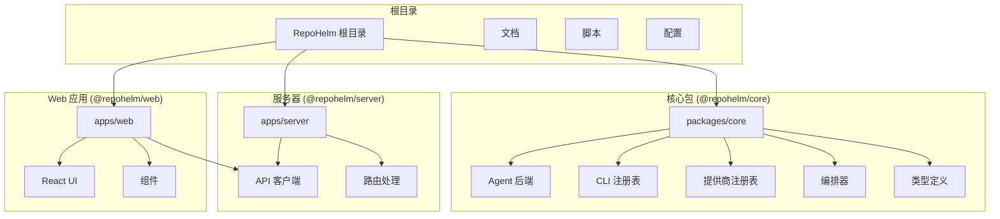
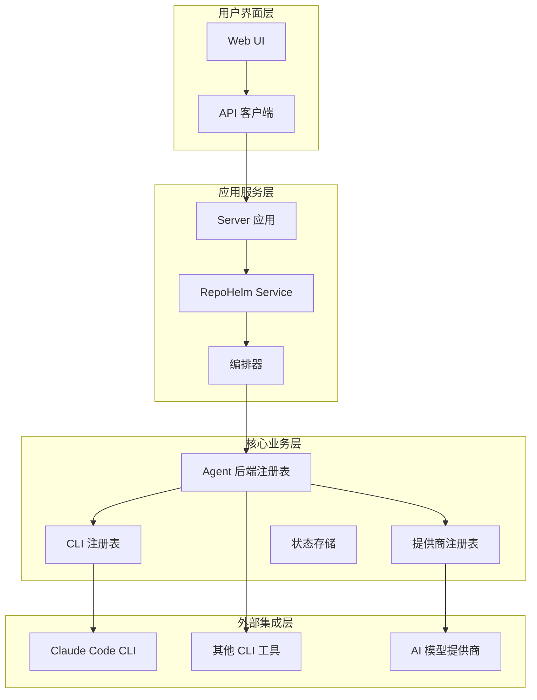
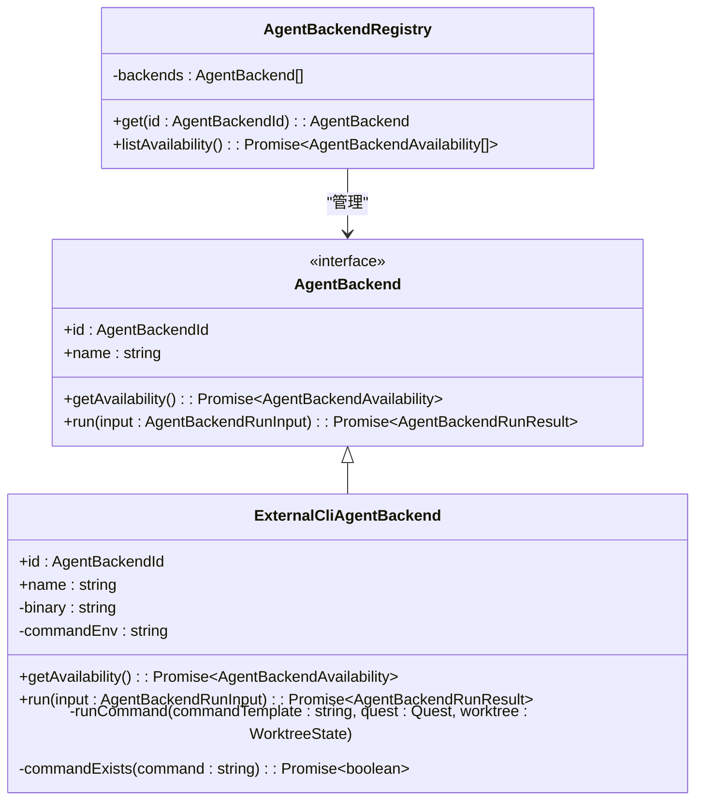
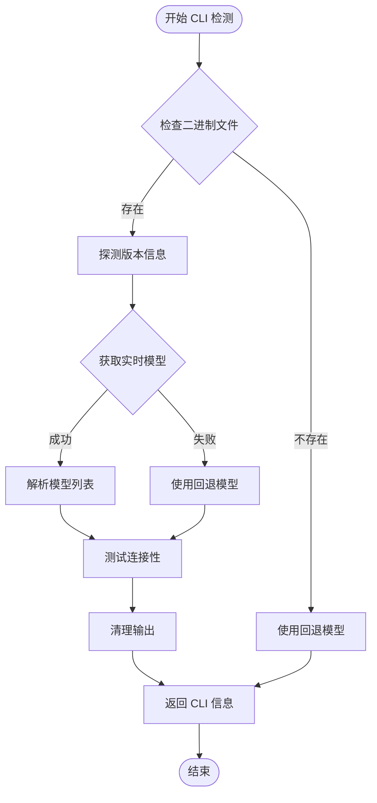
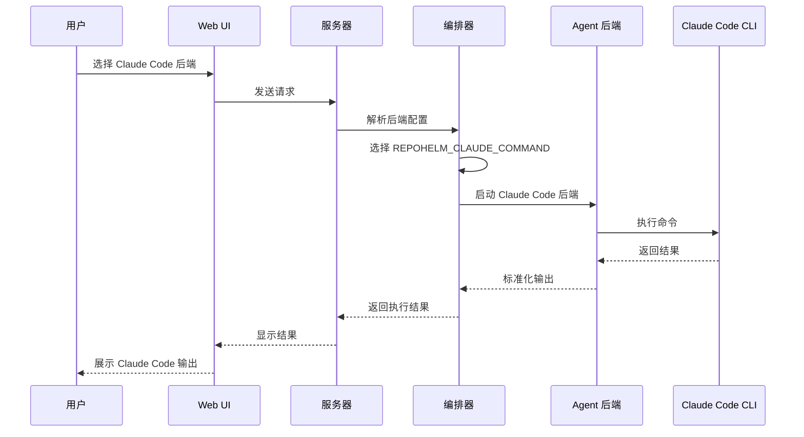
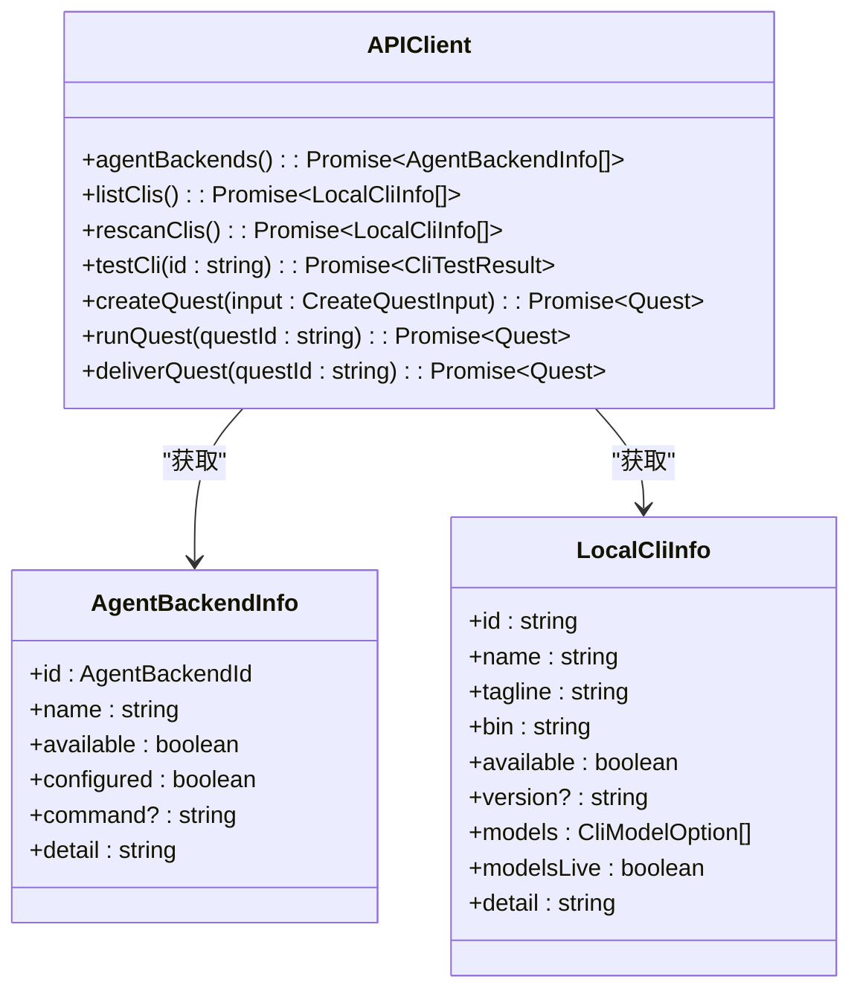

# Claude Code 集成指南

<cite>
**本文档引用的文件**
- [README.md](file://README.md)
- [CLAUDE.md](file://CLAUDE.md)
- [packages/core/src/agent.ts](file://packages/core/src/agent.ts)
- [packages/core/src/cli.ts](file://packages/core/src/cli.ts)
- [packages/core/src/providers.ts](file://packages/core/src/providers.ts)
- [packages/core/src/orchestrator.ts](file://packages/core/src/orchestrator.ts)
- [apps/server/src/index.ts](file://apps/server/src/index.ts)
- [apps/web/src/api.ts](file://apps/web/src/api.ts)
- [packages/core/src/types.ts](file://packages/core/src/types.ts)
- [package.json](file://package.json)
</cite>

## 目录
1. [简介](#简介)
2. [项目结构](#项目结构)
3. [核心组件](#核心组件)
4. [架构概览](#架构概览)
5. [详细组件分析](#详细组件分析)
6. [依赖关系分析](#依赖关系分析)
7. [性能考虑](#性能考虑)
8. [故障排除指南](#故障排除指南)
9. [结论](#结论)

## 简介

RepoHelm 是一个开源的 Quest 工作区原型，专门用于验证"虚拟工作区 + 多项目 Quest + 规范驱动 + worktree 隔离 + Agent 编排 + 知识库"的产品方向。该项目的核心目标是通过 Claude Code 等 AI 代理后端来实现智能代码生成和项目管理。

Claude Code 集成是 RepoHelm 的重要组成部分，它允许用户通过 Anthropic 的 Claude Code CLI 来执行智能代码任务。该集成提供了完整的开发环境，包括代码生成、文件修改、项目管理和协作功能。

## 项目结构

RepoHelm 采用 monorepo 架构，主要包含以下核心模块：



**图表来源**
- [package.json:1-22](file://package.json#L1-L22)
- [CLAUDE.md:13-19](file://CLAUDE.md#L13-L19)

**章节来源**
- [README.md:1-100](file://README.md#L1-L100)
- [CLAUDE.md:11-29](file://CLAUDE.md#L11-L29)

## 核心组件

RepoHelm 的 Claude Code 集成主要由以下几个核心组件构成：

### Agent 后端系统
RepoHelm 支持多种 Agent 后端，包括内置的 Mock 后端和外部 CLI 后端。Claude Code 通过外部 CLI 后端进行集成。

### CLI 注册表
LocalCliRegistry 负责检测和管理本地安装的 CLI 工具，包括 Claude Code、Codex、OpenCode 等。

### 提供商注册表
ProviderRegistry 管理各种 AI 模型提供商，支持 OpenAI、Anthropic、Google Gemini 等。

### 编排器
SubAgentOrchestrator 负责协调不同 Agent 的执行，确保任务按照正确的顺序和依赖关系执行。

**章节来源**
- [packages/core/src/agent.ts:395-411](file://packages/core/src/agent.ts#L395-L411)
- [packages/core/src/cli.ts:124-220](file://packages/core/src/cli.ts#L124-L220)
- [packages/core/src/providers.ts:163-200](file://packages/core/src/providers.ts#L163-L200)

## 架构概览

RepoHelm 的 Claude Code 集成采用分层架构设计，确保了系统的可扩展性和可维护性：



**图表来源**
- [apps/server/src/index.ts:43-660](file://apps/server/src/index.ts#L43-L660)
- [packages/core/src/service.ts:76-102](file://packages/core/src/service.ts#L76-L102)

## 详细组件分析

### Claude Code CLI 集成

Claude Code 的集成通过 ExternalCliAgentBackend 类实现，该类负责与 Claude Code CLI 进行交互：



**图表来源**
- [packages/core/src/agent.ts:117-259](file://packages/core/src/agent.ts#L117-L259)
- [packages/core/src/agent.ts:395-411](file://packages/core/src/agent.ts#L395-L411)

### CLI 检测和配置

LocalCliRegistry 负责检测和配置各种 CLI 工具，包括 Claude Code 的特定配置：



**图表来源**
- [packages/core/src/cli.ts:144-220](file://packages/core/src/cli.ts#L144-L220)
- [packages/core/src/cli.ts:222-290](file://packages/core/src/cli.ts#L222-L290)

### 编排器配置

编排器根据不同的 Agent 后端选择相应的环境变量：



**图表来源**
- [packages/core/src/orchestrator.ts:444-455](file://packages/core/src/orchestrator.ts#L444-L455)
- [packages/core/src/agent.ts:223-249](file://packages/core/src/agent.ts#L223-L249)

**章节来源**
- [packages/core/src/agent.ts:398-399](file://packages/core/src/agent.ts#L398-L399)
- [packages/core/src/cli.ts:48-122](file://packages/core/src/cli.ts#L48-L122)
- [packages/core/src/orchestrator.ts:444-455](file://packages/core/src/orchestrator.ts#L444-L455)

### API 端点集成

Web 应用通过 API 客户端与服务器进行通信，支持 Claude Code 后端的各种操作：



**图表来源**
- [apps/web/src/api.ts:449-653](file://apps/web/src/api.ts#L449-L653)
- [apps/web/src/api.ts:16-23](file://apps/web/src/api.ts#L16-L23)
- [apps/web/src/api.ts:269-286](file://apps/web/src/api.ts#L269-L286)

**章节来源**
- [apps/web/src/api.ts:14-14](file://apps/web/src/api.ts#L14-L14)
- [apps/web/src/api.ts:449-653](file://apps/web/src/api.ts#L449-L653)

## 依赖关系分析

RepoHelm 的 Claude Code 集成涉及多个层次的依赖关系：

```mermaid
graph TB
subgraph "运行时依赖"
NodeJS[Node.js 运行时]
ClaudeCLI[Claude Code CLI]
Git[Git 版本控制]
end
subgraph "核心依赖"
CorePackage[@repohelm/core]
AgentBackend[Agent 后端]
CLIRegistry[CLI 注册表]
ProviderRegistry[提供商注册表]
end
subgraph "应用依赖"
ServerApp[@repohelm/server]
WebApp[@repohelm/web]
Hono[Hono Web 框架]
React[React 19]
end
subgraph "开发依赖"
TypeScript[TypeScript]
Vitest[Vitest]
Playwright[Playwright]
end
NodeJS --> CorePackage
ClaudeCLI --> AgentBackend
Git --> CorePackage
CorePackage --> ServerApp
CorePackage --> WebApp
Hono --> ServerApp
React --> WebApp
TypeScript --> CorePackage
Vitest --> CorePackage
Playwright --> WebApp
```

**图表来源**
- [package.json:16-21](file://package.json#L16-L21)
- [CLAUDE.md:13-19](file://CLAUDE.md#L13-L19)

**章节来源**
- [package.json:1-22](file://package.json#L1-L22)
- [CLAUDE.md:13-19](file://CLAUDE.md#L13-L19)

## 性能考虑

在 Claude Code 集成中，性能优化主要关注以下几个方面：

### CLI 命令执行优化
- 使用超时机制防止长时间阻塞
- 实现并发执行多个 worktree 的任务
- 优化 CLI 命令参数传递

### 内存管理
- 合理的缓存策略
- 及时释放不再使用的资源
- 监控内存使用情况

### 网络请求优化
- 批量处理 API 请求
- 实现重试机制
- 错误处理和降级策略

## 故障排除指南

### 常见问题及解决方案

#### Claude Code CLI 未找到
**症状**: 启动时提示 Claude Code CLI 未安装
**解决方案**: 
1. 确保 Claude Code CLI 已正确安装
2. 检查 PATH 环境变量
3. 验证 CLI 可执行权限

#### 环境变量配置错误
**症状**: Claude Code 后端不可用
**解决方案**:
1. 检查 REPOHELM_CLAUDE_COMMAND 环境变量
2. 验证命令格式正确
3. 确认工作目录权限

#### API 连接问题
**症状**: Web UI 无法连接到服务器
**解决方案**:
1. 检查服务器端口占用
2. 验证 CORS 配置
3. 确认防火墙设置

**章节来源**
- [packages/core/src/agent.ts:125-142](file://packages/core/src/agent.ts#L125-L142)
- [packages/core/src/cli.ts:222-290](file://packages/core/src/cli.ts#L222-L290)
- [apps/server/src/index.ts:46-53](file://apps/server/src/index.ts#L46-L53)

## 结论

RepoHelm 的 Claude Code 集成提供了一个完整的 AI 代理开发平台，具有以下特点：

### 主要优势
- **模块化设计**: 清晰的组件分离和职责划分
- **可扩展性**: 支持多种 Agent 后端和 CLI 工具
- **易用性**: 直观的 Web 界面和丰富的 API
- **可靠性**: 完善的错误处理和监控机制

### 技术特色
- **多后端支持**: Claude Code、Codex、OpenCode 等
- **智能编排**: 自动化的任务调度和依赖管理
- **状态持久化**: 完整的状态管理和恢复机制
- **安全控制**: 细粒度的权限控制和审计日志

### 未来发展
RepoHelm 的 Claude Code 集成仍在持续发展中，未来计划包括：
- 更多 AI 模型提供商的支持
- 增强的项目管理和协作功能
- 更完善的监控和调试工具
- 优化的性能和用户体验

通过这个集成指南，开发者可以快速理解和使用 RepoHelm 的 Claude Code 功能，构建高效的 AI 代理应用程序。