# Claude 设置配置

<cite>
**本文档引用的文件**
- [.claude/settings.json](file://.claude/settings.json)
- [.claude/agents/code-reviewer.md](file://.claude/agents/code-reviewer.md)
- [.claude/agents/repohelm-test-agent.md](file://.claude/agents/repohelm-test-agent.md)
- [.claude/workflows/feature-quality.mjs](file://.claude/workflows/feature-quality.mjs)
- [.claude/hooks/typecheck-on-edit.sh](file://.claude/hooks/typecheck-on-edit.sh)
- [CLAUDE.md](file://CLAUDE.md)
- [README.md](file://README.md)
</cite>

## 目录
1. [简介](#简介)
2. [项目结构](#项目结构)
3. [核心组件](#核心组件)
4. [架构概览](#架构概览)
5. [详细组件分析](#详细组件分析)
6. [依赖关系分析](#依赖关系分析)
7. [性能考虑](#性能考虑)
8. [故障排除指南](#故障排除指南)
9. [结论](#结论)

## 简介

RepoHelm 是一个基于 Claude Code 的智能工作空间原型，专注于多项目协作和自动化任务执行。该项目的核心是 `.claude` 目录下的配置系统，该系统为 Claude AI 提供了完整的开发环境配置和工作流程指导。

Claude 设置配置系统包含四个主要组件：
- **设置文件**：定义工具钩子和权限控制
- **代理配置**：为不同类型的代码审查和测试任务提供专门的 AI 代理
- **工作流**：实现双管道质量门控的自动化流程
- **钩子脚本**：提供实时的代码质量检查和反馈机制

## 项目结构

RepoHelm 项目采用模块化的组织方式，Claude 配置位于根目录的 `.claude` 目录中：

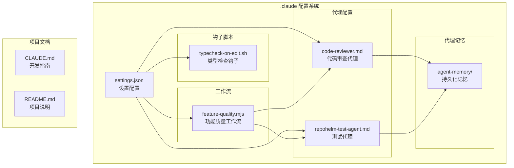

**图表来源**
- [.claude/settings.json:1-23](file://.claude/settings.json#L1-L23)
- [.claude/agents/code-reviewer.md:1-49](file://.claude/agents/code-reviewer.md#L1-L49)
- [.claude/agents/repohelm-test-agent.md:1-226](file://.claude/agents/repohelm-test-agent.md#L1-L226)
- [.claude/workflows/feature-quality.mjs:1-118](file://.claude/workflows/feature-quality.mjs#L1-L118)
- [.claude/hooks/typecheck-on-edit.sh:1-44](file://.claude/hooks/typecheck-on-edit.sh#L1-L44)

**章节来源**
- [.claude/settings.json:1-23](file://.claude/settings.json#L1-L23)
- [CLAUDE.md:1-80](file://CLAUDE.md#L1-L80)
- [README.md:1-100](file://README.md#L1-L100)

## 核心组件

### 设置配置系统

Claude 设置配置系统的核心是 `settings.json` 文件，它定义了工具钩子和权限控制机制：

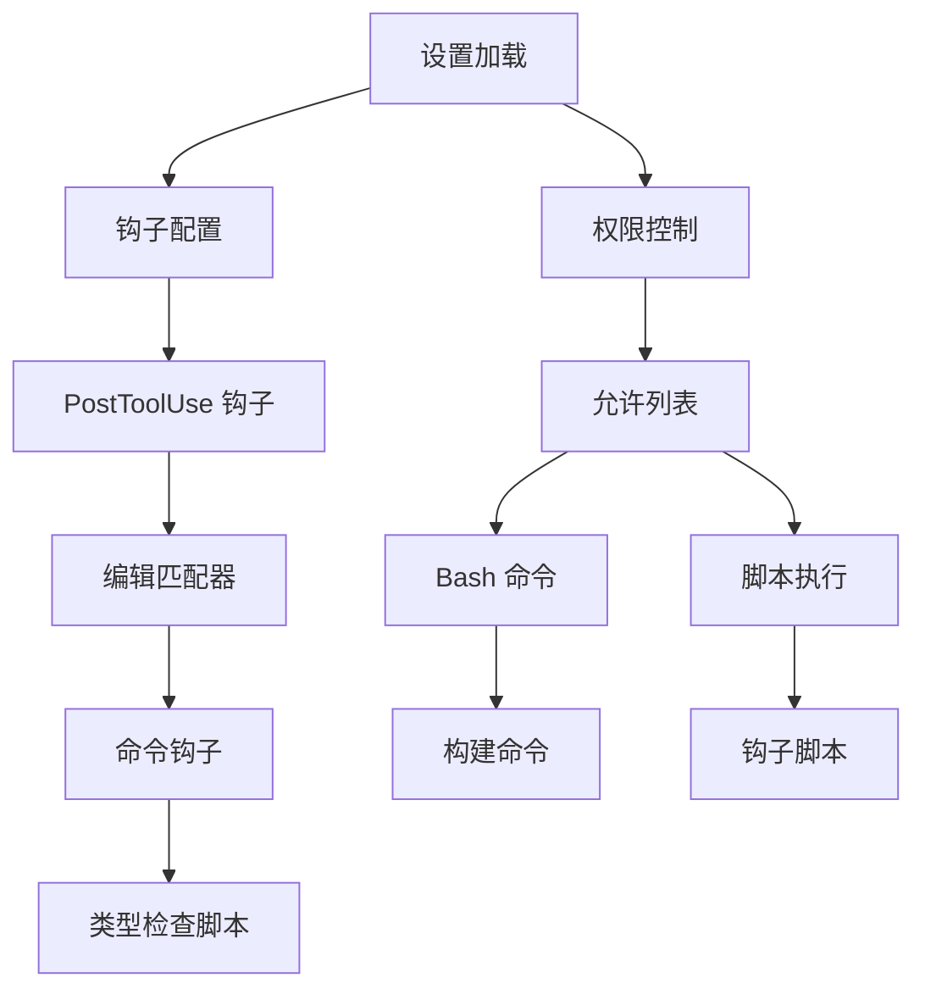

**图表来源**
- [.claude/settings.json:1-23](file://.claude/settings.json#L1-L23)

设置系统的关键特性包括：
- **PostToolUse 钩子**：在工具使用后自动触发
- **权限白名单**：严格控制可执行的命令和脚本
- **超时控制**：为长时间运行的命令设置超时限制

**章节来源**
- [.claude/settings.json:1-23](file://.claude/settings.json#L1-L23)

### 代理配置系统

项目包含两个专门的 AI 代理，每个都针对特定的开发任务进行了优化：

#### 代码审查代理 (code-reviewer)

代码审查代理专注于静态代码分析和质量评估：

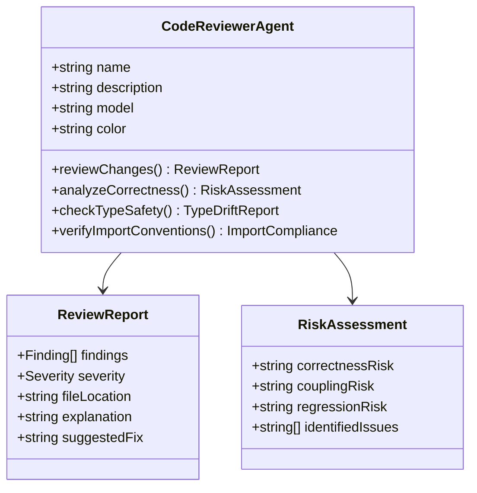

**图表来源**
- [.claude/agents/code-reviewer.md:1-49](file://.claude/agents/code-reviewer.md#L1-L49)

#### 测试代理 (repohelm-test-agent)

测试代理实现了测试驱动开发 (TDD) 的完整流程：

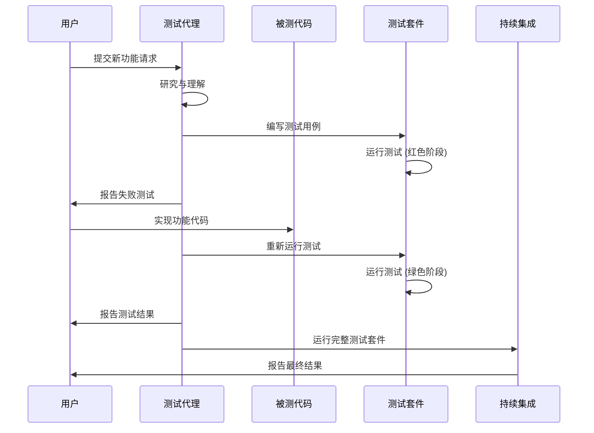

**图表来源**
- [.claude/agents/repohelm-test-agent.md:40-87](file://.claude/agents/repohelm-test-agent.md#L40-L87)

**章节来源**
- [.claude/agents/code-reviewer.md:1-49](file://.claude/agents/code-reviewer.md#L1-L49)
- [.claude/agents/repohelm-test-agent.md:1-226](file://.claude/agents/repohelm-test-agent.md#L1-L226)

### 工作流系统

功能质量工作流实现了双管道质量门控机制：

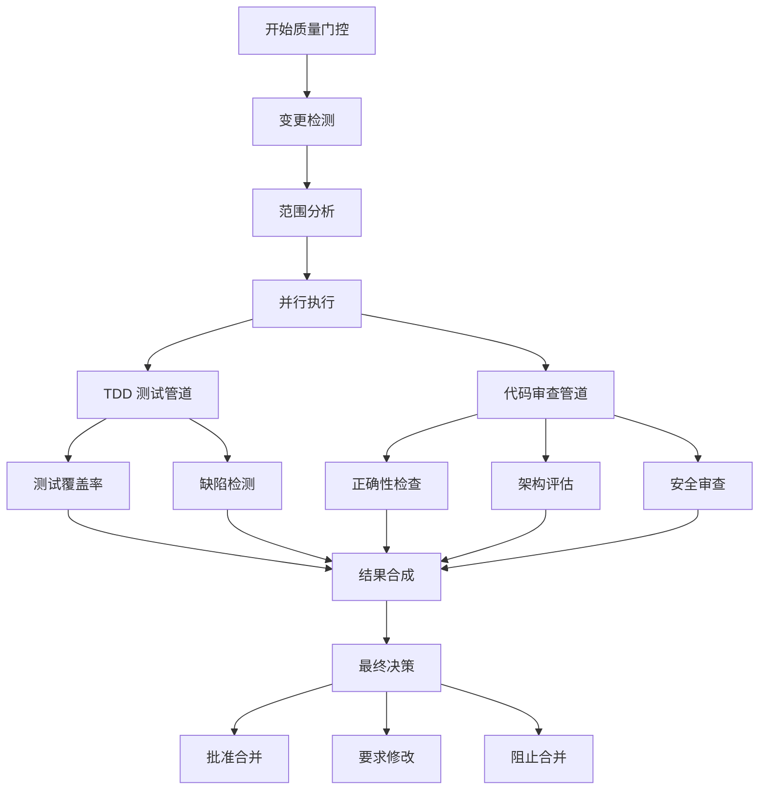

**图表来源**
- [.claude/workflows/feature-quality.mjs:1-118](file://.claude/workflows/feature-quality.mjs#L1-L118)

**章节来源**
- [.claude/workflows/feature-quality.mjs:1-118](file://.claude/workflows/feature-quality.mjs#L1-L118)

### 钩子脚本系统

类型检查钩子提供了实时的代码质量反馈：

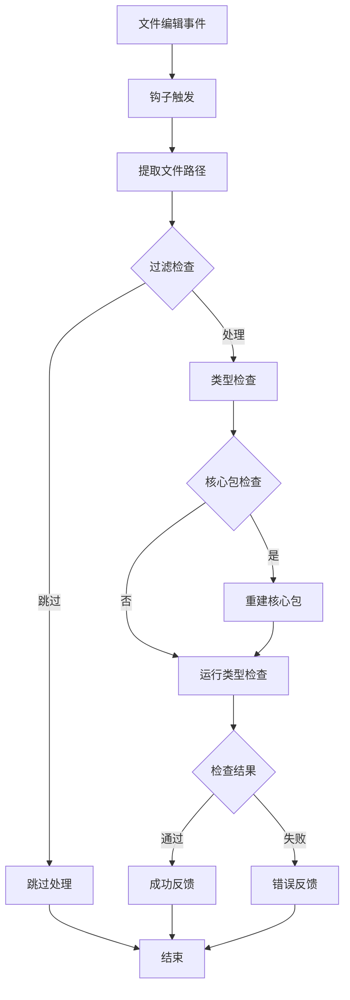

**图表来源**
- [.claude/hooks/typecheck-on-edit.sh:1-44](file://.claude/hooks/typecheck-on-edit.sh#L1-L44)

**章节来源**
- [.claude/hooks/typecheck-on-edit.sh:1-44](file://.claude/hooks/typecheck-on-edit.sh#L1-L44)

## 架构概览

Claude 设置配置系统采用分层架构设计，确保了高度的模块化和可维护性：

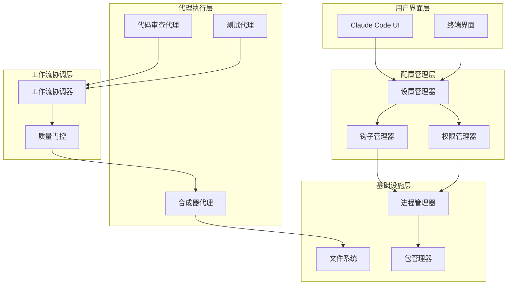

**图表来源**
- [.claude/settings.json:1-23](file://.claude/settings.json#L1-L23)
- [.claude/workflows/feature-quality.mjs:1-118](file://.claude/workflows/feature-quality.mjs#L1-L118)

## 详细组件分析

### 设置配置组件

设置配置组件是整个 Claude 配置系统的基础，负责定义工具钩子和权限控制：

#### 钩子配置分析

钩子配置系统实现了基于事件的自动化响应机制：

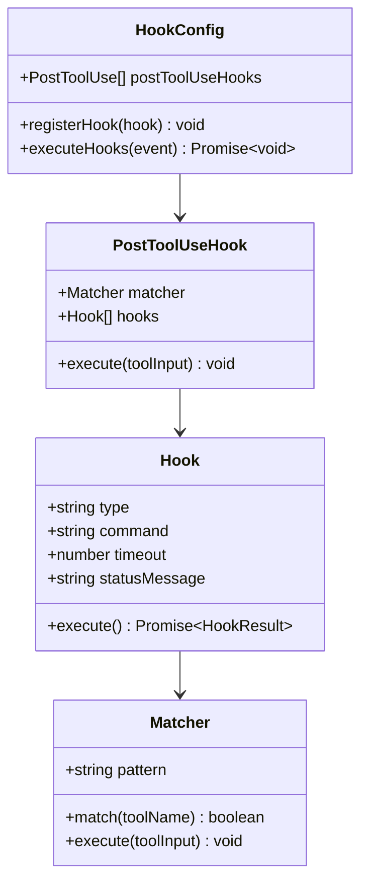

**图表来源**
- [.claude/settings.json:2-14](file://.claude/settings.json#L2-L14)

#### 权限控制系统

权限控制系统确保了安全的命令执行环境：

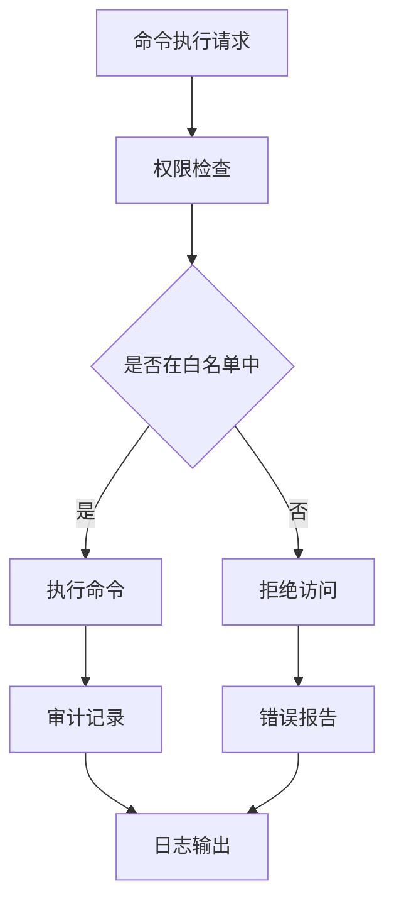

**图表来源**
- [.claude/settings.json:15-21](file://.claude/settings.json#L15-L21)

**章节来源**
- [.claude/settings.json:1-23](file://.claude/settings.json#L1-L23)

### 代理组件分析

#### 代码审查代理组件

代码审查代理组件实现了专业的代码质量评估功能：

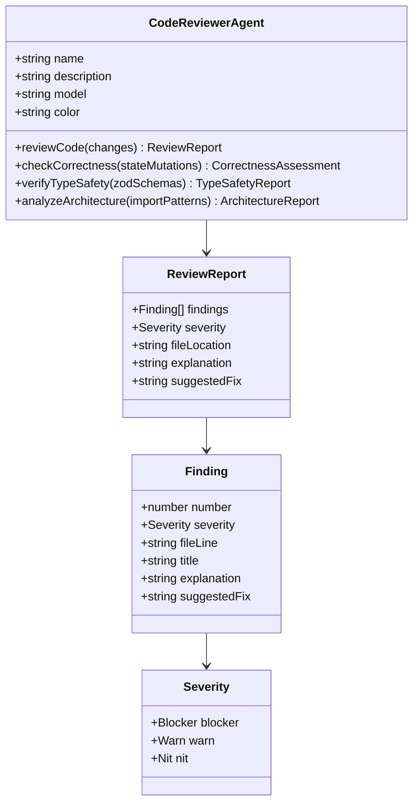

**图表来源**
- [.claude/agents/code-reviewer.md:33-48](file://.claude/agents/code-reviewer.md#L33-L48)

#### 测试代理组件

测试代理组件实现了完整的 TDD 流程自动化：

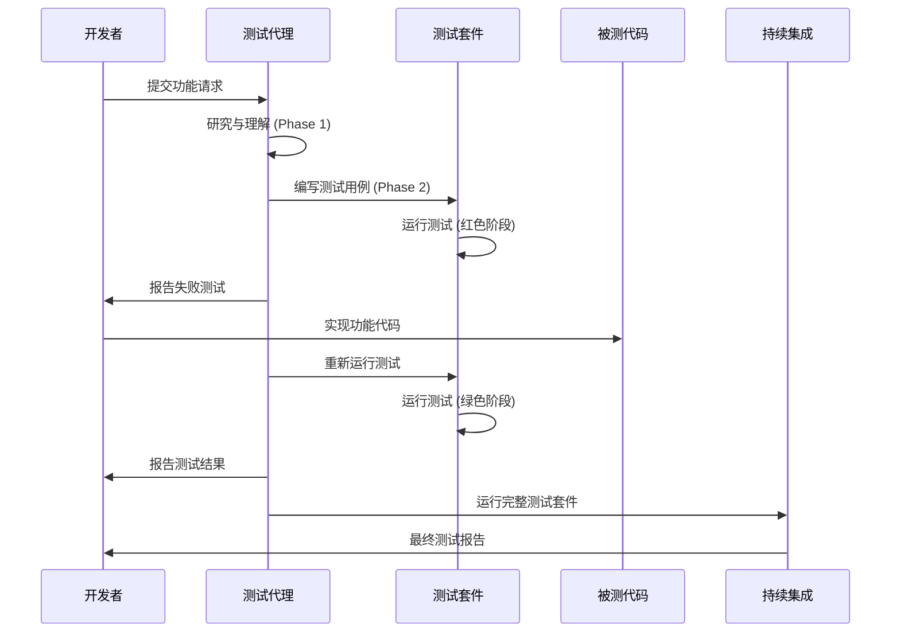

**图表来源**
- [.claude/agents/repohelm-test-agent.md:40-87](file://.claude/agents/repohelm-test-agent.md#L40-L87)

**章节来源**
- [.claude/agents/code-reviewer.md:1-49](file://.claude/agents/code-reviewer.md#L1-L49)
- [.claude/agents/repohelm-test-agent.md:1-226](file://.claude/agents/repohelm-test-agent.md#L1-L226)

### 工作流组件分析

#### 功能质量工作流

功能质量工作流实现了双管道质量门控机制：

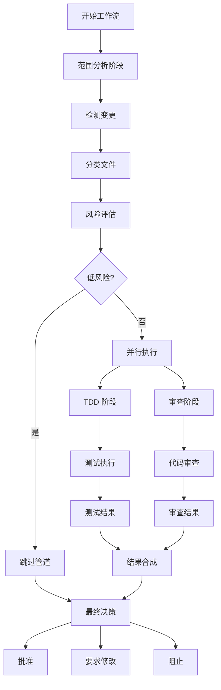

**图表来源**
- [.claude/workflows/feature-quality.mjs:12-118](file://.claude/workflows/feature-quality.mjs#L12-L118)

**章节来源**
- [.claude/workflows/feature-quality.mjs:1-118](file://.claude/workflows/feature-quality.mjs#L1-L118)

### 钩子组件分析

#### 类型检查钩子

类型检查钩子提供了实时的代码质量反馈机制：

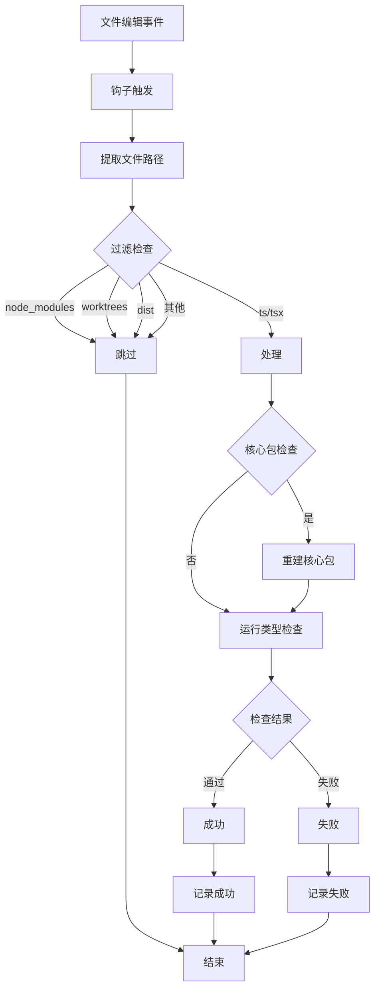

**图表来源**
- [.claude/hooks/typecheck-on-edit.sh:16-44](file://.claude/hooks/typecheck-on-edit.sh#L16-L44)

**章节来源**
- [.claude/hooks/typecheck-on-edit.sh:1-44](file://.claude/hooks/typecheck-on-edit.sh#L1-L44)

## 依赖关系分析

Claude 设置配置系统的依赖关系体现了清晰的分层架构：

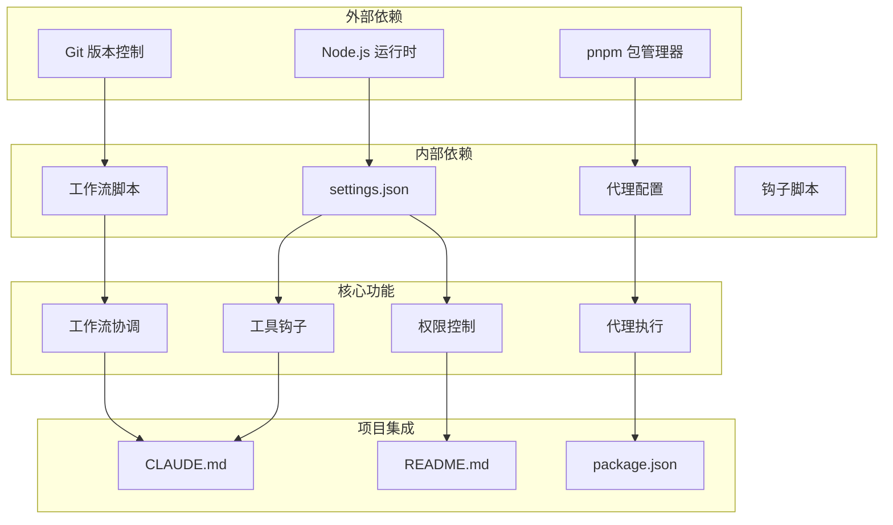

**图表来源**
- [.claude/settings.json:1-23](file://.claude/settings.json#L1-L23)
- [CLAUDE.md:1-80](file://CLAUDE.md#L1-L80)
- [README.md:1-100](file://README.md#L1-L100)

**章节来源**
- [CLAUDE.md:1-80](file://CLAUDE.md#L1-L80)
- [README.md:1-100](file://README.md#L1-L100)

## 性能考虑

Claude 设置配置系统在设计时充分考虑了性能优化：

### 钩子执行优化

- **异步执行**：所有钩子操作都是异步执行，避免阻塞主流程
- **超时控制**：为长时间运行的命令设置超时限制，防止系统挂起
- **条件执行**：只有在相关文件发生变化时才触发类型检查

### 代理执行优化

- **并行处理**：测试代理和代码审查代理可以并行执行
- **缓存机制**：代理记忆系统提供持久化的上下文缓存
- **增量分析**：只分析受影响的文件和模块

### 内存管理

- **文件系统缓存**：代理记忆存储在文件系统中，支持持久化
- **资源清理**：工作流完成后自动清理临时文件和进程
- **内存监控**：定期检查内存使用情况，避免内存泄漏

## 故障排除指南

### 常见问题诊断

#### 设置配置问题

**问题**：钩子无法执行
**解决方案**：
1. 检查 `settings.json` 文件格式是否正确
2. 验证命令权限是否在允许列表中
3. 确认脚本文件具有执行权限

**问题**：代理配置不生效
**解决方案**：
1. 检查代理文件的 YAML 前言配置
2. 验证代理名称与调用名称一致
3. 确认代理文件编码为 UTF-8

#### 工作流执行问题

**问题**：工作流卡死
**解决方案**：
1. 检查并行执行的代理是否正常响应
2. 验证 Git 仓库状态是否正确
3. 确认工作树权限设置

**问题**：类型检查失败
**解决方案**：
1. 检查核心包构建状态
2. 验证 TypeScript 配置文件
3. 确认依赖包版本兼容性

#### 性能问题

**问题**：系统响应缓慢
**解决方案**：
1. 检查钩子执行时间
2. 优化代理配置参数
3. 清理代理记忆缓存

**章节来源**
- [.claude/settings.json:1-23](file://.claude/settings.json#L1-L23)
- [.claude/hooks/typecheck-on-edit.sh:1-44](file://.claude/hooks/typecheck-on-edit.sh#L1-L44)
- [.claude/workflows/feature-quality.mjs:1-118](file://.claude/workflows/feature-quality.mjs#L1-L118)

## 结论

RepoHelm 的 Claude 设置配置系统展现了现代 AI 辅助开发工具的先进设计理念。通过精心设计的分层架构和模块化组件，该系统实现了：

### 主要成就

1. **完整的开发环境配置**：从基础设置到高级工作流，提供了全方位的开发支持
2. **智能化的质量保证**：双管道质量门控确保代码质量和安全性
3. **高效的协作机制**：TDD 流程自动化提升了开发效率
4. **强大的扩展性**：模块化设计支持功能的灵活扩展和定制

### 技术特色

- **事件驱动架构**：基于钩子的自动化响应机制
- **权限安全控制**：严格的命令执行权限管理
- **持久化上下文**：代理记忆系统提供智能的上下文保持
- **并行处理能力**：多代理并行执行提升整体效率

### 应用价值

该配置系统不仅适用于 RepoHelm 项目本身，也为其他类似的 AI 辅助开发场景提供了宝贵的参考模式。其设计理念和技术实现为未来的智能开发工具发展奠定了坚实的基础。

通过持续的优化和完善，Claude 设置配置系统将继续推动 AI 在软件开发领域的应用，为开发者提供更加智能、高效的工作体验。