# Claude 质量门工作流系统

<cite>
**本文档引用的文件**
- [README.md](file://README.md)
- [CLAUDE.md](file://CLAUDE.md)
- [AGENTS.md](file://AGENTS.md)
- [opencode-subagent-research.md](file://opencode-subagent-research.md)
- [MODEL_FETCHING.md](file://MODEL_FETCHING.md)
- [docs/model-config-plan.md](file://docs/model-config-plan.md)
- [packages/core/src/index.ts](file://packages/core/src/index.ts)
- [packages/core/src/orchestrator.ts](file://packages/core/src/orchestrator.ts)
- [packages/core/src/agent.ts](file://packages/core/src/agent.ts)
- [packages/core/src/service.ts](file://packages/core/src/service.ts)
- [packages/core/src/types.ts](file://packages/core/src/types.ts)
- [packages/core/src/store.ts](file://packages/core/src/store.ts)
- [packages/core/src/git.ts](file://packages/core/src/git.ts)
- [packages/core/src/knowledge.ts](file://packages/core/src/knowledge.ts)
- [packages/core/src/planning.ts](file://packages/core/src/planning.ts)
- [packages/core/src/tools/delegate.ts](file://packages/core/src/tools/delegate.ts)
- [packages/core/src/tools/fs.ts](file://packages/core/src/tools/fs.ts)
- [packages/core/src/cli.ts](file://packages/core/src/cli.ts)
- [packages/core/src/providers.ts](file://packages/core/src/providers.ts)
- [apps/server/src/index.ts](file://apps/server/src/index.ts)
- [apps/web/src/App.tsx](file://apps/web/src/App.tsx)
</cite>

## 更新摘要
**变更内容**
- 新增子代理模型选择指南章节，包含 Claude Sonnet 和 Opus 模型使用策略表格
- 更新模型配置架构说明，反映最新的模型选择机制
- 增强子代理编排器的模型绑定能力描述

## 目录
1. [简介](#简介)
2. [项目结构](#项目结构)
3. [核心组件](#核心组件)
4. [架构总览](#架构总览)
5. [详细组件分析](#详细组件分析)
6. [子代理模型选择指南](#子代理模型选择指南)
7. [依赖关系分析](#依赖关系分析)
8. [性能考虑](#性能考虑)
9. [故障排除指南](#故障排除指南)
10. [结论](#结论)

## 简介

RepoHelm 是一个开源的 Quest 工作区原型，专注于验证"虚拟 workspace + 多项目 Quest + Spec 驱动 + worktree 隔离 + Agent 编排 + 知识库"的产品方向。该系统实现了 Claude 质量门工作流，通过双代理流水线确保代码质量和一致性。

系统的核心特性包括：
- 启动本地 Web UI 和 API 服务
- 自动创建工作区和项目链接
- 基于 worktree 的隔离执行环境
- 多种 Agent 后端支持（Mock、Codex、Claude、OpenCode、OpenAI兼容）
- 知识库管理和向量化检索
- 完整的交付流水线（验证→提交→PR）
- **新增**：智能子代理模型选择机制，支持 Claude Sonnet 和 Opus 模型的精细化任务分配

## 项目结构

RepoHelm 采用 pnpm workspace 架构，包含三个主要包：

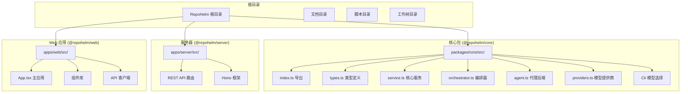

**图表来源**
- [packages/core/src/index.ts:1-15](file://packages/core/src/index.ts#L1-L15)
- [packages/core/src/service.ts:79-105](file://packages/core/src/service.ts#L79-L105)
- [apps/server/src/index.ts:1-50](file://apps/server/src/index.ts#L1-L50)

**章节来源**
- [README.md:1-100](file://README.md#L1-L100)
- [CLAUDE.md:18-35](file://CLAUDE.md#L18-L35)

## 核心组件

### RepoHelmService - 中央枢纽

RepoHelmService 是整个系统的核心，承担着所有领域操作的协调职责：

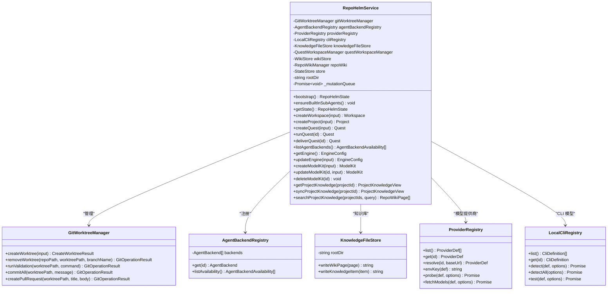

**图表来源**
- [packages/core/src/service.ts:79-105](file://packages/core/src/service.ts#L79-L105)
- [packages/core/src/git.ts:49-136](file://packages/core/src/git.ts#L49-L136)
- [packages/core/src/agent.ts:395-411](file://packages/core/src/agent.ts#L395-L411)
- [packages/core/src/knowledge.ts:12-81](file://packages/core/src/knowledge.ts#L12-L81)
- [packages/core/src/providers.ts:163-303](file://packages/core/src/providers.ts#L163-303)
- [packages/core/src/cli.ts:124-385](file://packages/core/src/cli.ts#L124-385)

### SubAgentOrchestrator - 子代理编排器

编排器负责将复杂的 Quest 分解为可执行的步骤，并通过代理池协作完成任务：

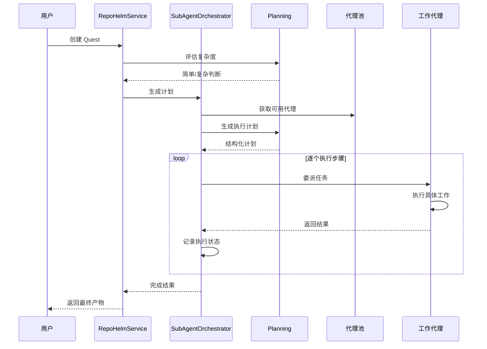

**图表来源**
- [packages/core/src/orchestrator.ts:58-94](file://packages/core/src/orchestrator.ts#L58-L94)
- [packages/core/src/planning.ts:74-105](file://packages/core/src/planning.ts#L74-L105)
- [packages/core/src/orchestrator.ts:131-236](file://packages/core/src/orchestrator.ts#L131-L236)

**章节来源**
- [packages/core/src/service.ts:79-105](file://packages/core/src/service.ts#L79-L105)
- [packages/core/src/orchestrator.ts:58-236](file://packages/core/src/orchestrator.ts#L58-L236)
- [packages/core/src/planning.ts:14-196](file://packages/core/src/planning.ts#L14-L196)

## 架构总览

RepoHelm 采用分层架构设计，清晰分离了表现层、业务逻辑层和基础设施层：

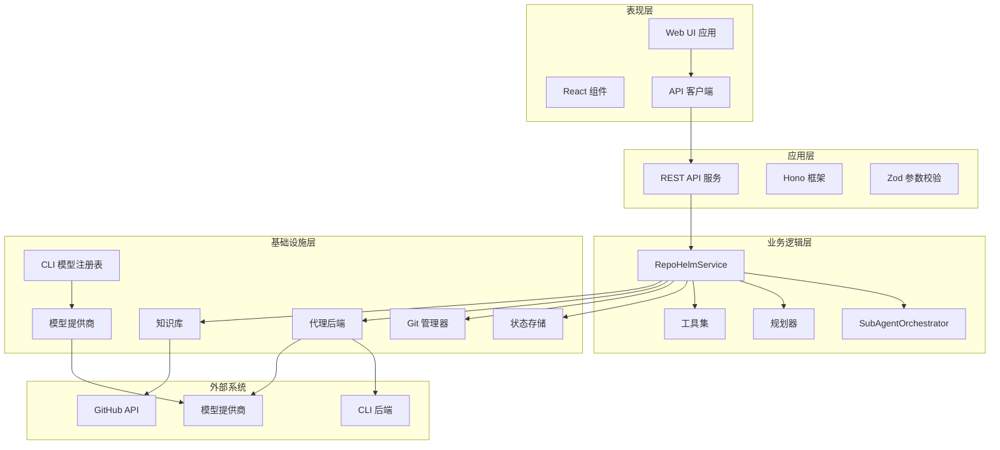

**图表来源**
- [apps/web/src/App.tsx:95-762](file://apps/web/src/App.tsx#L95-L762)
- [apps/server/src/index.ts:43-782](file://apps/server/src/index.ts#L43-L782)
- [packages/core/src/service.ts:79-105](file://packages/core/src/service.ts#L79-L105)

## 详细组件分析

### 质量门双代理流水线

RepoHelm 实现了 Claude 质量门工作流，要求在任何重大变更上并行运行两个子代理：

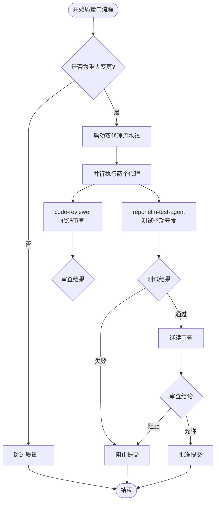

**图表来源**
- [AGENTS.md:44-54](file://AGENTS.md#L44-L54)

### Agent 后端系统

系统支持多种代理后端，每种都有其特定的适用场景：

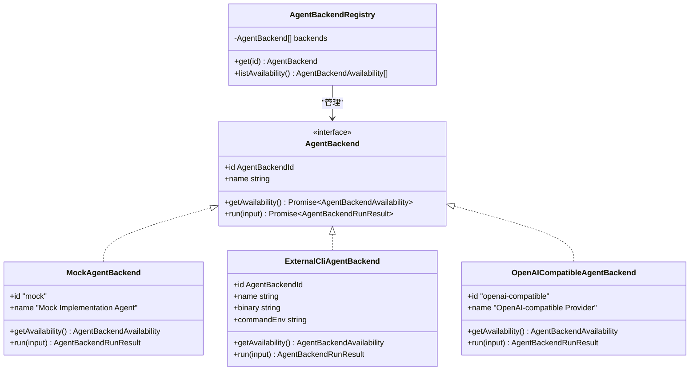

**图表来源**
- [packages/core/src/agent.ts:41-411](file://packages/core/src/agent.ts#L41-L411)

**章节来源**
- [packages/core/src/agent.ts:48-259](file://packages/core/src/agent.ts#L48-L259)
- [packages/core/src/agent.ts:395-411](file://packages/core/src/agent.ts#L395-L411)

### 知识库管理系统

RepoHelm 实现了完整的知识库系统，支持结构化知识存储和向量化检索：

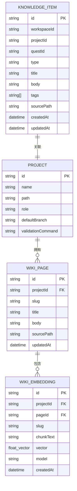

**图表来源**
- [packages/core/src/types.ts:240-287](file://packages/core/src/types.ts#L240-L287)
- [packages/core/src/knowledge.ts:12-81](file://packages/core/src/knowledge.ts#L12-L81)

**章节来源**
- [packages/core/src/knowledge.ts:12-81](file://packages/core/src/knowledge.ts#L12-L81)
- [packages/core/src/types.ts:257-287](file://packages/core/src/types.ts#L257-L287)

### 工作树管理系统

系统通过 Git worktree 实现任务隔离，确保每个 Quest 在独立的工作环境中执行：

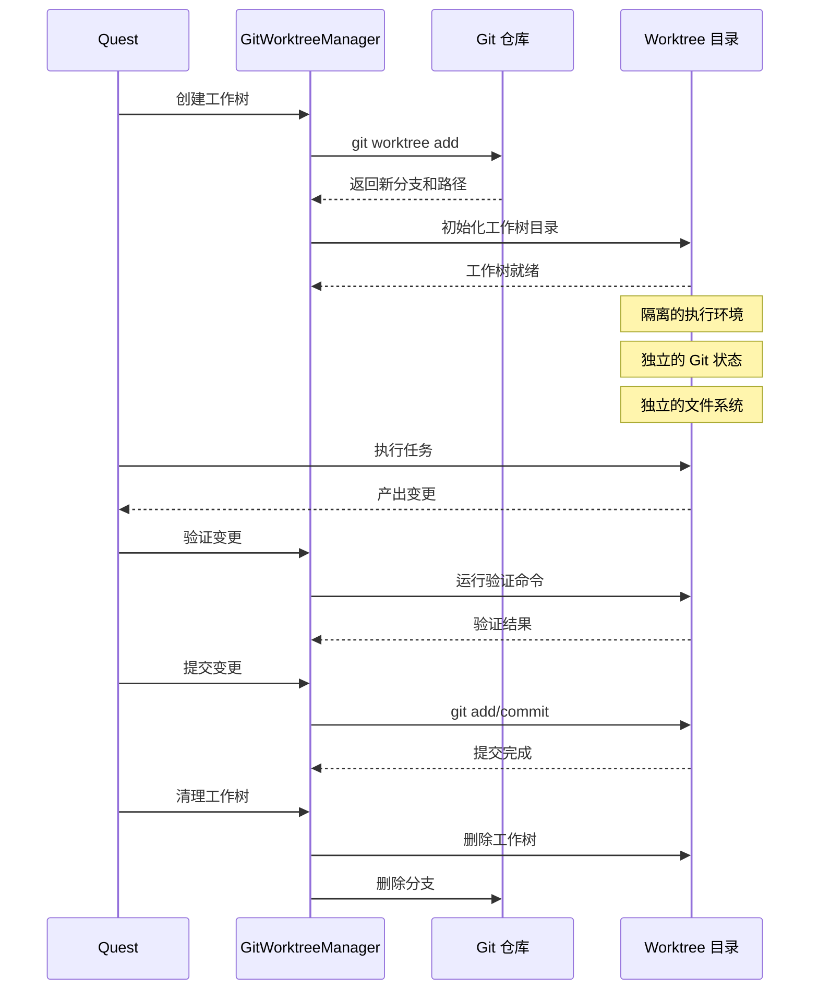

**图表来源**
- [packages/core/src/git.ts:95-136](file://packages/core/src/git.ts#L95-L136)
- [packages/core/src/git.ts:175-203](file://packages/core/src/git.ts#L175-L203)
- [packages/core/src/git.ts:205-236](file://packages/core/src/git.ts#L205-L236)

**章节来源**
- [packages/core/src/git.ts:49-402](file://packages/core/src/git.ts#L49-L402)

## 子代理模型选择指南

RepoHelm 实现了智能化的子代理模型选择机制，基于任务类型和复杂度自动分配最适合的 Claude 模型。该机制确保每个子代理都能获得最佳的性能和准确性平衡。

### 模型选择策略

系统采用基于任务类型的精细模型分配策略，主要分为两大类模型：

#### Claude Sonnet 模型
适用于需要快速执行和精确实现的任务，具有以下特征：
- **执行效率高**：适合机械性的代码实现和文件操作
- **准确性强**：在代码编写和文件读取方面表现优异
- **成本效益**：相比 Opus 更经济实惠

#### Claude Opus 模型  
适用于需要深度思考和综合分析的任务，具有以下特征：
- **思维深度**：适合复杂的规划和架构设计
- **分析能力**：在代码审查和一致性检查方面表现卓越
- **创意能力**：擅长架构设计和权衡分析

### 详细使用策略表格

| 任务类型 | 模型选择 | 典型示例 | 选择理由 |
|---------|---------|---------|---------|
| 信息收集/搜索/资料搜集 | `sonnet` | 探索代理、文件读取、代码搜索 | 快速准确的信息提取和文件操作 |
| 机械实现（按计划执行） | `sonnet` | 按规格编写代码/测试、文件修改 | 精确的代码实现和文件操作 |
| 计划撰写/任务分解/依赖判断 | `opus` | 规划生成、任务分解、依赖分析 | 深度思考和综合分析能力 |
| 架构设计/权衡分析 | `opus` | 架构设计、方案比较、技术选型 | 创造性思维和系统性分析 |
| 代码审查/规范审核/一致性检查 | `opus` | Bug 发现、类型一致性验证、规范检查 | 深度分析和细节把控能力 |
| 复杂问题解决/多步骤推理 | `opus` | 多文件协调、复杂逻辑实现、系统集成 | 综合分析和复杂问题处理 |

### 模型选择决策流程

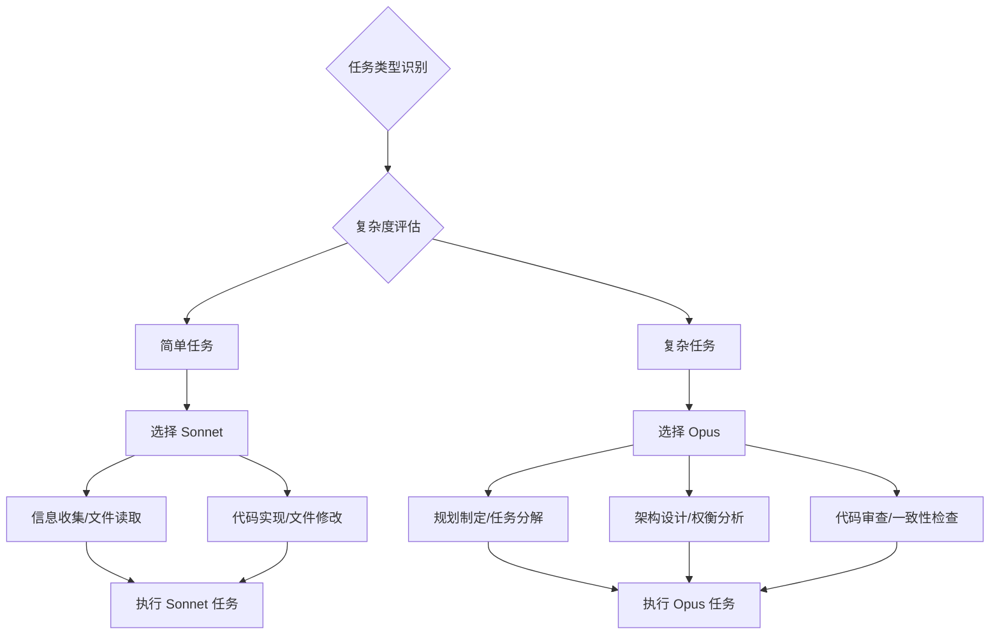

### 模型绑定机制

RepoHelm 支持每子代理级别的模型绑定，实现精细化的资源分配：

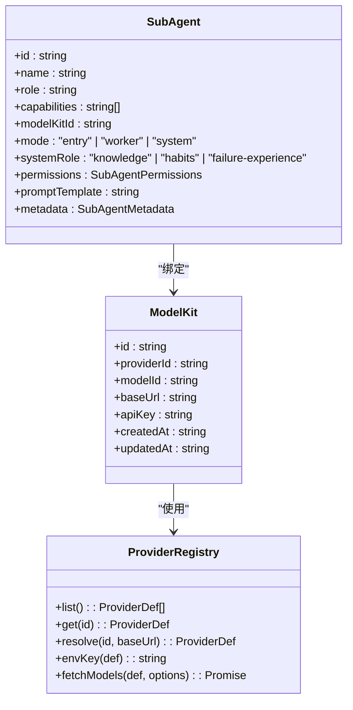

**图表来源**
- [packages/core/src/types.ts:399-413](file://packages/core/src/types.ts#L399-L413)
- [packages/core/src/providers.ts:163-303](file://packages/core/src/providers.ts#L163-303)

### 实际应用场景

#### 质量门工作流中的模型选择
在质量门流程中，系统会根据任务的性质自动选择最合适的模型：

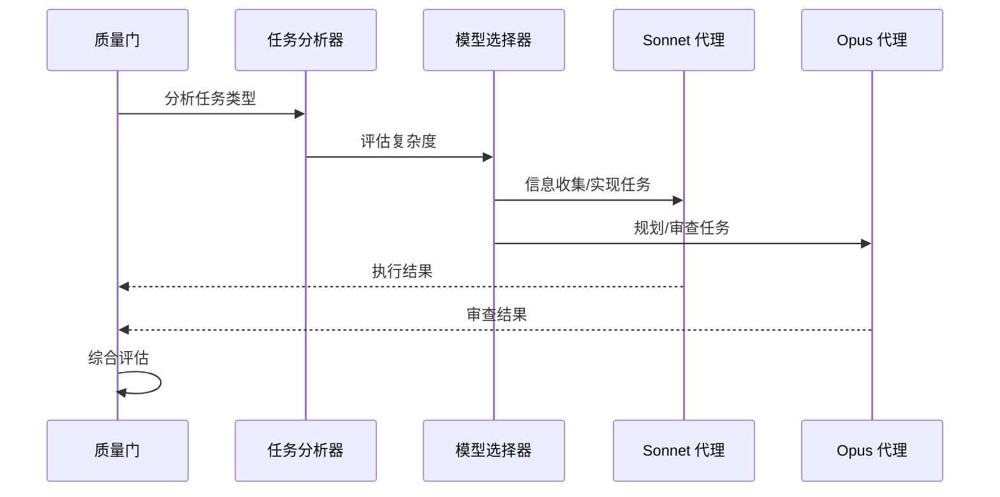

#### 动态模型切换
系统支持在运行时根据任务需求动态切换模型：

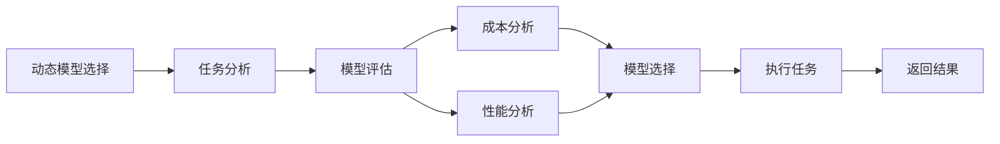

**章节来源**
- [CLAUDE.md:81-93](file://CLAUDE.md#L81-L93)
- [MODEL_FETCHING.md:42-49](file://MODEL_FETCHING.md#L42-L49)
- [packages/core/src/providers.ts:79-161](file://packages/core/src/providers.ts#L79-L161)

## 依赖关系分析

系统采用模块化设计，各组件间依赖关系清晰：

```mermaid
graph TB
subgraph "核心依赖"
Types[types.ts 类型定义]
Store[store.ts 状态存储]
Service[service.ts 核心服务]
Orchestrator[orchestrator.ts 编排器]
Planning[planning.ts 规划器]
Providers[providers.ts 模型提供商]
Cli[Cli 模型选择]
End
subgraph "工具集"
Delegate[tools/delegate.ts 委派工具]
FileSystem[tools/fs.ts 文件系统工具]
End
subgraph "基础设施"
Git[git.ts Git 管理]
Knowledge[knowledge.ts 知识库]
Agent[agent.ts 代理后端]
End
subgraph "应用层"
Server[apps/server/src/index.ts API 服务]
Web[apps/web/src/App.tsx Web 应用]
End
Types --> Service
Store --> Service
Service --> Orchestrator
Service --> Planning
Service --> Providers
Service --> Cli
Service --> Git
Service --> Knowledge
Service --> Agent
Orchestrator --> Delegate
Orchestrator --> FileSystem
Server --> Service
Web --> Server
```

**图表来源**
- [packages/core/src/index.ts:1-15](file://packages/core/src/index.ts#L1-L15)
- [apps/server/src/index.ts:1-12](file://apps/server/src/index.ts#L1-L12)

**章节来源**
- [packages/core/src/index.ts:1-15](file://packages/core/src/index.ts#L1-L15)
- [apps/server/src/index.ts:1-50](file://apps/server/src/index.ts#L1-L50)

## 性能考虑

RepoHelm 在设计时充分考虑了性能优化：

### 状态存储优化
- 使用 SQLite 替代 JSON 文件，提供更好的并发性能
- 实现状态变更队列，防止并发写入冲突
- 支持自动迁移，平滑升级数据格式

### 编排性能
- 复杂度评估机制，简单任务直接执行，避免不必要的规划
- 代理池缓存，减少重复初始化开销
- 工具调用循环限制，防止无限循环

### 知识库性能
- 向量化检索与关键字检索双重机制
- 增量索引更新，避免全量重建
- 嵌入向量缓存，提升查询速度

### 模型选择性能
- **智能缓存机制**：模型配置和选择策略的缓存，减少重复计算
- **动态资源分配**：根据任务类型和复杂度动态调整模型资源
- **成本优化**：通过合理的模型选择策略降低推理成本

## 故障排除指南

### 常见问题诊断

**代理后端不可用**
- 检查环境变量配置：`REPOHELM_CODEX_COMMAND`、`REPOHELM_CLAUDE_COMMAND`、`REPOHELM_OPENCODE_COMMAND`
- 验证 CLI 工具是否正确安装
- 使用 `listLocalClis()` 检查检测结果

**工作树创建失败**
- 检查工作树根目录权限
- 验证 Git 仓库状态
- 确认目标路径不存在冲突

**知识库索引错误**
- 检查嵌入模型配置
- 验证网络连接
- 清理缓存后重试

**模型选择异常**
- 检查模型提供商配置
- 验证 API 密钥有效性
- 确认模型列表获取正常

**章节来源**
- [packages/core/src/agent.ts:125-182](file://packages/core/src/agent.ts#L125-L182)
- [packages/core/src/git.ts:95-136](file://packages/core/src/git.ts#L95-L136)
- [packages/core/src/service.ts:220-243](file://packages/core/src/service.ts#L220-L243)

## 结论

RepoHelm 通过 Claude 质量门工作流系统，为多项目 Quest 开发提供了完整的解决方案。系统的核心优势包括：

1. **质量保证**：双代理流水线确保代码质量和一致性
2. **隔离执行**：基于 worktree 的隔离环境，保证任务独立性
3. **灵活扩展**：多后端支持，适应不同开发需求
4. **知识管理**：完整的知识库系统，支持智能检索
5. **可观测性**：全面的事件记录和审计日志
6. **智能模型选择**：基于任务类型的精细化模型分配机制，优化性能和成本

**新增的子代理模型选择指南**为开发者提供了明确的决策依据，通过 Claude Sonnet 和 Opus 模型的差异化使用策略，确保每个子代理都能在最适合的模型上执行，从而提升整体系统的效率和质量。

该系统为构建高质量的 AI 辅助开发工作流奠定了坚实基础，通过持续迭代和社区贡献，有望成为下一代软件开发平台的重要组成部分。