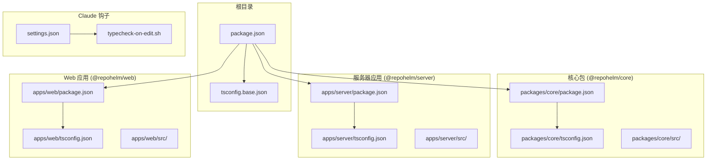
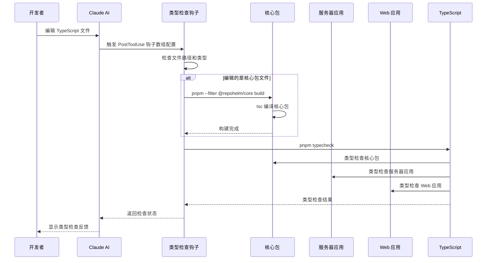
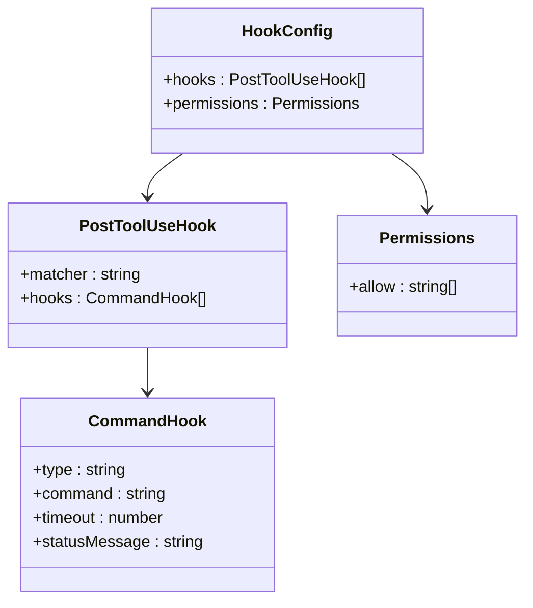
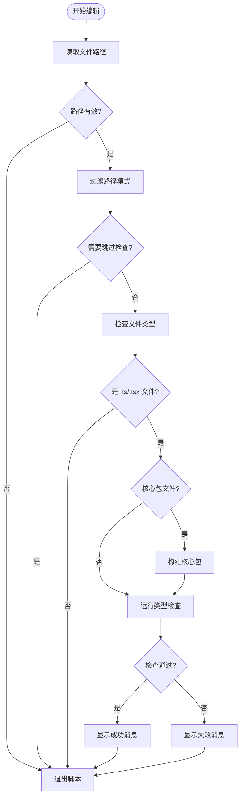
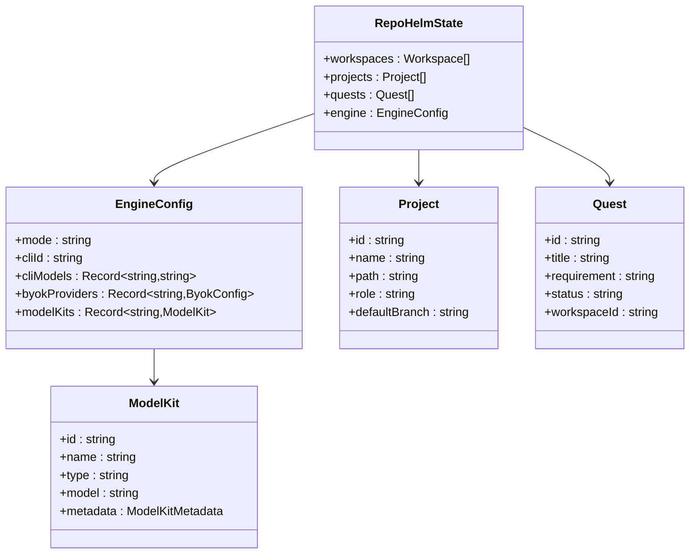

# 编辑时类型检查钩子

<cite>
**本文档引用的文件**
- [.claude/hooks/typecheck-on-edit.sh](file://.claude/hooks/typecheck-on-edit.sh)
- [.claude/settings.json](file://.claude/settings.json)
- [package.json](file://package.json)
- [packages/core/package.json](file://packages/core/package.json)
- [packages/core/tsconfig.json](file://packages/core/tsconfig.json)
- [apps/server/tsconfig.json](file://apps/server/tsconfig.json)
- [apps/web/tsconfig.json](file://apps/web/tsconfig.json)
- [tsconfig.base.json](file://tsconfig.base.json)
- [packages/core/src/types.ts](file://packages/core/src/types.ts)
- [packages/core/src/service.ts](file://packages/core/src/service.ts)
- [apps/server/src/index.ts](file://apps/server/src/index.ts)
- [apps/web/src/api.ts](file://apps/web/src/api.ts)
- [apps/web/src/App.tsx](file://apps/web/src/App.tsx)
</cite>

## 更新摘要
**所做更改**
- 更新了 Hook 配置结构分析，反映从对象到数组的变更
- 修订了 Claude 钩子配置章节，准确描述当前的 hooks 数组配置
- 更新了架构图和流程图以反映新的配置结构
- 增强了配置示例和代码分析

## 目录
1. [简介](#简介)
2. [项目结构](#项目结构)
3. [核心组件](#核心组件)
4. [架构概览](#架构概览)
5. [详细组件分析](#详细组件分析)
6. [依赖关系分析](#依赖关系分析)
7. [性能考虑](#性能考虑)
8. [故障排除指南](#故障排除指南)
9. [结论](#结论)

## 简介

编辑时类型检查钩子是 RepoHelm 项目中一个重要的开发辅助工具，它能够在开发者编辑 TypeScript 文件时自动触发类型检查，确保代码质量并提供即时反馈。这个钩子系统特别设计用于处理多包项目的复杂类型检查需求，特别是在编辑核心包时能够正确重建依赖。

RepoHelm 是一个开源的 Quest 工作区原型，该项目采用了现代化的 monorepo 架构，包含核心库、服务器应用和 Web 应用三个主要部分。编辑时类型检查钩子通过 Claude AI 开发者助手集成，为开发者提供了无缝的类型检查体验。

**更新** Hook 配置结构已从传统的对象配置更新为数组配置，提供了更灵活的钩子管理和执行机制。

## 项目结构

RepoHelm 项目采用标准的 monorepo 结构，主要包含以下组件：



**图表来源**
- [package.json:1-22](file://package.json#L1-L22)
- [packages/core/package.json:1-21](file://packages/core/package.json#L1-L21)
- [apps/server/tsconfig.json:1-12](file://apps/server/tsconfig.json#L1-L12)
- [apps/web/tsconfig.json:1-11](file://apps/web/tsconfig.json#L1-L11)

**章节来源**
- [package.json:1-22](file://package.json#L1-L22)
- [tsconfig.base.json:1-14](file://tsconfig.base.json#L1-L14)

## 核心组件

编辑时类型检查钩子系统由以下几个核心组件构成：

### 1. Claude 钩子配置（已更新）
Claude AI 开发者助手通过 `.claude/settings.json` 文件配置，现在使用数组结构定义了在文件编辑和写入操作后的自动执行机制。配置结构采用 `hooks.PostToolUse` 数组形式，允许定义多个匹配器和对应的钩子执行规则。

### 2. 类型检查脚本
`.claude/hooks/typecheck-on-edit.sh` 是核心的 Bash 脚本，负责执行类型检查逻辑，包括文件过滤、条件重建和错误处理。

### 3. 多包构建协调
系统能够智能识别编辑的文件位置，如果是核心包 (`packages/core`) 的文件，则先重建核心包以确保服务器和 Web 应用能够使用最新的类型定义。

### 4. 类型检查配置
每个包都有独立的 TypeScript 配置，确保正确的类型检查行为和输出格式。

**章节来源**
- [.claude/settings.json:1-23](file://.claude/settings.json#L1-L23)
- [.claude/hooks/typecheck-on-edit.sh:1-44](file://.claude/hooks/typecheck-on-edit.sh#L1-L44)

## 架构概览

编辑时类型检查钩子的整体架构如下：



**图表来源**
- [.claude/settings.json:3-13](file://.claude/settings.json#L3-L13)
- [.claude/hooks/typecheck-on-edit.sh:30-43](file://.claude/hooks/typecheck-on-edit.sh#L30-L43)
- [package.json:11](file://package.json#L11)

## 详细组件分析

### Claude 钩子配置分析（已更新）

Claude 钩子系统通过 JSON 配置文件定义了自动化行为，现在使用数组结构进行配置：



**图表来源**
- [.claude/settings.json:2-22](file://.claude/settings.json#L2-L22)

**更新** 配置结构已从单个对象变为数组结构，`hooks.PostToolUse` 现在是一个包含多个 PostToolUseHook 对象的数组，每个对象可以定义不同的匹配器和钩子执行规则。

### 类型检查脚本逻辑分析

类型检查脚本实现了复杂的文件过滤和条件处理逻辑：



**图表来源**
- [.claude/hooks/typecheck-on-edit.sh:16-43](file://.claude/hooks/typecheck-on-edit.sh#L16-L43)

### TypeScript 配置分析

每个包都有特定的 TypeScript 配置，确保正确的编译和类型检查行为：

| 包名 | 配置文件 | 主要特性 | 输出类型 |
|------|----------|----------|----------|
| @repohelm/core | packages/core/tsconfig.json | 声明文件生成、NodeNext 模块解析 | dist 目录 |
| @repohelm/server | apps/server/tsconfig.json | NodeNext 模块解析、服务器特定配置 | dist 目录 |
| @repohelm/web | apps/web/tsconfig.json | React JSX 支持、无输出配置 | 运行时检查 |

**章节来源**
- [packages/core/tsconfig.json:1-13](file://packages/core/tsconfig.json#L1-L13)
- [apps/server/tsconfig.json:1-12](file://apps/server/tsconfig.json#L1-L12)
- [apps/web/tsconfig.json:1-11](file://apps/web/tsconfig.json#L1-L11)

### 类型定义系统

RepoHelm 的类型定义系统为整个项目提供了强类型支持：



**图表来源**
- [packages/core/src/types.ts:494-509](file://packages/core/src/types.ts#L494-L509)
- [packages/core/src/types.ts:474-483](file://packages/core/src/types.ts#L474-L483)
- [packages/core/src/types.ts:370-379](file://packages/core/src/types.ts#L370-L379)

**章节来源**
- [packages/core/src/types.ts:1-653](file://packages/core/src/types.ts#L1-L653)

## 依赖关系分析

编辑时类型检查钩子系统的依赖关系如下：

```mermaid
graph TB
subgraph "外部依赖"
PNPM[pnpm 包管理器]
Bash[Bash Shell]
jq[jq JSON 处理器]
end
subgraph "内部依赖"
CoreBuild[核心包构建]
TypeCheck[类型检查]
Script[typecheck-on-edit.sh]
Settings[.claude/settings.json]
end
subgraph "项目包"
Core[@repohelm/core]
Server[@repohelm/server]
Web[@repohelm/web]
end
Settings --> Script
Script --> PNPM
Script --> Bash
Script --> jq
Script --> CoreBuild
Script --> TypeCheck
CoreBuild --> Core
TypeCheck --> Core
TypeCheck --> Server
TypeCheck --> Web
```

**图表来源**
- [.claude/hooks/typecheck-on-edit.sh:11-14](file://.claude/hooks/typecheck-on-edit.sh#L11-L14)
- [.claude/settings.json:15-21](file://.claude/settings.json#L15-L21)

**章节来源**
- [package.json:7-15](file://package.json#L7-L15)

## 性能考虑

编辑时类型检查钩子系统在设计时充分考虑了性能优化：

### 1. 智能文件过滤
- 跳过 node_modules、worktrees、dist 和 build 目录
- 仅对 .ts 和 .tsx 文件执行类型检查
- 避免不必要的检查开销

### 2. 条件重建机制
- 仅在编辑核心包文件时重建核心包
- 其他情况下直接运行类型检查
- 减少构建时间

### 3. 并行执行
- 核心包构建和类型检查可以并行执行
- 利用现代硬件资源提高效率

### 4. 缓存利用
- TypeScript 编译器缓存机制
- pnpm 包管理器缓存优化

## 故障排除指南

### 常见问题及解决方案

| 问题类型 | 症状 | 解决方案 |
|----------|------|----------|
| 构建失败 | 核心包构建失败但类型检查继续 | 脚本会显示警告但仍继续执行 |
| 权限不足 | 无法执行 pnpm 命令 | 检查 Claude 权限配置 |
| 超时错误 | 类型检查执行时间过长 | 增加超时时间或优化项目结构 |
| 文件过滤错误 | 错误地跳过了某些文件 | 检查文件路径匹配规则 |

### 调试技巧

1. **查看详细日志**：使用 `tail -40` 查看最后 40 行输出
2. **手动测试**：直接在终端执行相同的命令
3. **检查权限**：确认 Claude 有执行所需命令的权限
4. **验证路径**：确认文件路径符合预期模式

**章节来源**
- [.claude/hooks/typecheck-on-edit.sh:33-43](file://.claude/hooks/typecheck-on-edit.sh#L33-L43)

## 结论

编辑时类型检查钩子系统是 RepoHelm 项目中一个精心设计的开发辅助工具，它通过 Claude AI 开发者助手实现了智能化的类型检查自动化。该系统的主要优势包括：

1. **智能文件过滤**：仅对相关文件执行类型检查，提高效率
2. **条件重建机制**：在编辑核心包时自动重建，确保类型定义最新
3. **无缝集成**：与 Claude AI 工作流完美集成，提供即时反馈
4. **多包支持**：能够正确处理复杂的 monorepo 架构
5. **错误处理**：优雅地处理各种异常情况

**更新** 最新的配置结构从对象变为数组，提供了更灵活的钩子管理和执行机制，支持更复杂的匹配器和钩子组合场景。

这个钩子系统显著提高了开发效率，减少了手动类型检查的需求，为 RepoHelm 项目的持续开发提供了强有力的支持。通过自动化的类型检查，开发者可以更快地发现和修复类型错误，提高代码质量和开发速度。