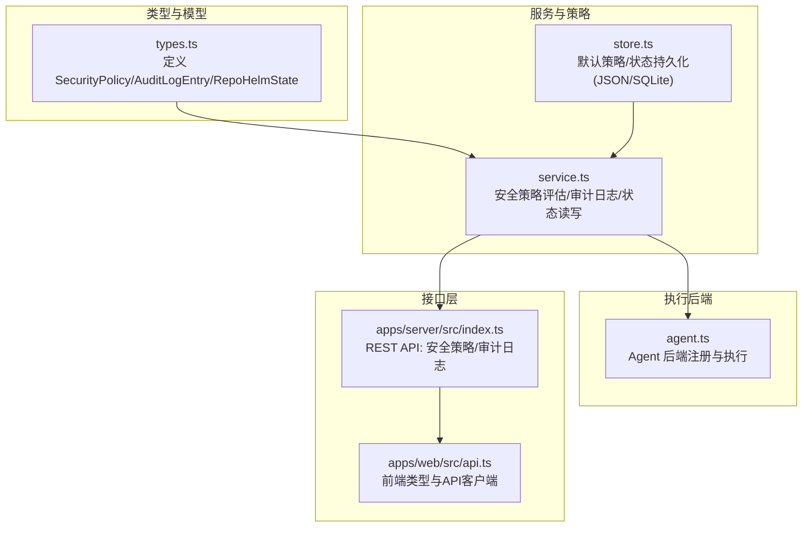
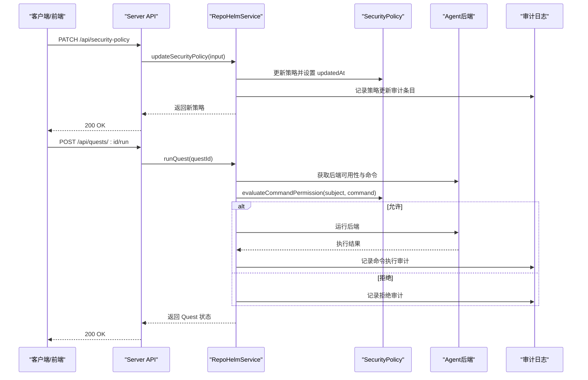
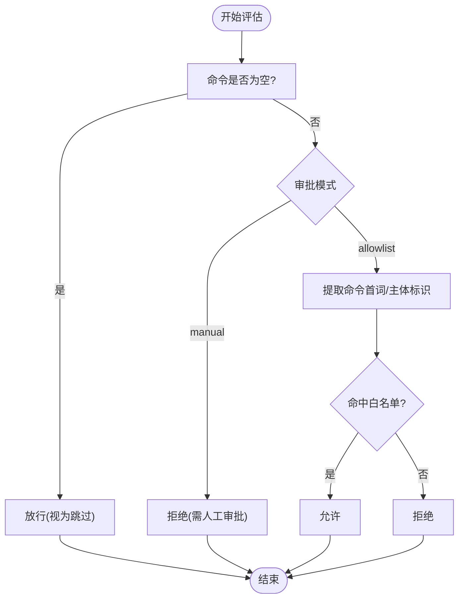
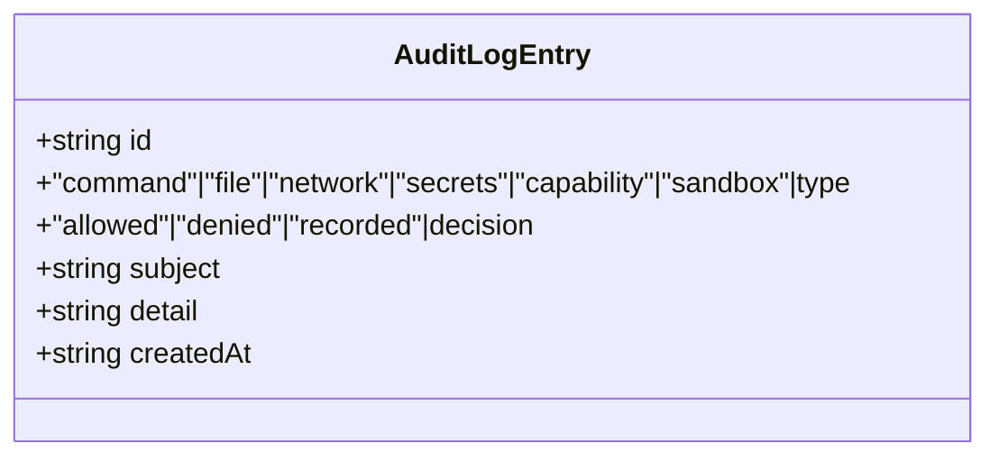
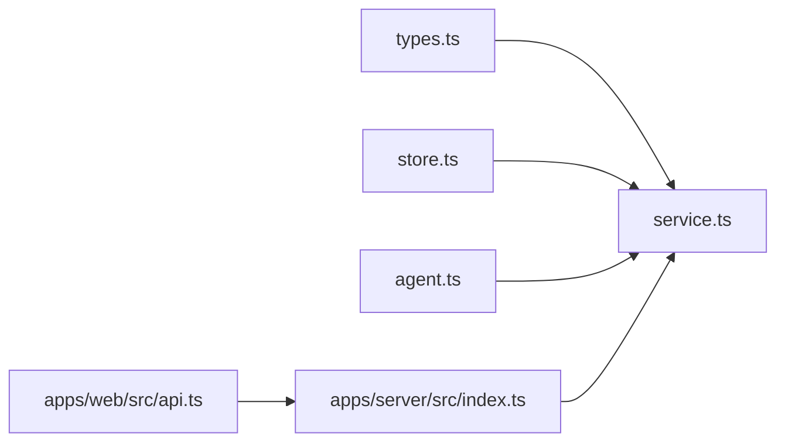

# 安全与审计模型

<cite>
**本文档引用的文件**
- [packages/core/src/types.ts](file://packages/core/src/types.ts)
- [packages/core/src/service.ts](file://packages/core/src/service.ts)
- [packages/core/src/store.ts](file://packages/core/src/store.ts)
- [packages/core/src/agent.ts](file://packages/core/src/agent.ts)
- [apps/server/src/index.ts](file://apps/server/src/index.ts)
- [apps/web/src/api.ts](file://apps/web/src/api.ts)
</cite>

## 目录
1. [简介](#简介)
2. [项目结构](#项目结构)
3. [核心组件](#核心组件)
4. [架构总览](#架构总览)
5. [详细组件分析](#详细组件分析)
6. [依赖关系分析](#依赖关系分析)
7. [性能考量](#性能考量)
8. [故障排查指南](#故障排查指南)
9. [结论](#结论)
10. [附录](#附录)

## 简介
本文件系统性阐述 RepoHelm 的安全与审计模型，覆盖以下主题：
- SecurityPolicy 的配置项与策略实现
- AuditLogEntry 的审计日志结构与记录机制
- 命令审批模式、文件作用域控制、网络作用域控制
- 密钥策略与沙箱运行时
- 权限管理与访问控制
- 安全配置最佳实践与风险评估
- 安全事件监控与告警
- 审计日志查询与分析
- 安全策略的动态更新与热配置

RepoHelm 将“隔离执行”（Git worktree）、“能力推荐与人工确认”、“安全策略与审计日志”作为核心安全支柱，配合最小权限的命令白名单与作用域限制，确保在可审计的前提下进行自动化执行。

## 项目结构
RepoHelm 的安全与审计模型主要由以下模块构成：
- 类型定义层：集中定义 SecurityPolicy、AuditLogEntry、RepoHelmState 等核心数据结构
- 服务层：实现安全策略评估、审计日志记录、策略与日志的读写接口
- 存储层：提供 JSON 与 SQLite 两种状态存储，内置默认安全策略与审计日志
- 代理后端层：封装不同 Agent 后端的可用性与执行流程，受安全策略约束
- 服务器层：暴露 REST API，提供安全策略与审计日志的查询与更新
- Web 层：前端类型与 API 客户端，支撑策略与审计界面

图表来源
- [packages/core/src/types.ts:135-152](file://packages/core/src/types.ts#L135-L152)
- [packages/core/src/service.ts:892-919](file://packages/core/src/service.ts#L892-L919)
- [packages/core/src/store.ts:6-25](file://packages/core/src/store.ts#L6-L25)
- [packages/core/src/agent.ts:395-411](file://packages/core/src/agent.ts#L395-L411)
- [apps/server/src/index.ts:194-208](file://apps/server/src/index.ts#L194-L208)
- [apps/web/src/api.ts:128-145](file://apps/web/src/api.ts#L128-L145)

章节来源
- [packages/core/src/types.ts:135-152](file://packages/core/src/types.ts#L135-L152)
- [packages/core/src/service.ts:892-919](file://packages/core/src/service.ts#L892-L919)
- [packages/core/src/store.ts:6-25](file://packages/core/src/store.ts#L6-L25)
- [packages/core/src/agent.ts:395-411](file://packages/core/src/agent.ts#L395-L411)
- [apps/server/src/index.ts:194-208](file://apps/server/src/index.ts#L194-L208)
- [apps/web/src/api.ts:128-145](file://apps/web/src/api.ts#L128-L145)

## 核心组件
- SecurityPolicy（安全策略）
  - 命令审批模式：allowlist（白名单）或 manual（人工审批）
  - 允许命令列表：白名单条目，支持以命令名或主体标识匹配
  - 文件作用域：限定可访问的文件范围（如 workspace、worktree、knowledge）
  - 网络作用域：限定可访问的网络范围（如 localhost）
  - 密钥策略：redact-env（环境变量脱敏）或 deny（禁止）
  - 沙箱运行时：local（本地）或 external（外部）
  - 更新时间：策略最后更新时间戳
- AuditLogEntry（审计日志条目）
  - 类型：command/file/network/secrets/capability/sandbox
  - 决策：allowed/denied/recorded
  - 主体：触发动作的主体标识（如命令、能力、沙箱）
  - 明细：决策依据与上下文
  - 时间：记录时间
- RepoHelmState（全局状态）
  - 包含 securityPolicy 与 auditLog 字段，贯穿执行生命周期

章节来源
- [packages/core/src/types.ts:135-152](file://packages/core/src/types.ts#L135-L152)
- [packages/core/src/store.ts:6-25](file://packages/core/src/store.ts#L6-L25)

## 架构总览
RepoHelm 的安全与审计贯穿“策略评估—执行—审计”的闭环：
- 策略评估：在执行前对命令、能力、网络等进行策略校验
- 执行控制：根据策略允许或拒绝执行，并记录审计日志
- 日志持久化：审计日志与状态一起持久化，支持查询与分析
- 动态更新：通过 API 实时更新安全策略，无需重启服务

图表来源
- [apps/server/src/index.ts:194-203](file://apps/server/src/index.ts#L194-L203)
- [packages/core/src/service.ts:591-615](file://packages/core/src/service.ts#L591-L615)
- [packages/core/src/service.ts:898-913](file://packages/core/src/service.ts#L898-L913)
- [packages/core/src/service.ts:1257-1278](file://packages/core/src/service.ts#L1257-L1278)
- [packages/core/src/service.ts:1280-1289](file://packages/core/src/service.ts#L1280-L1289)

章节来源
- [apps/server/src/index.ts:194-203](file://apps/server/src/index.ts#L194-L203)
- [packages/core/src/service.ts:591-615](file://packages/core/src/service.ts#L591-L615)
- [packages/core/src/service.ts:898-913](file://packages/core/src/service.ts#L898-L913)
- [packages/core/src/service.ts:1257-1278](file://packages/core/src/service.ts#L1257-L1278)
- [packages/core/src/service.ts:1280-1289](file://packages/core/src/service.ts#L1280-L1289)

## 详细组件分析

### 安全策略 SecurityPolicy
- 配置项与含义
  - commandApprovalMode：allowlist 或 manual
  - allowedCommands：白名单条目，支持命令名或主体标识
  - fileScopes：文件访问范围
  - networkScopes：网络访问范围
  - secretsPolicy：redact-env 或 deny
  - sandboxRuntime：local 或 external
  - updatedAt：策略更新时间
- 默认值与初始化
  - 初始状态包含默认安全策略与空审计日志
- 策略评估逻辑
  - 若命令为空则放行（视为跳过）
  - manual 模式下一律拒绝
  - allowlist 模式下以命令首词或主体标识匹配白名单
- 策略更新与审计
  - 通过 API 更新策略后，自动记录一次审计条目（类型为 sandbox）

图表来源
- [packages/core/src/service.ts:1257-1278](file://packages/core/src/service.ts#L1257-L1278)

章节来源
- [packages/core/src/store.ts:6-25](file://packages/core/src/store.ts#L6-L25)
- [packages/core/src/service.ts:898-913](file://packages/core/src/service.ts#L898-L913)
- [packages/core/src/service.ts:1257-1278](file://packages/core/src/service.ts#L1257-L1278)

### 审计日志 AuditLogEntry
- 结构字段
  - id、type、decision、subject、detail、createdAt
- 记录场景
  - 命令执行（允许/拒绝）
  - 能力确认/忽略（recorded）
  - 安全策略更新（sandbox）
- 查询与限制
  - API 提供列表接口，服务端限制返回数量（示例为前 100 条）

图表来源
- [packages/core/src/types.ts:145-152](file://packages/core/src/types.ts#L145-L152)

章节来源
- [packages/core/src/service.ts:916-919](file://packages/core/src/service.ts#L916-L919)
- [packages/core/src/service.ts:1179-1187](file://packages/core/src/service.ts#L1179-L1187)
- [packages/core/src/service.ts:1280-1289](file://packages/core/src/service.ts#L1280-L1289)

### 命令审批模式、文件作用域与网络作用域
- 命令审批模式
  - allowlist：基于白名单放行；manual：强制人工审批
- 文件作用域
  - 限定 Agent 后端与工作树文件系统的访问范围
- 网络作用域
  - 限定对外部网络的访问范围（如 localhost）
- 实现位置
  - 策略评估与审计均在服务层实现
  - Agent 后端在执行前会进行可用性与命令评估

章节来源
- [packages/core/src/service.ts:591-615](file://packages/core/src/service.ts#L591-L615)
- [packages/core/src/service.ts:1257-1278](file://packages/core/src/service.ts#L1257-L1278)

### 密钥策略与沙箱运行时
- 密钥策略
  - redact-env：对敏感环境变量进行脱敏
  - deny：禁止使用密钥相关操作
- 沙箱运行时
  - local：在本地隔离环境中执行
  - external：在外部沙箱环境中执行
- 策略更新
  - 通过 API 更新后，服务端记录审计条目

章节来源
- [packages/core/src/types.ts:135-143](file://packages/core/src/types.ts#L135-L143)
- [apps/server/src/index.ts:97-104](file://apps/server/src/index.ts#L97-L104)
- [packages/core/src/service.ts:898-913](file://packages/core/src/service.ts#L898-L913)

### 权限管理与访问控制
- 能力权限模型
  - 能力定义包含 permissions 字段，用于声明所需权限
  - 能力推荐时附带 requiredPermissions，便于人工确认
- 访问控制
  - 命令执行受安全策略控制
  - 文件与网络访问受作用域控制
  - 密钥策略控制敏感信息处理

章节来源
- [packages/core/src/types.ts:113-133](file://packages/core/src/types.ts#L113-L133)
- [packages/core/src/service.ts:1291-1317](file://packages/core/src/service.ts#L1291-L1317)
- [packages/core/src/service.ts:1179-1187](file://packages/core/src/service.ts#L1179-L1187)

### API 与前端集成
- 服务器端 API
  - GET/ PATCH /api/security-policy：查询与更新安全策略
  - GET /api/audit-log：查询审计日志
- 前端类型与客户端
  - 前端类型定义与 API 客户端方法对应上述接口

章节来源
- [apps/server/src/index.ts:194-208](file://apps/server/src/index.ts#L194-L208)
- [apps/web/src/api.ts:128-145](file://apps/web/src/api.ts#L128-L145)

## 依赖关系分析
- 组件耦合
  - service.ts 依赖 types.ts 的数据结构与 store.ts 的状态持久化
  - agent.ts 通过 Registry 注册多种 Agent 后端，执行前受策略评估
  - server/index.ts 对外暴露 API，调用 service.ts 的方法
  - web/api.ts 与 server/index.ts 的接口保持一致
- 外部依赖
  - child_process、fs/promises 用于执行与文件系统操作
  - node:sqlite 用于 SQLite 存储

图表来源
- [packages/core/src/types.ts:135-152](file://packages/core/src/types.ts#L135-L152)
- [packages/core/src/service.ts:892-919](file://packages/core/src/service.ts#L892-L919)
- [packages/core/src/store.ts:6-25](file://packages/core/src/store.ts#L6-L25)
- [packages/core/src/agent.ts:395-411](file://packages/core/src/agent.ts#L395-L411)
- [apps/server/src/index.ts:194-208](file://apps/server/src/index.ts#L194-L208)
- [apps/web/src/api.ts:128-145](file://apps/web/src/api.ts#L128-L145)

章节来源
- [packages/core/src/service.ts:892-919](file://packages/core/src/service.ts#L892-L919)
- [packages/core/src/store.ts:6-25](file://packages/core/src/store.ts#L6-L25)
- [packages/core/src/agent.ts:395-411](file://packages/core/src/agent.ts#L395-L411)
- [apps/server/src/index.ts:194-208](file://apps/server/src/index.ts#L194-L208)
- [apps/web/src/api.ts:128-145](file://apps/web/src/api.ts#L128-L145)

## 性能考量
- 策略评估复杂度
  - 命令白名单匹配为 O(n)（n 为 allowedCommands 长度），通常较小，开销可忽略
- 审计日志写入
  - 每次策略更新与关键事件均写入，建议控制日志轮转与存储容量
- 状态持久化
  - SQLite 与 JSON 两种存储方式，SQLite 更适合生产环境

[本节为通用指导，无需特定文件来源]

## 故障排查指南
- 命令执行被拒绝
  - 检查安全策略的审批模式与白名单
  - 确认命令首词或主体是否命中 allowlist
- 审计日志缺失
  - 确认服务端是否正确记录审计条目
  - 检查返回数量限制与查询参数
- 策略更新无效
  - 确认 PATCH 请求体字段与枚举值
  - 检查服务端错误处理与返回状态

章节来源
- [packages/core/src/service.ts:1257-1278](file://packages/core/src/service.ts#L1257-L1278)
- [packages/core/src/service.ts:916-919](file://packages/core/src/service.ts#L916-L919)
- [apps/server/src/index.ts:97-104](file://apps/server/src/index.ts#L97-L104)

## 结论
RepoHelm 的安全与审计模型以“最小权限 + 可审计 + 可动态调整”为核心设计原则。通过命令白名单、文件/网络作用域、密钥策略与沙箱运行时，结合能力权限声明与审计日志，形成从策略到执行再到记录的闭环。配合 REST API 的动态更新能力，可在不中断服务的情况下快速响应安全变化。

[本节为总结性内容，无需特定文件来源]

## 附录

### 安全配置最佳实践
- 默认采用 allowlist 模式，仅允许必要命令
- 严格限制文件与网络作用域，避免越权访问
- 密钥策略优先使用 redact-env，必要时启用 deny
- 沙箱运行时优先选择 local，外部沙箱需严格管控
- 定期审查能力权限声明，遵循最小权限原则
- 开启审计日志并建立查询与告警机制

[本节为通用指导，无需特定文件来源]

### 风险评估指南
- 命令白名单误配导致执行受限或拒绝
- 作用域过大引发文件或网络越权
- 密钥策略不当造成敏感信息泄露
- 沙箱运行时配置不当影响隔离效果
- 审计日志缺失导致无法追溯

[本节为通用指导，无需特定文件来源]

### 审计日志查询与分析
- 查询接口：GET /api/audit-log
- 分页与过滤：建议在前端实现按类型、决策、时间范围筛选
- 告警联动：可将拒绝与策略更新事件接入告警系统

章节来源
- [apps/server/src/index.ts:205-208](file://apps/server/src/index.ts#L205-L208)
- [packages/core/src/service.ts:916-919](file://packages/core/src/service.ts#L916-L919)

### 安全策略动态更新与热配置
- 更新接口：PATCH /api/security-policy
- 热生效：更新后立即生效，无需重启服务
- 审计记录：自动记录策略更新事件

章节来源
- [apps/server/src/index.ts:199-203](file://apps/server/src/index.ts#L199-L203)
- [packages/core/src/service.ts:898-913](file://packages/core/src/service.ts#L898-L913)