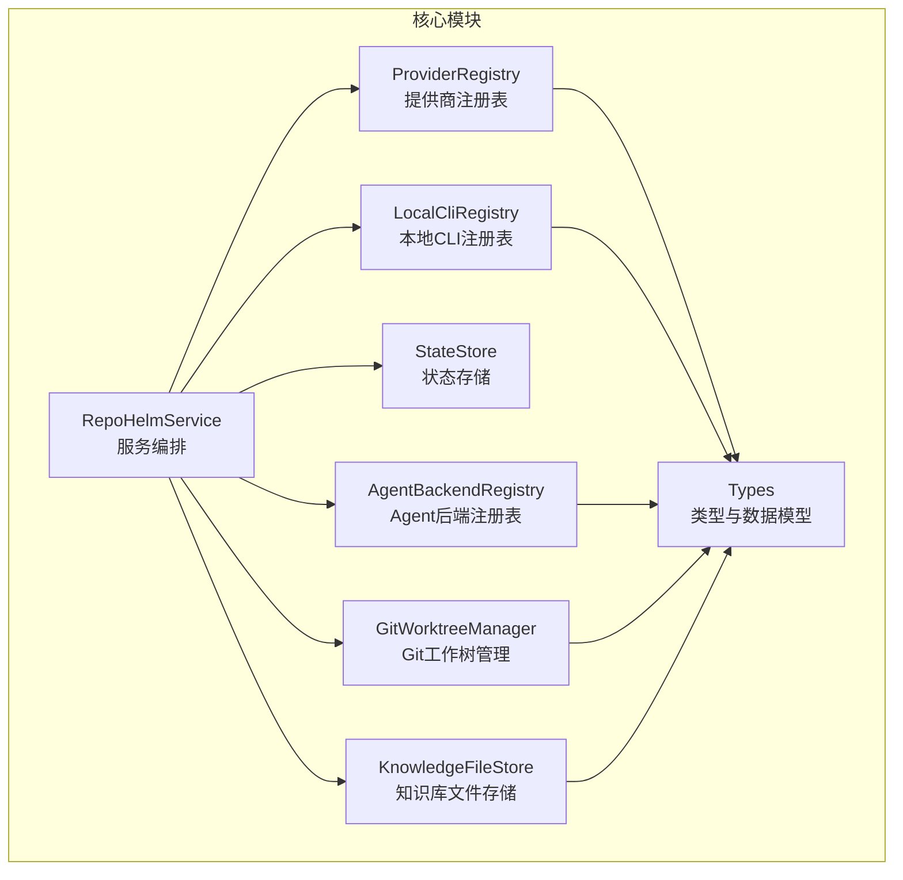
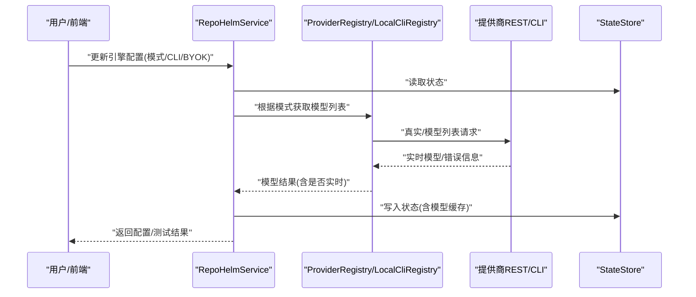
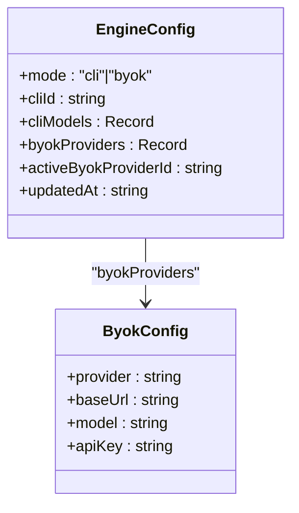
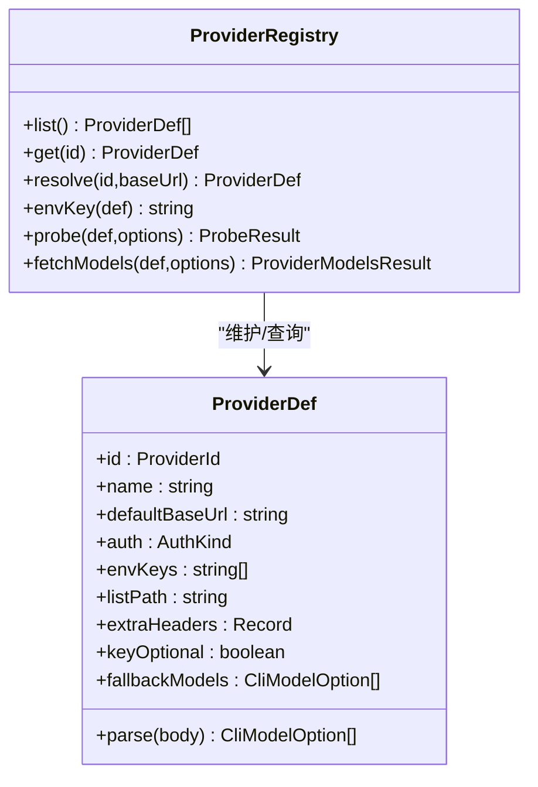
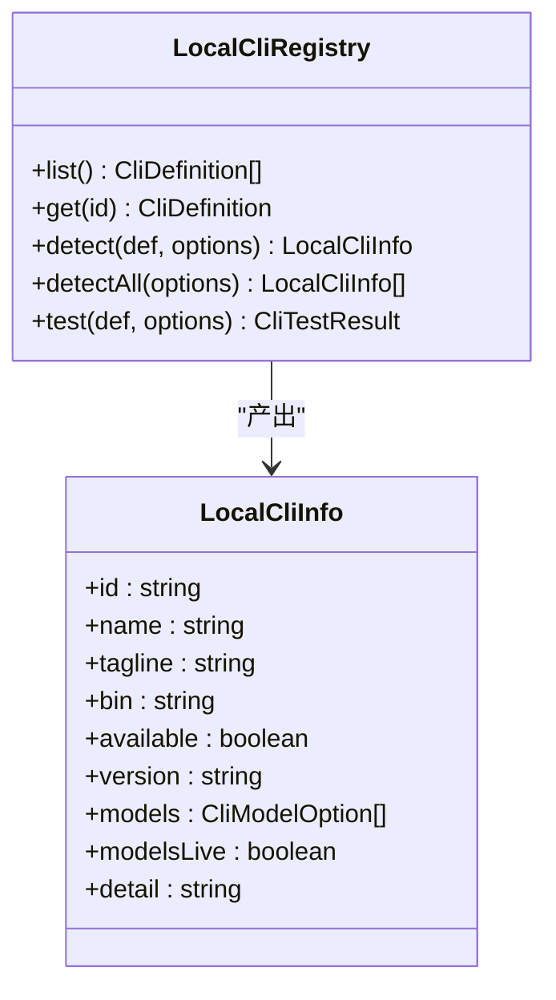
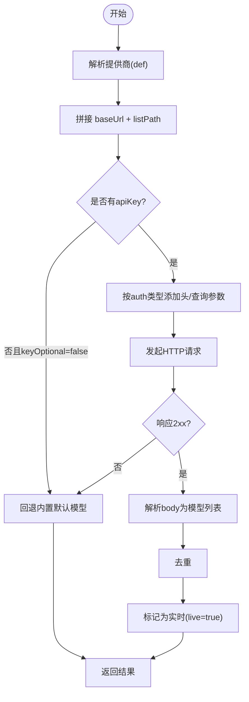
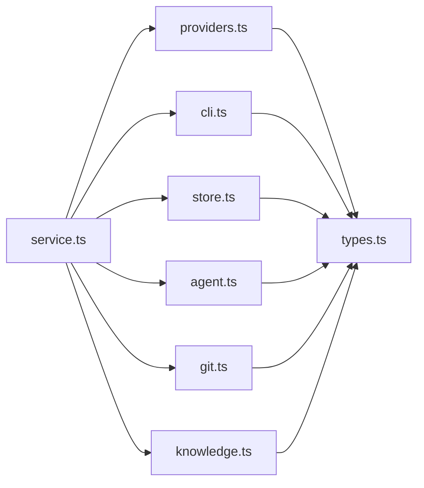

# 引擎与提供商模型

<cite>
**本文引用的文件**
- [providers.ts](file://packages/core/src/providers.ts)
- [types.ts](file://packages/core/src/types.ts)
- [service.ts](file://packages/core/src/service.ts)
- [cli.ts](file://packages/core/src/cli.ts)
- [store.ts](file://packages/core/src/store.ts)
- [agent.ts](file://packages/core/src/agent.ts)
- [git.ts](file://packages/core/src/git.ts)
- [knowledge.ts](file://packages/core/src/knowledge.ts)
- [index.ts](file://packages/core/src/index.ts)
- [providers.test.ts](file://packages/core/src/providers.test.ts)
- [service.test.ts](file://packages/core/src/service.test.ts)
- [model-config-plan.md](file://docs/model-config-plan.md)
- [README.md](file://README.md)
</cite>

## 目录
1. [简介](#简介)
2. [项目结构](#项目结构)
3. [核心组件](#核心组件)
4. [架构总览](#架构总览)
5. [详细组件分析](#详细组件分析)
6. [依赖关系分析](#依赖关系分析)
7. [性能考量](#性能考量)
8. [故障排查指南](#故障排查指南)
9. [结论](#结论)
10. [附录](#附录)

## 简介
本文件面向 RepoHelm 的“引擎与提供商模型”，系统性阐述以下主题：
- EngineConfig 的配置结构与引擎模式切换机制（CLI 模式 vs BYOK 模式）
- ProviderId 的提供商类型与配置选项
- LocalCliInfo 的本地 CLI 检测与模型管理机制
- ByokConfig 的 BYOK 提供商配置与模型映射
- 模型缓存机制与实时性保证
- CLI 测试与可用性检测
- 引擎配置的迁移与升级
- 提供商模型的发现与注册机制
- 引擎性能监控与健康检查

## 项目结构
RepoHelm 的核心位于 packages/core，围绕“服务层（RepoHelmService）+ 存储层（StateStore）+ 类型与数据模型（types）+ 提供商与 CLI 注册表（providers、cli）+ Agent 后端（agent）+ Git 工作树（git）+ 知识库（knowledge）”构建。引擎与提供商模型主要分布在 providers、types、service、cli、store 中。

图表来源
- [service.ts:56-71](file://packages/core/src/service.ts#L56-L71)
- [providers.ts:163-191](file://packages/core/src/providers.ts#L163-L191)
- [cli.ts:112-125](file://packages/core/src/cli.ts#L112-L125)
- [store.ts:86-90](file://packages/core/src/store.ts#L86-L90)
- [agent.ts:395-411](file://packages/core/src/agent.ts#L395-L411)
- [git.ts:33-343](file://packages/core/src/git.ts#L33-L343)
- [knowledge.ts:12-68](file://packages/core/src/knowledge.ts#L12-L68)

章节来源
- [README.md:1-100](file://README.md#L1-L100)
- [index.ts:1-9](file://packages/core/src/index.ts#L1-L9)

## 核心组件
- 引擎配置 EngineConfig：定义运行模式（cli/byok）、当前 CLI、CLI 模型映射、BYOK 提供商集合与活动提供商、更新时间。
- 提供商模型 ProviderId：枚举支持的提供商（openai、anthropic、gemini、deepseek、openrouter、openai-compatible）。
- 提供商注册表 ProviderRegistry：解析提供商、探测可用性、发起真实 /models 拉取、缓存与回退。
- 本地 CLI 注册表 LocalCliRegistry：探测 CLI、列出模型、真实连通性测试。
- 状态存储 StateStore：默认 JSON/SQLite 存储，含引擎配置迁移逻辑。
- Agent 后端注册表 AgentBackendRegistry：内置 mock 与外部 CLI、OpenAI-compatible provider 后端。
- GitWorktreeManager：工作树生命周期管理与变更检测。
- 知识库文件存储 KnowledgeFileStore：知识条目落盘。

章节来源
- [types.ts:262-277](file://packages/core/src/types.ts#L262-L277)
- [types.ts:212-219](file://packages/core/src/types.ts#L212-L219)
- [providers.ts:163-304](file://packages/core/src/providers.ts#L163-L304)
- [cli.ts:112-368](file://packages/core/src/cli.ts#L112-L368)
- [store.ts:86-166](file://packages/core/src/store.ts#L86-L166)
- [agent.ts:395-411](file://packages/core/src/agent.ts#L395-L411)
- [git.ts:33-343](file://packages/core/src/git.ts#L33-L343)
- [knowledge.ts:12-68](file://packages/core/src/knowledge.ts#L12-L68)

## 架构总览
引擎与提供商模型的运行路径如下：
- 用户通过 UI 或 API 更新 EngineConfig（切换模式、选择 CLI、配置 BYOK）。
- RepoHelmService 读取状态，根据模式调用 LocalCliRegistry 或 ProviderRegistry 获取模型列表。
- ProviderRegistry 通过 REST /models 拉取实时模型，结合缓存 TTL 控制实时性。
- LocalCliRegistry 通过 CLI 自身能力或环境变量驱动的提供商 REST 拉取实时模型。
- 测试接口对 CLI 与提供商进行真实可用性检测，返回延迟与详情。
- 状态持久化至 SQLite/JSON，含旧格式迁移。

图表来源
- [service.ts:364-389](file://packages/core/src/service.ts#L364-L389)
- [service.ts:422-455](file://packages/core/src/service.ts#L422-L455)
- [providers.ts:221-302](file://packages/core/src/providers.ts#L221-L302)
- [cli.ts:126-198](file://packages/core/src/cli.ts#L126-L198)
- [store.ts:98-114](file://packages/core/src/store.ts#L98-L114)

## 详细组件分析

### EngineConfig 与引擎模式切换
- 模式字段 mode：cli 或 byok。
- CLI 模式：
  - cliId：当前选中的本地 CLI。
  - cliModels：记录每个 CLI 的模型选择（键为 CLI id，值为模型 id）。
- BYOK 模式：
  - byokProviders：按提供商 id 维度的配置集合，每项包含 provider、baseUrl、model、apiKey。
  - activeByokProviderId：当前活动的 BYOK 提供商 id。
- 更新策略：
  - updateEngine 支持部分字段更新，合并现有状态与新输入，写回状态存储。
- 默认值与迁移：
  - defaultEngineConfig 设定初始默认值。
  - migrateEngine 将旧 byok 字段迁移为新的 byokProviders 格式，并设置默认活动提供商。

图表来源
- [types.ts:262-269](file://packages/core/src/types.ts#L262-L269)
- [types.ts:255-260](file://packages/core/src/types.ts#L255-L260)
- [store.ts:27-34](file://packages/core/src/store.ts#L27-L34)
- [store.ts:36-84](file://packages/core/src/store.ts#L36-L84)

章节来源
- [types.ts:262-277](file://packages/core/src/types.ts#L262-L277)
- [store.ts:27-34](file://packages/core/src/store.ts#L27-L34)
- [store.ts:36-84](file://packages/core/src/store.ts#L36-L84)
- [service.ts:364-389](file://packages/core/src/service.ts#L364-L389)

### ProviderId 与提供商类型
- ProviderId 枚举：openai、anthropic、gemini、deepseek、openrouter、openai-compatible。
- ProviderDef 描述：
  - id、name、defaultBaseUrl、auth（bearer/x-api-key/query-key/none）、envKeys（环境变量键）、listPath（/models 路径）、extraHeaders、keyOptional（无需密钥即可列出）、parse（解析函数）、fallbackModels（内置默认模型）。
- ProviderRegistry：
  - resolve：按 id、baseUrl 推断提供商；若均未指定，默认 openai-compatible。
  - envKey：从 envKeys 中探针首个非空值。
  - probe/fetchModels：真实连通性探测与模型拉取，支持超时、回退内置模型、去重、返回 detail 与 fetchedAt。

图表来源
- [providers.ts:15-29](file://packages/core/src/providers.ts#L15-L29)
- [providers.ts:163-304](file://packages/core/src/providers.ts#L163-L304)
- [types.ts:212-219](file://packages/core/src/types.ts#L212-L219)

章节来源
- [providers.ts:79-161](file://packages/core/src/providers.ts#L79-L161)
- [providers.ts:163-304](file://packages/core/src/providers.ts#L163-L304)
- [types.ts:212-219](file://packages/core/src/types.ts#L212-L219)

### LocalCliInfo 与本地 CLI 检测
- LocalCliInfo：
  - id、name、tagline、bin、available、version、models、modelsLive、detail。
- LocalCliRegistry：
  - detect：探测二进制是否存在、版本；根据 refresh 与 CLI 能力决定是否实时拉取模型；支持 providerId 通过环境变量驱动的 REST 拉取；回退内置默认模型与别名。
  - detectAll：批量探测。
  - test：真实连通性测试（执行版本命令 + 非交互 ping），返回延迟与消息。
- CLI_DEFINITIONS：内置 claude-code、codex-cli、gemini-cli、opencode 的定义与能力。

图表来源
- [cli.ts:112-368](file://packages/core/src/cli.ts#L112-L368)
- [types.ts:236-246](file://packages/core/src/types.ts#L236-L246)

章节来源
- [cli.ts:112-368](file://packages/core/src/cli.ts#L112-L368)
- [types.ts:236-246](file://packages/core/src/types.ts#L236-L246)

### ByokConfig 与 BYOK 提供商配置
- ByokConfig：provider、baseUrl、model、apiKey。
- RepoHelmService.listProviderModels：
  - 从 EngineConfig 中读取 savedConfig（按 providerId），与输入参数（providerId、baseUrl、apiKey）共同决定最终请求参数。
  - 使用缓存键（providerId:baseUrl）与 TTL 控制实时性。
- ProviderRegistry.fetchModels：
  - 若未提供 apiKey 且提供商不允许 keyOptional，则回退内置默认模型。
  - 根据 auth 类型构造 Authorization 或 query key。
  - 解析响应体，去重，返回 live/detail/fetchedAt。
- LocalCliRegistry.detect：
  - 对具备 providerId 的 CLI，可通过环境变量中的 API Key 从对应提供商拉取实时模型，合并别名模型。

图表来源
- [service.ts:422-455](file://packages/core/src/service.ts#L422-L455)
- [providers.ts:221-302](file://packages/core/src/providers.ts#L221-L302)

章节来源
- [types.ts:255-260](file://packages/core/src/types.ts#L255-L260)
- [service.ts:422-455](file://packages/core/src/service.ts#L422-L455)
- [providers.ts:221-302](file://packages/core/src/providers.ts#L221-L302)
- [cli.ts:156-175](file://packages/core/src/cli.ts#L156-L175)

### 模型缓存机制与实时性保证
- 缓存键：providerId:baseUrl。
- TTL：6 小时（MODEL_CACHE_TTL_MS）。
- 读取策略：若 refresh=false 且缓存未过期，直接返回缓存；否则触发真实拉取并写入缓存。
- 回退策略：当真实请求失败或返回空列表时，回退到提供商内置默认模型，并标记 live=false。
- 用途：listProviderModels 与 listLocalClis(refresh=true) 均受此机制保护。

章节来源
- [service.ts:417-455](file://packages/core/src/service.ts#L417-L455)
- [providers.ts:221-302](file://packages/core/src/providers.ts#L221-L302)

### CLI 测试与可用性检测
- LocalCliRegistry.test：
  - 先执行版本命令，验证二进制可执行性与延迟。
  - 若定义了 ping，执行非交互调用，捕获 stdout/stderr，校验回复内容与超时。
  - 返回 ok、latencyMs、message。
- RepoHelmService.testLocalCli：
  - 通过 CLI 定义与当前 EngineConfig 中的模型选择进行测试。
- RepoHelmService.testProvider：
  - 通过 ProviderRegistry.probe 对 BYOK 提供商进行真实 /models 请求探测，返回延迟与模型数量。

章节来源
- [cli.ts:204-272](file://packages/core/src/cli.ts#L204-L272)
- [service.ts:349-357](file://packages/core/src/service.ts#L349-L357)
- [service.ts:391-406](file://packages/core/src/service.ts#L391-L406)
- [providers.ts:207-219](file://packages/core/src/providers.ts#L207-L219)

### 引擎配置的迁移与升级
- 旧格式：engine.byok（单提供商）。
- 新格式：engine.byokProviders（按提供商 id 分组），并新增 activeByokProviderId。
- 迁移逻辑：
  - 读取旧 state 后，若存在 byok 字段，解析 baseUrl 推断 providerId，并迁移为 byokProviders。
  - 删除旧 byok 字段，确保新字段存在默认值。
- 迁移入口：JsonStateStore.read 与 SqliteStateStore.read 均调用 migrateEngine。

章节来源
- [store.ts:36-84](file://packages/core/src/store.ts#L36-L84)
- [store.ts:98-114](file://packages/core/src/store.ts#L98-L114)
- [store.ts:125-139](file://packages/core/src/store.ts#L125-L139)

### 提供商模型的发现与注册机制
- 发现：
  - ProviderRegistry.list/resolve/get 提供静态定义与动态解析。
  - ProviderRegistry.envKey 从 envKeys 中探针 API Key。
- 注册：
  - PROVIDER_DEFINITIONS 集合集中管理各提供商的元数据与解析器。
  - CLI_DEFINITIONS 集合管理本地 CLI 的定义与能力。
- 服务集成：
  - RepoHelmService.listProviders 返回 ProviderInfo（id/name/defaultBaseUrl/keyOptional）。
  - RepoHelmService.listProviderModels/listLocalClis 通过注册表统一获取模型。

章节来源
- [providers.ts:79-161](file://packages/core/src/providers.ts#L79-L161)
- [providers.ts:163-201](file://packages/core/src/providers.ts#L163-L201)
- [cli.ts:43-110](file://packages/core/src/cli.ts#L43-L110)
- [service.ts:408-415](file://packages/core/src/service.ts#L408-L415)
- [service.ts:422-455](file://packages/core/src/service.ts#L422-L455)

### 引擎性能监控与健康检查
- 性能指标：
  - CLI 测试 latencyMs。
  - Provider probe latencyMs。
  - 模型拉取超时控制（默认 10 秒）。
- 健康检查：
  - ProviderRegistry.probe 返回 detail 与 modelCount，便于 UI 展示健康状态。
  - GitWorktreeManager.inspectRepository 提供仓库健康状态（ok/missing/not_git）。
- 状态持久化：
  - StateStore（SQLite/JSON）记录 engine 与 modelCache，支持跨进程/重启恢复。

章节来源
- [providers.ts:207-219](file://packages/core/src/providers.ts#L207-L219)
- [cli.ts:204-272](file://packages/core/src/cli.ts#L204-L272)
- [git.ts:34-61](file://packages/core/src/git.ts#L34-L61)
- [store.ts:86-166](file://packages/core/src/store.ts#L86-L166)

## 依赖关系分析

图表来源
- [service.ts:1-39](file://packages/core/src/service.ts#L1-L39)
- [providers.ts:1-35](file://packages/core/src/providers.ts#L1-L35)
- [cli.ts:1-6](file://packages/core/src/cli.ts#L1-L6)
- [store.ts:1-5](file://packages/core/src/store.ts#L1-L5)
- [agent.ts:1-7](file://packages/core/src/agent.ts#L1-L7)
- [git.ts:1-7](file://packages/core/src/git.ts#L1-L7)
- [knowledge.ts:1-4](file://packages/core/src/knowledge.ts#L1-L4)
- [types.ts:1-35](file://packages/core/src/types.ts#L1-L35)

章节来源
- [index.ts:1-9](file://packages/core/src/index.ts#L1-L9)

## 性能考量
- 模型缓存：6 小时 TTL，减少对外部提供商的频繁请求，提升 UI 响应速度。
- 超时控制：ProviderRegistry.fetchModels 默认 10 秒超时，避免阻塞；CLI ping 也有各自超时上限。
- 去重与回退：解析模型时去重，失败时回退内置默认模型，保证可用性。
- 状态持久化：SQLite/JSON 双栈，兼顾易用与可靠性；迁移逻辑确保平滑升级。

## 故障排查指南
- Provider 模型为空或失败：
  - 检查 apiKey 是否正确设置（envKey 会从 envKeys 中探针）。
  - 使用 testProvider 观察 detail 与 latencyMs。
  - 确认 baseUrl 正确且网络可达。
- CLI 无法检测或测试失败：
  - 确认二进制存在于 PATH，或配置 fallbackBins。
  - 使用 testLocalCli 查看具体错误消息（如未登录、超时）。
  - 对具备 providerId 的 CLI，确保环境变量中 API Key 已设置。
- 引擎配置迁移问题：
  - 旧 byok 字段会自动迁移为 byokProviders；若出现异常，检查 state.json 并确认迁移逻辑是否生效。
- 缓存导致模型陈旧：
  - 使用 refresh=true 强制实时拉取，或等待 TTL 过期。

章节来源
- [providers.ts:221-302](file://packages/core/src/providers.ts#L221-L302)
- [cli.ts:204-272](file://packages/core/src/cli.ts#L204-L272)
- [store.ts:36-84](file://packages/core/src/store.ts#L36-L84)
- [service.ts:391-406](file://packages/core/src/service.ts#L391-L406)

## 结论
RepoHelm 的引擎与提供商模型通过清晰的配置结构（EngineConfig）、可插拔的提供商注册表（ProviderRegistry）、本地 CLI 注册表（LocalCliRegistry）与状态持久化（StateStore），实现了灵活的“CLI 模式”与“BYOK 模式”双轨运行。模型缓存与实时性控制、CLI/提供商可用性测试、以及旧配置迁移，共同保障了用户体验与系统的稳定性。未来可在密钥安全、可观测性与 UI 交互上进一步增强。

## 附录
- 相关文档与计划：
  - 模型接入升级方案（本机 CLI + BYOK）：[model-config-plan.md:1-88](file://docs/model-config-plan.md#L1-L88)
- 项目概览与启动说明：[README.md:1-100](file://README.md#L1-L100)