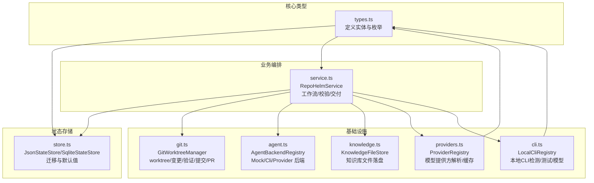
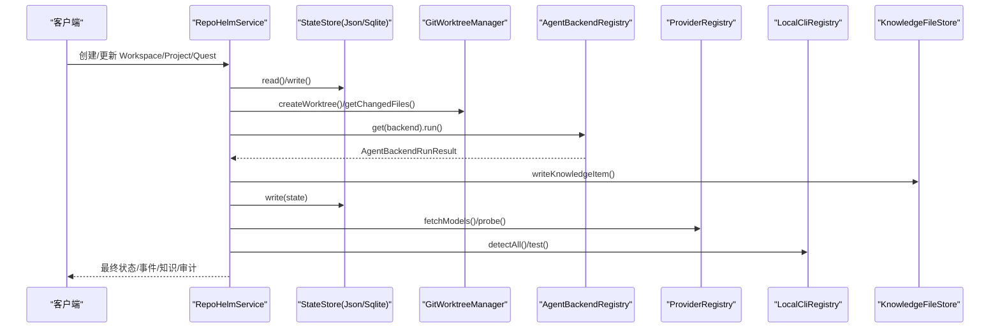
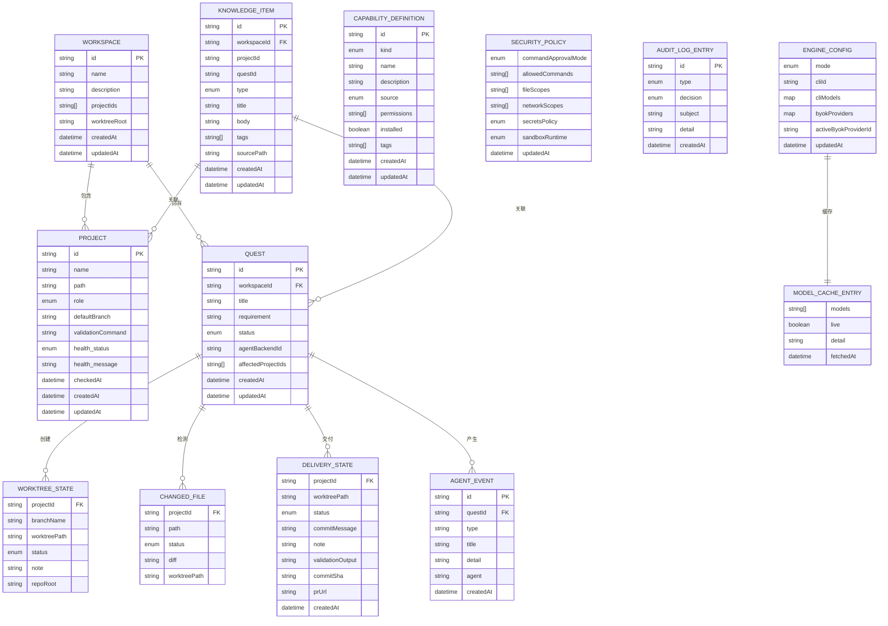
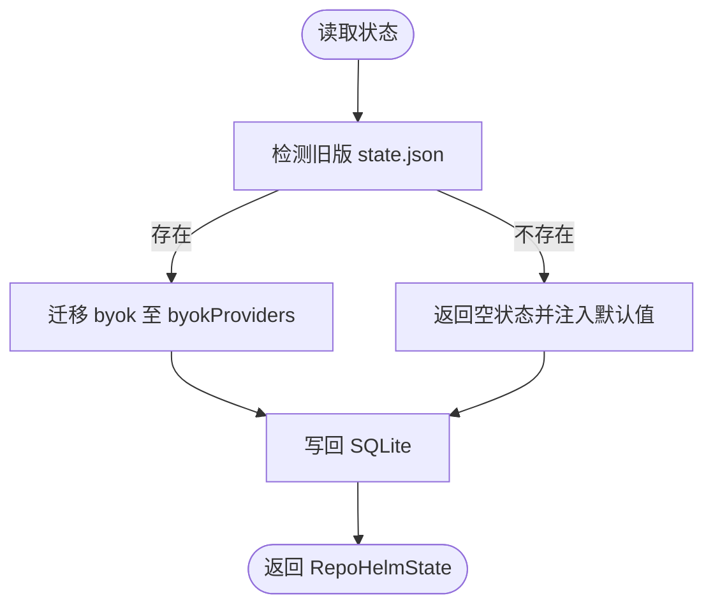
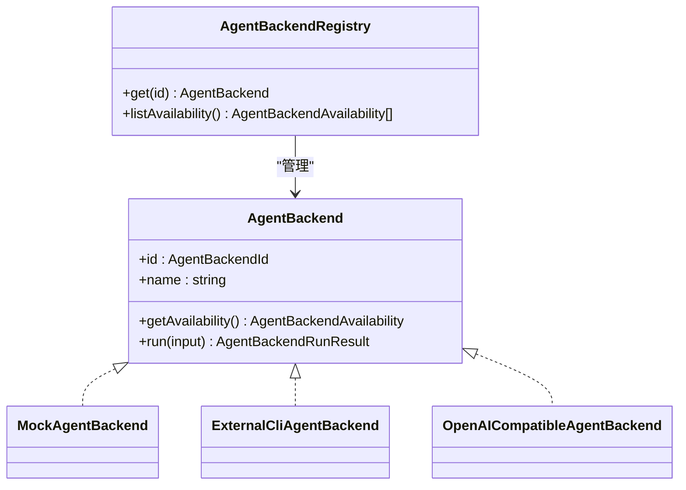
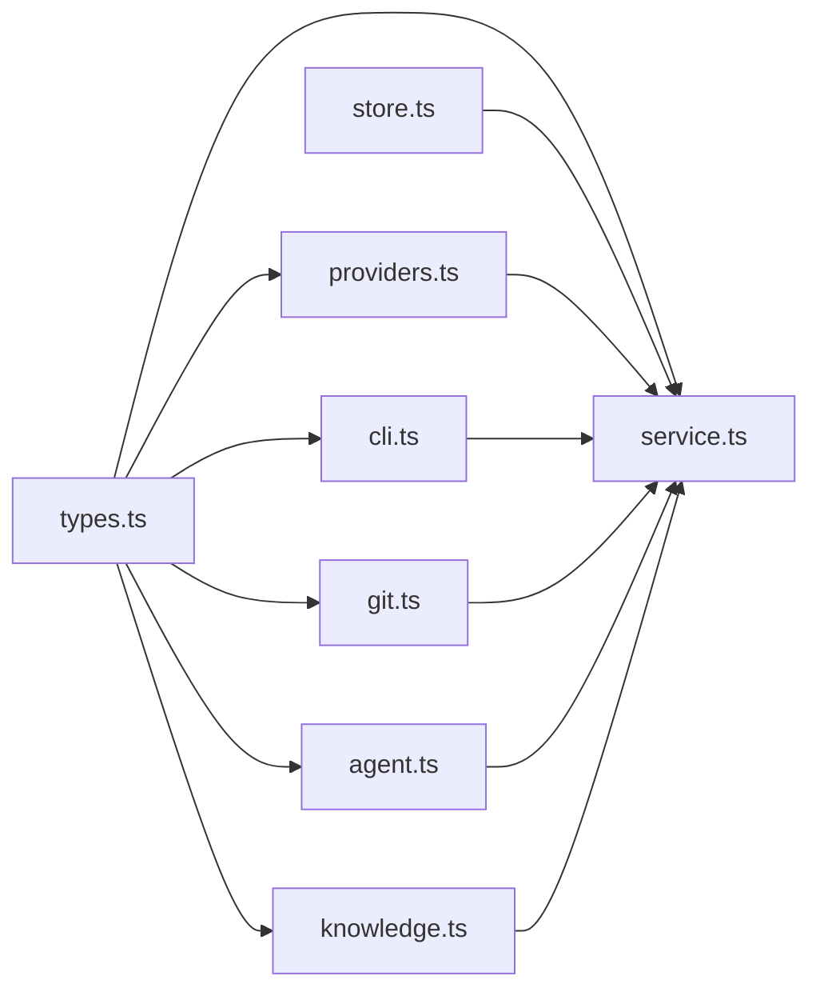

# 数据模型和类型系统

<cite>
**本文引用的文件**
- [types.ts](file://packages/core/src/types.ts)
- [store.ts](file://packages/core/src/store.ts)
- [service.ts](file://packages/core/src/service.ts)
- [agent.ts](file://packages/core/src/agent.ts)
- [git.ts](file://packages/core/src/git.ts)
- [knowledge.ts](file://packages/core/src/knowledge.ts)
- [providers.ts](file://packages/core/src/providers.ts)
- [cli.ts](file://packages/core/src/cli.ts)
- [README.md](file://README.md)
- [model-config-plan.md](file://docs/model-config-plan.md)
</cite>

## 目录
1. [简介](#简介)
2. [项目结构](#项目结构)
3. [核心组件](#核心组件)
4. [架构总览](#架构总览)
5. [详细组件分析](#详细组件分析)
6. [依赖分析](#依赖分析)
7. [性能考量](#性能考量)
8. [故障排查指南](#故障排查指南)
9. [结论](#结论)
10. [附录](#附录)

## 简介
本文件系统性梳理 RepoHelm 的数据模型与类型系统，聚焦以下实体与关系：Workspace、Project、Quest、AgentEvent、WorktreeState、ChangedFile、DeliveryState、KnowledgeItem、CapabilityDefinition、SecurityPolicy、AuditLogEntry、EngineConfig、ModelCacheEntry 等。文档涵盖字段定义、数据验证与业务规则、状态存储与缓存策略、数据生命周期与迁移路径、安全与访问控制、扩展与定制指南，以及类型系统的最佳实践与性能优化建议。

## 项目结构
RepoHelm 的数据模型主要位于 packages/core/src/types.ts，状态持久化与迁移在 store.ts，业务编排与工作流在 service.ts，Agent 后端与 Git 操作在 agent.ts 与 git.ts，知识库文件落盘在 knowledge.ts，模型提供方注册与缓存在 providers.ts 与 cli.ts。

图表来源
- [types.ts:1-334](file://packages/core/src/types.ts#L1-L334)
- [store.ts:1-166](file://packages/core/src/store.ts#L1-L166)
- [service.ts:1-800](file://packages/core/src/service.ts#L1-L800)
- [git.ts:1-343](file://packages/core/src/git.ts#L1-L343)
- [agent.ts:1-436](file://packages/core/src/agent.ts#L1-L436)
- [knowledge.ts:1-68](file://packages/core/src/knowledge.ts#L1-L68)
- [providers.ts:1-304](file://packages/core/src/providers.ts#L1-L304)
- [cli.ts:1-368](file://packages/core/src/cli.ts#L1-L368)

章节来源
- [types.ts:1-334](file://packages/core/src/types.ts#L1-L334)
- [store.ts:1-166](file://packages/core/src/store.ts#L1-L166)
- [service.ts:1-800](file://packages/core/src/service.ts#L1-L800)

## 核心组件
本节概述关键数据结构及其职责与约束。

- Workspace（工作区）
  - 字段：id、name、description、projectIds、worktrees、worktreeRoot、createdAt、updatedAt
  - 关系：包含多个 Project 与多个 Git worktree；worktreeRoot 决定 worktree 存放位置
  - 业务规则：link/unlink 项目时创建/删除 worktree；删除项目时级联清理

- Project（项目）
  - 字段：id、name、path、role、defaultBranch、validationCommand、health、createdAt、updatedAt
  - 关系：被多个 Workspace 引用；与 Git 仓库健康度绑定
  - 业务规则：更新 path/defaultBranch 会重置 health 状态

- Quest（任务）
  - 字段：id、workspaceId、title、requirement、status、spec、agentBackendId、affectedProjectIds、worktrees、changedFiles、validationResults、reviewNotes、deliveryResults、capabilityRecommendations、agentSummary、createdAt、updatedAt
  - 关系：属于一个 Workspace；影响多个 Project；生成 AgentEvent 与 KnowledgeItem
  - 状态：draft/specifying/planning/preparing/executing/validating/reviewing/ready/delivered/blocked/cancelled

- AgentEvent（代理事件）
  - 字段：id、questId、type、title、detail、agent、createdAt
  - 用途：记录 Agent 执行过程中的关键事件，便于审计与回溯

- WorktreeState（工作树状态）
  - 字段：projectId、branchName、worktreePath、status、note、repoRoot
  - 状态：not_created/planned/created/failed/cleaned

- ChangedFile（变更文件）
  - 字段：projectId、path、status、diff、worktreePath
  - 状态：added/modified/deleted/renamed/untracked/unknown

- DeliveryState（交付状态）
  - 字段：projectId、worktreePath、status、commitMessage、note、validationOutput、commitSha、prUrl、createdAt
  - 状态：validated/committed/pr_ready/pr_created/failed

- KnowledgeItem（知识条目）
  - 字段：id、workspaceId、projectId、questId、type、title、body、tags、sourcePath、createdAt、updatedAt
  - 类型：repo-wiki/architecture/decision/memory/troubleshooting

- CapabilityDefinition（能力定义）
  - 字段：id、kind、name、description、source、permissions、installed、tags、createdAt、updatedAt
  - kind：skill/agent/mcp；source：builtin/workspace/external

- SecurityPolicy（安全策略）
  - 字段：commandApprovalMode、allowedCommands、fileScopes、networkScopes、secretsPolicy、sandboxRuntime、updatedAt
  - 用途：控制命令白名单、文件/网络作用域、密钥策略与沙箱运行

- AuditLogEntry（审计日志）
  - 字段：id、type、decision、subject、detail、createdAt
  - 类型：command/file/network/secrets/capability/sandbox

- EngineConfig（引擎配置）
  - 字段：mode、cliId、cliModels、byokProviders、activeByokProviderId、updatedAt
  - 模式：cli/byok；持久化模型选择与 BYOK 提供方

- ModelCacheEntry（模型缓存）
  - 字段：models、live、detail、fetchedAt
  - TTL：6小时

- RepoHelmState（全局状态）
  - 字段：workspaces、projects、quests、events、knowledge、capabilities、securityPolicy、auditLog、engine、modelCache

章节来源
- [types.ts:173-290](file://packages/core/src/types.ts#L173-L290)

## 架构总览
RepoHelm 的数据流围绕 RepoHelmService 展开：读取/写入状态（store.ts），创建/更新 Workspace/Project/Quest，驱动 Agent 后端执行，操作 Git worktree，生成事件与知识条目，维护安全策略与审计日志，缓存模型列表。

图表来源
- [service.ts:56-800](file://packages/core/src/service.ts#L56-L800)
- [store.ts:86-166](file://packages/core/src/store.ts#L86-L166)
- [git.ts:33-343](file://packages/core/src/git.ts#L33-L343)
- [agent.ts:395-436](file://packages/core/src/agent.ts#L395-L436)
- [providers.ts:163-304](file://packages/core/src/providers.ts#L163-L304)
- [cli.ts:112-368](file://packages/core/src/cli.ts#L112-L368)
- [knowledge.ts:12-68](file://packages/core/src/knowledge.ts#L12-L68)

## 详细组件分析

### 数据模型与关系图

图表来源
- [types.ts:1-334](file://packages/core/src/types.ts#L1-L334)

章节来源
- [types.ts:1-334](file://packages/core/src/types.ts#L1-L334)

### 状态存储与缓存策略
- 存储实现
  - JsonStateStore：读写 .repohelm/state.json，默认安全策略与空状态初始化
  - SqliteStateStore：读写 .repohelm/state.sqlite，支持迁移与事务式写入
- 迁移机制
  - 旧版 byok 字段迁移至 byokProviders，补充 activeByokProviderId
  - 首次读取若无数据，返回空状态并注入默认安全策略
- 缓存策略
  - 模型缓存：ProviderRegistry.fetchModels 对每个 providerId:baseUrl 维护缓存，TTL 6小时
  - CLI 模型缓存：LocalCliRegistry.detect 支持 refresh 拉取实时模型，否则使用内置默认值
- 默认值
  - 安全策略：命令白名单、文件/网络作用域、密钥策略、沙箱运行模式
  - 引擎配置：默认 CLI 后端与 BYOK 提供方

图表来源
- [store.ts:86-166](file://packages/core/src/store.ts#L86-L166)

章节来源
- [store.ts:1-166](file://packages/core/src/store.ts#L1-L166)
- [providers.ts:221-304](file://packages/core/src/providers.ts#L221-L304)
- [cli.ts:126-202](file://packages/core/src/cli.ts#L126-L202)

### 数据验证与业务规则
- Workspace/Project/Quest 创建/更新
  - 自动生成 createdAt/updatedAt；Project 更新 path/defaultBranch 会重置 health
- Worktree 生命周期
  - 创建：GitWorktreeManager.createWorktree；失败/成功返回状态与备注
  - 清理：removeWorktree 删除 worktree 与对应分支
  - 变更检测：getChangedFiles 解析 status 并生成 diff
- 交付流程
  - 验证：runValidation 执行项目配置的验证命令
  - 提交：commitAll 自动 add/commit
  - PR：createPullRequest 通过 gh 或生成 handoff
- 安全策略
  - 命令白名单与权限评估，拒绝后生成审计日志
- 知识库
  - writeKnowledgeItem 写入 Markdown 文件，含 YAML frontmatter

章节来源
- [service.ts:143-339](file://packages/core/src/service.ts#L143-L339)
- [git.ts:79-250](file://packages/core/src/git.ts#L79-L250)
- [knowledge.ts:15-43](file://packages/core/src/knowledge.ts#L15-L43)

### Agent 后端与执行链路
- 后端类型
  - MockAgentBackend：内置实现，写入示例产物
  - ExternalCliAgentBackend：通过环境变量命令模板执行外部 CLI
  - OpenAICompatibleAgentBackend：调用兼容 OpenAI 接口的 Provider
- 可用性检测
  - getAvailability 返回可用性、配置状态与命令模板
- 输入输出
  - writeAgentInput 生成标准化输入 JSON；收集 stdout/stderr/退出码与 diff

图表来源
- [agent.ts:41-436](file://packages/core/src/agent.ts#L41-L436)

章节来源
- [agent.ts:1-436](file://packages/core/src/agent.ts#L1-L436)

### 模型提供方与 CLI 注册
- ProviderRegistry
  - 支持 OpenAI、Anthropic、Gemini、DeepSeek、OpenRouter、OpenAI-compatible
  - fetchModels 支持 bearer/x-api-key/query-key 等鉴权方式，回退内置默认模型
- LocalCliRegistry
  - 检测 CLI 可用性、版本、模型列表；支持 refresh 实时拉取
  - test 通过非交互式 ping 验证真实连通性与延迟

章节来源
- [providers.ts:1-304](file://packages/core/src/providers.ts#L1-L304)
- [cli.ts:1-368](file://packages/core/src/cli.ts#L1-L368)
- [model-config-plan.md:1-88](file://docs/model-config-plan.md#L1-L88)

## 依赖分析
- 类型依赖
  - service.ts 依赖 types.ts 中所有实体与输入输出类型
  - agent.ts、git.ts、providers.ts、cli.ts、knowledge.ts 分别依赖 types.ts 的子集
- 存储依赖
  - service.ts 依赖 store.ts 的 StateStore 接口与具体实现
- 运行时依赖
  - git 命令、外部 CLI、Provider REST API、本地文件系统

图表来源
- [types.ts:1-334](file://packages/core/src/types.ts#L1-L334)
- [service.ts:1-800](file://packages/core/src/service.ts#L1-L800)
- [store.ts:1-166](file://packages/core/src/store.ts#L1-L166)
- [agent.ts:1-436](file://packages/core/src/agent.ts#L1-L436)
- [git.ts:1-343](file://packages/core/src/git.ts#L1-L343)
- [providers.ts:1-304](file://packages/core/src/providers.ts#L1-L304)
- [cli.ts:1-368](file://packages/core/src/cli.ts#L1-L368)
- [knowledge.ts:1-68](file://packages/core/src/knowledge.ts#L1-L68)

章节来源
- [service.ts:1-800](file://packages/core/src/service.ts#L1-L800)
- [store.ts:1-166](file://packages/core/src/store.ts#L1-L166)

## 性能考量
- 模型缓存
  - ProviderRegistry.fetchModels 采用 6 小时 TTL，减少网络请求与解析成本
  - LocalCliRegistry.detect 支持 refresh 控制实时拉取，非 refresh 使用内置默认模型
- I/O 优化
  - 知识库写入采用异步文件写入，Markdown frontmatter 结构便于检索
  - SQLite 写入使用 upsert 保证幂等与一致性
- 并发控制
  - 多 worktree 并行创建与清理，多项目并行执行 Agent 后端
- 资源限制
  - 外部 CLI 与 Provider 请求设置超时，避免阻塞

章节来源
- [service.ts:43-455](file://packages/core/src/service.ts#L43-L455)
- [providers.ts:221-304](file://packages/core/src/providers.ts#L221-L304)
- [cli.ts:126-202](file://packages/core/src/cli.ts#L126-L202)
- [git.ts:159-250](file://packages/core/src/git.ts#L159-L250)

## 故障排查指南
- 状态读取异常
  - 检查 .repohelm/state.json 是否存在；若不存在，首次启动会生成空状态并注入默认安全策略
  - 若存在旧格式，SqliteStateStore 会自动迁移
- Git worktree 创建失败
  - 检查 worktreeRoot 权限、目标路径是否已存在且非 Git 目录
  - 查看 GitWorktreeManager 返回的 note 获取具体错误信息
- Agent 后端不可用
  - ExternalCliAgentBackend：检查环境变量命令模板与 CLI 可执行性
  - OpenAI-compatible：检查 baseUrl、model、apiKey 配置
- 模型列表为空
  - ProviderRegistry 回退内置默认模型；检查 API Key、网络与 Provider 端点
- 安全策略阻止
  - 查看 AuditLogEntry 与 SecurityPolicy 配置，确认命令白名单与作用域

章节来源
- [store.ts:98-139](file://packages/core/src/store.ts#L98-L139)
- [git.ts:79-120](file://packages/core/src/git.ts#L79-L120)
- [agent.ts:125-259](file://packages/core/src/agent.ts#L125-L259)
- [providers.ts:221-304](file://packages/core/src/providers.ts#L221-L304)
- [service.ts:591-615](file://packages/core/src/service.ts#L591-L615)

## 结论
RepoHelm 的数据模型以 Quest 为核心，围绕 Workspace 与 Project 构建多项目任务工作流，结合 Git worktree 隔离与 Agent 后端编排，形成可审计、可扩展的状态体系。通过 SQLite 持久化与模型缓存提升性能，通过安全策略与审计日志保障执行安全。未来可在知识库检索、能力管理、产品化状态页等方面进一步增强。

## 附录

### 数据生命周期与保留策略
- 状态生命周期
  - 初始化：首次启动读取/迁移状态，注入默认安全策略
  - 运行期：每次操作写回状态，事件与知识条目持续增长
  - 清理：cleanupQuestWorktrees 移除 worktree 与分支；删除项目时级联清理
- 保留策略
  - 事件与审计日志：长期保留，支持回溯与合规
  - 知识库文件：按需清理，建议定期归档
  - 模型缓存：6 小时过期，自动刷新
- 归档规则
  - 已交付的 Quest 可导出为知识条目或 PR 信息，便于归档

章节来源
- [service.ts:73-133](file://packages/core/src/service.ts#L73-L133)
- [service.ts:713-755](file://packages/core/src/service.ts#L713-L755)
- [service.ts:305-339](file://packages/core/src/service.ts#L305-L339)

### 数据迁移路径与版本管理
- 版本演进
  - 引擎配置：由旧版 byok 字段迁移至 byokProviders，新增 activeByokProviderId
  - 状态存储：从 state.json 迁移到 state.sqlite，保持向后兼容
- 迁移路径
  - 读取旧 JSON：若存在则迁移并写回 SQLite
  - 写入新状态：确保字段完整性与默认值填充
- 版本管理
  - 通过 updatedAt 字段记录变更时间，便于追踪

章节来源
- [store.ts:36-84](file://packages/core/src/store.ts#L36-L84)
- [store.ts:125-148](file://packages/core/src/store.ts#L125-L148)

### 数据安全、隐私与访问控制
- 安全策略
  - 命令白名单、文件/网络作用域、密钥策略（redact-env/deny）、沙箱运行模式
- 审计日志
  - 记录命令、文件、网络、密钥、能力、沙箱等类型的决策与详情
- 访问控制
  - 本地优先工具，BYOK API Key 明文存储于本地 SQLite；生产级密钥保管为后续项

章节来源
- [types.ts:135-152](file://packages/core/src/types.ts#L135-L152)
- [service.ts:591-615](file://packages/core/src/service.ts#L591-L615)

### 扩展与定制指南
- 新增实体
  - 在 types.ts 中定义接口与枚举，遵循现有命名与字段风格
  - 在 RepoHelmState 中纳入集合字段，确保序列化/反序列化一致
- 新增 Agent 后端
  - 实现 AgentBackend 接口，注册到 AgentBackendRegistry
  - 在 service.ts 中集成后端可用性检测与执行流程
- 新增模型提供方
  - 在 providers.ts 中扩展 ProviderDef，实现解析函数与回退模型
- 新增本地 CLI
  - 在 cli.ts 中扩展 CLI_DEFINITIONS，提供版本探测、模型列举与 ping 测试
- 新增工作流步骤
  - 在 service.ts 中新增方法，维护状态与事件，必要时引入新的状态字段

章节来源
- [types.ts:1-334](file://packages/core/src/types.ts#L1-L334)
- [agent.ts:395-436](file://packages/core/src/agent.ts#L395-L436)
- [providers.ts:79-161](file://packages/core/src/providers.ts#L79-L161)
- [cli.ts:43-110](file://packages/core/src/cli.ts#L43-L110)
- [service.ts:56-800](file://packages/core/src/service.ts#L56-L800)

### 类型系统最佳实践与性能考虑
- 枚举与联合类型
  - 使用严格枚举（如 status、kind、type）替代字符串字面量，提升类型安全
- 只读与可选字段
  - 对历史字段标记可选（如 checkedAt、repoRoot），避免强制迁移
- 并行与幂等
  - 并行执行多 worktree 操作，写入使用 upsert 保证幂等
- 缓存与降级
  - Provider 与 CLI 模型缓存配合回退策略，提升可用性与性能
- 文档与契约
  - 通过注释与契约（如 ProviderDef）明确 API 行为与错误处理

章节来源
- [types.ts:1-334](file://packages/core/src/types.ts#L1-L334)
- [providers.ts:1-304](file://packages/core/src/providers.ts#L1-L304)
- [cli.ts:1-368](file://packages/core/src/cli.ts#L1-L368)
- [service.ts:43-455](file://packages/core/src/service.ts#L43-L455)