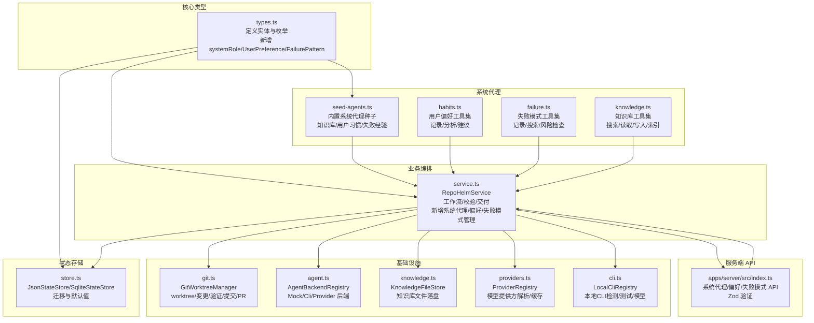
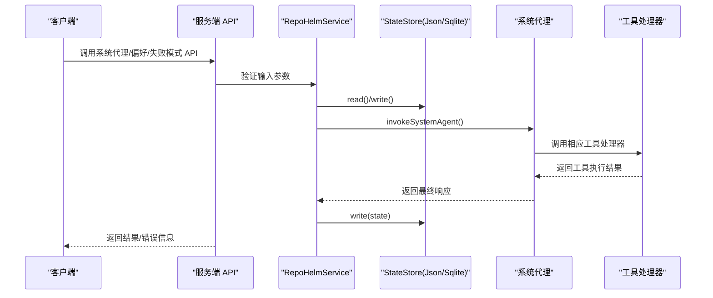
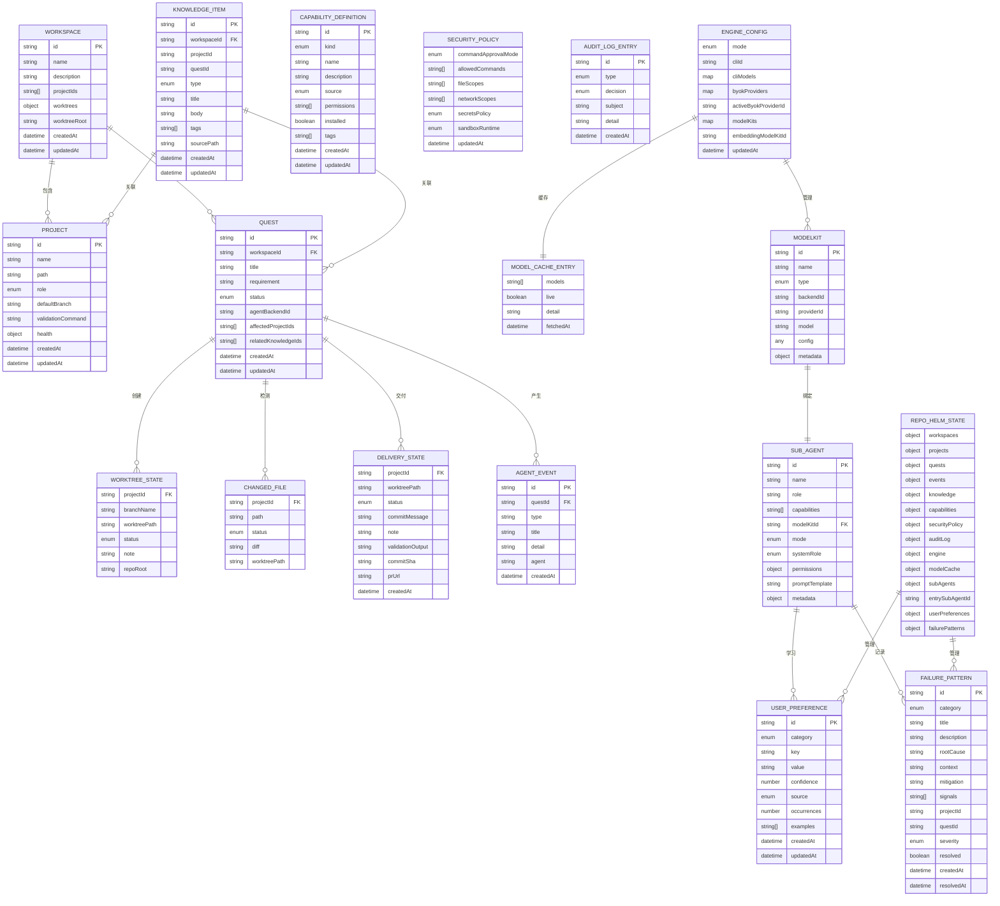
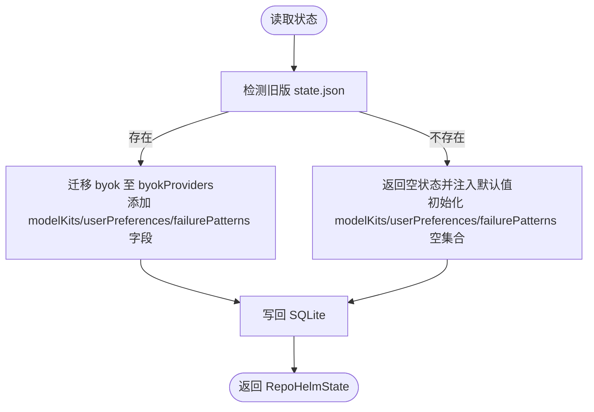
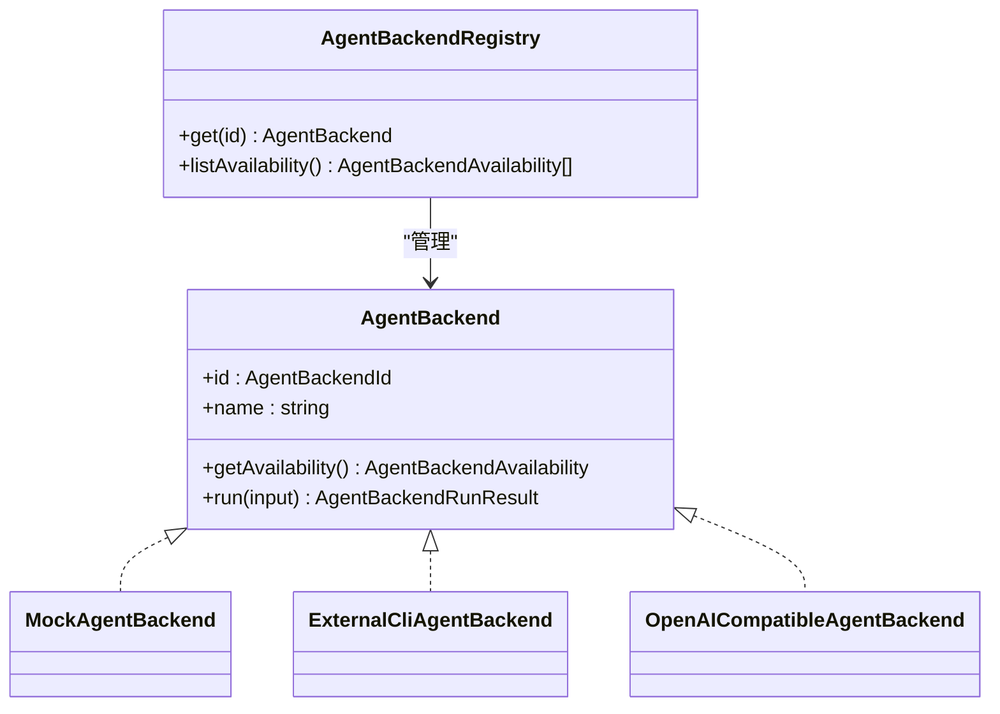
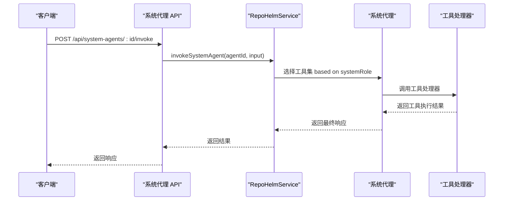
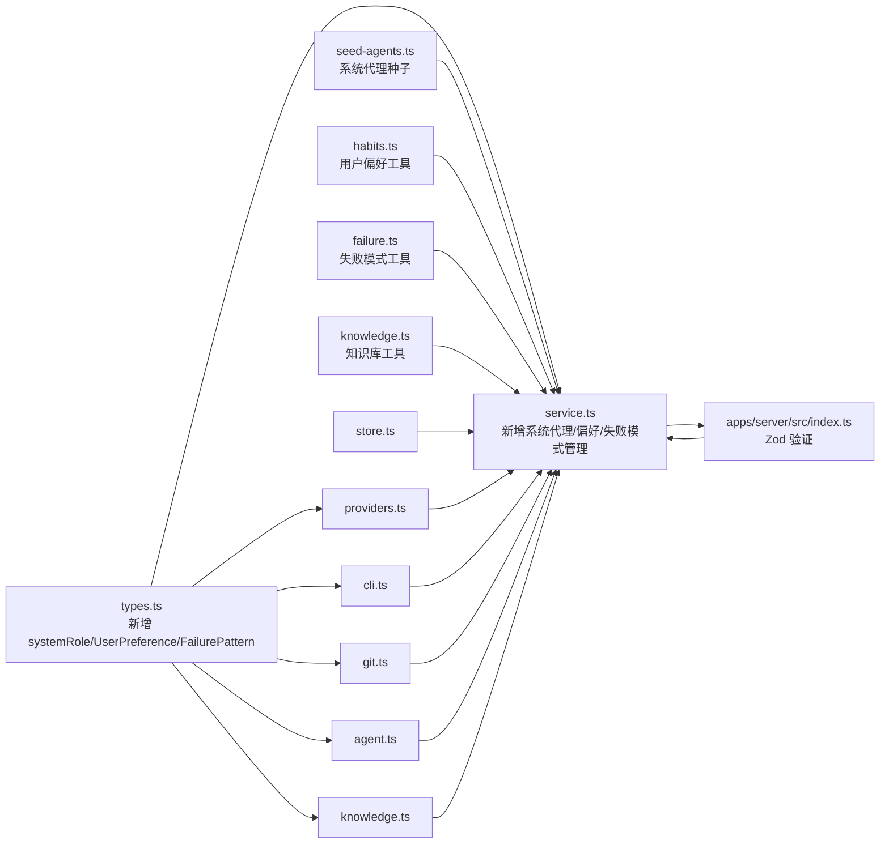

# 数据模型和类型系统

<cite>
**本文引用的文件**
- [types.ts](file://packages/core/src/types.ts)
- [store.ts](file://packages/core/src/store.ts)
- [service.ts](file://packages/core/src/service.ts)
- [agent.ts](file://packages/core/src/agent.ts)
- [git.ts](file://packages/core/src/git.ts)
- [knowledge.ts](file://packages/core/src/knowledge.ts)
- [providers.ts](file://packages/core/src/providers.ts)
- [cli.ts](file://packages/core/src/cli.ts)
- [index.ts](file://apps/server/src/index.ts)
- [index.test.ts](file://apps/server/src/index.test.ts)
- [README.md](file://README.md)
- [model-config-plan.md](file://docs/model-config-plan.md)
- [orchestrator.ts](file://packages/core/src/orchestrator.ts)
- [planning.ts](file://packages/core/src/planning.ts)
- [seed-agents.ts](file://packages/core/src/seed-agents.ts)
- [habits.ts](file://packages/core/src/tools/habits.ts)
- [failure.ts](file://packages/core/src/tools/failure.ts)
- [knowledge.ts](file://packages/core/src/tools/knowledge.ts)
- [system-agents.spec.ts](file://e2e/system-agents.spec.ts)
</cite>

## 更新摘要
**所做更改**
- 新增系统角色枚举 systemRole，包含 knowledge、habits、failure-experience 三种角色
- 新增用户偏好数据结构 UserPreference，支持偏好分类、来源、置信度管理
- 新增失败模式数据结构 FailurePattern，用于记录和管理失败经验
- 扩展 SubAgent 接口定义，新增 systemRole 字段支持系统代理
- 新增系统代理功能，包含知识库助手、用户习惯助手、失败经验助手三个内置代理
- 扩展 RepoHelmState，新增 userPreferences 和 failurePatterns 字段
- 新增系统代理 API 端点和前端集成

## 目录
1. [简介](#简介)
2. [项目结构](#项目结构)
3. [核心组件](#核心组件)
4. [架构总览](#架构总览)
5. [详细组件分析](#详细组件分析)
6. [ModelKit 配置模式和验证结构](#modelkit-配置模式和验证结构)
7. [系统代理与智能助手](#系统代理与智能助手)
8. [用户偏好与学习系统](#用户偏好与学习系统)
9. [失败模式与经验管理](#失败模式与经验管理)
10. [依赖分析](#依赖分析)
11. [性能考量](#性能考量)
12. [故障排查指南](#故障排查指南)
13. [结论](#结论)
14. [附录](#附录)

## 简介
本文件系统性梳理 RepoHelm 的数据模型与类型系统，聚焦以下实体与关系：Workspace、Project、Quest、AgentEvent、WorktreeState、ChangedFile、DeliveryState、KnowledgeItem、CapabilityDefinition、SecurityPolicy、AuditLogEntry、EngineConfig、ModelCacheEntry、ModelKit、SubAgent、UserPreference、FailurePattern 等。文档涵盖字段定义、数据验证与业务规则、状态存储与缓存策略、数据生命周期与迁移路径、安全与访问控制、扩展与定制指南，以及类型系统的最佳实践与性能优化建议。

## 项目结构
RepoHelm 的数据模型主要位于 packages/core/src/types.ts，状态持久化与迁移在 store.ts，业务编排与工作流在 service.ts，Agent 后端与 Git 操作在 agent.ts 与 git.ts，知识库文件落盘在 knowledge.ts，模型提供方注册与缓存在 providers.ts 与 cli.ts，ModelKit 配置管理在服务端 API 中实现。新增的系统代理、用户偏好和失败模式功能通过专门的工具模块和 API 端点实现。

**图表来源**
- [types.ts:1-653](file://packages/core/src/types.ts#L1-L653)
- [store.ts:1-166](file://packages/core/src/store.ts#L1-L166)
- [service.ts:1-2651](file://packages/core/src/service.ts#L1-L2651)
- [seed-agents.ts:1-242](file://packages/core/src/seed-agents.ts#L1-L242)
- [habits.ts:1-149](file://packages/core/src/tools/habits.ts#L1-L149)
- [failure.ts:1-149](file://packages/core/src/tools/failure.ts#L1-L149)
- [knowledge.ts:1-175](file://packages/core/src/tools/knowledge.ts#L1-L175)
- [index.ts:113-782](file://apps/server/src/index.ts#L113-L782)

**章节来源**
- [types.ts:1-653](file://packages/core/src/types.ts#L1-L653)
- [store.ts:1-166](file://packages/core/src/store.ts#L1-L166)
- [service.ts:1-2651](file://packages/core/src/service.ts#L1-L2651)
- [index.ts:113-782](file://apps/server/src/index.ts#L113-L782)

## 核心组件
本节概述关键数据结构及其职责与约束。

- Workspace（工作区）
  - 字段：id、name、description、projectIds、worktrees、worktreeRoot、createdAt、updatedAt
  - 关系：包含多个 Project 与多个 Git worktree；worktreeRoot 决定 worktree 存放位置
  - 业务规则：link/unlink 项目时创建/删除 worktree；删除项目时级联清理

- Project（项目）
  - 字段：id、name、path、role、defaultBranch、validationCommand、health、createdAt、updatedAt
  - 关系：被多个 Workspace 引用；与 Git 仓库健康度绑定
  - 业务规则：更新 path/defaultBranch 会重置 health 状态

- Quest（任务）
  - 字段：id、workspaceId、title、requirement、status、spec、agentBackendId、entrySubAgentId、affectedProjectIds、relatedKnowledgeIds、worktrees、changedFiles、validationResults、reviewNotes、deliveryResults、capabilityRecommendations、agentSummary、autoApprovePlan、planApproval、planPath、createdAt、updatedAt
  - 关系：属于一个 Workspace；影响多个 Project；relatedKnowledgeIds 关联相关知识库页面；生成 AgentEvent 与 KnowledgeItem
  - 状态：draft/specifying/planning/preparing/executing/validating/reviewing/ready/delivered/blocked/cancelled

- AgentEvent（代理事件）
  - 字段：id、questId、type、title、detail、agent、createdAt
  - 用途：记录 Agent 执行过程中的关键事件，便于审计与回溯

- WorktreeState（工作树状态）
  - 字段：projectId、branchName、worktreePath、status、note、repoRoot
  - 状态：not_created/planned/created/failed/cleaned

- ChangedFile（变更文件）
  - 字段：projectId、path、status、diff、worktreePath
  - 状态：added/modified/deleted/renamed/untracked/unknown

- DeliveryState（交付状态）
  - 字段：projectId、worktreePath、status、commitMessage、note、validationOutput、commitSha、prUrl、createdAt
  - 状态：validated/committed/pr_ready/pr_created/failed

- KnowledgeItem（知识条目）
  - 字段：id、workspaceId、projectId、questId、type、title、body、tags、sourcePath、createdAt、updatedAt
  - 类型：repo-wiki/architecture/decision/memory/troubleshooting

- CapabilityDefinition（能力定义）
  - 字段：id、kind、name、description、source、permissions、installed、tags、createdAt、updatedAt
  - kind：skill/agent/mcp；source：builtin/workspace/external

- SecurityPolicy（安全策略）
  - 字段：commandApprovalMode、allowedCommands、fileScopes、networkScopes、secretsPolicy、sandboxRuntime、updatedAt
  - 用途：控制命令白名单、文件/网络作用域、密钥策略与沙箱运行

- AuditLogEntry（审计日志）
  - 字段：id、type、decision、subject、detail、createdAt
  - 类型：command/file/network/secrets/capability/sandbox

- EngineConfig（引擎配置）
  - 字段：mode、cliId、cliModels、byokProviders、activeByokProviderId、modelKits、embeddingModelKitId、updatedAt
  - 模式：cli/byok；持久化模型选择与 BYOK 提供方
  - 新增：modelKits 字段，用于存储 ModelKit 集合；embeddingModelKitId 用于嵌入模型

- ModelCacheEntry（模型缓存）
  - 字段：models、live、detail、fetchedAt
  - TTL：6小时

- ModelKit（模型套件）
  - 字段：id、name、type、backendId、providerId、model、config、metadata
  - 类型：cli/byok；封装完整模型配置信息
  - metadata：包含成本等级和性能配置

- SubAgent（子代理）
  - 字段：id、name、role、capabilities、modelKitId、mode、systemRole、permissions、promptTemplate、metadata
  - 关系：一对一绑定到 ModelKit；entry/worker/system 模式；systemRole 仅在 system 模式下有效
  - permissions：工具访问和步数限制配置
  - 新增：systemRole 字段，支持知识库、用户习惯、失败经验三种系统角色

- UserPreference（用户偏好）
  - 字段：id、category、key、value、confidence、source、occurrences、examples、createdAt、updatedAt
  - category：coding_style/naming/architecture/tooling/workflow/other
  - source：explicit/observed/correction/inferred
  - 用途：记录用户的编码风格、命名习惯、架构倾向、工具偏好、工作流偏好

- FailurePattern（失败模式）
  - 字段：id、category、title、description、rootCause、context、mitigation、signals、projectId、questId、severity、resolved、createdAt、resolvedAt
  - category：type_error/test_failure/build_error/logic_bug/architecture/security/performance/other
  - severity：low/medium/high
  - 用途：记录 Quest 执行中的失败经验，提供根因分析和缓解方案

- RepoHelmState（全局状态）
  - 字段：workspaces、projects、quests、events、knowledge、capabilities、securityPolicy、auditLog、engine、modelCache、subAgents、entrySubAgentId、userPreferences、failurePatterns
  - 新增：subAgents、entrySubAgentId、userPreferences、failurePatterns 字段

**章节来源**
- [types.ts:201-224](file://packages/core/src/types.ts#L201-L224)
- [types.ts:80-96](file://packages/core/src/types.ts#L80-L96)
- [types.ts:402-472](file://packages/core/src/types.ts#L402-L472)
- [service.ts:1227-1299](file://packages/core/src/service.ts#L1227-L1299)

## 架构总览
RepoHelm 的数据流围绕 RepoHelmService 展开：读取/写入状态（store.ts），创建/更新 Workspace/Project/Quest，驱动 Agent 后端执行，操作 Git worktree，生成事件与知识条目，维护安全策略与审计日志，缓存模型列表，管理 ModelKit 和 SubAgent 配置。新增的系统代理功能通过独立的工具集和 API 端点实现，支持知识库管理、用户偏好学习和失败模式经验积累。

**图表来源**
- [service.ts:960-1028](file://packages/core/src/service.ts#L960-L1028)
- [store.ts:86-166](file://packages/core/src/store.ts#L86-L166)
- [index.ts:645-782](file://apps/server/src/index.ts#L645-L782)
- [seed-agents.ts:185-241](file://packages/core/src/seed-agents.ts#L185-L241)

**章节来源**
- [service.ts:1-2651](file://packages/core/src/service.ts#L1-L2651)
- [store.ts:1-166](file://packages/core/src/store.ts#L1-L166)
- [index.ts:645-782](file://apps/server/src/index.ts#L645-L782)

## 详细组件分析

### 数据模型与关系图

**图表来源**
- [types.ts:1-653](file://packages/core/src/types.ts#L1-L653)

**章节来源**
- [types.ts:1-653](file://packages/core/src/types.ts#L1-L653)

### 状态存储与缓存策略
- 存储实现
  - JsonStateStore：读写 .repohelm/state.json，默认安全策略与空状态初始化
  - SqliteStateStore：读写 .repohelm/state.sqlite，支持迁移与事务式写入
- 迁移机制
  - 旧版 byok 字段迁移至 byokProviders，补充 activeByokProviderId
  - 首次读取若无数据，返回空状态并注入默认安全策略
  - 新增 ModelKit 字段支持，向后兼容现有状态
  - 新增 userPreferences 和 failurePatterns 字段，支持系统代理功能
- 缓存策略
  - 模型缓存：ProviderRegistry.fetchModels 对每个 providerId:baseUrl 维护缓存，TTL 6小时
  - CLI 模型缓存：LocalCliRegistry.detect 支持 refresh 拉取实时模型，否则使用内置默认值
  - ModelKit 缓存：EngineConfig.modelKits 字段存储已配置的模型套件
  - 相关知识库缓存：Quest.relatedKnowledgeIds 提供知识库页面引用
  - 用户偏好缓存：RepoHelmState.userPreferences 提供偏好数据访问
  - 失败模式缓存：RepoHelmState.failurePatterns 提供失败经验访问

**图表来源**
- [store.ts:86-166](file://packages/core/src/store.ts#L86-L166)

**章节来源**
- [store.ts:1-166](file://packages/core/src/store.ts#L1-L166)
- [providers.ts:221-304](file://packages/core/src/providers.ts#L221-L304)
- [cli.ts:126-202](file://packages/core/src/cli.ts#L126-L202)
- [service.ts:486-519](file://packages/core/src/service.ts#L486-L519)

### 数据验证与业务规则
- Workspace/Project/Quest 创建/更新
  - 自动生成 createdAt/updatedAt；Project 更新 path/defaultBranch 会重置 health
- Worktree 生命周期
  - 创建：GitWorktreeManager.createWorktree；失败/成功返回状态与备注
  - 清理：removeWorktree 删除 worktree 与对应分支
  - 变更检测：getChangedFiles 解析 status 并生成 diff
- 交付流程
  - 验证：runValidation 执行项目配置的验证命令
  - 提交：commitAll 自动 add/commit
  - PR：createPullRequest 通过 gh 或生成 handoff
- 安全策略
  - 命令白名单与权限评估，拒绝后生成审计日志
- 知识库
  - writeKnowledgeItem 写入 Markdown 文件，含 YAML frontmatter
  - relatedKnowledgeIds 字段用于关联相关知识库页面
- ModelKit 验证规则
  - CLI 类型：必须提供 backendId；BYOK 类型：必须提供 providerId
  - 所有类型：必须提供 name、model 字段
  - 可选字段：costTier、performanceProfile、config
  - 性能配置：fast/balanced/accurate；成本等级：free/low/medium/high
- 系统代理验证规则
  - systemRole 字段仅在 mode="system" 时有效
  - systemRole 必须是 "knowledge"、"habits"、"failure-experience" 之一
  - systemRole 为 "knowledge" 时使用知识库工具集
  - systemRole 为 "habits" 时使用用户偏好工具集
  - systemRole 为 "failure-experience" 时使用失败模式工具集
- 用户偏好验证规则
  - category 必须是 "coding_style"、"naming"、"architecture"、"tooling"、"workflow"、"other" 之一
  - source 必须是 "explicit"、"observed"、"correction"、"inferred" 之一
  - confidence 必须在 0.0-1.0 范围内
  - occurrences 必须为正整数
- 失败模式验证规则
  - category 必须是 "type_error"、"test_failure"、"build_error"、"logic_bug"、"architecture"、"security"、"performance"、"other" 之一
  - severity 必须是 "low"、"medium"、"high" 之一
  - resolved 必须为布尔值
  - 所有必填字段不能为空字符串

**章节来源**
- [service.ts:143-339](file://packages/core/src/service.ts#L143-L339)
- [git.ts:79-250](file://packages/core/src/git.ts#L79-L250)
- [knowledge.ts:15-43](file://packages/core/src/knowledge.ts#L15-L43)
- [index.ts:113-144](file://apps/server/src/index.ts#L113-L144)
- [index.ts:653-703](file://apps/server/src/index.ts#L653-L703)
- [index.test.ts:110-247](file://apps/server/src/index.test.ts#L110-L247)

### Agent 后端与执行链路
- 后端类型
  - MockAgentBackend：内置实现，写入示例产物
  - ExternalCliAgentBackend：通过环境变量命令模板执行外部 CLI
  - OpenAICompatibleAgentBackend：调用兼容 OpenAI 接口的 Provider
- 可用性检测
  - getAvailability 返回可用性、配置状态与命令模板
- 输入输出
  - writeAgentInput 生成标准化输入 JSON；收集 stdout/stderr/退出码与 diff

**图表来源**
- [agent.ts:41-436](file://packages/core/src/agent.ts#L41-L436)

**章节来源**
- [agent.ts:1-436](file://packages/core/src/agent.ts#L1-L436)

### 模型提供方与 CLI 注册
- ProviderRegistry
  - 支持 OpenAI、Anthropic、Gemini、DeepSeek、OpenRouter、OpenAI-compatible
  - fetchModels 支持 bearer/x-api-key/query-key 等鉴权方式，回退内置默认模型
- LocalCliRegistry
  - 检测 CLI 可用性、版本、模型列表；支持 refresh 实时拉取
  - test 通过非交互式 ping 验证真实连通性与延迟

**章节来源**
- [providers.ts:1-304](file://packages/core/src/providers.ts#L1-L304)
- [cli.ts:1-368](file://packages/core/src/cli.ts#L1-L368)
- [model-config-plan.md:1-88](file://docs/model-config-plan.md#L1-L88)

### 编排执行与目标项目解析
- 编排计划生成
  - 简单任务：createSimplePlan 自动生成单步骤计划，targetProjectId 默认为第一个受影响项目
  - 复杂任务：generateOrchestrationPlan 基于 LLM 生成多步骤计划
- 步骤执行
  - executeApprovedPlan 按依赖顺序执行步骤
  - targetProjectId 解析：优先使用步骤指定的目标项目，否则回退到任务的第一个受影响项目
- 目标项目解析逻辑
  - step.targetProjectId || quest.affectedProjectIds[0]
  - 在执行上下文中提供目标项目的工作树信息

**章节来源**
- [orchestrator.ts:99-129](file://packages/core/src/orchestrator.ts#L99-L129)
- [orchestrator.ts:170-172](file://packages/core/src/orchestrator.ts#L170-L172)
- [planning.ts:171-195](file://packages/core/src/planning.ts#L171-L195)

## ModelKit 配置模式和验证结构

### ModelKit 配置架构
ModelKit 是 RepoHelm 新增的核心配置实体，用于封装完整的模型配置信息，支持 CLI 和 BYOK 两种模式。

- ModelKit 基本结构
  - id：唯一标识符
  - name：配置名称
  - type：配置类型（cli/byok）
  - backendId：CLI 后端 ID（仅 cli 类型）
  - providerId：提供商 ID（仅 byok 类型）
  - model：模型名称
  - config：配置对象（any 类型，后续可细化）
  - metadata：元数据信息

- 元数据信息
  - createdAt：创建时间
  - testedAt：最后测试时间
  - lastUsedAt：最后使用时间（可选）
  - costTier：成本等级（free/low/medium/high）
  - performanceProfile：性能配置（fast/balanced/accurate）

### 验证结构与规则
服务端 API 使用 Zod 进行严格的输入验证：

- 创建 ModelKit 验证
  - CLI 类型：必须提供 backendId、name、model
  - BYOK 类型：必须提供 providerId、name、model
  - 可选字段：config、costTier、performanceProfile

- 更新 ModelKit 验证
  - 所有字段均为可选
  - 更新时自动更新 testedAt 时间戳

- 测试并保存验证
  - CLI 类型：验证 backendId、model、name
  - BYOK 类型：验证 providerId、model、name、可选 apiKey/baseUrl
  - 性能和成本配置验证

### SubAgent 子代理系统
SubAgent 是基于 ModelKit 的专门化代理实例：

- SubAgent 结构
  - id：唯一标识符
  - name：名称
  - role：角色描述
  - capabilities：能力列表
  - modelKitId：绑定的 ModelKit ID（一对一关系）
  - mode：模式（entry/worker/system）
  - systemRole：系统角色（仅 mode="system" 时有效）
  - permissions：权限配置
  - promptTemplate：提示词模板（可选）
  - metadata：元数据信息

- 权限配置
  - allowedTools：允许使用的工具列表
  - deniedTools：禁止使用的工具列表
  - maxSteps：最大执行步数（可选）

### API 端点实现
服务端提供了完整的 ModelKit 管理 API：

- POST /api/model-kits - 创建 ModelKit
- PATCH /api/model-kits/:id - 更新 ModelKit
- DELETE /api/model-kits/:id - 删除 ModelKit
- GET /api/model-kits - 列出所有 ModelKits
- POST /api/model-kits/test-and-save - 测试并保存 ModelKit

**章节来源**
- [types.ts:370-412](file://packages/core/src/types.ts#L370-L412)
- [service.ts:486-519](file://packages/core/src/service.ts#L486-L519)
- [index.ts:113-144](file://apps/server/src/index.ts#L113-L144)
- [index.ts:418-466](file://apps/server/src/index.ts#L418-L466)
- [index.test.ts:110-309](file://apps/server/src/index.test.ts#L110-L309)

## 系统代理与智能助手

### 系统代理架构
RepoHelm 新增了三个内置系统代理，提供专门的智能助手功能：

- 知识库助手（knowledge）
  - 角色：系统知识库 Agent，管理项目知识
  - 工具集：search_knowledge、read_knowledge、write_knowledge、index_knowledge、get_knowledge_context
  - 用途：索引仓库、回答知识查询、总结 Quest 学习

- 用户习惯助手（habits）
  - 角色：系统用户习惯 Agent，观察并建模用户偏好
  - 工具集：record_preference、get_user_profile、suggest_conventions
  - 用途：记录编码风格、命名习惯、架构倾向、工作流偏好

- 失败经验助手（failure-experience）
  - 角色：系统失败经验 Agent，捕获 Quest 失败模式
  - 工具集：record_failure、search_failures、check_risk
  - 用途：分析根因、提供缓解方案、防止重复踩坑

### 系统代理执行流程
系统代理通过独立的工具调用循环运行，使用与 systemRole 匹配的工具集：

**图表来源**
- [service.ts:960-1028](file://packages/core/src/service.ts#L960-L1028)
- [index.ts:645-649](file://apps/server/src/index.ts#L645-L649)

### 系统代理工具集
- 知识库工具集（knowledgeToolSpecs）
  - search_knowledge：语义搜索项目知识库
  - read_knowledge：读取特定 Wiki 页面内容
  - write_knowledge：写入或更新 Wiki 页面
  - index_knowledge：索引项目知识库
  - get_knowledge_context：获取知识上下文

- 用户偏好工具集（habitsToolSpecs）
  - record_preference：记录用户偏好
  - get_user_profile：获取用户偏好档案
  - suggest_conventions：建议约定

- 失败模式工具集（failureToolSpecs）
  - record_failure：记录失败模式
  - search_failures：搜索相似失败模式
  - check_risk：检查任务风险

### 系统代理 API 端点
服务端提供了完整的系统代理管理 API：

- POST /api/system-agents/:id/invoke - 调用系统代理
- GET /api/sub-agents - 列出所有子代理
- POST /api/sub-agents - 创建子代理
- PATCH /api/sub-agents/:id - 更新子代理
- DELETE /api/sub-agents/:id - 删除子代理
- POST /api/sub-agents/set-entry - 设置入口子代理
- GET /api/sub-agents/entry - 获取入口子代理

**章节来源**
- [types.ts:402-413](file://packages/core/src/types.ts#L402-L413)
- [service.ts:960-1028](file://packages/core/src/service.ts#L960-L1028)
- [seed-agents.ts:8-157](file://packages/core/src/seed-agents.ts#L8-L157)
- [habits.ts:109-149](file://packages/core/src/tools/habits.ts#L109-L149)
- [failure.ts:1-149](file://packages/core/src/tools/failure.ts#L1-L149)
- [knowledge.ts:11-175](file://packages/core/src/tools/knowledge.ts#L11-L175)
- [index.ts:645-782](file://apps/server/src/index.ts#L645-L782)

## 用户偏好与学习系统

### 用户偏好数据模型
用户偏好系统用于记录和管理用户的编程习惯和工作偏好：

- UserPreference 结构
  - id：唯一标识符
  - category：偏好分类（coding_style/naming/architecture/tooling/workflow/other）
  - key：偏好键（如 "use-single-quotes"、"test-framework"、"prefer-fp"）
  - value：偏好值（如 "always"、"avoid"、"jest"）
  - confidence：置信度（0.0-1.0）
  - source：来源（explicit/observed/correction/inferred）
  - occurrences：被确认的次数
  - examples：最多 5 个具体示例
  - createdAt/updatedAt：创建和更新时间

### 偏好学习算法
系统通过以下机制学习用户偏好：

- 偏好记录
  - 同 category+key 相同时更新现有偏好，提高置信度和次数
  - 新偏好时根据来源设置初始置信度
  - 限制示例数量不超过 5 个

- 偏好过滤
  - 支持按分类和最低置信度过滤
  - 按置信度降序排序

- 约束生成
  - 根据用户偏好生成约束文本供其他代理使用
  - 提供建议的编码约定

### API 端点实现
服务端提供了完整的用户偏好管理 API：

- GET /api/preferences - 获取所有用户偏好
- POST /api/preferences - 记录用户偏好
- DELETE /api/preferences/:id - 删除用户偏好

**章节来源**
- [types.ts:428-439](file://packages/core/src/types.ts#L428-L439)
- [service.ts:1043-1128](file://packages/core/src/service.ts#L1043-L1128)
- [index.ts:662-676](file://apps/server/src/index.ts#L662-L676)

## 失败模式与经验管理

### 失败模式数据模型
失败模式系统用于记录和管理 Quest 执行中的失败经验：

- FailurePattern 结构
  - id：唯一标识符
  - category：失败分类（type_error/test_failure/build_error/logic_bug/architecture/security/performance/other）
  - title：简短标签
  - description：发生了什么
  - rootCause：根因分析
  - context：当时在做什么
  - mitigation：下次如何避免
  - signals：匹配关键词，用于检测相似场景
  - projectId/questId：关联项目或 Quest
  - severity：严重程度（low/medium/high）
  - resolved：是否已解决
  - createdAt/resolvedAt：创建和解决时间

### 失败模式管理流程
系统通过以下机制管理失败模式：

- 失败记录
  - 深入分析根因，要求具体的可操作缓解方案
  - 使用信号关键词检测相似情况
  - 支持项目级和 Quest 级别的关联

- 搜索算法
  - 基于关键词 + 信号匹配的基础实现
  - 支持分类和项目过滤
  - 优先显示未解决的高严重程度模式

- 风险检查
  - 在执行新任务前检查已知风险
  - 提供相关警告给执行代理

### API 端点实现
服务端提供了完整的失败模式管理 API：

- GET /api/failures - 获取所有失败模式
- POST /api/failures - 记录失败模式
- POST /api/failures/search - 搜索失败模式
- PATCH /api/failures/:id - 更新失败模式

**章节来源**
- [types.ts:457-472](file://packages/core/src/types.ts#L457-L472)
- [service.ts:1135-1230](file://packages/core/src/service.ts#L1135-L1230)
- [index.ts:705-730](file://apps/server/src/index.ts#L705-L730)

## 依赖分析
- 类型依赖
  - service.ts 依赖 types.ts 中所有实体与输入输出类型，包括新增的 ModelKit、SubAgent、UserPreference、FailurePattern
  - agent.ts、git.ts、providers.ts、cli.ts、knowledge.ts 分别依赖 types.ts 的子集
- 存储依赖
  - service.ts 依赖 store.ts 的 StateStore 接口与具体实现
- 运行时依赖
  - git 命令、外部 CLI、Provider REST API、本地文件系统
- 服务端 API 依赖
  - index.ts 依赖 Zod 进行输入验证，依赖 service.ts 进行业务逻辑处理
- 系统代理依赖
  - seed-agents.ts 依赖 types.ts 的 SubAgent 和 ModelKit 定义
  - habits.ts、failure.ts、knowledge.ts 提供工具集实现
  - e2e/system-agents.spec.ts 验证系统代理 UI

**图表来源**
- [types.ts:1-653](file://packages/core/src/types.ts#L1-L653)
- [service.ts:1-2651](file://packages/core/src/service.ts#L1-L2651)
- [seed-agents.ts:1-242](file://packages/core/src/seed-agents.ts#L1-L242)
- [habits.ts:1-149](file://packages/core/src/tools/habits.ts#L1-L149)
- [failure.ts:1-149](file://packages/core/src/tools/failure.ts#L1-L149)
- [knowledge.ts:1-175](file://packages/core/src/tools/knowledge.ts#L1-L175)
- [store.ts:1-166](file://packages/core/src/store.ts#L1-L166)
- [agent.ts:1-436](file://packages/core/src/agent.ts#L1-L436)
- [git.ts:1-343](file://packages/core/src/git.ts#L1-L343)
- [providers.ts:1-304](file://packages/core/src/providers.ts#L1-L304)
- [cli.ts:1-368](file://packages/core/src/cli.ts#L1-L368)
- [knowledge.ts:1-68](file://packages/core/src/knowledge.ts#L1-L68)
- [index.ts:113-782](file://apps/server/src/index.ts#L113-L782)

**章节来源**
- [service.ts:1-2651](file://packages/core/src/service.ts#L1-L2651)
- [store.ts:1-166](file://packages/core/src/store.ts#L1-L166)
- [index.ts:113-782](file://apps/server/src/index.ts#L113-L782)

## 性能考量
- 模型缓存
  - ProviderRegistry.fetchModels 采用 6 小时 TTL，减少网络请求与解析成本
  - LocalCliRegistry.detect 支持 refresh 控制实时拉取，非 refresh 使用内置默认模型
  - ModelKit 配置缓存：EngineConfig.modelKits 提供快速访问
- I/O 优化
  - 知识库写入采用异步文件写入，Markdown frontmatter 结构便于检索
  - SQLite 写入使用 upsert 保证幂等与一致性
  - ModelKit 列表查询：直接从内存缓存获取，避免重复计算
  - 相关知识库页面：通过 relatedKnowledgeIds 快速访问，避免重复检索
  - 用户偏好和失败模式：通过 RepoHelmState 的映射结构快速访问
- 并发控制
  - 多 worktree 并行创建与清理，多项目并行执行 Agent 后端
  - ModelKit 创建/更新操作使用原子写入，确保数据一致性
  - 编排步骤执行：按依赖顺序并行执行可并行的步骤
  - 系统代理：独立的工具调用循环，避免阻塞主执行流程
- 资源限制
  - 外部 CLI 与 Provider 请求设置超时，避免阻塞
  - SubAgent 执行设置最大步数限制，防止无限循环
  - 目标项目解析：优先使用步骤指定项目，减少不必要的项目遍历
  - 系统代理工具调用：设置最大迭代次数，防止无限循环

**章节来源**
- [service.ts:43-2651](file://packages/core/src/service.ts#L43-L2651)
- [providers.ts:221-304](file://packages/core/src/providers.ts#L221-L304)
- [cli.ts:126-202](file://packages/core/src/cli.ts#L126-L202)
- [git.ts:159-250](file://packages/core/src/git.ts#L159-L250)
- [service.ts:486-519](file://packages/core/src/service.ts#L486-L519)

## 故障排查指南
- 状态读取异常
  - 检查 .repohelm/state.json 是否存在；若不存在，首次启动会生成空状态并注入默认安全策略
  - 若存在旧格式，SqliteStateStore 会自动迁移，包括新增的 modelKits、userPreferences、failurePatterns 字段
- Git worktree 创建失败
  - 检查 worktreeRoot 权限、目标路径是否已存在且非 Git 目录
  - 查看 GitWorktreeManager 返回的 note 获取具体错误信息
- Agent 后端不可用
  - ExternalCliAgentBackend：检查环境变量命令模板与 CLI 可执行性
  - OpenAI-compatible：检查 baseUrl、model、apiKey 配置
- 模型列表为空
  - ProviderRegistry 回退内置默认模型；检查 API Key、网络与 Provider 端点
- 安全策略阻止
  - 查看 AuditLogEntry 与 SecurityPolicy 配置，确认命令白名单与作用域
- ModelKit 配置问题
  - CLI 类型缺少 backendId：检查 CLI 后端配置是否正确
  - BYOK 类型缺少 providerId：检查提供商配置是否有效
  - 测试失败：验证 API Key、Base URL 和模型名称
- SubAgent 管理问题
  - ModelKit 不存在：检查 ModelKit ID 是否正确
  - 入口 SubAgent 设置失败：确保选择的是 entry 模式的 SubAgent
  - 系统代理调用失败：检查 systemRole 配置和工具集可用性
- 系统代理问题
  - systemRole 配置错误：确保 mode="system" 时提供有效的 systemRole
  - 工具调用失败：检查对应工具处理器是否正确实现
  - API 调用失败：验证系统代理 ID 和输入参数格式
- 用户偏好问题
  - 偏好记录失败：检查 category、key、value 格式和来源类型
  - 查询结果为空：确认偏好数据是否已正确记录
- 失败模式问题
  - 记录失败：检查必填字段是否完整，缓解方案是否具体可行
  - 搜索无结果：确认关键词匹配和过滤条件
- 相关知识库引用问题
  - relatedKnowledgeIds 为空：检查知识库索引状态和搜索功能
  - 知识库页面缺失：验证知识库文件是否存在且可访问
- 编排执行问题
  - targetProjectId 解析失败：检查步骤配置和任务受影响项目列表
  - 工作树未找到：验证目标项目的工作树状态和路径

**章节来源**
- [store.ts:98-139](file://packages/core/src/store.ts#L98-L139)
- [git.ts:79-120](file://packages/core/src/git.ts#L79-L120)
- [agent.ts:125-259](file://packages/core/src/agent.ts#L125-L259)
- [providers.ts:221-304](file://packages/core/src/providers.ts#L221-L304)
- [service.ts:591-615](file://packages/core/src/service.ts#L591-L615)
- [index.test.ts:110-309](file://apps/server/src/index.test.ts#L110-L309)

## 结论
RepoHelm 的数据模型以 Quest 为核心，围绕 Workspace 与 Project 构建多项目任务工作流，结合 Git worktree 隔离与 Agent 后端编排，形成可审计、可扩展的状态体系。通过 SQLite 持久化与模型缓存提升性能，通过安全策略与审计日志保障执行安全。新增的 ModelKit 配置模式和 SubAgent 子代理系统进一步增强了模型管理和代理执行能力，为复杂任务场景提供了更好的支持。最新扩展的 systemRole 枚举、UserPreference 和 FailurePattern 数据结构，以及内置的系统代理功能，显著提升了系统的智能化水平和学习能力。这些新增功能通过独立的工具集和 API 端点实现，保持了良好的模块化和可维护性。未来可在知识库检索、能力管理、产品化状态页、模型性能监控、智能推荐等方面进一步增强。

## 附录

### 数据生命周期与保留策略
- 状态生命周期
  - 初始化：首次启动读取/迁移状态，注入默认安全策略，初始化空的 modelKits、userPreferences、failurePatterns 集合
  - 运行期：每次操作写回状态，事件与知识条目持续增长，ModelKit 配置按需更新，用户偏好和失败模式动态维护
  - 清理：cleanupQuestWorktrees 移除 worktree 与分支；删除项目时级联清理
- 保留策略
  - 事件与审计日志：长期保留，支持回溯与合规
  - 知识库文件：按需清理，建议定期归档
  - 模型缓存：6 小时过期，自动刷新
  - ModelKit 配置：永久保留，支持历史版本对比
  - 相关知识库引用：随任务生命周期管理，支持知识库页面的长期保留
  - 用户偏好：长期保留，支持偏好学习和趋势分析
  - 失败模式：长期保留，支持风险预测和经验传承
- 归档规则
  - 已交付的 Quest 可导出为知识条目或 PR 信息，便于归档
  - ModelKit 配置可导出为配置文件，便于团队共享
  - 相关知识库页面可导出为独立的知识库文件
  - 用户偏好和失败模式可导出为分析报告，支持团队复盘

**章节来源**
- [service.ts:73-133](file://packages/core/src/service.ts#L73-L133)
- [service.ts:713-755](file://packages/core/src/service.ts#L713-L755)
- [service.ts:305-339](file://packages/core/src/service.ts#L305-L339)
- [service.ts:486-519](file://packages/core/src/service.ts#L486-L519)

### 数据迁移路径与版本管理
- 版本演进
  - 引擎配置：由旧版 byok 字段迁移至 byokProviders，新增 activeByokProviderId
  - 状态存储：从 state.json 迁移到 state.sqlite，保持向后兼容
  - ModelKit 集成：新增 modelKits 字段，支持向后兼容
  - Quest 扩展：新增 relatedKnowledgeIds 字段，支持向后兼容
  - 编排扩展：新增 OrchestrationPlanStep.targetProjectId 字段，支持向后兼容
  - 系统代理：新增 systemRole 字段，支持向后兼容
  - 用户偏好：新增 UserPreference 数据结构，支持向后兼容
  - 失败模式：新增 FailurePattern 数据结构，支持向后兼容
- 迁移路径
  - 读取旧 JSON：若存在则迁移并写回 SQLite，包括新增字段
  - 写入新状态：确保字段完整性与默认值填充，包括 modelKits、userPreferences、failurePatterns 空集合
  - 编排计划：validatePlan 函数自动填充 targetProjectId 默认值
  - 系统代理：ensureBuiltInSubAgents 自动创建内置系统代理
- 版本管理
  - 通过 updatedAt 字段记录变更时间，便于追踪
  - ModelKit 元数据包含创建和测试时间戳
  - 相关知识库引用：通过 relatedKnowledgeIds 字段管理
  - 用户偏好和失败模式：通过 ID 字段管理，支持增量更新

**章节来源**
- [store.ts:36-84](file://packages/core/src/store.ts#L36-L84)
- [store.ts:125-148](file://packages/core/src/store.ts#L125-L148)
- [service.ts:486-519](file://packages/core/src/service.ts#L486-L519)
- [planning.ts:171-195](file://packages/core/src/planning.ts#L171-L195)
- [seed-agents.ts:185-241](file://packages/core/src/seed-agents.ts#L185-L241)

### 数据安全、隐私与访问控制
- 安全策略
  - 命令白名单、文件/网络作用域、密钥策略（redact-env/deny）、沙箱运行模式
- 审计日志
  - 记录命令、文件、网络、密钥、能力、沙箱等类型的决策与详情
- 访问控制
  - 本地优先工具，BYOK API Key 明文存储于本地 SQLite；生产级密钥保管为后续项
  - ModelKit API 通过 Zod 验证确保输入安全
  - SubAgent 权限配置限制工具访问范围
  - 系统代理：仅内置系统代理可调用，通过 mode="system" 限制
  - 用户偏好和失败模式：通过 ID 字段隔离，支持按项目过滤
- 知识库安全
  - relatedKnowledgeIds 仅存储知识库页面 ID，不暴露内容
  - 知识库文件访问受安全策略控制

**章节来源**
- [types.ts:135-152](file://packages/core/src/types.ts#L135-L152)
- [service.ts:591-615](file://packages/core/src/service.ts#L591-L615)
- [index.ts:113-144](file://apps/server/src/index.ts#L113-L144)

### 扩展与定制指南
- 新增实体
  - 在 types.ts 中定义接口与枚举，遵循现有命名与字段风格
  - 在 RepoHelmState 中纳入集合字段，确保序列化/反序列化一致
  - 为新实体添加相应的 API 端点和前端集成
- 新增 Agent 后端
  - 实现 AgentBackend 接口，注册到 AgentBackendRegistry
  - 在 service.ts 中集成后端可用性检测与执行流程
- 新增模型提供方
  - 在 providers.ts 中扩展 ProviderDef，实现解析函数与回退模型
- 新增本地 CLI
  - 在 cli.ts 中扩展 CLI_DEFINITIONS，提供版本探测、模型列举与 ping 测试
- 新增工作流步骤
  - 在 service.ts 中新增方法，维护状态与事件，必要时引入新的状态字段
- 新增 ModelKit 类型
  - 在 types.ts 中定义新的 ModelKit 类型，扩展 config 字段类型
  - 在 service.ts 中实现相应的验证和管理逻辑
- 新增 SubAgent 功能
  - 在 types.ts 中定义 SubAgent 相关接口
  - 在 service.ts 中实现子代理的生命周期管理
  - 在 seed-agents.ts 中添加内置种子代理
  - 在工具模块中实现相应的工具集
- 新增编排步骤能力
  - 在 OrchestrationPlanStep 中扩展字段类型
  - 在 orchestrator.ts 中实现目标项目解析逻辑
  - 在 planning.ts 中实现步骤验证和默认值填充
- 新增系统代理类型
  - 在 types.ts 中定义新的 systemRole 类型
  - 在 service.ts 中实现系统代理调用逻辑
  - 在工具模块中实现相应的工具处理器
  - 在 seed-agents.ts 中添加内置种子代理
  - 在 API 端点中添加相应的路由

**章节来源**
- [types.ts:1-653](file://packages/core/src/types.ts#L1-L653)
- [agent.ts:395-436](file://packages/core/src/agent.ts#L395-L436)
- [providers.ts:79-161](file://packages/core/src/providers.ts#L79-L161)
- [cli.ts:43-110](file://packages/core/src/cli.ts#L43-L110)
- [service.ts:56-2651](file://packages/core/src/service.ts#L56-L2651)
- [seed-agents.ts:1-242](file://packages/core/src/seed-agents.ts#L1-L242)
- [habits.ts:1-149](file://packages/core/src/tools/habits.ts#L1-L149)
- [failure.ts:1-149](file://packages/core/src/tools/failure.ts#L1-L149)
- [knowledge.ts:1-175](file://packages/core/src/tools/knowledge.ts#L1-L175)
- [index.ts:113-782](file://apps/server/src/index.ts#L113-L782)

### 类型系统最佳实践与性能考虑
- 枚举与联合类型
  - 使用严格枚举（如 status、kind、type、systemRole）替代字符串字面量，提升类型安全
  - ModelKit 类型使用联合类型区分 CLI 和 BYOK 模式
  - 相关知识库引用使用字符串数组类型，确保类型安全
  - 用户偏好分类和来源使用枚举类型，防止无效值
  - 失败模式分类使用枚举类型，确保数据一致性
- 只读与可选字段
  - 对历史字段标记可选（如 checkedAt、repoRoot），避免强制迁移
  - SubAgent 的 promptTemplate 为可选字段
  - relatedKnowledgeIds 为可选数组字段，支持空引用
  - targetProjectId 为可选字段，支持回退到默认项目
  - systemRole 为可选字段，仅在 system 模式下有效
- 并行与幂等
  - 并行执行多 worktree 操作，写入使用 upsert 保证幂等
  - ModelKit 创建/更新使用原子写入，确保数据一致性
  - 编排步骤执行：按依赖顺序并行执行可并行的步骤
  - 系统代理：独立的工具调用循环，避免阻塞主执行流程
- 缓存与降级
  - Provider 与 CLI 模型缓存配合回退策略，提升可用性与性能
  - ModelKit 配置缓存提供快速访问
  - 相关知识库引用：通过 ID 快速访问，避免重复检索
  - 用户偏好和失败模式：通过映射结构快速访问，避免重复查询
- 文档与契约
  - 通过注释与契约（如 ProviderDef）明确 API 行为与错误处理
  - Zod 验证提供运行时类型安全保证
  - 编排步骤：通过 validatePlan 函数确保类型安全和默认值填充
  - 系统代理：通过 systemRole 枚举确保类型安全和行为一致性

**章节来源**
- [types.ts:1-653](file://packages/core/src/types.ts#L1-L653)
- [providers.ts:1-304](file://packages/core/src/providers.ts#L1-L304)
- [cli.ts:1-368](file://packages/core/src/cli.ts#L1-L368)
- [service.ts:43-2651](file://packages/core/src/service.ts#L43-L2651)
- [index.ts:113-782](file://apps/server/src/index.ts#L113-L782)
- [planning.ts:171-195](file://packages/core/src/planning.ts#L171-L195)