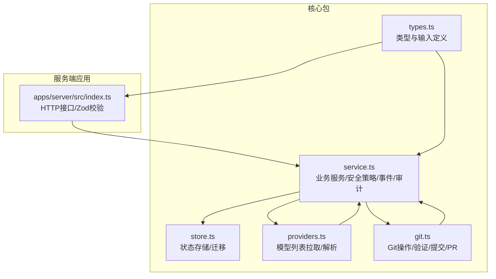
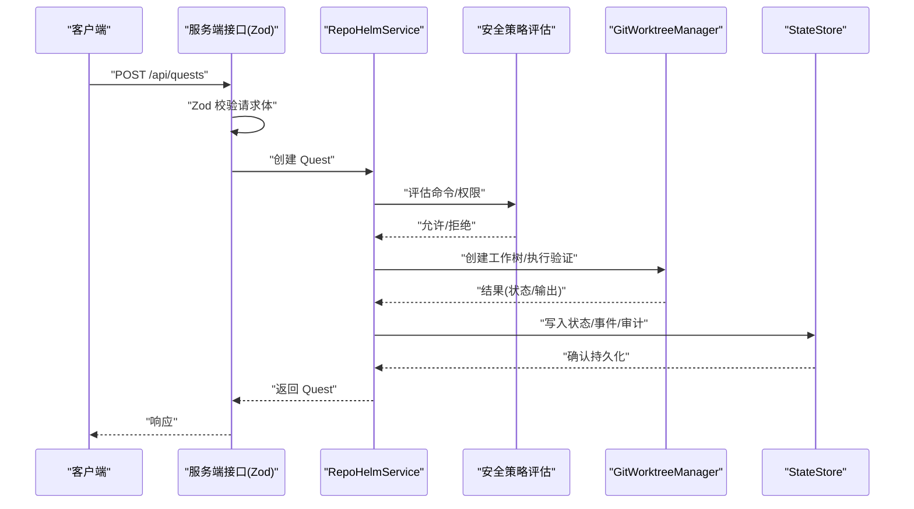
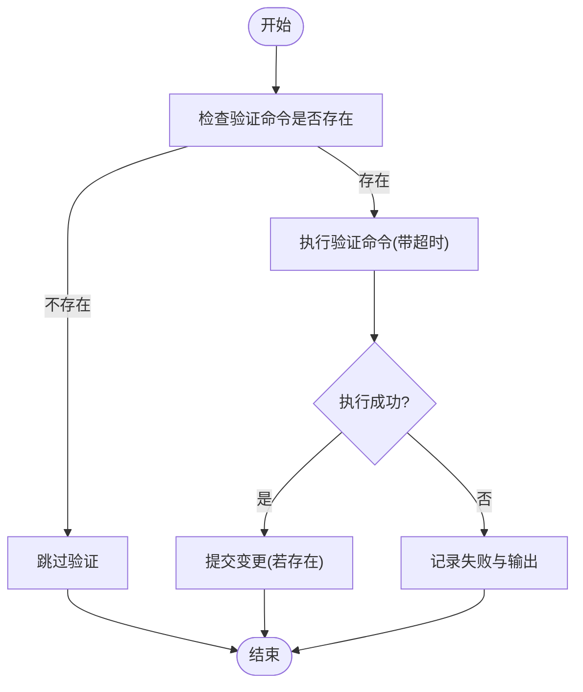
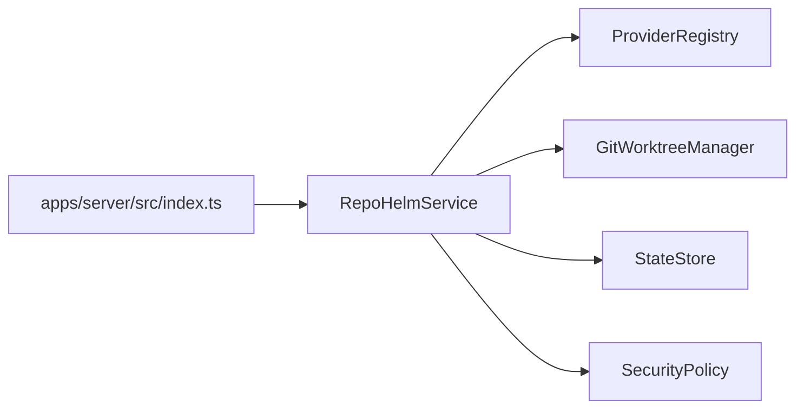

# 数据验证规则

<cite>
**本文档引用的文件**
- [packages/core/src/types.ts](file://packages/core/src/types.ts)
- [packages/core/src/service.ts](file://packages/core/src/service.ts)
- [packages/core/src/store.ts](file://packages/core/src/store.ts)
- [packages/core/src/providers.ts](file://packages/core/src/providers.ts)
- [packages/core/src/git.ts](file://packages/core/src/git.ts)
- [apps/server/src/index.ts](file://apps/server/src/index.ts)
- [packages/core/src/providers.test.ts](file://packages/core/src/providers.test.ts)
- [packages/core/src/service.test.ts](file://packages/core/src/service.test.ts)
</cite>

## 目录
1. [简介](#简介)
2. [项目结构](#项目结构)
3. [核心组件](#核心组件)
4. [架构总览](#架构总览)
5. [详细组件分析](#详细组件分析)
6. [依赖关系分析](#依赖关系分析)
7. [性能考量](#性能考量)
8. [故障排查指南](#故障排查指南)
9. [结论](#结论)
10. [附录](#附录)

## 简介
本文件系统化梳理 RepoHelm 的数据验证规则与实现，覆盖以下方面：
- 枚举类型定义与使用场景（如 QuestStatus、ProjectRole、ChangeKind 等）
- 输入参数的验证规则与约束条件（含服务端 Zod 校验与运行期校验）
- 数据类型的安全性检查与边界验证（含安全策略、命令白名单、网络与文件作用域）
- 业务规则的实现与验证逻辑（工作树创建、交付前验证、审计日志）
- 错误处理机制与错误消息格式
- 自定义验证规则的扩展方法
- 验证性能优化与缓存策略
- 规则版本管理与向后兼容性
- 测试与调试方法

## 项目结构
RepoHelm 的验证相关代码主要分布在核心包与服务端应用中：
- 类型与输入定义：packages/core/src/types.ts
- 业务服务与安全策略：packages/core/src/service.ts
- 状态持久化与迁移：packages/core/src/store.ts
- 外部模型列表拉取与解析：packages/core/src/providers.ts
- Git 操作与交付验证：packages/core/src/git.ts
- 服务端接口与输入校验：apps/server/src/index.ts
- 单元测试与行为验证：packages/core/src/providers.test.ts、packages/core/src/service.test.ts

图表来源
- [packages/core/src/types.ts](file://packages/core/src/types.ts)
- [packages/core/src/service.ts](file://packages/core/src/service.ts)
- [packages/core/src/store.ts](file://packages/core/src/store.ts)
- [packages/core/src/providers.ts](file://packages/core/src/providers.ts)
- [packages/core/src/git.ts](file://packages/core/src/git.ts)
- [apps/server/src/index.ts](file://apps/server/src/index.ts)

章节来源
- [packages/core/src/types.ts](file://packages/core/src/types.ts)
- [apps/server/src/index.ts](file://apps/server/src/index.ts)

## 核心组件
本节聚焦与“验证”直接相关的核心类型与服务方法。

- 枚举与受限字符串类型
  - 任务状态：QuestStatus（草稿、规划、准备、执行、验证、评审、就绪、交付、阻塞、取消）
  - 项目角色：ProjectRole（前端、后端、文档、库、基础设施、未知）
  - 变更类型：ChangeKind（新增、修改、删除、重命名、未跟踪、未知）
  - 项目健康状态：ProjectHealthStatus（未知、正常、缺失、非Git、无效）
  - 能力类型：CapabilityKind（技能、代理、MCP）
  - 审计类型与决策：AuditLogEntry.type/decision
  - 引擎模式：EngineConfig.mode（cli/byok）
  - 安全策略字段：commandApprovalMode、secretsPolicy、sandboxRuntime
  - 提供商ID：ProviderId（openai、anthropic、gemini、deepseek、openrouter、openai-compatible）

- 输入参数验证与约束
  - 服务端使用 Zod 对请求体进行强类型校验，包括工作区、项目、引擎、提供商模型查询、安全策略、Quest 等。
  - 运行期校验：服务层对对象存在性、路径有效性、命令合法性等进行检查；Git 层对命令执行、超时、输出进行封装与错误归一化。

- 安全策略与边界控制
  - 命令白名单与手动审批模式
  - 文件作用域与网络作用域限制
  - Secrets 策略（脱敏或拒绝）
  - Sandbox 运行环境（本地/外部）

- 业务规则与验证逻辑
  - 工作树创建与复用、失败回退
  - 交付前验证命令执行与输出捕获
  - 提交与 PR 准备流程
  - 审计日志记录与事件生成

章节来源
- [packages/core/src/types.ts](file://packages/core/src/types.ts)
- [apps/server/src/index.ts](file://apps/server/src/index.ts)
- [packages/core/src/service.ts](file://packages/core/src/service.ts)
- [packages/core/src/git.ts](file://packages/core/src/git.ts)

## 架构总览
下图展示了“输入校验 → 业务执行 → 安全策略 → Git/外部调用 → 结果持久化”的整体流程。

图表来源
- [apps/server/src/index.ts](file://apps/server/src/index.ts)
- [packages/core/src/service.ts](file://packages/core/src/service.ts)
- [packages/core/src/git.ts](file://packages/core/src/git.ts)
- [packages/core/src/store.ts](file://packages/core/src/store.ts)

## 详细组件分析

### 枚举类型与使用场景
- QuestStatus
  - 场景：贯穿 Quest 生命周期的状态流转（规划、准备、执行、验证、评审、就绪、交付、阻塞、取消）。
  - 关键点：阻塞态由安全策略或工作树创建失败触发；就绪态表示可进入 diff review。
- ProjectRole
  - 场景：项目分类与能力推荐匹配（如文档、基础设施等）。
- ChangeKind
  - 场景：Git diff 解析后的变更类型，用于 UI 展示与后续处理。
- ProjectHealthStatus
  - 场景：项目健康度检查结果，影响后续工作流推进。
- CapabilityKind
  - 场景：能力类型区分（技能、代理、MCP），用于推荐与权限声明。
- AuditLogEntry.type/decision
  - 场景：审计日志统一记录类型与决策（允许/拒绝/记录）。
- EngineConfig.mode
  - 场景：引擎模式切换（CLI/自备密钥 BYOK），影响模型列表与命令执行。
- SecurityPolicy 字段
  - 场景：命令审批模式、白名单、文件/网络作用域、Secrets 策略、沙箱运行环境。

章节来源
- [packages/core/src/types.ts](file://packages/core/src/types.ts)

### 输入参数验证规则与约束条件
- 服务端 Zod 校验
  - 工作区：名称必填，描述可选，工作树根目录可选。
  - 项目：名称、路径必填，角色、默认分支、验证命令可选。
  - 引擎：模式、CLI ID、模型映射、BYOK 提供商配置、活动提供商 ID 可选。
  - 提供商模型查询：基础 URL、API Key、刷新标志可选。
  - 安全策略：命令审批模式、白名单数组、文件/网络作用域数组、Secrets 策略、沙箱运行环境可选。
  - Quest：工作区 ID、标题、需求必填，代理后端 ID、受影响项目 ID 数组可选。
- 运行期校验
  - 对象存在性：工作区、项目、Quest 不存在时抛出错误。
  - 路径与仓库：工作树路径存在性与是否为 Git 仓库的判断。
  - 命令合法性：空命令跳过，非白名单命令在自动模式下拒绝。

章节来源
- [apps/server/src/index.ts](file://apps/server/src/index.ts)
- [packages/core/src/service.ts](file://packages/core/src/service.ts)
- [packages/core/src/git.ts](file://packages/core/src/git.ts)

### 数据类型的安全性检查与边界验证
- 命令白名单与审批模式
  - 自动模式：仅允许白名单中的命令或以 subject 命中的规则。
  - 手动模式：禁止自动执行，需人工审批。
- 文件/网络作用域
  - 限制命令可访问的文件路径与网络域名，降低越权风险。
- Secrets 策略
  - 脱敏环境变量或完全拒绝访问，避免敏感信息泄露。
- 沙箱运行环境
  - 本地或外部沙箱，隔离潜在恶意命令。
- 审计日志
  - 统一记录类型、决策、主体与详情，便于追踪与合规。

章节来源
- [packages/core/src/service.ts](file://packages/core/src/service.ts)
- [packages/core/src/types.ts](file://packages/core/src/types.ts)

### 业务规则的实现与验证逻辑
- 工作树创建
  - 若目标路径已存在且为 Git 工作树，复用之；否则创建新工作树。
  - 失败时记录失败原因与状态。
- 交付前验证
  - 若未配置验证命令则跳过；否则执行命令，捕获 stdout/stderr 并记录输出。
- 提交与 PR 准备
  - 若无变更则跳过；否则执行 add/commit，生成提交 SHA；可选创建 PR 并记录 PR URL。
- 事件与记忆
  - 每一步骤生成事件，最终写入知识库记忆条目。

图表来源
- [packages/core/src/git.ts](file://packages/core/src/git.ts)
- [packages/core/src/service.ts](file://packages/core/src/service.ts)

章节来源
- [packages/core/src/git.ts](file://packages/core/src/git.ts)
- [packages/core/src/service.ts](file://packages/core/src/service.ts)

### 错误处理机制与错误消息格式
- 错误传播
  - 服务端接口捕获异常并返回 JSON 错误信息与 500 状态码。
- Git 操作错误
  - 统一格式化错误消息，优先使用 stderr/stdout，其次 message。
- 安全策略拒绝
  - 明确记录拒绝原因（不在白名单、需人工审批等），并写入审计日志。
- 事件与审计
  - 事件标题、摘要、详情清晰，审计条目包含类型、决策、主体与详情。

章节来源
- [apps/server/src/index.ts](file://apps/server/src/index.ts)
- [packages/core/src/git.ts](file://packages/core/src/git.ts)
- [packages/core/src/service.ts](file://packages/core/src/service.ts)

### 自定义验证规则的扩展方法
- 新增枚举值
  - 在 types.ts 中扩展受限字符串类型（如新的状态、角色、变更类型）。
  - 在服务端 Zod schema 中同步添加枚举校验。
- 新增输入校验
  - 在 apps/server/src/index.ts 中为新接口定义 schema，并在路由处理中调用 parse。
- 新增业务规则
  - 在 RepoHelmService 中新增方法，遵循现有错误处理与审计日志规范。
- 新增安全策略字段
  - 在 types.ts 中扩展 SecurityPolicy，并在服务端 schema 中添加可选字段。
- 新增 Git 验证步骤
  - 在 GitWorktreeManager 中新增方法，返回统一的 GitOperationResult 结构。

章节来源
- [packages/core/src/types.ts](file://packages/core/src/types.ts)
- [apps/server/src/index.ts](file://apps/server/src/index.ts)
- [packages/core/src/service.ts](file://packages/core/src/service.ts)
- [packages/core/src/git.ts](file://packages/core/src/git.ts)

### 验证性能优化与缓存策略
- 模型列表缓存
  - ProviderRegistry.fetchModels 支持 TTL 缓存（默认 6 小时），减少对外部 API 的频繁调用。
  - 刷新参数强制绕过缓存进行实时拉取。
- 状态持久化
  - SqliteStateStore 提供高性能写入与读取，支持迁移旧 JSON 状态。
- 超时控制
  - Git 验证与外部命令执行设置超时，避免长时间阻塞。
- 事件与审计日志
  - 采用批量写入与最小化冗余，降低 IO 压力。

章节来源
- [packages/core/src/providers.ts](file://packages/core/src/providers.ts)
- [packages/core/src/store.ts](file://packages/core/src/store.ts)
- [packages/core/src/git.ts](file://packages/core/src/git.ts)

### 规则版本管理与向后兼容性
- 引擎配置迁移
  - 旧版 byok 字段迁移到 byokProviders，保留 activeByokProviderId，默认值补齐。
- 状态加载与兼容
  - SqliteStateStore 读取时自动迁移旧 JSON 状态，保证升级无缝。
- 枚举扩展
  - 新增枚举值不影响既有逻辑，但需在服务端 schema 中显式允许。

章节来源
- [packages/core/src/store.ts](file://packages/core/src/store.ts)
- [packages/core/src/service.ts](file://packages/core/src/service.ts)

### 测试与调试方法
- 单元测试
  - ProviderRegistry：验证不同提供商的模型解析、回退策略、URL 主机推断。
  - RepoHelmService：覆盖引导、工作区/项目更新、工作树生命周期、安全策略阻断、交付流程等。
- 行为测试
  - 通过临时环境变量注入外部命令，验证后端执行与产物标准化。
  - 通过设置 REPOHELM_ENABLE_GH_PR 控制 PR 创建开关。
- 调试建议
  - 查看审计日志与事件序列，定位拒绝原因与失败节点。
  - 使用刷新参数绕过模型缓存，验证实时拉取。
  - 在本地开启外部命令并观察 stdout/stderr 与 diff 输出。

章节来源
- [packages/core/src/providers.test.ts](file://packages/core/src/providers.test.ts)
- [packages/core/src/service.test.ts](file://packages/core/src/service.test.ts)

## 依赖关系分析
- 服务端接口依赖 Zod schema 进行输入校验，再调用 RepoHelmService。
- RepoHelmService 依赖 ProviderRegistry 获取模型列表，依赖 GitWorktreeManager 执行 Git 操作，依赖 StateStore 持久化状态。
- 安全策略贯穿命令评估、审计日志与事件生成。

图表来源
- [apps/server/src/index.ts](file://apps/server/src/index.ts)
- [packages/core/src/service.ts](file://packages/core/src/service.ts)
- [packages/core/src/providers.ts](file://packages/core/src/providers.ts)
- [packages/core/src/git.ts](file://packages/core/src/git.ts)
- [packages/core/src/store.ts](file://packages/core/src/store.ts)

章节来源
- [apps/server/src/index.ts](file://apps/server/src/index.ts)
- [packages/core/src/service.ts](file://packages/core/src/service.ts)

## 性能考量
- 模型缓存：合理设置 TTL，平衡新鲜度与性能。
- 状态持久化：SQLite 写入采用 ON CONFLICT 更新，减少磁盘 IO。
- 命令超时：根据项目规模调整超时阈值，避免长时间占用进程。
- 事件与审计：批量写入，避免高频小事务。

## 故障排查指南
- 问题：工作树创建失败
  - 检查路径是否存在且为 Git 工作树；查看失败原因与状态。
- 问题：命令被安全策略拒绝
  - 检查命令审批模式与白名单；查看审计日志中的拒绝原因。
- 问题：交付前验证失败
  - 查看验证命令输出；确认命令可执行且无超时。
- 问题：模型列表为空或回退
  - 检查 API Key、基础 URL 与网络连通性；使用刷新参数强制实时拉取。

章节来源
- [packages/core/src/git.ts](file://packages/core/src/git.ts)
- [packages/core/src/service.ts](file://packages/core/src/service.ts)
- [packages/core/src/providers.ts](file://packages/core/src/providers.ts)

## 结论
RepoHelm 的数据验证体系以“类型约束 + 服务端 Zod 校验 + 运行期安全策略 + Git/外部调用封装 + 审计日志”为核心，既保证了输入质量与边界安全，又提供了可观测性与可扩展性。通过缓存、迁移与超时控制等手段，兼顾性能与稳定性。建议在扩展新规则时，严格遵循现有模式，确保一致性与可维护性。

## 附录
- 相关类型与输入定义参见 types.ts
- 服务端接口与校验参见 apps/server/src/index.ts
- 业务服务与安全策略参见 packages/core/src/service.ts
- Git 操作与验证参见 packages/core/src/git.ts
- 状态存储与迁移参见 packages/core/src/store.ts
- 提供商模型解析参见 packages/core/src/providers.ts
- 测试用例参见 packages/core/src/providers.test.ts、packages/core/src/service.test.ts