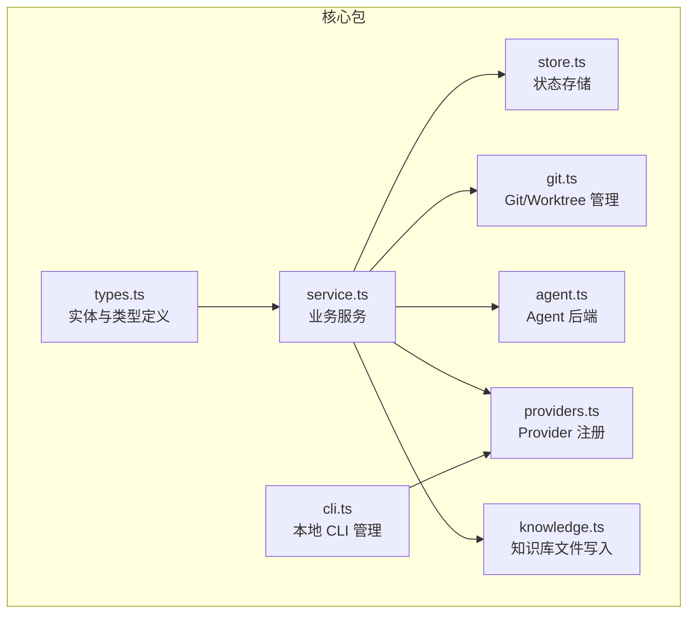
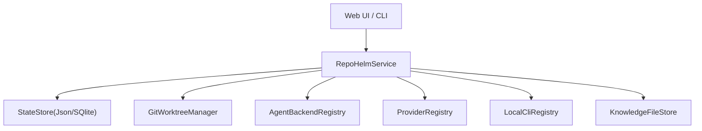
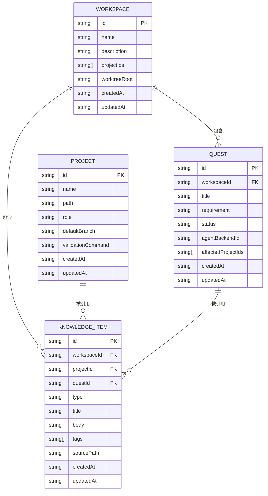
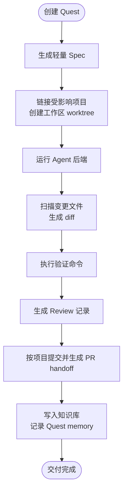
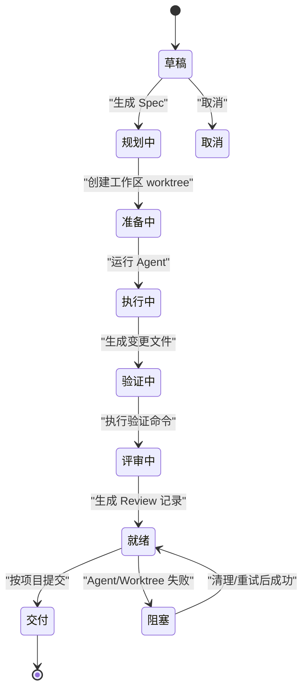
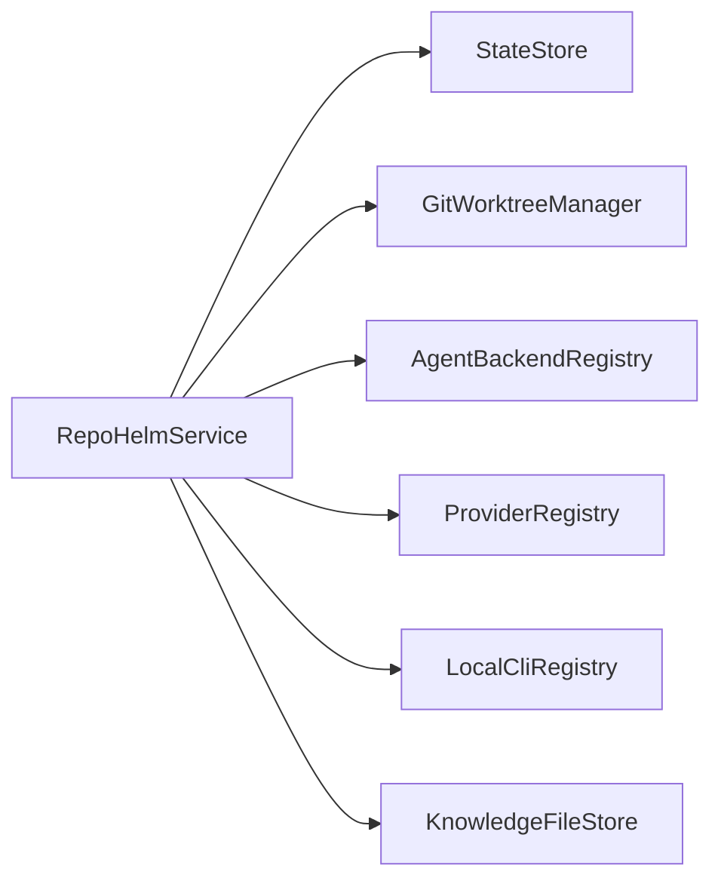

# 核心实体模型

<cite>
**本文引用的文件**
- [types.ts](file://packages/core/src/types.ts)
- [service.ts](file://packages/core/src/service.ts)
- [store.ts](file://packages/core/src/store.ts)
- [knowledge.ts](file://packages/core/src/knowledge.ts)
- [git.ts](file://packages/core/src/git.ts)
- [agent.ts](file://packages/core/src/agent.ts)
- [providers.ts](file://packages/core/src/providers.ts)
- [cli.ts](file://packages/core/src/cli.ts)
- [architecture.md](file://docs/architecture.md)
- [README.md](file://README.md)
</cite>

## 目录
1. [简介](#简介)
2. [项目结构](#项目结构)
3. [核心组件](#核心组件)
4. [架构总览](#架构总览)
5. [详细组件分析](#详细组件分析)
6. [依赖分析](#依赖分析)
7. [性能考虑](#性能考虑)
8. [故障排查指南](#故障排查指南)
9. [结论](#结论)
10. [附录](#附录)

## 简介
本文件聚焦 RepoHelm 的核心实体模型，系统性梳理并解释 Quest、Workspace、Project、KnowledgeItem 等关键实体的数据结构、字段语义、约束与业务规则，阐明实体间的关系与依赖，给出实体关系图与数据流向图，并提供生命周期与状态转换说明、验证规则与完整性约束、扩展与定制最佳实践，帮助读者快速掌握 RepoHelm 的领域建模与实现要点。

## 项目结构
RepoHelm 的核心领域模型集中在 packages/core/src 下，配合 docs/architecture.md 提供高层架构说明。核心文件职责如下：
- types.ts：定义所有核心实体与类型（含状态枚举、输入输出、配置等）
- service.ts：核心业务服务，负责实体的创建、更新、关联、执行与交付
- store.ts：状态持久化抽象（JsonStateStore 与 SqliteStateStore），负责迁移与读写
- knowledge.ts：知识库文件写入与渲染（Markdown 片段）
- git.ts：Git 与 worktree 管理（创建、清理、diff、验证、提交、PR）
- agent.ts：Agent 后端注册与运行（Mock、CLI、Provider）
- providers.ts：Provider 注册与模型列表拉取
- cli.ts：本地 CLI 检测、模型列举与连通性测试
- architecture.md：产品方向、设计原则与实体关系的高层说明

图表来源
- [types.ts:173-205](file://packages/core/src/types.ts#L173-L205)
- [service.ts:56-71](file://packages/core/src/service.ts#L56-L71)
- [store.ts:86-115](file://packages/core/src/store.ts#L86-L115)
- [knowledge.ts:12-21](file://packages/core/src/knowledge.ts#L12-L21)
- [git.ts:33-120](file://packages/core/src/git.ts#L33-L120)
- [agent.ts:395-411](file://packages/core/src/agent.ts#L395-L411)
- [providers.ts:163-190](file://packages/core/src/providers.ts#L163-L190)
- [cli.ts:112-124](file://packages/core/src/cli.ts#L112-L124)

章节来源
- [types.ts:1-334](file://packages/core/src/types.ts#L1-L334)
- [service.ts:56-133](file://packages/core/src/service.ts#L56-L133)
- [store.ts:86-165](file://packages/core/src/store.ts#L86-L165)
- [architecture.md:160-275](file://docs/architecture.md#L160-L275)

## 核心组件
本节对核心实体进行逐项解析，涵盖字段、类型、约束、业务规则与关系。

- Workspace（工作区）
  - 字段与类型
    - id: string（唯一标识）
    - name: string（工作区名称）
    - description: string（描述）
    - projectIds: string[]（关联项目 id 列表）
    - worktrees: WorkspaceWorktree[]（工作区内的 worktree 快照）
    - worktreeRoot: string（工作区 worktree 根目录）
    - createdAt/updatedAt: string（ISO 时间戳）
  - 约束与规则
    - projectIds 与 worktrees 一一对应，表示已为每个关联项目创建了 worktree
    - worktreeRoot 为空时使用默认根目录
    - 更新时需保证 worktrees 与 projectIds 的一致性
  - 业务规则
    - 链接/断开项目时，自动创建/清理 worktree
    - 删除项目时，级联清理其在各工作区中的 worktree 并移除关联

- Project（项目）
  - 字段与类型
    - id/name/path: string（唯一标识、名称、本地路径）
    - role: ProjectRole（前端/后端/文档/库/基础设施/未知）
    - defaultBranch: string（默认分支）
    - validationCommand: string（交付前验证命令）
    - health: ProjectHealth（健康状态）
    - createdAt/updatedAt: string（ISO 时间戳）
  - 约束与规则
    - path 必须指向有效 Git 仓库
    - health.status 与 message 需与实际仓库状态一致
    - 更新 path/defaultBranch 会重置 health 为 unknown 并提示重新检查
  - 业务规则
    - 项目摘要以知识项形式落盘，便于检索与回顾

- Quest（任务）
  - 字段与类型
    - id/workspaceId/title/requirement: string
    - status: QuestStatus（草稿/规划/准备/执行/验证/评审/就绪/交付/阻塞/取消）
    - spec: QuestSpec（需求、功能/非功能要求、范围、验收标准等）
    - agentBackendId: AgentBackendId（Agent 后端）
    - affectedProjectIds: string[]（受影响项目集合）
    - worktrees: WorktreeState[]（每个受影响项目的 worktree 状态）
    - changedFiles: ChangedFile[]（变更文件列表）
    - validationResults/reviewNotes: string[]
    - deliveryResults: DeliveryState[]（交付状态）
    - capabilityRecommendations: CapabilityRecommendation[]（能力推荐）
    - agentSummary?: string（Agent 概要）
    - createdAt/updatedAt: string
  - 约束与规则
    - affectedProjectIds 默认等于关联工作区的 projectIds
    - worktrees 与 affectedProjectIds 对应
    - changedFiles 由 Git 工具链扫描生成
    - deliveryResults 与每个 worktree 对应
  - 业务规则
    - 创建时生成轻量 Spec 与事件流
    - 运行时创建 worktree，执行 Agent，生成变更文件与 Review 记录
    - 交付前执行验证命令，按项目 commit，生成 PR handoff

- KnowledgeItem（知识项）
  - 字段与类型
    - id/workspaceId/projectId?/questId?/type/title/body/tags/sourcePath?
    - type: "repo-wiki" | "architecture" | "decision" | "memory" | "troubleshooting"
    - createdAt/updatedAt: string
  - 约束与规则
    - type 限定知识类型
    - projectId/questId 可选，用于层级关联
    - sourcePath 为知识项落盘后的文件路径
  - 业务规则
    - 项目摘要、架构说明、Quest memory 等均以知识项形式落盘
    - 渲染为 Markdown 片段，包含 YAML frontmatter

章节来源
- [types.ts:36-57](file://packages/core/src/types.ts#L36-L57)
- [types.ts:173-191](file://packages/core/src/types.ts#L173-L191)
- [types.ts:193-205](file://packages/core/src/types.ts#L193-L205)
- [types.ts:18-22](file://packages/core/src/types.ts#L18-L22)
- [types.ts:70-87](file://packages/core/src/types.ts#L70-L87)
- [types.ts:99-109](file://packages/core/src/types.ts#L99-L109)
- [types.ts:111-133](file://packages/core/src/types.ts#L111-L133)
- [types.ts:135-152](file://packages/core/src/types.ts#L135-L152)
- [types.ts:154-171](file://packages/core/src/types.ts#L154-L171)

## 架构总览
RepoHelm 的核心实体通过服务层进行编排，结合 Git/Worktree、Agent 后端、Provider 与本地 CLI 管理，形成完整的任务闭环。状态持久化采用 SQLite（优先）与 JSON 兼容迁移。

图表来源
- [service.ts:56-71](file://packages/core/src/service.ts#L56-L71)
- [store.ts:86-115](file://packages/core/src/store.ts#L86-L115)
- [git.ts:33-120](file://packages/core/src/git.ts#L33-L120)
- [agent.ts:395-411](file://packages/core/src/agent.ts#L395-L411)
- [providers.ts:163-190](file://packages/core/src/providers.ts#L163-L190)
- [cli.ts:112-124](file://packages/core/src/cli.ts#L112-L124)
- [knowledge.ts:12-21](file://packages/core/src/knowledge.ts#L12-L21)

章节来源
- [architecture.md:276-313](file://docs/architecture.md#L276-L313)
- [README.md:3-32](file://README.md#L3-L32)

## 详细组件分析

### 实体关系图
下图展示核心实体之间的关系与依赖，包括外键与引用完整性约束的体现。

图表来源
- [types.ts:36-57](file://packages/core/src/types.ts#L36-L57)
- [types.ts:47-57](file://packages/core/src/types.ts#L47-L57)
- [types.ts:173-191](file://packages/core/src/types.ts#L173-L191)
- [types.ts:193-205](file://packages/core/src/types.ts#L193-L205)

章节来源
- [types.ts:36-57](file://packages/core/src/types.ts#L36-L57)
- [types.ts:173-191](file://packages/core/src/types.ts#L173-L191)
- [types.ts:193-205](file://packages/core/src/types.ts#L193-L205)

### 数据流向图
下图展示从创建到交付的关键数据流，包括状态变化、事件记录与知识沉淀。

图表来源
- [service.ts:478-542](file://packages/core/src/service.ts#L478-L542)
- [service.ts:544-698](file://packages/core/src/service.ts#L544-L698)
- [service.ts:762-790](file://packages/core/src/service.ts#L762-L790)
- [knowledge.ts:15-21](file://packages/core/src/knowledge.ts#L15-L21)

章节来源
- [service.ts:478-698](file://packages/core/src/service.ts#L478-L698)
- [service.ts:762-790](file://packages/core/src/service.ts#L762-L790)
- [knowledge.ts:23-43](file://packages/core/src/knowledge.ts#L23-L43)

### Quest 生命周期与状态转换
- 状态枚举：draft -> specifying -> planning -> preparing -> executing -> validating -> reviewing -> ready -> delivered
- 阻塞与取消：blocked、cancelled
- 关键节点
  - 创建：生成 Spec、事件与能力推荐
  - 准备：创建工作区 worktree
  - 执行：Agent 后端写入产物，生成变更文件
  - 验证：执行验证命令
  - 评审：生成 Review 记录
  - 交付：按项目 commit，生成 PR handoff
  - 清理：可清理 worktree，重试时先清理再重建

图表来源
- [types.ts:1-12](file://packages/core/src/types.ts#L1-L12)
- [service.ts:544-698](file://packages/core/src/service.ts#L544-L698)

章节来源
- [types.ts:1-12](file://packages/core/src/types.ts#L1-L12)
- [service.ts:544-698](file://packages/core/src/service.ts#L544-L698)

### 实体验证规则与数据完整性约束
- Workspace
  - projectIds 与 worktrees 数量一致，status 与 note 由 Git 操作结果驱动
  - worktreeRoot 为空时使用默认根目录
- Project
  - path 必须存在且为 Git 仓库；health 与 defaultBranch 保持一致
  - 更新 path/defaultBranch 会重置 health 为 unknown
- Quest
  - affectedProjectIds 为空时默认取工作区关联项目
  - worktrees 与 affectedProjectIds 一一对应
  - changedFiles 由 Git 工具链扫描生成，diff 由 Git diff 计算
  - deliveryResults 与每个 worktree 对应
- KnowledgeItem
  - type 限定；projectId/questId 可选；sourcePath 为落盘文件路径
  - frontmatter 包含元信息，正文为 Markdown 内容

章节来源
- [types.ts:36-57](file://packages/core/src/types.ts#L36-L57)
- [types.ts:47-57](file://packages/core/src/types.ts#L47-L57)
- [types.ts:173-191](file://packages/core/src/types.ts#L173-L191)
- [types.ts:193-205](file://packages/core/src/types.ts#L193-L205)
- [git.ts:122-140](file://packages/core/src/git.ts#L122-L140)
- [git.ts:159-187](file://packages/core/src/git.ts#L159-L187)
- [git.ts:222-249](file://packages/core/src/git.ts#L222-L249)
- [knowledge.ts:45-66](file://packages/core/src/knowledge.ts#L45-L66)

### 实际 JSON 示例数据
以下为各实体的典型结构示意（字段与类型来自类型定义，示例为结构示意，非真实数据）：
- Workspace
  - id: "ws_abc123"
  - name: "Billing Platform"
  - description: "支付平台多项目工作区"
  - projectIds: ["project_api", "project_web", "project_docs"]
  - worktrees: [WorktreeState...]
  - worktreeRoot: "/home/user/.repohelm/worktrees"
  - createdAt/updatedAt: "2026-01-01T00:00:00Z"
- Project
  - id: "project_api"
  - name: "Billing API"
  - path: "/home/user/code/billing-api"
  - role: "backend"
  - defaultBranch: "main"
  - validationCommand: "pnpm test"
  - health: { status: "ok", message: "Git 仓库可用", checkedAt: "..." }
  - createdAt/updatedAt: "2026-01-01T00:00:00Z"
- Quest
  - id: "quest_def456"
  - workspaceId: "ws_abc123"
  - title: "退款流程"
  - requirement: "实现退款接口并支持异步回调"
  - status: "ready"
  - spec: { functionalRequirements: [...], acceptanceCriteria: [...] }
  - agentBackendId: "mock"
  - affectedProjectIds: ["project_api"]
  - worktrees: [WorktreeState...]
  - changedFiles: [ChangedFile...]
  - validationResults: ["验证通过"]
  - reviewNotes: ["Review 通过"]
  - deliveryResults: [DeliveryState...]
  - capabilityRecommendations: [CapabilityRecommendation...]
  - createdAt/updatedAt: "2026-01-01T00:00:00Z"
- KnowledgeItem
  - id: "knowledge_repo_summary"
  - workspaceId: "ws_abc123"
  - projectId: "project_api"
  - type: "repo-wiki"
  - title: "Repo Summary: Billing API"
  - body: "项目注册信息与默认分支"
  - tags: ["repo", "summary"]
  - sourcePath: "/home/user/.repohelm/knowledge/repo-wiki/repo-summary-project_api.md"
  - createdAt/updatedAt: "2026-01-01T00:00:00Z"

章节来源
- [types.ts:36-57](file://packages/core/src/types.ts#L36-L57)
- [types.ts:47-57](file://packages/core/src/types.ts#L47-L57)
- [types.ts:173-191](file://packages/core/src/types.ts#L173-L191)
- [types.ts:193-205](file://packages/core/src/types.ts#L193-L205)

### 实体扩展与自定义最佳实践
- 新增实体
  - 优先在 types.ts 中定义接口与输入/输出类型
  - 在 RepoHelmState 中添加字段，确保持久化
  - 在 service.ts 中提供 CRUD 与业务编排方法
- 外键与引用完整性
  - 通过 id 引用关联，避免硬编码字符串
  - 在删除/解绑时执行级联清理（如删除项目时清理其 worktree）
- 状态与事件
  - 为每个实体维护 createdAt/updatedAt
  - 重要状态变化生成 AgentEvent，便于审计与回放
- 知识库扩展
  - 新增 KnowledgeItem 类型时，完善渲染与落盘逻辑
  - 保持 frontmatter 元信息完整，便于检索与导航
- Agent 与 Provider
  - 新增 AgentBackend 时，遵循统一接口，提供可用性检测与事件流
  - 新增 Provider 时，完善解析器与回退模型，确保连通性探测

章节来源
- [types.ts:279-290](file://packages/core/src/types.ts#L279-L290)
- [service.ts:305-339](file://packages/core/src/service.ts#L305-L339)
- [knowledge.ts:12-21](file://packages/core/src/knowledge.ts#L12-L21)
- [agent.ts:41-46](file://packages/core/src/agent.ts#L41-L46)
- [providers.ts:163-190](file://packages/core/src/providers.ts#L163-L190)

## 依赖分析
- 服务层依赖
  - RepoHelmService 依赖 StateStore（读写）、GitWorktreeManager（Git/Worktree）、AgentBackendRegistry（Agent 后端）、ProviderRegistry（Provider）、LocalCliRegistry（本地 CLI）、KnowledgeFileStore（知识落盘）
- 存储层依赖
  - JsonStateStore 与 SqliteStateStore 均实现 StateStore 接口，后者支持迁移与缓存
- 工具层依赖
  - GitWorktreeManager 依赖 Git 命令行，提供创建/清理/验证/提交/PR 等能力
  - ProviderRegistry 与 LocalCliRegistry 提供模型列表与连通性探测
- 知识库依赖
  - KnowledgeFileStore 依赖文件系统，将知识项渲染为 Markdown 并写入指定目录

图表来源
- [service.ts:56-71](file://packages/core/src/service.ts#L56-L71)
- [store.ts:86-115](file://packages/core/src/store.ts#L86-L115)
- [git.ts:33-120](file://packages/core/src/git.ts#L33-L120)
- [agent.ts:395-411](file://packages/core/src/agent.ts#L395-L411)
- [providers.ts:163-190](file://packages/core/src/providers.ts#L163-L190)
- [cli.ts:112-124](file://packages/core/src/cli.ts#L112-L124)
- [knowledge.ts:12-21](file://packages/core/src/knowledge.ts#L12-L21)

章节来源
- [service.ts:56-71](file://packages/core/src/service.ts#L56-L71)
- [store.ts:86-165](file://packages/core/src/store.ts#L86-L165)
- [git.ts:33-343](file://packages/core/src/git.ts#L33-L343)
- [agent.ts:395-436](file://packages/core/src/agent.ts#L395-L436)
- [providers.ts:163-304](file://packages/core/src/providers.ts#L163-L304)
- [cli.ts:112-368](file://packages/core/src/cli.ts#L112-L368)
- [knowledge.ts:12-68](file://packages/core/src/knowledge.ts#L12-L68)

## 性能考虑
- 状态存储
  - SQLite 优先，支持事务与索引；JSON 作为兼容层，首次读取时迁移
  - 模型缓存 TTL 控制，减少 Provider 拉取频率
- Git/Worktree
  - 批量创建/清理 worktree，避免重复 IO
  - diff 与验证命令带超时控制，防止长时间阻塞
- Agent 执行
  - 外部 CLI 与 Provider 调用带超时与错误回退
  - 事件流采用流式推送，降低内存占用

章节来源
- [store.ts:43-84](file://packages/core/src/store.ts#L43-L84)
- [service.ts:422-455](file://packages/core/src/service.ts#L422-L455)
- [git.ts:159-187](file://packages/core/src/git.ts#L159-L187)
- [agent.ts:223-249](file://packages/core/src/agent.ts#L223-L249)
- [providers.ts:221-302](file://packages/core/src/providers.ts#L221-L302)

## 故障排查指南
- 项目健康检查
  - 通过 GitWorktreeManager.inspectRepository 检查路径是否存在、是否为 Git 仓库、当前分支与默认分支
  - 更新 path/defaultBranch 后需重新检查健康状态
- Worktree 管理
  - 创建失败：检查路径是否已存在且非 Git 目录；检查 baseBranch 是否存在
  - 清理失败：查看 note 与错误信息，确认分支与工作树是否仍存在
- Agent 执行
  - 可用性检测：检查命令是否存在、环境变量是否配置
  - 执行失败：查看 stdout/stderr 与事件流，定位具体失败环节
- Provider/CLI
  - 连通性探测：通过 ProviderRegistry.probe 与 LocalCliRegistry.test 验证可用性
  - 模型列表：检查 API Key、Base URL 与网络连通性

章节来源
- [git.ts:34-120](file://packages/core/src/git.ts#L34-L120)
- [git.ts:142-187](file://packages/core/src/git.ts#L142-L187)
- [git.ts:222-249](file://packages/core/src/git.ts#L222-L249)
- [agent.ts:125-142](file://packages/core/src/agent.ts#L125-L142)
- [agent.ts:223-249](file://packages/core/src/agent.ts#L223-L249)
- [providers.ts:207-219](file://packages/core/src/providers.ts#L207-L219)
- [cli.ts:204-272](file://packages/core/src/cli.ts#L204-L272)

## 结论
RepoHelm 的核心实体模型围绕 Workspace、Project、Quest、KnowledgeItem 构建，通过服务层编排、Git/Worktree 隔离、Agent 后端与 Provider/CLI 管理，形成可审计、可隔离、可验证、可交付的任务闭环。类型系统与状态持久化保障了数据一致性与可追溯性；事件流与知识库沉淀提升了可复用性与可维护性。遵循本文的约束、规则与最佳实践，可在不破坏既有契约的前提下扩展实体与能力。

## 附录
- 相关文档
  - 架构文档：[architecture.md:160-275](file://docs/architecture.md#L160-L275)
  - 产品说明：[README.md:3-32](file://README.md#L3-L32)