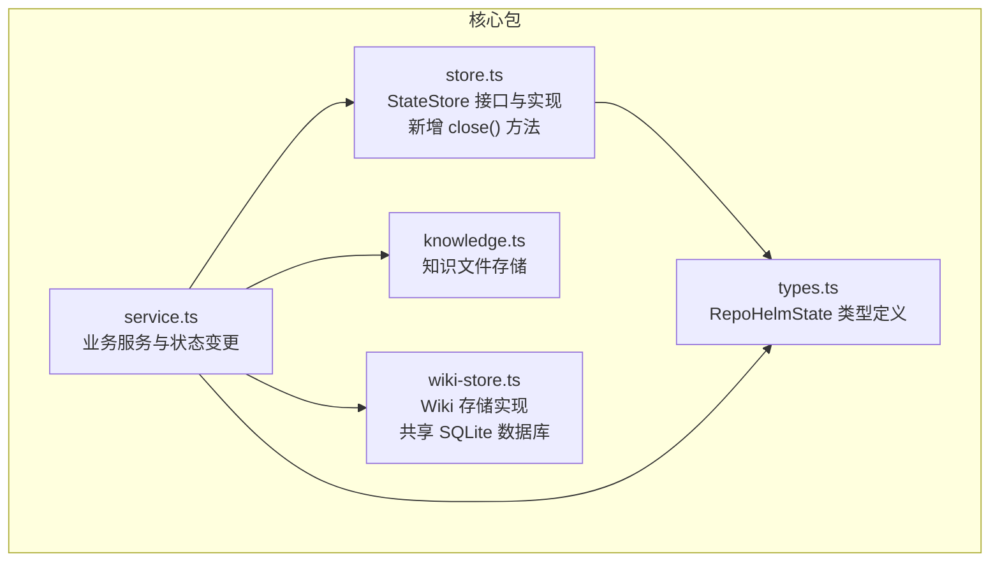
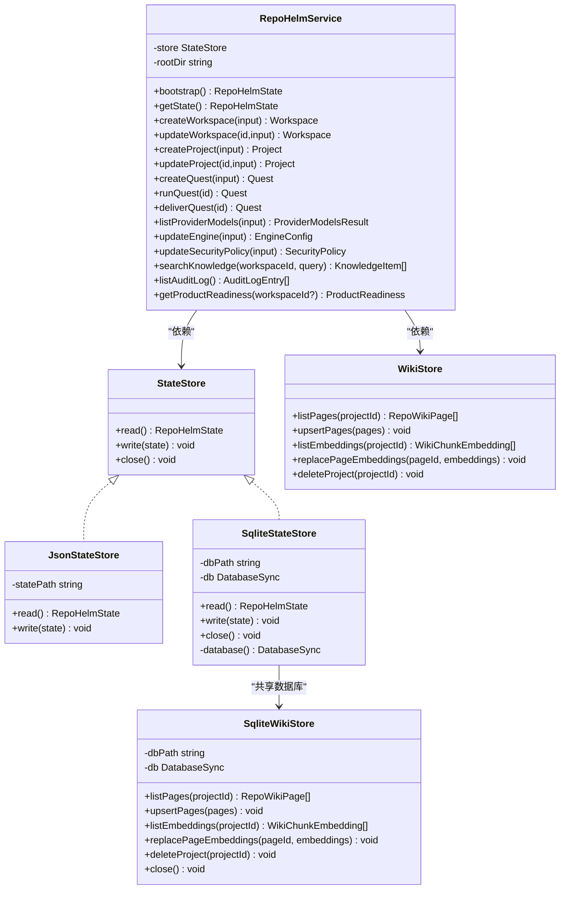
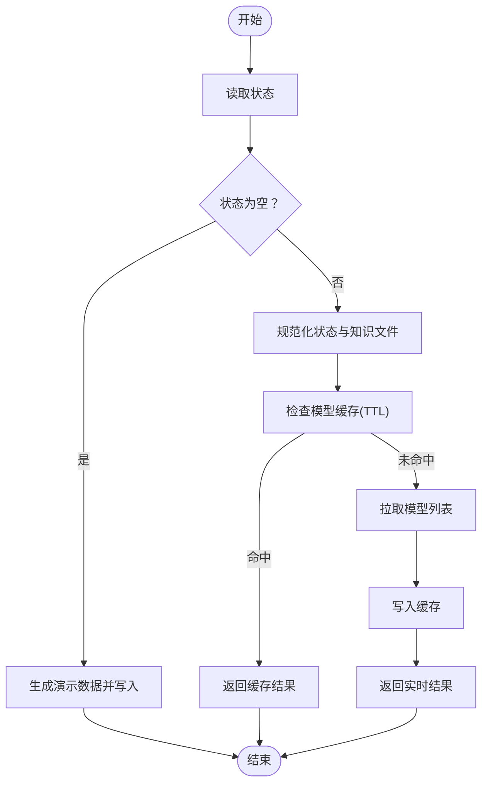
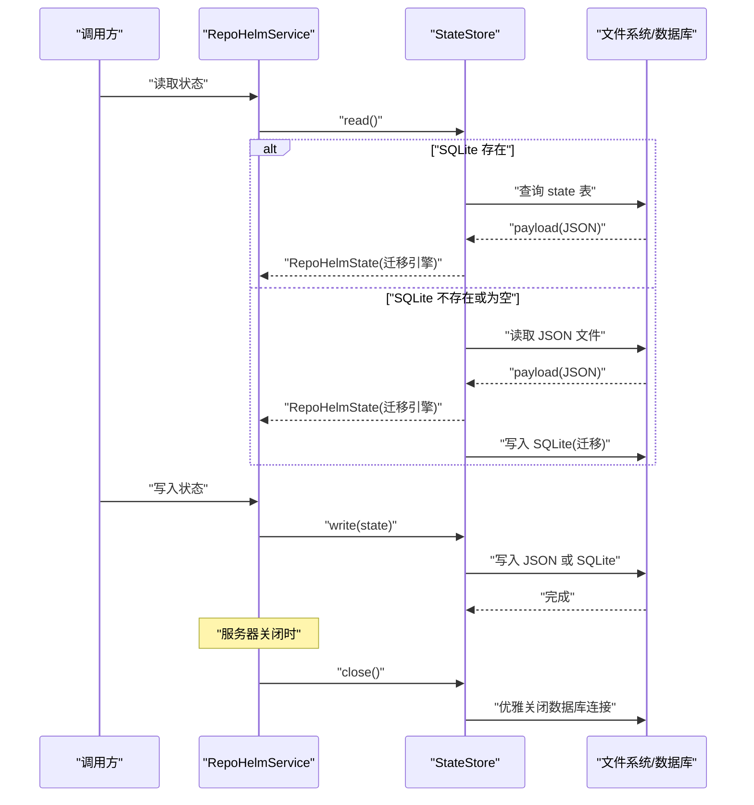
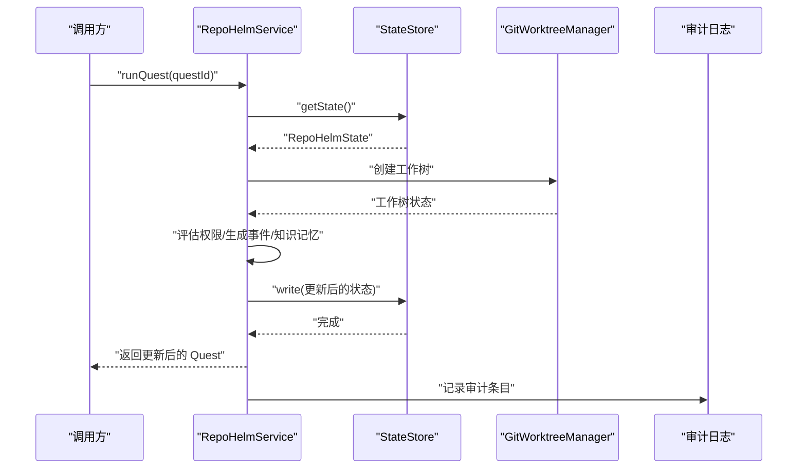
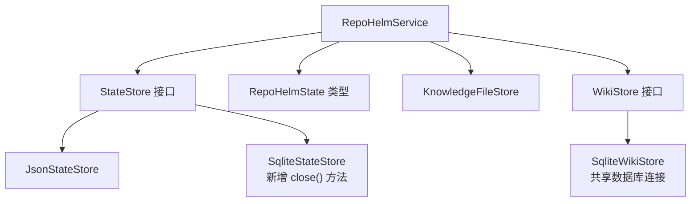

# 状态存储模型

<cite>
**本文档引用的文件**
- [packages/core/src/store.ts](file://packages/core/src/store.ts)
- [packages/core/src/types.ts](file://packages/core/src/types.ts)
- [packages/core/src/service.ts](file://packages/core/src/service.ts)
- [packages/core/src/knowledge.ts](file://packages/core/src/knowledge.ts)
- [packages/core/src/wiki-store.ts](file://packages/core/src/wiki-store.ts)
- [apps/server/src/index.ts](file://apps/server/src/index.ts)
- [README.md](file://README.md)
</cite>

## 更新摘要
**变更内容**
- 新增了 SQLite 数据库连接优雅关闭机制
- 增强了存储层的资源管理与稳定性
- 完善了服务器生命周期管理中的资源清理流程

## 目录
1. [简介](#简介)
2. [项目结构](#项目结构)
3. [核心组件](#核心组件)
4. [架构总览](#架构总览)
5. [详细组件分析](#详细组件分析)
6. [依赖关系分析](#依赖关系分析)
7. [性能考量](#性能考量)
8. [故障排查指南](#故障排查指南)
9. [结论](#结论)
10. [附录](#附录)

## 简介
本文件系统性阐述 RepoHelm 的状态存储模型与实现，重点围绕 RepoHelmState 的完整结构、子状态管理机制、数据访问与缓存策略、持久化与同步、状态变更触发与处理流程、查询与过滤、性能优化与最佳实践、备份与恢复、版本管理与迁移、以及并发访问与事务处理等主题展开。内容以仓库中的实际实现为依据，辅以可视化图示帮助不同技术背景的读者理解。

**更新** 本次更新反映了存储层增强：新增了close()方法用于优雅关闭SQLite数据库连接，提高了系统的稳定性。

## 项目结构
RepoHelm 的状态存储位于核心包 packages/core 中，主要由以下模块构成：
- store.ts：定义状态接口与 JSON/SQLite 两种持久化实现，负责读写与迁移，**新增了close()方法用于数据库连接管理**。
- types.ts：定义 RepoHelmState 及其所有子状态（工作区、项目、Quest、事件、知识、能力、安全策略、审计日志、引擎配置、模型缓存）的类型。
- service.ts：业务服务层，封装状态读取、规范化、变更与持久化，提供查询、过滤、缓存与审计等能力。
- knowledge.ts：知识库文件存储，将知识项写入文件系统，配合状态元数据进行管理。
- wiki-store.ts：**新增** Wiki 存储实现，与状态存储共享同一个 SQLite 数据库文件，支持知识库页面和嵌入向量的持久化。
- README.md：项目概述，包含状态持久化与迁移的关键信息。

**图表来源**
- [packages/core/src/store.ts:86-166](file://packages/core/src/store.ts#L86-L166)
- [packages/core/src/types.ts:279-290](file://packages/core/src/types.ts#L279-L290)
- [packages/core/src/service.ts:56-71](file://packages/core/src/service.ts#L56-L71)
- [packages/core/src/knowledge.ts:12-68](file://packages/core/src/knowledge.ts#L12-L68)
- [packages/core/src/wiki-store.ts:53-137](file://packages/core/src/wiki-store.ts#L53-L137)

**章节来源**
- [packages/core/src/store.ts:1-226](file://packages/core/src/store.ts#L1-L226)
- [packages/core/src/types.ts:1-674](file://packages/core/src/types.ts#L1-L674)
- [packages/core/src/service.ts:1-1331](file://packages/core/src/service.ts#L1-L1331)
- [packages/core/src/knowledge.ts:1-68](file://packages/core/src/knowledge.ts#L1-L68)
- [packages/core/src/wiki-store.ts:1-137](file://packages/core/src/wiki-store.ts#L1-L137)
- [README.md:1-100](file://README.md#L1-L100)

## 核心组件
- 状态接口与实现
  - StateStore 接口：定义 read() 与 write(state) 两个方法，统一读写契约。
  - JsonStateStore：基于 JSON 文件的状态存储，路径固定在根目录下的 .repohelm/state.json。
  - SqliteStateStore：基于 SQLite 的状态存储，表结构包含 id、payload、updated_at，支持 ON CONFLICT 更新，**新增了close()方法用于优雅关闭数据库连接**。
- RepoHelmState 结构
  - 包含 workspaces、projects、quests、events、knowledge、capabilities、securityPolicy、auditLog、engine、modelCache 等字段。
  - engine 字段包含引擎模式、CLI 后端、模型映射、BYOK 提供商集合与活动提供商标识。
  - modelCache 用于缓存模型列表查询结果，带 TTL 控制。
- 业务服务层
  - RepoHelmService：封装状态读取、规范化、变更与持久化；提供查询、过滤、缓存、审计、工作流执行等能力。
  - 知识文件存储：将知识项渲染为 Markdown 文件并写入文件系统，同时维护 sourcePath 元数据。
- **新增** Wiki 存储层
  - SqliteWikiStore：与 SqliteStateStore 共享同一个 SQLite 数据库文件，专门用于存储 Wiki 页面和嵌入向量，支持独立的 CRUD 操作。

**章节来源**
- [packages/core/src/store.ts:86-166](file://packages/core/src/store.ts#L86-L166)
- [packages/core/src/types.ts:279-290](file://packages/core/src/types.ts#L279-L290)
- [packages/core/src/service.ts:56-71](file://packages/core/src/service.ts#L56-L71)
- [packages/core/src/knowledge.ts:12-68](file://packages/core/src/knowledge.ts#L12-L68)
- [packages/core/src/wiki-store.ts:53-137](file://packages/core/src/wiki-store.ts#L53-L137)

## 架构总览
RepoHelm 的状态存储采用"接口抽象 + 多实现 + 业务编排"的设计：
- 抽象层：StateStore 接口统一读写行为。
- 实现层：JsonStateStore 与 SqliteStateStore 分别面向文件与数据库。
- 升级与迁移：SqliteStateStore 在首次读取时检测旧 JSON 文件，若存在则迁移并写入 SQLite。
- 业务层：RepoHelmService 负责状态读取、规范化、变更与持久化，贯穿整个工作流。
- **新增** 资源管理层：通过 close() 方法实现优雅的数据库连接管理，确保服务器关闭时的资源清理。

**图表来源**
- [packages/core/src/store.ts:86-166](file://packages/core/src/store.ts#L86-L166)
- [packages/core/src/service.ts:56-71](file://packages/core/src/service.ts#L56-L71)
- [packages/core/src/wiki-store.ts:53-137](file://packages/core/src/wiki-store.ts#L53-L137)

## 详细组件分析

### RepoHelmState 结构与子状态管理
- 结构组成
  - workspaces：工作区集合，包含项目 ID 列表、worktree 列表、worktree 根目录等。
  - projects：项目集合，包含角色、默认分支、验证命令、健康状态等。
  - quests：Quest 集合，包含状态、Spec、工作树状态、变更文件、验证与评审结果、交付结果、能力推荐等。
  - events：Agent 事件时间线，记录工作流关键节点。
  - knowledge：知识库条目，支持多种类型与标签，包含 sourcePath 元数据。
  - capabilities：能力定义与推荐，支持内置与人工确认。
  - securityPolicy：安全策略，包含命令审批模式、允许命令、文件/网络作用域、密钥策略、沙箱运行时等。
  - auditLog：审计日志，记录命令、文件、网络、密钥、能力、沙箱等类型的决策与详情。
  - engine：引擎配置，支持 CLI 与 BYOK 模式，提供模型映射与提供商管理。
  - modelCache：模型列表缓存，带 TTL 控制。
- 管理机制
  - 规范化：ensureKnowledgeFiles 与 normalizeState 确保知识文件与字段默认值一致性。
  - 审计：evaluateCommandPermission 与 audit 生成审计日志，贯穿执行链路。
  - 能力：seedCapabilities 与 recommendCapabilities 生成内置能力与推荐，支持人工确认与安装。

**章节来源**
- [packages/core/src/types.ts:279-290](file://packages/core/src/types.ts#L279-L290)
- [packages/core/src/service.ts:1078-1129](file://packages/core/src/service.ts#L1078-L1129)
- [packages/core/src/service.ts:1192-1255](file://packages/core/src/service.ts#L1192-L1255)
- [packages/core/src/service.ts:1257-1278](file://packages/core/src/service.ts#L1257-L1278)
- [packages/core/src/service.ts:1280-1289](file://packages/core/src/service.ts#L1280-L1289)
- [packages/core/src/service.ts:1291-1317](file://packages/core/src/service.ts#L1291-L1317)

### 数据访问模式与缓存策略
- 读取模式
  - bootstrap：优先从 StateStore 读取，若为空则生成演示数据并写入。
  - getState：封装 bootstrap，对外暴露统一读取入口。
- 写入模式
  - 业务操作完成后调用 store.write 写回完整状态，确保原子性（单次写入完整快照）。
- 缓存策略
  - 模型列表缓存：listProviderModels 支持 TTL（默认约 6 小时），命中缓存直接返回，未命中则拉取并写回缓存。
  - 引擎配置迁移：read 时对旧格式进行迁移，保证新旧兼容。

**图表来源**
- [packages/core/src/service.ts:73-133](file://packages/core/src/service.ts#L73-L133)
- [packages/core/src/service.ts:422-455](file://packages/core/src/service.ts#L422-L455)

**章节来源**
- [packages/core/src/service.ts:73-133](file://packages/core/src/service.ts#L73-L133)
- [packages/core/src/service.ts:422-455](file://packages/core/src/service.ts#L422-L455)

### 持久化机制与数据同步
- 文件持久化（JsonStateStore）
  - 读：解析 JSON 并进行引擎配置迁移。
  - 写：确保目录存在后写入 JSON 文件。
- 数据库持久化（SqliteStateStore）
  - 初始化：首次访问创建数据库与表结构。
  - 读：查询 id='current' 的 payload，解析后迁移引擎配置。
  - 写：使用 ON CONFLICT 更新 updated_at 与 payload。
  - 迁移：若 SQLite 中无数据但存在旧 JSON，则读取 JSON 并写入 SQLite。
  - **新增** 关闭：通过 close() 方法优雅关闭数据库连接，释放资源。
- 同步策略
  - 单点写入：业务操作完成后一次性写回完整状态，避免部分写入导致不一致。
  - 读写一致性：bootstrap 与 getState 统一入口，确保规范化与迁移逻辑一致。

**图表来源**
- [packages/core/src/store.ts:98-115](file://packages/core/src/store.ts#L98-L115)
- [packages/core/src/store.ts:125-148](file://packages/core/src/store.ts#L125-L148)
- [packages/core/src/store.ts:219-224](file://packages/core/src/store.ts#L219-L224)

**章节来源**
- [packages/core/src/store.ts:98-115](file://packages/core/src/store.ts#L98-L115)
- [packages/core/src/store.ts:125-148](file://packages/core/src/store.ts#L125-L148)
- [packages/core/src/store.ts:219-224](file://packages/core/src/store.ts#L219-L224)
- [README.md:12-12](file://README.md#L12-L12)

### 状态变更触发条件与处理流程
- 触发条件
  - 创建/更新工作区、项目、Quest。
  - 运行 Quest（创建工作树、执行 Agent、生成事件与知识记忆）。
  - 交付 Quest（验证、提交、PR 创建）。
  - 更新引擎配置、安全策略、能力推荐状态。
  - 检查项目健康状态。
- 处理流程
  - 读取状态 -> 生成变更 -> 写回状态 -> 记录审计日志与事件。
  - 关键流程包括：runQuest、deliverQuest、updateEngine、updateSecurityPolicy、accept/dismiss capability recommendation。

**图表来源**
- [packages/core/src/service.ts:544-698](file://packages/core/src/service.ts#L544-L698)

**章节来源**
- [packages/core/src/service.ts:544-698](file://packages/core/src/service.ts#L544-L698)
- [packages/core/src/service.ts:762-881](file://packages/core/src/service.ts#L762-L881)

### 状态查询与过滤
- 查询接口
  - searchKnowledge：按工作区与关键词检索知识库，支持标题、正文、标签匹配与排序。
  - listAuditLog：返回最近审计日志。
  - listWorktrees：按工作区过滤工作树状态。
  - getProductReadiness：生成产品就绪度视图。
- 过滤与排序
  - searchKnowledge：按关键词分词匹配，按 updatedAt 倒序排序。
  - listAuditLog：截取最近 N 条。

**章节来源**
- [packages/core/src/service.ts:883-886](file://packages/core/src/service.ts#L883-L886)
- [packages/core/src/service.ts:1061-1076](file://packages/core/src/service.ts#L1061-L1076)
- [packages/core/src/service.ts:916-919](file://packages/core/src/service.ts#L916-L919)
- [packages/core/src/service.ts:700-711](file://packages/core/src/service.ts#L700-L711)
- [packages/core/src/service.ts:921-1024](file://packages/core/src/service.ts#L921-L1024)

### 版本管理与迁移机制
- 引擎配置迁移
  - migrateEngine：将旧 byok 字段迁移到新的 byokProviders 格式，解析 baseUrl 推断提供商 ID，并设置 activeByokProviderId。
- 状态迁移
  - SqliteStateStore.read：若 SQLite 无数据但存在旧 JSON，则读取 JSON 并写入 SQLite，实现平滑迁移。
- 默认值与规范化
  - normalizeState：为缺失字段填充默认值，确保状态结构一致性。
  - ensureKnowledgeFiles：重建丢失的知识文件元数据，保证知识库完整性。

**章节来源**
- [packages/core/src/store.ts:36-84](file://packages/core/src/store.ts#L36-L84)
- [packages/core/src/store.ts:125-148](file://packages/core/src/store.ts#L125-L148)
- [packages/core/src/service.ts:1078-1129](file://packages/core/src/service.ts#L1078-L1129)
- [packages/core/src/service.ts:1078-1098](file://packages/core/src/service.ts#L1078-L1098)

### 并发访问控制与事务处理
- 并发访问
  - 读取：bootstrap/getState 提供统一入口，避免重复读取。
  - 写入：每次业务操作完成后一次性写回完整状态，减少并发冲突概率。
- 事务处理
  - SQLite：单次 write 使用 INSERT ... ON CONFLICT 更新，具备原子性；整体状态写入视为一次事务级别的原子操作。
  - 文件：writeFile 为单次写入，避免部分写入。
- **新增** 资源管理
  - 通过 close() 方法优雅关闭数据库连接，确保资源及时释放。
  - 服务器关闭时自动调用 close() 方法，防止资源泄漏。

**章节来源**
- [packages/core/src/store.ts:141-148](file://packages/core/src/store.ts#L141-L148)
- [packages/core/src/store.ts:111-114](file://packages/core/src/store.ts#L111-L114)
- [packages/core/src/store.ts:219-224](file://packages/core/src/store.ts#L219-L224)

## 依赖关系分析
- 组件耦合
  - RepoHelmService 依赖 StateStore 接口，解耦具体存储实现。
  - 知识文件存储与状态元数据协同，确保知识项的文件与元数据一致。
  - **新增** Wiki 存储与状态存储共享数据库，实现统一的资源管理。
- 外部依赖
  - node:fs/promises 与 node:path 用于文件系统操作。
  - node:sqlite 用于 SQLite 数据库访问。
  - nanoid 用于生成唯一 ID。

**图表来源**
- [packages/core/src/service.ts:56-71](file://packages/core/src/service.ts#L56-L71)
- [packages/core/src/store.ts:86-166](file://packages/core/src/store.ts#L86-L166)
- [packages/core/src/knowledge.ts:12-68](file://packages/core/src/knowledge.ts#L12-L68)
- [packages/core/src/wiki-store.ts:53-137](file://packages/core/src/wiki-store.ts#L53-L137)

**章节来源**
- [packages/core/src/service.ts:56-71](file://packages/core/src/service.ts#L56-L71)
- [packages/core/src/store.ts:86-166](file://packages/core/src/store.ts#L86-L166)
- [packages/core/src/knowledge.ts:12-68](file://packages/core/src/knowledge.ts#L12-L68)
- [packages/core/src/wiki-store.ts:53-137](file://packages/core/src/wiki-store.ts#L53-L137)

## 性能考量
- I/O 优化
  - 单次写入完整状态，减少频繁小写入带来的 I/O 开销。
  - SQLite 使用 ON CONFLICT 更新，避免删除重建。
- 缓存策略
  - 模型列表缓存（TTL 约 6 小时）显著降低外部 API 调用频率。
- 查询优化
  - searchKnowledge 对关键词进行分词匹配与排序，限制返回数量，避免全量扫描。
- 并发与一致性
  - 通过一次性写入与规范化流程，降低并发写入冲突概率。
- **新增** 资源管理优化
  - 通过 close() 方法及时释放数据库连接，避免连接池耗尽。
  - 服务器优雅关闭时的资源清理，提高系统稳定性。

**章节来源**
- [packages/core/src/service.ts:422-455](file://packages/core/src/service.ts#L422-L455)
- [packages/core/src/service.ts:1061-1076](file://packages/core/src/service.ts#L1061-L1076)
- [packages/core/src/store.ts:219-224](file://packages/core/src/store.ts#L219-L224)

## 故障排查指南
- 状态读取异常
  - 若 state.json 不存在，将返回空状态并生成默认值；检查 .repohelm 目录权限与路径。
- SQLite 初始化失败
  - 确认数据库文件可写，初始化时会创建表结构；检查磁盘空间与权限。
- 知识文件丢失
  - ensureKnowledgeFiles 会尝试重建 Markdown 文件；若仍失败，检查知识根目录权限。
- 引擎配置迁移错误
  - migrateEngine 会根据 baseUrl 推断提供商 ID；若推断失败，需手动修正 byokProviders 结构。
- 审计与安全策略
  - evaluateCommandPermission 会根据 allowlist 与 manual 模式决定是否放行；检查安全策略配置。
- **新增** 数据库连接问题
  - 如果遇到"数据库忙"或"连接已关闭"错误，检查 close() 方法的调用时机。
  - 确保在服务器关闭前调用 close() 方法，避免资源泄漏。

**章节来源**
- [packages/core/src/store.ts:98-115](file://packages/core/src/store.ts#L98-L115)
- [packages/core/src/store.ts:150-164](file://packages/core/src/store.ts#L150-L164)
- [packages/core/src/service.ts:1078-1098](file://packages/core/src/service.ts#L1078-L1098)
- [packages/core/src/service.ts:36-84](file://packages/core/src/service.ts#L36-L84)
- [packages/core/src/service.ts:1257-1278](file://packages/core/src/service.ts#L1257-L1278)
- [packages/core/src/store.ts:219-224](file://packages/core/src/store.ts#L219-L224)

## 结论
RepoHelm 的状态存储模型以清晰的接口抽象、灵活的多实现与完善的迁移机制为核心，结合业务服务层的状态规范化、缓存与审计能力，实现了稳定可靠的工作流闭环。通过一次性写入、SQLite 原子更新与 TTL 缓存等策略，在保证一致性的同时兼顾性能与可维护性。

**更新** 本次增强通过新增的 close() 方法，显著提升了系统的稳定性。该方法确保了 SQLite 数据库连接的优雅关闭，防止资源泄漏和连接池耗尽问题。配合服务器生命周期管理中的自动资源清理，使得 RepoHelm 在长时间运行和高并发场景下都能保持良好的性能表现。

建议在生产环境中进一步引入锁机制与增量写入策略，以应对更高并发场景。同时，建议在应用启动时明确数据库连接的生命周期管理，确保在任何情况下都能正确释放资源。

## 附录
- 备份与恢复
  - 备份：定期复制 .repohelm/state.json 或 .repohelm/state.sqlite。
  - 恢复：停止服务后替换对应文件，重启后自动迁移（如需）。
- 最佳实践
  - 保持状态写入的原子性，避免跨操作分散写入。
  - 合理利用模型缓存，减少外部依赖抖动。
  - 定期检查知识文件完整性，确保 sourcePath 与文件一致。
  - 明确安全策略配置，必要时启用 manual 审批模式。
  - **新增** 资源管理最佳实践
    - 在服务器关闭时调用 close() 方法，确保数据库连接正确释放。
    - 避免在应用生命周期外重复创建数据库连接，防止连接池耗尽。
    - 监控数据库连接状态，及时发现和处理连接泄漏问题。

**章节来源**
- [README.md:12-12](file://README.md#L12-L12)
- [packages/core/src/store.ts:98-115](file://packages/core/src/store.ts#L98-L115)
- [packages/core/src/store.ts:125-148](file://packages/core/src/store.ts#L125-L148)
- [packages/core/src/service.ts:422-455](file://packages/core/src/service.ts#L422-L455)
- [packages/core/src/service.ts:1078-1098](file://packages/core/src/service.ts#L1078-L1098)
- [packages/core/src/store.ts:219-224](file://packages/core/src/store.ts#L219-L224)
- [apps/server/src/index.ts:900-916](file://apps/server/src/index.ts#L900-L916)