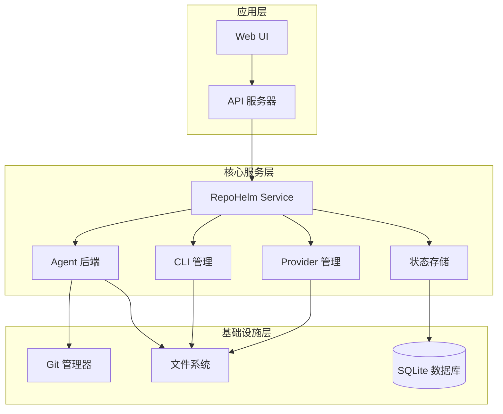
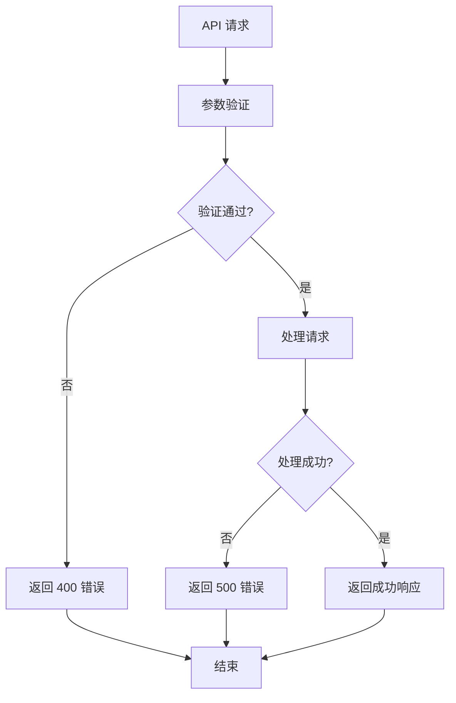

# API 端点总览

<cite>
**本文档引用的文件**
- [apps/server/src/index.ts](file://apps/server/src/index.ts)
- [packages/core/src/service.ts](file://packages/core/src/service.ts)
- [packages/core/src/types.ts](file://packages/core/src/types.ts)
- [apps/web/src/api.ts](file://apps/web/src/api.ts)
- [packages/core/src/store.ts](file://packages/core/src/store.ts)
- [packages/core/src/agent.ts](file://packages/core/src/agent.ts)
- [README.md](file://README.md)
- [docs/architecture.md](file://docs/architecture.md)
</cite>

## 目录
1. [简介](#简介)
2. [项目结构](#项目结构)
3. [API 设计原则](#api-设计原则)
4. [路由结构](#路由结构)
5. [核心 API 分类](#核心-api-分类)
6. [详细端点说明](#详细端点说明)
7. [认证与授权](#认证与授权)
8. [最佳实践](#最佳实践)
9. [错误处理策略](#错误处理策略)
10. [性能考虑](#性能考虑)
11. [故障排除指南](#故障排除指南)
12. [结论](#结论)

## 简介

RepoHelm 是一个开源的 Quest 工作区原型，用于验证"虚拟 workspace + 多项目 Quest + Spec 驱动 + worktree 隔离 + Agent 编排 + 知识库"的产品方向。该项目提供了一个完整的本地 API 服务器，支持多种 Agent 后端、CLI 管理、Provider 管理、引擎配置、安全策略、审计日志、工作区管理、项目管理和 Quest 管理等功能。

API 服务器默认运行在 `http://localhost:4300/`，与前端 UI (`http://localhost:5173/`) 协同工作，提供完整的 Quest 工作流管理能力。

## 项目结构

RepoHelm 采用模块化的项目结构，主要包含以下组件：



**图表来源**
- [apps/server/src/index.ts:1-366](file://apps/server/src/index.ts#L1-L366)
- [packages/core/src/service.ts:1-800](file://packages/core/src/service.ts#L1-L800)

**章节来源**
- [apps/server/src/index.ts:1-366](file://apps/server/src/index.ts#L1-L366)
- [packages/core/src/service.ts:1-800](file://packages/core/src/service.ts#L1-L800)

## API 设计原则

RepoHelm API 遵循以下设计原则：

### 1. RESTful 设计
- 使用标准 HTTP 方法：GET、POST、PATCH、DELETE
- 采用资源导向的 URL 结构
- 返回标准的 JSON 响应格式
- 使用适当的 HTTP 状态码

### 2. 分层架构
- API 层负责请求处理和响应格式化
- 服务层处理业务逻辑
- 存储层管理数据持久化
- 适配器层处理外部集成

### 3. 类型安全
- 使用 TypeScript 确保类型安全
- 通过 Zod 进行请求参数验证
- 定义完整的数据模型接口

### 4. 错误处理
- 统一的错误响应格式
- 详细的错误信息
- 适当的 HTTP 状态码

## 路由结构

API 路由采用层次化的命名约定：

```
/api/[资源类型]/[子资源?]/[操作?]
```

主要路由前缀：
- `/api/health` - 健康检查
- `/api/state` - 系统状态
- `/api/agent-backends` - Agent 后端管理
- `/api/clis` - CLI 管理
- `/api/providers` - Provider 管理
- `/api/engine` - 引擎配置
- `/api/security-policy` - 安全策略
- `/api/audit-log` - 审计日志
- `/api/workspaces` - 工作区管理
- `/api/projects` - 项目管理
- `/api/quests` - Quest 管理
- `/api/worktrees` - Worktree 管理

**章节来源**
- [apps/server/src/index.ts:114-366](file://apps/server/src/index.ts#L114-L366)

## 核心 API 分类

RepoHelm API 按功能分为以下主要类别：

### 1. 健康检查与状态查询
- 系统健康检查
- 全局状态查询
- 产品就绪度状态

### 2. Agent 后端管理
- Agent 后端列表
- CLI 后端管理
- Provider 后端管理

### 3. 引擎配置
- 引擎模式配置
- CLI 配置
- BYOK Provider 配置

### 4. 安全策略与审计
- 安全策略查询与更新
- 审计日志查询

### 5. 工作区管理
- 工作区 CRUD 操作
- 项目链接与解除链接
- 工作区知识搜索

### 6. 项目管理
- 项目 CRUD 操作
- 项目健康检查
- 项目目录操作

### 7. Quest 管理
- Quest 创建与执行
- Quest 状态管理
- Quest 生命周期操作

**章节来源**
- [apps/server/src/index.ts:114-366](file://apps/server/src/index.ts#L114-L366)
- [packages/core/src/types.ts:1-334](file://packages/core/src/types.ts#L1-L334)

## 详细端点说明

### 健康检查与状态查询

#### GET /api/health
**功能**：检查 API 服务健康状态
**响应**：包含服务基本信息和路径配置

#### GET /api/state
**功能**：获取完整的系统状态
**响应**：包含所有工作区、项目、Quest、事件、知识库、能力、安全策略、审计日志等

#### GET /api/product-readiness
**功能**：获取产品就绪度状态
**参数**：workspaceId (可选)
**响应**：产品里程碑、工作区模板、依赖关系图、治理状态

**章节来源**
- [apps/server/src/index.ts:114-123](file://apps/server/src/index.ts#L114-L123)
- [apps/server/src/index.ts:125-128](file://apps/server/src/index.ts#L125-L128)
- [apps/server/src/index.ts:210-213](file://apps/server/src/index.ts#L210-L213)

### Agent 后端管理

#### GET /api/agent-backends
**功能**：获取可用的 Agent 后端列表
**响应**：Agent 后端可用性信息

#### GET /api/clis
**功能**：获取本地 CLI 列表
**响应**：CLI 信息列表

#### POST /api/clis/rescan
**功能**：重新扫描本地 CLI
**响应**：更新后的 CLI 列表

#### POST /api/clis/:id/test
**功能**：测试指定 CLI
**参数**：id (CLI ID)
**响应**：测试结果

#### GET /api/providers
**功能**：获取 Provider 列表
**响应**：Provider 信息列表

#### POST /api/providers/:id/models
**功能**：获取 Provider 模型列表
**参数**：id (Provider ID)
**请求体**：包含 baseUrl、apiKey、refresh 参数
**响应**：模型列表结果

#### POST /api/providers/:id/test
**功能**：测试 Provider 连接
**参数**：id (Provider ID)
**请求体**：包含 baseUrl、apiKey 参数
**响应**：测试结果

**章节来源**
- [apps/server/src/index.ts:130-148](file://apps/server/src/index.ts#L130-L148)
- [apps/server/src/index.ts:150-176](file://apps/server/src/index.ts#L150-L176)
- [apps/server/src/index.ts:34-104](file://apps/server/src/index.ts#L34-L104)

### 引擎配置

#### GET /api/engine
**功能**：获取引擎配置
**响应**：引擎配置信息

#### PATCH /api/engine
**功能**：更新引擎配置
**请求体**：包含 mode、cliId、cliModels、byokProviders、activeByokProviderId 等参数
**响应**：更新后的引擎配置

**章节来源**
- [apps/server/src/index.ts:178-187](file://apps/server/src/index.ts#L178-L187)
- [apps/server/src/index.ts:69-89](file://apps/server/src/index.ts#L69-L89)

### 安全策略与审计

#### GET /api/security-policy
**功能**：获取安全策略
**响应**：安全策略配置

#### PATCH /api/security-policy
**功能**：更新安全策略
**请求体**：包含 commandApprovalMode、allowedCommands、fileScopes、networkScopes、secretsPolicy、sandboxRuntime 等参数
**响应**：更新后的安全策略

#### GET /api/audit-log
**功能**：获取审计日志
**响应**：审计日志条目列表

**章节来源**
- [apps/server/src/index.ts:194-203](file://apps/server/src/index.ts#L194-L203)
- [apps/server/src/index.ts:205-208](file://apps/server/src/index.ts#L205-L208)

### 工作区管理

#### GET /api/workspaces/:id/knowledge
**功能**：搜索工作区知识
**参数**：id (工作区 ID)，q (查询关键字)
**响应**：知识项列表

#### GET /api/worktrees
**功能**：获取工作树列表
**参数**：workspaceId (可选)
**响应**：工作树状态列表

#### POST /api/workspaces
**功能**：创建新工作区
**请求体**：包含 name、description、worktreeRoot 等参数
**响应**：创建的工作区

#### PATCH /api/workspaces/:id
**功能**：更新工作区
**参数**：id (工作区 ID)
**请求体**：包含 name、description、worktreeRoot 等可选参数
**响应**：更新的工作区

#### POST /api/workspaces/:id/links
**功能**：将项目链接到工作区
**参数**：id (工作区 ID)
**请求体**：包含 projectId 参数
**响应**：更新的工作区

#### DELETE /api/workspaces/:id/links/:projectId
**功能**：从工作区解除项目链接
**参数**：id (工作区 ID)，projectId (项目 ID)
**响应**：更新的工作区

**章节来源**
- [apps/server/src/index.ts:215-218](file://apps/server/src/index.ts#L215-L218)
- [apps/server/src/index.ts:220-223](file://apps/server/src/index.ts#L220-L223)
- [apps/server/src/index.ts:225-235](file://apps/server/src/index.ts#L225-L235)
- [apps/server/src/index.ts:243-255](file://apps/server/src/index.ts#L243-L255)

### 项目管理

#### POST /api/projects
**功能**：创建新项目
**请求体**：包含 name、path、role、defaultBranch、validationCommand 等参数
**响应**：创建的项目

#### PATCH /api/projects/:id
**功能**：更新项目
**参数**：id (项目 ID)
**请求体**：包含 name、path、role、defaultBranch、validationCommand 等可选参数
**响应**：更新的项目

#### DELETE /api/projects/:id
**功能**：删除项目
**参数**：id (项目 ID)
**响应**：更新后的系统状态

#### POST /api/projects/:id/check
**功能**：检查项目健康状态
**参数**：id (项目 ID)
**响应**：更新后的项目信息

#### POST /api/projects/:id/open-directory
**功能**：打开项目目录
**参数**：id (项目 ID)
**响应**：操作结果

#### POST /api/pick-directory
**功能**：选择目录（macOS）
**响应**：包含路径信息的对象

#### GET /api/branches
**功能**：获取项目分支列表
**参数**：path (项目路径)
**响应**：包含分支列表和默认分支的对象

**章节来源**
- [apps/server/src/index.ts:237-261](file://apps/server/src/index.ts#L237-L261)
- [apps/server/src/index.ts:263-271](file://apps/server/src/index.ts#L263-L271)
- [apps/server/src/index.ts:306-315](file://apps/server/src/index.ts#L306-L315)
- [apps/server/src/index.ts:273-291](file://apps/server/src/index.ts#L273-L291)
- [apps/server/src/index.ts:293-304](file://apps/server/src/index.ts#L293-L304)

### Quest 管理

#### POST /api/quests
**功能**：创建新 Quest
**请求体**：包含 workspaceId、title、requirement、agentBackendId、affectedProjectIds 等参数
**响应**：创建的 Quest

#### POST /api/quests/:id/run
**功能**：运行 Quest
**参数**：id (Quest ID)
**响应**：更新后的 Quest

#### POST /api/quests/:id/retry
**功能**：重试 Quest
**参数**：id (Quest ID)
**响应**：更新后的 Quest

#### POST /api/quests/:id/cleanup
**功能**：清理 Quest 的 worktree
**参数**：id (Quest ID)
**响应**：更新后的 Quest

#### POST /api/quests/:id/deliver
**功能**：交付 Quest
**参数**：id (Quest ID)
**响应**：更新后的 Quest

#### POST /api/quests/:id/capabilities/:capabilityId/accept
**功能**：接受能力推荐
**参数**：id (Quest ID)，capabilityId (能力 ID)
**响应**：更新后的 Quest

#### POST /api/quests/:id/capabilities/:capabilityId/dismiss
**功能**：忽略能力推荐
**参数**：id (Quest ID)，capabilityId (能力 ID)
**响应**：更新后的 Quest

**章节来源**
- [apps/server/src/index.ts:317-351](file://apps/server/src/index.ts#L317-L351)

## 认证与授权

RepoHelm API 当前采用简单的本地访问控制机制：

### CORS 配置
- 允许来自 `http://localhost:5173` 的跨域请求
- 支持标准的 HTTP 方法：GET、POST、PATCH、DELETE、OPTIONS
- 允许 `Content-Type` 头部

### 安全策略
- 基于命令白名单的安全策略
- 文件作用域限制
- 网络作用域限制
- 秘密信息处理策略
- 沙箱运行时配置

### 审计机制
- 记录所有命令执行
- 文件操作审计
- 网络访问监控
- 秘密信息使用记录
- 能力导入审计

**章节来源**
- [apps/server/src/index.ts:42-49](file://apps/server/src/index.ts#L42-L49)
- [apps/server/src/index.ts:97-104](file://apps/server/src/index.ts#L97-L104)
- [packages/core/src/types.ts:135-152](file://packages/core/src/types.ts#L135-L152)

## 最佳实践

### 1. API 使用建议
- **批量操作**：尽量使用批量 API 减少请求次数
- **缓存策略**：合理利用前端缓存减少重复请求
- **错误处理**：始终检查响应状态并处理错误情况
- **参数验证**：确保请求参数符合预期格式

### 2. 性能优化
- **分页查询**：对大量数据的查询使用分页
- **条件过滤**：使用查询参数精确过滤数据
- **并发处理**：合理安排并发请求避免阻塞
- **资源释放**：及时清理不需要的资源

### 3. 安全建议
- **最小权限**：遵循最小权限原则配置安全策略
- **定期审计**：定期检查审计日志
- **敏感信息**：避免在 URL 中传递敏感信息
- **输入验证**：始终验证用户输入

## 错误处理策略

### 错误响应格式
所有 API 错误都返回统一的 JSON 格式：
```json
{
  "error": "错误消息"
}
```

### 常见错误类型
- **400 Bad Request**：请求参数无效
- **404 Not Found**：资源不存在
- **500 Internal Server Error**：服务器内部错误
- **403 Forbidden**：权限不足

### 错误处理流程


**图表来源**
- [apps/server/src/index.ts:353-361](file://apps/server/src/index.ts#L353-L361)

## 性能考虑

### 1. 数据库优化
- 使用 SQLite 作为本地存储，支持快速查询
- 实现模型列表缓存机制，减少网络请求
- 优化查询索引提高检索效率

### 2. API 性能
- 实现请求去重和缓存
- 支持分页和条件过滤
- 优化响应数据大小

### 3. 并发处理
- 支持并发请求处理
- 实现请求排队机制
- 避免长时间阻塞操作

## 故障排除指南

### 常见问题诊断

#### API 无法访问
- 检查服务是否正常启动
- 验证端口配置（默认 4300）
- 确认 CORS 设置正确

#### 项目健康检查失败
- 检查项目路径是否存在
- 验证 Git 仓库完整性
- 确认默认分支配置

#### Agent 后端不可用
- 检查 CLI 命令配置
- 验证外部工具安装
- 确认环境变量设置

#### 安全策略阻止
- 检查命令白名单配置
- 验证文件作用域设置
- 审核网络访问策略

### 调试工具
- 使用浏览器开发者工具查看网络请求
- 检查服务器日志输出
- 使用 curl 测试 API 端点
- 监控系统资源使用情况

**章节来源**
- [apps/server/src/index.ts:353-361](file://apps/server/src/index.ts#L353-L361)

## 结论

RepoHelm API 提供了一个完整、一致且易于使用的接口，支持从基础的健康检查到复杂的 Quest 管理等全方位功能。通过清晰的路由结构、严格的类型安全和完善的错误处理机制，该 API 为 RepoHelm 的核心功能提供了可靠的技术支撑。

随着项目的演进，API 将继续优化性能、增强安全性并扩展功能，为用户提供更好的开发体验。建议开发者遵循本文档的最佳实践，在生产环境中谨慎配置安全策略，并充分利用 API 的缓存和批量操作能力来提升应用性能。