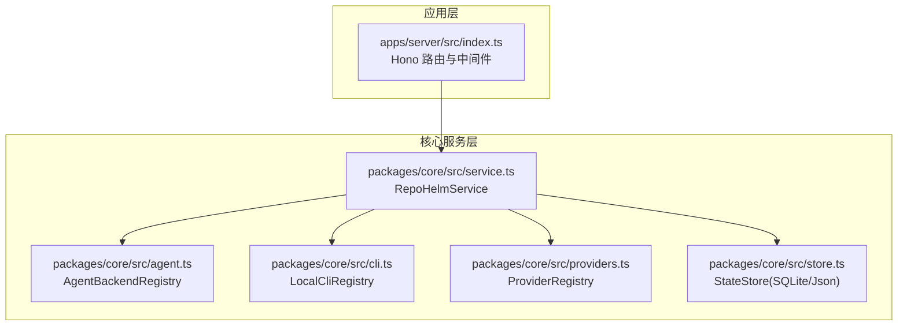
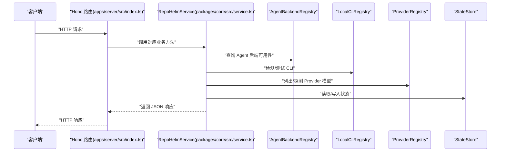
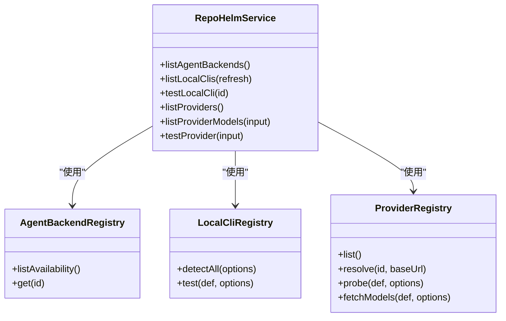

# Agent 后端管理 API

<cite>
**本文档引用的文件**
- [apps/server/src/index.ts](file://apps/server/src/index.ts)
- [packages/core/src/service.ts](file://packages/core/src/service.ts)
- [packages/core/src/agent.ts](file://packages/core/src/agent.ts)
- [packages/core/src/cli.ts](file://packages/core/src/cli.ts)
- [packages/core/src/providers.ts](file://packages/core/src/providers.ts)
- [packages/core/src/types.ts](file://packages/core/src/types.ts)
- [packages/core/src/store.ts](file://packages/core/src/store.ts)
- [README.md](file://README.md)
</cite>

## 目录
1. [简介](#简介)
2. [项目结构](#项目结构)
3. [核心组件](#核心组件)
4. [架构总览](#架构总览)
5. [详细组件分析](#详细组件分析)
6. [依赖关系分析](#依赖关系分析)
7. [性能考量](#性能考量)
8. [故障排查指南](#故障排查指南)
9. [结论](#结论)

## 简介
本文件面向 RepoHelm 后端管理 API，聚焦以下端点的详细说明与使用指导：
- 获取可用 Agent 后端列表：/api/agent-backends
- 获取本地 CLI 列表：/api/clis
- 重新扫描本地 CLI：/api/clis/rescan
- 测试指定 CLI：/api/clis/:id/test
- 获取 Provider 列表：/api/providers
- 获取 Provider 模型列表：/api/providers/:id/models
- 测试 Provider：/api/providers/:id/test

文档涵盖每个端点的请求方式、参数、响应格式、典型使用场景、调用示例以及错误处理策略，帮助开发者与运维人员快速集成与排障。

## 项目结构
后端 API 位于应用层，路由注册于服务器入口文件，业务逻辑封装在核心服务模块中，底层依赖 CLI、Provider、Agent Backend 注册表与状态存储。

图表来源
- [apps/server/src/index.ts:1-366](file://apps/server/src/index.ts#L1-L366)
- [packages/core/src/service.ts:1-800](file://packages/core/src/service.ts#L1-L800)
- [packages/core/src/agent.ts:1-436](file://packages/core/src/agent.ts#L1-L436)
- [packages/core/src/cli.ts:1-368](file://packages/core/src/cli.ts#L1-L368)
- [packages/core/src/providers.ts:1-304](file://packages/core/src/providers.ts#L1-L304)
- [packages/core/src/store.ts:1-166](file://packages/core/src/store.ts#L1-L166)

章节来源
- [apps/server/src/index.ts:1-366](file://apps/server/src/index.ts#L1-L366)
- [packages/core/src/service.ts:1-800](file://packages/core/src/service.ts#L1-L800)

## 核心组件
- 服务层入口：Hono 应用注册所有管理 API 路由，统一处理 CORS、日志与全局错误。
- RepoHelmService：封装业务逻辑，负责：
  - Agent 后端可用性查询
  - 本地 CLI 检测与测试
  - Provider 列表与模型列表查询（含缓存）
  - Provider 连通性探测（零 token 成本）
- AgentBackendRegistry：维护内置与外部 CLI 后端的可用性与执行能力。
- LocalCliRegistry：检测本地 CLI、枚举模型、执行真实连通性测试。
- ProviderRegistry：统一 Provider 定义、解析、探测与模型拉取。
- StateStore：持久化状态（SQLite/Json），支持迁移与读写。

章节来源
- [apps/server/src/index.ts:114-176](file://apps/server/src/index.ts#L114-L176)
- [packages/core/src/service.ts:139-455](file://packages/core/src/service.ts#L139-L455)
- [packages/core/src/agent.ts:395-411](file://packages/core/src/agent.ts#L395-L411)
- [packages/core/src/cli.ts:112-272](file://packages/core/src/cli.ts#L112-L272)
- [packages/core/src/providers.ts:163-303](file://packages/core/src/providers.ts#L163-L303)
- [packages/core/src/store.ts:86-166](file://packages/core/src/store.ts#L86-L166)

## 架构总览
下图展示了管理 API 的端到端调用链路与数据流向。

图表来源
- [apps/server/src/index.ts:130-176](file://apps/server/src/index.ts#L130-L176)
- [packages/core/src/service.ts:139-455](file://packages/core/src/service.ts#L139-L455)
- [packages/core/src/agent.ts:395-411](file://packages/core/src/agent.ts#L395-L411)
- [packages/core/src/cli.ts:112-272](file://packages/core/src/cli.ts#L112-L272)
- [packages/core/src/providers.ts:163-303](file://packages/core/src/providers.ts#L163-L303)
- [packages/core/src/store.ts:86-166](file://packages/core/src/store.ts#L86-L166)

## 详细组件分析

### /api/agent-backends
- 方法与路径：GET /api/agent-backends
- 功能：返回可用 Agent 后端列表，包含每个后端的可用性、配置状态与简要说明。
- 参数：无
- 响应格式：数组，元素为对象，字段包括 id、name、available、configured、command、detail。
- 使用场景：
  - UI 展示可用 Agent 后端
  - 引导用户选择合适的后端
- 调用示例（curl）：
  - curl -s http://localhost:4300/api/agent-backends
- 错误处理：
  - 服务器内部错误将返回 500 与错误信息。

章节来源
- [apps/server/src/index.ts:130-133](file://apps/server/src/index.ts#L130-L133)
- [packages/core/src/service.ts:139-141](file://packages/core/src/service.ts#L139-L141)
- [packages/core/src/agent.ts:395-411](file://packages/core/src/agent.ts#L395-L411)

### /api/clis
- 方法与路径：GET /api/clis
- 功能：返回本地 CLI 列表，包含每个 CLI 的可用性、版本、模型列表与说明。
- 参数：无
- 响应格式：数组，元素为对象，字段包括 id、name、tagline、bin、available、version、models、modelsLive、detail。
- 使用场景：
  - UI 展示本地可用 CLI
  - 选择默认 CLI 或进行模型配置
- 调用示例（curl）：
  - curl -s http://localhost:4300/api/clis
- 错误处理：
  - 服务器内部错误将返回 500 与错误信息。

章节来源
- [apps/server/src/index.ts:135-138](file://apps/server/src/index.ts#L135-L138)
- [packages/core/src/service.ts:345-347](file://packages/core/src/service.ts#L345-L347)
- [packages/core/src/cli.ts:200-202](file://packages/core/src/cli.ts#L200-L202)

### /api/clis/rescan
- 方法与路径：POST /api/clis/rescan
- 功能：强制重新扫描本地 CLI，刷新模型列表（若 CLI 支持）。
- 参数：无（请求体可为空）
- 响应格式：同 /api/clis
- 使用场景：
  - 新增/更新 CLI 后刷新模型列表
  - 解决模型列表过期问题
- 调用示例（curl）：
  - curl -s -X POST http://localhost:4300/api/clis/rescan
- 错误处理：
  - 服务器内部错误将返回 500 与错误信息。

章节来源
- [apps/server/src/index.ts:140-143](file://apps/server/src/index.ts#L140-L143)
- [packages/core/src/service.ts:345](file://packages/core/src/service.ts#L345)
- [packages/core/src/cli.ts:126-198](file://packages/core/src/cli.ts#L126-L198)

### /api/clis/:id/test
- 方法与路径：POST /api/clis/:id/test
- 功能：对指定 CLI 执行真实连通性测试（非交互式最小提示），验证二进制可执行与鉴权状态。
- 参数：
  - 路径参数：id（CLI 定义 id）
- 响应格式：对象，字段包括 id、ok、latencyMs、message。
- 使用场景：
  - 验证 CLI 是否可正常使用
  - 排查登录/鉴权/模型可用性问题
- 调用示例（curl）：
  - curl -s -X POST http://localhost:4300/api/clis/claude-code/test
- 错误处理：
  - 服务器内部错误将返回 500 与错误信息。

章节来源
- [apps/server/src/index.ts:145-148](file://apps/server/src/index.ts#L145-L148)
- [packages/core/src/service.ts:349-357](file://packages/core/src/service.ts#L349-L357)
- [packages/core/src/cli.ts:204-272](file://packages/core/src/cli.ts#L204-L272)

### /api/providers
- 方法与路径：GET /api/providers
- 功能：返回 Provider 列表，包含 id、名称、默认 base URL 与是否可选密钥。
- 参数：无
- 响应格式：数组，元素为对象，字段包括 id、name、defaultBaseUrl、keyOptional。
- 使用场景：
  - UI 展示可用 Provider
  - 选择 Provider 进行模型列表查询或连接性测试
- 调用示例（curl）：
  - curl -s http://localhost:4300/api/providers
- 错误处理：
  - 服务器内部错误将返回 500 与错误信息。

章节来源
- [apps/server/src/index.ts:150-153](file://apps/server/src/index.ts#L150-L153)
- [packages/core/src/service.ts:408-415](file://packages/core/src/service.ts#L408-L415)
- [packages/core/src/providers.ts:163-172](file://packages/core/src/providers.ts#L163-L172)

### /api/providers/:id/models
- 方法与路径：POST /api/providers/:id/models
- 功能：获取指定 Provider 的模型列表。支持传入 baseUrl、apiKey、refresh 控制是否强制刷新缓存。
- 参数（请求体 JSON）：
  - baseUrl：可选，覆盖默认 base URL
  - apiKey：可选，覆盖默认密钥
  - refresh：可选，布尔，强制刷新缓存
- 响应格式：对象，字段包括 providerId、models、live、detail、fetchedAt。
  - models：模型数组，每项包含 id、label
  - live：是否来自实时拉取
  - detail：描述性信息
  - fetchedAt：拉取时间
- 使用场景：
  - 选择 Provider 模型
  - 验证凭据与网络连通性
- 调用示例（curl）：
  - curl -s -X POST http://localhost:4300/api/providers/openai/models -H "Content-Type: application/json" -d '{}'
  - curl -s -X POST http://localhost:4300/api/providers/anthropic/models -H "Content-Type: application/json" -d '{"baseUrl":"https://api.anthropic.com","apiKey":"sk-...","refresh":true}'
- 错误处理：
  - 服务器内部错误将返回 500 与错误信息。

章节来源
- [apps/server/src/index.ts:155-165](file://apps/server/src/index.ts#L155-L165)
- [packages/core/src/service.ts:422-455](file://packages/core/src/service.ts#L422-L455)
- [packages/core/src/providers.ts:221-303](file://packages/core/src/providers.ts#L221-L303)

### /api/providers/:id/test
- 方法与路径：POST /api/providers/:id/test
- 功能：对指定 Provider 执行真实连通性探测（调用 /models，零 token 成本），返回可用模型数量与延迟。
- 参数（请求体 JSON）：
  - baseUrl：可选，覆盖默认 base URL
  - apiKey：可选，覆盖默认密钥
- 响应格式：对象，字段包括 id、ok、latencyMs、message。
- 使用场景：
  - 快速验证 Provider 凭据与网络
  - 诊断鉴权失败或网络异常
- 调用示例（curl）：
  - curl -s -X POST http://localhost:4300/api/providers/openai/test -H "Content-Type: application/json" -d '{}'
  - curl -s -X POST http://localhost:4300/api/providers/deepseek/test -H "Content-Type: application/json" -d '{"baseUrl":"https://api.deepseek.com","apiKey":"sk-..."}'
- 错误处理：
  - 服务器内部错误将返回 500 与错误信息。

章节来源
- [apps/server/src/index.ts:167-176](file://apps/server/src/index.ts#L167-L176)
- [packages/core/src/service.ts:392-406](file://packages/core/src/service.ts#L392-L406)
- [packages/core/src/providers.ts:207-219](file://packages/core/src/providers.ts#L207-L219)

## 依赖关系分析
- 路由层依赖服务层：每个管理端点最终委托 RepoHelmService 执行具体逻辑。
- 服务层依赖注册表与存储：
  - AgentBackendRegistry 提供后端可用性
  - LocalCliRegistry 提供 CLI 检测与测试
  - ProviderRegistry 提供 Provider 列表与模型拉取
  - StateStore 提供状态持久化与迁移
- 数据模型：
  - 类型定义集中于 types.ts，确保前后端一致的数据契约。

图表来源
- [packages/core/src/service.ts:139-455](file://packages/core/src/service.ts#L139-L455)
- [packages/core/src/agent.ts:395-411](file://packages/core/src/agent.ts#L395-L411)
- [packages/core/src/cli.ts:112-272](file://packages/core/src/cli.ts#L112-L272)
- [packages/core/src/providers.ts:163-303](file://packages/core/src/providers.ts#L163-L303)

章节来源
- [packages/core/src/service.ts:139-455](file://packages/core/src/service.ts#L139-L455)
- [packages/core/src/types.ts:14-334](file://packages/core/src/types.ts#L14-L334)

## 性能考量
- Provider 模型列表缓存：服务层对 Provider 模型列表采用 SQLite 缓存，TTL 为 6 小时，避免频繁拉取造成网络与鉴权压力。
- CLI 模型枚举：部分 CLI 支持本地枚举命令，支持刷新以获取最新模型；未刷新时返回内置默认值，减少外部调用。
- 连通性测试：CLI 真实测试采用最小提示，降低 token 消耗；Provider 探测为零 token 的元数据端点，仅验证鉴权与网络。
- 超时控制：Provider 拉取与 CLI 调用均设置超时，防止阻塞影响 API 响应。

章节来源
- [packages/core/src/service.ts:422-455](file://packages/core/src/service.ts#L422-L455)
- [packages/core/src/cli.ts:204-272](file://packages/core/src/cli.ts#L204-L272)
- [packages/core/src/providers.ts:221-303](file://packages/core/src/providers.ts#L221-L303)

## 故障排查指南
- 通用错误处理：
  - 服务器端捕获异常并返回 500 与错误消息，便于前端统一提示。
- Agent 后端不可用：
  - 检查对应后端的命令模板环境变量是否配置正确。
  - 参考 AgentBackendRegistry 的可用性报告，定位“未检测到二进制”或“缺少命令配置”等问题。
- CLI 无法测试：
  - 确认 CLI 二进制存在且可执行；检查登录状态与模型可用性。
  - 若提示“未登录/鉴权失败”，请先在对应 CLI 中完成登录。
- Provider 模型列表为空或报错：
  - 检查 baseUrl 与 apiKey 是否正确；必要时使用 refresh=true 强制刷新。
  - 若 Provider 支持无 key 模式（如 OpenRouter），可不提供密钥。
- Provider 连通性探测失败：
  - 检查网络连通性与代理设置；确认 /models 端点可达。
  - 观察 detail 字段中的错误原因，如 401、空响应等。

章节来源
- [apps/server/src/index.ts:353-361](file://apps/server/src/index.ts#L353-L361)
- [packages/core/src/agent.ts:125-142](file://packages/core/src/agent.ts#L125-L142)
- [packages/core/src/cli.ts:204-272](file://packages/core/src/cli.ts#L204-L272)
- [packages/core/src/providers.ts:207-303](file://packages/core/src/providers.ts#L207-L303)

## 结论
RepoHelm 的 Agent 后端管理 API 以清晰的职责划分与完善的错误处理机制，为前端提供了稳定可靠的后端能力。通过统一的服务层封装与注册表模式，实现了对 Agent、CLI、Provider 的灵活管理与测试。结合缓存与超时控制，API 在可用性与性能之间取得良好平衡。建议在生产环境中配合安全策略与审计日志，确保操作可追溯与资源可控。