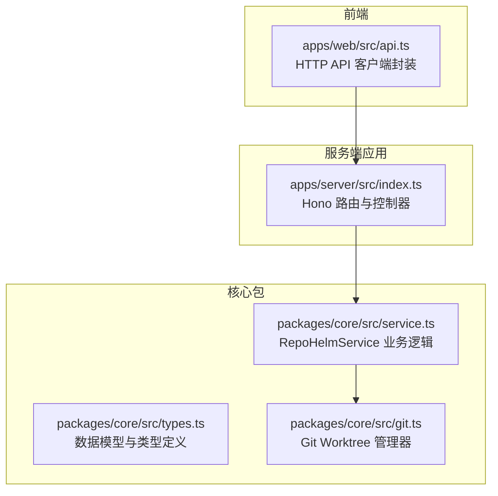
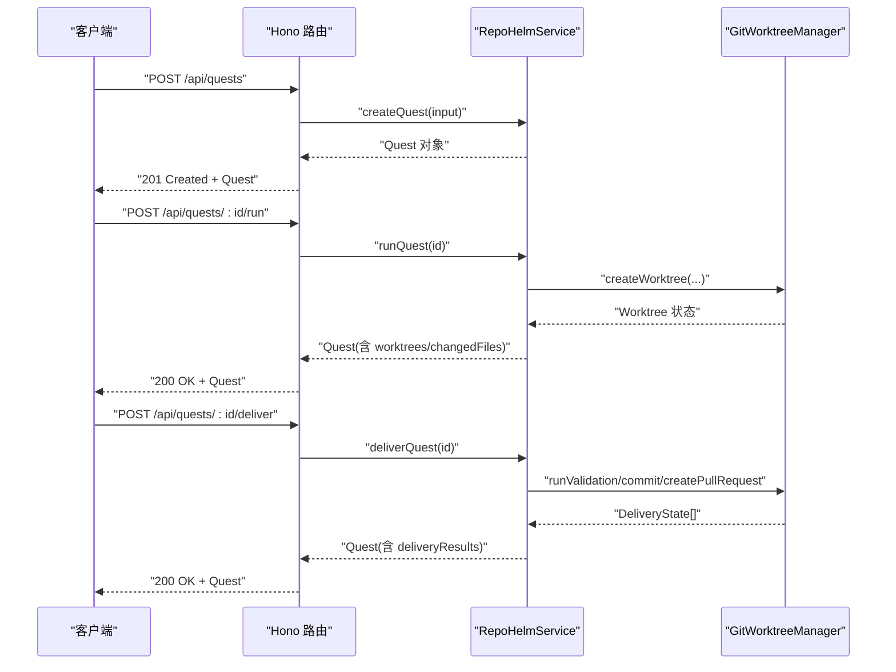
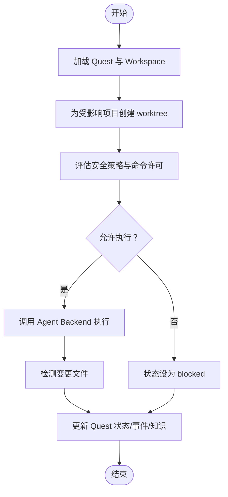
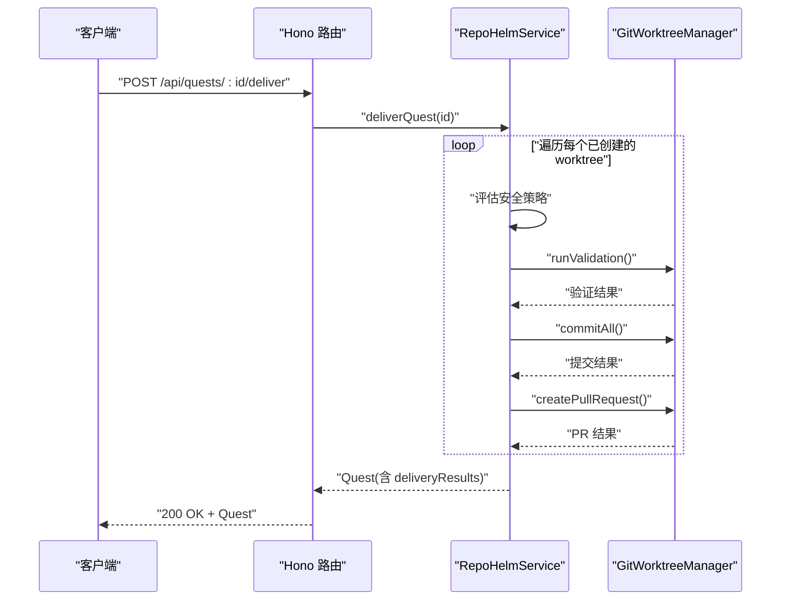
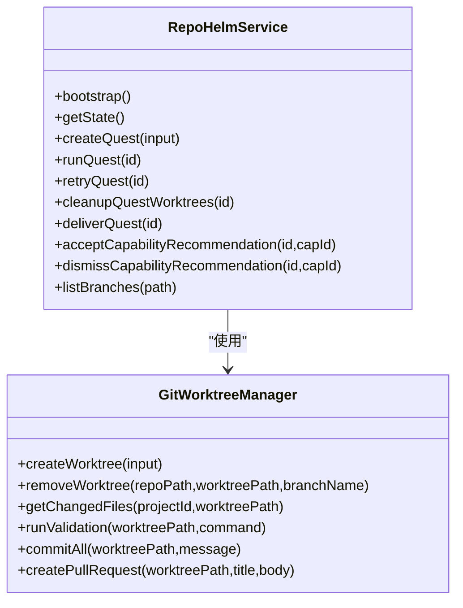

# Quest 管理 API

<cite>
**本文档引用的文件**
- [apps/server/src/index.ts](file://apps/server/src/index.ts)
- [packages/core/src/service.ts](file://packages/core/src/service.ts)
- [packages/core/src/types.ts](file://packages/core/src/types.ts)
- [apps/web/src/api.ts](file://apps/web/src/api.ts)
- [packages/core/src/git.ts](file://packages/core/src/git.ts)
- [README.md](file://README.md)
</cite>

## 目录
1. [简介](#简介)
2. [项目结构](#项目结构)
3. [核心组件](#核心组件)
4. [架构总览](#架构总览)
5. [详细组件分析](#详细组件分析)
6. [依赖关系分析](#依赖关系分析)
7. [性能考虑](#性能考虑)
8. [故障排查指南](#故障排查指南)
9. [结论](#结论)
10. [附录](#附录)

## 简介
本文件面向 RepoHelm 的 Quest 管理 API，系统性说明以下端点与生命周期行为：
- Quest 创建：/api/quests
- Quest 执行：/api/quests/:id/run
- Quest 重试：/api/quests/:id/retry
- Quest 清理：/api/quests/:id/cleanup
- Quest 交付：/api/quests/:id/deliver
- 能力推荐处理：/api/quests/:id/capabilities/:capabilityId/accept 与 /api/quests/:id/capabilities/:capabilityId/dismiss
- 目录选择：/api/pick-directory
- 分支列表：/api/branches
- 打开目录：/api/projects/:id/open-directory

同时，文档解释 Quest 生命周期、各阶段操作、执行流程以及错误处理策略，帮助开发者与使用者正确集成与调试。

## 项目结构
RepoHelm 采用多包（monorepo）结构，核心 API 位于服务端应用，业务逻辑封装在核心包中，前端通过 HTTP API 与后端交互。

图表来源
- [apps/server/src/index.ts:39-366](file://apps/server/src/index.ts#L39-L366)
- [packages/core/src/service.ts:56-1331](file://packages/core/src/service.ts#L56-L1331)
- [packages/core/src/git.ts:33-343](file://packages/core/src/git.ts#L33-L343)
- [apps/web/src/api.ts:276-423](file://apps/web/src/api.ts#L276-L423)

章节来源
- [apps/server/src/index.ts:1-366](file://apps/server/src/index.ts#L1-L366)
- [packages/core/src/service.ts:1-1331](file://packages/core/src/service.ts#L1-L1331)
- [apps/web/src/api.ts:1-423](file://apps/web/src/api.ts#L1-L423)

## 核心组件
- 服务端路由与控制器：负责接收 HTTP 请求、参数校验、调用服务层并返回响应。
- RepoHelmService：核心业务逻辑，包含 Quest 生命周期管理、工作树管理、交付流程、能力推荐、安全策略与审计等。
- GitWorktreeManager：封装 Git worktree 的创建、清理、变更检测、验证命令执行、提交与 PR 创建等。
- 类型系统：统一的数据模型与状态枚举，确保前后端契约一致。
- 前端 API 客户端：封装常用 API 调用，便于 UI 组件使用。

章节来源
- [apps/server/src/index.ts:106-366](file://apps/server/src/index.ts#L106-L366)
- [packages/core/src/service.ts:56-1331](file://packages/core/src/service.ts#L56-L1331)
- [packages/core/src/git.ts:33-343](file://packages/core/src/git.ts#L33-L343)
- [packages/core/src/types.ts:1-334](file://packages/core/src/types.ts#L1-L334)
- [apps/web/src/api.ts:276-423](file://apps/web/src/api.ts#L276-L423)

## 架构总览
下图展示了从 HTTP 请求到业务执行再到 Git 操作的整体流程。

图表来源
- [apps/server/src/index.ts:317-351](file://apps/server/src/index.ts#L317-L351)
- [packages/core/src/service.ts:478-881](file://packages/core/src/service.ts#L478-L881)
- [packages/core/src/git.ts:79-249](file://packages/core/src/git.ts#L79-L249)

## 详细组件分析

### Quest 创建端点：/api/quests
- 方法与路径：POST /api/quests
- 请求体参数（Zod 校验）：
  - workspaceId: string（必填）
  - title: string（必填）
  - requirement: string（必填）
  - agentBackendId: enum（可选，默认 mock）
  - affectedProjectIds: string[]（可选）
- 行为：
  - 校验 workspace 存在
  - 若未指定 affectedProjectIds，则默认使用 workspace 关联的项目
  - 生成 Quest，包含 Spec、能力推荐、初始事件
  - 返回 201 与新建的 Quest
- 错误处理：
  - workspaceId 不存在时抛出错误
  - 参数校验失败时返回 400（由 Zod 自动处理）

章节来源
- [apps/server/src/index.ts:106-112](file://apps/server/src/index.ts#L106-L112)
- [apps/server/src/index.ts:317-321](file://apps/server/src/index.ts#L317-L321)
- [packages/core/src/service.ts:478-542](file://packages/core/src/service.ts#L478-L542)

### Quest 执行端点：/api/quests/:id/run
- 方法与路径：POST /api/quests/:id/run
- 行为：
  - 为每个受影响项目创建 Git worktree
  - 评估 Agent Backend 的可用性与安全策略许可
  - 调用 Agent Backend 执行任务，收集事件与摘要
  - 检测变更文件，生成验证与 Review 提示
  - 更新 Quest 状态为 ready 或 blocked
- 关键流程：
  - 为每个项目创建 worktree（可能部分失败）
  - 依据安全策略决定是否允许执行
  - 生成内存知识项并写入知识库
- 返回：更新后的 Quest

图表来源
- [packages/core/src/service.ts:544-698](file://packages/core/src/service.ts#L544-L698)
- [packages/core/src/git.ts:79-120](file://packages/core/src/git.ts#L79-L120)

章节来源
- [apps/server/src/index.ts:323-326](file://apps/server/src/index.ts#L323-L326)
- [packages/core/src/service.ts:544-698](file://packages/core/src/service.ts#L544-L698)

### Quest 重试端点：/api/quests/:id/retry
- 方法与路径：POST /api/quests/:id/retry
- 行为：
  - 先清理 Quest 的 worktree（若仍处于 created 状态）
  - 再次执行 runQuest
- 返回：更新后的 Quest

章节来源
- [apps/server/src/index.ts:328-331](file://apps/server/src/index.ts#L328-L331)
- [packages/core/src/service.ts:757-760](file://packages/core/src/service.ts#L757-L760)

### Quest 清理端点：/api/quests/:id/cleanup
- 方法与路径：POST /api/quests/:id/cleanup
- 行为：
  - 遍历 Quest 的 worktree，对已创建的 worktree 执行清理
  - 更新状态：若原状态为 delivered 则保持，否则设为 ready
- 返回：更新后的 Quest

章节来源
- [apps/server/src/index.ts:333-336](file://apps/server/src/index.ts#L333-L336)
- [packages/core/src/service.ts:713-755](file://packages/core/src/service.ts#L713-L755)

### Quest 交付端点：/api/quests/:id/deliver
- 方法与路径：POST /api/quests/:id/deliver
- 行为：
  - 对每个已创建的 worktree 执行：
    - 安全策略评估（针对项目验证命令）
    - 运行验证命令（可配置超时）
    - 提交所有变更
    - 创建 PR（可选，需环境变量开启）
  - 更新 Quest 状态：若全部成功则 delivered，否则 ready
  - 记录审计日志与事件
- 返回：更新后的 Quest

图表来源
- [apps/server/src/index.ts:338-341](file://apps/server/src/index.ts#L338-L341)
- [packages/core/src/service.ts:762-881](file://packages/core/src/service.ts#L762-L881)
- [packages/core/src/git.ts:159-249](file://packages/core/src/git.ts#L159-L249)

章节来源
- [packages/core/src/service.ts:762-881](file://packages/core/src/service.ts#L762-L881)

### 能力推荐端点：/api/quests/:id/capabilities/:capabilityId/accept 与 /api/quests/:id/capabilities/:capabilityId/dismiss
- 方法与路径：
  - POST /api/quests/:id/capabilities/:capabilityId/accept
  - POST /api/quests/:id/capabilities/:capabilityId/dismiss
- 行为：
  - 接受：将推荐状态置为 accepted，并将能力标记为 installed
  - 忽略：将推荐状态置为 dismissed
  - 记录审计日志与事件
- 返回：更新后的 Quest

章节来源
- [apps/server/src/index.ts:343-351](file://apps/server/src/index.ts#L343-L351)
- [packages/core/src/service.ts:1026-1190](file://packages/core/src/service.ts#L1026-L1190)

### 目录选择端点：/api/pick-directory
- 方法与路径：POST /api/pick-directory
- 行为：
  - 仅 macOS 支持，调用系统脚本弹出目录选择器
  - 返回所选路径或空值
- 返回：{ path: string | null, error?: string }

章节来源
- [apps/server/src/index.ts:273-291](file://apps/server/src/index.ts#L273-L291)

### 分支列表端点：/api/branches
- 方法与路径：GET /api/branches?path=...
- 行为：
  - 若未提供 path，返回空列表与默认分支
  - 调用 GitWorktreeManager 获取分支列表与默认分支
- 返回：{ branches: string[], defaultBranch: string }

章节来源
- [apps/server/src/index.ts:293-304](file://apps/server/src/index.ts#L293-L304)
- [packages/core/src/git.ts:63-77](file://packages/core/src/git.ts#L63-L77)

### 打开目录端点：/api/projects/:id/open-directory
- 方法与路径：POST /api/projects/:id/open-directory
- 行为：
  - 查找项目并判断是否存在
  - 根据平台调用 open/explorer/xdg-open 打开目录
  - 返回 { ok: true } 或 404
- 返回：{ ok: boolean } 或 404

章节来源
- [apps/server/src/index.ts:306-315](file://apps/server/src/index.ts#L306-L315)

## 依赖关系分析

图表来源
- [packages/core/src/service.ts:56-1331](file://packages/core/src/service.ts#L56-L1331)
- [packages/core/src/git.ts:33-343](file://packages/core/src/git.ts#L33-L343)

章节来源
- [packages/core/src/service.ts:56-1331](file://packages/core/src/service.ts#L56-L1331)
- [packages/core/src/git.ts:33-343](file://packages/core/src/git.ts#L33-L343)

## 性能考虑
- 并发工作树创建：runQuest 对受影响项目并发创建 worktree，提升整体吞吐。
- 缓存模型列表：Provider 模型列表带 TTL 缓存，减少重复请求。
- 事件与知识写入：批量写入事件与知识项，避免频繁 I/O。
- 安全策略评估：在执行前进行命令许可评估，避免无效执行带来的资源浪费。

[本节为通用指导，无需特定文件来源]

## 故障排查指南
- 404 未找到：
  - 项目或 Quest ID 不存在
  - 解决：确认 ID 正确，或先创建再执行
- 安全策略阻止：
  - 命令不在 allowlist 或策略要求人工审批
  - 解决：调整安全策略或在 UI 中人工批准
- Git 操作失败：
  - 工作树路径冲突、仓库不可用、验证命令失败
  - 解决：检查路径与权限，修复验证命令
- 交付失败：
  - 验证命令失败、提交失败、PR 创建失败
  - 解决：查看 deliveryResults 中的 note 与输出，修正问题后重试

章节来源
- [packages/core/src/service.ts:544-698](file://packages/core/src/service.ts#L544-L698)
- [packages/core/src/service.ts:762-881](file://packages/core/src/service.ts#L762-L881)
- [packages/core/src/git.ts:159-249](file://packages/core/src/git.ts#L159-L249)

## 结论
RepoHelm 的 Quest 管理 API 以清晰的生命周期与严格的权限控制为核心，结合 Git worktree 隔离与能力推荐机制，提供了从需求到交付的完整闭环。通过上述端点与流程，用户可以高效地创建、执行、重试、清理与交付 Quest，并在必要时进行能力确认与安全审计。

[本节为总结，无需特定文件来源]

## 附录

### Quest 生命周期与状态
- draft：草稿
- specifying：需求编写中
- planning：规划中
- preparing：准备中
- executing：执行中
- validating：验证中
- reviewing：审查中
- ready：就绪（可交付）
- delivered：已交付
- blocked：被阻止
- cancelled：已取消

章节来源
- [packages/core/src/types.ts:1-12](file://packages/core/src/types.ts#L1-L12)

### Agent Backend 与安全策略
- Agent Backend：mock、codex-cli、claude-code、opencode、openai-compatible
- 安全策略：命令 allowlist、文件/网络作用域、secrets 策略、沙箱运行时

章节来源
- [packages/core/src/types.ts:14-16](file://packages/core/src/types.ts#L14-L16)
- [packages/core/src/service.ts:1257-1278](file://packages/core/src/service.ts#L1257-L1278)

### 前端 API 使用示例（路径）
- 创建 Quest：[apps/web/src/api.ts:336-346](file://apps/web/src/api.ts#L336-L346)
- 执行 Quest：[apps/web/src/api.ts:347-350](file://apps/web/src/api.ts#L347-L350)
- 重试 Quest：[apps/web/src/api.ts:351-354](file://apps/web/src/api.ts#L351-L354)
- 清理 Quest：[apps/web/src/api.ts:355-358](file://apps/web/src/api.ts#L355-L358)
- 交付 Quest：[apps/web/src/api.ts:359-362](file://apps/web/src/api.ts#L359-L362)
- 能力接受/忽略：[apps/web/src/api.ts:363-370](file://apps/web/src/api.ts#L363-L370)

章节来源
- [apps/web/src/api.ts:276-423](file://apps/web/src/api.ts#L276-L423)