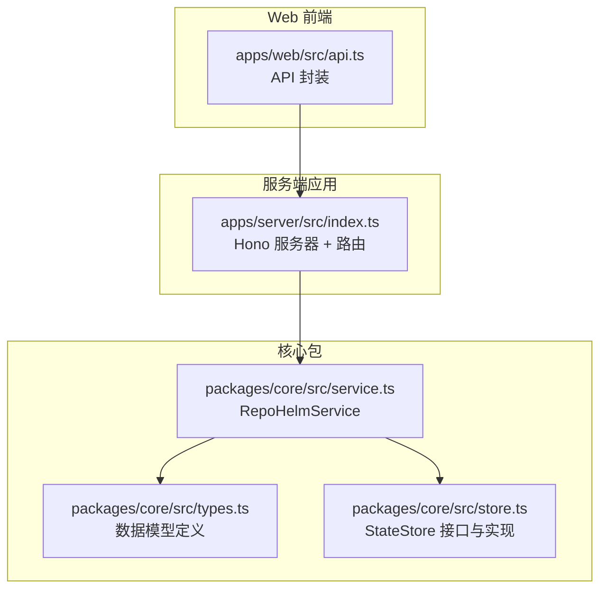
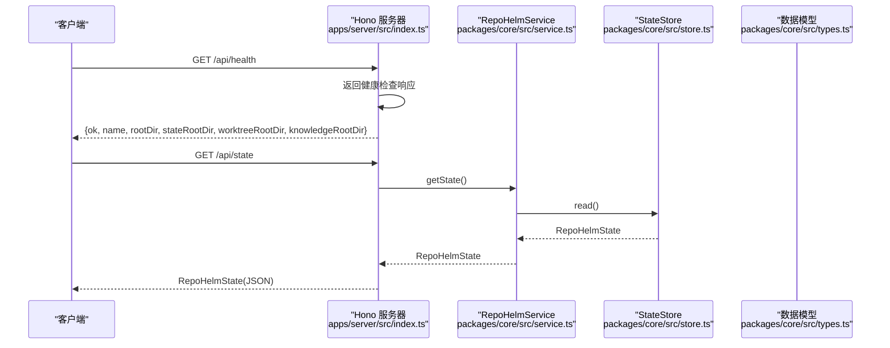
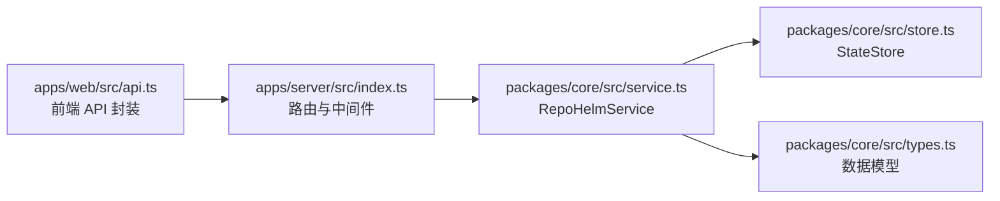

# 健康检查和状态查询 API

<cite>
**本文档引用的文件**
- [apps/server/src/index.ts](file://apps/server/src/index.ts)
- [packages/core/src/service.ts](file://packages/core/src/service.ts)
- [packages/core/src/types.ts](file://packages/core/src/types.ts)
- [packages/core/src/store.ts](file://packages/core/src/store.ts)
- [apps/web/src/api.ts](file://apps/web/src/api.ts)
- [README.md](file://README.md)
- [package.json](file://package.json)
</cite>

## 目录
1. [简介](#简介)
2. [项目结构](#项目结构)
3. [核心组件](#核心组件)
4. [架构总览](#架构总览)
5. [详细组件分析](#详细组件分析)
6. [依赖关系分析](#依赖关系分析)
7. [性能考量](#性能考量)
8. [故障排除指南](#故障排除指南)
9. [结论](#结论)

## 简介
本文件聚焦于 RepoHelm 的两个关键 API 端点：
- /api/health：系统健康检查，返回服务状态与根目录信息，便于快速判断服务可用性与配置位置。
- /api/state：完整系统状态查询，返回工作区、项目、Quest、事件、知识库、能力、安全策略、审计日志、引擎配置等全量状态，用于监控、调试与集成。

这两个端点在系统运维、前端调试、CI/CD 集成以及问题定位中扮演重要角色。

## 项目结构
RepoHelm 采用多包（monorepo）结构，健康检查与状态查询 API 位于服务端应用中，核心业务逻辑与状态持久化位于核心包中，Web 前端通过统一的 API 封装调用这些端点。



图表来源
- [apps/server/src/index.ts:114-128](file://apps/server/src/index.ts#L114-L128)
- [packages/core/src/service.ts:135-137](file://packages/core/src/service.ts#L135-L137)
- [packages/core/src/store.ts:86-89](file://packages/core/src/store.ts#L86-L89)
- [apps/web/src/api.ts:291-292](file://apps/web/src/api.ts#L291-L292)

章节来源
- [apps/server/src/index.ts:114-128](file://apps/server/src/index.ts#L114-L128)
- [packages/core/src/service.ts:135-137](file://packages/core/src/service.ts#L135-L137)
- [packages/core/src/store.ts:86-89](file://packages/core/src/store.ts#L86-L89)
- [apps/web/src/api.ts:291-292](file://apps/web/src/api.ts#L291-L292)

## 核心组件
- 服务端路由与中间件：Hono 服务器，提供 CORS、日志、错误处理与 /api/health、/api/state 等路由。
- RepoHelmService：核心业务服务，负责状态读取、引擎配置、项目健康检查、Quest 生命周期等。
- StateStore：状态存储抽象，支持 JSON 与 SQLite 两种实现，负责状态的读写与迁移。
- 数据模型：定义 Workspace、Project、Quest、Worktree、Knowledge、SecurityPolicy、AuditLog、EngineConfig 等结构。

章节来源
- [apps/server/src/index.ts:39-49](file://apps/server/src/index.ts#L39-L49)
- [packages/core/src/service.ts:56-71](file://packages/core/src/service.ts#L56-L71)
- [packages/core/src/store.ts:86-89](file://packages/core/src/store.ts#L86-L89)
- [packages/core/src/types.ts:279-290](file://packages/core/src/types.ts#L279-L290)

## 架构总览
下面的序列图展示了 /api/health 与 /api/state 的调用链路与数据流向。



图表来源
- [apps/server/src/index.ts:114-128](file://apps/server/src/index.ts#L114-L128)
- [packages/core/src/service.ts:135-137](file://packages/core/src/service.ts#L135-L137)
- [packages/core/src/store.ts:98-114](file://packages/core/src/store.ts#L98-L114)

## 详细组件分析

### /api/health 健康检查端点
- 功能：返回服务可用性与关键目录配置信息，便于快速诊断服务状态与部署路径。
- 路由：GET /api/health
- 响应字段
  - ok: 布尔值，表示服务可用
  - name: 服务名称
  - rootDir: 应用根目录
  - stateRootDir: 状态存储根目录
  - worktreeRootDir: 工作树根目录
  - knowledgeRootDir: 知识库根目录
- 典型用途
  - 健康探针：Kubernetes、Docker Compose、CI/CD 管道
  - 部署验证：确认服务监听端口与目录解析正确
  - 调试：快速确认环境变量与路径配置

请求示例
- GET http://localhost:4300/api/health

响应示例
- 200 OK
  - {
      "ok": true,
      "name": "RepoHelm API",
      "rootDir": "/absolute/path/to/root",
      "stateRootDir": "/absolute/path/to/state",
      "worktreeRootDir": "/absolute/path/to/worktrees",
      "knowledgeRootDir": "/absolute/path/to/knowledge"
    }

章节来源
- [apps/server/src/index.ts:114-123](file://apps/server/src/index.ts#L114-L123)

### /api/state 系统状态查询端点
- 功能：返回完整系统状态，包含工作区、项目、Quest、事件、知识库、能力、安全策略、审计日志、引擎配置等。
- 路由：GET /api/state
- 响应结构（RepoHelmState）
  - workspaces: Workspace[]
  - projects: Project[]
  - quests: Quest[]
  - events: AgentEvent[]
  - knowledge: KnowledgeItem[]
  - capabilities: CapabilityDefinition[]
  - securityPolicy: SecurityPolicy
  - auditLog: AuditLogEntry[]
  - engine: EngineConfig
  - modelCache: Record<string, ModelCacheEntry>
- 典型用途
  - 监控：前端或外部系统定期拉取全量状态进行可视化
  - 调试：定位 Quest 生命周期、Worktree 状态、项目健康度、安全策略与审计日志
  - 集成：CI/CD 或自动化工具基于状态驱动后续动作

请求示例
- GET http://localhost:4300/api/state

响应示例
- 200 OK
  - {
      "workspaces": [...],
      "projects": [...],
      "quests": [...],
      "events": [...],
      "knowledge": [...],
      "capabilities": [...],
      "securityPolicy": {...},
      "auditLog": [...],
      "engine": {...},
      "modelCache": {...}
    }

章节来源
- [apps/server/src/index.ts:125-128](file://apps/server/src/index.ts#L125-L128)
- [packages/core/src/service.ts:135-137](file://packages/core/src/service.ts#L135-L137)
- [packages/core/src/types.ts:279-290](file://packages/core/src/types.ts#L279-L290)

### 数据模型与字段含义
以下为关键数据模型的简要说明，帮助理解 /api/state 返回内容的结构与含义。

```mermaid
erDiagram
WORKSPACE {
string id PK
string name
string description
string[] projectIds
WST[] worktrees
string worktreeRoot
string createdAt
string updatedAt
}
PROJECT {
string id PK
string name
string path
enum role
string defaultBranch
string validationCommand
PH health
string createdAt
string updatedAt
}
QUEST {
string id PK
string workspaceId
string title
string requirement
enum status
QS spec
enum agentBackendId
string[] affectedProjectIds
WTS[] worktrees
CF[] changedFiles
string[] validationResults
string[] reviewNotes
DS[] deliveryResults
CR[] capabilityRecommendations
string createdAt
string updatedAt
}
KNOWLEDGE {
string id PK
string workspaceId
string? projectId
string? questId
enum type
string title
string body
string[] tags
string? sourcePath
string createdAt
string updatedAt
}
CAPABILITY {
string id PK
enum kind
string name
string description
enum source
string[] permissions
boolean installed
string[] tags
string createdAt
string updatedAt
}
SECURITY_POLICY {
enum commandApprovalMode
string[] allowedCommands
string[] fileScopes
string[] networkScopes
enum secretsPolicy
enum sandboxRuntime
string updatedAt
}
AUDIT_LOG {
string id PK
enum type
enum decision
string subject
string detail
string createdAt
}
ENGINE_CONFIG {
enum mode
string cliId
map cliModels
map byokProviders
string activeByokProviderId
string updatedAt
}
WORKSPACE ||--o{ PROJECT : "links"
WORKSPACE ||--o{ QUEST : "contains"
WORKSPACE ||--o{ KNOWLEDGE : "produces"
PROJECT ||--o{ KNOWLEDGE : "produces"
QUEST ||--o{ KNOWLEDGE : "produces"
QUEST ||--o{ WORKTREE : "creates"
QUEST ||--o{ DELIVERY_RESULT : "produces"
CAPABILITY ||--o{ QUEST : "recommended"
```

图表来源
- [packages/core/src/types.ts:36-45](file://packages/core/src/types.ts#L36-L45)
- [packages/core/src/types.ts:47-57](file://packages/core/src/types.ts#L47-L57)
- [packages/core/src/types.ts:173-191](file://packages/core/src/types.ts#L173-L191)
- [packages/core/src/types.ts:193-205](file://packages/core/src/types.ts#L193-L205)
- [packages/core/src/types.ts:113-133](file://packages/core/src/types.ts#L113-L133)
- [packages/core/src/types.ts:135-143](file://packages/core/src/types.ts#L135-L143)
- [packages/core/src/types.ts:145-152](file://packages/core/src/types.ts#L145-L152)
- [packages/core/src/types.ts:262-269](file://packages/core/src/types.ts#L262-L269)

章节来源
- [packages/core/src/types.ts:36-45](file://packages/core/src/types.ts#L36-L45)
- [packages/core/src/types.ts:47-57](file://packages/core/src/types.ts#L47-L57)
- [packages/core/src/types.ts:173-191](file://packages/core/src/types.ts#L173-L191)
- [packages/core/src/types.ts:193-205](file://packages/core/src/types.ts#L193-L205)
- [packages/core/src/types.ts:113-133](file://packages/core/src/types.ts#L113-L133)
- [packages/core/src/types.ts:135-143](file://packages/core/src/types.ts#L135-L143)
- [packages/core/src/types.ts:145-152](file://packages/core/src/types.ts#L145-L152)
- [packages/core/src/types.ts:262-269](file://packages/core/src/types.ts#L262-L269)

### 端点在监控与调试中的作用
- /api/health
  - 作为健康探针，可用于容器编排平台的存活/就绪探测，快速发现服务异常。
  - 用于启动脚本或 CI 步骤，确保 API 服务已启动并能正确解析根目录。
- /api/state
  - 作为前端仪表盘的数据源，实时展示工作区、项目、Quest、Worktree 等状态。
  - 用于调试：结合审计日志与安全策略，排查命令执行、文件访问、网络访问等权限问题。
  - 用于集成：外部系统可定时拉取状态，驱动自动化流程（如清理、重试、交付）。

章节来源
- [apps/server/src/index.ts:114-128](file://apps/server/src/index.ts#L114-L128)
- [apps/web/src/api.ts:291-292](file://apps/web/src/api.ts#L291-L292)

## 依赖关系分析
- 服务端路由依赖 RepoHelmService 获取状态。
- RepoHelmService 依赖 StateStore 读取持久化状态。
- 数据模型定义贯穿服务层与前端 API 封装，保证前后端一致的契约。



图表来源
- [apps/server/src/index.ts:39-49](file://apps/server/src/index.ts#L39-L49)
- [packages/core/src/service.ts:56-71](file://packages/core/src/service.ts#L56-L71)
- [packages/core/src/store.ts:86-89](file://packages/core/src/store.ts#L86-L89)
- [apps/web/src/api.ts:291-292](file://apps/web/src/api.ts#L291-L292)

章节来源
- [apps/server/src/index.ts:39-49](file://apps/server/src/index.ts#L39-L49)
- [packages/core/src/service.ts:56-71](file://packages/core/src/service.ts#L56-L71)
- [packages/core/src/store.ts:86-89](file://packages/core/src/store.ts#L86-L89)
- [apps/web/src/api.ts:291-292](file://apps/web/src/api.ts#L291-L292)

## 性能考量
- /api/health：纯内存计算，响应极快，适合高频探针。
- /api/state：涉及状态读取与序列化，建议：
  - 控制调用频率，避免对 SQLite 存储造成压力。
  - 前端可采用缓存策略，仅在状态变更时刷新。
  - 对外暴露的监控系统可采用增量拉取或订阅机制（如未来扩展）。

## 故障排除指南
- /api/health 返回 500
  - 检查服务启动日志，确认端口占用与 CORS 配置。
  - 确认环境变量 REPOHELM_ROOT、REPOHELM_STATE_ROOT、REPOHELM_WORKTREE_ROOT、REPOHELM_KNOWLEDGE_ROOT 是否正确。
- /api/state 返回 500
  - 检查状态存储文件（.repohelm/state.sqlite 或 state.json）是否存在且可读。
  - 若为 SQLite 迁移问题，确认数据库初始化与表结构创建是否成功。
- 健康探针失败
  - 使用 curl 或浏览器直接访问 /api/health，确认返回字段中的目录路径是否符合预期。
- 状态不一致或为空
  - 通过 /api/state 检查 securityPolicy、engine、modelCache 等字段是否正常。
  - 如需重置状态，可清理状态文件后重启服务，服务会自动初始化默认状态。

章节来源
- [apps/server/src/index.ts:353-361](file://apps/server/src/index.ts#L353-L361)
- [packages/core/src/store.ts:98-114](file://packages/core/src/store.ts#L98-L114)
- [packages/core/src/store.ts:125-139](file://packages/core/src/store.ts#L125-L139)

## 结论
/api/health 与 /api/state 是 RepoHelm 的两个关键端点：前者用于快速健康检查与部署验证，后者用于提供全量系统状态以便监控、调试与集成。通过清晰的路由、健壮的状态存储与一致的数据模型，这两个端点为系统的可观测性与可维护性提供了坚实基础。