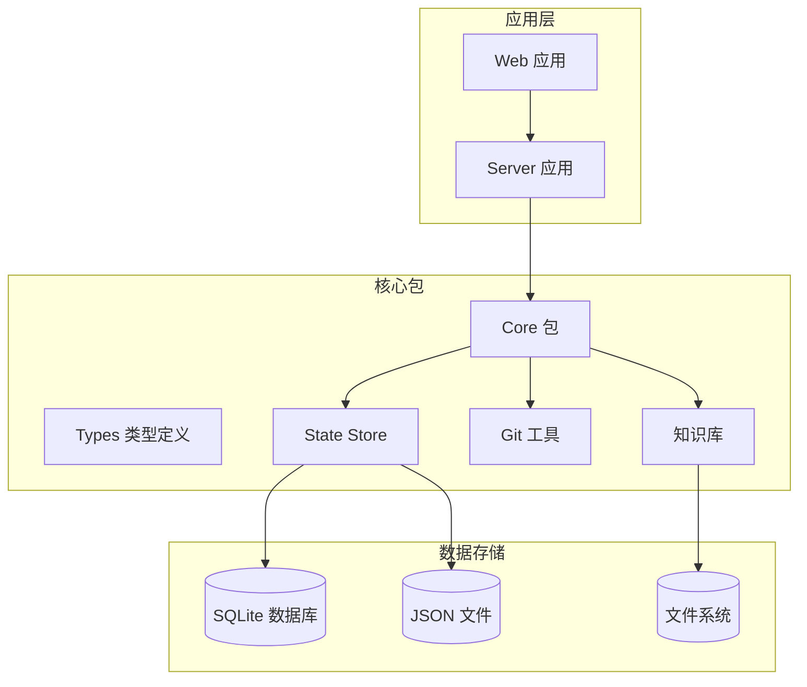
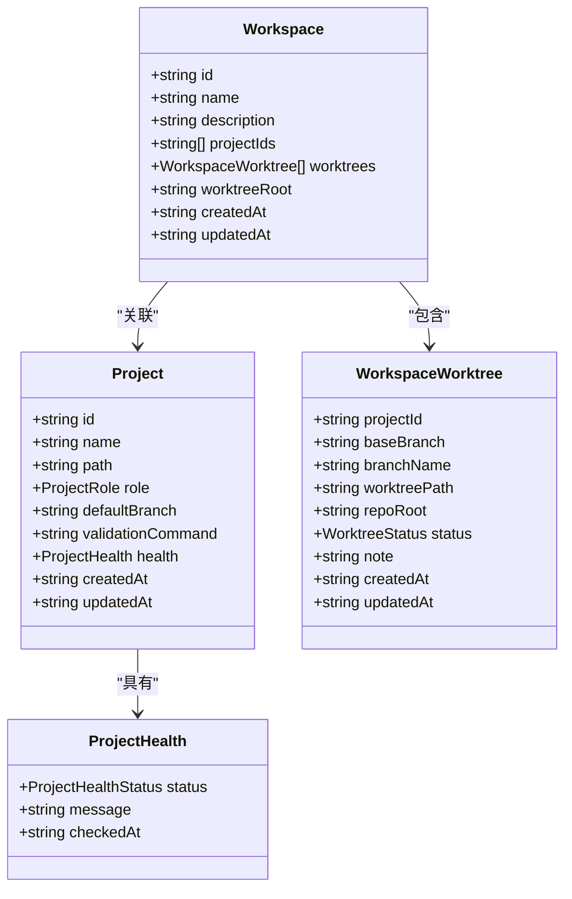
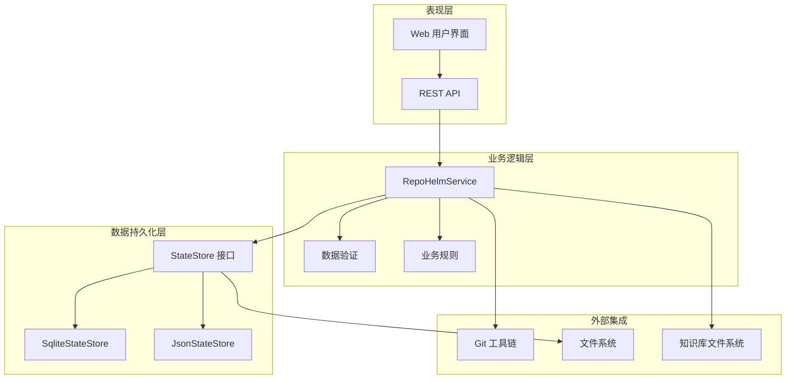
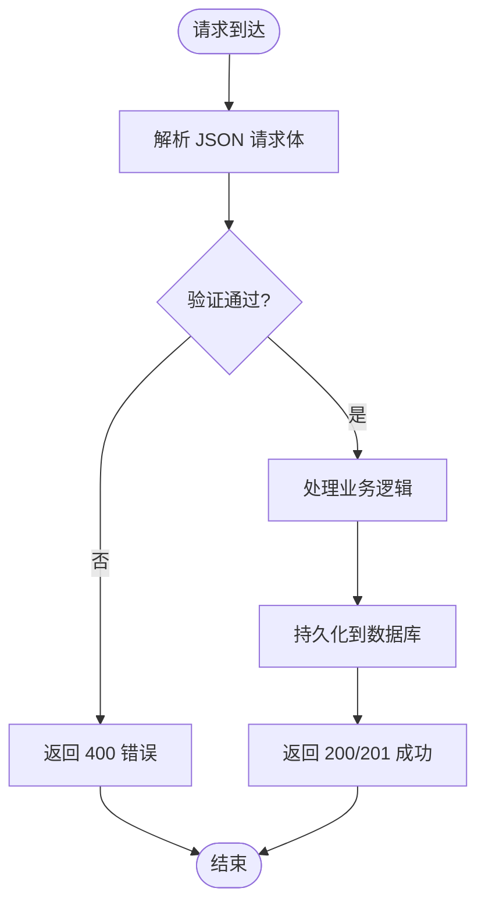
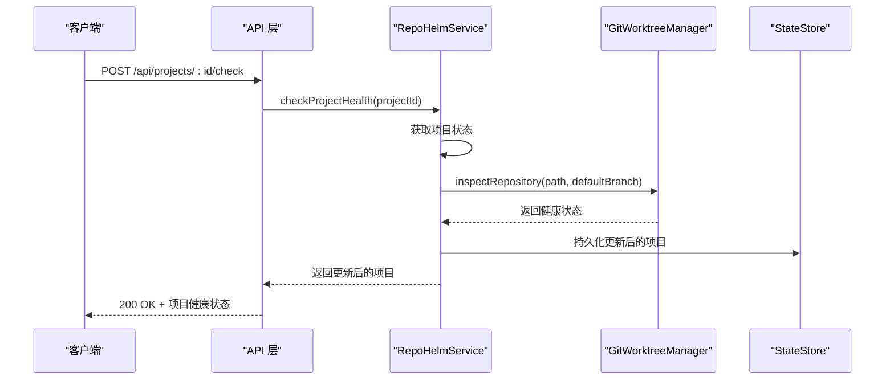
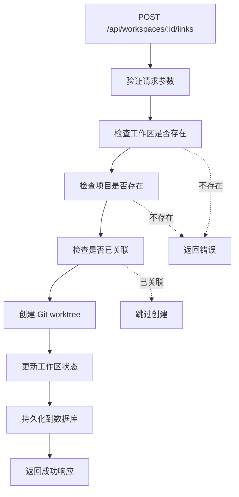
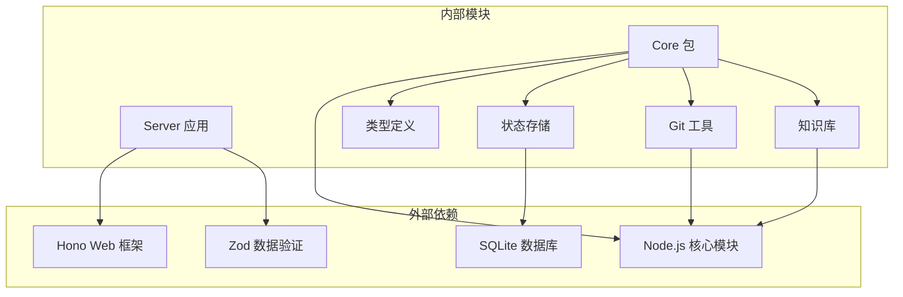
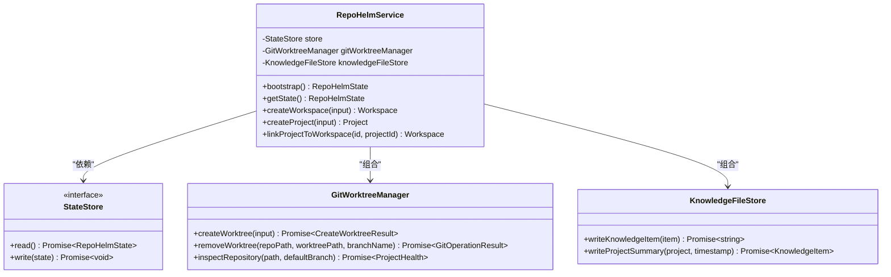

# 工作区和项目管理 API

<cite>
**本文档引用的文件**
- [apps/server/src/index.ts](file://apps/server/src/index.ts)
- [packages/core/src/service.ts](file://packages/core/src/service.ts)
- [packages/core/src/types.ts](file://packages/core/src/types.ts)
- [packages/core/src/store.ts](file://packages/core/src/store.ts)
- [packages/core/src/git.ts](file://packages/core/src/git.ts)
- [packages/core/src/knowledge.ts](file://packages/core/src/knowledge.ts)
- [README.md](file://README.md)
</cite>

## 目录
1. [简介](#简介)
2. [项目结构](#项目结构)
3. [核心组件](#核心组件)
4. [架构概览](#架构概览)
5. [详细组件分析](#详细组件分析)
6. [依赖关系分析](#依赖关系分析)
7. [性能考虑](#性能考虑)
8. [故障排除指南](#故障排除指南)
9. [结论](#结论)

## 简介

RepoHelm 是一个开源的 Quest 工作区原型，专注于验证"虚拟 workspace + 多项目 Quest + Spec 驱动 + worktree 隔离 + Agent 编排 + 知识库"的产品方向。本文档详细说明了工作区和项目管理相关的 API 端点，包括工作区管理、项目管理、项目链接、健康检查、工作树管理和知识库搜索等功能。

RepoHelm 当前版本是 MVP 骨架，已经实现了基础的 workspace 管理、项目关联、Git worktree 隔离、知识库搜索等核心功能。

## 项目结构

RepoHelm 采用模块化的项目结构，主要包含以下核心模块：

**图表来源**
- [apps/server/src/index.ts:1-366](file://apps/server/src/index.ts#L1-L366)
- [packages/core/src/service.ts:1-800](file://packages/core/src/service.ts#L1-L800)

**章节来源**
- [README.md:1-100](file://README.md#L1-L100)

## 核心组件

RepoHelm 的核心组件围绕 RepoHelmService 构建，该服务提供了所有工作区和项目管理功能：

### 主要组件职责

- **RepoHelmService**: 核心业务逻辑服务，负责工作区、项目、知识库等管理
- **SqliteStateStore**: 状态持久化存储，使用 SQLite 数据库存储结构化状态
- **GitWorktreeManager**: Git 工作树管理，处理 Git worktree 的创建、删除和状态检查
- **KnowledgeFileStore**: 知识库文件存储，将知识内容写入文件系统

### 数据模型

系统使用强类型的数据模型来确保数据完整性：

**图表来源**
- [packages/core/src/types.ts:36-57](file://packages/core/src/types.ts#L36-L57)
- [packages/core/src/types.ts:24-34](file://packages/core/src/types.ts#L24-L34)
- [packages/core/src/types.ts:18-22](file://packages/core/src/types.ts#L18-L22)

**章节来源**
- [packages/core/src/types.ts:1-334](file://packages/core/src/types.ts#L1-L334)

## 架构概览

RepoHelm 采用分层架构设计，清晰分离了表现层、业务逻辑层和数据持久化层：

**图表来源**
- [apps/server/src/index.ts:37-366](file://apps/server/src/index.ts#L37-L366)
- [packages/core/src/service.ts:56-71](file://packages/core/src/service.ts#L56-L71)
- [packages/core/src/store.ts:86-166](file://packages/core/src/store.ts#L86-L166)

## 详细组件分析

### 工作区管理 API

工作区管理 API 提供了完整的 CRUD 操作，支持工作区的创建、查询、更新和删除。

#### 端点定义

| 端点 | 方法 | 描述 | 请求体 | 响应 |
|------|------|------|--------|------|
| `/api/workspaces` | POST | 创建新工作区 | WorkspaceCreateInput | Workspace |
| `/api/workspaces` | GET | 获取所有工作区 | 无 | Workspace[] |
| `/api/workspaces/:id` | PATCH | 更新工作区 | WorkspaceUpdateInput | Workspace |
| `/api/workspaces/:id` | DELETE | 删除工作区 | 无 | RepoHelmState |

#### 请求参数验证

工作区 API 使用 Zod 模式进行严格验证：

**图表来源**
- [apps/server/src/index.ts:51-57](file://apps/server/src/index.ts#L51-L57)

#### 业务逻辑实现

工作区的创建和更新遵循以下流程：

1. **创建工作区**: 生成唯一 ID，设置时间戳，初始化空的项目列表和工作树列表
2. **更新工作区**: 支持部分字段更新，保持其他字段不变
3. **删除工作区**: 级联删除关联的项目和工作树

**章节来源**
- [apps/server/src/index.ts:225-235](file://apps/server/src/index.ts#L225-L235)
- [packages/core/src/service.ts:143-177](file://packages/core/src/service.ts#L143-L177)

### 项目管理 API

项目管理 API 提供了项目注册、查询、更新和删除功能，支持多项目工作区管理。

#### 端点定义

| 端点 | 方法 | 描述 | 请求体 | 响应 |
|------|------|------|--------|------|
| `/api/projects` | POST | 创建新项目 | ProjectCreateInput | Project |
| `/api/projects` | GET | 获取所有项目 | 无 | Project[] |
| `/api/projects/:id` | PATCH | 更新项目 | ProjectUpdateInput | Project |
| `/api/projects/:id` | DELETE | 删除项目 | 无 | RepoHelmState |
| `/api/projects/:id/check` | POST | 检查项目健康状态 | 无 | Project |

#### 项目健康检查

项目健康检查通过 Git 工具链进行实时检查：

**图表来源**
- [apps/server/src/index.ts:268-271](file://apps/server/src/index.ts#L268-L271)
- [packages/core/src/service.ts:457-476](file://packages/core/src/service.ts#L457-L476)

**章节来源**
- [apps/server/src/index.ts:237-266](file://apps/server/src/index.ts#L237-L266)
- [packages/core/src/service.ts:179-231](file://packages/core/src/service.ts#L179-L231)

### 项目链接管理 API

项目链接 API 允许将项目关联到工作区，创建 Git worktree 隔离环境。

#### 端点定义

| 端点 | 方法 | 描述 | 请求体 | 响应 |
|------|------|------|--------|------|
| `/api/workspaces/:id/links` | POST | 将项目关联到工作区 | LinkProjectInput | Workspace |
| `/api/workspaces/:id/links/:projectId` | DELETE | 从工作区取消项目关联 | 无 | Workspace |

#### 关联流程

项目关联涉及复杂的 Git 操作和状态管理：

**图表来源**
- [apps/server/src/index.ts:243-255](file://apps/server/src/index.ts#L243-L255)
- [packages/core/src/service.ts:233-280](file://packages/core/src/service.ts#L233-L280)

**章节来源**
- [packages/core/src/service.ts:282-303](file://packages/core/src/service.ts#L282-L303)

### 工作树管理 API

工作树管理 API 提供了工作树列表查询和清理功能。

#### 端点定义

| 端点 | 方法 | 描述 | 查询参数 | 响应 |
|------|------|------|----------|------|
| `/api/worktrees` | GET | 获取工作树列表 | workspaceId | WorktreeState[] |

#### 工作树状态管理

工作树状态包括多种状态类型：

- `not_created`: 未创建
- `planned`: 已计划
- `created`: 已创建
- `failed`: 创建失败
- `cleaned`: 已清理

**章节来源**
- [apps/server/src/index.ts:220-223](file://apps/server/src/index.ts#L220-L223)
- [packages/core/src/service.ts:700-711](file://packages/core/src/service.ts#L700-L711)

### 知识库搜索 API

知识库搜索 API 提供了基于全文的搜索功能，支持按标题、内容和标签搜索。

#### 端点定义

| 端点 | 方法 | 描述 | 查询参数 | 响应 |
|------|------|------|----------|------|
| `/api/workspaces/:id/knowledge` | GET | 搜索工作区知识 | q: 搜索关键词 | KnowledgeItem[] |

#### 搜索算法

知识库搜索采用简单的全文检索算法：

1. **查询预处理**: 将查询字符串转换为小写并分割为空格
2. **过滤条件**: 仅搜索指定工作区的知识项
3. **匹配逻辑**: 检查标题、正文和标签中是否包含查询词
4. **排序规则**: 按更新时间降序排列

**章节来源**
- [apps/server/src/index.ts:215-218](file://apps/server/src/index.ts#L215-L218)
- [packages/core/src/service.ts:883-886](file://packages/core/src/service.ts#L883-L886)
- [packages/core/src/service.ts:1061-1076](file://packages/core/src/service.ts#L1061-L1076)

## 依赖关系分析

RepoHelm 的依赖关系体现了清晰的分层架构：

**图表来源**
- [apps/server/src/index.ts:1-11](file://apps/server/src/index.ts#L1-L11)
- [packages/core/src/service.ts:1-8](file://packages/core/src/service.ts#L1-L8)

### 核心依赖注入

RepoHelm 使用依赖注入模式管理组件间的依赖关系：

**图表来源**
- [packages/core/src/service.ts:56-71](file://packages/core/src/service.ts#L56-L71)
- [packages/core/src/store.ts:86-89](file://packages/core/src/store.ts#L86-L89)

**章节来源**
- [packages/core/src/service.ts:1-800](file://packages/core/src/service.ts#L1-L800)

## 性能考虑

RepoHelm 在设计时考虑了多个性能优化方面：

### 数据存储优化

- **SQLite 存储**: 使用 SQLite 作为主要数据存储，提供更好的并发性能和数据一致性
- **状态缓存**: 通过内存中的状态对象减少重复的磁盘 I/O 操作
- **增量更新**: 仅更新发生变化的数据，避免全量重写

### Git 操作优化

- **异步操作**: 所有的 Git 操作都使用异步方式执行，避免阻塞主线程
- **错误处理**: 对 Git 操作进行适当的错误处理和超时控制
- **资源清理**: 及时清理临时文件和不再使用的 Git 对象

### API 性能特性

- **CORS 配置**: 正确配置跨域资源共享，避免不必要的预检请求
- **请求验证**: 使用 Zod 进行快速的请求体验证，提前发现无效请求
- **响应优化**: 合理设置 HTTP 状态码和响应头

## 故障排除指南

### 常见错误和解决方案

#### 工作区相关错误

| 错误类型 | 错误码 | 描述 | 解决方案 |
|----------|--------|------|----------|
| 工作区不存在 | 404 | 指定 ID 的工作区不存在 | 检查工作区 ID 是否正确 |
| 项目不存在 | 404 | 指定 ID 的项目不存在 | 确保项目已创建 |
| Git 操作失败 | 500 | Git 工作树创建/删除失败 | 检查 Git 配置和权限 |

#### 数据验证错误

当请求体不符合 Zod 模式时，API 会返回 400 错误：

- **必填字段缺失**: 确保所有必需字段都已提供
- **数据类型错误**: 检查字段的数据类型是否正确
- **值范围限制**: 验证字符串长度和其他约束条件

#### 状态存储错误

- **数据库连接失败**: 检查 SQLite 数据库文件权限
- **文件系统权限**: 确保有足够的权限访问知识库目录
- **磁盘空间不足**: 检查磁盘空间是否充足

**章节来源**
- [apps/server/src/index.ts:353-361](file://apps/server/src/index.ts#L353-L361)

## 结论

RepoHelm 的工作区和项目管理 API 提供了完整的多项目协作基础设施。通过 Git worktree 隔离、知识库搜索和安全策略控制，系统能够支持复杂的软件开发流程。

### 主要优势

1. **模块化设计**: 清晰的分层架构便于维护和扩展
2. **强类型支持**: TypeScript 提供编译时类型检查
3. **数据持久化**: SQLite 存储提供可靠的状态管理
4. **Git 集成**: 深度集成 Git 工具链，支持真实的工作流
5. **安全控制**: 内置的安全策略和审计日志

### 未来发展方向

- **性能优化**: 进一步优化大规模项目场景下的性能
- **扩展性增强**: 支持更多的外部工具和集成
- **用户体验改进**: 提供更丰富的 Web 界面和交互
- **监控和诊断**: 增强系统的可观测性和调试能力

RepoHelm 作为 MVP 骨架，已经展示了其核心价值和可行性，为后续的完整产品化奠定了坚实基础。