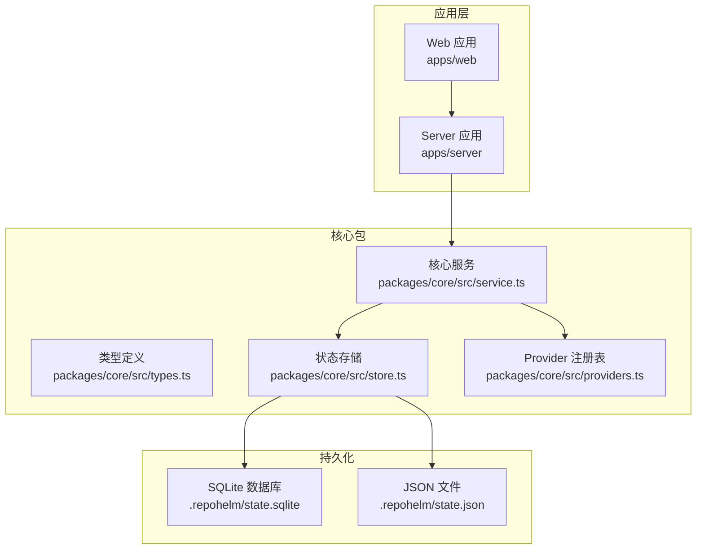
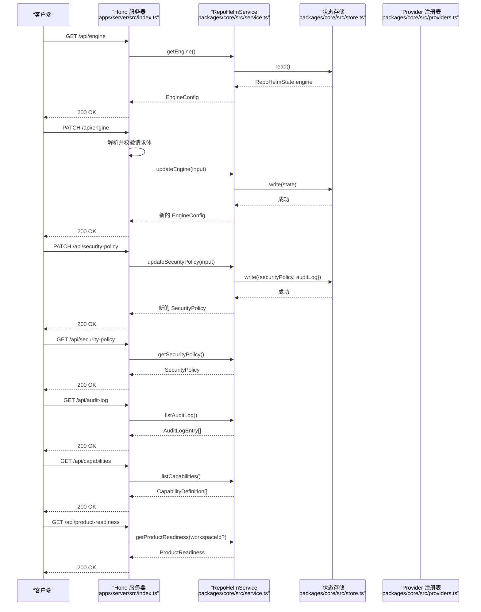
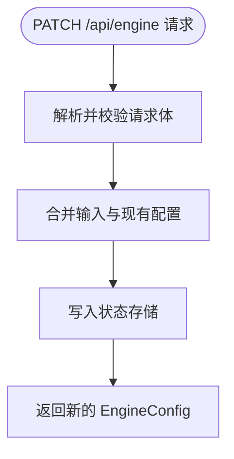
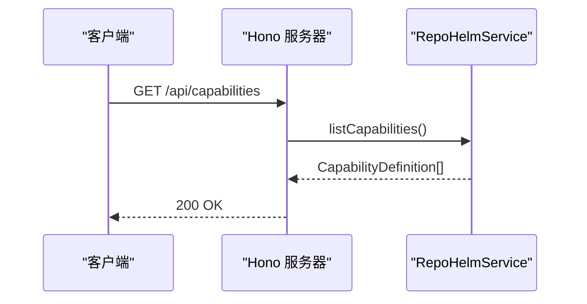
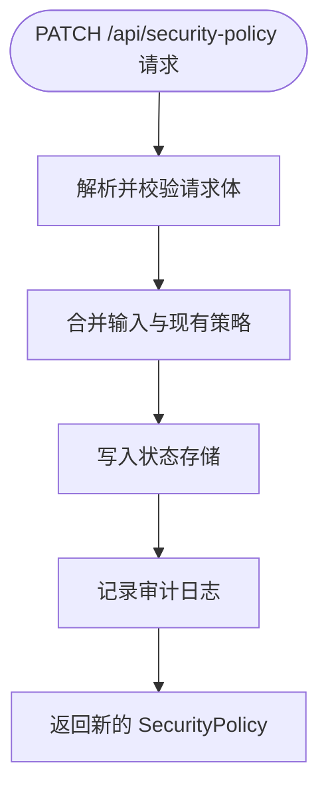
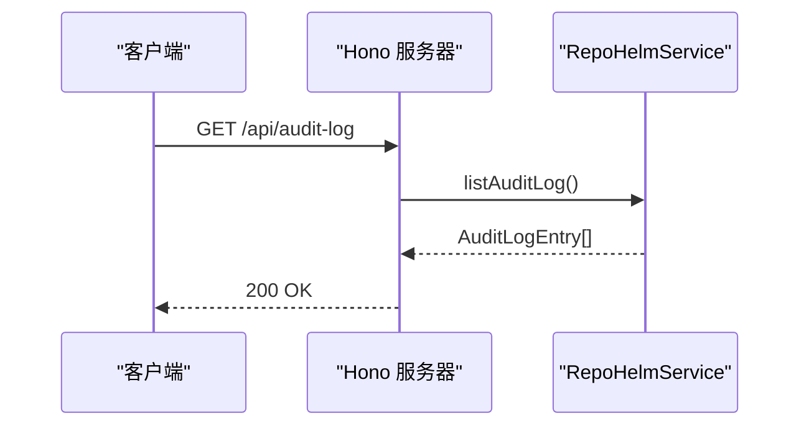
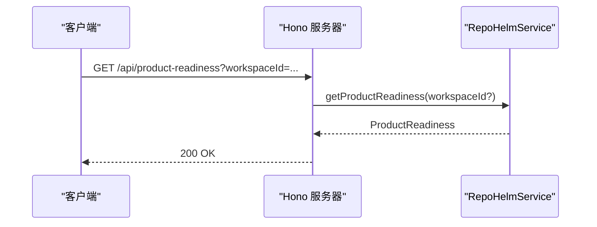
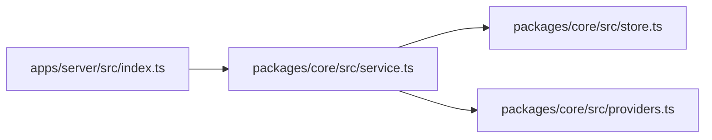

# 引擎配置和安全策略 API

<cite>
**本文档引用的文件**
- [apps/server/src/index.ts](file://apps/server/src/index.ts)
- [packages/core/src/service.ts](file://packages/core/src/service.ts)
- [packages/core/src/types.ts](file://packages/core/src/types.ts)
- [packages/core/src/store.ts](file://packages/core/src/store.ts)
- [packages/core/src/providers.ts](file://packages/core/src/providers.ts)
- [README.md](file://README.md)
</cite>

## 目录
1. [简介](#简介)
2. [项目结构](#项目结构)
3. [核心组件](#核心组件)
4. [架构总览](#架构总览)
5. [详细组件分析](#详细组件分析)
6. [依赖关系分析](#依赖关系分析)
7. [性能考量](#性能考量)
8. [故障排查指南](#故障排查指南)
9. [结论](#结论)
10. [附录](#附录)

## 简介
本文件面向 RepoHelm 引擎配置与安全策略 API 的使用者与维护者，系统性说明以下端点与功能：
- /api/engine：获取与更新引擎配置（CLI 模式、Provider 配置等）
- /api/capabilities：获取系统能力列表
- /api/security-policy：获取与更新安全策略（命令审批模式、文件/网络作用域、密钥策略、沙箱运行时）
- /api/audit-log：获取审计日志
- /api/product-readiness：获取产品就绪度评估

同时，文档解释各配置项的作用与影响，提供安全最佳实践、配置示例、策略变更影响分析与回滚方法。

## 项目结构
RepoHelm 采用前后端分离的多包结构，服务端基于 Hono 提供 REST API，核心业务逻辑位于 packages/core，状态持久化采用 SQLite 或 JSON 文件。

图表来源
- [apps/server/src/index.ts:39-366](file://apps/server/src/index.ts#L39-L366)
- [packages/core/src/service.ts:56-71](file://packages/core/src/service.ts#L56-L71)
- [packages/core/src/store.ts:91-165](file://packages/core/src/store.ts#L91-L165)

章节来源
- [apps/server/src/index.ts:39-366](file://apps/server/src/index.ts#L39-L366)
- [packages/core/src/service.ts:56-71](file://packages/core/src/service.ts#L56-L71)
- [packages/core/src/store.ts:91-165](file://packages/core/src/store.ts#L91-L165)

## 核心组件
- 服务器路由与校验：apps/server/src/index.ts 定义所有 API 路由、参数校验（Zod）与 CORS。
- 核心服务：packages/core/src/service.ts 提供引擎配置、安全策略、审计日志、产品就绪度等业务逻辑。
- 类型与状态：packages/core/src/types.ts 定义 EngineConfig、SecurityPolicy、AuditLogEntry 等数据结构；packages/core/src/store.ts 提供默认配置与状态持久化。
- Provider 注册表：packages/core/src/providers.ts 提供模型列表拉取与探测能力，支撑 BYOK Provider 配置。

章节来源
- [apps/server/src/index.ts:73-104](file://apps/server/src/index.ts#L73-L104)
- [packages/core/src/service.ts:359-389](file://packages/core/src/service.ts#L359-L389)
- [packages/core/src/service.ts:892-919](file://packages/core/src/service.ts#L892-L919)
- [packages/core/src/service.ts:1257-1289](file://packages/core/src/service.ts#L1257-L1289)
- [packages/core/src/types.ts:135-152](file://packages/core/src/types.ts#L135-L152)
- [packages/core/src/store.ts:6-25](file://packages/core/src/store.ts#L6-L25)
- [packages/core/src/providers.ts:163-303](file://packages/core/src/providers.ts#L163-L303)

## 架构总览
下图展示了 API 到核心服务与状态存储的调用链路，以及安全策略在执行流程中的决策点。

图表来源
- [apps/server/src/index.ts:178-213](file://apps/server/src/index.ts#L178-L213)
- [packages/core/src/service.ts:359-389](file://packages/core/src/service.ts#L359-L389)
- [packages/core/src/service.ts:892-919](file://packages/core/src/service.ts#L892-L919)
- [packages/core/src/service.ts:916-919](file://packages/core/src/service.ts#L916-L919)
- [packages/core/src/service.ts:888-891](file://packages/core/src/service.ts#L888-L891)
- [packages/core/src/service.ts:921-1024](file://packages/core/src/service.ts#L921-L1024)

## 详细组件分析

### /api/engine：引擎配置
- 功能概述
  - GET /api/engine：返回当前引擎配置（mode、cliId、cliModels、byokProviders、activeByokProviderId、updatedAt）。
  - PATCH /api/engine：更新引擎配置，支持增量更新（mode、cliId、cliModels、byokProviders、activeByokProviderId）。
- 关键实现
  - GET：service.getEngine() 直接读取 state.engine。
  - PATCH：service.updateEngine() 合并输入与现有配置，写入状态存储。
- 参数与类型
  - 输入类型 UpdateEngineInput（可选字段）。
  - 输出类型 EngineConfig。
- 影响与注意事项
  - 更新 BYOK Provider 时，会合并新配置与现有配置，避免覆盖。
  - 更新后会记录 updatedAt，便于审计与追踪。
- 配置示例（路径引用）
  - 引擎默认配置：[packages/core/src/store.ts:27-34](file://packages/core/src/store.ts#L27-L34)
  - 引擎类型定义：[packages/core/src/types.ts:262-277](file://packages/core/src/types.ts#L262-L277)
  - 引擎更新逻辑：[packages/core/src/service.ts:364-389](file://packages/core/src/service.ts#L364-L389)

图表来源
- [apps/server/src/index.ts:183-187](file://apps/server/src/index.ts#L183-L187)
- [packages/core/src/service.ts:364-389](file://packages/core/src/service.ts#L364-L389)

章节来源
- [apps/server/src/index.ts:178-187](file://apps/server/src/index.ts#L178-L187)
- [packages/core/src/service.ts:359-389](file://packages/core/src/service.ts#L359-L389)
- [packages/core/src/types.ts:262-277](file://packages/core/src/types.ts#L262-L277)
- [packages/core/src/store.ts:27-34](file://packages/core/src/store.ts#L27-L34)

### /api/capabilities：系统能力列表
- 功能概述
  - GET /api/capabilities：返回系统能力清单（含 kind、name、description、permissions、tags 等）。
- 关键实现
  - service.listCapabilities() 直接返回 state.capabilities。
- 影响与注意事项
  - 能力清单用于 Quest 工作流中的能力推荐与人工确认。
- 配置示例（路径引用）
  - 能力类型定义：[packages/core/src/types.ts:113-133](file://packages/core/src/types.ts#L113-L133)
  - 能力种子数据生成：[packages/core/src/service.ts:1192-1249](file://packages/core/src/service.ts#L1192-L1249)

图表来源
- [apps/server/src/index.ts:189](file://apps/server/src/index.ts#L189)
- [packages/core/src/service.ts:888-891](file://packages/core/src/service.ts#L888-L891)

章节来源
- [apps/server/src/index.ts:189](file://apps/server/src/index.ts#L189)
- [packages/core/src/service.ts:888-891](file://packages/core/src/service.ts#L888-L891)
- [packages/core/src/types.ts:113-133](file://packages/core/src/types.ts#L113-L133)

### /api/security-policy：安全策略
- 功能概述
  - GET /api/security-policy：返回当前安全策略。
  - PATCH /api/security-policy：更新安全策略（命令审批模式、允许命令、文件/网络作用域、密钥策略、沙箱运行时）。
- 关键实现
  - GET：service.getSecurityPolicy() 返回 state.securityPolicy。
  - PATCH：service.updateSecurityPolicy() 合并输入并写入状态存储，同时记录审计日志。
- 安全策略字段详解
  - commandApprovalMode：命令审批模式，"allowlist" 或 "manual"。
  - allowedCommands：允许命令白名单（支持以 subject 命名的通配匹配）。
  - fileScopes：文件作用域（如 workspace、worktree、knowledge）。
  - networkScopes：网络作用域（如 localhost）。
  - secretsPolicy：密钥策略，"redact-env" 或 "deny"。
  - sandboxRuntime：沙箱运行时，"local" 或 "external"。
- 执行期决策
  - service.evaluateCommandPermission(policy, subject, command)：根据策略与命令进行许可判定。
- 配置示例（路径引用）
  - 安全策略类型定义：[packages/core/src/types.ts:135-143](file://packages/core/src/types.ts#L135-L143)
  - 默认安全策略：[packages/core/src/store.ts:13-21](file://packages/core/src/store.ts#L13-L21)
  - 策略更新与审计：[packages/core/src/service.ts:898-914](file://packages/core/src/service.ts#L898-L914)
  - 命令许可评估：[packages/core/src/service.ts:1257-1278](file://packages/core/src/service.ts#L1257-L1278)

图表来源
- [apps/server/src/index.ts:199-203](file://apps/server/src/index.ts#L199-L203)
- [packages/core/src/service.ts:898-914](file://packages/core/src/service.ts#L898-L914)

章节来源
- [apps/server/src/index.ts:194-203](file://apps/server/src/index.ts#L194-L203)
- [packages/core/src/types.ts:135-143](file://packages/core/src/types.ts#L135-L143)
- [packages/core/src/store.ts:13-21](file://packages/core/src/store.ts#L13-L21)
- [packages/core/src/service.ts:898-914](file://packages/core/src/service.ts#L898-L914)
- [packages/core/src/service.ts:1257-1278](file://packages/core/src/service.ts#L1257-L1278)

### /api/audit-log：审计日志
- 功能概述
  - GET /api/audit-log：返回最近的审计日志条目（最多 100 条）。
- 关键实现
  - service.listAuditLog() 返回 state.auditLog 的前 100 条。
- 审计类型与决策
  - type：command、file、network、secrets、capability、sandbox。
  - decision：allowed、denied、recorded。
- 配置示例（路径引用）
  - 审计日志类型定义：[packages/core/src/types.ts:145-152](file://packages/core/src/types.ts#L145-L152)
  - 日志读取：[packages/core/src/service.ts:916-919](file://packages/core/src/service.ts#L916-L919)

图表来源
- [apps/server/src/index.ts:205-208](file://apps/server/src/index.ts#L205-L208)
- [packages/core/src/service.ts:916-919](file://packages/core/src/service.ts#L916-L919)

章节来源
- [apps/server/src/index.ts:205-208](file://apps/server/src/index.ts#L205-L208)
- [packages/core/src/types.ts:145-152](file://packages/core/src/types.ts#L145-L152)
- [packages/core/src/service.ts:916-919](file://packages/core/src/service.ts#L916-L919)

### /api/product-readiness：产品就绪度评估
- 功能概述
  - GET /api/product-readiness：返回产品就绪度评估（里程碑、工作区模板、依赖图、治理信息）。
- 关键实现
  - service.getProductReadiness(workspaceId?) 基于当前状态与项目关系生成评估。
- 配置示例（路径引用）
  - 产品就绪度类型定义：[packages/core/src/types.ts:161-171](file://packages/core/src/types.ts#L161-L171)
  - 就绪度评估逻辑：[packages/core/src/service.ts:921-1024](file://packages/core/src/service.ts#L921-L1024)

图表来源
- [apps/server/src/index.ts:210-213](file://apps/server/src/index.ts#L210-L213)
- [packages/core/src/service.ts:921-1024](file://packages/core/src/service.ts#L921-L1024)

章节来源
- [apps/server/src/index.ts:210-213](file://apps/server/src/index.ts#L210-L213)
- [packages/core/src/types.ts:161-171](file://packages/core/src/types.ts#L161-L171)
- [packages/core/src/service.ts:921-1024](file://packages/core/src/service.ts#L921-L1024)

## 依赖关系分析
- 服务器路由依赖核心服务：apps/server/src/index.ts 通过 service.getEngine()/updateEngine()、service.getSecurityPolicy()/updateSecurityPolicy()、service.listAuditLog()、service.listCapabilities()、service.getProductReadiness() 提供 API。
- 核心服务依赖状态存储：service 通过 store.read()/write() 读写 RepoHelmState，其中包含 engine、securityPolicy、auditLog、capabilities 等。
- Provider 注册表：在 BYOK Provider 模式下，通过 providers.registry 获取默认 BaseURL、解析模型列表、探测连通性。

图表来源
- [apps/server/src/index.ts:178-213](file://apps/server/src/index.ts#L178-L213)
- [packages/core/src/service.ts:56-71](file://packages/core/src/service.ts#L56-L71)
- [packages/core/src/store.ts:91-165](file://packages/core/src/store.ts#L91-L165)
- [packages/core/src/providers.ts:163-303](file://packages/core/src/providers.ts#L163-L303)

章节来源
- [apps/server/src/index.ts:178-213](file://apps/server/src/index.ts#L178-L213)
- [packages/core/src/service.ts:56-71](file://packages/core/src/service.ts#L56-L71)
- [packages/core/src/store.ts:91-165](file://packages/core/src/store.ts#L91-L165)
- [packages/core/src/providers.ts:163-303](file://packages/core/src/providers.ts#L163-L303)

## 性能考量
- 模型缓存：listProviderModels 对 Provider 模型列表采用 SQLite 缓存，TTL 6 小时，减少对外部 API 的频繁请求。
- 状态持久化：默认使用 SQLite，具备更好的并发与可靠性；若存在旧 JSON 状态文件，会自动迁移。
- 审计日志截断：/api/audit-log 仅返回最近 100 条，避免响应过大。

章节来源
- [packages/core/src/service.ts:422-455](file://packages/core/src/service.ts#L422-L455)
- [packages/core/src/store.ts:125-148](file://packages/core/src/store.ts#L125-L148)
- [packages/core/src/service.ts:916-919](file://packages/core/src/service.ts#L916-L919)

## 故障排查指南
- 常见错误与定位
  - 404/422：请求参数缺失或格式错误（Zod 校验失败），检查请求体与必填字段。
  - 500：服务内部异常，查看服务器日志与错误处理器返回的错误消息。
- 安全策略相关
  - 命令被拒绝：检查 commandApprovalMode 与 allowedCommands 是否符合预期；手动模式下不会自动放行。
  - 密钥策略导致环境变量未注入：确认 secretsPolicy 设置与执行上下文。
- 状态恢复
  - 若状态损坏，可删除 .repohelm/state.sqlite（保留 state.json 以便迁移），重启服务将重建默认状态。
- 审计日志
  - 使用 /api/audit-log 检查最近的决策与拒绝原因，辅助定位问题。

章节来源
- [apps/server/src/index.ts:353-361](file://apps/server/src/index.ts#L353-L361)
- [packages/core/src/service.ts:1257-1278](file://packages/core/src/service.ts#L1257-L1278)
- [packages/core/src/store.ts:125-148](file://packages/core/src/store.ts#L125-L148)

## 结论
RepoHelm 的引擎配置与安全策略 API 提供了从 CLI/Provider 配置到命令审批、作用域与密钥策略的完整控制面。通过状态存储与审计日志，系统实现了可审计、可追踪、可回滚的安全执行闭环。建议在生产环境中：
- 明确命令审批模式与允许命令白名单；
- 限制文件/网络作用域，最小化执行面；
- 启用审计日志并定期审查；
- 使用默认安全策略作为基线，按需收紧。

## 附录

### API 定义与示例（路径引用）
- /api/engine
  - GET：[apps/server/src/index.ts:178-181](file://apps/server/src/index.ts#L178-L181)
  - PATCH：[apps/server/src/index.ts:183-187](file://apps/server/src/index.ts#L183-L187)
  - 类型定义：[packages/core/src/types.ts:262-277](file://packages/core/src/types.ts#L262-L277)
- /api/capabilities
  - GET：[apps/server/src/index.ts:189-192](file://apps/server/src/index.ts#L189-L192)
  - 类型定义：[packages/core/src/types.ts:113-133](file://packages/core/src/types.ts#L113-L133)
- /api/security-policy
  - GET：[apps/server/src/index.ts:194-197](file://apps/server/src/index.ts#L194-L197)
  - PATCH：[apps/server/src/index.ts:199-203](file://apps/server/src/index.ts#L199-L203)
  - 类型定义：[packages/core/src/types.ts:135-143](file://packages/core/src/types.ts#L135-L143)
- /api/audit-log
  - GET：[apps/server/src/index.ts:205-208](file://apps/server/src/index.ts#L205-L208)
  - 类型定义：[packages/core/src/types.ts:145-152](file://packages/core/src/types.ts#L145-L152)
- /api/product-readiness
  - GET：[apps/server/src/index.ts:210-213](file://apps/server/src/index.ts#L210-L213)
  - 类型定义：[packages/core/src/types.ts:161-171](file://packages/core/src/types.ts#L161-L171)

### 安全最佳实践
- 命令审批模式
  - 开发/测试：allowlist，仅允许必要命令。
  - 生产：manual，结合人工审批流程。
- 作用域限制
  - 文件作用域：仅限 workspace、worktree、knowledge。
  - 网络作用域：严格限制至 localhost 或受控网段。
- 密钥策略
  - redact-env：默认，避免泄露敏感环境变量。
  - deny：严格禁止密钥注入场景。
- 沙箱运行时
  - local：默认，满足大多数场景。
  - external：需要外部沙箱基础设施支持。

### 策略变更影响分析与回滚
- 影响分析
  - 命令审批模式切换：manual 将阻断自动执行；allowlist 需补充命令白名单。
  - 作用域收紧：可能阻断合法操作（如访问特定文件或网络资源）。
  - 密钥策略收紧：可能导致依赖密钥的步骤失败。
- 回滚方法
  - 临时恢复默认策略：删除 .repohelm/state.sqlite（保留 state.json），重启服务将重建默认安全策略。
  - 逐步放宽：先提升 allowedCommands，再放宽 fileScopes/networkScopes，最后调整 secretsPolicy。

章节来源
- [packages/core/src/store.ts:13-21](file://packages/core/src/store.ts#L13-L21)
- [packages/core/src/service.ts:1257-1278](file://packages/core/src/service.ts#L1257-L1278)
- [packages/core/src/store.ts:125-148](file://packages/core/src/store.ts#L125-L148)