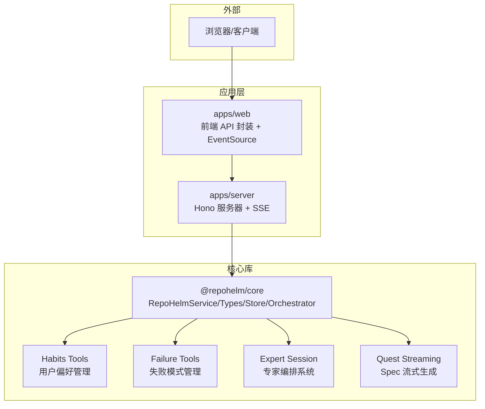
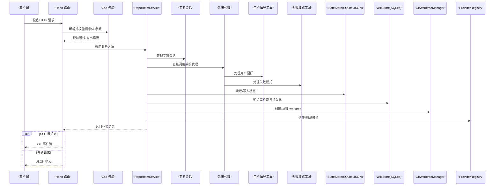
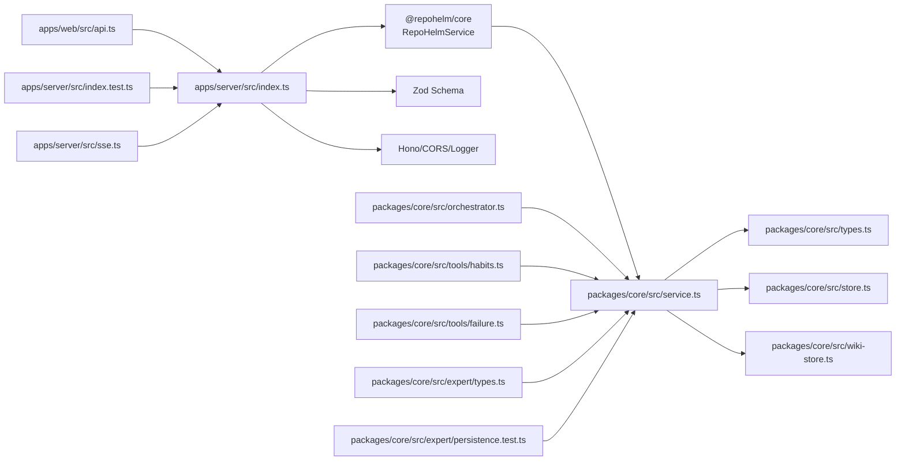

# 服务器 API 设计

<cite>
**本文引用的文件列表**
- [apps/server/src/index.ts](file://apps/server/src/index.ts)
- [apps/server/src/index.test.ts](file://apps/server/src/index.test.ts)
- [apps/server/src/sse.ts](file://apps/server/src/sse.ts)
- [apps/web/src/api.ts](file://apps/web/src/api.ts)
- [packages/core/src/service.ts](file://packages/core/src/service.ts)
- [packages/core/src/types.ts](file://packages/core/src/types.ts)
- [packages/core/src/store.ts](file://packages/core/src/store.ts)
- [packages/core/src/wiki-store.ts](file://packages/core/src/wiki-store.ts)
- [packages/core/src/orchestrator.ts](file://packages/core/src/orchestrator.ts)
- [packages/core/src/tools/habits.ts](file://packages/core/src/tools/habits.ts)
- [packages/core/src/tools/failure.ts](file://packages/core/src/tools/failure.ts)
- [packages/core/src/expert/types.ts](file://packages/core/src/expert/types.ts)
- [packages/core/src/expert/persistence.test.ts](file://packages/core/src/expert/persistence.test.ts)
- [packages/core/src/expert/session-manager.ts](file://packages/core/src/expert/session-manager.ts)
- [apps/server/package.json](file://apps/server/package.json)
- [packages/core/package.json](file://packages/core/package.json)
- [README.md](file://README.md)
</cite>

## 目录
1. [简介](#简介)
2. [项目结构](#项目结构)
3. [核心组件](#核心组件)
4. [架构总览](#架构总览)
5. [详细组件分析](#详细组件分析)
6. [依赖分析](#依赖分析)
7. [性能考量](#性能考量)
8. [故障排查指南](#故障排查指南)
9. [结论](#结论)
10. [附录](#附录)

## 简介
本文件为 RepoHelm 服务器 API 的全面设计文档，面向前端与集成开发者，系统性说明 RESTful API 的端点、请求/响应模式、数据验证（Zod）、路由与中间件、CORS 与安全策略、错误处理、版本与兼容性、客户端实现与性能优化、测试与调试方法，以及与核心服务的集成关系。RepoHelm 以 Hono 为基础构建 API，使用 Zod 对输入进行强类型校验，通过 @repohelm/core 提供业务逻辑与状态持久化。

**更新** 本次更新新增了完整的专家编排API端点、Quest Spec流式传输端点、专家会话SSE流、打开目录API等新API端点。这些新功能为复杂任务提供专家级编排能力，支持任务树管理、验收测试、研究资料收集和动态代理池管理，同时提供真实的流式Spec生成体验。

## 项目结构
- 应用层
  - 服务器应用：apps/server，基于 Hono，提供 REST API 和 SSE 流传输。
  - Web 前端：apps/web，提供调用 API 的封装函数与类型定义。
- 核心库
  - @repohelm/core：包含业务服务 RepoHelmService、类型定义、状态存储、编排器等。
- 其他
  - README.md 提供整体背景、启动方式与功能概览。

**图表来源**
- [apps/server/src/index.ts:39-49](file://apps/server/src/index.ts#L39-L49)
- [apps/web/src/api.ts:276-422](file://apps/web/src/api.ts#L276-L422)
- [packages/core/src/service.ts:56-71](file://packages/core/src/service.ts#L56-L71)
- [packages/core/src/tools/habits.ts:1-185](file://packages/core/src/tools/habits.ts#L1-L185)
- [packages/core/src/tools/failure.ts:1-264](file://packages/core/src/tools/failure.ts#L1-L264)
- [packages/core/src/expert/types.ts:1-173](file://packages/core/src/expert/types.ts#L1-L173)

**章节来源**
- [apps/server/src/index.ts:1-1021](file://apps/server/src/index.ts#L1-L1021)
- [apps/web/src/api.ts:1-954](file://apps/web/src/api.ts#L1-L954)
- [packages/core/src/service.ts:1-2690](file://packages/core/src/service.ts#L1-L2690)
- [README.md:1-100](file://README.md#L1-L100)

## 核心组件
- Hono 服务器与中间件
  - 日志中间件：全局日志记录。
  - CORS 中间件：允许来自 http://localhost:5173 与 http://127.0.0.1:5173 的跨域请求，支持 GET/POST/PATCH/DELETE/OPTIONS，允许 Content-Type 头。
- 数据验证（Zod）
  - 为工作区、项目、引擎、提供商模型查询、安全策略、Quest、ModelKit、**子代理**、**计划管理**、**系统代理**、**用户偏好管理**、**失败模式管理**、**专家会话**等输入建立严格 Schema，统一在路由层解析与校验。
- 核心服务（RepoHelmService）
  - 提供工作区管理、项目管理、引擎配置、提供商模型查询、安全策略、Quest 生命周期、Git worktree 管理、知识库检索与持久化、审计日志等能力。
  - **新增** 专家会话管理：支持创建、查询、更新专家编排会话，管理任务树、验收测试、研究资料和代理池。
  - **新增** 系统代理调用：支持直接调用系统代理（知识库、用户习惯、失败经验），无需通过 Quest 编排器。
  - **新增** 用户偏好管理：记录和管理用户的编码习惯、风格偏好和工作流偏好，支持置信度评估和示例记录。
  - **新增** 失败模式管理：记录和管理 Quest 执行中的失败经验，支持风险检查和缓解方案。
  - **新增** 计划管理：生成、批准、拒绝 Quest 计划，支持自动批准配置。
  - **新增** 子代理管理：创建、更新、删除、查询子代理，支持入口代理设置和权限配置。
  - **新增** 编排器：基于入口代理生成执行计划，按依赖顺序委派给工作代理执行。
  - **新增** Quest Spec 流式生成：支持真实的流式Spec生成，提供SSE事件流。
- 状态存储（StateStore）
  - 支持 JSON 与 SQLite 两种实现，含迁移逻辑与默认配置，新增专家会话表、用户偏好和失败模式集合。
- **新增** SSE 流传输基础设施
  - 提供通用的SSE设置和格式化函数，支持Server-Sent Events流式传输。
  - 支持专家会话实时状态更新和Quest Spec流式生成。
- **新增** 优雅关闭处理程序
  - 支持 SIGINT 和 SIGTERM 信号，提供平滑的服务终止。
  - 自动关闭 HTTP 服务器和数据库连接，确保资源正确释放。
  - 包含错误处理机制，防止关闭过程中的异常导致进程崩溃。

**章节来源**
- [apps/server/src/index.ts:41-49](file://apps/server/src/index.ts#L41-L49)
- [apps/server/src/index.ts:51-184](file://apps/server/src/index.ts#L51-L184)
- [apps/server/src/index.ts:888-1021](file://apps/server/src/index.ts#L888-L1021)
- [apps/server/src/sse.ts:1-13](file://apps/server/src/sse.ts#L1-L13)
- [packages/core/src/service.ts:959-1028](file://packages/core/src/service.ts#L959-L1028)
- [packages/core/src/service.ts:1042-1128](file://packages/core/src/service.ts#L1042-L1128)
- [packages/core/src/service.ts:1135-1230](file://packages/core/src/service.ts#L1135-L1230)
- [packages/core/src/store.ts:86-165](file://packages/core/src/store.ts#L86-L165)
- [packages/core/src/expert/types.ts:1-173](file://packages/core/src/expert/types.ts#L1-L173)

## 架构总览
服务器 API 采用"路由层 + 服务层 + 存储层"的分层设计：
- 路由层：Hono 路由注册与中间件装配，Zod 输入校验，统一错误处理，SSE 流传输支持。
- 服务层：RepoHelmService 组织业务流程，协调 Git、Provider、Knowledge、Audit、**ModelKit**、**SubAgent**、**Orchestrator**、**Habits Tools**、**Failure Tools**、**Expert Session**、**Quest Streaming** 等子系统。
- 存储层：SqliteStateStore/JsonStateStore 提供状态持久化与迁移。

**图表来源**
- [apps/server/src/index.ts:114-1021](file://apps/server/src/index.ts#L114-L1021)
- [packages/core/src/service.ts:959-1028](file://packages/core/src/service.ts#L959-L1028)
- [packages/core/src/tools/habits.ts:109-184](file://packages/core/src/tools/habits.ts#L109-L184)
- [packages/core/src/tools/failure.ts:128-263](file://packages/core/src/tools/failure.ts#L128-L263)
- [packages/core/src/store.ts:125-139](file://packages/core/src/store.ts#L125-L139)

## 详细组件分析

### 路由与中间件
- 中间件
  - 日志中间件：对所有请求输出日志。
  - CORS 中间件：限定来源为本地开发端口，允许常见方法与 Content-Type。
- 错误处理
  - 全局 onError 捕获异常，统一返回 500 与错误消息。
- **新增** SSE 支持
  - setupSSE 函数：设置正确的SSE响应头（Content-Type: text/event-stream, Cache-Control: no-cache, Connection: keep-alive）。
  - formatSSE 函数：格式化SSE事件消息，支持事件类型和数据。

**章节来源**
- [apps/server/src/index.ts:41-49](file://apps/server/src/index.ts#L41-L49)
- [apps/server/src/index.ts:854-862](file://apps/server/src/index.ts#L854-L862)
- [apps/server/src/sse.ts:1-13](file://apps/server/src/sse.ts#L1-L13)

### 数据验证（Zod）与类型系统
- 输入校验 Schema
  - 工作区：名称必填，描述可选，worktreeRoot 可选。
  - 更新工作区：字段可部分提供。
  - 项目：名称、路径必填，角色、默认分支、验证命令可选。
  - 更新项目：字段可部分提供。
  - 引擎：mode/cliId/cliModels/byokProviders/activeByokProviderId 可选。
  - 提供商模型查询：baseUrl/apiKey/refresh 可选。
  - 安全策略：命令审批模式、允许命令、文件作用域、网络作用域、密钥策略、沙箱运行时可选。
  - Quest：workspaceId/title/requirement 必填，agentBackendId 可选，affectedProjectIds 可选，**entrySubAgentId 可选，autoApprovePlan 可选**。
  - **新增** 专家会话创建：questId/requirement/workspaceId/entryAgentId/projectIds 必填。
  - **新增** 专家会话确认：acceptanceTestIds/skipAcceptanceTests 可选。
  - **新增** 系统代理调用：task 必填，context 可选。
  - **新增** 用户偏好创建：category/key/value 必填，confidence/source/example 可选。
  - **新增** 失败模式创建：category/title/description/rootCause/context/mitigation 必填，signals/projectId/questId/severity 可选。
  - **新增** 失败模式搜索：query 必填，category/projectId 可选。
  - **新增** 失败模式更新：resolved/severity/mitigation 可选。
  - **新增** 计划批准：reason 可选。
  - **新增** ModelKit 创建：id/name/type/backendId/providerId/model/config/costTier/performanceProfile 可选。
  - **新增** ModelKit 更新：name/model/config/costTier/performanceProfile 可选。
  - **新增** ModelKit 测试：type/backendId/providerId/model/apiKey/baseUrl/name/costTier/performanceProfile 可选。
  - **新增** 子代理创建：id/name/role/capabilities/modelKitId/mode/permissions/promptTemplate 可选。
  - **新增** 子代理更新：name/role/capabilities/modelKitId/mode/permissions/promptTemplate 可选。
  - **新增** 入口代理设置：id 必填。
- 类型定义
  - 服务层与前端均使用统一类型定义，确保 API 与 UI 的一致性。

**章节来源**
- [apps/server/src/index.ts:51-184](file://apps/server/src/index.ts#L51-L184)
- [apps/server/src/index.ts:733-755](file://apps/server/src/index.ts#L733-L755)
- [packages/core/src/types.ts:70-619](file://packages/core/src/types.ts#L70-L619)

### API 端点清单与规范

**更新** 新增完整的专家编排API端点、Quest Spec流式传输端点、专家会话SSE流、打开目录API等新API端点

说明
- 所有端点均返回 JSON。
- 成功响应通常返回 200；资源创建返回 201。
- 查询参数通过 URL 查询字符串传递；路径参数通过 URL 路径占位符传递。
- 请求体为 JSON；Content-Type: application/json。
- 身份验证：本项目未实现鉴权中间件，API 未包含鉴权头或令牌。
- **新增** SSE 端点：支持 Server-Sent Events 流式传输，使用 text/event-stream 响应类型。

#### 专家会话管理端点
- 创建专家会话
  - 方法：POST
  - 路径：/api/expert/session
  - 请求体：questId/requirement/workspaceId/entryAgentId/projectIds（部分可选）
  - 功能：创建专家编排会话，初始化任务树和代理池
  - 响应：{ session: ExpertSession }（201）
  - 说明：自动生成 expert_ 前缀的会话ID，状态初始为 analyzing
- 获取专家会话
  - 方法：GET
  - 路径：/api/expert/session/:id
  - 参数：路径参数 id
  - 功能：获取指定专家会话的完整信息
  - 响应：{ session: ExpertSession }
- 更新专家会话
  - 方法：PATCH
  - 路径：/api/expert/session/:id
  - 参数：路径参数 id；请求体：任意 ExpertSession 字段
  - 功能：更新专家会话状态和内容
  - 响应：{ session: ExpertSession }
- 确认专家会话
  - 方法：POST
  - 路径：/api/expert/session/:id/confirm
  - 参数：路径参数 id；请求体：acceptanceTestIds/skipAcceptanceTests（可选）
  - 功能：将会话状态设为 confirmed，记录确认时间
  - 响应：{ session: ExpertSession }
- 获取交付成果
  - 方法：GET
  - 路径：/api/expert/session/:id/deliverables
  - 参数：路径参数 id
  - 功能：获取会话中所有任务的产物列表
  - 响应：{ deliverables: TaskArtifact[] }
- 获取参考资料
  - 方法：GET
  - 路径：/api/expert/session/:id/references
  - 参数：路径参数 id
  - 功能：获取会话的研究资料和参考信息
  - 响应：{ references: { knowledge: CodeResearchResult[], preferences: [], failurePatterns: [] } }
- **新增** 专家会话SSE流
  - 方法：GET
  - 路径：/api/expert/session/:id/stream
  - 参数：路径参数 id
  - 功能：建立 Server-Sent Events 连接，实时推送会话状态更新
  - 响应：SSE 流（connected/session_update）
  - 说明：定时推送会话更新，演示用30秒后关闭
- 获取研究资料
  - 方法：GET
  - 路径：/api/expert/session/:id/research
  - 参数：路径参数 id
  - 功能：获取会话的研究结果列表
  - 响应：{ research: CodeResearchResult[] }
- 获取验收测试
  - 方法：GET
  - 路径：/api/expert/session/:id/acceptance-tests
  - 参数：路径参数 id
  - 功能：获取会话的验收测试列表
  - 响应：{ tests: AcceptanceTest[] }

#### 系统代理调用端点
- 系统代理调用
  - 方法：POST
  - 路径：/api/system-agents/:id/invoke
  - 参数：路径参数 id；请求体：task（必填）、context（可选）
  - 功能：直接调用系统代理（无需通过 Quest 编排器）
  - 响应：{ content: string }
  - 说明：系统代理在独立的 tool-calling loop 中运行，使用与其 systemRole 匹配的工具集

#### 用户偏好管理端点
- 获取用户偏好
  - 方法：GET
  - 路径：/api/preferences
  - 功能：获取所有用户偏好列表
  - 响应：UserPreference[]
- 记录用户偏好
  - 方法：POST
  - 路径：/api/preferences
  - 请求体：category/key/value（必填），confidence/source/example（可选)
  - 功能：记录或更新用户偏好，同 category+key 则更新（提高 confidence 和 occurrences）
  - 响应：UserPreference（201）
- 删除用户偏好
  - 方法：DELETE
  - 路径：/api/preferences/:id
  - 参数：路径参数 id
  - 功能：删除指定用户偏好
  - 响应：{ ok: true }

#### 失败模式管理端点
- 获取失败模式
  - 方法：GET
  - 路径：/api/failures
  - 功能：获取所有失败模式列表
  - 响应：FailurePattern[]
- 记录失败模式
  - 方法：POST
  - 路径：/api/failures
  - 请求体：category/title/description/rootCause/context/mitigation（必填），signals/projectId/questId/severity（可选）
  - 功能：记录新的失败模式，包含根因分析和缓解方案
  - 响应：FailurePattern（201）
- 搜索失败模式
  - 方法：POST
  - 路径：/api/failures/search
  - 请求体：query（必填），category/projectId（可选)
  - 功能：搜索相似的失败模式，使用关键词匹配
  - 响应：FailurePattern[]
- 更新失败模式
  - 方法：PATCH
  - 路径：/api/failures/:id
  - 参数：路径参数 id；请求体：resolved/severity/mitigation（可选）
  - 功能：更新失败模式状态（标记解决、修改严重程度或缓解方案）
  - 响应：FailurePattern

#### 计划管理端点
- 生成并获取计划
  - 方法：GET
  - 路径：/api/quests/:id/plan
  - 参数：路径参数 id
  - 功能：获取 Quest 的编排计划（如果存在）
  - 响应：OrchestrationPlan 或 { error: "No plan found" }（404)
- 批准计划
  - 方法：POST
  - 路径：/api/quests/:id/approve-plan
  - 参数：路径参数 id
  - 功能：批准 Quest 计划并开始执行
  - 响应：Quest（200)
- 拒绝计划
  - 方法：POST
  - 路径：/api/quests/:id/reject-plan
  - 参数：路径参数 id；请求体：reason（可选）
  - 功能：拒绝 Quest 计划
  - 响应：Quest（200)

#### 子代理管理端点
- 创建子代理
  - 方法：POST
  - 路径：/api/sub-agents
  - 请求体：name/role/capabilities/modelKitId/mode/permissions/promptTemplate（部分可选）
  - 功能：创建新的子代理实例
  - 响应：SubAgent（201)
- 更新子代理
  - 方法：PATCH
  - 路径：/api/sub-agents/:id
  - 参数：路径参数 id；请求体：name/role/capabilities/modelKitId/mode/permissions/promptTemplate（可选）
  - 功能：更新现有子代理
  - 响应：SubAgent
- 删除子代理
  - 方法：DELETE
  - 路径：/api/sub-agents/:id
  - 参数：路径参数 id
  - 功能：删除子代理（如为入口代理，需先设置其他入口）
  - 响应：{ ok: true }
- 列出所有子代理
  - 方法：GET
  - 路径：/api/sub-agents
  - 参数：查询参数 mode（可选：entry/worker）
  - 功能：获取所有子代理列表，可按模式过滤
  - 响应：SubAgent[]
- 设置入口子代理
  - 方法：POST
  - 路径：/api/sub-agents/set-entry
  - 请求体：id（必填）
  - 功能：设置入口子代理（必须为 entry 模式）
  - 响应：{ ok: true }
- 获取入口子代理
  - 方法：GET
  - 路径：/api/sub-agents/entry
  - 功能：获取当前入口子代理
  - 响应：SubAgent 或 null

#### **新增** Quest Spec 流式传输端点
- **新增** Quest Spec 流式传输
  - 方法：GET
  - 路径：/api/quests/:id/spec-stream
  - 参数：路径参数 id
  - 功能：建立 Server-Sent Events 连接，流式传输Spec生成过程
  - 响应：SSE 流（analysis_delta/spec_ready/event_added/done/error）
  - 说明：提供需求分析叙述流、结构化Spec生成、时间线事件、完成通知和错误处理

#### **新增** 打开目录API端点
- **新增** 打开项目目录
  - 方法：POST
  - 路径：/api/projects/:id/open-directory
  - 参数：路径参数 id
  - 功能：在本机打开项目目录（平台相关）
  - 响应：{ ok: boolean }
  - 说明：支持 macOS（open）、Windows（explorer）、Linux（xdg-open）
- **新增** 打开工作树目录
  - 方法：POST
  - 路径：/api/workspaces/:id/worktrees/:projectId/open-directory
  - 参数：路径参数 id（workspaceId）、路径参数 projectId
  - 功能：在本机打开指定项目的工作树目录
  - 响应：{ ok: boolean }
  - 说明：支持 macOS（open）、Windows（explorer）、Linux（xdg-open）

端点一览（其余端点保持不变）
- 健康检查
  - 方法：GET
  - 路径：/api/health
  - 功能：返回服务健康信息与根目录配置
  - 响应：包含 ok、name、rootDir、stateRootDir、worktreeRootDir、knowledgeRootDir
- 获取状态
  - 方法：GET
  - 路径：/api/state
  - 功能：返回 RepoHelm 全部状态
  - 响应：RepoHelmState
- Agent 后端列表
  - 方法：GET
  - 路径：/api/agent-backends
  - 功能：列出可用 Agent Backend
  - 响应：AgentBackendInfo[]
- 本地 CLI 列表
  - 方法：GET
  - 路径：/api/clis
  - 功能：列出本地 CLI
  - 响应：LocalCliInfo[]
- 重新扫描本地 CLI
  - 方法：POST
  - 路径：/api/clis/rescan
  - 功能：强制重新扫描本地 CLI
  - 响应：LocalCliInfo[]
- 测试本地 CLI
  - 方法：POST
  - 路径：/api/clis/:id/test
  - 参数：路径参数 id
  - 功能：测试指定 CLI 可用性
  - 响应：CliTestResult
- 提供商列表
  - 方法：GET
  - 路径：/api/providers
  - 功能：列出提供商信息
  - 响应：ProviderInfo[]
- 列举提供商模型
  - 方法：POST
  - 路径：/api/providers/:id/models
  - 参数：路径参数 id；请求体包含 baseUrl/apiKey/refresh
  - 功能：列举提供商模型（支持缓存与刷新）
  - 响应：ProviderModelsResult
- 测试提供商
  - 方法：POST
  - 路径：/api/providers/:id/test
  - 参数：路径参数 id；请求体包含 baseUrl/apiKey
  - 功能：探测提供商连通性与鉴权
  - 响应：CliTestResult
- 引擎配置
  - 方法：GET
  - 路径：/api/engine
  - 功能：获取引擎配置
  - 响应：EngineConfig
- 更新引擎配置
  - 方法：PATCH
  - 路径：/api/engine
  - 请求体：部分字段（mode/cliId/cliModels/byokProviders/activeByokProviderId）
  - 功能：更新引擎配置
  - 响应：EngineConfig
- 能力列表
  - 方法：GET
  - 路径：/api/capabilities
  - 功能：获取能力定义列表
  - 响应：CapabilityDefinition[]
- 安全策略
  - 方法：GET
  - 路径：/api/security-policy
  - 功能：获取安全策略
  - 响应：SecurityPolicy
- 审计日志
  - 方法：GET
  - 路径：/api/audit-log
  - 功能：获取审计日志
  - 响应：AuditLogEntry[]
- 更新安全策略
  - 方法：PATCH
  - 路径：/api/security-policy
  - 请求体：部分字段（commandApprovalMode/allowedCommands/fileScopes/networkScopes/secretsPolicy/sandboxRuntime）
  - 功能：更新安全策略
  - 响应：SecurityPolicy
- 产品就绪度
  - 方法：GET
  - 路径：/api/product-readiness
  - 参数：查询参数 workspaceId（可选)
  - 功能：获取产品就绪度指标
  - 响应：ProductReadiness
- 知识库检索
  - 方法：GET
  - 路径：/api/workspaces/:id/knowledge
  - 参数：路径参数 id；查询参数 q
  - 功能：按关键词检索知识库
  - 响应：KnowledgeItem[]
- 工作树列表
  - 方法：GET
  - 路径：/api/worktrees
  - 参数：查询参数 workspaceId（可选)
  - 功能：列出 Quest 关联的工作树
  - 响应：WorktreeState[]
- 创建工作区
  - 方法：POST
  - 路径：/api/workspaces
  - 请求体：name/description/worktreeRoot
  - 功能：创建新工作区
  - 响应：Workspace（201)
- 更新工作区
  - 方法：PATCH
  - 路径：/api/workspaces/:id
  - 参数：路径参数 id；请求体：name/description/worktreeRoot（可选)
  - 功能：更新工作区
  - 响应：Workspace
- 创建项目
  - 方法：POST
  - 路径：/api/projects
  - 请求体：name/path/role/defaultBranch/validationCommand
  - 功能：创建项目并写入知识库摘要
  - 响应：Project（201)
- 关联项目到工作区
  - 方法：POST
  - 路径：/api/workspaces/:id/links
  - 参数：路径参数 id；请求体：projectId
  - 功能：将项目链接到工作区，并创建 Git worktree
  - 响应：Workspace（201)
- 从工作区取消关联项目
  - 方法：DELETE
  - 路径：/api/workspaces/:id/links/:projectId
  - 参数：路径参数 id、projectId
  - 功能：从工作区取消关联并清理工作树
  - 响应：Workspace
- 更新项目
  - 方法：PATCH
  - 路径：/api/projects/:id
  - 参数：路径参数 id；请求体：name/path/role/defaultBranch/validationCommand（可选)
  - 功能：更新项目
  - 响应：Project
- 删除项目
  - 方法：DELETE
  - 路径：/api/projects/:id
  - 参数：路径参数 id
  - 功能：删除项目并级联清理工作树
  - 响应：RepoHelmState
- 检查项目健康
  - 方法：POST
  - 路径：/api/projects/:id/check
  - 参数：路径参数 id
  - 功能：检查项目健康状态
  - 响应：Project
- 选择目录
  - 方法：POST
  - 路径：/api/pick-directory
  - 功能：macOS 下弹出目录选择器
  - 响应：{ path: string|null, error?: string }
- 列举分支
  - 方法：GET
  - 路径：/api/branches
  - 参数：查询参数 path（必填)
  - 功能：列举仓库分支与默认分支
  - 响应：{ branches: string[], defaultBranch: string }
- 创建 Quest
  - 方法：POST
  - 路径：/api/quests
  - 请求体：workspaceId/title/requirement/agentBackendId/affectedProjectIds/entrySubAgentId/autoApprovePlan
  - 功能：创建 Quest 并生成轻量 Spec 与能力推荐
  - 响应：Quest（201)
- 运行 Quest
  - 方法：POST
  - 路径：/api/quests/:id/run
  - 参数：路径参数 id
  - 功能：创建工作树、执行 Agent、生成验证与 Review 结果
  - 响应：Quest
- 重试 Quest
  - 方法：POST
  - 路径：/api/quests/:id/retry
  - 参数：路径参数 id
  - 功能：清理后重新运行
  - 响应：Quest
- 清理 Quest 工作树
  - 方法：POST
  - 路径：/api/quests/:id/cleanup
  - 参数：路径参数 id
  - 功能：清理工作树
  - 响应：Quest
- 交付 Quest
  - 方法：POST
  - 路径：/api/quests/:id/deliver
  - 参数：路径参数 id
  - 功能：交付（验证、提交、PR 准备/创建）
  - 响应：Quest
- 接受能力推荐
  - 方法：POST
  - 路径：/api/quests/:id/capabilities/:capabilityId/accept
  - 参数：路径参数 id、capabilityId
  - 功能：接受能力推荐
  - 响应：Quest
- 拒绝能力推荐
  - 方法：POST
  - 路径：/api/quests/:id/capabilities/:capabilityId/dismiss
  - 参数：路径参数 id、capabilityId
  - 功能：拒绝能力推荐
  - 响应：Quest

**章节来源**
- [apps/server/src/index.ts:756-1021](file://apps/server/src/index.ts#L756-L1021)

### 请求/响应示例与错误处理
- 示例
  - 获取状态：GET /api/state → 返回 RepoHelmState
  - 创建工作区：POST /api/workspaces → 请求体包含 name/description/worktreeRoot；响应 201 与 Workspace
  - 运行 Quest：POST /api/quests/:id/run → 返回 Quest
  - **新增** 创建专家会话：POST /api/expert/session → 请求体包含 questId/requirement；响应 201 与 ExpertSession
  - **新增** 获取专家会话：GET /api/expert/session/:id → 返回 { session: ExpertSession }
  - **新增** 确认专家会话：POST /api/expert/session/:id/confirm → 返回 { session: ExpertSession }
  - **新增** 获取交付成果：GET /api/expert/session/:id/deliverables → 返回 { deliverables: TaskArtifact[] }
  - **新增** 获取参考资料：GET /api/expert/session/:id/references → 返回 { references: {...} }
  - **新增** 专家会话SSE流：GET /api/expert/session/:id/stream → 返回 SSE 流（connected/session_update）
  - **新增** 获取研究资料：GET /api/expert/session/:id/research → 返回 { research: CodeResearchResult[] }
  - **新增** 获取验收测试：GET /api/expert/session/:id/acceptance-tests → 返回 { tests: AcceptanceTest[] }
  - **新增** 系统代理调用：POST /api/system-agents/:id/invoke → 请求体包含 task/context；响应 { content: string }
  - **新增** 记录用户偏好：POST /api/preferences → 请求体包含 category/key/value；响应 UserPreference
  - **新增** 记录失败模式：POST /api/failures → 请求体包含 category/title/description/rootCause/context/mitigation；响应 FailurePattern
  - **新增** 创建子代理：POST /api/sub-agents → 请求体包含 name/role/modelKitId；响应 201 与 SubAgent
  - **新增** 获取计划：GET /api/quests/:id/plan → 返回 OrchestrationPlan 或 { error: "No plan found" }（404)
  - **新增** 批准计划：POST /api/quests/:id/approve-plan → 返回 Quest
  - **新增** 拒绝计划：POST /api/quests/:id/reject-plan → 返回 Quest
  - **新增** Quest Spec流式传输：GET /api/quests/:id/spec-stream → 返回 SSE 流（analysis_delta/spec_ready/event_added/done）
  - **新增** 打开项目目录：POST /api/projects/:id/open-directory → 返回 { ok: boolean }
  - **新增** 打开工作树目录：POST /api/workspaces/:id/worktrees/:projectId/open-directory → 返回 { ok: boolean }
- 错误处理
  - 全局 onError：捕获异常并返回 500 与错误消息。
  - 路由层 Zod 校验失败：将触发 400（由 Hono 默认行为处理，具体取决于框架行为）。
  - 业务异常：如"Workspace not found"、"Project not found"、"ModelKit not found"、"SubAgent not found"、"Quest not found"、"System agent not found"、"User preference not found"、"Failure pattern not found"、"Session not found"，服务层抛出错误，最终由全局 onError 捕获并返回 500。

**章节来源**
- [apps/server/src/index.ts:854-862](file://apps/server/src/index.ts#L854-L862)
- [packages/core/src/service.ts:960-977](file://packages/core/src/service.ts#L960-L977)
- [packages/core/src/service.ts:1042-1084](file://packages/core/src/service.ts#L1042-L1084)
- [packages/core/src/service.ts:1135-1158](file://packages/core/src/service.ts#L1135-L1158)
- [packages/core/src/service.ts:2670-2684](file://packages/core/src/service.ts#L2670-L2684)

### CORS 配置与安全考虑
- CORS
  - 允许来源：http://localhost:5173、http://127.0.0.1:5173
  - 允许方法：GET、POST、PATCH、DELETE、OPTIONS
  - 允许头：Content-Type
- 安全策略
  - 本地安全策略：命令审批模式（allowlist/manual）、允许命令列表、文件作用域、网络作用域、密钥策略（redact-env/deny）、沙箱运行时（local/external）。
  - 审计日志：记录命令、文件、网络、密钥、能力、沙箱等类型的决策与详情。
  - 身份验证：未实现鉴权中间件，不包含 Authorization 头或令牌。
  - **新增** 专家会话安全：专家会话状态变更需要明确的确认流程，防止意外状态转换。
  - **新增** 系统代理安全：系统代理调用需要 BYOK ModelKit，且系统代理必须为 system 模式。
  - **新增** SSE 安全：SSE 流传输使用标准的 text/event-stream 响应类型，支持连接保持和缓存控制。

**章节来源**
- [apps/server/src/index.ts:42-49](file://apps/server/src/index.ts#L42-L49)
- [packages/core/src/types.ts:160-168](file://packages/core/src/types.ts#L160-L168)
- [packages/core/src/store.ts:13-24](file://packages/core/src/store.ts#L13-L24)
- [packages/core/src/service.ts:968-977](file://packages/core/src/service.ts#L968-L977)

### 版本控制与向后兼容性
- 版本
  - 服务器与核心包版本均为 0.1.0（私有包），当前处于 MVP 骨架阶段。
- 兼容性
  - 状态存储支持从旧 JSON 迁移到 SQLite，并对引擎配置进行兼容迁移（byok -> byokProviders）。
  - 类型定义与 API 行为保持一致，前端通过统一类型定义对接。
  - **新增** 专家会话API作为扩展特性，不影响现有 API 兼容性。
  - **新增** 用户偏好和失败模式集合在状态存储中得到支持，提供向后兼容的数据迁移。
  - **新增** 专家会话表结构在 SQLite 存储中得到支持，提供向后兼容的数据迁移。
  - **新增** Quest Spec 流式传输作为新特性，不影响现有 API 兼容性。

**章节来源**
- [apps/server/package.json:1-22](file://apps/server/package.json#L1-L22)
- [packages/core/package.json:1-21](file://packages/core/package.json#L1-L21)
- [packages/core/src/store.ts:36-84](file://packages/core/src/store.ts#L36-L84)
- [packages/core/src/store.ts:131-142](file://packages/core/src/store.ts#L131-L142)
- [packages/core/src/store.ts:201-217](file://packages/core/src/store.ts#L201-L217)

### 客户端实现指南与性能优化
- 客户端实现
  - 前端封装：apps/web/src/api.ts 提供统一的请求函数与类型定义，便于在 UI 中直接调用。
  - **新增** SSE 客户端：支持 EventSource 订阅，处理 analysis_delta、spec_ready、event_added、done、error 事件。
  - 建议：使用 fetch 包装统一处理 4xx/5xx，提取错误消息，避免重复代码。
- 性能优化
  - 提供商模型缓存：ProviderModelsResult 支持缓存（TTL），减少频繁请求。
  - 分页与过滤：对大列表（如知识库、审计日志、ModelKit 列表、子代理列表、用户偏好列表、失败模式列表、专家会话列表）建议在前端分页或增加筛选参数。
  - 并发控制：批量操作（如多个 Quest 并行运行）需注意资源限制与并发队列。
  - **新增** 专家会话缓存：专家会话状态变更后进行缓存，避免重复查询。
  - **新增** 计划缓存：Quest 计划生成后可缓存，避免重复计算。
  - **新增** 子代理池：编排器维护子代理池，提高执行效率。
  - **新增** 系统代理缓存：系统代理调用结果可缓存，减少重复计算。
  - **新增** 用户偏好缓存：用户偏好查询可缓存，提高响应速度。
  - **新增** SSE 连接管理：合理管理 EventSource 连接，避免内存泄漏。

**章节来源**
- [apps/web/src/api.ts:276-422](file://apps/web/src/api.ts#L276-L422)
- [packages/core/src/service.ts:422-455](file://packages/core/src/service.ts#L422-L455)
- [packages/core/src/orchestrator.ts:185-188](file://packages/core/src/orchestrator.ts#L185-L188)

### API 测试与调试
- 单元测试
  - @repohelm/core 提供 vitest 测试，覆盖工作区引导、SQLite 迁移、知识文件写入、Quest 创建、能力推荐、安全策略、真实 worktree、mock/CLI Agent、diff 读取、清理、重试、交付、产品就绪度等。
  - **新增** 专家会话测试：覆盖专家会话创建、查询、更新、列表等功能。
  - **新增** 专家会话持久化测试：验证专家会话数据的序列化和反序列化。
  - **新增** 系统代理测试：覆盖系统代理调用、用户偏好管理、失败模式管理等完整流程。
  - **新增** 用户偏好测试：覆盖偏好记录、更新、查询、删除等功能。
  - **新增** 失败模式测试：覆盖失败模式记录、搜索、风险检查、更新等功能。
  - **新增** Quest Spec 流式传输测试：验证流式生成过程和SSE事件传输。
- 端到端测试
  - e2e 使用 Playwright，覆盖从 UI 创建 Quest、生成 Spec、确认能力推荐、运行 Quest、搜索知识库、展示 worktree/review/diff、交付、清理、安全审计、产品就绪度与 CLI backend 的主流程。
  - **新增** 专家会话测试：验证专家会话创建、状态变更、流式传输等功能。
  - **新增** 系统代理测试：验证系统代理调用功能。
  - **新增** 用户偏好测试：验证用户偏好记录和查询功能。
  - **新增** 失败模式测试：验证失败模式记录和风险检查功能。
  - **新增** Quest Spec 流式传输测试：验证流式生成和事件处理。
- 调试
  - 启用日志中间件，观察请求与响应。
  - 使用 /api/health 检查服务状态与根目录配置。
  - 通过 /api/audit-log 查看审计记录。
  - **新增** 使用 /api/expert/session/:id 验证专家会话状态。
  - **新增** 使用 /api/expert/session/:id/confirm 验证会话确认流程。
  - **新增** 使用 /api/expert/session/:id/stream 验证流式传输。
  - **新增** 使用 /api/expert/session/:id/deliverables 验证交付成果。
  - **新增** 使用 /api/expert/session/:id/research 验证研究资料。
  - **新增** 使用 /api/expert/session/:id/acceptance-tests 验证验收测试。
  - **新增** 使用 /api/quests/:id/plan 验证计划生成。
  - **新增** 使用 /api/sub-agents 验证子代理管理功能。
  - **新增** 使用 /api/system-agents/:id/invoke 验证系统代理调用。
  - **新增** 使用 /api/preferences 验证用户偏好管理功能。
  - **新增** 使用 /api/failures 验证失败模式管理功能。
  - **新增** 使用 /api/quests/:id/spec-stream 验证 Quest Spec 流式传输。
  - **新增** 使用 /api/projects/:id/open-directory 验证目录打开功能。

**章节来源**
- [README.md:79-85](file://README.md#L79-L85)
- [apps/server/src/index.ts:41-49](file://apps/server/src/index.ts#L41-L49)
- [apps/server/src/index.ts:114-123](file://apps/server/src/index.ts#L114-L123)
- [packages/core/src/expert/persistence.test.ts:1-54](file://packages/core/src/expert/persistence.test.ts#L1-L54)

### 优雅关闭处理程序

**更新** 新增了完整的优雅关闭处理程序，提供平滑的服务终止能力

- 信号支持
  - SIGINT：Ctrl+C 中断信号，用于开发环境的优雅停止
  - SIGTERM：标准终止信号，用于生产环境的优雅停止
- 关闭流程
  - HTTP 服务器关闭：等待现有连接完成处理，然后关闭监听端口
  - 数据库连接关闭：依次关闭 StateStore 和 WikiStore 的 SQLite 连接
  - 错误处理：捕获关闭过程中的异常，防止进程崩溃
  - 进程退出：确保进程以 0 状态码正常退出
- 资源管理
  - 确保 SQLite 数据库文件的完整性
  - 防止数据库连接泄漏
  - 保证知识库和状态数据的正确持久化

**章节来源**
- [apps/server/src/index.ts:888-1021](file://apps/server/src/index.ts#L888-L1021)
- [packages/core/src/store.ts:219-224](file://packages/core/src/store.ts#L219-L224)
- [packages/core/src/wiki-store.ts:130-135](file://packages/core/src/wiki-store.ts#L130-L135)

## 依赖分析

**图表来源**
- [apps/server/src/index.ts:1-11](file://apps/server/src/index.ts#L1-L11)
- [apps/web/src/api.ts:276-422](file://apps/web/src/api.ts#L276-L422)
- [packages/core/src/service.ts:1-39](file://packages/core/src/service.ts#L1-L39)
- [packages/core/src/types.ts:1-619](file://packages/core/src/types.ts#L1-L619)
- [packages/core/src/store.ts:1-226](file://packages/core/src/store.ts#L1-L226)
- [packages/core/src/wiki-store.ts:1-137](file://packages/core/src/wiki-store.ts#L1-L137)
- [packages/core/src/orchestrator.ts:1-200](file://packages/core/src/orchestrator.ts#L1-L200)
- [packages/core/src/tools/habits.ts:1-185](file://packages/core/src/tools/habits.ts#L1-L185)
- [packages/core/src/tools/failure.ts:1-264](file://packages/core/src/tools/failure.ts#L1-L264)
- [packages/core/src/expert/types.ts:1-173](file://packages/core/src/expert/types.ts#L1-L173)

**章节来源**
- [apps/server/src/index.ts:1-11](file://apps/server/src/index.ts#L1-L11)
- [apps/web/src/api.ts:276-422](file://apps/web/src/api.ts#L276-L422)
- [packages/core/src/service.ts:1-39](file://packages/core/src/service.ts#L1-L39)

## 性能考量
- 模型缓存：ProviderModelsResult 支持缓存（TTL），refresh=true 可强制刷新，降低对外部提供商的请求压力。
- 并发与资源：同时运行多个 Quest 时，注意 Git worktree 创建与外部 CLI 执行的资源占用。
- 状态持久化：SQLite 相比 JSON 更适合增量写入与并发场景，建议在生产环境优先使用 SqliteStateStore。
- **新增** 专家会话性能：专家会话数据采用 JSON 序列化存储，支持按 questId 过滤查询，避免全量扫描。
- **新增** 专家会话缓存：专家会话状态变更后进行内存缓存，减少数据库访问频率。
- **新增** 计划执行性能：编排器按依赖顺序执行，支持并行度优化；子代理使用池化管理提高复用率。
- **新增** 子代理性能：子代理配置可复用，避免重复初始化开销；支持使用计数统计优化调度。
- **新增** 系统代理性能：系统代理调用支持工具调用循环，最大迭代次数限制为8次，避免无限循环。
- **新增** 用户偏好性能：用户偏好查询支持按分类和最低置信度过滤，提高查询效率。
- **新增** 失败模式性能：失败模式搜索使用关键词匹配，支持按类别和项目ID过滤，排序规则优化查询结果。
- **新增** 数据库连接管理：优雅关闭处理程序确保数据库连接正确释放，避免连接泄漏。
- **新增** SSE 性能：SSE 流传输使用高效的 ReadableStream 实现，支持事件缓冲和连接保持。
- **新增** Quest Spec 流式传输性能：流式生成使用异步生成器，支持事件驱动的Spec生成，避免长时间阻塞。

**章节来源**
- [packages/core/src/service.ts:422-455](file://packages/core/src/service.ts#L422-L455)
- [packages/core/src/store.ts:117-165](file://packages/core/src/store.ts#L117-L165)
- [packages/core/src/orchestrator.ts:107-166](file://packages/core/src/orchestrator.ts#L107-L166)
- [packages/core/src/service.ts:999-1027](file://packages/core/src/service.ts#L999-L1027)
- [packages/core/src/service.ts:1089-1103](file://packages/core/src/service.ts#L1089-L1103)
- [packages/core/src/service.ts:1164-1196](file://packages/core/src/service.ts#L1164-L1196)
- [packages/core/src/store.ts:169-193](file://packages/core/src/store.ts#L169-L193)

## 故障排查指南
- 常见错误
  - "Workspace not found" / "Project not found"：检查路径参数与数据库状态。
  - "ModelKit not found"：检查 ModelKit ID 是否正确，确认是否存在。
  - "SubAgent not found"：检查 SubAgent ID 是否正确，确认是否存在。
  - "Quest not found"：检查 Quest ID 是否正确，确认是否存在。
  - "No entry sub-agent configured"：检查入口子代理是否已设置。
  - "No plan found"：检查 Quest 是否已生成计划。
  - "System agent not found"：检查系统代理ID是否正确，确认是否存在。
  - "User preference not found"：检查用户偏好ID是否正确，确认是否存在。
  - "Failure pattern not found"：检查失败模式ID是否正确，确认是否存在。
  - "Session not found"：检查专家会话ID是否正确，确认是否存在。
  - "No entry sub-agent configured"：检查入口子代理是否已设置。
  - "No plan found"：检查 Quest 是否已生成计划。
  - "System agent requires a BYOK ModelKit"：检查系统代理使用的ModelKit类型。
  - "Agent is not a system agent"：检查代理模式是否为system。
  - macOS 目录选择器：仅支持 macOS，其他平台返回空路径。
  - 分支枚举失败：当路径无效时返回默认分支与空列表。
  - **新增** SSE 连接失败：检查 EventSource 连接状态和网络状况。
  - **新增** Quest Spec 流式传输失败：检查流式生成状态和模型可用性。
- 排查步骤
  - 使用 /api/health 确认服务可用与根目录配置。
  - 使用 /api/state 检查当前状态。
  - 使用 /api/audit-log 审核最近决策与拒绝原因。
  - 使用 /api/security-policy 检查安全策略是否过严导致命令被阻断。
  - **新增** 使用 /api/expert/session/:id 检查专家会话状态。
  - **新增** 使用 /api/expert/session/:id/confirm 验证会话确认流程。
  - **新增** 使用 /api/expert/session/:id/stream 检查流式传输连接。
  - **新增** 使用 /api/expert/session/:id/deliverables 验证交付成果。
  - **新增** 使用 /api/expert/session/:id/research 验证研究资料。
  - **新增** 使用 /api/expert/session/:id/acceptance-tests 验证验收测试。
  - **新增** 使用 /api/quests/:id/plan 检查计划状态。
  - **新增** 使用 /api/sub-agents 验证子代理状态。
  - **新增** 使用 /api/system-agents/:id/invoke 验证系统代理调用。
  - **新增** 使用 /api/preferences 验证用户偏好管理功能。
  - **新增** 使用 /api/failures 验证失败模式管理功能。
  - **新增** 使用 /api/quests/:id/spec-stream 验证 Quest Spec 流式传输。
  - **新增** 使用 /api/projects/:id/open-directory 验证目录打开功能。

**章节来源**
- [apps/server/src/index.ts:273-291](file://apps/server/src/index.ts#L273-L291)
- [apps/server/src/index.ts:293-304](file://apps/server/src/index.ts#L293-L304)
- [packages/core/src/service.ts:965-967](file://packages/core/src/service.ts#L965-L967)
- [packages/core/src/service.ts:1042-1044](file://packages/core/src/service.ts#L1042-L1044)
- [packages/core/src/service.ts:1135-1137](file://packages/core/src/service.ts#L1135-L1137)
- [packages/core/src/service.ts:2670-2684](file://packages/core/src/service.ts#L2670-L2684)

## 结论
RepoHelm 服务器 API 以 Hono 为核心，结合 Zod 强类型校验与 @repohelm/core 业务服务，提供了围绕 Quest 工作区的完整 REST API。其设计强调安全性（本地安全策略与审计日志）、可观测性（日志与审计）、可维护性（统一类型与中间件）。当前版本为 MVP，**新增的专家编排API**进一步增强了系统的智能化水平，提供专家级任务管理、动态代理池、研究资料收集和验收测试能力。**新增的系统代理API、用户偏好管理API、失败模式管理API**进一步增强了系统的智能化水平，包括用户习惯学习、失败经验积累和风险预警能力。**新增的Quest Spec流式传输API**提供了真实的流式Spec生成体验，支持SSE事件流传输。**新增的打开目录API**简化了项目和工作树目录的访问。**新增的优雅关闭处理程序**确保了服务的稳定性和可靠性，支持 SIGINT 和 SIGTERM 信号，提供平滑的服务终止和资源清理机制。建议在生产环境中启用更严格的鉴权与限流策略，并根据业务增长引入分页与缓存优化。

## 附录

### API 端点与参数对照表
- 健康检查：GET /api/health
- 获取状态：GET /api/state
- Agent 后端列表：GET /api/agent-backends
- 本地 CLI 列表：GET /api/clis
- 重新扫描 CLI：POST /api/clis/rescan
- 测试 CLI：POST /api/clis/:id/test
- 提供商列表：GET /api/providers
- 列举提供商模型：POST /api/providers/:id/models（请求体：baseUrl/apiKey/refresh）
- 测试提供商：POST /api/providers/:id/test（请求体：baseUrl/apiKey）
- 引擎配置：GET /api/engine
- 更新引擎配置：PATCH /api/engine（请求体：部分字段）
- 能力列表：GET /api/capabilities
- 安全策略：GET /api/security-policy
- 审计日志：GET /api/audit-log
- 更新安全策略：PATCH /api/security-policy（请求体：部分字段）
- 产品就绪度：GET /api/product-readiness?workspaceId=...
- 知识库检索：GET /api/workspaces/:id/knowledge?q=...
- 工作树列表：GET /api/worktrees?workspaceId=...
- 创建工作区：POST /api/workspaces（请求体：name/description/worktreeRoot）
- 更新工作区：PATCH /api/workspaces/:id（请求体：部分字段）
- 创建项目：POST /api/projects（请求体：name/path/role/defaultBranch/validationCommand）
- 关联项目到工作区：POST /api/workspaces/:id/links（请求体：projectId）
- 取消关联项目：DELETE /api/workspaces/:id/links/:projectId
- 更新项目：PATCH /api/projects/:id（请求体：部分字段）
- 删除项目：DELETE /api/projects/:id
- 检查项目健康：POST /api/projects/:id/check
- **新增** 打开项目目录：POST /api/projects/:id/open-directory
- **新增** 打开工作树目录：POST /api/workspaces/:id/worktrees/:projectId/open-directory
- 选择目录：POST /api/pick-directory
- 列举分支：GET /api/branches?path=...
- 创建 Quest：POST /api/quests（请求体：workspaceId/title/requirement/agentBackendId/affectedProjectIds/entrySubAgentId/autoApprovePlan）
- 运行 Quest：POST /api/quests/:id/run
- 重试 Quest：POST /api/quests/:id/retry
- 清理 Quest 工作树：POST /api/quests/:id/cleanup
- 交付 Quest：POST /api/quests/:id/deliver
- 接受能力推荐：POST /api/quests/:id/capabilities/:capabilityId/accept
- 拒绝能力推荐：POST /api/quests/:id/capabilities/:capabilityId/dismiss

**新增** 专家会话管理端点
- 创建专家会话：POST /api/expert/session（请求体：questId/requirement/workspaceId/entryAgentId/projectIds）
- 获取专家会话：GET /api/expert/session/:id
- 更新专家会话：PATCH /api/expert/session/:id（请求体：任意 ExpertSession 字段）
- 确认专家会话：POST /api/expert/session/:id/confirm（请求体：acceptanceTestIds/skipAcceptanceTests）
- 获取交付成果：GET /api/expert/session/:id/deliverables
- 获取参考资料：GET /api/expert/session/:id/references
- **新增** 专家会话SSE流：GET /api/expert/session/:id/stream
- 获取研究资料：GET /api/expert/session/:id/research
- 获取验收测试：GET /api/expert/session/:id/acceptance-tests

**新增** 系统代理调用端点
- 系统代理调用：POST /api/system-agents/:id/invoke（请求体：task/context）

**新增** 用户偏好管理端点
- 获取用户偏好：GET /api/preferences
- 记录用户偏好：POST /api/preferences（请求体：category/key/value/source/confidence/example）
- 删除用户偏好：DELETE /api/preferences/:id

**新增** 失败模式管理端点
- 获取失败模式：GET /api/failures
- 记录失败模式：POST /api/failures（请求体：category/title/description/rootCause/context/mitigation/signals/projectId/questId/severity）
- 搜索失败模式：POST /api/failures/search（请求体：query/category/projectId）
- 更新失败模式：PATCH /api/failures/:id（请求体：resolved/severity/mitigation）

**新增** 计划管理端点
- 获取计划：GET /api/quests/:id/plan
- 批准计划：POST /api/quests/:id/approve-plan
- 拒绝计划：POST /api/quests/:id/reject-plan（请求体：reason）

**新增** 子代理管理端点
- 创建子代理：POST /api/sub-agents（请求体：name/role/capabilities/modelKitId/mode/permissions/promptTemplate）
- 更新子代理：PATCH /api/sub-agents/:id（请求体：部分字段）
- 删除子代理：DELETE /api/sub-agents/:id
- 列出子代理：GET /api/sub-agents?mode=...（可选：entry/worker）
- 设置入口子代理：POST /api/sub-agents/set-entry（请求体：id）
- 获取入口子代理：GET /api/sub-agents/entry

**新增** Quest Spec 流式传输端点
- **新增** Quest Spec 流式传输：GET /api/quests/:id/spec-stream

**新增** 优雅关闭处理程序
- SIGINT 处理：Ctrl+C 中断信号处理
- SIGTERM 处理：标准终止信号处理
- 数据库连接关闭：StateStore 和 WikiStore 的 SQLite 连接清理
- 错误处理：关闭过程中的异常捕获与日志记录

**章节来源**
- [apps/server/src/index.ts:114-1021](file://apps/server/src/index.ts#L114-L1021)