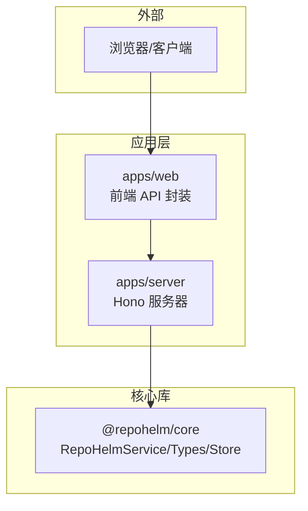
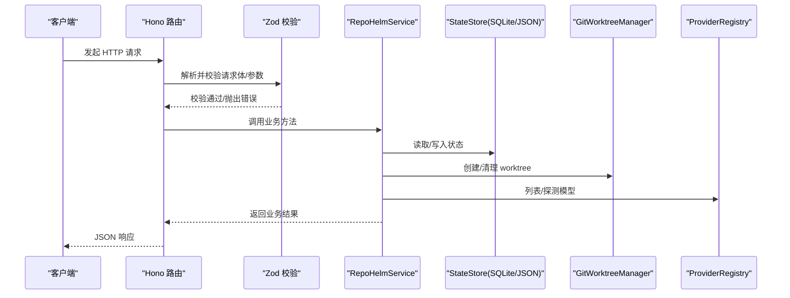
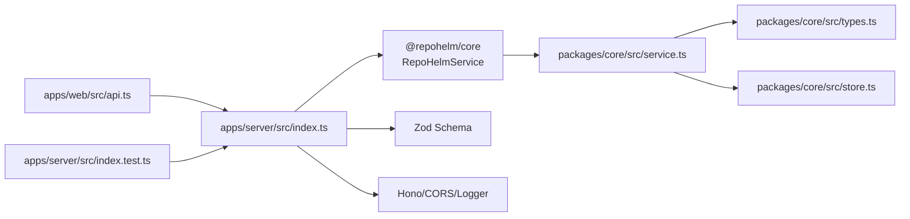

# 服务器 API 设计

<cite>
**本文引用的文件列表**
- [apps/server/src/index.ts](file://apps/server/src/index.ts)
- [apps/server/src/index.test.ts](file://apps/server/src/index.test.ts)
- [apps/web/src/api.ts](file://apps/web/src/api.ts)
- [packages/core/src/service.ts](file://packages/core/src/service.ts)
- [packages/core/src/types.ts](file://packages/core/src/types.ts)
- [packages/core/src/store.ts](file://packages/core/src/store.ts)
- [apps/server/package.json](file://apps/server/package.json)
- [packages/core/package.json](file://packages/core/package.json)
- [README.md](file://README.md)
</cite>

## 目录
1. [简介](#简介)
2. [项目结构](#项目结构)
3. [核心组件](#核心组件)
4. [架构总览](#架构总览)
5. [详细组件分析](#详细组件分析)
6. [依赖分析](#依赖分析)
7. [性能考量](#性能考量)
8. [故障排查指南](#故障排查指南)
9. [结论](#结论)
10. [附录](#附录)

## 简介
本文件为 RepoHelm 服务器 API 的全面设计文档，面向前端与集成开发者，系统性说明 RESTful API 的端点、请求/响应模式、数据验证（Zod）、路由与中间件、CORS 与安全策略、错误处理、版本与兼容性、客户端实现与性能优化、测试与调试方法，以及与核心服务的集成关系。RepoHelm 以 Hono 为基础构建 API，使用 Zod 对输入进行强类型校验，通过 @repohelm/core 提供业务逻辑与状态持久化。

**更新** 本次更新新增了完整的 ModelKit 管理能力，包括 ModelKit 的创建、测试、保存、更新、删除和查询，以及相关的 SubAgent 管理功能。

## 项目结构
- 应用层
  - 服务器应用：apps/server，基于 Hono，提供 REST API。
  - Web 前端：apps/web，提供调用 API 的封装函数与类型定义。
- 核心库
  - @repohelm/core：包含业务服务 RepoHelmService、类型定义、状态存储等。
- 其他
  - README.md 提供整体背景、启动方式与功能概览。

**图表来源**
- [apps/server/src/index.ts:39-49](file://apps/server/src/index.ts#L39-L49)
- [apps/web/src/api.ts:276-422](file://apps/web/src/api.ts#L276-L422)
- [packages/core/src/service.ts:56-71](file://packages/core/src/service.ts#L56-L71)

**章节来源**
- [apps/server/src/index.ts:1-536](file://apps/server/src/index.ts#L1-L536)
- [apps/web/src/api.ts:1-423](file://apps/web/src/api.ts#L1-L423)
- [packages/core/src/service.ts:1-1702](file://packages/core/src/service.ts#L1-L1702)
- [README.md:1-100](file://README.md#L1-L100)

## 核心组件
- Hono 服务器与中间件
  - 日志中间件：全局日志记录。
  - CORS 中间件：允许来自 http://localhost:5173 与 http://127.0.0.1:5173 的跨域请求，支持 GET/POST/PATCH/DELETE/OPTIONS，允许 Content-Type 头。
- 数据验证（Zod）
  - 为工作区、项目、引擎、提供商模型查询、安全策略、Quest、**ModelKit**、**SubAgent** 等输入建立严格 Schema，统一在路由层解析与校验。
- 核心服务（RepoHelmService）
  - 提供工作区管理、项目管理、引擎配置、提供商模型查询、安全策略、Quest 生命周期、Git worktree 管理、知识库检索与持久化、审计日志等能力。
  - **新增** ModelKit 管理：创建、测试、保存、更新、删除、查询 ModelKit。
  - **新增** SubAgent 管理：创建、更新、删除、查询 SubAgent，支持权限配置和模式切换。
- 状态存储（StateStore）
  - 支持 JSON 与 SQLite 两种实现，含迁移逻辑与默认配置。

**章节来源**
- [apps/server/src/index.ts:41-49](file://apps/server/src/index.ts#L41-L49)
- [apps/server/src/index.ts:51-144](file://apps/server/src/index.ts#L51-L144)
- [packages/core/src/service.ts:56-71](file://packages/core/src/service.ts#L56-L71)
- [packages/core/src/store.ts:86-165](file://packages/core/src/store.ts#L86-L165)

## 架构总览
服务器 API 采用"路由层 + 服务层 + 存储层"的分层设计：
- 路由层：Hono 路由注册与中间件装配，Zod 输入校验，统一错误处理。
- 服务层：RepoHelmService 组织业务流程，协调 Git、Provider、Knowledge、Audit、**ModelKit**、**SubAgent** 等子系统。
- 存储层：SqliteStateStore/JsonStateStore 提供状态持久化与迁移。

**图表来源**
- [apps/server/src/index.ts:114-536](file://apps/server/src/index.ts#L114-L536)
- [packages/core/src/service.ts:135-137](file://packages/core/src/service.ts#L135-L137)
- [packages/core/src/store.ts:125-139](file://packages/core/src/store.ts#L125-L139)

## 详细组件分析

### 路由与中间件
- 中间件
  - 日志中间件：对所有请求输出日志。
  - CORS 中间件：限定来源为本地开发端口，允许常见方法与 Content-Type。
- 错误处理
  - 全局 onError 捕获异常，统一返回 500 与错误消息。

**章节来源**
- [apps/server/src/index.ts:41-49](file://apps/server/src/index.ts#L41-L49)
- [apps/server/src/index.ts:523-531](file://apps/server/src/index.ts#L523-L531)

### 数据验证（Zod）与类型系统
- 输入校验 Schema
  - 工作区：名称必填，描述可选，worktreeRoot 可选。
  - 更新工作区：字段可部分提供。
  - 项目：名称、路径必填，角色、默认分支、验证命令可选。
  - 更新项目：字段可部分提供。
  - 引擎：mode/cliId/cliModels/byokProviders/activeByokProviderId 可选。
  - 提供商模型查询：baseUrl/apiKey/refresh 可选。
  - 安全策略：命令审批模式、允许命令、文件作用域、网络作用域、密钥策略、沙箱运行时可选。
  - Quest：workspaceId/title/requirement 必填，agentBackendId 可选，affectedProjectIds 可选。
  - **新增** ModelKit 创建：id/name/type/backendId/providerId/model/config/costTier/performanceProfile 可选。
  - **新增** ModelKit 更新：name/model/config/costTier/performanceProfile 可选。
  - **新增** ModelKit 测试：type/backendId/providerId/model/apiKey/baseUrl/name/costTier/performanceProfile 可选。
  - **新增** SubAgent 创建：id/name/role/capabilities/modelKitId/mode/permissions/promptTemplate 可选。
  - **新增** SubAgent 更新：name/role/capabilities/modelKitId/mode/permissions/promptTemplate 可选。
- 类型定义
  - 服务层与前端均使用统一类型定义，确保 API 与 UI 的一致性。

**章节来源**
- [apps/server/src/index.ts:51-144](file://apps/server/src/index.ts#L51-L144)
- [packages/core/src/types.ts:265-435](file://packages/core/src/types.ts#L265-L435)

### API 端点清单与规范

**更新** 新增 ModelKit 和 SubAgent 管理端点组

说明
- 所有端点均返回 JSON。
- 成功响应通常返回 200；资源创建返回 201。
- 查询参数通过 URL 查询字符串传递；路径参数通过 URL 路径占位符传递。
- 请求体为 JSON；Content-Type: application/json。
- 身份验证：本项目未实现鉴权中间件，API 未包含鉴权头或令牌。

#### ModelKit 管理端点
- 创建 ModelKit
  - 方法：POST
  - 路径：/api/model-kits
  - 请求体：name/type/backendId/providerId/model/config/costTier/performanceProfile（部分可选）
  - 功能：创建新的 ModelKit 配置
  - 响应：ModelKit（201）
- 更新 ModelKit
  - 方法：PATCH
  - 路径：/api/model-kits/:id
  - 参数：路径参数 id；请求体：name/model/config/costTier/performanceProfile（可选）
  - 功能：更新现有 ModelKit
  - 响应：ModelKit
- 删除 ModelKit
  - 方法：DELETE
  - 路径：/api/model-kits/:id
  - 参数：路径参数 id
  - 功能：删除 ModelKit（如被 SubAgent 引用，需先删除引用）
  - 响应：{ ok: true }
- 列出所有 ModelKits
  - 方法：GET
  - 路径：/api/model-kits
  - 功能：获取所有 ModelKit 列表
  - 响应：ModelKit[]
- 测试并保存 ModelKit
  - 方法：POST
  - 路径：/api/model-kits/test-and-save
  - 请求体：type/backendId/providerId/model/apiKey/baseUrl/name/costTier/performanceProfile（部分可选）
  - 功能：测试模型配置连通性并保存为 ModelKit
  - 响应：ModelKit（201）

#### SubAgent 管理端点
- 创建 SubAgent
  - 方法：POST
  - 路径：/api/sub-agents
  - 请求体：name/role/capabilities/modelKitId/mode/permissions/promptTemplate（部分可选）
  - 功能：创建新的 SubAgent
  - 响应：SubAgent（201）
- 更新 SubAgent
  - 方法：PATCH
  - 路径：/api/sub-agents/:id
  - 参数：路径参数 id；请求体：name/role/capabilities/modelKitId/mode/permissions/promptTemplate（可选）
  - 功能：更新现有 SubAgent
  - 响应：SubAgent
- 删除 SubAgent
  - 方法：DELETE
  - 路径：/api/sub-agents/:id
  - 参数：路径参数 id
  - 功能：删除 SubAgent（如为入口 SubAgent，需先设置其他入口）
  - 响应：{ ok: true }
- 列出所有 SubAgents
  - 方法：GET
  - 路径：/api/sub-agents
  - 功能：获取所有 SubAgent 列表
  - 响应：SubAgent[]
- 设置入口 SubAgent
  - 方法：POST
  - 路径：/api/sub-agents/set-entry
  - 请求体：id
  - 功能：设置入口 SubAgent（必须为 entry 模式）
  - 响应：{ ok: true }
- 获取入口 SubAgent
  - 方法：GET
  - 路径：/api/sub-agents/entry
  - 功能：获取当前入口 SubAgent
  - 响应：SubAgent 或 undefined

端点一览（其余端点保持不变）
- 健康检查
  - 方法：GET
  - 路径：/api/health
  - 功能：返回服务健康信息与根目录配置
  - 响应：包含 ok、name、rootDir、stateRootDir、worktreeRootDir、knowledgeRootDir
- 获取状态
  - 方法：GET
  - 路径：/api/state
  - 功能：返回 RepoHelm 全部状态
  - 响应：RepoHelmState
- Agent 后端列表
  - 方法：GET
  - 路径：/api/agent-backends
  - 功能：列出可用 Agent Backend
  - 响应：AgentBackendInfo[]
- 本地 CLI 列表
  - 方法：GET
  - 路径：/api/clis
  - 功能：列出本地 CLI
  - 响应：LocalCliInfo[]
- 重新扫描本地 CLI
  - 方法：POST
  - 路径：/api/clis/rescan
  - 功能：强制重新扫描本地 CLI
  - 响应：LocalCliInfo[]
- 测试本地 CLI
  - 方法：POST
  - 路径：/api/clis/:id/test
  - 参数：路径参数 id
  - 功能：测试指定 CLI 可用性
  - 响应：CliTestResult
- 提供商列表
  - 方法：GET
  - 路径：/api/providers
  - 功能：列出提供商信息
  - 响应：ProviderInfo[]
- 列举提供商模型
  - 方法：POST
  - 路径：/api/providers/:id/models
  - 参数：路径参数 id；请求体包含 baseUrl/apiKey/refresh
  - 功能：列举提供商模型（支持缓存与刷新）
  - 响应：ProviderModelsResult
- 测试提供商
  - 方法：POST
  - 路径：/api/providers/:id/test
  - 参数：路径参数 id；请求体包含 baseUrl/apiKey
  - 功能：探测提供商连通性与鉴权
  - 响应：CliTestResult
- 引擎配置
  - 方法：GET
  - 路径：/api/engine
  - 功能：获取引擎配置
  - 响应：EngineConfig
- 更新引擎配置
  - 方法：PATCH
  - 路径：/api/engine
  - 请求体：部分字段（mode/cliId/cliModels/byokProviders/activeByokProviderId）
  - 功能：更新引擎配置
  - 响应：EngineConfig
- 能力列表
  - 方法：GET
  - 路径：/api/capabilities
  - 功能：获取能力定义列表
  - 响应：CapabilityDefinition[]
- 安全策略
  - 方法：GET
  - 路径：/api/security-policy
  - 功能：获取安全策略
  - 响应：SecurityPolicy
- 审计日志
  - 方法：GET
  - 路径：/api/audit-log
  - 功能：获取审计日志
  - 响应：AuditLogEntry[]
- 更新安全策略
  - 方法：PATCH
  - 路径：/api/security-policy
  - 请求体：部分字段（commandApprovalMode/allowedCommands/fileScopes/networkScopes/secretsPolicy/sandboxRuntime）
  - 功能：更新安全策略
  - 响应：SecurityPolicy
- 产品就绪度
  - 方法：GET
  - 路径：/api/product-readiness
  - 参数：查询参数 workspaceId（可选）
  - 功能：获取产品就绪度指标
  - 响应：ProductReadiness
- 知识库检索
  - 方法：GET
  - 路径：/api/workspaces/:id/knowledge
  - 参数：路径参数 id；查询参数 q
  - 功能：按关键词检索知识库
  - 响应：KnowledgeItem[]
- 工作树列表
  - 方法：GET
  - 路径：/api/worktrees
  - 参数：查询参数 workspaceId（可选）
  - 功能：列出 Quest 关联的工作树
  - 响应：WorktreeState[]
- 创建工作区
  - 方法：POST
  - 路径：/api/workspaces
  - 请求体：name/description/worktreeRoot
  - 功能：创建新工作区
  - 响应：Workspace（201）
- 更新工作区
  - 方法：PATCH
  - 路径：/api/workspaces/:id
  - 参数：路径参数 id；请求体：name/description/worktreeRoot（可选）
  - 功能：更新工作区
  - 响应：Workspace
- 创建项目
  - 方法：POST
  - 路径：/api/projects
  - 请求体：name/path/role/defaultBranch/validationCommand
  - 功能：创建项目并写入知识库摘要
  - 响应：Project（201）
- 关联项目到工作区
  - 方法：POST
  - 路径：/api/workspaces/:id/links
  - 参数：路径参数 id；请求体：projectId
  - 功能：将项目链接到工作区，并创建 Git worktree
  - 响应：Workspace（201）
- 从工作区取消关联项目
  - 方法：DELETE
  - 路径：/api/workspaces/:id/links/:projectId
  - 参数：路径参数 id、projectId
  - 功能：从工作区取消关联并清理工作树
  - 响应：Workspace
- 更新项目
  - 方法：PATCH
  - 路径：/api/projects/:id
  - 参数：路径参数 id；请求体：name/path/role/defaultBranch/validationCommand（可选）
  - 功能：更新项目
  - 响应：Project
- 删除项目
  - 方法：DELETE
  - 路径：/api/projects/:id
  - 参数：路径参数 id
  - 功能：删除项目并级联清理工作树
  - 响应：RepoHelmState
- 检查项目健康
  - 方法：POST
  - 路径：/api/projects/:id/check
  - 参数：路径参数 id
  - 功能：检查项目健康状态
  - 响应：Project
- 打开项目目录
  - 方法：POST
  - 路径：/api/projects/:id/open-directory
  - 参数：路径参数 id
  - 功能：在本机打开项目目录（平台相关）
  - 响应：{ ok: boolean }
- 选择目录
  - 方法：POST
  - 路径：/api/pick-directory
  - 功能：macOS 下弹出目录选择器
  - 响应：{ path: string|null, error?: string }
- 列举分支
  - 方法：GET
  - 路径：/api/branches
  - 参数：查询参数 path（必填）
  - 功能：列举仓库分支与默认分支
  - 响应：{ branches: string[], defaultBranch: string }
- 创建 Quest
  - 方法：POST
  - 路径：/api/quests
  - 请求体：workspaceId/title/requirement/agentBackendId/affectedProjectIds
  - 功能：创建 Quest 并生成轻量 Spec 与能力推荐
  - 响应：Quest（201）
- 运行 Quest
  - 方法：POST
  - 路径：/api/quests/:id/run
  - 参数：路径参数 id
  - 功能：创建工作树、执行 Agent、生成验证与 Review 结果
  - 响应：Quest
- 重试 Quest
  - 方法：POST
  - 路径：/api/quests/:id/retry
  - 参数：路径参数 id
  - 功能：清理后重新运行
  - 响应：Quest
- 清理 Quest 工作树
  - 方法：POST
  - 路径：/api/quests/:id/cleanup
  - 参数：路径参数 id
  - 功能：清理工作树
  - 响应：Quest
- 交付 Quest
  - 方法：POST
  - 路径：/api/quests/:id/deliver
  - 参数：路径参数 id
  - 功能：交付（验证、提交、PR 准备/创建）
  - 响应：Quest
- 接受能力推荐
  - 方法：POST
  - 路径：/api/quests/:id/capabilities/:capabilityId/accept
  - 参数：路径参数 id、capabilityId
  - 功能：接受能力推荐
  - 响应：Quest
- 拒绝能力推荐
  - 方法：POST
  - 路径：/api/quests/:id/capabilities/:capabilityId/dismiss
  - 参数：路径参数 id、capabilityId
  - 功能：拒绝能力推荐
  - 响应：Quest

**章节来源**
- [apps/server/src/index.ts:419-521](file://apps/server/src/index.ts#L419-L521)

### 请求/响应示例与错误处理
- 示例
  - 获取状态：GET /api/state → 返回 RepoHelmState
  - 创建工作区：POST /api/workspaces → 请求体包含 name/description/worktreeRoot；响应 201 与 Workspace
  - 运行 Quest：POST /api/quests/:id/run → 返回 Quest
  - **新增** 创建 ModelKit：POST /api/model-kits → 请求体包含 name/type/backendId/model；响应 201 与 ModelKit
  - **新增** 测试并保存 ModelKit：POST /api/model-kits/test-and-save → 请求体包含 type/name/model；响应 201 与 ModelKit
- 错误处理
  - 全局 onError：捕获异常并返回 500 与错误消息。
  - 路由层 Zod 校验失败：将触发 400（由 Hono 默认行为处理，具体取决于框架行为）。
  - 业务异常：如"Workspace not found"、"Project not found"、"ModelKit not found"，服务层抛出错误，最终由全局 onError 捕获并返回 500。

**章节来源**
- [apps/server/src/index.ts:523-531](file://apps/server/src/index.ts#L523-L531)
- [packages/core/src/service.ts:163-164](file://packages/core/src/service.ts#L163-L164)
- [packages/core/src/service.ts:206-207](file://packages/core/src/service.ts#L206-L207)
- [packages/core/src/service.ts:307-309](file://packages/core/src/service.ts#L307-L309)

### CORS 配置与安全考虑
- CORS
  - 允许来源：http://localhost:5173、http://127.0.0.1:5173
  - 允许方法：GET、POST、PATCH、DELETE、OPTIONS
  - 允许头：Content-Type
- 安全策略
  - 本地安全策略：命令审批模式（allowlist/manual）、允许命令列表、文件作用域、网络作用域、密钥策略（redact-env/deny）、沙箱运行时（local/external）。
  - 审计日志：记录命令、文件、网络、密钥、能力、沙箱等类型的决策与详情。
  - 身份验证：未实现鉴权中间件，不包含 Authorization 头或令牌。

**章节来源**
- [apps/server/src/index.ts:42-49](file://apps/server/src/index.ts#L42-L49)
- [packages/core/src/types.ts:135-143](file://packages/core/src/types.ts#L135-L143)
- [packages/core/src/store.ts:13-24](file://packages/core/src/store.ts#L13-L24)

### 版本控制与向后兼容性
- 版本
  - 服务器与核心包版本均为 0.1.0（私有包），当前处于 MVP 骨架阶段。
- 兼容性
  - 状态存储支持从旧 JSON 迁移到 SQLite，并对引擎配置进行兼容迁移（byok -> byokProviders）。
  - 类型定义与 API 行为保持一致，前端通过统一类型定义对接。
  - **新增** ModelKit 和 SubAgent 功能作为扩展特性，不影响现有 API 兼容性。

**章节来源**
- [apps/server/package.json:1-22](file://apps/server/package.json#L1-L22)
- [packages/core/package.json:1-21](file://packages/core/package.json#L1-L21)
- [packages/core/src/store.ts:36-84](file://packages/core/src/store.ts#L36-L84)

### 客户端实现指南与性能优化
- 客户端实现
  - 前端封装：apps/web/src/api.ts 提供统一的请求函数与类型定义，便于在 UI 中直接调用。
  - 建议：使用 fetch 包装统一处理 4xx/5xx，提取错误消息，避免重复代码。
- 性能优化
  - 提供商模型缓存：ProviderModelsResult 支持缓存（TTL），减少频繁请求。
  - 分页与过滤：对大列表（如知识库、审计日志、ModelKit 列表）建议在前端分页或增加筛选参数。
  - 并发控制：批量操作（如多个 Quest 并行运行）需注意资源限制与并发队列。
  - **新增** ModelKit 缓存：ModelKit 配置可重复使用，减少重复测试开销。

**章节来源**
- [apps/web/src/api.ts:276-422](file://apps/web/src/api.ts#L276-L422)
- [packages/core/src/service.ts:422-455](file://packages/core/src/service.ts#L422-L455)

### API 测试与调试
- 单元测试
  - @repohelm/core 提供 vitest 测试，覆盖工作区引导、SQLite 迁移、知识文件写入、Quest 创建、能力推荐、安全策略、真实 worktree、mock/CLI Agent、diff 读取、清理、重试、交付、产品就绪度等。
  - **新增** ModelKit 测试：覆盖创建、更新、删除、查询、测试保存等完整 CRUD 场景。
- 端到端测试
  - e2e 使用 Playwright，覆盖从 UI 创建 Quest、生成 Spec、确认能力推荐、运行 Quest、搜索知识库、展示 worktree/review/diff、交付、清理、安全审计、产品就绪度与 CLI backend 的主流程。
- 调试
  - 启用日志中间件，观察请求与响应。
  - 使用 /api/health 检查服务状态与根目录配置。
  - 通过 /api/audit-log 查看审计记录。
  - **新增** 使用 /api/model-kits 和 /api/sub-agents 验证 ModelKit 和 SubAgent 管理功能。

**章节来源**
- [README.md:79-85](file://README.md#L79-L85)
- [apps/server/src/index.ts:41-49](file://apps/server/src/index.ts#L41-L49)
- [apps/server/src/index.ts:114-123](file://apps/server/src/index.ts#L114-L123)

## 依赖分析

**图表来源**
- [apps/server/src/index.ts:1-11](file://apps/server/src/index.ts#L1-L11)
- [apps/web/src/api.ts:276-422](file://apps/web/src/api.ts#L276-L422)
- [packages/core/src/service.ts:1-39](file://packages/core/src/service.ts#L1-L39)
- [packages/core/src/types.ts:1-334](file://packages/core/src/types.ts#L1-L334)
- [packages/core/src/store.ts:1-89](file://packages/core/src/store.ts#L1-L89)

**章节来源**
- [apps/server/src/index.ts:1-11](file://apps/server/src/index.ts#L1-L11)
- [apps/web/src/api.ts:276-422](file://apps/web/src/api.ts#L276-L422)
- [packages/core/src/service.ts:1-39](file://packages/core/src/service.ts#L1-L39)

## 性能考量
- 模型缓存：ProviderModelsResult 支持缓存（TTL），refresh=true 可强制刷新，降低对外部提供商的请求压力。
- 并发与资源：同时运行多个 Quest 时，注意 Git worktree 创建与外部 CLI 执行的资源占用。
- 状态持久化：SQLite 相比 JSON 更适合增量写入与并发场景，建议在生产环境优先使用 SqliteStateStore。
- **新增** ModelKit 性能：ModelKit 配置可复用，避免重复测试开销；支持成本等级和性能配置优化资源使用。

**章节来源**
- [packages/core/src/service.ts:422-455](file://packages/core/src/service.ts#L422-L455)
- [packages/core/src/store.ts:117-165](file://packages/core/src/store.ts#L117-L165)

## 故障排查指南
- 常见错误
  - "Workspace not found" / "Project not found"：检查路径参数与数据库状态。
  - "ModelKit not found"：检查 ModelKit ID 是否正确，确认是否存在。
  - "SubAgent not found"：检查 SubAgent ID 是否正确，确认是否存在。
  - macOS 目录选择器：仅支持 macOS，其他平台返回空路径。
  - 分支枚举失败：当路径无效时返回默认分支与空列表。
- 排查步骤
  - 使用 /api/health 确认服务可用与根目录配置。
  - 使用 /api/state 检查当前状态。
  - 使用 /api/audit-log 审核最近决策与拒绝原因。
  - 使用 /api/security-policy 检查安全策略是否过严导致命令被阻断。
  - **新增** 使用 /api/model-kits 和 /api/sub-agents 检查 ModelKit 和 SubAgent 状态。

**章节来源**
- [apps/server/src/index.ts:273-291](file://apps/server/src/index.ts#L273-L291)
- [apps/server/src/index.ts:293-304](file://apps/server/src/index.ts#L293-L304)
- [packages/core/src/service.ts:163-164](file://packages/core/src/service.ts#L163-L164)
- [packages/core/src/service.ts:206-207](file://packages/core/src/service.ts#L206-L207)
- [packages/core/src/service.ts:307-309](file://packages/core/src/service.ts#L307-L309)

## 结论
RepoHelm 服务器 API 以 Hono 为核心，结合 Zod 强类型校验与 @repohelm/core 业务服务，提供了围绕 Quest 工作区的完整 REST API。其设计强调安全性（本地安全策略与审计日志）、可观测性（日志与审计）、可维护性（统一类型与中间件）。当前版本为 MVP，**新增的 ModelKit 和 SubAgent 管理功能**进一步增强了模型配置管理和代理编排能力。建议在生产环境中启用更严格的鉴权与限流策略，并根据业务增长引入分页与缓存优化。

## 附录

### API 端点与参数对照表
- 健康检查：GET /api/health
- 获取状态：GET /api/state
- Agent 后端列表：GET /api/agent-backends
- 本地 CLI 列表：GET /api/clis
- 重新扫描 CLI：POST /api/clis/rescan
- 测试 CLI：POST /api/clis/:id/test
- 提供商列表：GET /api/providers
- 列举提供商模型：POST /api/providers/:id/models（请求体：baseUrl/apiKey/refresh）
- 测试提供商：POST /api/providers/:id/test（请求体：baseUrl/apiKey）
- 引擎配置：GET /api/engine
- 更新引擎配置：PATCH /api/engine（请求体：部分字段）
- 能力列表：GET /api/capabilities
- 安全策略：GET /api/security-policy
- 审计日志：GET /api/audit-log
- 更新安全策略：PATCH /api/security-policy（请求体：部分字段）
- 产品就绪度：GET /api/product-readiness?workspaceId=...
- 知识库检索：GET /api/workspaces/:id/knowledge?q=...
- 工作树列表：GET /api/worktrees?workspaceId=...
- 创建工作区：POST /api/workspaces（请求体：name/description/worktreeRoot）
- 更新工作区：PATCH /api/workspaces/:id（请求体：部分字段）
- 创建项目：POST /api/projects（请求体：name/path/role/defaultBranch/validationCommand）
- 关联项目到工作区：POST /api/workspaces/:id/links（请求体：projectId）
- 取消关联项目：DELETE /api/workspaces/:id/links/:projectId
- 更新项目：PATCH /api/projects/:id（请求体：部分字段）
- 删除项目：DELETE /api/projects/:id
- 检查项目健康：POST /api/projects/:id/check
- 打开项目目录：POST /api/projects/:id/open-directory
- 选择目录：POST /api/pick-directory
- 列举分支：GET /api/branches?path=...
- 创建 Quest：POST /api/quests（请求体：workspaceId/title/requirement/agentBackendId/affectedProjectIds）
- 运行 Quest：POST /api/quests/:id/run
- 重试 Quest：POST /api/quests/:id/retry
- 清理 Quest 工作树：POST /api/quests/:id/cleanup
- 交付 Quest：POST /api/quests/:id/deliver
- 接受能力推荐：POST /api/quests/:id/capabilities/:capabilityId/accept
- 拒绝能力推荐：POST /api/quests/:id/capabilities/:capabilityId/dismiss

**新增** ModelKit 管理端点
- 创建 ModelKit：POST /api/model-kits（请求体：name/type/backendId/providerId/model/config/costTier/performanceProfile）
- 更新 ModelKit：PATCH /api/model-kits/:id（请求体：部分字段）
- 删除 ModelKit：DELETE /api/model-kits/:id
- 列出 ModelKits：GET /api/model-kits
- 测试并保存 ModelKit：POST /api/model-kits/test-and-save（请求体：type/backendId/providerId/model/apiKey/baseUrl/name/costTier/performanceProfile）

**新增** SubAgent 管理端点
- 创建 SubAgent：POST /api/sub-agents（请求体：name/role/capabilities/modelKitId/mode/permissions/promptTemplate）
- 更新 SubAgent：PATCH /api/sub-agents/:id（请求体：部分字段）
- 删除 SubAgent：DELETE /api/sub-agents/:id
- 列出 SubAgents：GET /api/sub-agents
- 设置入口 SubAgent：POST /api/sub-agents/set-entry（请求体：id）
- 获取入口 SubAgent：GET /api/sub-agents/entry

**章节来源**
- [apps/server/src/index.ts:114-521](file://apps/server/src/index.ts#L114-L521)