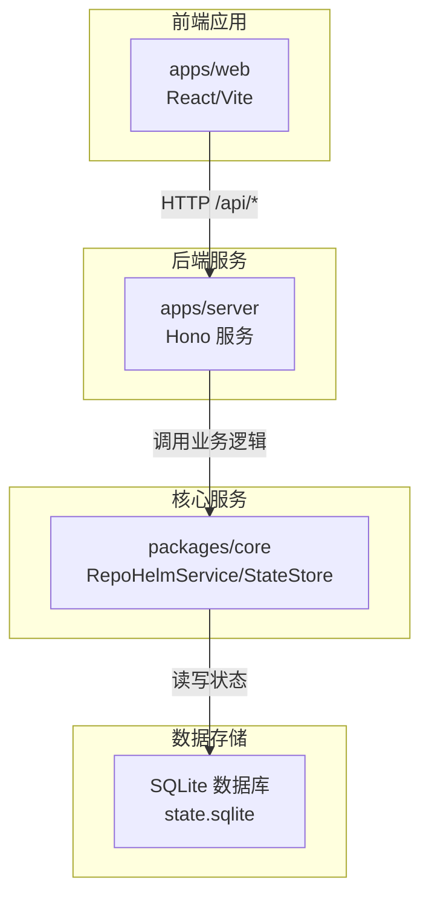
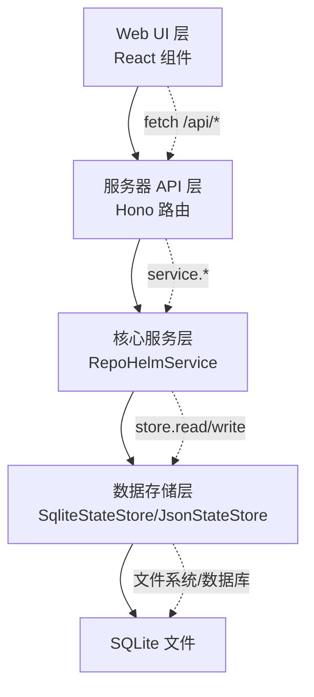
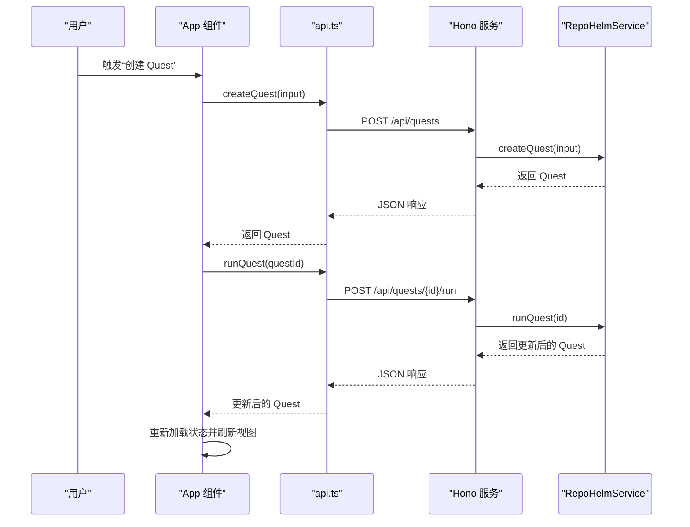
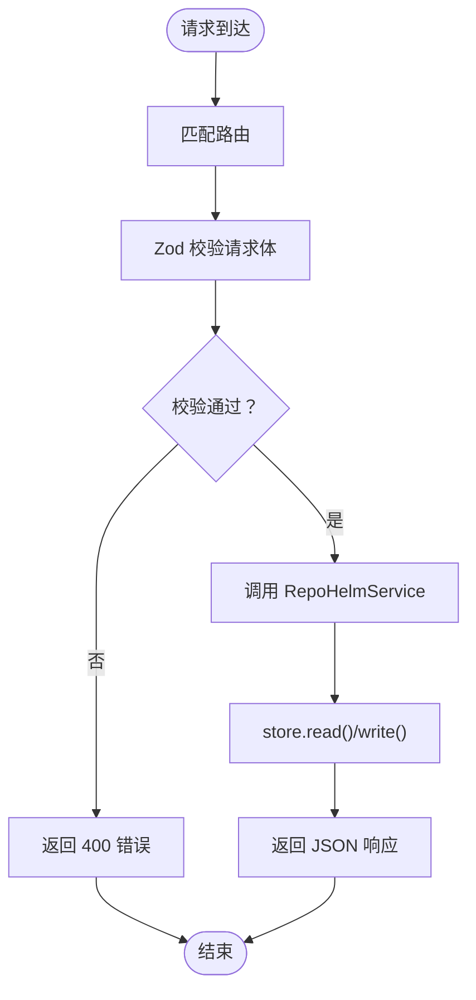
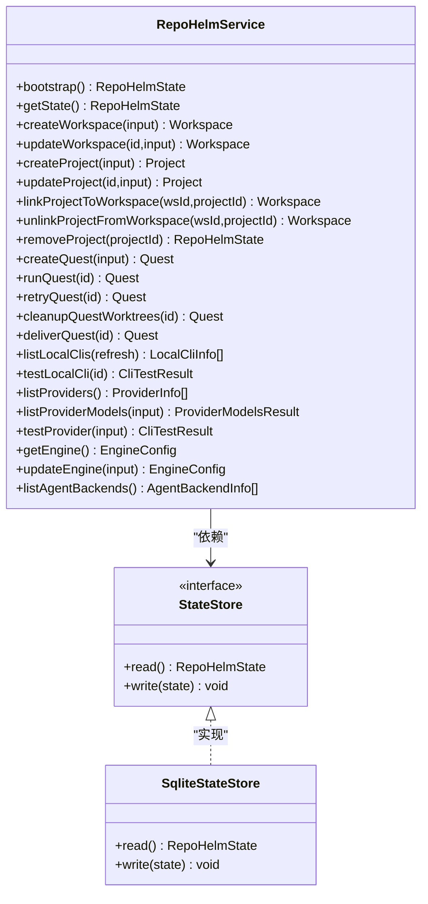
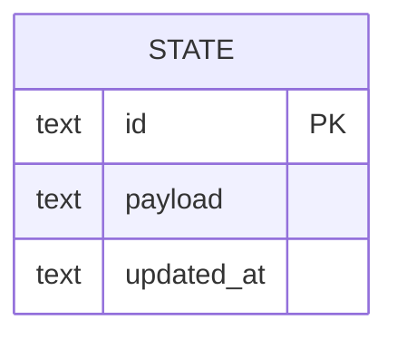
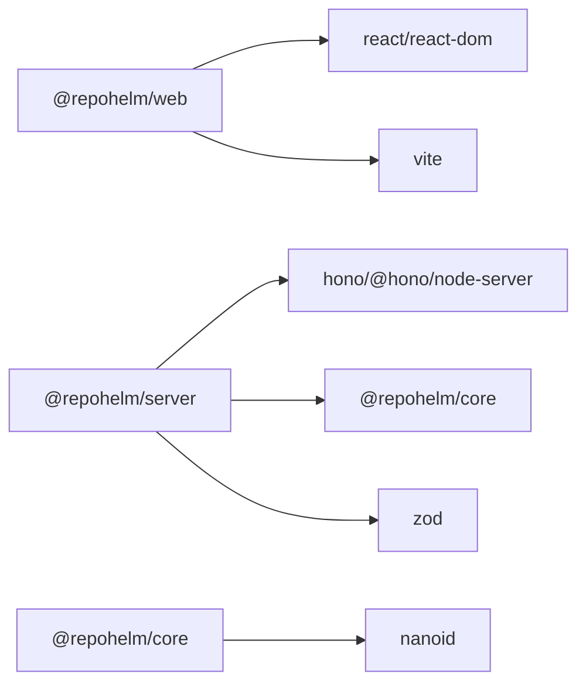

# 分层架构设计

<cite>
**本文档引用的文件**
- [apps/web/src/App.tsx](file://apps/web/src/App.tsx)
- [apps/web/src/api.ts](file://apps/web/src/api.ts)
- [apps/web/src/components/CommandPalette.tsx](file://apps/web/src/components/CommandPalette.tsx)
- [apps/web/src/components/Select.tsx](file://apps/web/src/components/Select.tsx)
- [apps/web/src/lib/utils.ts](file://apps/web/src/lib/utils.ts)
- [apps/web/vite.config.ts](file://apps/web/vite.config.ts)
- [apps/server/src/index.ts](file://apps/server/src/index.ts)
- [packages/core/src/service.ts](file://packages/core/src/service.ts)
- [packages/core/src/store.ts](file://packages/core/src/store.ts)
- [packages/core/src/types.ts](file://packages/core/src/types.ts)
- [apps/web/package.json](file://apps/web/package.json)
- [apps/server/package.json](file://apps/server/package.json)
- [packages/core/package.json](file://packages/core/package.json)
- [package.json](file://package.json)
</cite>

## 目录
1. [简介](#简介)
2. [项目结构](#项目结构)
3. [核心组件](#核心组件)
4. [架构总览](#架构总览)
5. [详细组件分析](#详细组件分析)
6. [依赖关系分析](#依赖关系分析)
7. [性能考虑](#性能考虑)
8. [故障排除指南](#故障排除指南)
9. [结论](#结论)

## 简介
本文件为 RepoHelm 的分层架构设计文档，围绕四层架构进行系统化说明：Web UI 层（React 组件与 Vite 开发服务器）、服务器 API 层（Hono 服务）、核心服务层（RepoHelmService）与数据存储层（SQLite）。文档阐述每层职责边界、接口定义、依赖关系与交互机制，提供层间依赖图与调用流程图，并总结分层架构在关注点分离、可测试性与可维护性方面的优势。

## 项目结构
RepoHelm 采用 monorepo 结构，通过 pnpm workspace 管理多包：
- apps/web：前端应用，使用 React + Vite，开发时通过代理转发 /api 到后端服务
- apps/server：后端服务，基于 Hono，暴露 REST API 并委托给核心服务层
- packages/core：核心业务逻辑与数据持久化，包含 RepoHelmService、StateStore、类型定义等
- 顶层 package.json 提供统一开发脚本，支持前后端并发启动

图表来源
- [apps/web/vite.config.ts:1-16](file://apps/web/vite.config.ts#L1-L16)
- [apps/server/src/index.ts:1-366](file://apps/server/src/index.ts#L1-L366)
- [packages/core/src/store.ts:117-166](file://packages/core/src/store.ts#L117-L166)

章节来源
- [package.json:7-14](file://package.json#L7-L14)
- [apps/web/package.json:1-34](file://apps/web/package.json#L1-L34)
- [apps/server/package.json:1-22](file://apps/server/package.json#L1-L22)
- [packages/core/package.json:1-21](file://packages/core/package.json#L1-L21)

## 核心组件
- Web UI 层（apps/web）
  - 负责用户界面渲染、事件处理与状态展示
  - 通过 api.ts 封装的请求函数与后端交互
  - 使用 Vite 开发服务器，配置代理将 /api 请求转发至后端
- 服务器 API 层（apps/server）
  - 基于 Hono 构建 REST API，统一处理 CORS、日志与错误
  - 对外暴露资源接口（工作区、项目、Quest、引擎配置、安全策略等）
  - 参数校验使用 Zod，确保输入合法性
- 核心服务层（packages/core）
  - RepoHelmService：编排业务流程（创建/运行/交付 Quest、管理 worktree、知识库、审计日志等）
  - StateStore：抽象状态存储接口，JsonStateStore 与 SqliteStateStore 两种实现
  - 类型系统：types.ts 定义所有领域模型与 API 输入输出类型
- 数据存储层（SQLite）
  - 以单表 state 存储完整 RepoHelm 状态，包含工作区、项目、Quest、事件、知识、能力、安全策略、引擎配置与模型缓存

章节来源
- [apps/web/src/App.tsx:85-660](file://apps/web/src/App.tsx#L85-L660)
- [apps/web/src/api.ts:276-423](file://apps/web/src/api.ts#L276-L423)
- [apps/web/vite.config.ts:5-15](file://apps/web/vite.config.ts#L5-L15)
- [apps/server/src/index.ts:39-366](file://apps/server/src/index.ts#L39-L366)
- [packages/core/src/service.ts:56-800](file://packages/core/src/service.ts#L56-L800)
- [packages/core/src/store.ts:86-166](file://packages/core/src/store.ts#L86-L166)
- [packages/core/src/types.ts:1-334](file://packages/core/src/types.ts#L1-L334)

## 架构总览
四层架构的职责边界清晰：
- Web UI 层：纯前端逻辑，不直接访问数据库，只通过 /api 与后端通信
- 服务器 API 层：路由与中间件，参数校验与错误处理，不包含业务规则
- 核心服务层：业务规则与流程编排，封装复杂状态变更与外部集成
- 数据存储层：持久化与迁移，屏蔽读写细节

图表来源
- [apps/web/src/App.tsx:136-148](file://apps/web/src/App.tsx#L136-L148)
- [apps/server/src/index.ts:125-128](file://apps/server/src/index.ts#L125-L128)
- [packages/core/src/service.ts:135-137](file://packages/core/src/service.ts#L135-L137)
- [packages/core/src/store.ts:117-166](file://packages/core/src/store.ts#L117-L166)

## 详细组件分析

### Web UI 层（React 组件）
- 应用入口与状态管理
  - App 组件负责加载初始状态、监听主题与列宽偏好、处理用户交互
  - 通过 api.state()、api.agentBackends()、api.productReadiness() 并行初始化
- 交互流程
  - 创建 Quest、运行 Quest、交付 Quest、接受/拒绝能力推荐等均通过 api.* 方法触发
  - 错误通过本地状态 error 展示，避免全局异常中断
- 组件体系
  - CommandPalette：全局命令面板，支持快捷键与 Workspace 切换
  - Select：自定义下拉选择组件，统一样式与无障碍属性
  - 工具函数 cn：基于 clsx/tailwind-merge 的类名合并工具

图表来源
- [apps/web/src/App.tsx:217-247](file://apps/web/src/App.tsx#L217-L247)
- [apps/web/src/App.tsx:249-264](file://apps/web/src/App.tsx#L249-L264)
- [apps/web/src/api.ts:336-350](file://apps/web/src/api.ts#L336-L350)
- [apps/server/src/index.ts:317-321](file://apps/server/src/index.ts#L317-L321)
- [apps/server/src/index.ts:323-326](file://apps/server/src/index.ts#L323-L326)
- [packages/core/src/service.ts:478-542](file://packages/core/src/service.ts#L478-L542)
- [packages/core/src/service.ts:544-698](file://packages/core/src/service.ts#L544-L698)

章节来源
- [apps/web/src/App.tsx:85-660](file://apps/web/src/App.tsx#L85-L660)
- [apps/web/src/api.ts:276-423](file://apps/web/src/api.ts#L276-L423)
- [apps/web/src/components/CommandPalette.tsx:1-101](file://apps/web/src/components/CommandPalette.tsx#L1-L101)
- [apps/web/src/components/Select.tsx:1-69](file://apps/web/src/components/Select.tsx#L1-L69)
- [apps/web/src/lib/utils.ts:1-8](file://apps/web/src/lib/utils.ts#L1-L8)

### 服务器 API 层（Hono 服务）
- 路由职责
  - /api/state、/api/agent-backends、/api/workspaces、/api/projects、/api/quests 等
  - 对每个资源提供标准 CRUD 与特定动作（如 run、deliver、cleanup、test）
- 中间件与校验
  - CORS 允许本地开发源，日志中间件记录请求
  - 使用 Zod 对请求体进行严格校验，保证输入一致性
- 错误处理
  - 全局 onError 捕获异常并返回统一格式的错误响应

图表来源
- [apps/server/src/index.ts:41-49](file://apps/server/src/index.ts#L41-L49)
- [apps/server/src/index.ts:51-112](file://apps/server/src/index.ts#L51-L112)
- [apps/server/src/index.ts:125-128](file://apps/server/src/index.ts#L125-L128)
- [apps/server/src/index.ts:353-361](file://apps/server/src/index.ts#L353-L361)
- [packages/core/src/store.ts:125-148](file://packages/core/src/store.ts#L125-L148)

章节来源
- [apps/server/src/index.ts:39-366](file://apps/server/src/index.ts#L39-L366)

### 核心服务层（RepoHelmService）
- 业务编排
  - 状态引导：bootstrap 读取/迁移/写入初始状态
  - 资源管理：创建工作区、项目、链接/解绑项目到工作区
  - Quest 生命周期：创建、运行（含 worktree 创建与变更检测）、清理、重试、交付
  - 引擎与提供商：查询/测试本地 CLI、列出/测试提供商模型、更新引擎配置
  - 安全与审计：评估命令权限、记录审计日志
- 状态存储
  - 通过 StateStore 抽象读写，支持 JsonStateStore 与 SqliteStateStore
  - 迁移逻辑兼容旧版 byok 字段到新版 byokProviders

图表来源
- [packages/core/src/service.ts:56-800](file://packages/core/src/service.ts#L56-L800)
- [packages/core/src/store.ts:86-166](file://packages/core/src/store.ts#L86-L166)

章节来源
- [packages/core/src/service.ts:73-137](file://packages/core/src/service.ts#L73-L137)
- [packages/core/src/service.ts:143-339](file://packages/core/src/service.ts#L143-L339)
- [packages/core/src/service.ts:478-760](file://packages/core/src/service.ts#L478-L760)
- [packages/core/src/store.ts:117-166](file://packages/core/src/store.ts#L117-L166)

### 数据存储层（SQLite）
- 设计要点
  - 单表 state：id、payload、updated_at；payload 为完整 RepoHelmState 的 JSON
  - 首次访问自动创建表，支持 ON CONFLICT 更新
  - 支持从旧版 JsonStateStore 迁移
- 性能与可靠性
  - 原子写入（单条 INSERT/UPDATE），减少并发冲突
  - 与核心服务层解耦，便于替换为其他存储实现

图表来源
- [packages/core/src/store.ts:150-164](file://packages/core/src/store.ts#L150-L164)

章节来源
- [packages/core/src/store.ts:117-166](file://packages/core/src/store.ts#L117-L166)

## 依赖关系分析
- 包依赖
  - apps/server 依赖 @repohelm/core
  - apps/web 依赖 @repohelm/types（通过 api.ts 导出的类型）
  - 顶层脚本通过 concurrently 同时启动前端与后端
- 运行时依赖
  - 前端通过 Vite 代理将 /api 请求转发至后端（默认 4300 端口）
  - 后端通过环境变量控制根目录、状态目录、worktree 与知识库目录

图表来源
- [apps/web/package.json:11-26](file://apps/web/package.json#L11-L26)
- [apps/server/package.json:11-16](file://apps/server/package.json#L11-L16)
- [packages/core/package.json:13-15](file://packages/core/package.json#L13-L15)
- [package.json:8](file://package.json#L8)

章节来源
- [apps/web/vite.config.ts:5-15](file://apps/web/vite.config.ts#L5-L15)
- [apps/server/src/index.ts:24-37](file://apps/server/src/index.ts#L24-L37)

## 性能考虑
- 前端
  - 并行初始化：App 在首次加载时并行获取状态、Agent 后端与产品就绪度，缩短首屏时间
  - 本地偏好存储：列宽与主题通过 localStorage 缓存，减少重复计算
- 后端
  - Zod 校验前置，避免无效请求进入业务逻辑
  - Provider 模型列表带缓存（TTL），降低对外部服务的频繁调用
- 存储
  - SQLite 单表写入，避免复杂事务；迁移时一次性写入，减少碎片

## 故障排除指南
- 常见错误与定位
  - 404/400：检查路由是否正确，确认请求体与 Zod 模式一致
  - 500：查看后端日志，确认 onError 是否捕获异常并返回错误信息
  - 前端网络错误：确认 Vite 代理配置与后端端口一致
- 建议排查步骤
  - 确认后端服务已启动且监听端口
  - 检查 /api 前缀是否被正确代理
  - 查看浏览器 Network 面板与后端日志
  - 若涉及安全策略，检查审计日志与命令权限评估结果

章节来源
- [apps/server/src/index.ts:353-361](file://apps/server/src/index.ts#L353-L361)
- [apps/web/vite.config.ts:11-13](file://apps/web/vite.config.ts#L11-L13)

## 结论
RepoHelm 的四层架构实现了清晰的关注点分离：UI 层专注用户体验，API 层专注协议与校验，服务层专注业务编排，存储层专注持久化。该设计提升了系统的可测试性（可通过注入 StateStore 与外部依赖进行单元测试）、可维护性（职责明确、边界清晰）与扩展性（易于替换存储或引入新的 Agent 后端）。配合 Vite 代理与 Hono 中间件，系统在开发与生产环境中均具备良好的开发体验与运行稳定性。