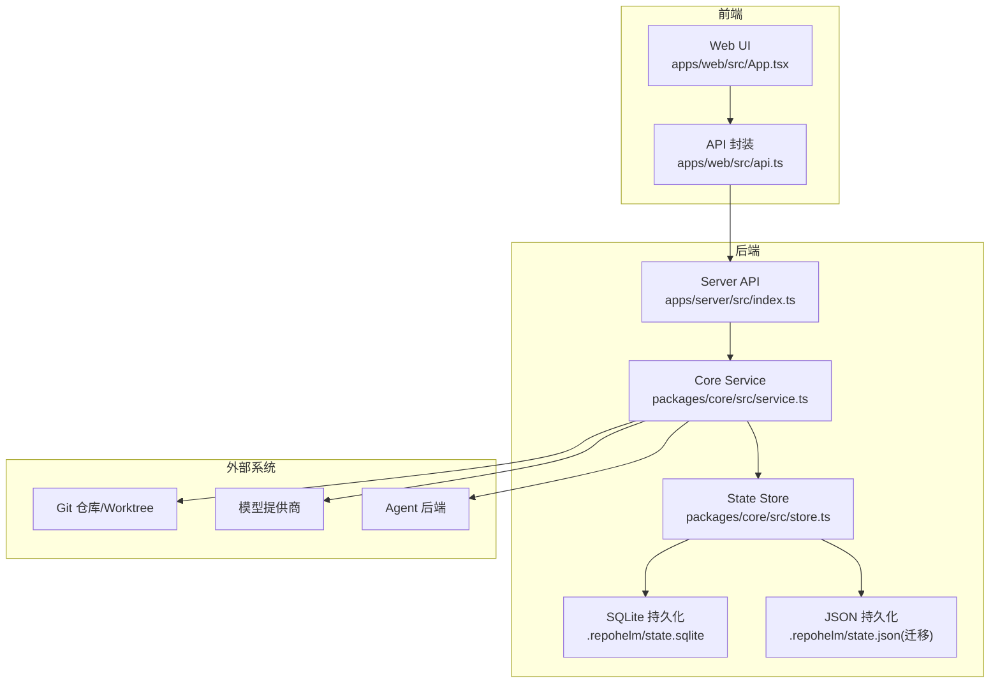
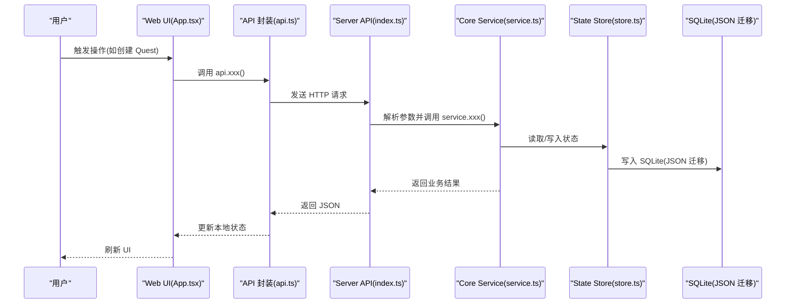
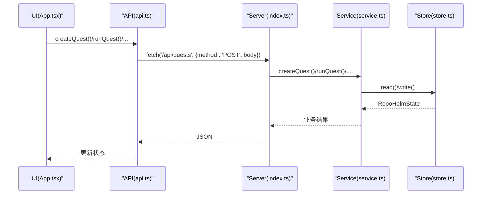
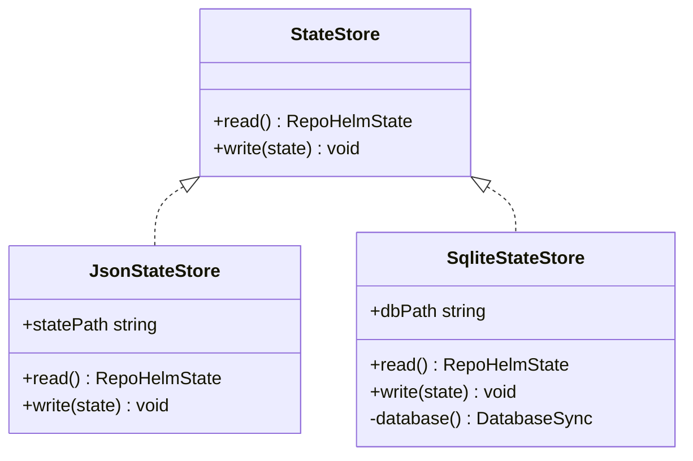
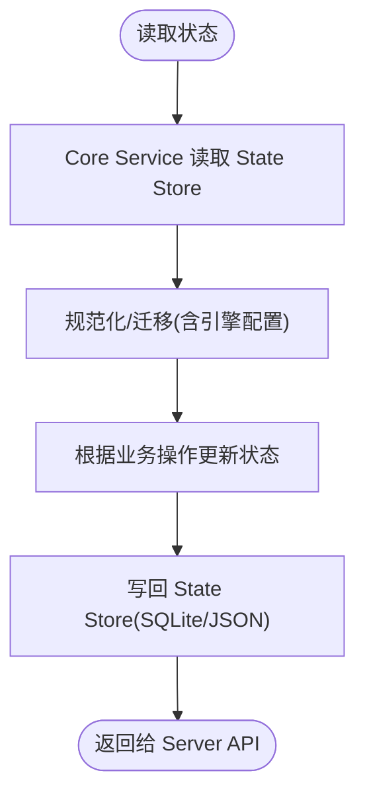
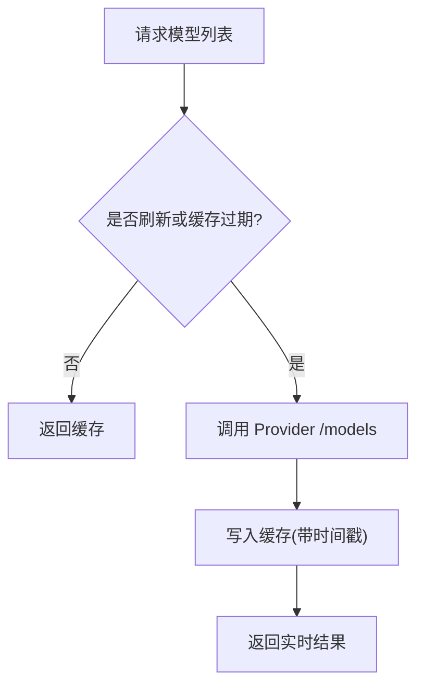
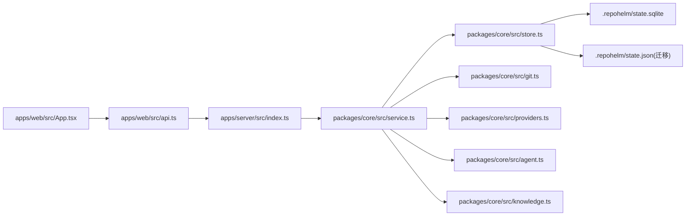

# 数据流设计

<cite>
**本文档引用的文件**
- [README.md](file://README.md)
- [apps/web/src/App.tsx](file://apps/web/src/App.tsx)
- [apps/web/src/api.ts](file://apps/web/src/api.ts)
- [apps/server/src/index.ts](file://apps/server/src/index.ts)
- [packages/core/src/index.ts](file://packages/core/src/index.ts)
- [packages/core/src/store.ts](file://packages/core/src/store.ts)
- [packages/core/src/service.ts](file://packages/core/src/service.ts)
- [packages/core/src/types.ts](file://packages/core/src/types.ts)
- [packages/core/src/agent.ts](file://packages/core/src/agent.ts)
- [packages/core/src/git.ts](file://packages/core/src/git.ts)
- [packages/core/src/knowledge.ts](file://packages/core/src/knowledge.ts)
- [packages/core/src/providers.ts](file://packages/core/src/providers.ts)
- [packages/core/src/cli.ts](file://packages/core/src/cli.ts)
</cite>

## 目录
1. [简介](#简介)
2. [项目结构](#项目结构)
3. [核心组件](#核心组件)
4. [架构总览](#架构总览)
5. [详细组件分析](#详细组件分析)
6. [依赖关系分析](#依赖关系分析)
7. [性能考量](#性能考量)
8. [故障排查指南](#故障排查指南)
9. [结论](#结论)

## 简介
本文件面向 RepoHelm 的数据流设计，聚焦“Web UI → Server API → Core Service → State Store → 持久化存储”的完整链路，解释用户操作如何转化为状态持久化与工作树（worktree）变更，以及数据在各层之间的转换、状态管理与缓存策略。同时给出数据流图与状态转换图，帮助开发者与使用者理解端到端的数据路径与一致性保障。

## 项目结构
RepoHelm 采用前后端分离的多包架构：
- Web 前端：React 应用，负责用户界面与 API 调用封装
- Server API：基于 Hono 的 Node 服务器，暴露 REST API
- Core 包：核心业务逻辑、状态存储、Git 工作树管理、知识库、Agent 后端等

图表来源
- [apps/web/src/App.tsx:136-148](file://apps/web/src/App.tsx#L136-L148)
- [apps/web/src/api.ts:291-422](file://apps/web/src/api.ts#L291-L422)
- [apps/server/src/index.ts:125-365](file://apps/server/src/index.ts#L125-L365)
- [packages/core/src/service.ts:73-137](file://packages/core/src/service.ts#L73-L137)
- [packages/core/src/store.ts:91-165](file://packages/core/src/store.ts#L91-L165)

章节来源
- [README.md:1-100](file://README.md#L1-L100)
- [apps/web/src/App.tsx:85-152](file://apps/web/src/App.tsx#L85-L152)
- [apps/server/src/index.ts:13-37](file://apps/server/src/index.ts#L13-L37)

## 核心组件
- Web UI 与 API 封装：负责用户交互、状态加载与 API 调用
- Server API：路由与参数校验、调用 Core Service、返回 JSON
- Core Service：业务编排、状态读写、Git 工作树、知识库、Agent 后端、安全策略
- State Store：抽象状态读写接口，支持 JSON 与 SQLite 两种实现
- 外部集成：Git、模型提供商、Agent 后端

章节来源
- [apps/web/src/api.ts:265-274](file://apps/web/src/api.ts#L265-L274)
- [apps/server/src/index.ts:125-365](file://apps/server/src/index.ts#L125-L365)
- [packages/core/src/service.ts:56-71](file://packages/core/src/service.ts#L56-L71)
- [packages/core/src/store.ts:86-165](file://packages/core/src/store.ts#L86-L165)

## 架构总览
下图展示从用户操作到状态持久化的端到端数据流：

图表来源
- [apps/web/src/App.tsx:217-247](file://apps/web/src/App.tsx#L217-L247)
- [apps/web/src/api.ts:336-346](file://apps/web/src/api.ts#L336-L346)
- [apps/server/src/index.ts:317-321](file://apps/server/src/index.ts#L317-L321)
- [packages/core/src/service.ts:478-542](file://packages/core/src/service.ts#L478-L542)
- [packages/core/src/store.ts:98-114](file://packages/core/src/store.ts#L98-L114)

## 详细组件分析

### Web UI → Server API → Core Service 的调用链
- Web UI 通过 React 组件触发用户动作，调用 api.ts 中的函数封装
- api.ts 将请求转发至 /api/* 路由，Server API 使用 Zod 校验请求体
- Server API 调用 Core Service 的方法，返回 JSON 响应
- Core Service 对状态进行读取/写入，必要时调用 Git、Provider、Agent 后端

图表来源
- [apps/web/src/App.tsx:217-247](file://apps/web/src/App.tsx#L217-L247)
- [apps/web/src/api.ts:336-370](file://apps/web/src/api.ts#L336-L370)
- [apps/server/src/index.ts:317-351](file://apps/server/src/index.ts#L317-L351)
- [packages/core/src/service.ts:478-698](file://packages/core/src/service.ts#L478-L698)
- [packages/core/src/store.ts:98-114](file://packages/core/src/store.ts#L98-L114)

章节来源
- [apps/web/src/App.tsx:136-148](file://apps/web/src/App.tsx#L136-L148)
- [apps/web/src/api.ts:291-422](file://apps/web/src/api.ts#L291-L422)
- [apps/server/src/index.ts:125-365](file://apps/server/src/index.ts#L125-L365)
- [packages/core/src/service.ts:73-137](file://packages/core/src/service.ts#L73-L137)

### State Store 与持久化存储
- State Store 抽象了读写接口，支持 JSON 与 SQLite 两种实现
- SQLite 实现具备表结构与冲突更新策略，首次读取若无记录则回退到 JSON 迁移
- JSON 实现用于历史兼容与首次引导

图表来源
- [packages/core/src/store.ts:86-165](file://packages/core/src/store.ts#L86-L165)

章节来源
- [packages/core/src/store.ts:91-165](file://packages/core/src/store.ts#L91-L165)

### 数据转换与状态管理模式
- 类型定义集中在 types.ts，统一了 RepoHelmState、Quest、Workspace、Project、ChangedFile 等核心结构
- Core Service 在运行时对状态进行规范化、迁移与写回，确保结构一致性
- Web UI 通过 useMemo/useEffect 管理本地状态与 UI 响应

图表来源
- [packages/core/src/service.ts:73-137](file://packages/core/src/service.ts#L73-L137)
- [packages/core/src/store.ts:98-114](file://packages/core/src/store.ts#L98-L114)
- [packages/core/src/types.ts:279-290](file://packages/core/src/types.ts#L279-L290)

章节来源
- [packages/core/src/types.ts:1-334](file://packages/core/src/types.ts#L1-L334)
- [packages/core/src/service.ts:73-137](file://packages/core/src/service.ts#L73-L137)

### 缓存策略
- 模型列表缓存：ProviderRegistry.fetchModels 支持 TTL 缓存（默认 6 小时），刷新时强制走实时请求
- 引擎配置迁移：旧 byok 字段自动迁移至 byokProviders，避免重复配置丢失

图表来源
- [packages/core/src/service.ts:422-455](file://packages/core/src/service.ts#L422-L455)
- [packages/core/src/providers.ts:221-302](file://packages/core/src/providers.ts#L221-L302)

章节来源
- [packages/core/src/service.ts:422-455](file://packages/core/src/service.ts#L422-L455)
- [packages/core/src/providers.ts:163-304](file://packages/core/src/providers.ts#L163-L304)

### 数据验证与同步机制
- Server API 使用 Zod 对请求体进行严格校验，确保字段完整性与类型正确
- Core Service 在关键操作（如创建 Quest、更新项目、链接项目）中进行存在性与合法性检查
- 状态写回采用原子性写入（SQLite ON CONFLICT 更新），保证并发一致性

章节来源
- [apps/server/src/index.ts:51-112](file://apps/server/src/index.ts#L51-L112)
- [packages/core/src/service.ts:143-201](file://packages/core/src/service.ts#L143-L201)
- [packages/core/src/store.ts:141-148](file://packages/core/src/store.ts#L141-L148)

### 一致性保证措施
- 状态读取与写回：每次业务操作均先读取最新状态，再合并变更后写回
- Git 操作：worktree 创建/删除、diff 采集、提交与 PR 生成均返回明确状态码与错误信息
- 审计日志：所有命令执行与权限决策均记录到审计日志，便于回溯

章节来源
- [packages/core/src/service.ts:544-698](file://packages/core/src/service.ts#L544-L698)
- [packages/core/src/git.ts:79-157](file://packages/core/src/git.ts#L79-L157)
- [packages/core/src/agent.ts:48-115](file://packages/core/src/agent.ts#L48-L115)

## 依赖关系分析

图表来源
- [apps/web/src/App.tsx:1-800](file://apps/web/src/App.tsx#L1-L800)
- [apps/web/src/api.ts:1-423](file://apps/web/src/api.ts#L1-L423)
- [apps/server/src/index.ts:1-366](file://apps/server/src/index.ts#L1-L366)
- [packages/core/src/service.ts:1-800](file://packages/core/src/service.ts#L1-L800)
- [packages/core/src/store.ts:1-166](file://packages/core/src/store.ts#L1-L166)
- [packages/core/src/git.ts:1-343](file://packages/core/src/git.ts#L1-L343)
- [packages/core/src/providers.ts:1-304](file://packages/core/src/providers.ts#L1-L304)
- [packages/core/src/agent.ts:1-436](file://packages/core/src/agent.ts#L1-L436)
- [packages/core/src/knowledge.ts:1-68](file://packages/core/src/knowledge.ts#L1-L68)

章节来源
- [packages/core/src/index.ts:1-9](file://packages/core/src/index.ts#L1-L9)

## 性能考量
- 模型列表缓存：减少对外部 Provider 的频繁请求，降低延迟与成本
- SQLite 写入：使用冲突更新策略，避免全量写入，提升吞吐
- Git 操作：限制单次操作超时，防止长时间阻塞
- UI 端：使用 useMemo 与局部状态更新，减少不必要的渲染

## 故障排查指南
- API 错误：Server API 的 onError 统一捕获并返回错误信息
- Git 操作失败：检查仓库路径、默认分支与 worktree 状态，查看返回的错误详情
- Provider 模型拉取失败：确认 API Key、Base URL 与网络连通性
- Agent 后端不可用：检查命令模板与环境变量配置

章节来源
- [apps/server/src/index.ts:353-361](file://apps/server/src/index.ts#L353-L361)
- [packages/core/src/git.ts:335-342](file://packages/core/src/git.ts#L335-L342)
- [packages/core/src/providers.ts:221-302](file://packages/core/src/providers.ts#L221-L302)
- [packages/core/src/agent.ts:125-142](file://packages/core/src/agent.ts#L125-L142)

## 结论
RepoHelm 的数据流以“Web UI → Server API → Core Service → State Store → 持久化存储”为主线，结合类型约束、Zod 校验、SQLite 原子写入与 Git/Provider/Agent 外部集成，实现了从用户操作到状态持久化的可靠闭环。通过模型列表缓存与审计日志，系统在性能与可观测性方面也具备良好表现。建议在生产环境中进一步增强并发控制与错误恢复策略，并持续优化外部集成的健壮性。