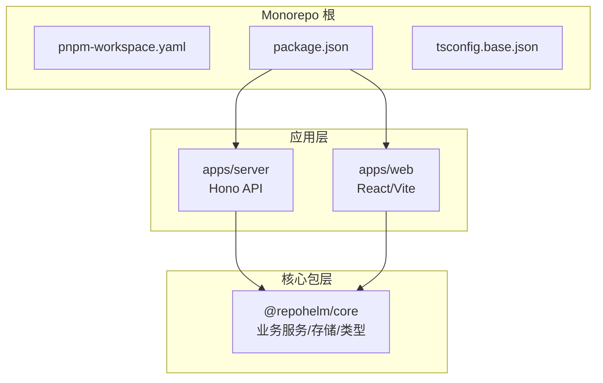
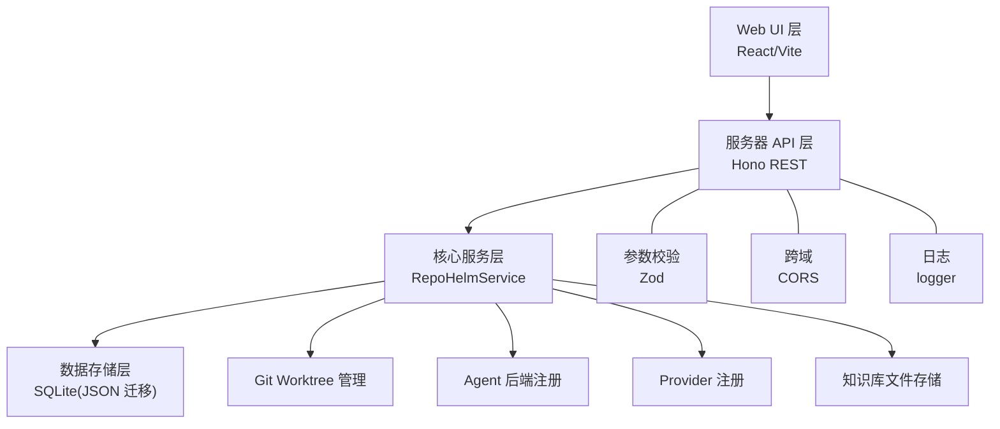
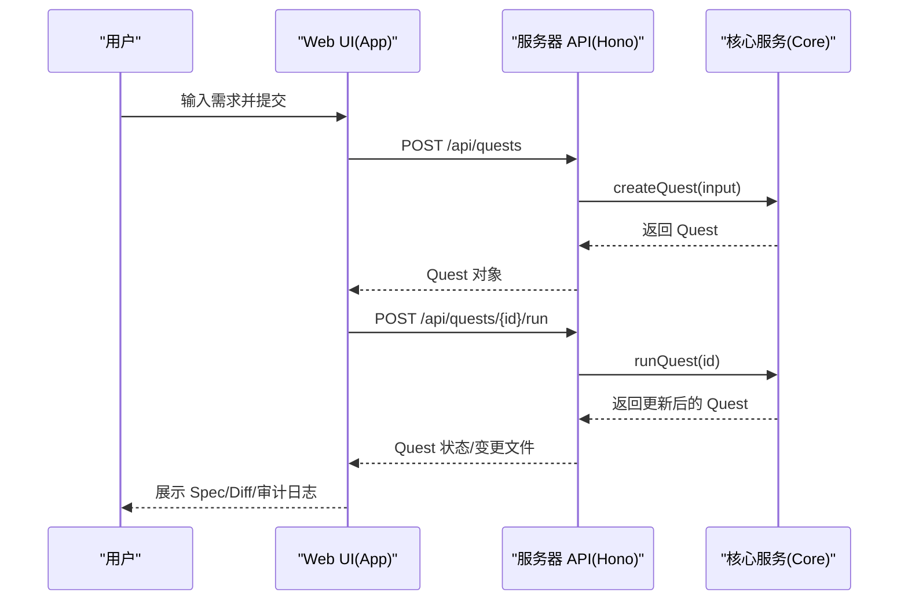
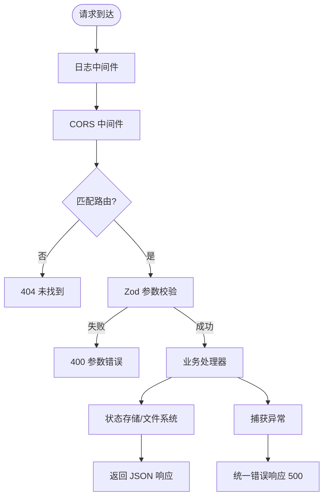
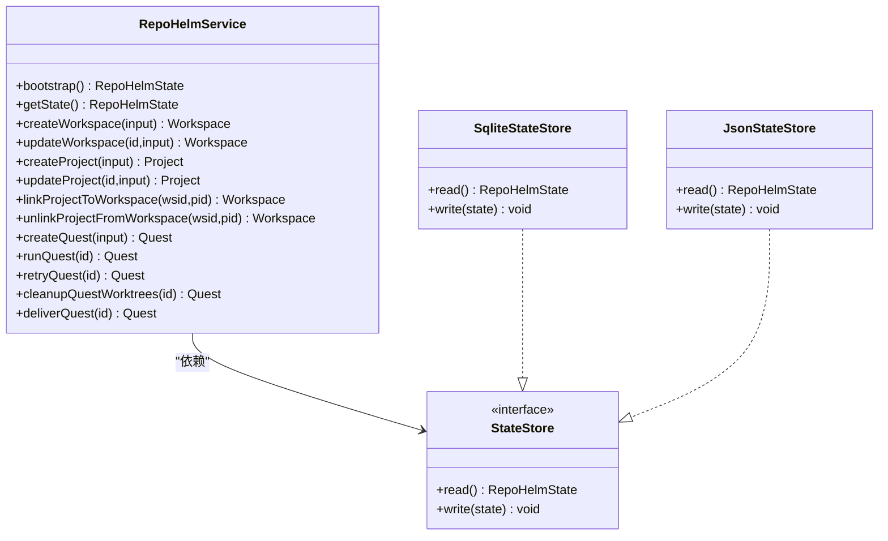
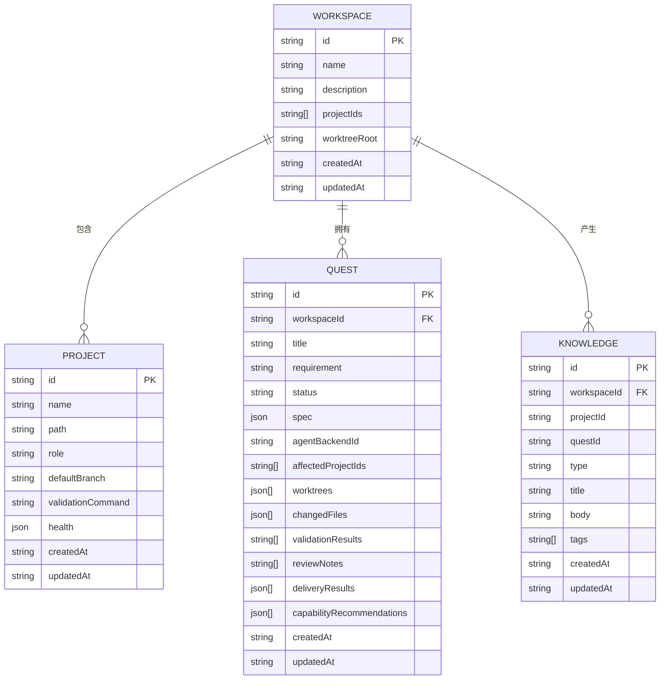
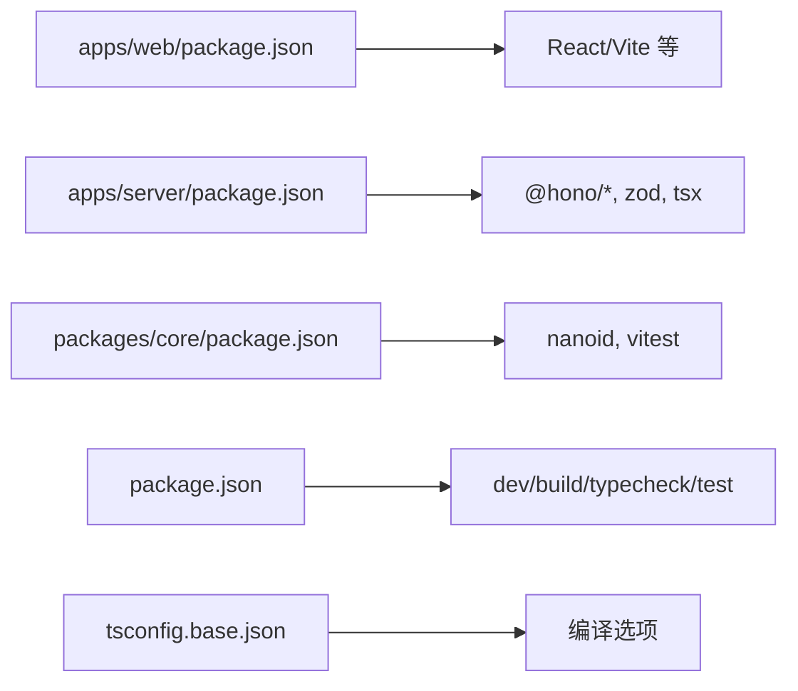

# 整体架构概览

<cite>
**本文档引用的文件**
- [README.md](file://README.md)
- [package.json](file://package.json)
- [pnpm-workspace.yaml](file://pnpm-workspace.yaml)
- [tsconfig.base.json](file://tsconfig.base.json)
- [apps/server/src/index.ts](file://apps/server/src/index.ts)
- [apps/web/src/main.tsx](file://apps/web/src/main.tsx)
- [apps/web/src/App.tsx](file://apps/web/src/App.tsx)
- [apps/web/package.json](file://apps/web/package.json)
- [packages/core/src/index.ts](file://packages/core/src/index.ts)
- [packages/core/src/service.ts](file://packages/core/src/service.ts)
- [packages/core/src/store.ts](file://packages/core/src/store.ts)
- [packages/core/src/types.ts](file://packages/core/src/types.ts)
- [packages/core/package.json](file://packages/core/package.json)
- [apps/server/package.json](file://apps/server/package.json)
- [MILESTONES.md](file://MILESTONES.md)
</cite>

## 目录
1. [简介](#简介)
2. [项目结构](#项目结构)
3. [核心组件](#核心组件)
4. [架构总览](#架构总览)
5. [详细组件分析](#详细组件分析)
6. [依赖分析](#依赖分析)
7. [性能考量](#性能考量)
8. [故障排查指南](#故障排查指南)
9. [结论](#结论)
10. [附录](#附录)

## 简介
RepoHelm 是一个面向 Quest 工作区的原型系统，围绕“虚拟 workspace + 多项目 Quest + Spec 驱动 + worktree 隔离 + Agent 编排 + 知识库”进行产品方向验证。系统采用 monorepo 结构，包含 Web UI、服务器 API、核心服务与数据存储四层，通过 TypeScript、Hono、SQLite 等技术栈构建，强调可演进的分层架构与清晰的组件边界。

## 项目结构
RepoHelm 采用 pnpm workspace 的 monorepo 组织方式，按功能域划分为应用与包两大类：
- 应用层
  - apps/server：基于 Hono 的 Node 服务器，提供 REST API
  - apps/web：基于 React + Vite 的前端 Web UI
- 核心包层
  - packages/core：跨应用共享的核心业务逻辑、服务编排、状态存储与类型定义

**图表来源**
- [pnpm-workspace.yaml:1-5](file://pnpm-workspace.yaml#L1-L5)
- [apps/server/package.json:1-22](file://apps/server/package.json#L1-L22)
- [apps/web/package.json:1-34](file://apps/web/package.json#L1-L34)
- [packages/core/package.json:1-21](file://packages/core/package.json#L1-L21)

**章节来源**
- [pnpm-workspace.yaml:1-5](file://pnpm-workspace.yaml#L1-L5)
- [package.json:1-21](file://package.json#L1-L21)
- [tsconfig.base.json:1-14](file://tsconfig.base.json#L1-L14)

## 核心组件
- Web UI 层（apps/web）
  - 基于 React 19 与 Vite，提供工作区管理、Quest 生命周期、知识库浏览、安全策略与产品就绪度等界面
  - 通过统一的 API 模块与服务器交互，支持主题切换、列宽持久化、命令面板等交互特性
- 服务器 API 层（apps/server）
  - 基于 Hono 框架，提供 REST API，包含健康检查、工作区/项目管理、Quest 生命周期、引擎配置、安全策略、审计日志、产品就绪度等接口
  - 内置 CORS、日志中间件，参数校验使用 Zod
- 核心服务层（packages/core）
  - 提供 RepoHelmService 作为业务中枢，负责状态管理、Git worktree 管理、Agent 后端注册、Provider 注册、CLI 注册、知识库文件存储等
  - 抽象 StateStore 接口，支持 JSON 与 SQLite 两种存储后端，并具备从旧格式迁移的能力
- 数据存储层（packages/core/store）
  - 默认使用 SQLite（state.sqlite）持久化状态，兼容旧版 JSON 文件迁移
  - 提供模型缓存（TTL）、安全策略、审计日志、引擎配置等结构化存储

**章节来源**
- [apps/web/src/main.tsx:1-13](file://apps/web/src/main.tsx#L1-L13)
- [apps/web/src/App.tsx:1-800](file://apps/web/src/App.tsx#L1-L800)
- [apps/server/src/index.ts:1-366](file://apps/server/src/index.ts#L1-L366)
- [packages/core/src/service.ts:1-800](file://packages/core/src/service.ts#L1-L800)
- [packages/core/src/store.ts:1-166](file://packages/core/src/store.ts#L1-L166)
- [packages/core/src/index.ts:1-9](file://packages/core/src/index.ts#L1-L9)

## 架构总览
RepoHelm 采用分层架构，自上而下为 Web UI 层、服务器 API 层、核心服务层与数据存储层。各层职责清晰、边界明确，通过统一的类型系统与状态存储实现松耦合协作。

**图表来源**
- [apps/server/src/index.ts:1-366](file://apps/server/src/index.ts#L1-L366)
- [packages/core/src/service.ts:1-800](file://packages/core/src/service.ts#L1-L800)
- [packages/core/src/store.ts:1-166](file://packages/core/src/store.ts#L1-L166)

## 详细组件分析

### Web UI 组件分析
- 入口与渲染
  - main.tsx 负责创建根节点并渲染 App
  - App.tsx 实现工作区树形导航、Quest 列表、Inspector 详情、命令面板、主题与列宽持久化等
- 交互流程（创建并运行 Quest）
  - 用户在 Composer 输入需求，调用 API 创建 Quest 并立即触发运行
  - UI 通过事件与变更文件列表驱动 Inspector 展示 Spec、Diff、审计日志等

**图表来源**
- [apps/web/src/App.tsx:217-247](file://apps/web/src/App.tsx#L217-L247)
- [apps/server/src/index.ts:317-326](file://apps/server/src/index.ts#L317-L326)
- [packages/core/src/service.ts:544-698](file://packages/core/src/service.ts#L544-L698)

**章节来源**
- [apps/web/src/main.tsx:1-13](file://apps/web/src/main.tsx#L1-L13)
- [apps/web/src/App.tsx:1-800](file://apps/web/src/App.tsx#L1-L800)

### 服务器 API 组件分析
- 路由与中间件
  - 日志中间件、CORS 配置允许 Web UI 访问
  - 参数校验使用 Zod Schema，确保输入一致性
- 主要接口
  - 状态与健康：/api/health、/api/state
  - 引擎与 Provider：/api/engine、/api/providers、/api/providers/:id/models、/api/providers/:id/test
  - 安全策略与审计：/api/security-policy、/api/audit-log
  - 工作区/项目：/api/workspaces、/api/projects、/api/workspaces/:id/links
  - Quest 生命周期：/api/quests、/api/quests/:id/run、/api/quests/:id/retry、/api/quests/:id/cleanup、/api/quests/:id/deliver
  - 知识库：/api/workspaces/:id/knowledge
- 错误处理
  - 统一错误拦截，返回 JSON 错误信息与 500 状态码

**图表来源**
- [apps/server/src/index.ts:41-49](file://apps/server/src/index.ts#L41-L49)
- [apps/server/src/index.ts:51-112](file://apps/server/src/index.ts#L51-L112)
- [apps/server/src/index.ts:353-361](file://apps/server/src/index.ts#L353-L361)

**章节来源**
- [apps/server/src/index.ts:1-366](file://apps/server/src/index.ts#L1-L366)

### 核心服务组件分析
- RepoHelmService
  - 职责：工作区/项目管理、Quest 生命周期、Git worktree 管理、Agent 后端与 Provider 管理、知识库文件写入、安全策略与审计日志
  - 关键流程：bootstrap 初始化与迁移、createQuest/generateSpec、runQuest(worktree 创建/Agent 执行/变更收集)、cleanup/retry/deliver
- 存储抽象
  - StateStore 接口，SqliteStateStore 与 JsonStateStore 双实现，支持旧 JSON 到 SQLite 的迁移
- 类关系图

**图表来源**
- [packages/core/src/service.ts:56-71](file://packages/core/src/service.ts#L56-L71)
- [packages/core/src/store.ts:86-89](file://packages/core/src/store.ts#L86-L89)
- [packages/core/src/store.ts:117-148](file://packages/core/src/store.ts#L117-L148)
- [packages/core/src/store.ts:91-115](file://packages/core/src/store.ts#L91-L115)

**章节来源**
- [packages/core/src/service.ts:1-800](file://packages/core/src/service.ts#L1-L800)
- [packages/core/src/store.ts:1-166](file://packages/core/src/store.ts#L1-L166)

### 数据模型与状态
- 关键实体
  - Workspace、Project、Quest、WorktreeState、ChangedFile、KnowledgeItem、SecurityPolicy、AuditLogEntry、ProductReadiness 等
- 状态流转
  - Quest 从 draft/specifying/planning/preparing/executing/validating/reviewing/ready/delivered/blocked 等状态推进
  - 工作区与项目健康检查、worktree 创建/清理、交付流程均纳入状态与事件记录

**图表来源**
- [packages/core/src/types.ts:36-57](file://packages/core/src/types.ts#L36-L57)
- [packages/core/src/types.ts:47-57](file://packages/core/src/types.ts#L47-L57)
- [packages/core/src/types.ts:173-191](file://packages/core/src/types.ts#L173-L191)
- [packages/core/src/types.ts:193-200](file://packages/core/src/types.ts#L193-L200)

**章节来源**
- [packages/core/src/types.ts:1-200](file://packages/core/src/types.ts#L1-L200)

## 依赖分析
- 包依赖关系
  - apps/server 依赖 @repohelm/core
  - apps/web 与 @repohelm/core 无直接依赖，通过 API 交互
  - packages/core 依赖 nanoid 等基础库
- 开发与构建
  - monorepo 使用 pnpm workspace，根脚本统一 dev/build/typecheck/test
  - TypeScript 编译配置统一于 tsconfig.base.json

**图表来源**
- [apps/web/package.json:1-34](file://apps/web/package.json#L1-L34)
- [apps/server/package.json:1-22](file://apps/server/package.json#L1-L22)
- [packages/core/package.json:1-21](file://packages/core/package.json#L1-L21)
- [package.json:1-21](file://package.json#L1-L21)
- [tsconfig.base.json:1-14](file://tsconfig.base.json#L1-L14)

**章节来源**
- [apps/web/package.json:1-34](file://apps/web/package.json#L1-L34)
- [apps/server/package.json:1-22](file://apps/server/package.json#L1-L22)
- [packages/core/package.json:1-21](file://packages/core/package.json#L1-L21)
- [package.json:1-21](file://package.json#L1-L21)
- [tsconfig.base.json:1-14](file://tsconfig.base.json#L1-L14)

## 性能考量
- 状态存储
  - SQLite 作为首选存储，具备事务与索引能力；同时保留 JSON 迁移路径，降低升级成本
  - Provider 模型列表带 TTL 缓存，减少对外部服务频繁请求
- 并发与异步
  - 多项目 worktree 并行创建与清理，提升 Quest 执行效率
  - UI 侧批量加载状态、后端接口幂等设计，避免重复请求
- 前端体验
  - 本地存储列宽与主题偏好，减少重复计算与网络请求
  - 事件驱动的 Inspector 展示，按需渲染复杂视图

## 故障排查指南
- 常见问题定位
  - API 500：查看服务器日志中间件输出，结合错误拦截返回的错误消息定位
  - CORS 跨域：确认客户端地址在允许列表内，检查服务器 CORS 配置
  - 状态不一致：确认 SQLite 状态文件存在且可写，必要时回退到 JSON 迁移路径
- 诊断步骤
  - 健康检查：访问 /api/health，确认根目录、状态根目录、worktree 与 knowledge 根目录解析正确
  - Provider 模型刷新：使用 /api/providers/:id/models 并传入 refresh=true
  - 审计日志：/api/audit-log 查看命令执行许可决策与拒绝原因

**章节来源**
- [apps/server/src/index.ts:114-123](file://apps/server/src/index.ts#L114-L123)
- [apps/server/src/index.ts:155-176](file://apps/server/src/index.ts#L155-L176)
- [apps/server/src/index.ts:205-208](file://apps/server/src/index.ts#L205-L208)
- [packages/core/src/store.ts:125-139](file://packages/core/src/store.ts#L125-L139)

## 结论
RepoHelm 以 monorepo 为基础，采用清晰的分层架构与强类型约束，实现了从 Web UI 到服务器 API、再到核心服务与数据存储的完整闭环。通过 Hono、React/Vite、TypeScript 与 SQLite 等技术选型，系统在可维护性、可扩展性与用户体验之间取得平衡。未来可在安全文档、威胁建模、部署与可观测性等方面持续演进。

## 附录
- 技术栈与架构决策要点
  - TypeScript：统一类型系统，保障跨包协作稳定性
  - Hono：轻量、高性能的 Node 服务器框架，适配 REST API 场景
  - SQLite：本地化、低运维成本的状态存储，支持 JSON 迁移
  - React/Vite：现代化前端开发体验，快速迭代与热更新
  - pnpm workspace：monorepo 管理与依赖复用，简化构建与测试流程
- 产品与架构边界
  - 产品边界：专注于 Quest 工作区，不包含 IDE 插件与编辑器
  - 架构边界：核心服务抽象清晰，Agent 后端与 Provider 可插拔，安全策略与审计可配置

**章节来源**
- [README.md:1-100](file://README.md#L1-L100)
- [MILESTONES.md:20-43](file://MILESTONES.md#L20-L43)