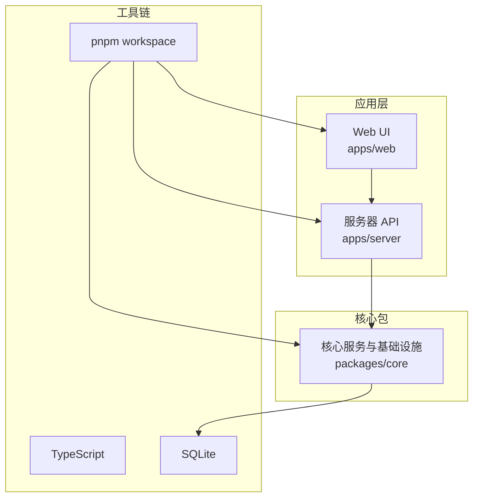
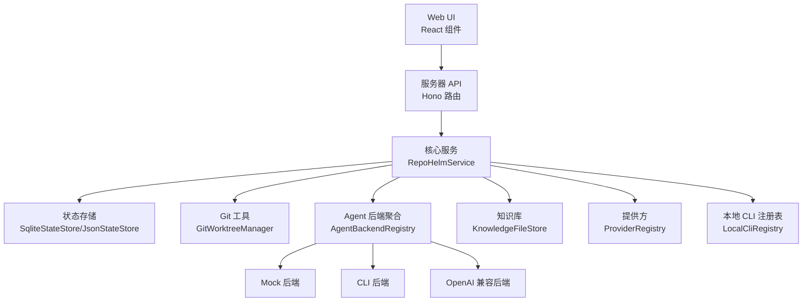
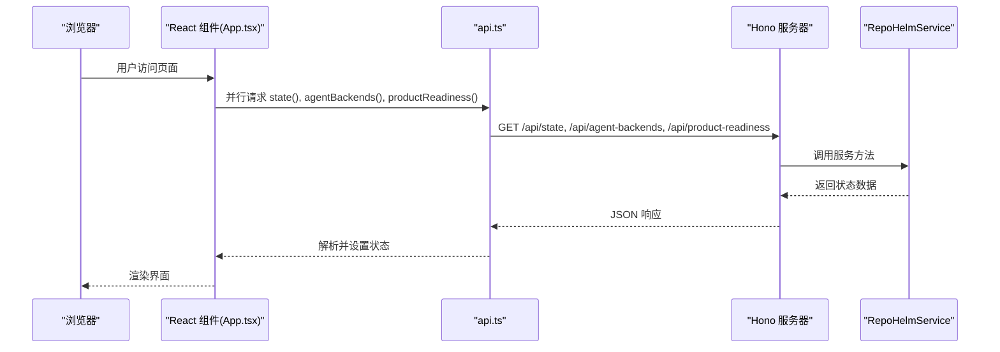
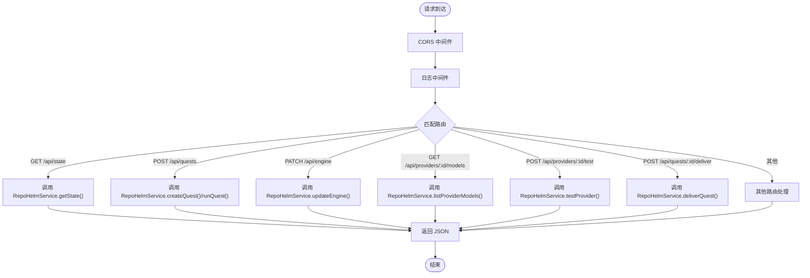
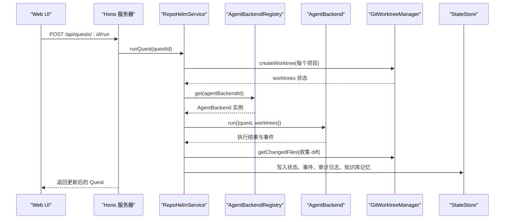
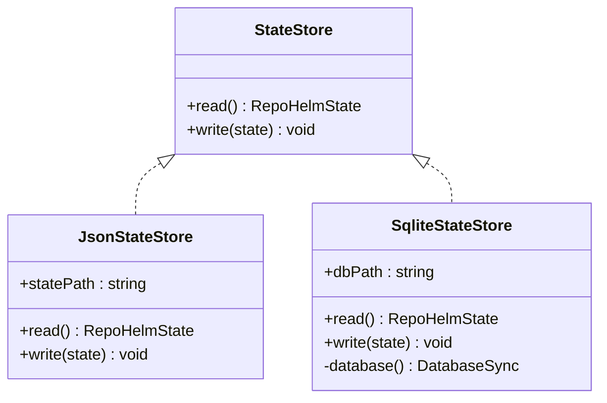
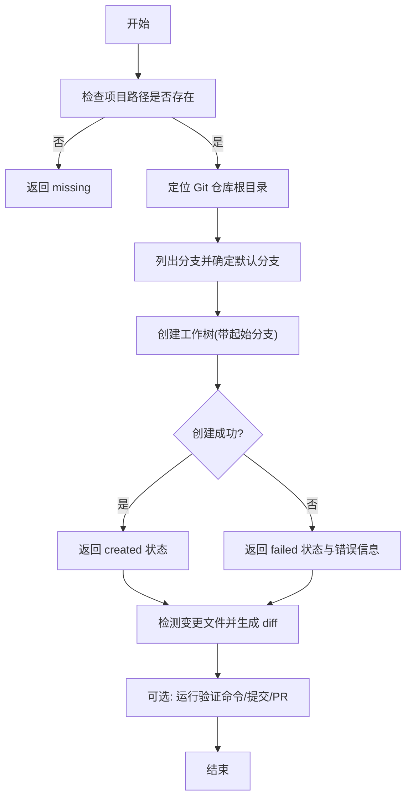
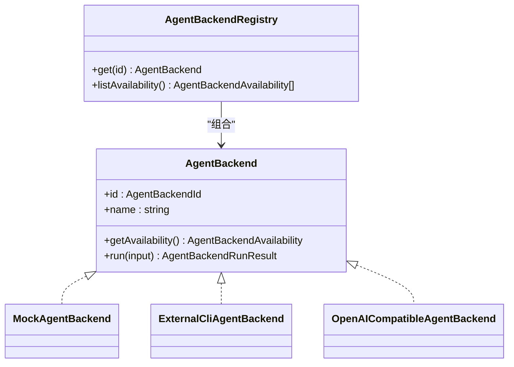
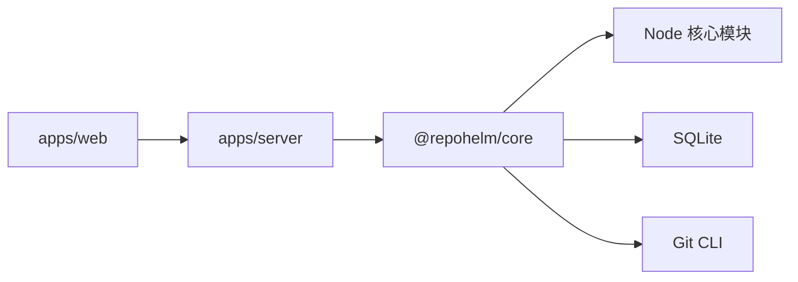

# 架构设计

<cite>
**本文引用的文件**
- [README.md](file://README.md)
- [package.json](file://package.json)
- [pnpm-workspace.yaml](file://pnpm-workspace.yaml)
- [apps/server/src/index.ts](file://apps/server/src/index.ts)
- [apps/server/package.json](file://apps/server/package.json)
- [apps/web/src/main.tsx](file://apps/web/src/main.tsx)
- [apps/web/src/App.tsx](file://apps/web/src/App.tsx)
- [apps/web/src/api.ts](file://apps/web/src/api.ts)
- [apps/web/package.json](file://apps/web/package.json)
- [packages/core/src/index.ts](file://packages/core/src/index.ts)
- [packages/core/src/service.ts](file://packages/core/src/service.ts)
- [packages/core/src/store.ts](file://packages/core/src/store.ts)
- [packages/core/src/types.ts](file://packages/core/src/types.ts)
- [packages/core/src/git.ts](file://packages/core/src/git.ts)
- [packages/core/src/knowledge.ts](file://packages/core/src/knowledge.ts)
- [packages/core/src/agent.ts](file://packages/core/src/agent.ts)
- [packages/core/src/providers.ts](file://packages/core/src/providers.ts)
- [packages/core/src/cli.ts](file://packages/core/src/cli.ts)
</cite>

## 目录
1. [引言](#引言)
2. [项目结构](#项目结构)
3. [核心组件](#核心组件)
4. [架构总览](#架构总览)
5. [详细组件分析](#详细组件分析)
6. [依赖分析](#依赖分析)
7. [性能考量](#性能考量)
8. [故障排查指南](#故障排查指南)
9. [结论](#结论)
10. [附录](#附录)

## 引言
RepoHelm 是一个面向“虚拟 workspace + 多项目 Quest + Spec 驱动 + worktree 隔离 + Agent 编排 + 知识库”的产品方向原型，当前处于 MVP 骨架阶段。其目标是通过统一的服务层协调 Web UI、服务器 API、核心服务与数据存储，形成端到端的 Quest 工作流闭环，覆盖从需求建模、工作树隔离、Agent 执行、变更审查到交付的全流程。

## 项目结构
RepoHelm 采用 monorepo 结构，以 pnpm workspace 组织，分为三类模块：
- 应用层
  - Web UI 应用（React/Vite）：apps/web
  - 服务器 API 应用（Hono）：apps/server
- 核心包（packages/core）：封装业务服务、状态存储、Git 工作树、Agent 后端、模型提供方与 CLI 注册表等
- 文档与测试：docs、e2e

图表来源
- [pnpm-workspace.yaml:1-5](file://pnpm-workspace.yaml#L1-L5)
- [apps/server/package.json:11-17](file://apps/server/package.json#L11-L17)
- [apps/web/package.json:11-26](file://apps/web/package.json#L11-L26)
- [packages/core/src/index.ts:1-9](file://packages/core/src/index.ts#L1-L9)

章节来源
- [pnpm-workspace.yaml:1-5](file://pnpm-workspace.yaml#L1-L5)
- [package.json:1-21](file://package.json#L1-L21)

## 核心组件
- Web UI 层（apps/web）
  - 基于 React 19 与 Vite，提供工作区、Quest、知识库、安全策略、产品就绪度等可视化界面。
  - 通过 api.ts 封装对 /api/* 的 REST 调用，驱动状态加载与操作。
- 服务器 API 层（apps/server）
  - 基于 Hono 的 Node 服务器，提供 /api/* REST 接口，负责路由、CORS、日志与错误处理。
  - 依赖核心服务包进行业务编排与状态持久化。
- 核心服务层（packages/core）
  - RepoHelmService：核心业务编排器，协调工作区、项目、Quest、Git 工作树、Agent 后端、知识库与安全策略。
  - StateStore 抽象：JsonStateStore 与 SqliteStateStore 提供状态持久化，支持从旧 JSON 迁移到 SQLite。
  - GitWorktreeManager：封装 Git 工作树生命周期管理、变更检测、验证命令执行、提交与 PR 生成。
  - AgentBackendRegistry：注册多种 Agent 后端（Mock、CLI、OpenAI-compatible），统一可用性与执行接口。
  - ProviderRegistry 与 LocalCliRegistry：提供方与本地 CLI 的发现、探测、模型枚举与连通性测试。
  - KnowledgeFileStore：将知识项写入 Markdown 文件，配合 SQLite 元数据。
- 数据存储层
  - SQLite：默认状态存储，包含 state 表与 payload JSON 字段；支持迁移与缓存模型列表。
  - 文件系统：知识库 Markdown 文件按类型分目录存放。

章节来源
- [apps/web/src/main.tsx:1-13](file://apps/web/src/main.tsx#L1-L13)
- [apps/web/src/App.tsx:136-152](file://apps/web/src/App.tsx#L136-L152)
- [apps/web/src/api.ts:276-289](file://apps/web/src/api.ts#L276-L289)
- [apps/server/src/index.ts:39-49](file://apps/server/src/index.ts#L39-L49)
- [packages/core/src/service.ts:56-71](file://packages/core/src/service.ts#L56-L71)
- [packages/core/src/store.ts:86-165](file://packages/core/src/store.ts#L86-L165)
- [packages/core/src/git.ts:33-157](file://packages/core/src/git.ts#L33-L157)
- [packages/core/src/agent.ts:395-411](file://packages/core/src/agent.ts#L395-L411)
- [packages/core/src/providers.ts:163-303](file://packages/core/src/providers.ts#L163-L303)
- [packages/core/src/cli.ts:112-202](file://packages/core/src/cli.ts#L112-L202)
- [packages/core/src/knowledge.ts:12-43](file://packages/core/src/knowledge.ts#L12-L43)

## 架构总览
RepoHelm 采用分层架构与依赖注入思想：
- 分层架构
  - 表现层：Web UI（React）
  - 控制层：服务器 API（Hono）
  - 业务层：核心服务（RepoHelmService）
  - 基础设施层：状态存储（SQLite）、Git 工具、Agent 后端、提供方与 CLI 注册表
- 依赖注入
  - 服务器 API 通过构造函数注入 StateStore、根目录与知识/工作树根目录，形成可配置的运行时环境。
  - 核心服务在构造函数中组合 GitWorktreeManager、AgentBackendRegistry、ProviderRegistry、LocalCliRegistry、KnowledgeFileStore 等依赖，便于替换与测试。
- 架构模式
  - 策略模式：AgentBackendRegistry 与 ProviderRegistry 以可插拔策略形式管理不同后端与提供方。
  - 观察者模式：事件与审计日志在服务层集中产生与持久化，UI 侧订阅状态变化。
  - 分层职责：UI 只负责展示与交互，API 负责路由与校验，服务层负责业务编排，基础设施负责具体实现。

图表来源
- [apps/server/src/index.ts:37-38](file://apps/server/src/index.ts#L37-L38)
- [packages/core/src/service.ts:56-71](file://packages/core/src/service.ts#L56-L71)
- [packages/core/src/store.ts:117-165](file://packages/core/src/store.ts#L117-L165)
- [packages/core/src/git.ts:33-157](file://packages/core/src/git.ts#L33-L157)
- [packages/core/src/agent.ts:395-411](file://packages/core/src/agent.ts#L395-L411)
- [packages/core/src/providers.ts:163-303](file://packages/core/src/providers.ts#L163-L303)
- [packages/core/src/cli.ts:112-202](file://packages/core/src/cli.ts#L112-L202)
- [packages/core/src/knowledge.ts:12-43](file://packages/core/src/knowledge.ts#L12-L43)

## 详细组件分析

### Web UI 层（React）
- 初始化与主题
  - main.tsx 负责挂载根节点与样式引入。
  - App.tsx 在首次加载时并行拉取状态、可用 Agent 列表与产品就绪度，并根据主题偏好持久化 UI 设置。
- 数据流
  - api.ts 封装所有 /api/* 请求，统一错误处理与响应解析。
  - App.tsx 通过 api.state、api.agentBackends、api.productReadiness 获取初始数据，随后在用户操作时触发相应 API。
- 交互与布局
  - 侧边栏展示工作区与 Quest 列表，支持展开/折叠、新建工作区与 Quest。
  - Inspector 区域展示 Spec、能力推荐、安全策略、审计日志、文件与 diff、事件与产品就绪度等。
- 错误处理
  - 加载失败与操作异常均通过错误横幅提示，避免崩溃。

图表来源
- [apps/web/src/main.tsx:1-13](file://apps/web/src/main.tsx#L1-L13)
- [apps/web/src/App.tsx:136-152](file://apps/web/src/App.tsx#L136-L152)
- [apps/web/src/api.ts:276-289](file://apps/web/src/api.ts#L276-L289)
- [apps/server/src/index.ts:125-128](file://apps/server/src/index.ts#L125-L128)

章节来源
- [apps/web/src/main.tsx:1-13](file://apps/web/src/main.tsx#L1-L13)
- [apps/web/src/App.tsx:136-152](file://apps/web/src/App.tsx#L136-L152)
- [apps/web/src/api.ts:276-289](file://apps/web/src/api.ts#L276-L289)

### 服务器 API 层（Hono）
- 路由与中间件
  - 日志中间件、CORS 配置允许前端 localhost:5173 访问。
  - 使用 Zod 对请求体进行严格校验，确保输入一致性。
- 端点概览
  - 健康检查、状态查询、Agent 后端与 CLI 列表、提供方模型与连通性测试、引擎配置、安全策略、审计日志、产品就绪度、工作区与项目 CRUD、工作树管理、Quest 生命周期（创建、运行、重试、清理、交付）、知识检索等。
- 错误处理
  - 统一捕获异常并返回 JSON 错误信息，便于前端展示。

图表来源
- [apps/server/src/index.ts:39-49](file://apps/server/src/index.ts#L39-L49)
- [apps/server/src/index.ts:125-361](file://apps/server/src/index.ts#L125-L361)

章节来源
- [apps/server/src/index.ts:39-49](file://apps/server/src/index.ts#L39-L49)
- [apps/server/src/index.ts:125-361](file://apps/server/src/index.ts#L125-L361)

### 核心服务层（RepoHelmService）
- 依赖注入与组合
  - 构造函数注入 StateStore、根目录与知识/工作树根目录，内部组合 GitWorktreeManager、AgentBackendRegistry、ProviderRegistry、LocalCliRegistry、KnowledgeFileStore。
- 主要职责
  - 状态引导与迁移：首次启动时生成演示数据与知识摘要，必要时迁移旧 JSON 状态。
  - 工作区与项目管理：创建、更新、链接/解绑项目至工作区，检查项目健康状态。
  - 引擎与提供方：维护引擎配置（CLI/ BYOK 模式、模型映射、活动提供方），提供真实连通性探测与模型列表缓存。
  - Quest 生命周期：创建 Spec、生成能力推荐、创建/清理工作树、执行 Agent 后端、收集变更、验证与交付。
  - 安全策略与审计：基于命令白名单、文件/网络作用域、密钥策略与沙箱运行时评估命令权限，记录审计日志。
- 关键流程（运行 Quest）
  - 为每个受影响项目创建 Git worktree，调用 Agent 后端执行，收集 stdout/stderr/退出码与 diff，生成验证与 Review 建议，记录事件与知识库记忆。

图表来源
- [packages/core/src/service.ts:544-698](file://packages/core/src/service.ts#L544-L698)
- [packages/core/src/agent.ts:41-46](file://packages/core/src/agent.ts#L41-L46)
- [packages/core/src/git.ts:122-140](file://packages/core/src/git.ts#L122-L140)
- [packages/core/src/store.ts:141-148](file://packages/core/src/store.ts#L141-L148)

章节来源
- [packages/core/src/service.ts:56-71](file://packages/core/src/service.ts#L56-L71)
- [packages/core/src/service.ts:478-698](file://packages/core/src/service.ts#L478-L698)

### 状态存储（SQLite 与 JSON）
- 设计要点
  - StateStore 抽象定义 read/write 接口，支持 JsonStateStore 与 SqliteStateStore 两种实现。
  - SqliteStateStore 以单表 state 存储 JSON payload，并在首次读取时自动迁移旧 JSON 文件。
  - 支持引擎配置迁移（byok → byokProviders），保证向后兼容。
- 性能与可靠性
  - SQLite 事务写入，减少碎片化；ON CONFLICT 更新避免重复写入。
  - 模型缓存 TTL（6 小时）降低提供方模型查询开销。

图表来源
- [packages/core/src/store.ts:86-165](file://packages/core/src/store.ts#L86-L165)

章节来源
- [packages/core/src/store.ts:86-165](file://packages/core/src/store.ts#L86-L165)

### Git 工作树管理
- 功能
  - 仓库健康检查、分支枚举、创建/删除工作树、变更文件检测、验证命令执行、提交与 PR 生成。
- 安全与容错
  - 严格的路径存在性与 Git 根目录判定，失败时返回结构化错误信息。
  - PR 创建受环境变量开关控制，默认仅生成 handoff。

图表来源
- [packages/core/src/git.ts:34-120](file://packages/core/src/git.ts#L34-L120)
- [packages/core/src/git.ts:122-187](file://packages/core/src/git.ts#L122-L187)
- [packages/core/src/git.ts:222-249](file://packages/core/src/git.ts#L222-L249)

章节来源
- [packages/core/src/git.ts:33-343](file://packages/core/src/git.ts#L33-L343)

### Agent 后端与提供方
- Agent 后端策略
  - Mock：用于 MVP 验证，直接在工作树写入示例产物。
  - CLI：通过环境变量模板执行外部 CLI，标准化输入 JSON，采集 stdout/stderr/退出码与 diff。
  - OpenAI-compatible：通过 REST 调用兼容接口，生成产物并落盘。
- 提供方注册表
  - 统一提供方定义、鉴权方式、模型列表解析与连通性探测，支持 BYOK 与 CLI 模式。
- CLI 注册表
  - 发现本地 CLI、探测版本与模型、真实连通性测试，支持刷新与合并实时模型。

图表来源
- [packages/core/src/agent.ts:41-46](file://packages/core/src/agent.ts#L41-L46)
- [packages/core/src/agent.ts:395-411](file://packages/core/src/agent.ts#L395-L411)

章节来源
- [packages/core/src/agent.ts:48-115](file://packages/core/src/agent.ts#L48-L115)
- [packages/core/src/agent.ts:117-259](file://packages/core/src/agent.ts#L117-L259)
- [packages/core/src/agent.ts:261-393](file://packages/core/src/agent.ts#L261-L393)
- [packages/core/src/providers.ts:163-303](file://packages/core/src/providers.ts#L163-L303)
- [packages/core/src/cli.ts:112-202](file://packages/core/src/cli.ts#L112-L202)

## 依赖分析
- 模块耦合
  - apps/server 依赖 @repohelm/core，通过 RepoHelmService 调用核心能力。
  - apps/web 通过 api.ts 与 apps/server 通信，不直接依赖核心包。
  - packages/core 内部通过组合模式注入依赖，便于替换与测试。
- 外部依赖
  - 服务器：Hono、@hono/node-server、Zod
  - Web：React、Vite、TailwindCSS、lucide-react、motion 等
  - 核心：node:sqlite（SQLite）、node:child_process（Git/CLI 调用）

图表来源
- [apps/server/package.json:11-17](file://apps/server/package.json#L11-L17)
- [apps/web/package.json:11-26](file://apps/web/package.json#L11-L26)
- [packages/core/src/store.ts:1-4](file://packages/core/src/store.ts#L1-L4)
- [packages/core/src/git.ts:1-7](file://packages/core/src/git.ts#L1-L7)

章节来源
- [apps/server/package.json:11-17](file://apps/server/package.json#L11-L17)
- [apps/web/package.json:11-26](file://apps/web/package.json#L11-L26)

## 性能考量
- 模型列表缓存
  - 提供方模型列表缓存 TTL 为 6 小时，减少对外部服务请求频率。
- 并发与批处理
  - 为多个项目并行创建/清理工作树，批量读取变更文件，提升整体吞吐。
- I/O 优化
  - SQLite 单表写入与冲突更新，减少碎片化；知识库文件按类型分目录，利于检索与备份。
- 网络与超时
  - CLI 与提供方调用设置合理超时，避免长时间阻塞；Git 操作通过环境变量禁用交互式提示，减少阻塞风险。

## 故障排查指南
- 常见问题
  - 项目路径不存在或非 Git 仓库：检查项目路径与默认分支配置，使用 /api/projects/:id/check 触发健康检查。
  - 工作树创建失败：查看 Git 错误信息与工作树路径占用情况，确认仓库根目录与分支存在性。
  - Agent 后端不可用：检查 CLI 是否安装、环境变量是否配置正确，或提供方鉴权信息是否有效。
  - 提供方模型列表为空：确认 API Key、Base URL 正确，或使用 BYOK 模式手动配置。
- 审计与日志
  - 通过 /api/audit-log 查看命令执行的允许/拒绝记录，辅助定位安全策略问题。
- 状态迁移
  - 若从旧版本升级，确认 .repohelm/state.json 是否被迁移至 SQLite；若异常，可删除旧文件后重启服务以重建。

章节来源
- [packages/core/src/git.ts:34-120](file://packages/core/src/git.ts#L34-L120)
- [packages/core/src/service.ts:457-476](file://packages/core/src/service.ts#L457-L476)
- [packages/core/src/store.ts:133-138](file://packages/core/src/store.ts#L133-L138)

## 结论
RepoHelm 通过清晰的分层架构与依赖注入，将 Web UI、服务器 API、核心服务与基础设施解耦，形成可演进的工作区与 Quest 工作流框架。SQLite 与文件系统的组合满足 MVP 的状态与知识存储需求；策略化的 Agent 后端与提供方注册表为未来扩展提供了良好基础。建议在后续版本中完善安全策略的沙箱运行时、增强监控与告警体系，并探索分布式状态与缓存优化。

## 附录
- 技术栈与版本兼容
  - TypeScript：5.9.x
  - Node.js：通过 pnpm workspace 管理，Hono 与 React 版本与 TS 兼容
  - SQLite：node:sqlite（原生模块）
  - Git：通过命令行封装，支持 macOS/Windows/Linux
- 系统边界
  - Web UI 与服务器 API 通过 /api/* 通信，核心服务在服务器进程中运行。
  - 状态存储位于 .repohelm/state.sqlite，知识库位于 .repohelm/knowledge。
- 第三方依赖
  - 服务器：@hono/node-server、hono、zod
  - Web：react、react-dom、vite、tailwindcss、lucide-react、motion
  - 核心：node:sqlite、node:child_process

章节来源
- [README.md:33-100](file://README.md#L33-L100)
- [apps/server/package.json:11-17](file://apps/server/package.json#L11-L17)
- [apps/web/package.json:11-26](file://apps/web/package.json#L11-L26)
- [packages/core/src/store.ts:1-4](file://packages/core/src/store.ts#L1-L4)
- [packages/core/src/git.ts:1-7](file://packages/core/src/git.ts#L1-L7)