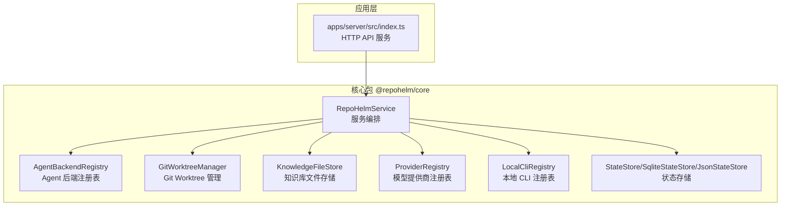
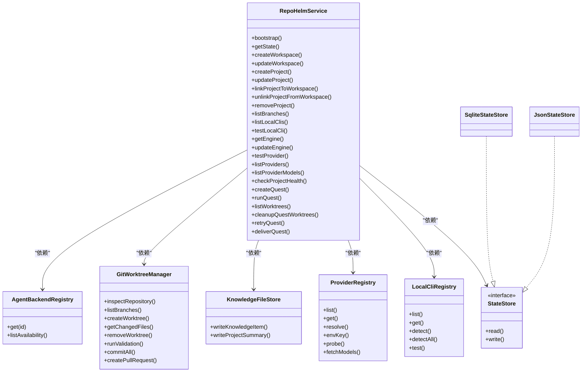
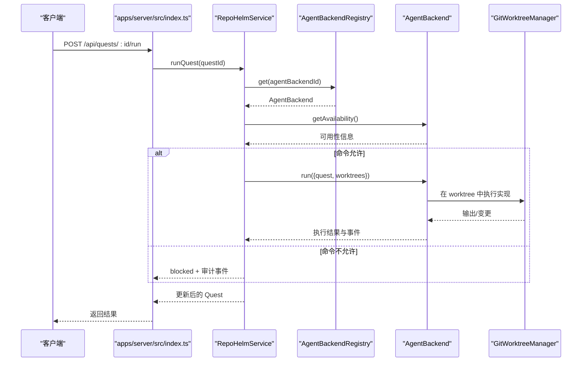
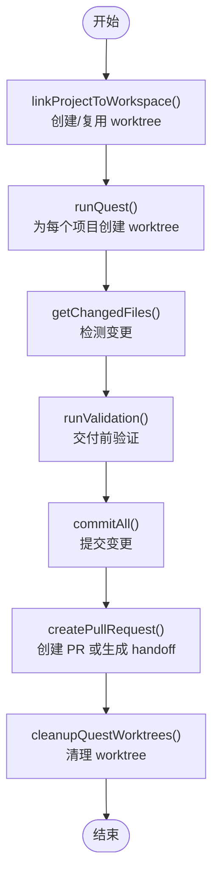
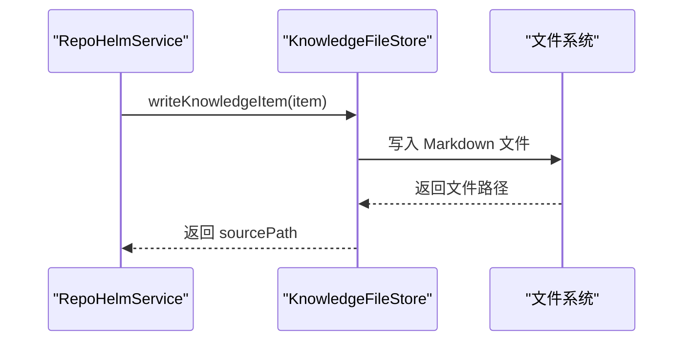
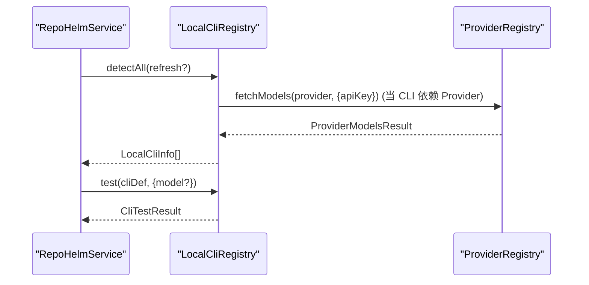
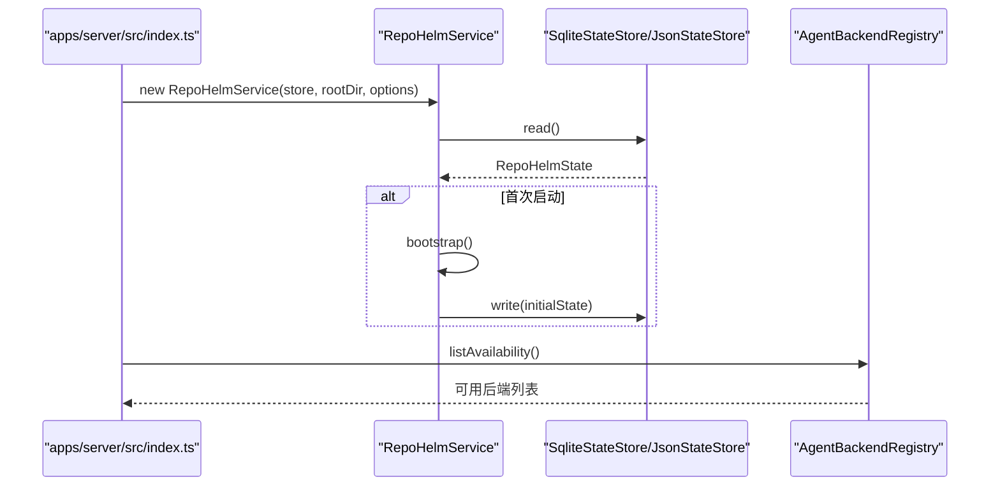
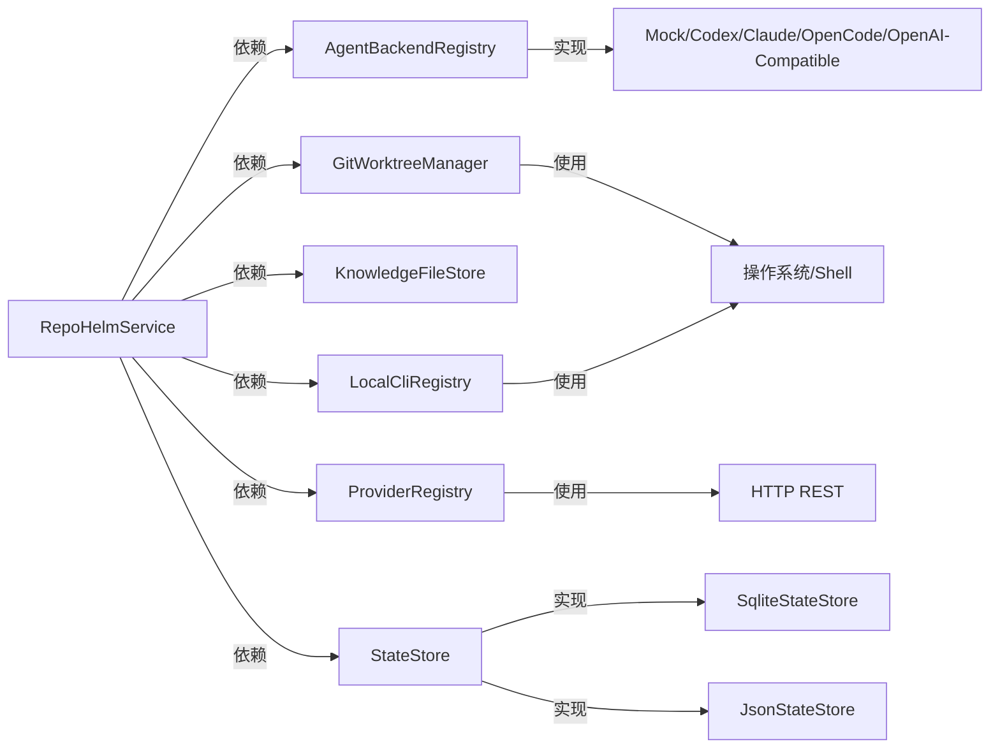

# 组件交互关系

<cite>
**本文引用的文件列表**
- [service.ts](file://packages/core/src/service.ts)
- [agent.ts](file://packages/core/src/agent.ts)
- [git.ts](file://packages/core/src/git.ts)
- [knowledge.ts](file://packages/core/src/knowledge.ts)
- [providers.ts](file://packages/core/src/providers.ts)
- [cli.ts](file://packages/core/src/cli.ts)
- [store.ts](file://packages/core/src/store.ts)
- [index.ts](file://packages/core/src/index.ts)
- [types.ts](file://packages/core/src/types.ts)
- [index.ts](file://apps/server/src/index.ts)
</cite>

## 目录
1. [简介](#简介)
2. [项目结构](#项目结构)
3. [核心组件](#核心组件)
4. [架构总览](#架构总览)
5. [详细组件分析](#详细组件分析)
6. [依赖关系分析](#依赖关系分析)
7. [性能考量](#性能考量)
8. [故障排查指南](#故障排查指南)
9. [结论](#结论)

## 简介
本文面向 RepoHelm 的核心组件交互关系，聚焦 RepoHelmService 与 AgentBackendRegistry、GitWorktreeManager、KnowledgeFileStore、ProviderRegistry、LocalCliRegistry、StateStore 等组件的协作方式，解释依赖注入模式、组件生命周期管理与事件驱动机制，并提供组件交互序列图与协作图，帮助读者快速理解典型业务流程中的调用链路与解耦策略。

## 项目结构
RepoHelm 采用多包（monorepo）组织，核心领域逻辑集中在 @repohelm/core 包，服务端 API 在 apps/server，前端 Web 在 apps/web。本文重点分析核心包内的组件与交互。

图表来源
- [index.ts](file://packages/core/src/index.ts)
- [index.ts](file://apps/server/src/index.ts)

章节来源
- [index.ts](file://packages/core/src/index.ts)
- [index.ts](file://apps/server/src/index.ts)

## 核心组件
- RepoHelmService：核心编排器，负责工作区、项目、Quest 生命周期管理，协调 Agent、Git、知识库、模型提供商与 CLI 检测等子系统。
- AgentBackendRegistry：统一管理多种 Agent 后端（mock、外部 CLI、OpenAI 兼容），提供可用性检测与执行。
- GitWorktreeManager：封装 Git worktree 生命周期（创建、清理、变更检测、验证命令、提交、PR）。
- KnowledgeFileStore：将知识项持久化为 Markdown 文件，配合内存中的知识索引。
- ProviderRegistry：统一管理模型提供商（OpenAI、Anthropic、Gemini、DeepSeek、OpenRouter、兼容接口），提供探测与模型列表拉取。
- LocalCliRegistry：检测本地 CLI（Codex、Claude、Gemini、OpenCode），并进行真实连通性测试。
- StateStore/SqliteStateStore/JsonStateStore：状态持久化抽象与实现，支持 SQLite 与 JSON 迁移。

章节来源
- [service.ts](file://packages/core/src/service.ts)
- [agent.ts](file://packages/core/src/agent.ts)
- [git.ts](file://packages/core/src/git.ts)
- [knowledge.ts](file://packages/core/src/knowledge.ts)
- [providers.ts](file://packages/core/src/providers.ts)
- [cli.ts](file://packages/core/src/cli.ts)
- [store.ts](file://packages/core/src/store.ts)

## 架构总览
RepoHelmService 作为上层编排者，通过构造函数注入各子系统实例，形成清晰的依赖注入模式。服务端 API（apps/server）在启动时创建 RepoHelmService 并将其暴露为 HTTP 接口，前端通过 REST 调用触发业务流程。

图表来源
- [service.ts](file://packages/core/src/service.ts)
- [agent.ts](file://packages/core/src/agent.ts)
- [git.ts](file://packages/core/src/git.ts)
- [knowledge.ts](file://packages/core/src/knowledge.ts)
- [providers.ts](file://packages/core/src/providers.ts)
- [cli.ts](file://packages/core/src/cli.ts)
- [store.ts](file://packages/core/src/store.ts)

## 详细组件分析

### RepoHelmService 与 AgentBackendRegistry 的协作
- RepoHelmService 在运行 Quest 时，根据配置选择 AgentBackend，调用其 getAvailability 与 run 方法。
- AgentBackendRegistry 提供多种后端实现，包括 Mock、外部 CLI（Codex/Claude/OpenCode）、OpenAI 兼容 Provider。
- 安全策略在运行前评估命令许可，若不允许则阻断执行并记录审计日志。

图表来源
- [index.ts](file://apps/server/src/index.ts)
- [service.ts](file://packages/core/src/service.ts)
- [agent.ts](file://packages/core/src/agent.ts)
- [git.ts](file://packages/core/src/git.ts)

章节来源
- [service.ts](file://packages/core/src/service.ts)
- [agent.ts](file://packages/core/src/agent.ts)

### RepoHelmService 与 GitWorktreeManager 的协作
- 服务在链接项目到工作区、运行 Quest、清理/重试/交付等阶段，均委托 GitWorktreeManager 完成实际的 Git 操作。
- 支持 worktree 创建、复用、删除、变更检测、验证命令执行、提交与 PR handoff。

图表来源
- [service.ts](file://packages/core/src/service.ts)
- [git.ts](file://packages/core/src/git.ts)

章节来源
- [service.ts](file://packages/core/src/service.ts)
- [git.ts](file://packages/core/src/git.ts)

### RepoHelmService 与 KnowledgeFileStore 的协作
- 服务在初始化、项目更新、Quest 运行后，将知识项写入文件系统，确保知识库内容与状态一致。
- 知识项包含 Markdown frontmatter 与正文，便于检索与展示。

图表来源
- [service.ts](file://packages/core/src/service.ts)
- [knowledge.ts](file://packages/core/src/knowledge.ts)

章节来源
- [service.ts](file://packages/core/src/service.ts)
- [knowledge.ts](file://packages/core/src/knowledge.ts)

### ProviderRegistry 与 LocalCliRegistry 的协作
- ProviderRegistry 提供模型提供商的统一接口，支持探测与模型列表拉取。
- LocalCliRegistry 通过 CLI 的自有命令或借助 ProviderRegistry 获取实时模型列表，同时进行真实连通性测试。

图表来源
- [service.ts](file://packages/core/src/service.ts)
- [cli.ts](file://packages/core/src/cli.ts)
- [providers.ts](file://packages/core/src/providers.ts)

章节来源
- [service.ts](file://packages/core/src/service.ts)
- [cli.ts](file://packages/core/src/cli.ts)
- [providers.ts](file://packages/core/src/providers.ts)

### 依赖注入模式与组件生命周期
- 依赖注入：RepoHelmService 在构造函数中接收 StateStore、rootDir、以及可选的 knowledgeRootDir/worktreeRootDir，并内部创建 AgentBackendRegistry、GitWorktreeManager、ProviderRegistry、LocalCliRegistry、KnowledgeFileStore 等子系统实例。
- 生命周期管理：服务启动时通过 bootstrap 初始化状态与种子知识；后续所有业务操作均基于持久化状态进行，状态变更通过 StateStore.write 写回。
- 事件驱动：服务在关键节点生成 AgentEvent、审计日志与知识记忆，形成可追踪的事件时间线。

图表来源
- [index.ts](file://apps/server/src/index.ts)
- [service.ts](file://packages/core/src/service.ts)
- [store.ts](file://packages/core/src/store.ts)
- [agent.ts](file://packages/core/src/agent.ts)

章节来源
- [index.ts](file://apps/server/src/index.ts)
- [service.ts](file://packages/core/src/service.ts)
- [store.ts](file://packages/core/src/store.ts)

## 依赖关系分析
- RepoHelmService 对 AgentBackendRegistry、GitWorktreeManager、KnowledgeFileStore、ProviderRegistry、LocalCliRegistry、StateStore 形成强依赖，承担编排职责。
- AgentBackendRegistry 内部聚合多种 Agent 后端实现，对外暴露统一接口。
- GitWorktreeManager 与 ProviderRegistry、LocalCliRegistry 之间为纯功能调用关系，不反向依赖服务层。
- StateStore 为抽象接口，具体实现（Sqlite/Json）对上层透明。

图表来源
- [service.ts](file://packages/core/src/service.ts)
- [agent.ts](file://packages/core/src/agent.ts)
- [git.ts](file://packages/core/src/git.ts)
- [knowledge.ts](file://packages/core/src/knowledge.ts)
- [providers.ts](file://packages/core/src/providers.ts)
- [cli.ts](file://packages/core/src/cli.ts)
- [store.ts](file://packages/core/src/store.ts)

章节来源
- [service.ts](file://packages/core/src/service.ts)
- [agent.ts](file://packages/core/src/agent.ts)
- [git.ts](file://packages/core/src/git.ts)
- [knowledge.ts](file://packages/core/src/knowledge.ts)
- [providers.ts](file://packages/core/src/providers.ts)
- [cli.ts](file://packages/core/src/cli.ts)
- [store.ts](file://packages/core/src/store.ts)

## 性能考量
- 模型列表缓存：ProviderRegistry 在 listProviderModels 中使用 TTL 缓存，减少重复网络请求。
- 并发执行：runQuest 中对多个项目的 worktree 创建与 Agent 执行采用 Promise.all 并发，提升吞吐。
- I/O 优化：Git 操作与文件写入均在本地执行，注意磁盘与 Git 仓库规模对性能的影响。
- 状态持久化：优先使用 SqliteStateStore，具备更好的并发与迁移能力；首次启动时从 JsonStateStore 迁移。

章节来源
- [service.ts](file://packages/core/src/service.ts)
- [providers.ts](file://packages/core/src/providers.ts)
- [store.ts](file://packages/core/src/store.ts)

## 故障排查指南
- Agent 后端不可用
  - 检查 AgentBackendRegistry 的可用性报告与环境变量配置。
  - 若命令被安全策略拒绝，查看审计日志与事件。
- Git 操作失败
  - 检查仓库路径、默认分支与 worktree 目标路径是否冲突。
  - 查看 GitWorktreeManager 的错误格式化输出。
- Provider/CLI 模型拉取失败
  - 确认 API Key、Base URL、网络连通性。
  - 使用 testProvider/testLocalCli 进行最小成本探测。
- 状态读写异常
  - 确认 .repohelm 目录权限与磁盘空间。
  - 首次启动时观察从 JSON 到 SQLite 的迁移过程。

章节来源
- [agent.ts](file://packages/core/src/agent.ts)
- [git.ts](file://packages/core/src/git.ts)
- [providers.ts](file://packages/core/src/providers.ts)
- [cli.ts](file://packages/core/src/cli.ts)
- [store.ts](file://packages/core/src/store.ts)

## 结论
RepoHelm 通过 RepoHelmService 将 Agent、Git、知识库、模型提供商与 CLI 等子系统有机整合，采用依赖注入与事件驱动的方式实现了清晰的职责分离与可追踪的业务闭环。服务端 API 将这些能力暴露为 REST 接口，前端通过标准流程完成工作区、项目、Quest 的全生命周期管理。未来可在模型适配器与 Agent 后端适配器层面进一步增强扩展性与安全性。