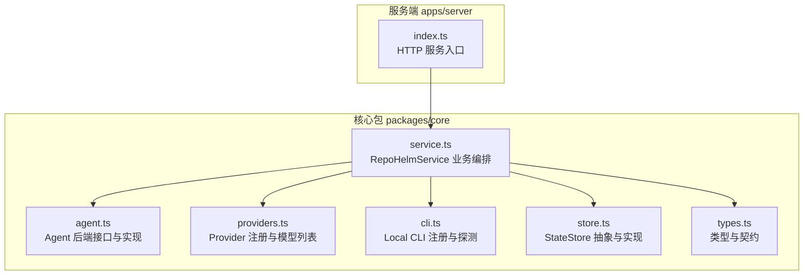
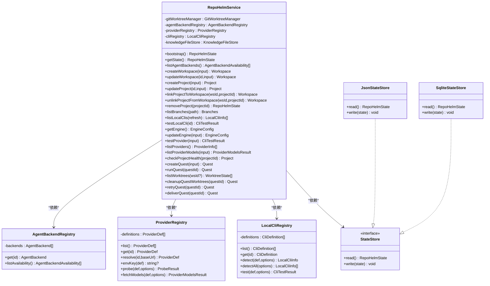
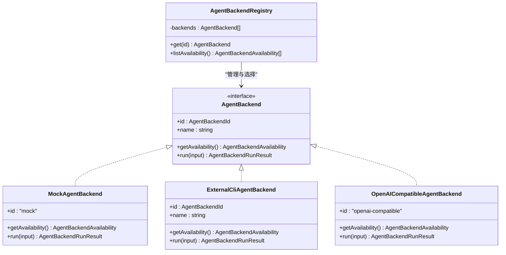
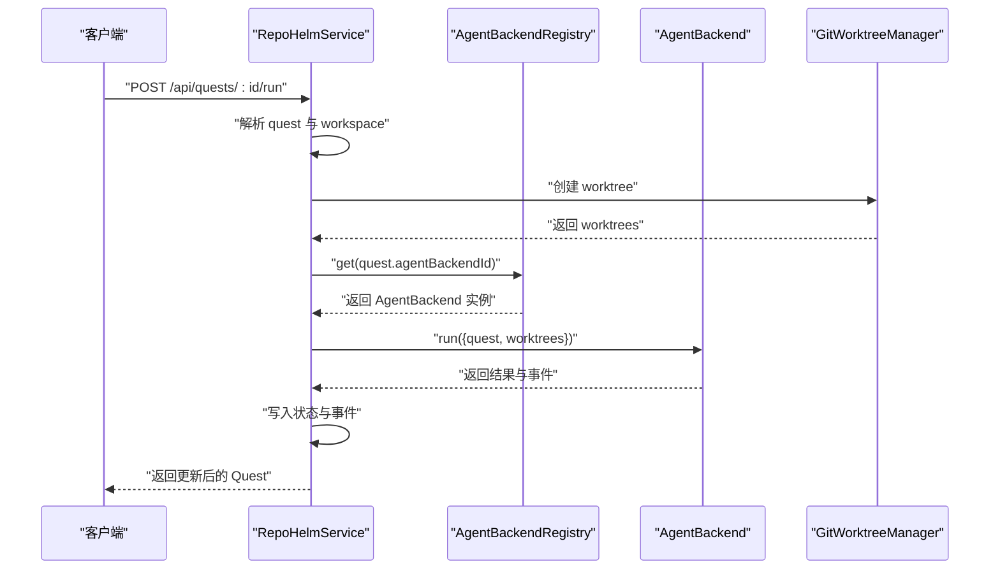
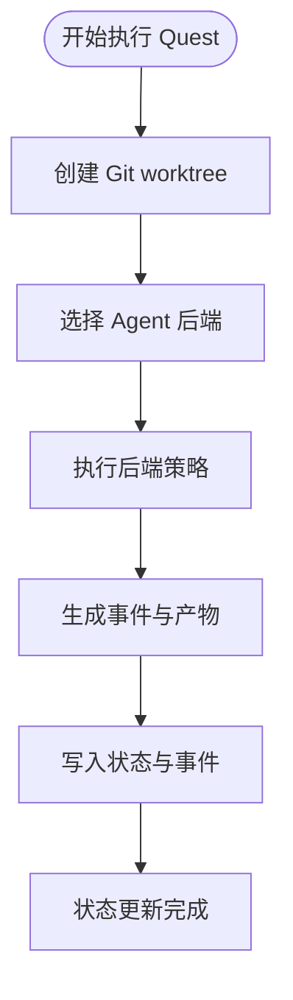
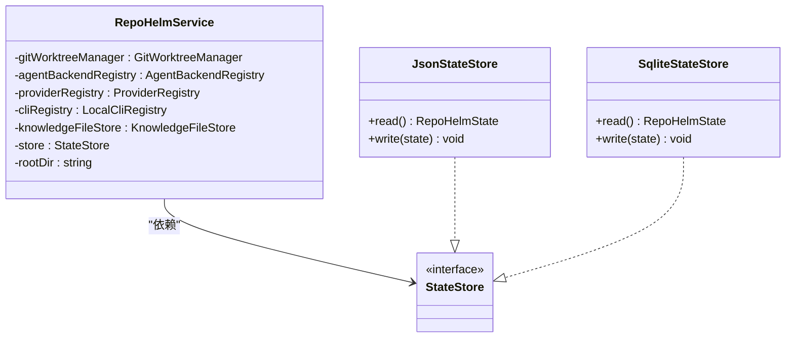
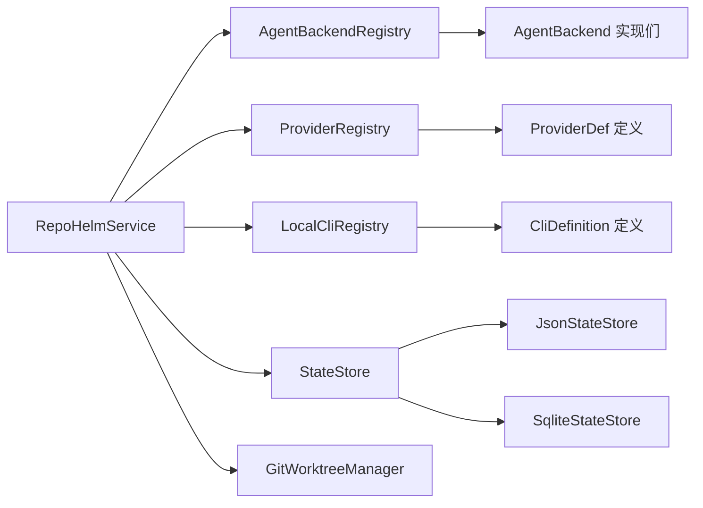

# 设计模式应用

<cite>
**本文引用的文件**
- [packages/core/src/agent.ts](file://packages/core/src/agent.ts)
- [packages/core/src/providers.ts](file://packages/core/src/providers.ts)
- [packages/core/src/cli.ts](file://packages/core/src/cli.ts)
- [packages/core/src/service.ts](file://packages/core/src/service.ts)
- [packages/core/src/store.ts](file://packages/core/src/store.ts)
- [packages/core/src/types.ts](file://packages/core/src/types.ts)
- [apps/server/src/index.ts](file://apps/server/src/index.ts)
- [packages/core/src/providers.test.ts](file://packages/core/src/providers.test.ts)
- [packages/core/src/service.test.ts](file://packages/core/src/service.test.ts)
</cite>

## 目录
1. [引言](#引言)
2. [项目结构](#项目结构)
3. [核心组件](#核心组件)
4. [架构总览](#架构总览)
5. [详细组件分析](#详细组件分析)
6. [依赖关系分析](#依赖关系分析)
7. [性能考量](#性能考量)
8. [故障排查指南](#故障排查指南)
9. [结论](#结论)
10. [附录](#附录)

## 引言
本文件聚焦 RepoHelm 项目中的设计模式应用与最佳实践，围绕以下主题展开：
- 工厂模式：用于 Agent 后端实例化与注册
- 策略模式：用于可插拔的 Agent 后端实现
- 观察者模式：用于事件驱动的状态更新
- 依赖注入：用于组件解耦与可测试性

我们将结合具体代码路径与 UML 图表，解释这些模式如何提升系统的可扩展性、可维护性与可测试性。

## 项目结构
RepoHelm 采用多包结构，核心逻辑集中在 packages/core，服务端入口位于 apps/server。核心模块包括：
- 代理后端（Agent Backend）：抽象接口与多种实现
- 提供商注册（Provider Registry）：统一管理不同大模型提供商
- 本地 CLI 注册（Local CLI Registry）：统一管理本地命令行工具
- 服务层（RepoHelmService）：编排业务流程与状态持久化
- 存储层（State Store）：抽象状态存储接口与多种实现
- 类型系统（Types）：统一的数据契约与枚举

图表来源
- [packages/core/src/agent.ts:1-436](file://packages/core/src/agent.ts#L1-L436)
- [packages/core/src/providers.ts:1-304](file://packages/core/src/providers.ts#L1-L304)
- [packages/core/src/cli.ts:1-368](file://packages/core/src/cli.ts#L1-L368)
- [packages/core/src/service.ts:1-800](file://packages/core/src/service.ts#L1-L800)
- [packages/core/src/store.ts:1-166](file://packages/core/src/store.ts#L1-L166)
- [packages/core/src/types.ts:1-334](file://packages/core/src/types.ts#L1-L334)
- [apps/server/src/index.ts:1-366](file://apps/server/src/index.ts#L1-L366)

章节来源
- [packages/core/src/index.ts:1-9](file://packages/core/src/index.ts#L1-L9)

## 核心组件
- Agent 后端接口与实现：定义统一的 AgentBackend 接口，提供多种实现（Mock、External CLI、OpenAI-Compatible），并通过 AgentBackendRegistry 统一注册与查找。
- Provider 注册：ProviderRegistry 封装不同提供商的模型列表获取、认证与探测逻辑，支持按 id 或 baseUrl 推断提供商。
- Local CLI 注册：LocalCliRegistry 封装本地 CLI 的探测、模型列表获取与真实连通性测试。
- RepoHelmService：业务编排中心，负责工作区、项目、Quest 生命周期管理，以及与 Agent 后端、Provider、CLI、Git 的协作。
- StateStore：抽象状态存储接口，JsonStateStore 与 SqliteStateStore 提供不同实现，支持迁移与兼容。

章节来源
- [packages/core/src/agent.ts:41-411](file://packages/core/src/agent.ts#L41-L411)
- [packages/core/src/providers.ts:163-303](file://packages/core/src/providers.ts#L163-L303)
- [packages/core/src/cli.ts:112-367](file://packages/core/src/cli.ts#L112-L367)
- [packages/core/src/service.ts:56-71](file://packages/core/src/service.ts#L56-L71)
- [packages/core/src/store.ts:86-165](file://packages/core/src/store.ts#L86-L165)

## 架构总览
RepoHelm 的架构以 RepoHelmService 为核心，通过依赖注入的方式持有各子系统实例；AgentBackendRegistry、ProviderRegistry、LocalCliRegistry、GitWorktreeManager、StateStore 分别承担后端策略、模型提供、CLI 探测、版本控制与状态持久化职责。服务端通过 HTTP API 暴露业务能力。

图表来源
- [packages/core/src/service.ts:56-71](file://packages/core/src/service.ts#L56-L71)
- [packages/core/src/agent.ts:395-411](file://packages/core/src/agent.ts#L395-L411)
- [packages/core/src/providers.ts:163-168](file://packages/core/src/providers.ts#L163-L168)
- [packages/core/src/cli.ts:112-124](file://packages/core/src/cli.ts#L112-L124)
- [packages/core/src/store.ts:86-165](file://packages/core/src/store.ts#L86-L165)

## 详细组件分析

### 工厂模式：Agent 后端创建与注册
- 目标：集中管理 Agent 后端实例，屏蔽具体实现差异，便于扩展新的后端。
- 关键实现：
  - AgentBackendRegistry：内部维护后端数组，提供 get 与 listAvailability 方法，用于按 id 获取后端或查询可用性。
  - AgentBackend 接口：统一 getAvailability 与 run 两个方法，确保所有后端具备一致行为契约。
  - 多种实现：MockAgentBackend、ExternalCliAgentBackend、OpenAICompatibleAgentBackend。
- 最佳实践：
  - 将新后端以构造函数参数形式注入 AgentBackendRegistry，避免在业务层直接 new。
  - 通过环境变量或配置决定后端可用性，保证运行期可切换。
- 代码示例路径
  - [AgentBackendRegistry.get:404-406](file://packages/core/src/agent.ts#L404-L406)
  - [AgentBackend 接口定义:41-46](file://packages/core/src/agent.ts#L41-L46)
  - [ExternalCliAgentBackend.run:144-221](file://packages/core/src/agent.ts#L144-L221)
  - [OpenAICompatibleAgentBackend.run:282-337](file://packages/core/src/agent.ts#L282-L337)

图表来源
- [packages/core/src/agent.ts:41-411](file://packages/core/src/agent.ts#L41-L411)

章节来源
- [packages/core/src/agent.ts:395-411](file://packages/core/src/agent.ts#L395-L411)

### 策略模式：可插拔的 Agent 后端实现
- 目标：在不修改业务流程的情况下，动态选择不同的 Agent 后端策略（Mock、CLI、Provider）。
- 关键实现：
  - RepoHelmService.runQuest 中根据 quest.agentBackendId 获取后端实例，调用其 run 并收集事件与产物。
  - ExternalCliAgentBackend 与 OpenAICompatibleAgentBackend 分别封装外部 CLI 与 Provider 的执行策略。
- 最佳实践：
  - 将后端选择与执行解耦，通过配置或输入参数决定策略。
  - 对外部依赖进行权限评估与审计，确保安全可控。
- 代码示例路径
  - [RepoHelmService.runQuest 后端选择与执行:589-615](file://packages/core/src/service.ts#L589-L615)
  - [ExternalCliAgentBackend.run 命令执行策略:144-221](file://packages/core/src/agent.ts#L144-L221)
  - [OpenAICompatibleAgentBackend.run Provider 调用策略:282-337](file://packages/core/src/agent.ts#L282-L337)

图表来源
- [packages/core/src/service.ts:544-698](file://packages/core/src/service.ts#L544-L698)
- [packages/core/src/agent.ts:404-411](file://packages/core/src/agent.ts#L404-L411)

章节来源
- [packages/core/src/service.ts:544-698](file://packages/core/src/service.ts#L544-L698)

### 观察者模式：事件驱动的状态更新
- 目标：通过事件记录系统行为，驱动 UI 与后续流程，实现松耦合的状态传播。
- 关键实现：
  - AgentEvent 类型与事件生成方法，RepoHelmService 在关键节点（创建 Quest、生成 Spec、执行后端、验证、Review、交付等）产生事件。
  - 事件写入状态存储，前端通过 API 获取事件流，驱动 UI 更新。
- 最佳实践：
  - 事件命名规范与结构化内容，便于前端消费与审计。
  - 事件与状态变更一一对应，保证一致性。
- 代码示例路径
  - [AgentEvent 类型定义:89-97](file://packages/core/src/types.ts#L89-L97)
  - [RepoHelmService.createQuest 事件生成:512-534](file://packages/core/src/service.ts#L512-L534)
  - [RepoHelmService.runQuest 事件生成:673-688](file://packages/core/src/service.ts#L673-L688)

图表来源
- [packages/core/src/service.ts:544-698](file://packages/core/src/service.ts#L544-L698)
- [packages/core/src/types.ts:89-97](file://packages/core/src/types.ts#L89-L97)

章节来源
- [packages/core/src/types.ts:89-97](file://packages/core/src/types.ts#L89-L97)
- [packages/core/src/service.ts:512-534](file://packages/core/src/service.ts#L512-L534)
- [packages/core/src/service.ts:673-688](file://packages/core/src/service.ts#L673-L688)

### 依赖注入：组件解耦与可测试性
- 目标：通过构造函数注入依赖，降低耦合度，提高可测试性与可替换性。
- 关键实现：
  - RepoHelmService 构造函数接收 StateStore、rootDir 与可选的目录参数，内部组合 GitWorktreeManager、AgentBackendRegistry、ProviderRegistry、LocalCliRegistry、KnowledgeFileStore。
  - apps/server/src/index.ts 通过 new RepoHelmService(new SqliteStateStore(...), ...) 构建服务，便于替换存储实现。
  - 测试中通过注入假实现（如 JsonStateStore）验证业务流程。
- 最佳实践：
  - 明确依赖边界，避免在类内部直接 new 外部组件。
  - 通过接口抽象（如 StateStore）隔离具体实现。
- 代码示例路径
  - [RepoHelmService 构造函数:64-71](file://packages/core/src/service.ts#L64-L71)
  - [apps/server/src/index.ts 服务构建:37-37](file://apps/server/src/index.ts#L37-L37)
  - [providers.test.ts 中的 fetch 模拟:6-13](file://packages/core/src/providers.test.ts#L6-L13)
  - [service.test.ts 中的存储替换:12-18](file://packages/core/src/service.test.ts#L12-L18)

图表来源
- [packages/core/src/service.ts:56-71](file://packages/core/src/service.ts#L56-L71)
- [packages/core/src/store.ts:86-165](file://packages/core/src/store.ts#L86-L165)

章节来源
- [packages/core/src/service.ts:64-71](file://packages/core/src/service.ts#L64-L71)
- [apps/server/src/index.ts:37-37](file://apps/server/src/index.ts#L37-L37)
- [packages/core/src/providers.test.ts:6-13](file://packages/core/src/providers.test.ts#L6-L13)
- [packages/core/src/service.test.ts:12-18](file://packages/core/src/service.test.ts#L12-L18)

## 依赖关系分析
- 组件内聚与耦合：
  - RepoHelmService 高内聚地编排多个子系统，但通过接口与构造函数注入降低耦合。
  - AgentBackendRegistry、ProviderRegistry、LocalCliRegistry 作为独立策略容器，便于扩展与替换。
- 外部依赖与集成点：
  - ProviderRegistry 与外部模型列表 API 集成，支持多提供商适配。
  - LocalCliRegistry 与外部 CLI 工具集成，支持探测与连通性测试。
  - StateStore 支持 JSON 与 SQLite 两种实现，便于迁移与兼容。
- 循环依赖：
  - 未发现循环依赖；各模块职责清晰，接口边界明确。

图表来源
- [packages/core/src/service.ts:56-71](file://packages/core/src/service.ts#L56-L71)
- [packages/core/src/agent.ts:395-411](file://packages/core/src/agent.ts#L395-L411)
- [packages/core/src/providers.ts:163-168](file://packages/core/src/providers.ts#L163-L168)
- [packages/core/src/cli.ts:112-124](file://packages/core/src/cli.ts#L112-L124)
- [packages/core/src/store.ts:86-165](file://packages/core/src/store.ts#L86-L165)

章节来源
- [packages/core/src/service.ts:56-71](file://packages/core/src/service.ts#L56-L71)

## 性能考量
- 模型列表缓存：ProviderRegistry.fetchModels 对实时模型列表进行缓存，减少对外部 API 的频繁调用，提升响应速度。
- 并发执行：RepoHelmService.runQuest 中对多个 worktree 的后端执行采用 Promise.all 并发处理，缩短整体执行时间。
- 存储迁移：SqliteStateStore 在首次读取时自动迁移旧版 JSON 状态，避免重复转换开销。
- 最佳实践：
  - 合理设置缓存 TTL，平衡实时性与性能。
  - 控制并发数量，避免资源争用。
  - 对外部调用增加超时与重试策略，提升稳定性。

章节来源
- [packages/core/src/service.ts:422-455](file://packages/core/src/service.ts#L422-L455)
- [packages/core/src/service.ts:557-586](file://packages/core/src/service.ts#L557-L586)
- [packages/core/src/store.ts:125-148](file://packages/core/src/store.ts#L125-L148)

## 故障排查指南
- Provider 列表获取失败：
  - 现象：返回 fallbackModels，detail 包含错误信息。
  - 排查：检查 API Key、Base URL、网络连通性；确认提供商支持的认证方式。
  - 参考路径：[ProviderRegistry.fetchModels 错误分支:254-299](file://packages/core/src/providers.ts#L254-L299)
- CLI 连通性测试失败：
  - 现象：testLocalCli 返回失败，包含超时或鉴权提示。
  - 排查：确认 CLI 是否安装、版本参数是否正确、登录状态与模型可用性。
  - 参考路径：[LocalCliRegistry.test:204-272](file://packages/core/src/cli.ts#L204-L272)
- 后端执行被安全策略阻止：
  - 现象：runQuest 返回 blocked，审计日志记录 denied。
  - 排查：检查安全策略配置，确认命令是否在允许列表中。
  - 参考路径：[RepoHelmService.runQuest 权限评估:591-601](file://packages/core/src/service.ts#L591-L601)
- 状态持久化异常：
  - 现象：读取或写入状态失败。
  - 排查：检查存储路径权限、SQLite 文件完整性；必要时回退到 JsonStateStore。
  - 参考路径：[SqliteStateStore.read/write:125-148](file://packages/core/src/store.ts#L125-L148)

章节来源
- [packages/core/src/providers.ts:254-299](file://packages/core/src/providers.ts#L254-L299)
- [packages/core/src/cli.ts:204-272](file://packages/core/src/cli.ts#L204-L272)
- [packages/core/src/service.ts:591-601](file://packages/core/src/service.ts#L591-L601)
- [packages/core/src/store.ts:125-148](file://packages/core/src/store.ts#L125-L148)

## 结论
RepoHelm 通过工厂模式、策略模式、观察者模式与依赖注入，构建了一个高内聚、低耦合且易于扩展的系统：
- 工厂模式与策略模式使 Agent 后端可插拔，便于引入新的执行策略。
- 观察者模式通过事件驱动状态更新，提升系统的可观测性与可追踪性。
- 依赖注入降低了模块间的耦合，增强了可测试性与可替换性。
这些设计模式共同提升了系统的可扩展性、可维护性与可测试性，为后续迭代提供了坚实基础。

## 附录
- 代码示例路径汇总
  - [AgentBackendRegistry.get:404-406](file://packages/core/src/agent.ts#L404-L406)
  - [ExternalCliAgentBackend.run:144-221](file://packages/core/src/agent.ts#L144-L221)
  - [OpenAICompatibleAgentBackend.run:282-337](file://packages/core/src/agent.ts#L282-L337)
  - [RepoHelmService.runQuest:544-698](file://packages/core/src/service.ts#L544-L698)
  - [ProviderRegistry.fetchModels:221-302](file://packages/core/src/providers.ts#L221-L302)
  - [LocalCliRegistry.test:204-272](file://packages/core/src/cli.ts#L204-L272)
  - [RepoHelmService 构造函数:64-71](file://packages/core/src/service.ts#L64-L71)
  - [apps/server/src/index.ts 服务构建:37-37](file://apps/server/src/index.ts#L37-L37)
  - [providers.test.ts 中的 fetch 模拟:6-13](file://packages/core/src/providers.test.ts#L6-L13)
  - [service.test.ts 中的存储替换:12-18](file://packages/core/src/service.test.ts#L12-L18)