# Quest Spec 流式生成系统

<cite>
**本文档引用的文件**
- [README.md](file://README.md)
- [2026-06-11-quest-spec-streaming.md](file://docs/superpowers/plans/2026-06-11-quest-spec-streaming.md)
- [llm.ts](file://packages/core/src/llm.ts)
- [types.ts](file://packages/core/src/types.ts)
- [service.ts](file://packages/core/src/service.ts)
- [index.ts](file://apps/server/src/index.ts)
- [sse.ts](file://apps/server/src/sse.ts)
- [api.ts](file://apps/web/src/api.ts)
- [App.tsx](file://apps/web/src/App.tsx)
- [package.json](file://package.json)
</cite>

## 目录
1. [项目概述](#项目概述)
2. [系统架构](#系统架构)
3. [核心组件](#核心组件)
4. [架构概览](#架构概览)
5. [详细组件分析](#详细组件分析)
6. [依赖关系分析](#依赖关系分析)
7. [性能考虑](#性能考虑)
8. [故障排除指南](#故障排除指南)
9. [结论](#结论)

## 项目概述

Quest Spec 流式生成系统是 RepoHelm 项目中的一个关键功能模块，旨在实现 Quest 创建阶段的实时流式 Spec 生成。该系统通过 SSE（Server-Sent Events）技术，为用户提供流畅的交互体验，包括逐步显示需求分析文本、渐进式展示结构化 Spec 卡片，以及按节奏逐条出现的时间线事件。

RepoHelm 是一个开源的 Quest 工作区原型，验证"虚拟 workspace + 多项目 Quest + Spec 驱动 + worktree 隔离 + Agent 编排 + 知识库"的产品方向。当前版本提供了完整的流式生成能力，包括：

- **实时流式生成**：模型输出的 token 逐个传输，提供即时反馈
- **渐进式界面更新**：分析文本先显示，然后 Spec 卡片淡入
- **事件驱动的进度展示**：时间线事件按真实生成节奏出现
- **降级机制**：模型不可用时自动回退到模板生成
- **完整的开发工具链**：包括测试、调试和部署支持

## 系统架构

系统采用分层架构设计，主要分为三层：

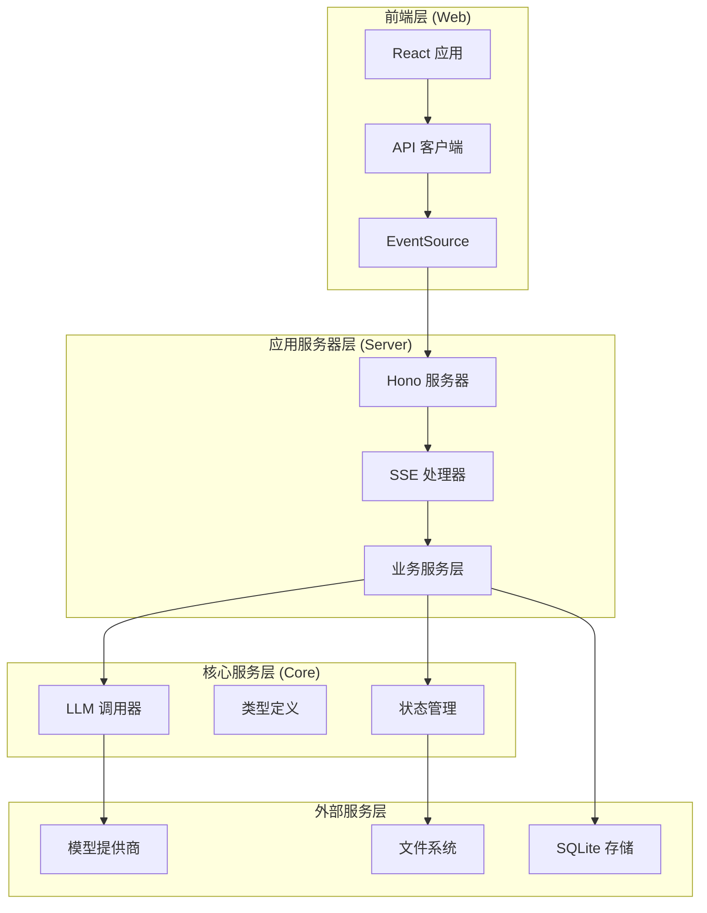

**图表来源**
- [App.tsx:1195-1264](file://apps/web/src/App.tsx#L1195-L1264)
- [api.ts:659-691](file://apps/web/src/api.ts#L659-L691)
- [index.ts:532-549](file://apps/server/src/index.ts#L532-L549)
- [service.ts:1554-1594](file://packages/core/src/service.ts#L1554-L1594)

## 核心组件

### 1. 流式 LLM 调用器

`streamLlmWithModelKit` 函数是整个系统的核心，负责处理流式模型调用：

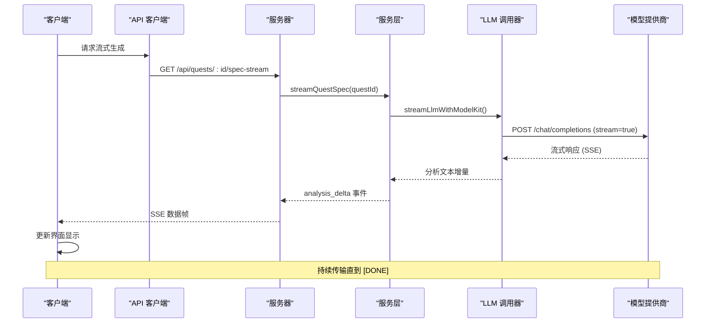

**图表来源**
- [llm.ts:131-214](file://packages/core/src/llm.ts#L131-L214)
- [service.ts:410-520](file://packages/core/src/service.ts#L410-L520)
- [index.ts:532-549](file://apps/server/src/index.ts#L532-L549)

### 2. 事件流处理器

系统定义了完整的事件流类型：

| 事件类型 | 描述 | 数据结构 |
|---------|------|----------|
| `analysis_delta` | 分析文本增量 | `{ type: "analysis_delta", text: string }` |
| `spec_ready` | Spec 生成完成 | `{ type: "spec_ready", spec: QuestSpec }` |
| `event_added` | 新事件添加 | `{ type: "event_added", event: AgentEvent }` |
| `done` | 流程完成 | `{ type: "done", quest: Quest }` |
| `error` | 错误事件 | `{ type: "error", message: string }` |

### 3. SSE 服务器实现

服务器端使用 Hono 框架和自定义 SSE 工具：

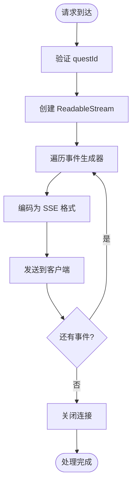

**图表来源**
- [index.ts:532-549](file://apps/server/src/index.ts#L532-L549)
- [sse.ts:1-13](file://apps/server/src/sse.ts#L1-L13)

**章节来源**
- [llm.ts:131-214](file://packages/core/src/llm.ts#L131-L214)
- [types.ts:226-231](file://packages/core/src/types.ts#L226-L231)
- [service.ts:410-520](file://packages/core/src/service.ts#L410-L520)

## 架构概览

系统采用微服务架构，各组件职责明确：

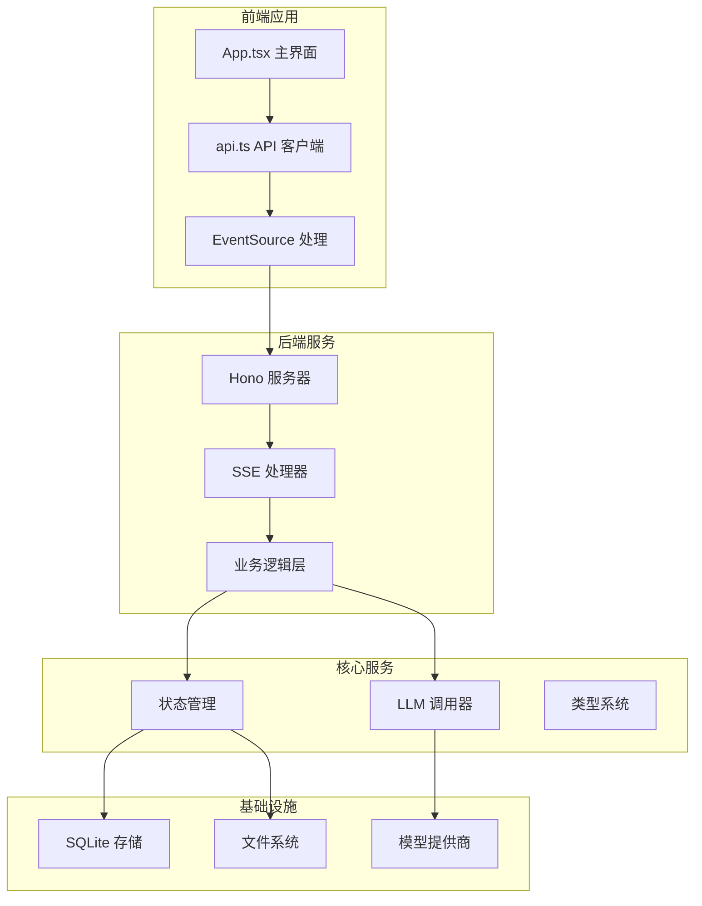

**图表来源**
- [App.tsx:107-156](file://apps/web/src/App.tsx#L107-L156)
- [api.ts:659-691](file://apps/web/src/api.ts#L659-L691)
- [index.ts:44-54](file://apps/server/src/index.ts#L44-L54)
- [service.ts:439-441](file://packages/core/src/service.ts#L439-L441)

## 详细组件分析

### 1. 前端组件实现

#### 主界面集成

前端通过 `createQuest` 函数集成流式生成：

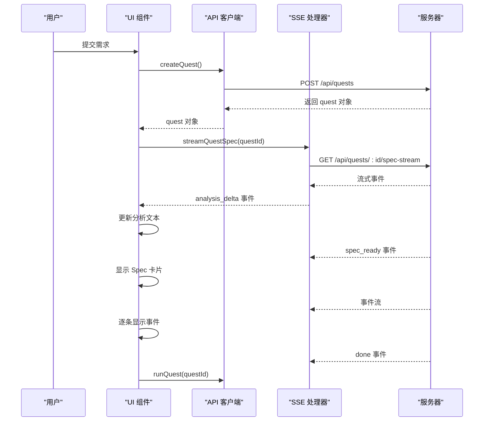

**图表来源**
- [App.tsx:311-374](file://apps/web/src/App.tsx#L311-L374)
- [api.ts:659-691](file://apps/web/src/api.ts#L659-L691)

#### 状态管理

前端使用 React Hooks 管理流式生成状态：

| 状态变量 | 类型 | 用途 | 生命周期 |
|---------|------|------|----------|
| `streamingAnalysis` | `string` | 存储流式分析文本 | 仅在流式期间有效 |
| `streamingQuestIdRef` | `RefObject<string>` | 防止重复订阅 | 整个组件生命周期 |
| `busy` | `boolean` | 表示操作进行中 | 操作期间 |

**章节来源**
- [App.tsx:107-156](file://apps/web/src/App.tsx#L107-L156)
- [App.tsx:311-374](file://apps/web/src/App.tsx#L311-L374)

### 2. 服务器端实现

#### SSE 路由处理

服务器端路由处理流式请求：

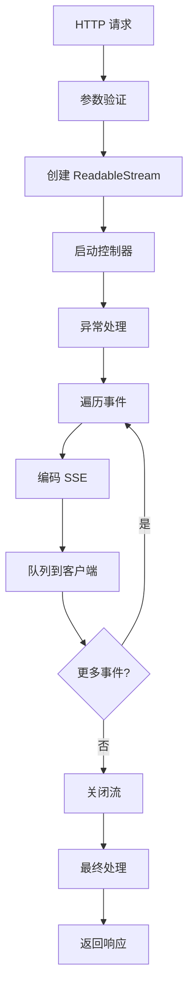

**图表来源**
- [index.ts:532-549](file://apps/server/src/index.ts#L532-L549)
- [sse.ts:1-13](file://apps/server/src/sse.ts#L1-L13)

#### 业务逻辑层

服务层负责协调各个组件：

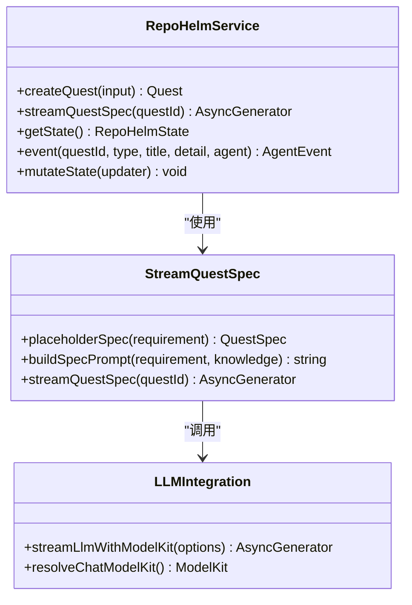

**图表来源**
- [service.ts:1554-1594](file://packages/core/src/service.ts#L1554-L1594)
- [service.ts:410-520](file://packages/core/src/service.ts#L410-L520)
- [llm.ts:131-214](file://packages/core/src/llm.ts#L131-L214)

**章节来源**
- [index.ts:532-549](file://apps/server/src/index.ts#L532-L549)
- [service.ts:410-520](file://packages/core/src/service.ts#L410-L520)

### 3. 核心算法实现

#### 流式解析算法

系统实现了智能的流式解析算法：

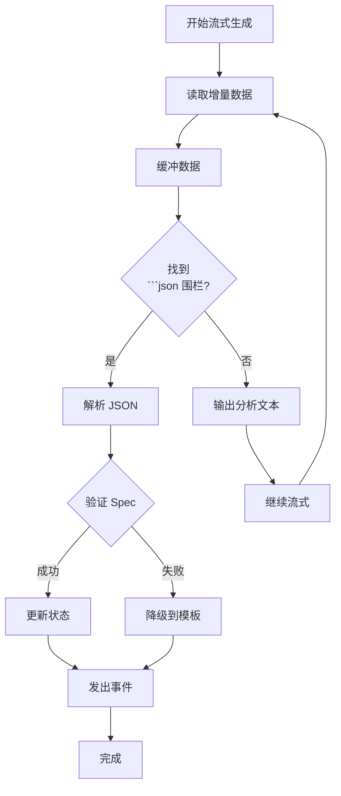

**图表来源**
- [service.ts](file://packages/core/src/service.ts#L424-L468)

#### 降级机制

当模型不可用时的降级流程：

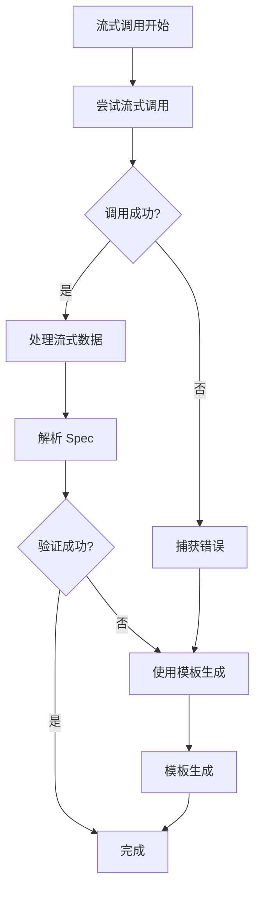

**图表来源**
- [service.ts](file://packages/core/src/service.ts#L444-L459)

**章节来源**
- [service.ts](file://packages/core/src/service.ts#L424-L468)
- [service.ts](file://packages/core/src/service.ts#L444-L459)

## 依赖关系分析

系统依赖关系图展示了各模块间的耦合程度：

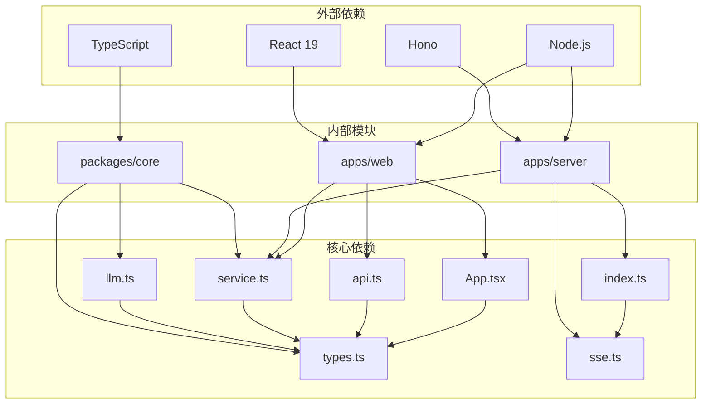

**图表来源**
- [package.json](file://package.json#L1-L22)
- [llm.ts](file://packages/core/src/llm.ts#L1-L247)
- [types.ts](file://packages/core/src/types.ts#L1-L681)
- [service.ts](file://packages/core/src/service.ts#L1-L2774)
- [index.ts](file://apps/server/src/index.ts#L1-L1021)

### 关键依赖特性

| 依赖项 | 版本要求 | 用途 | 重要性 |
|--------|----------|------|--------|
| TypeScript | ^5.9.3 | 类型安全 | 高 |
| Hono | 最新稳定版 | Web 服务器框架 | 高 |
| React 19 | 最新稳定版 | 前端框架 | 高 |
| Node.js | 18+ | 运行时环境 | 高 |
| concurrently | ^9.2.1 | 并发执行 | 中 |
| vitest | 测试框架 | 单元测试 | 中 |

**章节来源**
- [package.json](file://package.json#L1-L22)

## 性能考虑

### 1. 流式传输优化

系统采用了多项性能优化措施：

- **增量传输**：只传输必要的数据增量，减少网络负载
- **背压处理**：使用 ReadableStream 处理背压，防止内存溢出
- **事件节流**：通过 350ms 延迟控制事件频率，避免过度更新
- **缓存策略**：利用浏览器 EventSource 缓存机制

### 2. 内存管理

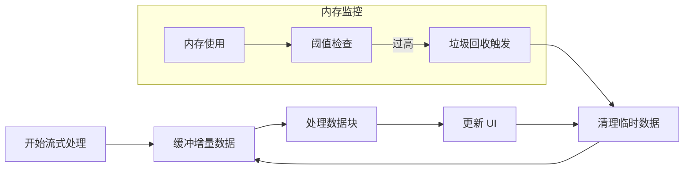

### 3. 错误恢复机制

系统具备完善的错误恢复能力：

- **网络中断恢复**：EventSource 自动重连
- **部分数据丢失**：基于增量更新的容错机制
- **模型不可用降级**：自动切换到模板生成
- **状态一致性保证**：通过原子性状态更新

## 故障排除指南

### 1. 常见问题及解决方案

| 问题类型 | 症状 | 可能原因 | 解决方案 |
|----------|------|----------|----------|
| 流式连接失败 | SSE 连接立即断开 | CORS 配置错误 | 检查 CORS 设置 |
| 事件丢失 | 部分事件未显示 | 网络不稳定 | 实现重连机制 |
| 内存泄漏 | 页面加载缓慢 | 事件监听器未清理 | 检查清理逻辑 |
| 模型调用失败 | 生成过程卡住 | API 密钥无效 | 验证模型配置 |
| UI 卡顿 | 界面响应慢 | 频繁重渲染 | 优化渲染策略 |

### 2. 调试工具

系统提供了多种调试工具：

- **浏览器开发者工具**：监控网络请求和 SSE 连接
- **日志系统**：记录关键事件和错误信息
- **状态检查器**：实时查看系统状态
- **性能分析器**：监控内存使用和渲染性能

### 3. 监控指标

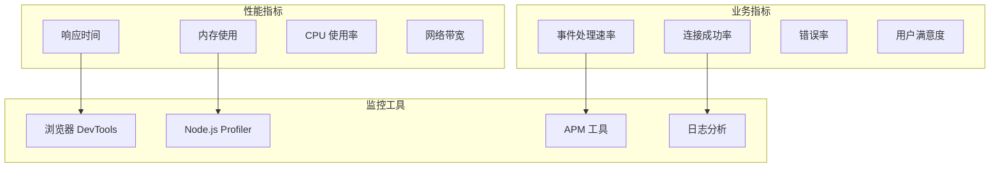

**章节来源**
- [App.tsx:241-263](file://apps/web/src/App.tsx#L241-L263)
- [api.ts:659-691](file://apps/web/src/api.ts#L659-L691)

## 结论

Quest Spec 流式生成系统是一个高度模块化、可扩展的现代化应用架构。系统通过以下关键特性实现了优秀的用户体验：

### 核心优势

1. **实时交互体验**：通过 SSE 实现真正的实时数据传输
2. **渐进式界面更新**：提供流畅的视觉反馈和用户引导
3. **容错性强**：具备完善的错误处理和降级机制
4. **可维护性高**：清晰的模块划分和依赖关系
5. **性能优化**：采用多项性能优化技术和最佳实践

### 技术亮点

- **流式架构**：从底层到前端的完整流式处理链路
- **事件驱动**：基于事件的解耦设计，便于扩展和维护
- **类型安全**：完整的 TypeScript 类型系统保障代码质量
- **测试覆盖**：全面的单元测试和集成测试体系
- **开发体验**：友好的开发工具链和调试支持

### 未来发展方向

1. **性能进一步优化**：考虑 WebAssembly 加速和缓存策略
2. **功能扩展**：支持更多类型的流式内容和交互
3. **监控增强**：集成更完善的性能监控和分析工具
4. **用户体验提升**：优化移动端适配和无障碍访问
5. **安全性加强**：增强数据传输和存储的安全性

该系统为 RepoHelm 项目提供了坚实的技术基础，展现了现代 Web 应用的最佳实践，为后续的功能扩展和性能优化奠定了良好的基础。