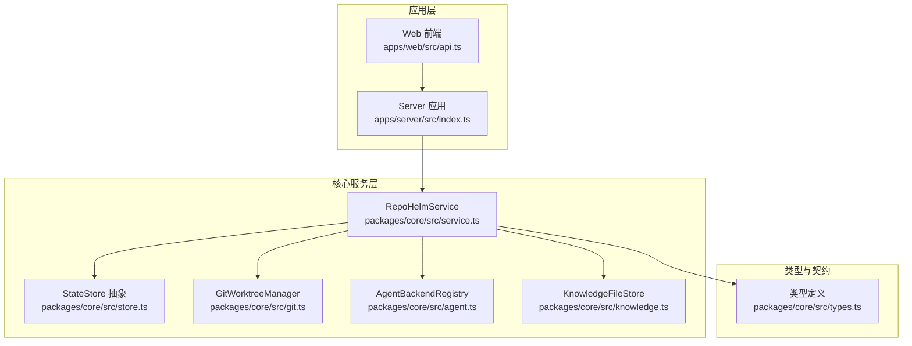
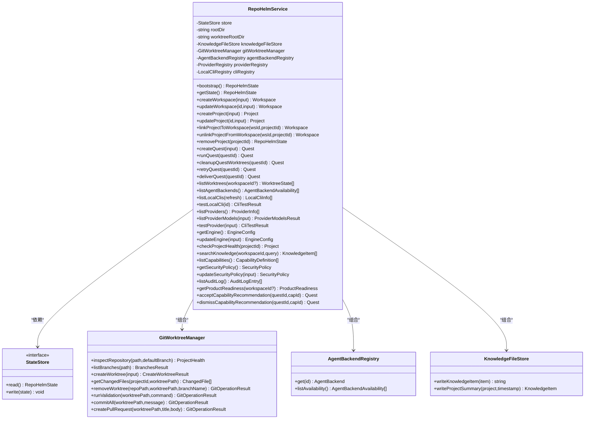
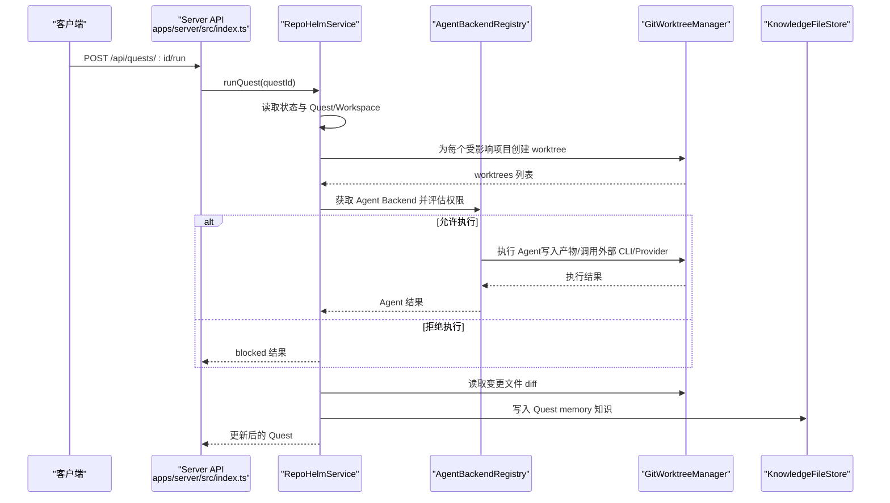
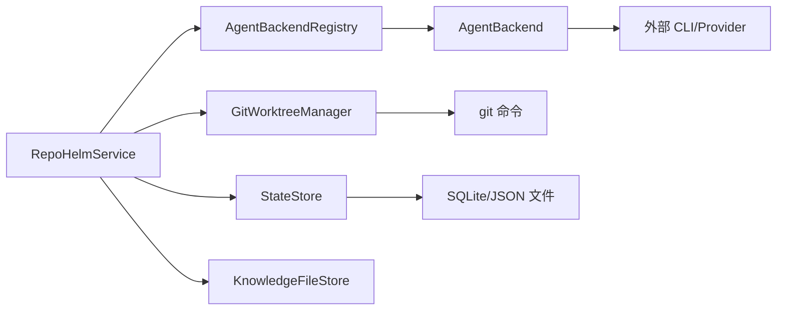

# RepoHelmService 主要逻辑

<cite>
**本文引用的文件**
- [packages/core/src/service.ts](file://packages/core/src/service.ts)
- [packages/core/src/store.ts](file://packages/core/src/store.ts)
- [packages/core/src/git.ts](file://packages/core/src/git.ts)
- [packages/core/src/agent.ts](file://packages/core/src/agent.ts)
- [packages/core/src/knowledge.ts](file://packages/core/src/knowledge.ts)
- [packages/core/src/types.ts](file://packages/core/src/types.ts)
- [apps/server/src/index.ts](file://apps/server/src/index.ts)
- [apps/web/src/api.ts](file://apps/web/src/api.ts)
</cite>

## 目录
1. [简介](#简介)
2. [项目结构](#项目结构)
3. [核心组件](#核心组件)
4. [架构总览](#架构总览)
5. [详细组件分析](#详细组件分析)
6. [依赖分析](#依赖分析)
7. [性能考虑](#性能考虑)
8. [故障排查指南](#故障排查指南)
9. [结论](#结论)
10. [附录](#附录)

## 简介
RepoHelmService 是 RepoHelm 的核心业务服务类，负责管理“虚拟 workspace + 多项目 Quest + Spec 驱动 + worktree 隔离 + Agent 编排 + 知识库”的端到端工作流。其职责包括：
- 初始化与状态管理（bootstrap）
- Workspace/Project/Quest 生命周期管理
- Git worktree 的创建、清理与交付
- Agent Backend 的注册与调度
- 知识库文件与元数据的持久化
- 安全策略与审计日志
- 引擎配置（CLI/Provider）与模型缓存

## 项目结构
RepoHelm 采用多包结构，核心业务位于 packages/core，服务端 API 在 apps/server，Web 前端在 apps/web。RepoHelmService 位于 core 包中，通过依赖注入的方式组合多个子系统。

图表来源
- [apps/server/src/index.ts:37](file://apps/server/src/index.ts#L37)
- [packages/core/src/service.ts:56](file://packages/core/src/service.ts#L56)
- [packages/core/src/store.ts:86](file://packages/core/src/store.ts#L86)
- [packages/core/src/git.ts:33](file://packages/core/src/git.ts#L33)
- [packages/core/src/agent.ts:395](file://packages/core/src/agent.ts#L395)
- [packages/core/src/knowledge.ts:12](file://packages/core/src/knowledge.ts#L12)
- [packages/core/src/types.ts:279](file://packages/core/src/types.ts#L279)

章节来源
- [apps/server/src/index.ts:13-37](file://apps/server/src/index.ts#L13-L37)
- [packages/core/src/service.ts:56](file://packages/core/src/service.ts#L56)

## 核心组件
- RepoHelmService：服务主类，封装所有业务方法与状态流转
- StateStore：状态持久化抽象，JsonStateStore 与 SqliteStateStore 实现
- GitWorktreeManager：Git worktree 生命周期管理（创建、清理、验证、提交、PR）
- AgentBackendRegistry：Agent Backend 注册表（mock、CLI、OpenAI-compatible）
- KnowledgeFileStore：知识库 Markdown 文件写入与渲染
- 类型系统：统一的数据结构与契约定义

章节来源
- [packages/core/src/service.ts:56](file://packages/core/src/service.ts#L56)
- [packages/core/src/store.ts:86](file://packages/core/src/store.ts#L86)
- [packages/core/src/git.ts:33](file://packages/core/src/git.ts#L33)
- [packages/core/src/agent.ts:395](file://packages/core/src/agent.ts#L395)
- [packages/core/src/knowledge.ts:12](file://packages/core/src/knowledge.ts#L12)
- [packages/core/src/types.ts:279](file://packages/core/src/types.ts#L279)

## 架构总览
RepoHelmService 通过构造函数注入 StateStore、根目录与可选的知识库/工作树根目录，内部组合 GitWorktreeManager、AgentBackendRegistry、ProviderRegistry、LocalCliRegistry、KnowledgeFileStore 等子系统。服务层负责：
- 状态读取与引导（bootstrap）
- Workspace/Project/Quest 的增删改查
- 基于安全策略的命令权限评估
- 与 Git/Agent/Knowledge 的协作
- 事件、审计日志与产品就绪度的维护

图表来源
- [packages/core/src/service.ts:56](file://packages/core/src/service.ts#L56)
- [packages/core/src/store.ts:86](file://packages/core/src/store.ts#L86)
- [packages/core/src/git.ts:33](file://packages/core/src/git.ts#L33)
- [packages/core/src/agent.ts:395](file://packages/core/src/agent.ts#L395)
- [packages/core/src/knowledge.ts:12](file://packages/core/src/knowledge.ts#L12)

## 详细组件分析

### 初始化与依赖注入
- 构造函数接收 StateStore、rootDir，并可选传入 knowledgeRootDir、worktreeRootDir
- 内部实例化 GitWorktreeManager、AgentBackendRegistry、ProviderRegistry、LocalCliRegistry、KnowledgeFileStore
- bootstrap 流程：
  - 读取状态，若为空则创建演示 Workspace/Project 并写入知识库摘要
  - 若状态存在，确保知识库 Markdown 文件存在并补齐 sourcePath
  - 返回规范化后的 RepoHelmState

章节来源
- [packages/core/src/service.ts:64](file://packages/core/src/service.ts#L64-L71)
- [packages/core/src/service.ts:73](file://packages/core/src/service.ts#L73-L133)
- [packages/core/src/service.ts:1078](file://packages/core/src/service.ts#L1078-L1098)
- [packages/core/src/service.ts:1100](file://packages/core/src/service.ts#L1100-L1129)

### 业务方法：Workspace 管理
- createWorkspace：根据 CreateWorkspaceInput 生成 Workspace，写入状态
- updateWorkspace：按 UpdateWorkspaceInput 更新名称/描述/工作树根目录
- linkProjectToWorkspace：为指定 Workspace 与 Project 创建 Git worktree，生成分支名与路径
- unlinkProjectFromWorkspace：删除 worktree 并清理对应分支
- removeProject：级联删除 Project，并清理所有 Workspace 中的关联与 worktree

章节来源
- [packages/core/src/service.ts:143](file://packages/core/src/service.ts#L143-L158)
- [packages/core/src/service.ts:160](file://packages/core/src/service.ts#L160-L177)
- [packages/core/src/service.ts:233](file://packages/core/src/service.ts#L233-L280)
- [packages/core/src/service.ts:282](file://packages/core/src/service.ts#L282-L303)
- [packages/core/src/service.ts:305](file://packages/core/src/service.ts#L305-L339)

### 业务方法：Project 管理
- createProject：根据 CreateProjectInput 创建 Project，并写入知识库项目摘要
- updateProject：按 UpdateProjectInput 更新字段，必要时重写知识库摘要
- checkProjectHealth：调用 GitWorktreeManager.inspectRepository 获取健康状态

章节来源
- [packages/core/src/service.ts:179](file://packages/core/src/service.ts#L179-L201)
- [packages/core/src/service.ts:203](file://packages/core/src/service.ts#L203-L231)
- [packages/core/src/service.ts:457](file://packages/core/src/service.ts#L457-L476)

### 业务方法：Quest 创建与执行
- createQuest：基于 CreateQuestInput 生成 Quest，计算相关知识与 Spec，生成初始事件
- runQuest：为受影响项目创建 worktree，评估 Agent Backend 权限，执行 Agent，收集变更文件，生成验证与评审意见，写入知识库记忆
- cleanupQuestWorktrees：清理已创建的 worktree
- retryQuest：清理后重跑
- deliverQuest：对已创建的 worktree 执行验证、提交、PR 创建，产出交付结果

图表来源
- [apps/server/src/index.ts:323](file://apps/server/src/index.ts#L323-L326)
- [packages/core/src/service.ts:544](file://packages/core/src/service.ts#L544-L698)
- [packages/core/src/agent.ts:395](file://packages/core/src/agent.ts#L395)
- [packages/core/src/git.ts:33](file://packages/core/src/git.ts#L33)
- [packages/core/src/knowledge.ts:12](file://packages/core/src/knowledge.ts#L12)

章节来源
- [packages/core/src/service.ts:478](file://packages/core/src/service.ts#L478-L542)
- [packages/core/src/service.ts:544](file://packages/core/src/service.ts#L544-L698)
- [packages/core/src/service.ts:713](file://packages/core/src/service.ts#L713-L755)
- [packages/core/src/service.ts:757](file://packages/core/src/service.ts#L757-L760)
- [packages/core/src/service.ts:762](file://packages/core/src/service.ts#L762-L881)

### 业务方法：引擎与模型
- getEngine/updateEngine：读取/更新引擎配置（mode/cliId/cliModels/byokProviders/activeByokProviderId）
- listLocalClis/testLocalCli：检测本地 CLI 并测试连通性
- listProviders/testProvider：列出 Provider 并真实探测 /models
- listProviderModels：带 TTL 的模型列表缓存（MODEL_CACHE_TTL_MS）

章节来源
- [packages/core/src/service.ts:359](file://packages/core/src/service.ts#L359-L389)
- [packages/core/src/service.ts:422](file://packages/core/src/service.ts#L422-L455)
- [packages/core/src/service.ts:457](file://packages/core/src/service.ts#L457-L476)
- [packages/core/src/service.ts:478](file://packages/core/src/service.ts#L478-L542)

### 业务方法：知识库与能力
- searchKnowledge：按 workspaceId 与查询词检索知识项
- listCapabilities：列出能力定义
- acceptCapabilityRecommendation/dismissCapabilityRecommendation：接受/忽略能力推荐，更新状态与审计日志

章节来源
- [packages/core/src/service.ts:883](file://packages/core/src/service.ts#L883-L886)
- [packages/core/src/service.ts:888](file://packages/core/src/service.ts#L888-L891)
- [packages/core/src/service.ts:1026](file://packages/core/src/service.ts#L1026-L1032)
- [packages/core/src/service.ts:1135](file://packages/core/src/service.ts#L1135-L1190)

### 业务方法：安全策略与审计
- getSecurityPolicy/updateSecurityPolicy：读取/更新安全策略（命令白名单、文件/网络作用域、secrets 策略、沙箱运行时）
- listAuditLog：列出最近审计日志
- evaluateCommandPermission：基于策略判断命令是否允许
- audit：生成审计条目

章节来源
- [packages/core/src/service.ts:893](file://packages/core/src/service.ts#L893-L914)
- [packages/core/src/service.ts:916](file://packages/core/src/service.ts#L916-L919)
- [packages/core/src/service.ts:1257](file://packages/core/src/service.ts#L1257-L1278)
- [packages/core/src/service.ts:1280](file://packages/core/src/service.ts#L1280-L1289)

### 业务方法：产品就绪度
- getProductReadiness：生成里程碑、工作区模板、依赖图与治理信息

章节来源
- [packages/core/src/service.ts:921](file://packages/core/src/service.ts#L921-L1024)

### API 层集成
- apps/server/src/index.ts：以 Hono 构建 REST API，注入 RepoHelmService（SqliteStateStore），暴露所有业务接口
- apps/web/src/api.ts：前端 API 封装，统一请求与响应类型

章节来源
- [apps/server/src/index.ts:37](file://apps/server/src/index.ts#L37)
- [apps/web/src/api.ts:291](file://apps/web/src/api.ts#L291-L422)

## 依赖分析
- 组件耦合
  - RepoHelmService 对 StateStore、GitWorktreeManager、AgentBackendRegistry、KnowledgeFileStore 存在强组合依赖
  - 低耦合体现在通过接口（StateStore）与注册表（AgentBackendRegistry）解耦具体实现
- 外部依赖
  - Git 命令行工具
  - 外部 CLI/Provider（通过环境变量配置）
  - 本地 SQLite（默认）
- 循环依赖
  - 未发现循环依赖，模块职责清晰

图表来源
- [packages/core/src/service.ts:56](file://packages/core/src/service.ts#L56)
- [packages/core/src/agent.ts:395](file://packages/core/src/agent.ts#L395)
- [packages/core/src/git.ts:33](file://packages/core/src/git.ts#L33)
- [packages/core/src/store.ts:117](file://packages/core/src/store.ts#L117)

章节来源
- [packages/core/src/service.ts:56](file://packages/core/src/service.ts#L56)
- [packages/core/src/agent.ts:395](file://packages/core/src/agent.ts#L395)
- [packages/core/src/git.ts:33](file://packages/core/src/git.ts#L33)
- [packages/core/src/store.ts:117](file://packages/core/src/store.ts#L117)

## 性能考虑
- 模型列表缓存：listProviderModels 使用 TTL（MODEL_CACHE_TTL_MS）减少对外部 Provider 的重复请求
- 并行操作：runQuest 中对多个项目 worktree 并行创建与 Agent 执行，提升吞吐
- 状态持久化：优先使用 SqliteStateStore，具备更好的并发与迁移能力
- Git 操作超时：交付验证与 Agent 执行均设置超时，避免阻塞
- 最佳实践
  - 合理设置 REPOHELM_DELIVERY_TIMEOUT_MS 与 REPOHELM_AGENT_TIMEOUT_MS
  - 控制一次 Quest 影响的项目数量，避免过多并行 worktree 导致资源争用
  - 使用安全策略白名单限制高风险命令，降低执行失败概率

章节来源
- [packages/core/src/service.ts:42](file://packages/core/src/service.ts#L42)
- [packages/core/src/service.ts:422](file://packages/core/src/service.ts#L422-L455)
- [packages/core/src/service.ts:557](file://packages/core/src/service.ts#L557-L586)
- [packages/core/src/git.ts:169](file://packages/core/src/git.ts#L169)
- [packages/core/src/agent.ts:228](file://packages/core/src/agent.ts#L228)

## 故障排查指南
- 项目健康检查失败
  - 检查项目路径是否存在、是否为 Git 仓库、默认分支配置
  - 使用 checkProjectHealth 触发重新检查
- worktree 创建失败
  - 确认 Git 工具可用、目标路径可写、基分支存在
  - 查看 GitWorktreeManager 的错误信息与 note 字段
- Agent 执行被拒绝
  - 检查安全策略命令白名单与 subject 命中规则
  - 查看审计日志中的 decision 与 detail
- 交付失败
  - 验证命令返回失败时会记录输出与 note
  - 提交失败通常因无变更或权限不足
  - PR 创建需开启 REPOHELM_ENABLE_GH_PR 并确保 gh 已认证

章节来源
- [packages/core/src/service.ts:457](file://packages/core/src/service.ts#L457-L476)
- [packages/core/src/git.ts:79](file://packages/core/src/git.ts#L79-L120)
- [packages/core/src/service.ts:589](file://packages/core/src/service.ts#L589-L615)
- [packages/core/src/service.ts:762](file://packages/core/src/service.ts#L762-L881)
- [packages/core/src/git.ts:159](file://packages/core/src/git.ts#L159-L187)
- [packages/core/src/git.ts:189](file://packages/core/src/git.ts#L189-L220)
- [packages/core/src/git.ts:222](file://packages/core/src/git.ts#L222-L249)

## 结论
RepoHelmService 以清晰的职责划分与模块化设计，实现了从 Workspace/Project/Quest 的全生命周期管理，结合 Git worktree 隔离与多 Agent Backend 的编排能力，构建了可审计、可扩展的软件研发工作流。通过 StateStore 的抽象与 Sqlite 的默认实现，保障了状态的一致性与迁移能力；通过安全策略与审计日志，提供了可控的执行边界。建议在生产环境中合理配置超时与白名单，充分利用并行与缓存机制提升性能。

## 附录
- 使用示例（路径引用）
  - 创建 Workspace：[apps/server/src/index.ts:225](file://apps/server/src/index.ts#L225-L229)
  - 创建 Project：[apps/server/src/index.ts:237](file://apps/server/src/index.ts#L237-L241)
  - 创建 Quest：[apps/server/src/index.ts:317](file://apps/server/src/index.ts#L317-L321)
  - 运行 Quest：[apps/server/src/index.ts:323](file://apps/server/src/index.ts#L323-L326)
  - 交付 Quest：[apps/server/src/index.ts:338](file://apps/server/src/index.ts#L338-L341)
  - 前端 API 调用封装：[apps/web/src/api.ts:331](file://apps/web/src/api.ts#L331-L346)
- 关键数据结构
  - RepoHelmState/Workspace/Project/Quest/KnowledgeItem 等：[packages/core/src/types.ts:279-334](file://packages/core/src/types.ts#L279-L334)
- 状态存储
  - JsonStateStore/SqliteStateStore：[packages/core/src/store.ts:91-165](file://packages/core/src/store.ts#L91-L165)