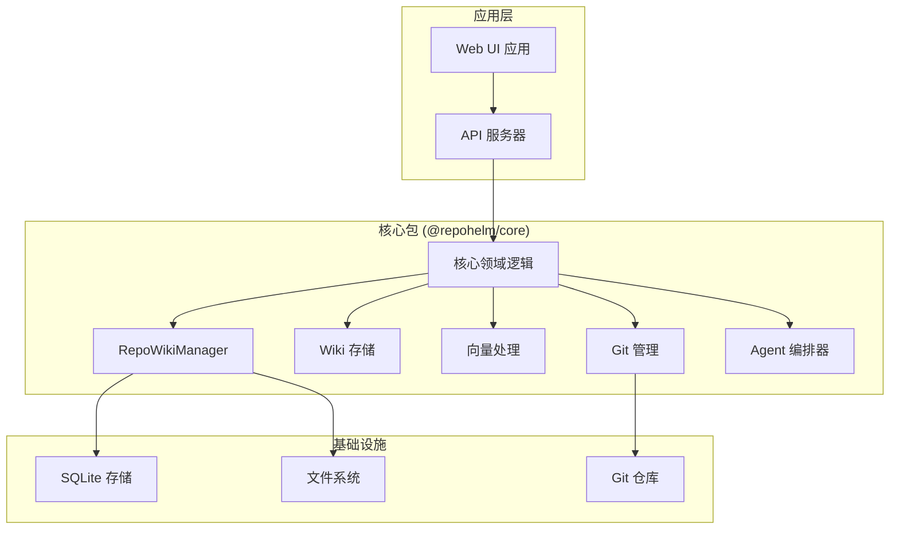
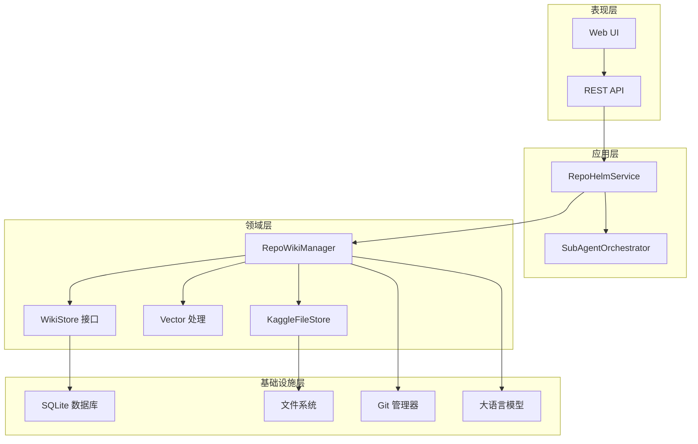
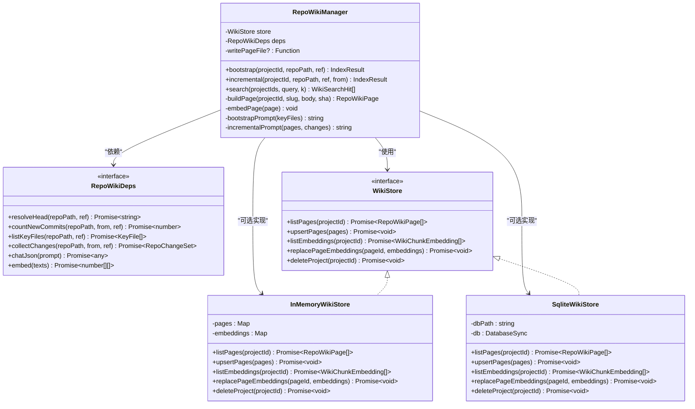
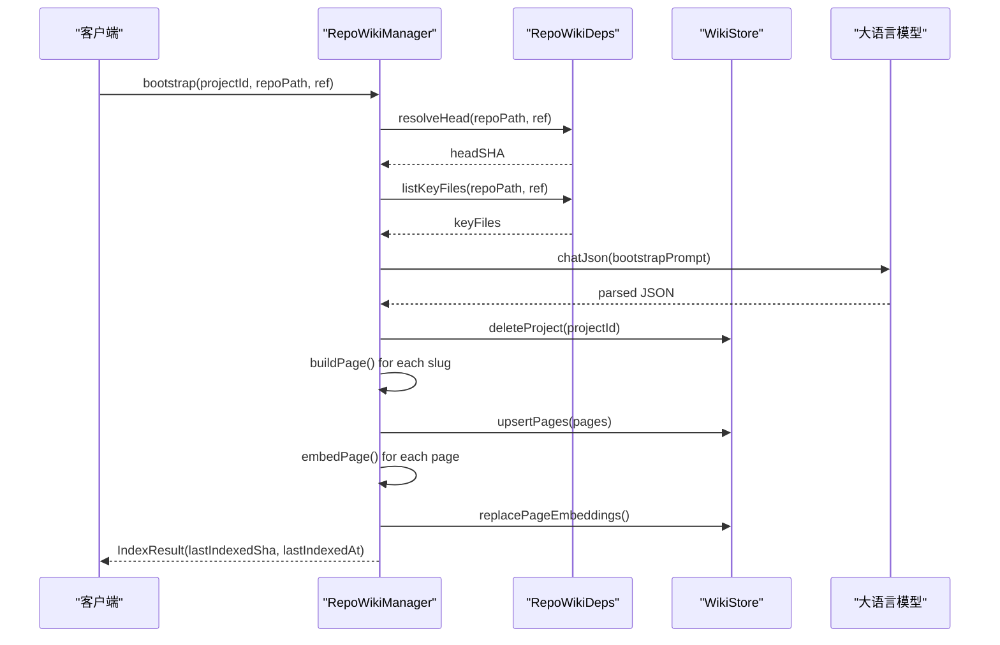
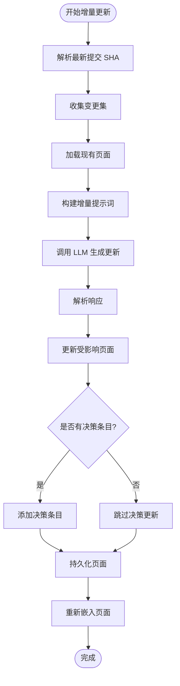
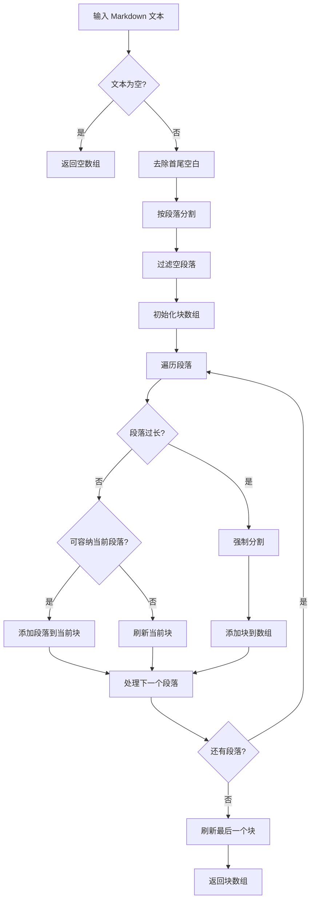
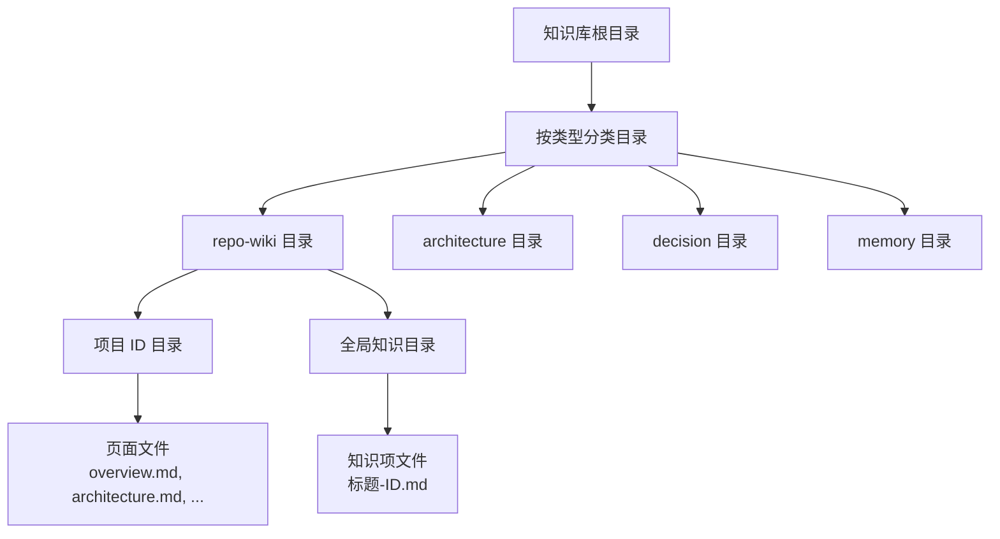
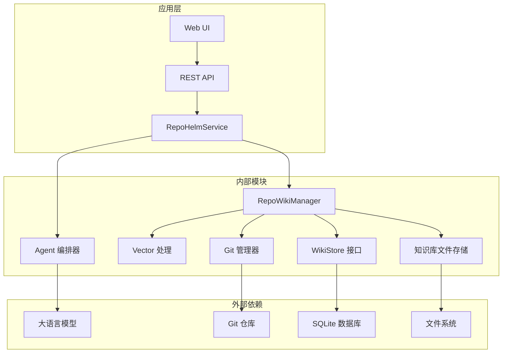

# RepoWikiManager 系统

<cite>
**本文档引用的文件**
- [README.md](file://README.md)
- [packages/core/src/repo-wiki.ts](file://packages/core/src/repo-wiki.ts)
- [packages/core/src/wiki-store.ts](file://packages/core/src/wiki-store.ts)
- [packages/core/src/knowledge.ts](file://packages/core/src/knowledge.ts)
- [packages/core/src/orchestrator.ts](file://packages/core/src/orchestrator.ts)
- [packages/core/src/types.ts](file://packages/core/src/types.ts)
- [packages/core/src/vector.ts](file://packages/core/src/vector.ts)
- [apps/server/src/index.ts](file://apps/server/src/index.ts)
- [apps/web/src/App.tsx](file://apps/web/src/App.tsx)
- [packages/core/src/repo-wiki.test.ts](file://packages/core/src/repo-wiki.test.ts)
- [packages/core/src/service.ts](file://packages/core/src/service.ts)
- [docs/architecture.md](file://docs/architecture.md)
- [docs/ui-layout.md](file://docs/ui-layout.md)
- [package.json](file://package.json)
- [packages/core/src/git.ts](file://packages/core/src/git.ts)
</cite>

## 目录
1. [简介](#简介)
2. [项目结构](#项目结构)
3. [核心组件](#核心组件)
4. [架构总览](#架构总览)
5. [详细组件分析](#详细组件分析)
6. [依赖关系分析](#依赖关系分析)
7. [性能考虑](#性能考虑)
8. [故障排除指南](#故障排除指南)
9. [结论](#结论)
10. [附录](#附录)

## 简介

RepoWikiManager 是 RepoHelm 生态系统中的核心知识库管理系统，负责为多项目软件研发任务提供结构化的知识库生成、维护和检索能力。该系统围绕"虚拟 workspace + 多项目 Quest + Spec 驱动 + worktree 隔离 + Agent 编排 + 知识库"的产品方向构建，旨在帮助开发者将需求转化为可审计、可隔离、可验证、可交付的研发任务。

RepoWikiManager 的核心功能包括：
- 自动化的仓库知识库生成（Bootstrap）
- 增量式知识库维护（Incremental）
- 向量相似度检索（Semantic Search）
- 多项目知识库管理
- 与 Agent 编排系统的深度集成

## 项目结构

RepoHelm 采用多包架构，主要包含以下核心模块：

**图表来源**
- [package.json:1-22](file://package.json#L1-L22)
- [README.md:1-100](file://README.md#L1-L100)

**章节来源**
- [package.json:1-22](file://package.json#L1-L22)
- [README.md:1-100](file://README.md#L1-L100)

## 核心组件

RepoWikiManager 系统由以下核心组件构成：

### 1. RepoWikiManager 核心类
负责知识库的完整生命周期管理，包括初始化、增量更新和检索功能。

### 2. WikiStore 存储接口
定义知识库数据的持久化接口，支持内存存储和 SQLite 存储两种实现。

### 3. 向量处理模块
提供文本分块、余弦相似度计算和语义检索功能。

### 4. 知识库文件存储
负责将知识库页面持久化为 Markdown 文件，支持知识库的文件系统存储。

**章节来源**
- [packages/core/src/repo-wiki.ts:48-223](file://packages/core/src/repo-wiki.ts#L48-L223)
- [packages/core/src/wiki-store.ts:6-130](file://packages/core/src/wiki-store.ts#L6-L130)
- [packages/core/src/vector.ts:1-70](file://packages/core/src/vector.ts#L1-L70)
- [packages/core/src/knowledge.ts:12-81](file://packages/core/src/knowledge.ts#L12-L81)

## 架构总览

RepoWikiManager 采用分层架构设计，将领域逻辑与基础设施适配分离：

**图表来源**
- [docs/architecture.md:278-312](file://docs/architecture.md#L278-L312)
- [apps/server/src/index.ts:1-660](file://apps/server/src/index.ts#L1-L660)

**章节来源**
- [docs/architecture.md:1-800](file://docs/architecture.md#L1-L800)
- [apps/server/src/index.ts:1-660](file://apps/server/src/index.ts#L1-L660)

## 详细组件分析

### RepoWikiManager 组件分析

RepoWikiManager 是知识库系统的核心控制器，负责管理知识库的完整生命周期。

#### 类关系图

**图表来源**
- [packages/core/src/repo-wiki.ts:30-53](file://packages/core/src/repo-wiki.ts#L30-L53)
- [packages/core/src/wiki-store.ts:6-51](file://packages/core/src/wiki-store.ts#L6-L51)
- [packages/core/src/wiki-store.ts:54-129](file://packages/core/src/wiki-store.ts#L54-L129)

#### Bootstrap 流程序列图

**图表来源**
- [packages/core/src/repo-wiki.ts:63-80](file://packages/core/src/repo-wiki.ts#L63-L80)
- [packages/core/src/repo-wiki.ts:184-195](file://packages/core/src/repo-wiki.ts#L184-L195)

#### Incremental 更新流程

**图表来源**
- [packages/core/src/repo-wiki.ts:82-116](file://packages/core/src/repo-wiki.ts#L82-L116)
- [packages/core/src/repo-wiki.ts:197-221](file://packages/core/src/repo-wiki.ts#L197-L221)

**章节来源**
- [packages/core/src/repo-wiki.ts:48-223](file://packages/core/src/repo-wiki.ts#L48-L223)
- [packages/core/src/repo-wiki.test.ts:27-89](file://packages/core/src/repo-wiki.test.ts#L27-L89)

### WikiStore 存储组件分析

WikiStore 提供了知识库数据的抽象存储接口，支持多种存储后端。

#### 存储实现对比

| 实现类 | 特性 | 适用场景 | 性能特点 |
|--------|------|----------|----------|
| InMemoryWikiStore | 内存存储 | 测试、临时使用 | 高速读写，无持久化 |
| SqliteWikiStore | SQLite 持久化 | 生产环境，数据持久化 | 本地存储，事务安全 |

**章节来源**
- [packages/core/src/wiki-store.ts:14-129](file://packages/core/src/wiki-store.ts#L14-L129)

### 向量处理组件分析

向量处理模块提供了知识库的语义检索能力。

#### 文本分块算法

**图表来源**
- [packages/core/src/vector.ts:24-57](file://packages/core/src/vector.ts#L24-L57)

**章节来源**
- [packages/core/src/vector.ts:1-70](file://packages/core/src/vector.ts#L1-L70)

### 知识库文件存储分析

知识库文件存储负责将知识库页面持久化为 Markdown 文件。

#### 文件存储结构

**图表来源**
- [packages/core/src/knowledge.ts:15-56](file://packages/core/src/knowledge.ts#L15-L56)

**章节来源**
- [packages/core/src/knowledge.ts:12-81](file://packages/core/src/knowledge.ts#L12-L81)

## 依赖关系分析

RepoWikiManager 系统的依赖关系体现了清晰的分层架构：

**图表来源**
- [packages/core/src/service.ts:76-102](file://packages/core/src/service.ts#L76-L102)
- [apps/server/src/index.ts:37-41](file://apps/server/src/index.ts#L37-L41)

**章节来源**
- [packages/core/src/service.ts:76-102](file://packages/core/src/service.ts#L76-L102)
- [apps/server/src/index.ts:37-41](file://apps/server/src/index.ts#L37-L41)

## 性能考虑

RepoWikiManager 在设计时充分考虑了性能优化：

### 1. 增量索引策略
- 仅对受影响的页面进行更新
- 基于提交历史的差异分析
- 避免全量重建知识库

### 2. 向量嵌入优化
- 支持嵌入模型不可用时的降级策略
- 分块处理避免超长文本
- 余弦相似度计算的数值稳定性

### 3. 存储性能
- SQLite WAL 模式提高并发性能
- 索引优化查询性能
- 内存存储用于测试和临时场景

### 4. API 性能
- 异步操作避免阻塞
- 错误重试机制
- 资源清理和释放

## 故障排除指南

### 常见问题及解决方案

#### 1. 知识库生成失败
**症状**: Bootstrap 过程抛出异常
**可能原因**:
- LLM API 配置错误
- 仓库访问权限不足
- 网络连接问题

**解决方法**:
- 检查模型配置和 API 密钥
- 验证仓库路径和权限
- 确认网络连接正常

#### 2. 向量嵌入异常
**症状**: 知识库页面无法正确检索
**可能原因**:
- 嵌入模型未配置
- 文本预处理错误
- 向量维度不匹配

**解决方法**:
- 配置嵌入模型 Kit
- 检查文本分块逻辑
- 验证向量维度一致性

#### 3. 存储连接问题
**症状**: 知识库数据丢失或损坏
**可能原因**:
- SQLite 数据库文件损坏
- 文件系统权限问题
- 并发写入冲突

**解决方法**:
- 检查数据库文件完整性
- 验证文件系统权限
- 实施写入队列避免并发冲突

**章节来源**
- [packages/core/src/repo-wiki.ts:162-170](file://packages/core/src/repo-wiki.ts#L162-L170)
- [packages/core/src/wiki-store.ts:62-87](file://packages/core/src/wiki-store.ts#L62-L87)

## 结论

RepoWikiManager 系统是一个设计精良的知识库管理解决方案，具有以下特点：

### 优势
1. **模块化设计**: 清晰的分层架构，职责分离明确
2. **可扩展性**: 支持多种存储后端和模型提供商
3. **性能优化**: 增量索引、向量检索等优化策略
4. **可靠性**: 完善的错误处理和降级机制
5. **集成性**: 与 Agent 编排系统深度集成

### 技术亮点
- 基于 Git 的版本控制集成
- 语义检索与关键词检索结合
- 多项目知识库统一管理
- 本地优先的存储架构

### 发展方向
RepoWikiManager 为 RepoHelm 生态系统提供了坚实的知识基础，支持多项目软件研发任务的高效执行。随着系统的不断完善，它将在以下方面持续发展：
- 更强大的语义检索能力
- 更丰富的知识库类型支持
- 更智能的知识库维护策略
- 更完善的性能监控和优化

## 附录

### API 接口规范

RepoWikiManager 通过 REST API 提供知识库管理功能：

| 端点 | 方法 | 功能 | 请求体 | 响应 |
|------|------|------|--------|------|
| `/api/projects/:id/knowledge/sync` | POST | 同步项目知识库 | `{}` | ProjectKnowledgeView |
| `/api/projects/:id/knowledge` | PATCH | 更新知识库分支 | `{ knowledgeBranch: string }` | Project |
| `/api/projects/:id/knowledge` | GET | 获取项目知识库视图 | 查询参数 q | ProjectKnowledgeView |
| `/api/workspaces/:id/knowledge` | GET | 搜索工作区知识库 | 查询参数 q | KnowledgeItem[] |

### 配置选项

系统支持多种配置选项来定制知识库行为：

- `REPOHELM_EMBEDDING_MODEL_KIT_ID`: 嵌入模型 Kit ID
- `REPOHELM_KNOWLEDGE_ROOT`: 知识库文件存储根目录
- `REPOHELM_FAKE_MODELS`: 启用模拟模型进行测试
- `REPOHELM_DELIVERY_TIMEOUT_MS`: 交付验证超时时间

**章节来源**
- [apps/server/src/index.ts:292-313](file://apps/server/src/index.ts#L292-L313)
- [packages/core/src/service.ts:119-159](file://packages/core/src/service.ts#L119-L159)