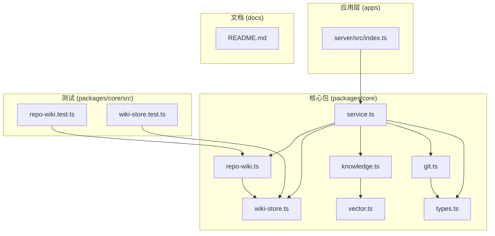
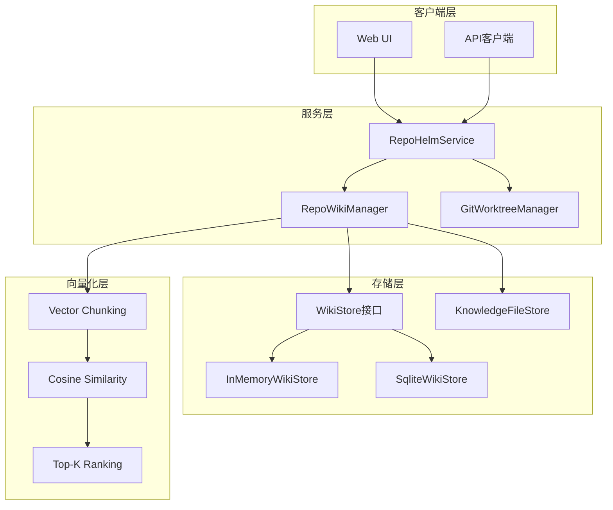
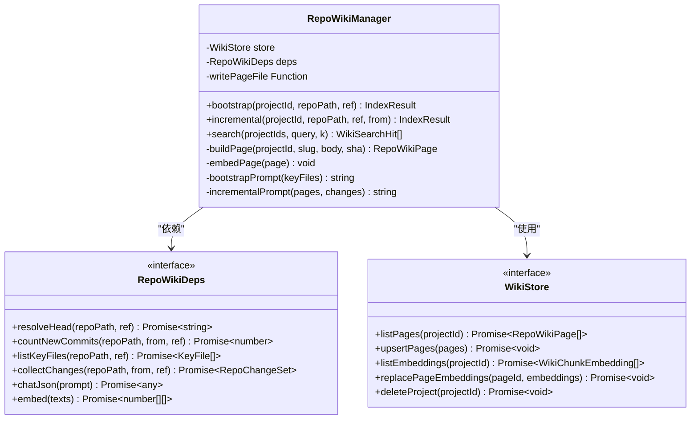
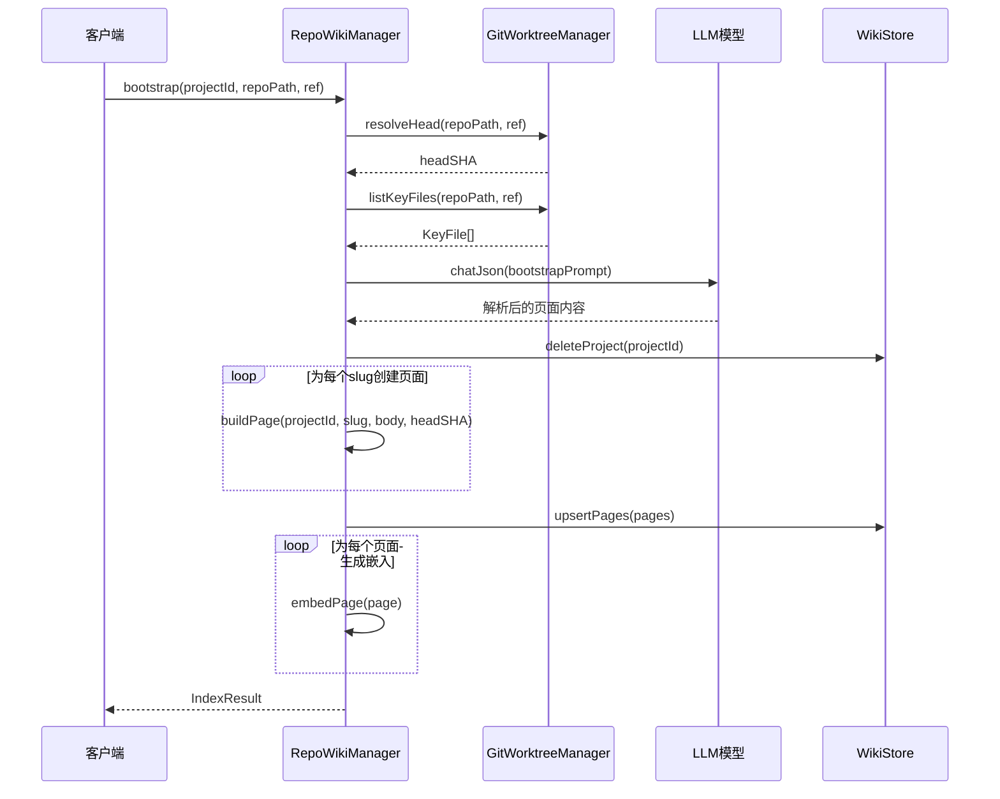
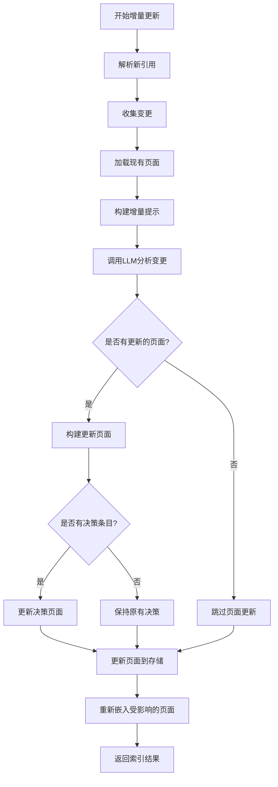
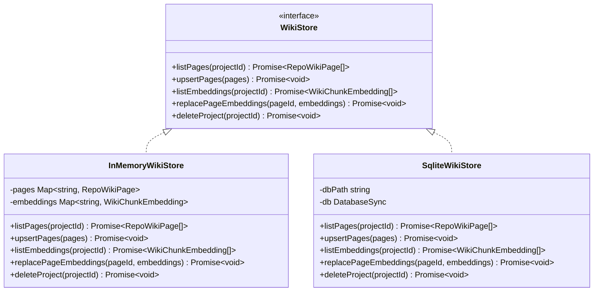
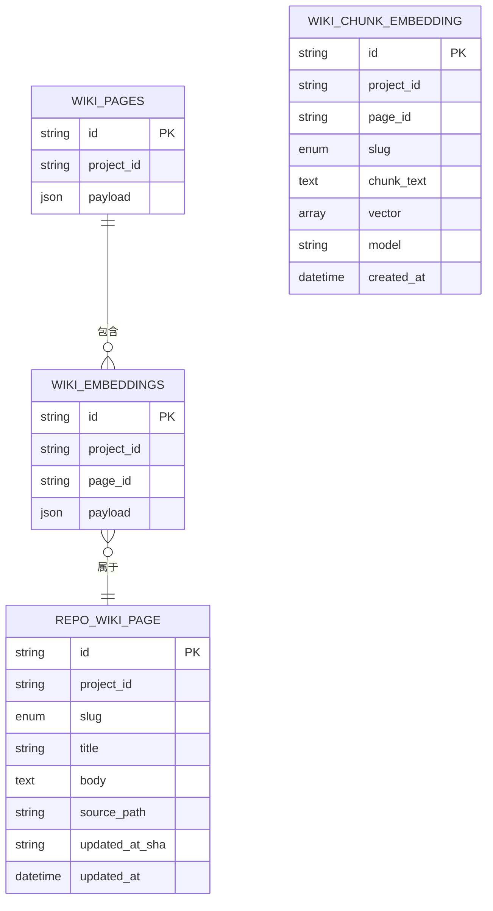
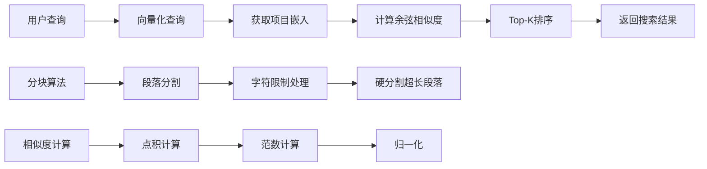
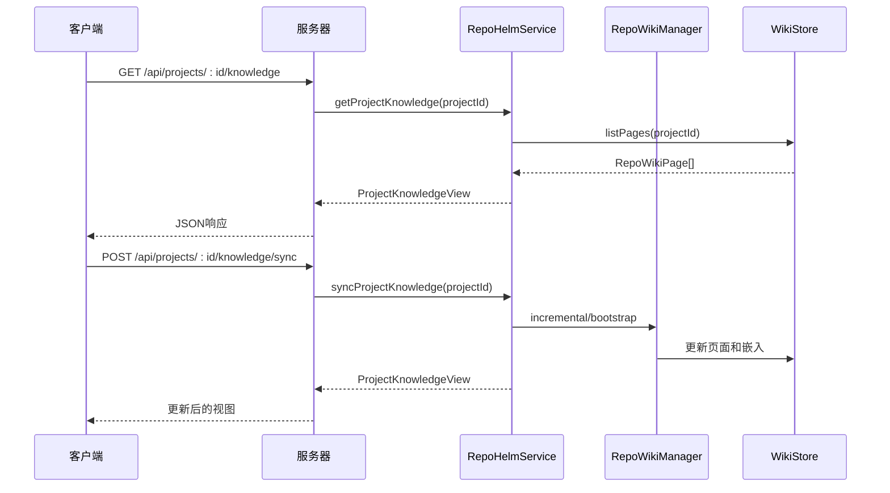
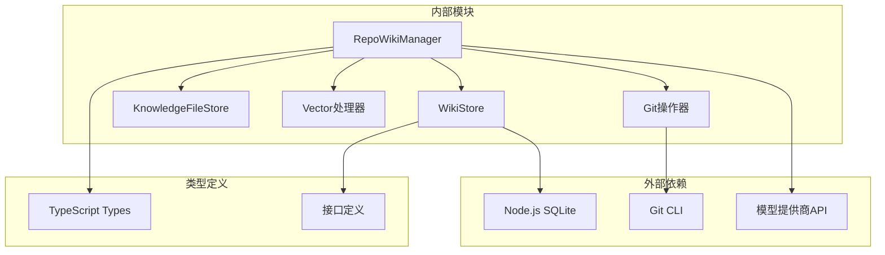

# Wiki存储系统

<cite>
**本文档引用的文件**
- [packages/core/src/repo-wiki.ts](file://packages/core/src/repo-wiki.ts)
- [packages/core/src/wiki-store.ts](file://packages/core/src/wiki-store.ts)
- [packages/core/src/knowledge.ts](file://packages/core/src/knowledge.ts)
- [packages/core/src/vector.ts](file://packages/core/src/vector.ts)
- [packages/core/src/git.ts](file://packages/core/src/git.ts)
- [packages/core/src/types.ts](file://packages/core/src/types.ts)
- [packages/core/src/service.ts](file://packages/core/src/service.ts)
- [apps/server/src/index.ts](file://apps/server/src/index.ts)
- [packages/core/src/repo-wiki.test.ts](file://packages/core/src/repo-wiki.test.ts)
- [packages/core/src/wiki-store.test.ts](file://packages/core/src/wiki-store.test.ts)
- [README.md](file://README.md)
</cite>

## 目录
1. [简介](#简介)
2. [项目结构](#项目结构)
3. [核心组件](#核心组件)
4. [架构概览](#架构概览)
5. [详细组件分析](#详细组件分析)
6. [依赖关系分析](#依赖关系分析)
7. [性能考虑](#性能考虑)
8. [故障排除指南](#故障排除指南)
9. [结论](#结论)

## 简介

Wiki存储系统是RepoHelm项目中的核心知识管理组件，负责将代码库转换为结构化的维基页面，并提供智能搜索功能。该系统采用混合存储架构，结合了内存存储和SQLite持久化，支持向量化搜索和关键词搜索两种检索方式。

系统的主要功能包括：
- 自动生成代码库维基页面（概览、架构、模块、关键流程、约定、决策日志）
- 支持增量索引和全量重建
- 提供语义搜索和关键词搜索
- 支持嵌入向量的持久化和查询
- 与Git工作流无缝集成

## 项目结构



**图表来源**
- [packages/core/src/repo-wiki.ts:1-223](file://packages/core/src/repo-wiki.ts#L1-L223)
- [packages/core/src/wiki-store.ts:1-130](file://packages/core/src/wiki-store.ts#L1-L130)
- [packages/core/src/service.ts:1-200](file://packages/core/src/service.ts#L1-L200)

**章节来源**
- [packages/core/src/repo-wiki.ts:1-223](file://packages/core/src/repo-wiki.ts#L1-L223)
- [packages/core/src/wiki-store.ts:1-130](file://packages/core/src/wiki-store.ts#L1-L130)
- [packages/core/src/service.ts:1-200](file://packages/core/src/service.ts#L1-L200)

## 核心组件

### RepoWikiManager（维基管理器）

RepoWikiManager是系统的核心控制器，负责：
- 维基页面的创建、更新和删除
- 增量索引和全量重建
- 搜索功能的实现
- 页面嵌入向量的生成和管理

### WikiStore接口及实现

WikiStore定义了知识存储的标准接口，提供了两种实现：
- **InMemoryWikiStore**：内存存储，适用于测试和临时使用
- **SqliteWikiStore**：持久化存储，生产环境推荐使用

### KnowledgeFileStore（知识文件存储）

负责将维基页面和知识项写入文件系统，采用Markdown格式存储。

### 向量化组件

系统实现了完整的向量化搜索功能：
- Markdown文本分块算法
- 余弦相似度计算
- Top-K相似度排序

**章节来源**
- [packages/core/src/repo-wiki.ts:48-223](file://packages/core/src/repo-wiki.ts#L48-L223)
- [packages/core/src/wiki-store.ts:6-130](file://packages/core/src/wiki-store.ts#L6-L130)
- [packages/core/src/knowledge.ts:12-81](file://packages/core/src/knowledge.ts#L12-L81)
- [packages/core/src/vector.ts:1-70](file://packages/core/src/vector.ts#L1-L70)

## 架构概览



**图表来源**
- [packages/core/src/service.ts:76-102](file://packages/core/src/service.ts#L76-L102)
- [packages/core/src/repo-wiki.ts:48-80](file://packages/core/src/repo-wiki.ts#L48-L80)
- [packages/core/src/wiki-store.ts:14-51](file://packages/core/src/wiki-store.ts#L14-L51)

## 详细组件分析

### RepoWikiManager类分析



**图表来源**
- [packages/core/src/repo-wiki.ts:30-53](file://packages/core/src/repo-wiki.ts#L30-L53)
- [packages/core/src/wiki-store.ts:6-12](file://packages/core/src/wiki-store.ts#L6-L12)

#### Bootstrap流程序列图



**图表来源**
- [packages/core/src/repo-wiki.ts:63-80](file://packages/core/src/repo-wiki.ts#L63-L80)
- [packages/core/src/repo-wiki.ts:134-154](file://packages/core/src/repo-wiki.ts#L134-L154)

#### 增量更新流程



**图表来源**
- [packages/core/src/repo-wiki.ts:82-116](file://packages/core/src/repo-wiki.ts#L82-L116)
- [packages/core/src/repo-wiki.ts:197-221](file://packages/core/src/repo-wiki.ts#L197-L221)

**章节来源**
- [packages/core/src/repo-wiki.ts:48-223](file://packages/core/src/repo-wiki.ts#L48-L223)

### WikiStore存储实现



**图表来源**
- [packages/core/src/wiki-store.ts:6-51](file://packages/core/src/wiki-store.ts#L6-L51)
- [packages/core/src/wiki-store.ts:54-129](file://packages/core/src/wiki-store.ts#L54-L129)

#### 数据模型关系



**图表来源**
- [packages/core/src/wiki-store.ts:69-84](file://packages/core/src/wiki-store.ts#L69-L84)
- [packages/core/src/types.ts:255-275](file://packages/core/src/types.ts#L255-L275)

**章节来源**
- [packages/core/src/wiki-store.ts:1-130](file://packages/core/src/wiki-store.ts#L1-L130)
- [packages/core/src/types.ts:255-297](file://packages/core/src/types.ts#L255-L297)

### 搜索功能实现



**图表来源**
- [packages/core/src/repo-wiki.ts:118-132](file://packages/core/src/repo-wiki.ts#L118-L132)
- [packages/core/src/vector.ts:24-69](file://packages/core/src/vector.ts#L24-L69)

**章节来源**
- [packages/core/src/vector.ts:1-70](file://packages/core/src/vector.ts#L1-L70)

### API集成



**图表来源**
- [apps/server/src/index.ts:297-313](file://apps/server/src/index.ts#L297-L313)
- [packages/core/src/service.ts:180-200](file://packages/core/src/service.ts#L180-L200)

**章节来源**
- [apps/server/src/index.ts:292-313](file://apps/server/src/index.ts#L292-L313)
- [packages/core/src/service.ts:180-200](file://packages/core/src/service.ts#L180-L200)

## 依赖关系分析



**图表来源**
- [packages/core/src/repo-wiki.ts:1-5](file://packages/core/src/repo-wiki.ts#L1-L5)
- [packages/core/src/wiki-store.ts:1-4](file://packages/core/src/wiki-store.ts#L1-L4)

### 关键依赖关系

| 组件 | 主要依赖 | 用途 |
|------|----------|------|
| RepoWikiManager | WikiStore, GitWorktreeManager | 维基页面管理 |
| WikiStore | Node.js SQLite | 数据持久化 |
| KnowledgeFileStore | Node.js FS | 文件系统写入 |
| Vector处理器 | 数学计算 | 语义搜索 |
| GitWorktreeManager | Git CLI | 版本控制集成 |

**章节来源**
- [packages/core/src/repo-wiki.ts:1-5](file://packages/core/src/repo-wiki.ts#L1-L5)
- [packages/core/src/wiki-store.ts:1-4](file://packages/core/src/wiki-store.ts#L1-L4)

## 性能考虑

### 存储性能优化

1. **索引设计**
   - wiki_pages表：按project_id建立索引
   - wiki_embeddings表：按project_id和page_id建立复合索引

2. **内存管理**
   - InMemoryWikiStore适用于小规模数据和测试
   - SqliteWikiStore支持大数据集的持久化存储

3. **向量化性能**
   - 分块大小优化：默认1200字符
   - 批量嵌入处理
   - 缓存机制避免重复计算

### 搜索性能优化

1. **相似度计算优化**
   - 余弦相似度预计算
   - Top-K算法减少比较次数
   - 向量化操作提升计算效率

2. **查询优化**
   - 早期终止条件
   - 结果集大小限制
   - 内存友好的流式处理

## 故障排除指南

### 常见问题及解决方案

#### 1. 嵌入向量生成失败

**症状**：索引过程中出现EMBEDDING_DISABLED错误

**原因**：
- 未配置嵌入模型
- 模型API密钥无效
- 网络连接问题

**解决方案**：
```typescript
// 检查模型配置
const state = await service.getState();
const embeddingKit = state.engine.modelKits[state.engine.embeddingModelKitId];

// 回退到关键词搜索
if (!embeddingKit) {
    // 使用关键词搜索替代
    return this.searchKeywords(projectIds, query, k);
}
```

#### 2. Git操作失败

**症状**：工作树创建或文件变更检测失败

**原因**：
- Git路径不存在
- 权限不足
- Git仓库损坏

**解决方案**：
```typescript
// 验证Git仓库状态
const health = await gitWorktreeManager.inspectRepository(repoPath, defaultBranch);
if (health.status !== 'ok') {
    throw new Error(`Git仓库不可用: ${health.message}`);
}
```

#### 3. SQLite存储问题

**症状**：数据库连接失败或数据损坏

**解决方案**：
```typescript
// 检查数据库状态
try {
    const db = sqliteWikiStore.database();
    db.prepare("PRAGMA integrity_check").get();
} catch (error) {
    // 重建数据库
    sqliteWikiStore.rebuildDatabase();
}
```

**章节来源**
- [packages/core/src/repo-wiki.ts:163-170](file://packages/core/src/repo-wiki.ts#L163-L170)
- [packages/core/src/git.ts:49-77](file://packages/core/src/git.ts#L49-L77)
- [packages/core/src/wiki-store.ts:62-87](file://packages/core/src/wiki-store.ts#L62-L87)

## 结论

Wiki存储系统为RepoHelm提供了强大的知识管理能力，通过以下特性实现了高效的知识组织和检索：

### 核心优势

1. **混合存储架构**：结合内存和持久化存储，满足不同场景需求
2. **智能索引**：自动化的维基页面生成和增量更新
3. **语义搜索**：支持向量化搜索和关键词搜索的混合模式
4. **Git深度集成**：与版本控制系统无缝协作
5. **可扩展性**：模块化设计支持功能扩展和定制

### 技术特点

- **类型安全**：完整的TypeScript类型定义
- **测试覆盖**：全面的单元测试和集成测试
- **错误处理**：健壮的异常处理和恢复机制
- **性能优化**：针对大数据集的优化设计

### 发展方向

1. **模型集成增强**：支持更多类型的AI模型
2. **搜索算法优化**：改进语义搜索的准确性
3. **存储扩展**：支持分布式存储方案
4. **用户体验**：提供更丰富的搜索和浏览功能

该系统为代码库知识管理提供了一个坚实的基础，能够有效支持团队协作和知识传承需求。